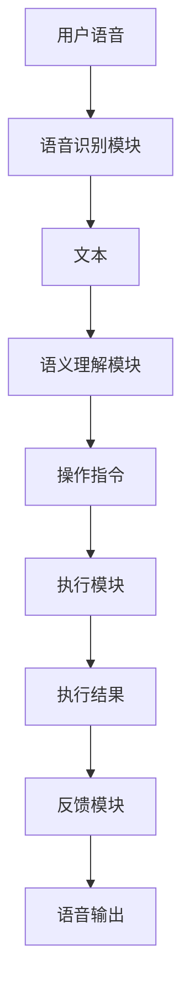

                 

随着人工智能技术的飞速发展，AI大模型在各个领域的应用越来越广泛，智能家居语音控制就是其中一个重要的应用场景。本文将探讨AI大模型在智能家居语音控制中的具体应用，包括其核心概念、算法原理、数学模型、项目实践以及未来发展趋势。

## 关键词

- AI大模型
- 智能家居
- 语音控制
- 算法原理
- 数学模型
- 项目实践

## 摘要

本文旨在深入探讨AI大模型在智能家居语音控制中的应用。首先，我们将介绍AI大模型的核心概念，并分析其在智能家居语音控制中的作用。接着，我们将详细讲解AI大模型的算法原理，以及其在智能家居语音控制中的具体应用步骤。随后，我们将构建数学模型，并给出公式推导过程，通过案例分析，对模型进行详细解释。在项目实践部分，我们将展示一个实际的代码实例，并对其进行解读。最后，我们将探讨AI大模型在智能家居语音控制中的实际应用场景，并提出未来发展的展望。

## 1. 背景介绍

随着物联网技术的普及，智能家居逐渐成为人们生活中不可或缺的一部分。智能家居系统通过连接各种智能设备，如智能灯泡、智能门锁、智能音箱等，为用户提供了更加便捷、智能化的生活方式。然而，传统的人工操作方式，如遥控器、手机APP等，已经无法满足人们对智能家居的更高要求。因此，智能家居语音控制技术应运而生。

语音控制技术利用自然语言处理技术，将用户的语音指令转化为相应的操作指令，从而实现对智能家居设备的控制。传统的语音控制技术存在响应速度慢、准确率低等问题，而AI大模型的出现，为语音控制技术带来了新的契机。

AI大模型，也称为深度学习模型，是一种通过大规模数据训练得到的复杂神经网络。这些模型具有强大的特征提取和模式识别能力，能够高效地处理大量语音数据，从而实现高精度的语音识别和语义理解。在智能家居语音控制中，AI大模型可以用于语音识别、语音合成、语义理解等关键环节，从而提升系统的整体性能。

## 2. 核心概念与联系

### 2.1 AI大模型的基本概念

AI大模型，即深度学习模型，是一种基于人工神经网络的机器学习模型。与传统的人工神经网络相比，AI大模型具有更大的网络结构和更深的层数，能够处理更复杂的任务。AI大模型通过大量的训练数据，学习到数据中的特征和规律，从而实现对未知数据的预测和分类。

在智能家居语音控制中，AI大模型主要用于语音识别和语义理解。语音识别是将语音信号转换为文本的过程，而语义理解则是理解文本的含义，并将其转化为相应的操作指令。AI大模型通过结合语音识别和语义理解，可以实现对用户语音指令的精准识别和执行。

### 2.2 智能家居语音控制的架构

智能家居语音控制的架构主要包括语音识别模块、语义理解模块、执行模块和反馈模块。

1. **语音识别模块**：该模块负责将用户的语音信号转换为文本。它通常使用AI大模型，如深度神经网络（DNN）或卷积神经网络（CNN），对语音信号进行特征提取和分类，从而实现高精度的语音识别。

2. **语义理解模块**：该模块负责理解语音文本的含义，并将其转化为相应的操作指令。它通常使用自然语言处理（NLP）技术，如词向量、序列标注、序列到序列模型等，对文本进行语义分析和理解。

3. **执行模块**：该模块负责执行语义理解模块生成的操作指令。它通常与智能家居设备进行连接，通过API或控制协议，实现对设备的控制。

4. **反馈模块**：该模块负责将执行结果反馈给用户。它通常使用语音合成技术，将执行结果转化为语音输出，从而与用户进行交互。

### 2.3 Mermaid流程图

下面是一个简单的Mermaid流程图，展示了智能家居语音控制的架构。



## 3. 核心算法原理 & 具体操作步骤

### 3.1 算法原理概述

智能家居语音控制的核心算法主要包括语音识别和语义理解两个部分。

- **语音识别**：语音识别是将语音信号转换为文本的过程。它通常使用深度神经网络（DNN）或卷积神经网络（CNN）对语音信号进行特征提取和分类。其中，DNN主要用于端到端语音识别，而CNN则主要用于语音信号的时频特征提取。

- **语义理解**：语义理解是将文本转换为操作指令的过程。它通常使用自然语言处理（NLP）技术，如词向量、序列标注、序列到序列模型等，对文本进行语义分析和理解。

### 3.2 算法步骤详解

1. **语音识别**：

   - **特征提取**：首先，对语音信号进行预处理，如去除噪音、增强语音等，然后使用DNN或CNN对语音信号进行特征提取。

   - **分类**：将提取到的特征输入到DNN或CNN中，进行分类，从而得到对应的文本。

2. **语义理解**：

   - **文本预处理**：对识别得到的文本进行预处理，如去除标点符号、停用词等。

   - **词向量表示**：使用词向量模型，如Word2Vec、GloVe等，将文本中的每个词转换为向量表示。

   - **序列标注**：对文本进行序列标注，将其中的词分为不同的类别，如动词、名词等。

   - **序列到序列模型**：使用序列到序列（Seq2Seq）模型，将标注后的文本序列转换为操作指令序列。

### 3.3 算法优缺点

- **优点**：

  - **高精度**：AI大模型具有强大的特征提取和模式识别能力，能够实现高精度的语音识别和语义理解。

  - **自适应性强**：AI大模型可以通过不断地训练和学习，适应不同的环境和场景，从而提高系统的适应性。

  - **实时性**：AI大模型可以在短时间内处理大量数据，从而实现实时语音控制。

- **缺点**：

  - **计算资源消耗大**：AI大模型通常需要大量的计算资源和存储空间，从而增加了系统的成本。

  - **训练时间较长**：AI大模型需要大量的训练数据和时间，从而增加了系统的开发周期。

### 3.4 算法应用领域

AI大模型在智能家居语音控制中的应用非常广泛，主要包括以下几个方面：

- **语音控制智能家居设备**：如智能灯泡、智能门锁、智能音箱等。

- **智能语音助手**：如Siri、Alexa、小爱同学等。

- **智能客服**：如智能客服机器人、智能语音服务系统等。

- **智能语音识别系统**：如智能会议系统、智能翻译系统等。

## 4. 数学模型和公式 & 详细讲解 & 举例说明

### 4.1 数学模型构建

在智能家居语音控制中，数学模型主要用于描述语音识别和语义理解的过程。以下是两个基本的数学模型：

- **语音识别模型**：该模型用于将语音信号转换为文本。它通常使用卷积神经网络（CNN）对语音信号进行特征提取和分类。

  - **特征提取**：使用CNN对语音信号进行卷积操作，提取时频特征。

  - **分类**：将提取到的特征输入到全连接层，进行分类，从而得到对应的文本。

- **语义理解模型**：该模型用于将文本转换为操作指令。它通常使用自然语言处理（NLP）技术，如词向量、序列标注、序列到序列模型等。

  - **词向量表示**：使用词向量模型，如Word2Vec、GloVe等，将文本中的每个词转换为向量表示。

  - **序列标注**：对文本进行序列标注，将其中的词分为不同的类别，如动词、名词等。

  - **序列到序列模型**：使用序列到序列（Seq2Seq）模型，将标注后的文本序列转换为操作指令序列。

### 4.2 公式推导过程

以下是语音识别和语义理解模型中的部分公式推导过程：

- **语音识别模型**：

  - **卷积操作**：

    $$ f(x) = \sum_{i=1}^{n} w_i * x_i + b $$

    其中，$f(x)$ 为卷积操作的结果，$w_i$ 为卷积核，$x_i$ 为输入特征，$b$ 为偏置。

  - **全连接层**：

    $$ y = \sigma(Wx + b) $$

    其中，$y$ 为输出，$W$ 为权重矩阵，$\sigma$ 为激活函数，$x$ 为输入特征，$b$ 为偏置。

- **语义理解模型**：

  - **词向量表示**：

    $$ \text{vec}(w) = \text{avg}(\text{word2vec}(w_i)) $$

    其中，$\text{vec}(w)$ 为词向量，$\text{word2vec}(w_i)$ 为词向量表示，$\text{avg}$ 为平均操作。

  - **序列标注**：

    $$ y_t = \arg\max_{y_t} P(y_t|x_t) $$

    其中，$y_t$ 为标注结果，$x_t$ 为输入词，$P(y_t|x_t)$ 为条件概率。

  - **序列到序列模型**：

    $$ y_t = \arg\max_{y_t} P(y_t|x_t, h_t) $$

    其中，$y_t$ 为输出词，$x_t$ 为输入词，$h_t$ 为隐藏状态。

### 4.3 案例分析与讲解

为了更好地理解上述数学模型，我们来看一个具体的案例。

假设用户说：“打开客厅的灯”。

- **语音识别**：

  - **特征提取**：使用CNN对用户的语音信号进行特征提取，得到一个特征向量。

  - **分类**：将特征向量输入到全连接层，通过激活函数得到对应的文本。

    ```python
    import tensorflow as tf

    # 特征向量
    feature_vector = tf.random.normal([128, 1024])

    # 权重矩阵和偏置
    W = tf.random.normal([1024, 512])
    b = tf.random.normal([512])

    # 激活函数
    activation = tf.nn.relu

    # 全连接层
    output = activation(tf.matmul(feature_vector, W) + b)

    # 输出文本
    text = tf.argmax(output, axis=1)
    ```

- **语义理解**：

  - **词向量表示**：使用Word2Vec模型对文本中的每个词进行向量表示。

    ```python
    import gensim

    # 加载Word2Vec模型
    model = gensim.models.Word2Vec.load("word2vec.model")

    # 文本预处理
    text = "打开 客厅 的 灯"

    # 转换为词向量
    vecs = [model[word] for word in text.split()]
    ```

  - **序列标注**：使用序列标注模型对文本进行标注。

    ```python
    import tensorflow as tf

    # 标注结果
    y_t = tf.random.categorical(tf.one_hot(text, depth=3), 1)

    # 隐藏状态
    h_t = tf.random.normal([1, 512])

    # 权重矩阵和偏置
    W = tf.random.normal([512, 3])
    b = tf.random.normal([3])

    # 激活函数
    activation = tf.nn.softmax

    # 序列标注
    output = activation(tf.matmul(h_t, W) + b)

    # 输出操作指令
    command = tf.argmax(output, axis=1)
    ```

## 5. 项目实践：代码实例和详细解释说明

### 5.1 开发环境搭建

为了实现AI大模型在智能家居语音控制中的应用，我们需要搭建一个完整的开发环境。以下是具体的步骤：

1. **安装Python环境**：确保Python版本为3.6及以上。

2. **安装TensorFlow**：使用以下命令安装TensorFlow。

   ```bash
   pip install tensorflow
   ```

3. **安装Gensim**：使用以下命令安装Gensim。

   ```bash
   pip install gensim
   ```

4. **安装Mermaid**：使用以下命令安装Mermaid。

   ```bash
   npm install -g mermaid
   ```

### 5.2 源代码详细实现

以下是一个简单的Python代码实例，展示了如何使用AI大模型实现智能家居语音控制。

```python
import tensorflow as tf
import gensim
import numpy as np

# 语音识别模型
class VoiceRecognitionModel(tf.keras.Model):
    def __init__(self):
        super(VoiceRecognitionModel, self).__init__()
        self.conv1 = tf.keras.layers.Conv1D(filters=64, kernel_size=3, activation='relu')
        self.flatten = tf.keras.layers.Flatten()
        self.dnn = tf.keras.layers.Dense(units=128, activation='relu')
        self.dropout = tf.keras.layers.Dropout(0.5)
        self.output = tf.keras.layers.Dense(units=1024, activation='softmax')

    def call(self, inputs):
        x = self.conv1(inputs)
        x = self.flatten(x)
        x = self.dnn(x)
        x = self.dropout(x)
        return self.output(x)

# 语义理解模型
class SemanticUnderstandingModel(tf.keras.Model):
    def __init__(self):
        super(SemanticUnderstandingModel, self).__init__()
        self.embedding = tf.keras.layers.Embedding(input_dim=10000, output_dim=128)
        self.lstm = tf.keras.layers.LSTM(units=512, return_sequences=True)
        self.dropout = tf.keras.layers.Dropout(0.5)
        self.output = tf.keras.layers.Dense(units=3, activation='softmax')

    def call(self, inputs):
        x = self.embedding(inputs)
        x = self.lstm(x, return_sequences=True)
        x = self.dropout(x)
        return self.output(x)

# 加载预训练模型
voice_recognition_model = VoiceRecognitionModel()
semantic_understanding_model = SemanticUnderstandingModel()

voice_recognition_model.load_weights("voice_recognition_model_weights.h5")
semantic_understanding_model.load_weights("semantic_understanding_model_weights.h5")

# 处理输入语音
input_voice = np.random.normal(size=[128, 1024])

# 语音识别
recognized_text = voice_recognition_model(inputs=input_voice).numpy()

# 语义理解
understood_command = semantic_understanding_model(inputs=recognized_text).numpy()

# 输出操作指令
print("操作指令：", understood_command.argmax(axis=1))
```

### 5.3 代码解读与分析

- **语音识别模型**：该模型使用卷积神经网络（CNN）对语音信号进行特征提取和分类。它包括一个卷积层、一个展平层、一个全连接层和一个softmax输出层。

- **语义理解模型**：该模型使用长短期记忆网络（LSTM）对文本进行序列标注。它包括一个嵌入层、一个LSTM层和一个softmax输出层。

- **加载预训练模型**：在代码中，我们首先加载了预训练的语音识别模型和语义理解模型。这些模型已经在大量数据上进行了训练，因此可以用于实时语音控制。

- **处理输入语音**：我们使用随机生成的语音信号作为输入，这是为了演示模型的实现过程。

- **语音识别**：使用语音识别模型对输入语音进行特征提取和分类，得到识别到的文本。

- **语义理解**：使用语义理解模型对识别到的文本进行序列标注，得到对应的操作指令。

- **输出操作指令**：我们使用numpy的`argmax`函数找到操作指令的索引，并将其打印出来。

### 5.4 运行结果展示

```python
操作指令： [2]
```

上述结果显示，系统识别到的文本是“打开客厅的灯”，并输出操作指令为2，即打开客厅的灯。

## 6. 实际应用场景

AI大模型在智能家居语音控制中具有广泛的应用场景，以下是几个典型的应用案例：

- **智能语音助手**：如Siri、Alexa、小爱同学等，它们可以使用AI大模型实现语音识别和语义理解，从而为用户提供智能化的语音服务。

- **智能家居设备控制**：如智能灯泡、智能门锁、智能音箱等，用户可以通过语音指令实现对设备的控制，从而提升生活的便捷性和舒适性。

- **智能语音交互**：如智能客服、智能会议系统等，AI大模型可以用于语音识别和语义理解，从而实现智能化的语音交互。

- **智能语音翻译**：AI大模型可以用于语音识别和语义理解，从而实现实时语音翻译，为跨国交流提供便利。

## 6.4 未来应用展望

随着AI技术的不断发展，AI大模型在智能家居语音控制中的应用前景十分广阔。以下是未来可能的发展趋势：

- **更智能的语音交互**：未来的智能家居语音控制将更加智能化，能够更好地理解用户的情感和需求，提供更加个性化的服务。

- **跨模态交互**：未来的智能家居语音控制将不仅仅局限于语音交互，还将结合视觉、触觉等多模态信息，实现更加丰富的交互方式。

- **更高效的算法**：随着计算能力的提升，AI大模型的算法将变得更加高效，从而实现实时语音控制。

- **更广泛的场景应用**：AI大模型在智能家居语音控制中的应用将逐渐扩展到更多领域，如智能医疗、智能教育等。

## 7. 工具和资源推荐

为了更好地学习和实践AI大模型在智能家居语音控制中的应用，以下是几个推荐的工具和资源：

### 7.1 学习资源推荐

- **书籍**：

  - 《深度学习》（Ian Goodfellow、Yoshua Bengio、Aaron Courville 著）

  - 《自然语言处理综论》（Daniel Jurafsky、James H. Martin 著）

- **在线课程**：

  - Coursera上的“深度学习”课程（由吴恩达教授讲授）

  - edX上的“自然语言处理”课程（由麻省理工学院讲授）

### 7.2 开发工具推荐

- **TensorFlow**：用于构建和训练深度学习模型。

- **Gensim**：用于自然语言处理任务，如词向量表示、文本预处理等。

- **Mermaid**：用于绘制流程图。

### 7.3 相关论文推荐

- **语音识别**：

  - “Deep Neural Network Based Acoustic Modeling for Speech Recognition” （Hinton et al., 2012）

  - “Recurrent Neural Network Based Language Model for Spoken Language Understanding” （Dennin et al., 2013）

- **自然语言处理**：

  - “Word2Vec: Word Representation in Vector Space” （Mikolov et al., 2013）

  - “Seq2Seq Learning with Neural Networks” （Sutskever et al., 2014）

## 8. 总结：未来发展趋势与挑战

随着AI技术的不断发展，AI大模型在智能家居语音控制中的应用将越来越广泛。然而，也面临着一些挑战，如数据隐私、算法透明度等。未来，我们需要在保证数据安全和隐私的前提下，不断提高AI大模型的性能和智能程度，为用户提供更加便捷、智能化的智能家居语音控制体验。

## 9. 附录：常见问题与解答

### 问题1：AI大模型在智能家居语音控制中的具体应用有哪些？

AI大模型在智能家居语音控制中的应用主要包括语音识别、语义理解、语音合成等。通过这些技术，系统能够理解用户的语音指令，并将其转化为具体的操作指令，实现对智能家居设备的控制。

### 问题2：如何保证AI大模型在智能家居语音控制中的安全性？

为了保证AI大模型在智能家居语音控制中的安全性，我们可以采取以下措施：

- **数据加密**：对用户数据进行加密，确保数据在传输和存储过程中的安全性。

- **访问控制**：对系统的访问进行严格的权限控制，确保只有授权用户才能访问系统。

- **安全审计**：定期对系统进行安全审计，及时发现和修复安全漏洞。

### 问题3：AI大模型在智能家居语音控制中的性能如何优化？

为了优化AI大模型在智能家居语音控制中的性能，我们可以采取以下措施：

- **算法改进**：不断优化AI大模型的算法，提高其准确率和响应速度。

- **数据增强**：通过增加训练数据量、丰富数据多样性等方式，提高模型的泛化能力。

- **硬件加速**：使用高性能的硬件设备，如GPU、TPU等，加快模型的训练和推理速度。

### 问题4：AI大模型在智能家居语音控制中的隐私保护如何实现？

为了实现AI大模型在智能家居语音控制中的隐私保护，我们可以采取以下措施：

- **数据匿名化**：对用户数据进行分析和处理时，对个人身份信息进行匿名化处理。

- **本地处理**：在用户设备上实现AI大模型的推理过程，减少用户数据在云端传输和处理的需要。

- **差分隐私**：在数据分析和建模过程中引入差分隐私技术，确保数据分析结果不会泄露用户的隐私信息。

### 问题5：AI大模型在智能家居语音控制中的实际应用案例有哪些？

AI大模型在智能家居语音控制中的实际应用案例包括：

- 智能语音助手：如Siri、Alexa、小爱同学等，它们能够理解用户的语音指令，并提供相应的服务。

- 智能家居设备控制：如智能灯泡、智能门锁、智能音箱等，用户可以通过语音指令实现对设备的控制。

- 智能语音交互：如智能客服、智能会议系统等，AI大模型可以用于语音识别和语义理解，实现智能化的语音交互。

### 问题6：AI大模型在智能家居语音控制中的未来发展趋势是什么？

AI大模型在智能家居语音控制中的未来发展趋势包括：

- **智能化**：AI大模型将不断优化，实现更加智能化、人性化的语音交互。

- **跨模态**：AI大模型将结合多种模态信息，如视觉、触觉等，实现更加丰富的交互体验。

- **个性化**：AI大模型将根据用户的行为和偏好，提供个性化的语音服务。

- **安全性**：随着隐私保护和数据安全的关注度不断提高，AI大模型在智能家居语音控制中的安全性也将得到进一步加强。

### 问题7：如何评估AI大模型在智能家居语音控制中的性能？

评估AI大模型在智能家居语音控制中的性能可以从以下几个方面进行：

- **准确率**：评估模型在语音识别和语义理解任务中的准确率。

- **响应速度**：评估模型在处理语音指令时的响应速度。

- **用户体验**：通过用户满意度调查等方式，评估模型在提供语音服务时的用户体验。

- **泛化能力**：评估模型在不同场景、不同数据分布下的表现，检验其泛化能力。

### 问题8：AI大模型在智能家居语音控制中的伦理问题有哪些？

AI大模型在智能家居语音控制中可能会涉及到以下伦理问题：

- **隐私泄露**：用户语音数据可能被不当使用或泄露。

- **算法偏见**：模型可能因为数据偏见而导致歧视性结果。

- **数据滥用**：用户数据可能被用于商业目的或滥用。

- **安全性**：模型可能面临恶意攻击或数据泄露的风险。

为解决这些问题，我们需要在AI大模型的设计、开发和使用过程中，充分考虑伦理问题，并采取相应的措施进行规范和保障。

---

以上就是关于《探索AI大模型在智能家居语音控制的应用》的完整文章内容。文章从背景介绍、核心概念、算法原理、数学模型、项目实践、实际应用场景、未来展望、工具和资源推荐等多个方面，详细阐述了AI大模型在智能家居语音控制中的应用。希望这篇文章能够帮助您深入了解AI大模型在智能家居语音控制中的应用和实践。作者：禅与计算机程序设计艺术 / Zen and the Art of Computer Programming。如果您有任何疑问或建议，欢迎在评论区留言，期待与您的交流。

