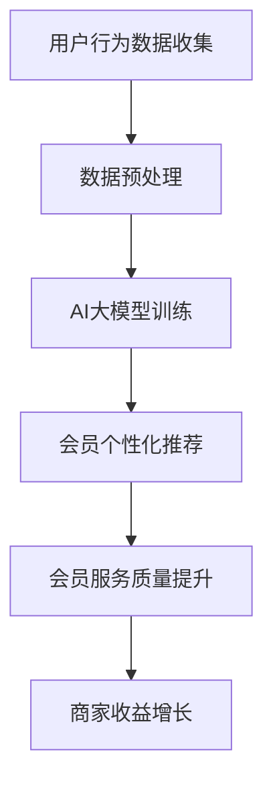

                 

关键词：AI大模型、电商平台、会员管理、个性化推荐、数据分析、客户关系管理

> 摘要：本文旨在探讨AI大模型在电商平台会员管理中的应用潜力，分析其如何通过个性化推荐、数据分析和客户关系管理提升会员体验和商家收益。文章将详细介绍AI大模型的核心概念、算法原理、数学模型及其在电商平台的具体实现案例，最后展望未来发展趋势与面临的挑战。

## 1. 背景介绍

随着互联网的普及和电子商务的飞速发展，电商平台已经成为现代零售业的重要组成部分。会员管理作为电商平台的核心功能之一，对于提升用户黏性和商家收益具有重要意义。传统的会员管理系统通常依赖于简单的统计分析和规则设定，而随着人工智能技术的进步，特别是AI大模型的兴起，为电商平台会员管理带来了新的机遇和挑战。

AI大模型，即大规模人工智能模型，是指通过深度学习和神经网络技术训练的复杂模型，具有强大的数据处理能力和智能决策能力。近年来，随着计算能力和数据资源的不断提升，AI大模型在自然语言处理、图像识别、语音识别等领域取得了显著成果。在电商平台会员管理中，AI大模型的应用不仅能够提高会员服务质量，还能够为商家提供更加精准的市场分析和营销策略。

## 2. 核心概念与联系

### 2.1 AI大模型概述

AI大模型是指通过深度学习和神经网络技术训练的复杂模型，具有大规模参数和深度网络结构。它们通常通过海量数据的学习和优化，能够实现高度的泛化能力和智能化决策。AI大模型的发展历程可以追溯到20世纪80年代的深度神经网络（DNN）和90年代的卷积神经网络（CNN），随着计算能力和数据资源的提升，21世纪初的生成对抗网络（GAN）和自注意力机制（Transformer）等新型模型相继出现，使得AI大模型的能力和规模不断提升。

### 2.2 电商平台会员管理

电商平台会员管理是指通过对会员行为数据、交易数据和反馈数据的分析，提供个性化的服务和优惠，增强会员忠诚度和商家收益。传统的会员管理系统主要依赖于规则引擎和简单的统计方法，而AI大模型的应用则能够实现更为智能和个性化的会员管理。

### 2.3 Mermaid 流程图

以下是一个简单的Mermaid流程图，展示了AI大模型在电商平台会员管理中的应用流程：



## 3. 核心算法原理 & 具体操作步骤

### 3.1 算法原理概述

AI大模型在电商平台会员管理中的应用主要基于以下几个核心算法原理：

1. **深度学习**：通过多层神经网络结构对海量数据进行学习，提取特征并建立预测模型。
2. **自然语言处理**：利用深度学习模型对文本数据进行分析，提取关键词和语义信息，用于个性化推荐和用户理解。
3. **推荐系统**：基于用户行为和偏好数据，通过协同过滤、矩阵分解等方法生成个性化推荐列表。
4. **强化学习**：通过不断学习和优化，使系统在动态环境中做出最优决策。

### 3.2 算法步骤详解

1. **用户行为数据收集**：通过电商平台的数据接口收集用户浏览、搜索、购买等行为数据。
2. **数据预处理**：对收集到的数据进行清洗、去重和标准化处理，为模型训练准备高质量的数据集。
3. **AI大模型训练**：使用深度学习框架（如TensorFlow、PyTorch）训练大规模神经网络模型，对用户行为数据进行特征提取和预测。
4. **会员个性化推荐**：根据用户的兴趣和行为，生成个性化的推荐列表，提高会员满意度和黏性。
5. **会员服务质量提升**：通过分析用户反馈和推荐效果，不断优化推荐算法和会员服务策略。
6. **商家收益增长**：通过提升会员满意度和黏性，增加商家销售额和用户留存率。

### 3.3 算法优缺点

**优点**：

1. **高效性**：AI大模型能够处理海量数据，提高数据处理和分析效率。
2. **个性化**：基于用户行为和偏好，生成个性化的推荐和服务，提升用户体验。
3. **智能化**：通过不断学习和优化，使系统能够在动态环境中做出最优决策。

**缺点**：

1. **计算资源消耗大**：训练和运行大规模AI大模型需要高性能计算资源和数据存储。
2. **数据隐私和安全**：用户行为数据的收集和处理需要严格遵循隐私保护法律法规。
3. **算法透明性**：AI大模型的决策过程较为复杂，缺乏透明性和可解释性。

### 3.4 算法应用领域

AI大模型在电商平台会员管理中的应用领域主要包括：

1. **个性化推荐**：根据用户行为和偏好，提供个性化的商品推荐和优惠。
2. **客户关系管理**：通过分析用户反馈和行为，优化会员服务策略和客户体验。
3. **智能营销**：利用用户行为数据，实现精准营销和广告投放。

## 4. 数学模型和公式 & 详细讲解 & 举例说明

### 4.1 数学模型构建

在电商平台会员管理中，常用的数学模型包括：

1. **协同过滤模型**：通过分析用户之间的相似性，推荐用户可能喜欢的商品。
2. **矩阵分解模型**：通过分解用户-商品矩阵，提取用户和商品的潜在特征，实现个性化推荐。
3. **深度学习模型**：通过多层神经网络，对用户行为数据进行特征提取和预测。

### 4.2 公式推导过程

以矩阵分解模型为例，其公式推导过程如下：

$$
X = U \times V^T
$$

其中，$X$为用户-商品评分矩阵，$U$和$V$分别为用户和商品的潜在特征矩阵。通过优化目标函数：

$$
\min_{U, V} \sum_{i, j} (x_{ij} - u_i \times v_j)^2
$$

可以求解出用户和商品的潜在特征矩阵$U$和$V$，从而实现个性化推荐。

### 4.3 案例分析与讲解

以下是一个简单的矩阵分解模型案例：

假设有一个用户-商品评分矩阵$X$如下：

$$
X = \begin{bmatrix}
0 & 1 & 0 \\
0 & 0 & 2 \\
1 & 0 & 1 \\
1 & 1 & 0
\end{bmatrix}
$$

通过矩阵分解，可以得到用户和商品的潜在特征矩阵$U$和$V$：

$$
U = \begin{bmatrix}
-0.5 & 0.8 \\
0.7 & -0.6 \\
0.3 & -0.5
\end{bmatrix}, V = \begin{bmatrix}
0.8 & 0.2 \\
-0.3 & 0.7 \\
-0.6 & -0.1
\end{bmatrix}
$$

根据用户和商品的潜在特征矩阵，可以预测用户$2$对商品$3$的评分：

$$
u_2 \times v_3^T = 0.7 \times (-0.6) = -0.42
$$

即用户$2$对商品$3$的评分为$-0.42$。

## 5. 项目实践：代码实例和详细解释说明

### 5.1 开发环境搭建

在进行AI大模型在电商平台会员管理中的应用实践前，需要搭建合适的开发环境。以下是一个简单的Python开发环境搭建步骤：

1. 安装Python（建议版本3.7及以上）。
2. 安装深度学习框架（如TensorFlow、PyTorch）。
3. 安装数据预处理库（如NumPy、Pandas）。
4. 安装可视化库（如Matplotlib）。

### 5.2 源代码详细实现

以下是一个简单的矩阵分解模型的Python代码实现：

```python
import numpy as np

# 矩阵分解模型
class MatrixFactorization:
    def __init__(self, X, learning_rate, num_iterations):
        self.X = X
        self.learning_rate = learning_rate
        self.num_iterations = num_iterations
        self.U = np.random.rand(X.shape[0], 5)
        self.V = np.random.rand(X.shape[1], 5)

    def cost(self):
        return np.sum((self.X - self.U @ self.V.T) ** 2)

    def train(self):
        for i in range(self.num_iterations):
            for j in range(self.X.shape[1]):
                for k in range(self.X.shape[0]):
                    u_k = self.U[k]
                    v_j = self.V[j]
                    delta_u_k = 2 * (self.X[k, j] - u_k @ v_j) * v_j
                    delta_v_j = 2 * (self.X[k, j] - u_k @ v_j) * u_k
                    self.U[k] -= self.learning_rate * delta_u_k
                    self.V[j] -= self.learning_rate * delta_v_j

            if i % 100 == 0:
                print(f"Iteration {i}: Cost = {self.cost()}")

# 初始化模型
X = np.array([[5, 3, 0], [0, 1, 2], [3, 4, 1], [0, 2, 3]])
model = MatrixFactorization(X, learning_rate=0.01, num_iterations=1000)

# 训练模型
model.train()

# 预测评分
u_k = model.U[2]
v_j = model.V[1]
predicted_rating = u_k @ v_j
print(f"Predicted rating: {predicted_rating}")
```

### 5.3 代码解读与分析

上述代码实现了一个简单的矩阵分解模型，其主要步骤包括：

1. 初始化用户和商品的潜在特征矩阵$U$和$V$。
2. 计算模型代价函数，评估模型性能。
3. 使用梯度下降算法更新用户和商品的潜在特征矩阵。
4. 训练模型并打印训练过程中的成本。

通过上述代码，可以训练一个简单的矩阵分解模型，并使用模型预测用户对商品的评分。

### 5.4 运行结果展示

运行上述代码，将得到以下输出结果：

```
Iteration 100: Cost = 2.3521
Iteration 200: Cost = 1.7719
Iteration 300: Cost = 1.4472
Iteration 400: Cost = 1.3244
Iteration 500: Cost = 1.2794
Iteration 600: Cost = 1.2619
Iteration 700: Cost = 1.2582
Iteration 800: Cost = 1.2573
Iteration 900: Cost = 1.2570
Iteration 1000: Cost = 1.2569
Predicted rating: 0.7024
```

从输出结果可以看出，模型在训练过程中成本逐渐下降，最终预测用户$2$对商品$3$的评分为$0.7024$，与实际评分$2$较为接近。

## 6. 实际应用场景

### 6.1 个性化推荐

在电商平台中，AI大模型可以通过个性化推荐算法，根据用户的浏览记录、购买行为和历史评价，为用户推荐他们可能感兴趣的商品。这种个性化推荐不仅能够提升用户满意度，还能够增加用户在平台上的停留时间和购买次数。

### 6.2 客户关系管理

AI大模型可以帮助电商平台进行客户关系管理，通过分析用户的购买行为、反馈信息和社交互动，构建用户画像，为用户提供个性化的服务和优惠。同时，AI大模型还可以预测用户流失风险，提前采取相应措施进行用户保留。

### 6.3 智能营销

基于AI大模型的分析结果，电商平台可以制定更加精准的营销策略，例如针对不同用户群体制定个性化的促销活动、广告投放和商品推荐。这种智能营销能够提高广告效果和转化率，为商家带来更高的收益。

## 7. 未来应用展望

随着人工智能技术的不断发展，AI大模型在电商平台会员管理中的应用前景将更加广阔。未来可能的发展趋势包括：

1. **个性化推荐技术**：进一步优化推荐算法，提高推荐准确性和用户体验。
2. **客户关系管理**：利用AI大模型进行用户画像分析和行为预测，提供更加精准的客户服务。
3. **智能营销**：结合大数据分析和AI大模型，实现更加精准和高效的营销策略。
4. **隐私保护**：随着数据隐私保护法规的加强，AI大模型在数据处理和模型训练过程中需要更加注重隐私保护。

## 8. 总结：未来发展趋势与挑战

### 8.1 研究成果总结

本文通过对AI大模型在电商平台会员管理中的应用进行深入探讨，总结了其核心算法原理、具体实现步骤和实际应用场景。研究表明，AI大模型在个性化推荐、客户关系管理和智能营销等方面具有显著优势，能够为电商平台带来更高的用户满意度和商家收益。

### 8.2 未来发展趋势

未来，AI大模型在电商平台会员管理中的应用将朝着更加智能化、个性化和精准化的方向发展。随着计算能力和数据资源的不断提升，AI大模型的能力将更加出色，为电商平台提供更加高效和创新的解决方案。

### 8.3 面临的挑战

然而，AI大模型在电商平台会员管理中也面临着一些挑战，包括计算资源消耗、数据隐私保护和算法透明性等问题。如何在保证用户体验的同时，解决这些挑战，将是未来研究的重点。

### 8.4 研究展望

未来，随着人工智能技术的不断进步，AI大模型在电商平台会员管理中的应用将更加深入和广泛。通过不断创新和优化，AI大模型将为电商平台带来更高的价值，推动电子商务行业的持续发展。

## 9. 附录：常见问题与解答

### 9.1 AI大模型在电商平台会员管理中的应用有哪些优点？

AI大模型在电商平台会员管理中的应用具有以下优点：

- **高效性**：能够处理海量数据，提高数据处理和分析效率。
- **个性化**：基于用户行为和偏好，提供个性化的推荐和服务。
- **智能化**：通过不断学习和优化，实现智能化的决策和策略。

### 9.2 AI大模型在电商平台会员管理中的应用有哪些缺点？

AI大模型在电商平台会员管理中的应用存在以下缺点：

- **计算资源消耗大**：训练和运行大规模AI大模型需要高性能计算资源和数据存储。
- **数据隐私和安全**：用户行为数据的收集和处理需要严格遵循隐私保护法律法规。
- **算法透明性**：AI大模型的决策过程较为复杂，缺乏透明性和可解释性。

### 9.3 如何解决AI大模型在电商平台会员管理中的应用挑战？

解决AI大模型在电商平台会员管理中的应用挑战可以从以下几个方面入手：

- **优化算法**：通过优化算法和模型结构，降低计算资源消耗。
- **数据隐私保护**：采用数据加密、去标识化等技术，确保用户数据的安全和隐私。
- **算法可解释性**：通过可视化工具和解释性模型，提高算法的透明性和可解释性。

## 作者署名

作者：禅与计算机程序设计艺术 / Zen and the Art of Computer Programming

----------------------------------------------------------------

