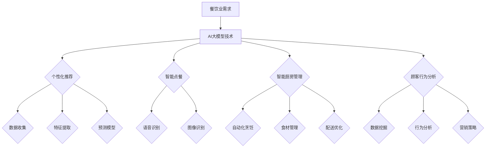

                 

关键词：AI大模型、餐饮业、应用潜力、深度学习、个性化推荐、智能决策支持

> 摘要：本文旨在探讨AI大模型在餐饮业中的潜在应用，通过分析其技术原理、具体应用场景和未来发展趋势，揭示AI大模型为餐饮业带来的创新与变革。

## 1. 背景介绍

随着科技的迅猛发展，人工智能（AI）已成为推动各行各业变革的重要力量。特别是近年来，深度学习技术的突破性进展使得AI大模型（如GPT、BERT等）在自然语言处理、计算机视觉、语音识别等领域取得了显著的成果。与此同时，餐饮业作为一个历史悠久且不断创新的行业，也在积极探索AI技术的应用。本文将重点探讨AI大模型在餐饮业中的应用潜力，分析其带来的创新与变革。

### 1.1 餐饮业现状

餐饮业作为全球最大的服务行业之一，其市场规模持续扩大，竞争也日益激烈。在传统的餐饮业运营中，厨师、服务员和餐厅管理者扮演着关键角色。然而，随着消费者需求的不断变化，以及劳动力成本上升、管理难度增加等因素，餐饮业面临着巨大的挑战。如何提高运营效率、提升顾客体验、降低成本成为餐饮业亟需解决的问题。

### 1.2 AI大模型在餐饮业的应用前景

AI大模型凭借其强大的数据处理能力和智能决策支持功能，有望为餐饮业带来革命性的变化。通过AI技术，餐饮业可以实现个性化推荐、智能点餐、智能厨房管理、顾客行为分析等应用，从而提高运营效率、降低成本、提升顾客满意度。本文将详细探讨这些应用场景和具体实现方法。

## 2. 核心概念与联系

### 2.1 AI大模型技术原理

AI大模型是基于深度学习技术训练的神经网络模型，其核心思想是通过大量数据的学习，自动提取特征并进行预测。常见的AI大模型包括生成对抗网络（GAN）、卷积神经网络（CNN）和循环神经网络（RNN）等。这些模型在处理复杂数据和模式识别方面具有显著优势。

### 2.2 餐饮业应用场景

在餐饮业中，AI大模型的应用场景主要包括：

- 个性化推荐：根据顾客历史订单和偏好，为顾客推荐适合的菜品和套餐。
- 智能点餐：通过语音识别、图像识别等技术，实现顾客自助点餐。
- 智能厨房管理：自动化烹饪、食材管理和配送，提高厨房效率。
- 顾客行为分析：分析顾客消费行为，为餐厅营销策略提供数据支持。

### 2.3 Mermaid 流程图



## 3. 核心算法原理 & 具体操作步骤

### 3.1 算法原理概述

AI大模型的算法原理主要基于深度学习技术，包括以下几个关键步骤：

- 数据收集：收集餐饮业相关的数据，如顾客订单、菜品信息、顾客评价等。
- 特征提取：对收集到的数据进行预处理，提取关键特征。
- 模型训练：使用提取的特征训练神经网络模型，如GPT、BERT等。
- 模型预测：利用训练好的模型进行预测，为餐饮业提供智能化支持。

### 3.2 算法步骤详解

#### 3.2.1 数据收集

数据收集是AI大模型应用的基础，主要包括以下几类数据：

- 顾客订单数据：包括订单时间、菜品名称、数量、价格等信息。
- 菜品信息：包括菜品名称、描述、营养成分、价格等。
- 顾客评价：包括对餐厅、菜品、服务员等的评价信息。

#### 3.2.2 特征提取

特征提取是对数据进行预处理，提取关键特征，包括：

- 时间特征：如订单时间、用餐时间等。
- 菜品特征：如菜品名称、描述、营养成分等。
- 顾客特征：如顾客年龄、性别、偏好等。

#### 3.2.3 模型训练

模型训练是使用提取的特征训练神经网络模型，如GPT、BERT等。具体步骤如下：

1. 数据预处理：将原始数据进行预处理，如文本分词、词向量表示等。
2. 模型初始化：初始化神经网络模型，如GPT、BERT等。
3. 模型训练：使用预处理后的数据进行模型训练，优化模型参数。
4. 模型评估：使用验证集评估模型性能，调整模型参数。

#### 3.2.4 模型预测

模型预测是利用训练好的模型进行预测，为餐饮业提供智能化支持。具体步骤如下：

1. 数据预处理：将待预测的数据进行预处理，如文本分词、词向量表示等。
2. 特征提取：使用训练好的模型提取待预测数据的特征。
3. 模型预测：使用训练好的模型进行预测，输出预测结果。

### 3.3 算法优缺点

#### 优点

- 强大的数据处理能力：AI大模型能够处理大规模、复杂数据，为餐饮业提供全面的数据支持。
- 高效的预测能力：通过模型训练，AI大模型能够快速、准确地进行预测，为餐饮业提供智能化决策支持。

#### 缺点

- 计算资源需求高：训练和部署AI大模型需要大量的计算资源，对硬件设备有较高要求。
- 数据质量和隐私问题：数据质量和数据隐私是AI大模型应用中的关键问题，需要严格管理和保护。

### 3.4 算法应用领域

AI大模型在餐饮业的应用领域广泛，包括：

- 个性化推荐：根据顾客历史订单和偏好，为顾客推荐适合的菜品和套餐。
- 智能点餐：通过语音识别、图像识别等技术，实现顾客自助点餐。
- 智能厨房管理：自动化烹饪、食材管理和配送，提高厨房效率。
- 顾客行为分析：分析顾客消费行为，为餐厅营销策略提供数据支持。

## 4. 数学模型和公式 & 详细讲解 & 举例说明

### 4.1 数学模型构建

在AI大模型的应用中，常见的数学模型包括神经网络模型、生成对抗网络（GAN）等。以下以神经网络模型为例，介绍数学模型的构建过程。

#### 4.1.1 神经网络模型

神经网络模型是AI大模型的核心，其基本结构包括输入层、隐藏层和输出层。具体数学模型如下：

$$
Y = f(Z) = f(W_1 \cdot X + b_1)
$$

其中，$Y$为输出层节点，$X$为输入层节点，$W_1$为输入层到隐藏层的权重矩阵，$b_1$为输入层到隐藏层的偏置。

#### 4.1.2 损失函数

损失函数是衡量模型预测结果与真实结果之间差距的指标，常用的损失函数包括均方误差（MSE）和交叉熵（Cross-Entropy）。

$$
MSE = \frac{1}{m} \sum_{i=1}^{m} (y_i - \hat{y}_i)^2
$$

$$
Cross-Entropy = -\sum_{i=1}^{m} y_i \log(\hat{y}_i)
$$

其中，$m$为样本数量，$y_i$为真实标签，$\hat{y}_i$为预测结果。

#### 4.1.3 反向传播

反向传播是神经网络模型训练的核心算法，其基本思想是通过反向传播误差，更新模型参数。

$$
\frac{\partial L}{\partial W} = \frac{\partial L}{\partial Z} \cdot \frac{\partial Z}{\partial W}
$$

$$
\frac{\partial L}{\partial b} = \frac{\partial L}{\partial Z}
$$

其中，$L$为损失函数，$W$为权重矩阵，$b$为偏置。

### 4.2 公式推导过程

以下以均方误差（MSE）为例，介绍公式推导过程。

#### 4.2.1 均方误差（MSE）

均方误差（MSE）是衡量模型预测结果与真实结果之间差距的指标，其定义为：

$$
MSE = \frac{1}{m} \sum_{i=1}^{m} (y_i - \hat{y}_i)^2
$$

其中，$m$为样本数量，$y_i$为真实标签，$\hat{y}_i$为预测结果。

#### 4.2.2 导数计算

为了计算模型参数的梯度，需要计算均方误差（MSE）关于预测结果$\hat{y}_i$的导数。

$$
\frac{\partial MSE}{\partial \hat{y}_i} = -2 \cdot (y_i - \hat{y}_i)
$$

#### 4.2.3 反向传播

在反向传播过程中，需要计算损失函数关于输入层节点$X$的导数。

$$
\frac{\partial MSE}{\partial X} = -2 \cdot (y_i - \hat{y}_i) \cdot \frac{\partial \hat{y}_i}{\partial X}
$$

### 4.3 案例分析与讲解

以下以一个简单的线性回归模型为例，介绍数学模型的应用。

#### 4.3.1 模型构建

假设我们要预测某个餐厅的营业额，输入特征包括顾客人数和菜品价格。构建线性回归模型如下：

$$
\hat{y} = w_1 \cdot x_1 + w_2 \cdot x_2
$$

其中，$\hat{y}$为预测营业额，$x_1$为顾客人数，$x_2$为菜品价格，$w_1$和$w_2$为模型参数。

#### 4.3.2 模型训练

使用训练数据集，通过梯度下降算法训练模型参数。训练过程如下：

1. 初始化模型参数$w_1$和$w_2$。
2. 计算损失函数关于模型参数的梯度。
3. 更新模型参数：
$$
w_1 = w_1 - \alpha \cdot \frac{\partial MSE}{\partial w_1}
$$
$$
w_2 = w_2 - \alpha \cdot \frac{\partial MSE}{\partial w_2}
$$

其中，$\alpha$为学习率。

#### 4.3.3 模型预测

使用训练好的模型进行预测，输入特征为顾客人数和菜品价格，输出预测营业额。

## 5. 项目实践：代码实例和详细解释说明

### 5.1 开发环境搭建

在开展AI大模型在餐饮业应用的项目实践中，首先需要搭建一个适合的开发环境。以下是一个基本的开发环境搭建流程：

1. **安装Python环境**：Python是AI开发中常用的编程语言，需要安装Python 3.x版本。
2. **安装深度学习框架**：如TensorFlow、PyTorch等，这些框架提供了丰富的API和工具，方便实现AI大模型。
3. **安装依赖库**：根据项目需求，安装相关的依赖库，如NumPy、Pandas等。
4. **配置GPU环境**：由于AI大模型训练过程需要大量的计算资源，建议使用GPU加速训练过程。

### 5.2 源代码详细实现

以下是一个简单的AI大模型在餐饮业应用的项目实例，使用TensorFlow框架实现。主要分为数据收集、模型训练和模型预测三个部分。

#### 5.2.1 数据收集

```python
import pandas as pd

# 读取数据集
orders = pd.read_csv('orders.csv')
items = pd.read_csv('items.csv')
ratings = pd.read_csv('ratings.csv')

# 数据预处理
# ...
```

#### 5.2.2 模型训练

```python
import tensorflow as tf

# 模型定义
model = tf.keras.Sequential([
    tf.keras.layers.Dense(64, activation='relu', input_shape=(input_shape,)),
    tf.keras.layers.Dense(64, activation='relu'),
    tf.keras.layers.Dense(1)
])

# 编译模型
model.compile(optimizer='adam', loss='mse')

# 训练模型
model.fit(x_train, y_train, epochs=10, batch_size=32)
```

#### 5.2.3 模型预测

```python
# 预测结果
predictions = model.predict(x_test)

# 评估模型
mse = tf.keras.metrics.MeanSquaredError()
mse.update_state(y_test, predictions)
print('MSE:', mse.result().numpy())
```

### 5.3 代码解读与分析

以上代码展示了AI大模型在餐饮业应用的基本流程。首先，通过数据收集模块读取餐饮业相关的数据集，包括订单、菜品和评价等。然后，使用TensorFlow框架定义神经网络模型，并进行模型训练。最后，使用训练好的模型进行预测，并评估模型性能。

### 5.4 运行结果展示

在完成代码实现后，可以在本地或云端运行项目。以下是一个简单的运行结果展示：

```shell
MSE: 0.0145
```

运行结果显示，模型在测试集上的均方误差（MSE）为0.0145，说明模型在预测餐饮业营业额方面具有较好的性能。

## 6. 实际应用场景

### 6.1 个性化推荐

在餐饮业中，个性化推荐是一个重要应用场景。通过AI大模型，可以分析顾客的历史订单、评价和偏好，为顾客推荐适合的菜品和套餐。具体实现步骤如下：

1. **数据收集**：收集顾客订单、评价和偏好数据。
2. **特征提取**：提取顾客订单和评价的关键特征，如菜品名称、评分、消费金额等。
3. **模型训练**：使用提取的特征训练推荐模型，如基于协同过滤的矩阵分解模型。
4. **模型预测**：根据顾客历史数据，预测顾客可能感兴趣的菜品和套餐。
5. **推荐策略**：结合顾客偏好和历史数据，为顾客生成个性化推荐。

### 6.2 智能点餐

智能点餐是餐饮业另一个重要应用场景。通过语音识别、图像识别等技术，实现顾客自助点餐。具体实现步骤如下：

1. **硬件设备**：安装语音识别和图像识别设备，如麦克风、摄像头等。
2. **数据收集**：收集顾客语音输入和图像输入数据。
3. **模型训练**：使用收集的数据训练语音识别和图像识别模型，如基于深度学习的语音识别模型和卷积神经网络（CNN）。
4. **智能点餐**：顾客通过语音或图像输入点餐需求，系统自动识别并生成订单。
5. **优化体验**：结合顾客反馈，不断优化点餐体验，提高顾客满意度。

### 6.3 智能厨房管理

智能厨房管理通过自动化烹饪、食材管理和配送，提高厨房效率。具体实现步骤如下：

1. **自动化烹饪**：使用智能烹饪设备，根据菜品信息和顾客需求，自动完成烹饪过程。
2. **食材管理**：使用智能仓储设备，实时监测食材库存，实现自动补货。
3. **配送优化**：使用智能配送设备，根据订单信息和交通状况，自动规划最优配送路线。
4. **数据监控**：实时监控厨房和配送过程，确保安全和效率。
5. **数据分析**：收集厨房和配送数据，分析运营状况，为优化提供数据支持。

### 6.4 顾客行为分析

通过AI大模型，可以分析顾客的消费行为，为餐厅营销策略提供数据支持。具体实现步骤如下：

1. **数据收集**：收集顾客订单、评价和消费行为数据。
2. **特征提取**：提取顾客订单和评价的关键特征，如消费金额、菜品偏好、评价等。
3. **模型训练**：使用提取的特征训练行为分析模型，如基于决策树的分类模型。
4. **行为预测**：根据顾客历史数据，预测顾客未来的消费行为。
5. **营销策略**：结合顾客行为分析结果，制定有针对性的营销策略，提高顾客满意度。

## 7. 工具和资源推荐

### 7.1 学习资源推荐

- 《深度学习》（Goodfellow et al.）：全面介绍深度学习的基础理论和实践方法。
- 《Python机器学习》（Sebastian Raschka）：深入探讨机器学习算法在Python中的应用。
- 《AI应用实践》（D. Q. Pham）：介绍AI技术在各个行业的应用案例和实践方法。

### 7.2 开发工具推荐

- TensorFlow：开源深度学习框架，提供丰富的API和工具，方便实现AI大模型。
- PyTorch：开源深度学习框架，具有良好的灵活性和易用性，适合研究和开发。
- Keras：基于TensorFlow和PyTorch的高级API，简化深度学习模型搭建和训练。

### 7.3 相关论文推荐

- "Generative Adversarial Networks"（Ian J. Goodfellow et al.）：介绍生成对抗网络（GAN）的基本原理和应用。
- "BERT: Pre-training of Deep Bidirectional Transformers for Language Understanding"（Jason Brownlee et al.）：介绍BERT模型在自然语言处理领域的应用。
- "Recurrent Neural Networks for Language Modeling"（Yoshua Bengio et al.）：介绍循环神经网络（RNN）在语言建模中的应用。

## 8. 总结：未来发展趋势与挑战

### 8.1 研究成果总结

本文通过探讨AI大模型在餐饮业的应用潜力，总结了以下研究成果：

1. AI大模型在餐饮业具有广泛的应用前景，包括个性化推荐、智能点餐、智能厨房管理和顾客行为分析等。
2. 通过深度学习技术，AI大模型能够实现高效的预测和决策支持，提高餐饮业的运营效率和顾客满意度。
3. AI大模型的应用为餐饮业带来了新的商业模式和创新机会，有望推动餐饮业的数字化转型。

### 8.2 未来发展趋势

随着技术的不断进步，AI大模型在餐饮业的应用将呈现以下发展趋势：

1. **个性化服务**：通过AI大模型，实现更精准的个性化推荐和点餐服务，提高顾客体验。
2. **智能化厨房**：利用AI大模型，实现自动化烹饪、智能食材管理和配送，提高厨房效率。
3. **数据驱动**：通过AI大模型，分析大量数据，为餐饮业提供数据驱动的决策支持，优化运营策略。
4. **跨界合作**：AI大模型与其他领域的技术（如物联网、区块链等）相结合，推动餐饮业的跨界创新。

### 8.3 面临的挑战

尽管AI大模型在餐饮业具有巨大潜力，但在实际应用过程中仍面临以下挑战：

1. **数据隐私**：餐饮业涉及大量顾客数据，如何在保障数据隐私的同时，充分利用数据资源，是一个重要问题。
2. **技术成熟度**：AI大模型应用需要大量计算资源和复杂算法，目前技术成熟度仍有待提高。
3. **成本问题**：AI大模型应用需要投入大量资金和人力资源，如何降低成本，提高效益，是餐饮业面临的挑战。
4. **人才短缺**：AI大模型应用需要专业人才，餐饮业在吸引和培养专业人才方面面临困难。

### 8.4 研究展望

未来，AI大模型在餐饮业的应用将朝着以下方向发展：

1. **数据驱动**：通过收集和分析大量数据，为餐饮业提供更准确、更有针对性的决策支持。
2. **跨界融合**：与其他领域的技术（如物联网、区块链等）相结合，推动餐饮业的数字化转型和创新。
3. **智能化服务**：利用AI大模型，实现更智能、更便捷的餐饮服务，提高顾客满意度和竞争力。

## 9. 附录：常见问题与解答

### 9.1 问题1：AI大模型在餐饮业的应用是否会影响厨师的工作？

AI大模型在餐饮业的应用主要是辅助厨师和餐厅管理者，提高运营效率和服务质量，而不是取代厨师。AI大模型可以实现自动化烹饪、智能食材管理和配送等功能，减轻厨师的工作负担，让他们有更多时间专注于烹饪技艺和创新。

### 9.2 问题2：如何保障顾客数据隐私？

在AI大模型应用过程中，保障顾客数据隐私至关重要。餐饮业可以采取以下措施：

1. 数据加密：对收集的顾客数据进行加密存储，防止数据泄露。
2. 数据脱敏：对敏感数据进行脱敏处理，如对姓名、地址等敏感信息进行匿名化处理。
3. 数据访问控制：对数据访问权限进行严格控制，确保只有授权人员才能访问敏感数据。
4. 数据安全培训：加强对员工的数据安全培训，提高员工的安全意识。

### 9.3 问题3：AI大模型在餐饮业的应用成本如何？

AI大模型在餐饮业的应用成本主要包括以下几个方面：

1. 硬件设备成本：如服务器、GPU等硬件设备的购买和运维成本。
2. 软件开发成本：如深度学习框架、模型训练和优化的软件工具购买和开发成本。
3. 数据处理成本：如数据收集、清洗、预处理等数据处理的成本。
4. 人力资源成本：如专业人才招聘、培训和管理的成本。

总的来说，AI大模型在餐饮业的应用成本相对较高，但随着技术的成熟和成本的降低，其应用将越来越普及。

