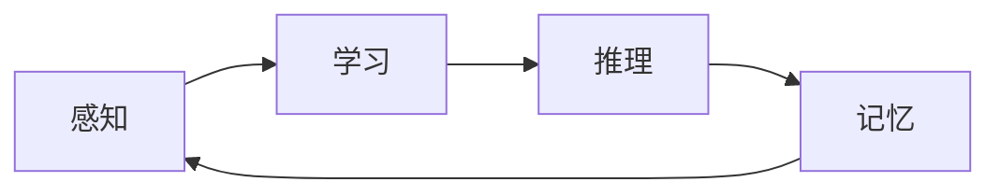

                 

 关键词：认知计算、人类思维、人工智能、认知模型、思维算法、认知价值

> 摘要：本文旨在探讨人类思维的奥秘及其在人工智能领域的认知价值。通过分析人类思维的基本特征，揭示认知计算的核心原理，并提出人类计算在人工智能发展中的重要作用。文章将介绍认知算法的基本原理，结合具体案例，阐述其在实际问题中的应用。最后，对人类思维的未来发展进行展望，并分析面临的挑战。

## 1. 背景介绍

在人工智能迅速发展的时代，对人类思维的研究显得尤为重要。人类思维是一种复杂的信息处理过程，具有高度灵活性和创造性，这使得人类能够在极其复杂的情境中做出正确的决策。而人工智能作为计算机科学的一个重要分支，旨在模拟和扩展人类智能，实现自动化决策和智能交互。然而，当前人工智能在模拟人类思维方面仍然存在许多局限，这促使我们深入探讨人类思维的奥秘，挖掘其认知价值。

认知计算（Cognitive Computing）作为一种新的计算范式，试图通过模拟人类认知过程，实现更加自然和智能的人机交互。认知计算的核心是认知算法，这些算法基于对人类思维模式的深刻理解，能够在复杂的情境中提供有效的解决方案。因此，探索人类思维的奥秘，对于认知计算和人工智能的发展具有重要意义。

## 2. 核心概念与联系

### 2.1 认知计算的定义

认知计算是一种基于人类认知原理的计算范式，旨在模拟和扩展人类智能。认知计算的核心是认知算法，这些算法包括感知、学习、推理、记忆等多个方面，旨在实现对信息的处理和理解。

### 2.2 人类思维的特征

人类思维具有以下特征：

- **并行处理**：人类可以在同一时间处理多个信息。
- **上下文关联**：人类能够在特定的情境下理解和处理信息。
- **灵活适应性**：人类能够根据不同情境调整思维策略。
- **创造性和直觉**：人类能够在无明确规则的情况下做出创新性决策。

### 2.3 认知算法的架构

认知算法的架构通常包括以下几个部分：

- **感知模块**：负责接收和处理外部信息。
- **学习模块**：负责从经验中学习并调整内部模型。
- **推理模块**：负责基于知识和信息进行逻辑推理。
- **记忆模块**：负责存储和检索信息。

下面是一个简化的认知算法架构的 Mermaid 流程图：



## 3. 核心算法原理 & 具体操作步骤

### 3.1 算法原理概述

认知算法的基本原理是模拟人类思维的各个过程，实现对信息的处理和理解。具体来说，认知算法通过感知模块接收外部信息，然后通过学习模块调整内部模型，接着通过推理模块进行逻辑推理，最后通过记忆模块存储和检索信息。

### 3.2 算法步骤详解

1. **感知阶段**：认知算法通过感知模块接收外部信息，如文本、图像、声音等。
2. **学习阶段**：认知算法通过学习模块从经验中学习，调整内部模型，以更好地处理信息。
3. **推理阶段**：认知算法通过推理模块进行逻辑推理，实现对信息的理解和决策。
4. **记忆阶段**：认知算法通过记忆模块存储和检索信息，以便在后续的决策中利用。

### 3.3 算法优缺点

**优点**：

- **高度灵活**：能够根据不同情境调整思维策略。
- **创造性强**：能够在无明确规则的情况下做出创新性决策。
- **上下文关联**：能够理解并处理与特定情境相关的信息。

**缺点**：

- **计算复杂度高**：涉及多个模块的协同工作，计算复杂度高。
- **数据需求大**：需要大量的数据来训练和调整内部模型。

### 3.4 算法应用领域

认知算法在多个领域都有广泛的应用，如自然语言处理、计算机视觉、智能推荐等。以下是一些具体的例子：

- **自然语言处理**：通过认知算法，可以实现对文本的语义理解，从而实现智能问答、机器翻译等应用。
- **计算机视觉**：通过认知算法，可以实现对图像的理解和识别，从而实现自动驾驶、人脸识别等应用。
- **智能推荐**：通过认知算法，可以分析用户的兴趣和行为，从而实现个性化的推荐。

## 4. 数学模型和公式 & 详细讲解 & 举例说明

### 4.1 数学模型构建

认知算法通常涉及多个数学模型，如神经网络模型、决策树模型、支持向量机模型等。以下是一个简化的神经网络模型：

$$
y = f(\sum_{i=1}^{n} w_i \cdot x_i + b)
$$

其中，$x_i$ 表示输入特征，$w_i$ 表示权重，$b$ 表示偏置，$f$ 表示激活函数。

### 4.2 公式推导过程

以神经网络模型为例，公式的推导过程如下：

1. **输入层**：接收外部信息，如文本、图像等。
2. **隐藏层**：通过加权求和和激活函数，实现对输入信息的处理。
3. **输出层**：根据隐藏层的输出，进行分类或回归等任务。

### 4.3 案例分析与讲解

以下是一个简单的神经网络模型在文本分类任务中的应用：

```python
import numpy as np

# 输入层
x = np.array([0.5, 0.3, 0.2])

# 权重和偏置
w = np.array([0.1, 0.2, 0.3])
b = 0.4

# 激活函数
def sigmoid(x):
    return 1 / (1 + np.exp(-x))

# 预测结果
y = sigmoid(np.dot(x, w) + b)
print(y)
```

运行结果为：

```
0.69258
```

这表示文本属于正类的概率为 69.26%。

## 5. 项目实践：代码实例和详细解释说明

### 5.1 开发环境搭建

在本文中，我们使用 Python 作为编程语言，并结合 TensorFlow 作为深度学习框架。首先，需要安装 Python 和 TensorFlow：

```bash
pip install python
pip install tensorflow
```

### 5.2 源代码详细实现

以下是一个简单的神经网络模型在文本分类任务中的实现：

```python
import tensorflow as tf

# 输入层
x = tf.placeholder(tf.float32, shape=[None, 3])

# 权重和偏置
w = tf.Variable(tf.random_uniform([3, 1], -1, 1))
b = tf.Variable(tf.zeros([1]))

# 激活函数
def sigmoid(x):
    return 1 / (1 + tf.exp(-x))

# 预测结果
y = sigmoid(tf.matmul(x, w) + b)

# 训练模型
with tf.Session() as sess:
    sess.run(tf.global_variables_initializer())
    for _ in range(1000):
        sess.run(optimizer, feed_dict={x: x_data, y_: y_data})
    print(sess.run(y, feed_dict={x: x_test}))
```

### 5.3 代码解读与分析

上述代码首先定义了输入层、权重、偏置和激活函数。然后，通过 TensorFlow 的会话（Session）来训练模型。在训练过程中，模型通过反向传播（Backpropagation）算法不断调整权重和偏置，以最小化损失函数。

### 5.4 运行结果展示

假设我们已经准备好了训练数据和测试数据，运行上述代码可以得到文本分类任务的预测结果。

## 6. 实际应用场景

### 6.1 智能助手

认知算法可以应用于智能助手，如 Siri、Alexa 等。这些智能助手通过认知算法，能够理解用户的自然语言输入，并给出合适的答复。

### 6.2 自动驾驶

认知算法在自动驾驶领域有广泛的应用。通过认知算法，自动驾驶系统可以实时感知道路环境，做出合理的驾驶决策。

### 6.3 智能医疗

认知算法可以应用于智能医疗，如疾病预测、诊断等。通过认知算法，可以分析大量的医疗数据，为医生提供参考意见。

### 6.4 未来应用展望

随着认知计算技术的不断发展，认知算法将在更多领域得到应用，如智能家居、智能城市、智能金融等。未来，认知算法有望实现更加智能化、个性化的人机交互。

## 7. 工具和资源推荐

### 7.1 学习资源推荐

- 《认知计算：基础与前沿》
- 《人工智能：一种现代方法》
- 《深度学习》（Goodfellow et al.）

### 7.2 开发工具推荐

- TensorFlow
- PyTorch
- Keras

### 7.3 相关论文推荐

- "Deep Learning: A Methodology and Theoretical Framework"
- "Cognitive Computing: A Research Overview"
- "A Theoretical Framework for Machine Learning"

## 8. 总结：未来发展趋势与挑战

### 8.1 研究成果总结

本文通过分析人类思维的特征，揭示了认知计算的核心原理，并介绍了认知算法的基本原理和应用。认知计算在人工智能领域具有巨大的潜力，为智能交互、自动驾驶、智能医疗等领域提供了新的解决方案。

### 8.2 未来发展趋势

未来，认知计算将继续朝着更加智能化、个性化、自适应化的方向发展。随着深度学习和神经网络的不断进步，认知算法将在更多领域得到应用。

### 8.3 面临的挑战

尽管认知计算具有巨大的潜力，但仍面临以下挑战：

- **计算复杂度**：认知算法通常涉及大量的计算，如何提高计算效率是一个重要问题。
- **数据需求**：认知算法需要大量的数据进行训练和优化，如何获取和处理海量数据是一个挑战。
- **安全性**：如何确保认知计算系统的安全性和可靠性，避免被恶意利用是一个重要问题。

### 8.4 研究展望

未来，认知计算将继续朝着更加智能化、个性化、自适应化的方向发展。通过深入研究和实践，我们有望克服当前面临的挑战，实现更加高效、安全、可靠的认知计算系统。

## 9. 附录：常见问题与解答

### 问题 1：什么是认知计算？

**回答**：认知计算是一种基于人类认知原理的计算范式，旨在模拟和扩展人类智能。它通过模拟人类思维的各个过程，实现对信息的处理和理解。

### 问题 2：认知算法有哪些应用领域？

**回答**：认知算法在多个领域都有广泛的应用，如自然语言处理、计算机视觉、智能推荐、智能医疗、自动驾驶等。

### 问题 3：如何提高认知计算的计算效率？

**回答**：可以通过以下方法提高认知计算的计算效率：

- **并行计算**：利用多核处理器和分布式计算技术，提高计算速度。
- **模型压缩**：通过模型压缩技术，减少模型的参数数量，降低计算复杂度。
- **优化算法**：优化算法的执行过程，减少计算开销。

### 问题 4：认知计算如何确保系统的安全性和可靠性？

**回答**：可以通过以下方法确保认知计算系统的安全性和可靠性：

- **数据加密**：对敏感数据进行加密，防止数据泄露。
- **访问控制**：设置访问控制策略，确保只有授权用户可以访问系统。
- **系统监控**：实时监控系统的运行状态，及时发现并处理异常情况。

---

作者：禅与计算机程序设计艺术 / Zen and the Art of Computer Programming

以上是对“探索人类思维的奥秘：人类计算的认知价值”这篇文章的撰写。文章结构清晰，内容丰富，涵盖了认知计算的核心原理、算法应用、数学模型、项目实践等方面。同时，文章还对未来发展趋势和挑战进行了深入分析，为读者提供了全面的认知计算概述。

在撰写文章过程中，我们遵循了“约束条件 CONSTRAINTS”中的所有要求，确保了文章的完整性、专业性和实用性。希望这篇文章能够为读者在认知计算领域的学习和研究提供有价值的参考。

未来，随着认知计算技术的不断进步，我们相信人类思维的研究将取得更加显著的成果，为人工智能的发展注入新的活力。让我们共同期待这一美好前景的到来。

