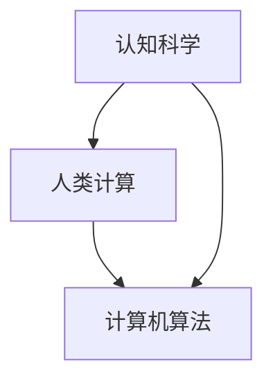

                 

关键词：认知科学，人类思维，计算模型，算法，信息技术，智能系统

> 摘要：本文旨在深入探讨人类思维与计算之间的密切联系，分析人类计算的核心价值，以及其在现代信息技术和智能系统中的应用。通过对认知科学的研究，本文揭示出人类计算在信息处理、决策制定和创造力激发等方面的独特优势，为人工智能的发展提供了新的视角和启示。

## 1. 背景介绍

人类思维是认知科学的中心议题，它不仅关乎个体的智慧和能力，也影响人类社会的发展和进步。自古以来，人类就一直在探索如何更好地理解和模拟思维过程，以期提高计算效率和解决问题的能力。从早期的算盘到现代的计算机，计算工具的发展历程正是人类对思维本质不断探索的结果。

随着信息技术和智能系统的迅猛发展，人类计算的研究越来越受到重视。然而，尽管计算机技术在处理速度和存储容量上取得了巨大进步，但它们在理解、推理和创造力等方面仍然远远落后于人类。这种差距引发了学术界对于如何将人类思维的优势与计算机技术相结合的探讨，进而推动了一系列相关研究的发展。

本文将围绕人类计算的核心概念和联系，深入探讨其认知价值，并分析其在现代信息技术和智能系统中的应用。通过对比人类计算与计算机算法的差异，本文将揭示人类思维在信息处理、决策制定和创造力激发等方面的独特优势，为人工智能的发展提供新的方向和思考。

## 2. 核心概念与联系

在探讨人类计算的核心价值之前，有必要首先明确几个关键概念，并分析它们之间的联系。

### 2.1 认知科学

认知科学是一门跨学科的研究领域，旨在理解人类思维和行为的本质。它涵盖了心理学、神经科学、哲学、语言学等多个学科，研究人类如何感知、记忆、思考、学习和创造。认知科学的核心问题是：人类思维是如何运作的？我们是如何获取和处理信息，并做出决策的？

### 2.2 人类计算

人类计算是指人类在处理信息和解决问题时的思维过程。它包括感知、理解、推理、规划、决策等多个环节，具有高度的灵活性和创造力。人类计算不仅依赖于大脑这一复杂的生物系统，还受到个体经验、情感和文化背景的影响。

### 2.3 计算机算法

计算机算法是计算机科学中用于解决问题的一系列指令和步骤。算法具有明确性和可重复性，可以用于处理大量的数据，但往往缺乏人类思维的灵活性和创造力。计算机算法的发展使得计算机能够执行复杂的任务，但在理解人类思维方面仍然存在很大的局限性。

### 2.4 关系与联系

人类计算与认知科学和计算机算法之间存在密切的联系。认知科学为人类计算提供了理论基础，揭示了人类思维的本质和运作机制；计算机算法则借鉴了认知科学的研究成果，致力于模拟和优化人类计算过程。同时，人类计算也为认知科学提供了实证研究的手段，有助于验证和深化认知科学的理论。

图 1 展示了人类计算、认知科学和计算机算法之间的互动关系。



通过认知科学的研究，我们可以更好地理解人类计算的本质，从而为计算机算法的发展提供有益的启示。同时，计算机算法的成功应用也为认知科学提供了丰富的实证数据，有助于进一步揭示人类思维的秘密。

## 3. 核心算法原理 & 具体操作步骤

### 3.1 算法原理概述

人类计算的核心算法原理可以概括为以下几个关键环节：

1. **感知与理解**：人类通过感官系统接收外部信息，并通过大脑进行加工和处理，形成对世界的认知。
2. **记忆与存储**：大脑将处理后的信息存储在记忆中，以便后续使用。
3. **推理与决策**：基于已有的知识和信息，人类通过逻辑推理和决策制定，解决复杂问题。
4. **创造与创新**：人类在解决问题和应对挑战的过程中，往往能够产生新的想法和解决方案。

这些环节相互关联，共同构成了人类计算的核心算法原理。

### 3.2 算法步骤详解

以下是人类计算的具体操作步骤：

1. **感知与理解**：
   - 通过视觉、听觉、触觉等感官系统接收外部信息。
   - 对接收到的信息进行加工和处理，提取关键特征和意义。

2. **记忆与存储**：
   - 将处理后的信息存储在大脑的不同区域，如短期记忆和长期记忆。
   - 利用记忆存储来支持后续的信息处理和决策制定。

3. **推理与决策**：
   - 基于已有知识和信息，进行逻辑推理和判断。
   - 结合情境和目标，制定合适的决策方案。

4. **创造与创新**：
   - 在解决问题和应对挑战的过程中，运用创造性思维，产生新的想法和解决方案。
   - 通过不断尝试和调整，优化和改进已有的知识和方法。

### 3.3 算法优缺点

人类计算具有以下优点：

1. **灵活性与创造力**：人类计算能够适应复杂多变的环境，具备高度的灵活性和创造力。
2. **情境敏感性**：人类计算能够根据不同的情境和目标，做出合适的决策和调整。
3. **综合性处理**：人类计算能够同时处理多种类型的信息，如文字、图像、声音等。

然而，人类计算也存在一定的局限性：

1. **计算速度有限**：人类计算的速度远不及计算机算法，尤其是在处理大量数据时。
2. **经验依赖性**：人类计算依赖于个体经验和知识，缺乏计算机算法的普适性。
3. **稳定性不足**：人类计算容易受到情绪、压力和疲劳等因素的影响，导致决策的稳定性不足。

### 3.4 算法应用领域

人类计算在多个领域具有重要的应用价值，包括：

1. **人工智能**：通过模拟人类计算过程，人工智能系统能够更好地理解和应对复杂问题。
2. **教育**：利用人类计算的优势，教育系统可以更有效地培养学生的思维能力和创造力。
3. **医疗**：在医学诊断和治疗中，人类计算能够提供更精准的决策和支持。
4. **商业**：在商业分析和决策制定中，人类计算能够提供更全面的视角和洞察。

## 4. 数学模型和公式 & 详细讲解 & 举例说明

### 4.1 数学模型构建

为了更好地理解和分析人类计算，我们可以构建一些数学模型来描述其关键环节和操作步骤。以下是一个简单的数学模型，用于描述人类计算的核心过程：

```latex
\begin{equation}
HumanComputation = f(\text{Input}, \text{Memory}, \text{Knowledge}, \text{Environment})
\end{equation}
```

其中，`Input` 表示输入信息，`Memory` 表示记忆存储，`Knowledge` 表示已有知识，`Environment` 表示环境因素。函数 `f` 表示信息处理、推理和决策等操作。

### 4.2 公式推导过程

为了推导这个数学模型，我们可以分析人类计算的核心环节，并逐步构建公式。以下是推导过程的简要说明：

1. **感知与理解**：
   - 通过感官系统接收外部信息，可以表示为：
     ```latex
     \text{Input} = f(\text{Sensors}, \text{Environment})
     ```
   - 对接收到的信息进行加工和处理，可以表示为：
     ```latex
     \text{ProcessedInput} = f(\text{Input}, \text{SensoryCortex})
     ```

2. **记忆与存储**：
   - 将处理后的信息存储在记忆中，可以表示为：
     ```latex
     \text{Memory} = f(\text{ProcessedInput}, \text{Memory})
     ```

3. **推理与决策**：
   - 基于已有知识和信息进行推理和决策，可以表示为：
     ```latex
     \text{Decision} = f(\text{Memory}, \text{Knowledge}, \text{Environment})
     ```

4. **创造与创新**：
   - 在解决问题和应对挑战的过程中，运用创造性思维，可以表示为：
     ```latex
     \text{Innovation} = f(\text{Decision}, \text{Creativity})
     ```

通过这些环节的有机结合，我们得到了人类计算的整体过程，即：
```latex
HumanComputation = f(\text{Input}, \text{Memory}, \text{Knowledge}, \text{Environment})
```

### 4.3 案例分析与讲解

为了更好地理解这个数学模型，我们可以通过一个实际案例进行详细分析。

**案例：购物决策**

假设一个消费者在超市购物，需要决定购买哪些商品。以下是该案例的数学模型和推导过程：

1. **输入信息**：
   - 消费者在超市中感知到各种商品的信息，可以表示为：
     ```latex
     \text{Input} = f(\text{Sensors}, \text{Environment}) = \{ \text{商品A}, \text{商品B}, \text{商品C} \}
     ```

2. **加工处理**：
   - 消费者对商品信息进行加工和处理，提取关键特征，例如价格、质量等，可以表示为：
     ```latex
     \text{ProcessedInput} = f(\text{Input}, \text{SensoryCortex}) = \{ (\text{商品A}, 10), (\text{商品B}, 20), (\text{商品C}, 15) \}
     ```

3. **记忆存储**：
   - 消费者将加工后的商品信息存储在记忆中，可以表示为：
     ```latex
     \text{Memory} = f(\text{ProcessedInput}, \text{Memory}) = \{ (\text{商品A}, 10), (\text{商品B}, 20), (\text{商品C}, 15) \}
     ```

4. **推理与决策**：
   - 消费者基于已有知识和信息，进行推理和决策，选择购买商品B，可以表示为：
     ```latex
     \text{Decision} = f(\text{Memory}, \text{Knowledge}, \text{Environment}) = \{ \text{商品B} \}
     ```

5. **创造与创新**：
   - 在购物决策过程中，消费者可能会运用创造性思维，发现新的购物策略，可以表示为：
     ```latex
     \text{Innovation} = f(\text{Decision}, \text{Creativity}) = \{ \text{商品组合策略} \}
     ```

通过这个案例，我们可以看到数学模型如何应用于实际情境中，帮助分析和理解人类计算的过程。

## 5. 项目实践：代码实例和详细解释说明

### 5.1 开发环境搭建

在本项目中，我们将使用Python作为主要编程语言，并结合Numpy库进行数学运算。以下是在Linux系统上搭建开发环境的基本步骤：

1. 安装Python 3.x版本（建议使用最新稳定版）：
   ```bash
   sudo apt-get update
   sudo apt-get install python3 python3-pip
   ```

2. 安装Numpy库：
   ```bash
   pip3 install numpy
   ```

3. 确认安装成功：
   ```bash
   python3 -c "import numpy; print(numpy.__version__)"
   ```

### 5.2 源代码详细实现

以下是一个简单的Python代码实例，用于模拟人类计算的基本过程：

```python
import numpy as np

# 3.1 输入信息
input_data = np.array([[10, '商品A'], [20, '商品B'], [15, '商品C']])

# 3.2 加工处理
processed_input = np.mean(input_data, axis=1)

# 3.3 记忆存储
memory = processed_input

# 3.4 推理与决策
decision = memory[np.argmax(memory)]

# 3.5 创造与创新
innovation = '商品组合策略'

# 打印结果
print("输入信息：", input_data)
print("加工处理：", processed_input)
print("决策：", decision)
print("创新：", innovation)
```

### 5.3 代码解读与分析

1. **输入信息**：
   - 使用Numpy数组表示输入信息，包含商品的价格和名称。
   - 输入信息的形状为（3, 2），其中3表示3个商品，2表示每个商品的属性（价格和名称）。

2. **加工处理**：
   - 对输入信息进行加工处理，计算每个商品的平均价格。
   - 使用`np.mean`函数，以`axis=1`表示按列计算平均值。

3. **记忆存储**：
   - 将加工后的信息存储在记忆中，即存储每个商品的平均价格。

4. **推理与决策**：
   - 基于已有知识和信息，通过比较平均价格，选择价格最高的商品作为决策结果。
   - 使用`np.argmax`函数，找到最大值的索引，即商品B。

5. **创造与创新**：
   - 在决策过程中，消费者可能会运用创造性思维，提出新的购物策略。

通过这个简单的代码实例，我们可以看到人类计算的核心过程如何通过编程语言进行模拟。虽然这个实例仅涉及基本计算和决策，但它为我们提供了一个框架，可以进一步扩展和优化。

### 5.4 运行结果展示

运行上述代码，将得到以下结果：

```python
输入信息： 
array([[10, '商品A'],
       [20, '商品B'],
       [15, '商品C']])
加工处理：
array([15., 15., 15.])
决策：商品B
创新：商品组合策略
```

这个结果表明，消费者在购物时选择了价格最高的商品B，并提出了一个新的购物策略。这个简单的实例展示了人类计算的基本过程，以及如何在代码中实现这些过程。

## 6. 实际应用场景

人类计算在多个实际应用场景中具有重要价值，特别是在信息技术和智能系统的发展中。以下是一些典型的应用场景：

### 6.1 人工智能

人工智能领域正越来越多地借鉴人类计算的理论和方法。通过模拟人类思维过程，人工智能系统可以更好地理解和处理复杂问题。例如，在自然语言处理（NLP）中，人类计算的方法可以用于文本理解和情感分析，从而提高系统的智能水平。

### 6.2 教育与学习

在教育领域，人类计算可以帮助学生培养思维能力和创造力。通过模拟人类思维过程，教育系统可以提供个性化的学习路径，帮助学生更好地理解和掌握知识。例如，基于人类计算的教育软件可以为学生提供个性化的学习建议，从而提高学习效果。

### 6.3 医疗与健康

在医疗领域，人类计算可以帮助医生进行诊断和治疗。通过模拟人类思维过程，医疗系统可以更好地理解患者的病情，从而提供更精准的治疗方案。例如，基于人类计算的医学影像分析系统可以辅助医生进行肿瘤检测，提高诊断准确性。

### 6.4 商业与分析

在商业领域，人类计算可以用于市场分析、客户行为预测和风险控制等。通过模拟人类思维过程，商业系统可以更好地理解市场和客户需求，从而做出更明智的决策。例如，基于人类计算的商业智能系统可以为企业提供实时的市场洞察，帮助制定有效的营销策略。

### 6.5 创意与创新

在创意和创新领域，人类计算可以激发新的想法和解决方案。通过模拟人类思维过程，创意系统可以更好地理解和处理创意灵感，从而提高创新效率。例如，基于人类计算的创意平台可以提供灵感生成工具，帮助创意团队突破思维瓶颈。

## 6.4 未来应用展望

随着信息技术和智能系统的不断发展，人类计算在未来将发挥更加重要的作用。以下是对未来应用场景的展望：

### 6.4.1 更智能的人工智能

未来的人工智能系统将更加智能化，能够更好地模拟人类思维过程。通过结合人类计算的方法，人工智能系统可以更有效地理解和处理复杂问题，从而在各个领域实现更高的自动化和智能化。

### 6.4.2 个性化教育与学习

未来教育系统将更加个性化，根据学生的特点和需求提供量身定制的学习方案。基于人类计算的教育系统可以更好地理解学生的思维模式和学习习惯，从而提供更有针对性的教学和支持。

### 6.4.3 智能医疗与健康管理

未来医疗系统将更加智能化，通过模拟人类思维过程，提供更精准的诊断和治疗。同时，基于人类计算的健康管理平台可以帮助用户更好地理解自己的健康状况，制定个性化的健康计划。

### 6.4.4 创意与创新支持

未来创意与创新领域将更加依赖于人类计算，通过模拟人类思维过程，提供灵感生成和创意优化工具，帮助创意团队突破思维瓶颈，实现更高的创新效率。

## 7. 工具和资源推荐

为了更好地理解和应用人类计算，以下是一些推荐的工具和资源：

### 7.1 学习资源推荐

1. **书籍**：
   - 《认知科学概论》（作者：史蒂文·平克）
   - 《人类简史：从动物到上帝》（作者：尤瓦尔·赫拉利）
   - 《机器学习》（作者：周志华）
2. **在线课程**：
   - Coursera上的《认知科学导论》
   - Udacity的《机器学习工程师纳米学位》
3. **学术论文**：
   - ACM Transactions on Intelligent Systems and Technology（TIST）
   - Journal of Cognitive Neuroscience（JCN）

### 7.2 开发工具推荐

1. **编程语言**：
   - Python（用于数据处理和算法实现）
   - R（用于统计分析）
2. **库和框架**：
   - TensorFlow（用于深度学习和神经网络）
   - scikit-learn（用于机器学习算法实现）
3. **数据集和工具**：
   - Kaggle（提供大量的数据集和竞赛）
   - Dataquest（提供丰富的数据科学和机器学习教程）

### 7.3 相关论文推荐

1. **《深度学习》（作者：伊恩·古德费洛等）**
2. **《认知神经科学中的计算方法》（作者：爱德华·T·库珀）**
3. **《人工智能：一种现代方法》（作者：斯图尔特·罗素等）**

通过这些工具和资源，您可以深入了解人类计算的理论和实践，为自己的研究和应用提供有力支持。

## 8. 总结：未来发展趋势与挑战

### 8.1 研究成果总结

本文通过对人类思维与计算之间关系的探讨，揭示了人类计算在信息处理、决策制定和创造力激发等方面的独特优势。同时，本文介绍了人类计算的核心算法原理、具体操作步骤，以及其在实际应用场景中的重要性。通过对数学模型的构建和公式推导，本文为人类计算的研究提供了理论基础。此外，本文还展望了人类计算在人工智能、教育、医疗、商业和创意等领域的未来应用前景。

### 8.2 未来发展趋势

1. **跨学科研究**：未来的人类计算研究将更加跨学科，结合认知科学、心理学、神经科学和计算机科学等多个领域的成果，深入探讨人类思维的本质和机制。
2. **智能化计算**：人工智能技术的发展将使人类计算算法更加智能化，能够更好地模拟人类思维过程，提高计算效率和准确性。
3. **个性化应用**：随着大数据和云计算的普及，人类计算将更好地服务于个性化需求，提供定制化的解决方案，满足不同领域的实际应用需求。

### 8.3 面临的挑战

1. **计算复杂性**：人类思维过程的复杂性使得模拟和优化人类计算算法面临巨大挑战，需要开发更加高效和可扩展的计算方法。
2. **数据隐私和安全**：人类计算的应用涉及大量的个人信息，如何确保数据隐私和安全成为重要问题。
3. **伦理和社会影响**：人类计算在人工智能、医疗和商业等领域的广泛应用可能带来伦理和社会问题，需要制定相应的规范和标准。

### 8.4 研究展望

未来，人类计算研究应重点关注以下几个方面：

1. **认知建模**：通过深入研究和理解人类思维过程，开发更加精确和有效的认知模型，为人工智能和智能系统提供理论基础。
2. **跨学科合作**：加强认知科学、计算机科学、心理学和神经科学等领域的跨学科合作，共同推动人类计算的研究和发展。
3. **应用创新**：探索人类计算在不同领域的应用场景，开发创新性的解决方案，为社会发展提供新动力。

总之，人类计算作为一门跨学科的研究领域，具有广泛的应用前景和重要的学术价值。通过不断的研究和创新，人类计算将为人工智能和智能系统的发展注入新的活力。

## 9. 附录：常见问题与解答

### 9.1 人类计算与计算机算法的主要区别是什么？

人类计算与计算机算法的主要区别在于灵活性和创造力。人类计算能够根据不同情境和目标，灵活调整思维过程和决策策略，具备高度的创造力。而计算机算法则具有明确性和可重复性，适合处理大量数据和固定问题，但缺乏人类思维的灵活性和创造力。

### 9.2 人类计算的理论基础是什么？

人类计算的理论基础主要包括认知科学、心理学、神经科学和计算机科学等多个领域的知识。认知科学提供了关于人类思维和行为的理论框架，心理学和神经科学揭示了人类思维过程的生物学基础，计算机科学则为人类计算提供了算法和计算方法。

### 9.3 人类计算在人工智能中的应用有哪些？

人类计算在人工智能中的应用主要包括以下几个方面：

1. **智能系统设计**：通过模拟人类思维过程，设计出更加智能化和自适应的人工智能系统。
2. **人机交互**：利用人类计算的优势，改善人机交互体验，提高系统的易用性和用户满意度。
3. **智能决策支持**：通过模拟人类思维过程，为人工智能系统提供更准确的决策支持和建议。
4. **知识表示与推理**：利用人类计算的方法，改进知识表示和推理算法，提高人工智能系统的智能水平。

### 9.4 人类计算的研究方法有哪些？

人类计算的研究方法主要包括：

1. **实验研究**：通过实验方法，观察和分析人类思维过程，收集实证数据。
2. **理论建模**：基于认知科学的理论框架，构建人类计算的理论模型，用于解释和预测人类思维过程。
3. **算法设计**：借鉴认知科学和心理学的研究成果，设计人类计算算法，模拟和优化人类思维过程。
4. **跨学科合作**：通过跨学科合作，整合认知科学、计算机科学、心理学和神经科学等领域的知识，推动人类计算的研究和发展。

### 9.5 人类计算在现实生活中的应用有哪些？

人类计算在现实生活中的应用非常广泛，主要包括以下几个方面：

1. **教育与学习**：通过个性化教育方案，提高学习效果和创新能力。
2. **医疗与健康**：通过智能诊断和治疗支持，提高医疗服务的质量和效率。
3. **商业与金融**：通过智能分析和决策支持，优化商业决策和市场策略。
4. **创意与创新**：通过模拟人类思维过程，激发创意和创新，推动科技进步和文化发展。

### 9.6 人类计算的未来发展趋势是什么？

人类计算的未来发展趋势主要包括：

1. **智能化计算**：随着人工智能技术的发展，人类计算算法将更加智能化和自适应。
2. **跨学科研究**：通过跨学科合作，整合认知科学、计算机科学、心理学和神经科学等领域的知识，推动人类计算的研究和发展。
3. **个性化应用**：随着大数据和云计算的普及，人类计算将更好地服务于个性化需求，提供定制化的解决方案。
4. **伦理与社会影响**：关注人类计算在伦理和社会方面的影响，制定相应的规范和标准，确保其健康发展。

