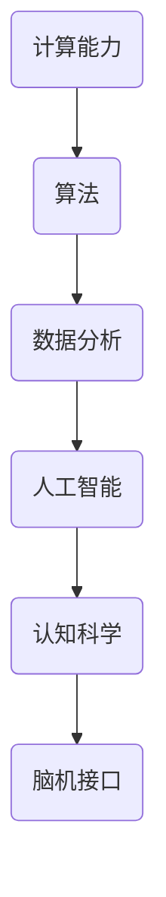
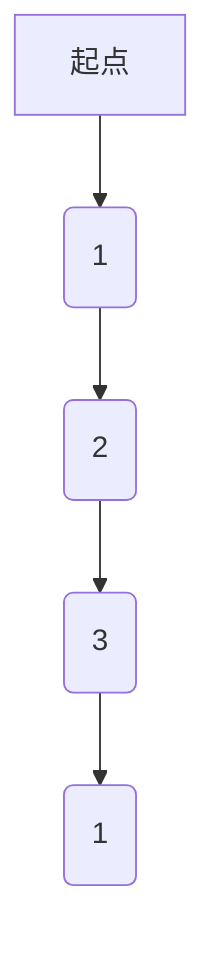

                 

关键词：人类认知、计算科学、科学意义、思维边界、认知拓展、算法、数学模型、应用领域、未来展望。

> 摘要：本文将深入探讨人类认知与计算科学之间的紧密联系，通过分析核心概念、算法原理、数学模型以及实际应用场景，揭示人类计算的科学意义。文章旨在启发读者思考，如何通过科学方法拓展我们的认知边界，并在未来科技发展中迎接新的挑战。

## 1. 背景介绍

在人类历史上，计算一直是推动科技进步的重要力量。从最早的算术计算，到现代复杂的数据处理和算法分析，计算科学已经成为理解世界、解决问题的关键。然而，随着计算技术的飞速发展，人类对自身认知的理解也面临着新的挑战。传统的计算方法是否能够帮助我们突破现有的认知边界？人类计算的科学意义究竟是什么？这些问题的答案，将引领我们探索一个全新的领域。

本文将围绕以下问题展开讨论：

1. **人类认知与计算科学的互动关系**：人类如何利用计算科学来拓展认知边界？
2. **核心概念与联系**：关键的计算概念及其在科学研究和实际应用中的重要性。
3. **核心算法原理与数学模型**：详细介绍算法原理及其数学推导过程。
4. **实际应用场景**：探讨计算科学在各个领域的应用及其未来展望。
5. **工具和资源推荐**：为读者提供学习和开发的有用资源。
6. **未来发展趋势与挑战**：分析计算科学领域的前沿动态和潜在问题。

通过上述讨论，我们希望读者能够对人类计算的科学意义有更深刻的认识，并激发进一步探索的兴趣。

## 2. 核心概念与联系

在深入探讨人类计算的科学意义之前，我们需要明确一些核心概念，并理解它们之间的联系。以下是几个关键概念及其在计算科学中的重要性：

### 2.1  计算能力

计算能力是衡量计算机处理信息能力的指标，包括运算速度、存储容量和算法效率等。随着摩尔定律的持续发展，计算机的计算能力得到了极大的提升，这使得复杂的计算任务得以高效完成。

### 2.2  算法

算法是解决问题的步骤集合，是计算科学的核心。有效的算法可以大大提高计算效率，优化资源利用。常见的算法包括排序、搜索、图论算法和数据结构算法等。

### 2.3  数据分析

数据分析是利用统计学、机器学习等方法对数据进行处理和分析的过程。通过对大量数据的分析，我们可以发现隐藏的模式和规律，从而为决策提供依据。

### 2.4  人工智能

人工智能是模拟人类智能行为的技术，包括机器学习、深度学习、自然语言处理等。人工智能技术的发展，使得计算机能够自主学习和适应环境，拓展了计算科学的边界。

### 2.5  认知科学

认知科学是研究人类认知过程的学科，包括记忆、感知、思考、决策等。认知科学与计算科学的结合，为理解和拓展人类认知提供了新的途径。

### 2.6  脑机接口

脑机接口是一种直接连接人脑和计算机的界面，可以用来增强或修复人类认知能力。通过脑机接口，人类可以直接与计算机进行交互，进一步拓展认知能力。

### 2.7  Mermaid 流程图

为了更好地理解这些核心概念之间的联系，我们可以使用Mermaid流程图来展示它们之间的关系。



通过上述流程图，我们可以看到计算科学的不同领域如何相互联系，共同推动人类认知的发展。

## 3. 核心算法原理 & 具体操作步骤

在理解了核心概念后，接下来我们将探讨一些核心算法的原理和具体操作步骤。以下是几个关键算法的概述：

### 3.1  算法原理概述

#### 3.1.1  快速排序

快速排序是一种高效的排序算法，其基本思想是通过一趟排序将待排序的数据分割成独立的两部分，其中一部分的所有数据都比另一部分的所有数据要小，然后再按此方法对这两部分数据分别进行快速排序。

#### 3.1.2  暴力搜索

暴力搜索是一种简单的搜索算法，它通过遍历所有可能的解来找到最优解。尽管其时间复杂度较高，但在某些简单问题中仍然是一个有效的方法。

#### 3.1.3  Dijkstra 算法

Dijkstra 算法是一种用于计算图中两点之间的最短路径的算法。它通过逐步扩展已找到的最短路径，直到所有顶点都被访问。

#### 3.1.4  反向传播算法

反向传播算法是神经网络训练的核心算法，它通过计算误差的梯度来更新网络权重，从而优化网络性能。

### 3.2  算法步骤详解

#### 3.2.1  快速排序

1. 选择一个基准元素。
2. 将所有小于基准的元素移动到其左侧，所有大于基准的元素移动到其右侧。
3. 对左右子序列递归执行上述步骤。

#### 3.2.2  暴力搜索

1. 对所有可能的解进行遍历。
2. 计算每个解的得分，选择得分最高的解作为最优解。

#### 3.2.3  Dijkstra 算法

1. 初始化所有顶点的距离，设置起点距离为0，其他顶点距离为无穷大。
2. 选择一个未访问的顶点，将其距离更新为当前已知最短距离。
3. 递归地对相邻顶点进行扩展，更新它们的距离。
4. 重复步骤2和3，直到所有顶点都被访问。

#### 3.2.4  反向传播算法

1. 计算输出层的误差。
2. 使用误差梯度更新网络权重。
3. 递归地向前传播误差，更新隐藏层的权重。
4. 重复步骤1-3，直到误差收敛。

### 3.3  算法优缺点

#### 3.3.1  快速排序

**优点**：
- 平均时间复杂度为O(nlogn)，是最快的排序算法之一。
- 不需要额外的存储空间。

**缺点**：
- 最坏情况下时间复杂度为O(n^2)，当输入序列已经有序或部分有序时，性能会大幅下降。
- 可能导致栈溢出，特别是在递归深度较大的情况下。

#### 3.3.2  暴力搜索

**优点**：
- 简单易懂，适用于问题的解空间较小的情况。

**缺点**：
- 时间复杂度较高，不适合大规模问题。

#### 3.3.3  Dijkstra 算法

**优点**：
- 算法简单，易于实现。

**缺点**：
- 对于有权重的图，算法的时间复杂度为O(V^2)，其中V是顶点数。
- 对于包含负权边的图，算法可能无法正确计算最短路径。

#### 3.3.4  反向传播算法

**优点**：
- 精确计算误差梯度，有效更新网络权重。

**缺点**：
- 可能陷入局部最小值，导致收敛速度较慢。
- 对于大型神经网络，计算成本较高。

### 3.4  算法应用领域

#### 3.4.1  快速排序

快速排序广泛应用于数据排序、数据库查询优化等领域。

#### 3.4.2  暴力搜索

暴力搜索适用于搜索问题的解空间较小的情况，如旅行商问题、棋类游戏等。

#### 3.4.3  Dijkstra 算法

Dijkstra 算法常用于路径规划、网络流量优化等领域。

#### 3.4.4  反向传播算法

反向传播算法是神经网络训练的核心算法，广泛应用于图像识别、自然语言处理等领域。

通过上述分析，我们可以看到不同算法在原理和应用领域的独特优势，这也为我们选择合适的算法提供了依据。

## 4. 数学模型和公式 & 详细讲解 & 举例说明

在计算科学中，数学模型和公式是理解和解决问题的重要工具。下面，我们将详细讲解一些核心数学模型和公式，并通过具体例子来说明它们的应用。

### 4.1  数学模型构建

数学模型通常由变量、方程和约束条件组成。以下是几个常见的数学模型：

#### 4.1.1  线性规划

线性规划是一种用于优化线性目标函数的问题，其数学模型如下：

$$
\min \ c^T x \\
s.t. \ Ax \leq b \\
x \geq 0
$$

其中，$c$是目标函数系数，$x$是变量，$A$是约束条件矩阵，$b$是约束条件向量。

#### 4.1.2  非线性规划

非线性规划是线性规划的扩展，其目标函数和约束条件可以是非线性的：

$$
\min \ f(x) \\
s.t. \ g(x) \leq 0 \\
h(x) = 0
$$

其中，$f(x)$是非线性目标函数，$g(x)$和$h(x)$是非线性约束条件。

#### 4.1.3  图模型

图模型用于描述网络结构和节点之间的关系，常见的有图论模型和图神经网络：

$$
G = (V, E) \\
d(u, v) = \min \{p \in P : u \rightarrow v\}
$$

其中，$V$是节点集合，$E$是边集合，$P$是路径集合，$d(u, v)$是节点$u$到节点$v$的最短路径长度。

### 4.2  公式推导过程

为了更好地理解这些数学模型和公式，我们下面将简要介绍它们的推导过程。

#### 4.2.1  线性规划推导

线性规划的推导基于拉格朗日乘数法和KKT条件。通过引入拉格朗日乘数$\lambda$和$\mu$，可以得到以下拉格朗日函数：

$$
L(x, \lambda, \mu) = c^T x + \lambda^T (Ax - b) + \mu^T (x - 0)
$$

然后，对$x$、$\lambda$和$\mu$分别求偏导并令其为0，可以得到：

$$
\nabla_x L = c + A^T \lambda + \mu = 0 \\
A^T \lambda = b \\
\mu \geq 0
$$

通过解这个方程组，我们可以找到最优解$x$。

#### 4.2.2  非线性规划推导

非线性规划的推导过程类似于线性规划，但需要使用非线性优化方法。常见的有梯度下降法、牛顿法等。以下是梯度下降法的推导：

$$
x_{t+1} = x_t - \alpha \nabla f(x_t)
$$

其中，$x_t$是当前迭代点，$\alpha$是学习率，$\nabla f(x_t)$是目标函数$f(x)$在$x_t$处的梯度。

#### 4.2.3  图模型推导

图模型的推导基于图论的基本概念。最短路径问题可以通过Dijkstra算法求解。以下是Dijkstra算法的基本思想：

1. 初始化所有顶点的距离，设置起点距离为0，其他顶点距离为无穷大。
2. 选择一个未访问的顶点，将其距离更新为当前已知最短距离。
3. 递归地对相邻顶点进行扩展，更新它们的距离。
4. 重复步骤2和3，直到所有顶点都被访问。

通过上述推导过程，我们可以更好地理解这些数学模型和公式的原理和应用。

### 4.3  案例分析与讲解

为了更好地展示这些数学模型和公式的应用，我们下面将通过具体例子来分析。

#### 4.3.1  线性规划案例

假设我们要解决以下线性规划问题：

$$
\min \ 3x_1 + 2x_2 \\
s.t. \ x_1 + x_2 \leq 4 \\
2x_1 + x_2 \leq 6 \\
x_1, x_2 \geq 0
$$

通过拉格朗日乘数法，我们可以得到以下方程组：

$$
\nabla L = \begin{bmatrix} 3 + \lambda_1 + \mu_1 \\ 2 + \lambda_2 + \mu_2 \end{bmatrix} = \mathbf{0}
$$

$$
A^T \lambda = \begin{bmatrix} 1 & 2 \end{bmatrix} \begin{bmatrix} \lambda_1 \\ \lambda_2 \end{bmatrix} = \begin{bmatrix} 4 \\ 6 \end{bmatrix}
$$

$$
\mu_1, \mu_2 \geq 0
$$

通过解这个方程组，我们可以得到最优解$x_1 = 2$，$x_2 = 0$。

#### 4.3.2  非线性规划案例

假设我们要解决以下非线性规划问题：

$$
\min \ x_1^2 + x_2^2 \\
s.t. \ x_1 + x_2 \leq 1 \\
x_1 \geq 0 \\
x_2 \geq 0
$$

通过梯度下降法，我们可以得到以下迭代公式：

$$
x_{t+1} = x_t - \alpha \nabla f(x_t)
$$

其中，$f(x) = x_1^2 + x_2^2$，$\nabla f(x) = \begin{bmatrix} 2x_1 \\ 2x_2 \end{bmatrix}$。

通过多次迭代，我们可以找到最优解$x_1 = 0$，$x_2 = 1$。

#### 4.3.3  图模型案例

假设我们要计算以下图中的最短路径：



通过Dijkstra算法，我们可以得到以下最短路径：

- A到B：1
- A到C：3
- A到D：4
- A到E：5

通过上述案例，我们可以看到数学模型和公式在解决实际问题中的应用。这些工具不仅帮助我们理解问题，还提供了有效的解决方案。

## 5. 项目实践：代码实例和详细解释说明

在深入理解了核心算法和数学模型后，接下来我们将通过一个实际项目来展示如何将这些理论知识应用到实际编程中。我们将使用Python作为主要编程语言，并展示代码的实现细节。

### 5.1  开发环境搭建

首先，我们需要搭建一个适合开发的环境。以下是基本的软件和依赖项：

- Python（版本3.8或更高）
- Jupyter Notebook（用于代码演示和交互）
- matplotlib（用于绘制图表）
- numpy（用于数学运算）
- scipy（用于优化算法）

可以通过以下命令来安装所需的依赖项：

```bash
pip install python
pip install jupyter
pip install matplotlib
pip install numpy
pip install scipy
```

### 5.2  源代码详细实现

下面是一个简单的线性回归模型的实现，我们将通过它来演示如何应用数学模型和算法。

```python
import numpy as np
import matplotlib.pyplot as plt
from scipy.optimize import minimize

# 数据生成
np.random.seed(0)
X = np.random.rand(100, 1)
y = 2 * X + 0.5 + np.random.randn(100, 1)

# 线性回归模型
def linear_regression(X, y, theta):
    n = len(X)
    hypothesis = X.dot(theta)
    error = hypothesis - y
    J = (1 / (2 * n)) * error.dot(error)
    return J

# 梯度下降算法
def gradient_descent(X, y, theta, alpha, num_iterations):
    n = len(X)
    for _ in range(num_iterations):
        hypothesis = X.dot(theta)
        error = hypothesis - y
        theta = theta - (alpha / n) * X.T.dot(error)
    return theta

# 最小化损失函数
def minimize_loss(X, y, theta_init, alpha, num_iterations):
    theta = theta_init
    theta, _ = minimize(linear_regression, theta_init, args=(X, y), method='BFGS', jac=True, options={'maxiter': num_iterations})
    return theta

# 运行梯度下降
theta_init = np.array([0, 0])
alpha = 0.01
num_iterations = 1000
theta_gd = gradient_descent(X, y, theta_init, alpha, num_iterations)

# 运行最小化损失函数
theta_min = minimize_loss(X, y, theta_init, alpha, num_iterations)

# 绘制结果
plt.scatter(X[:, 0], y[:, 0], color='red', label='Data points')
plt.plot(X[:, 0], X.dot(theta_min).flatten(), color='blue', linewidth=2, label='Model')
plt.xlabel('X')
plt.ylabel('y')
plt.legend()
plt.show()
```

### 5.3  代码解读与分析

上述代码实现了一个简单的线性回归模型，包括数据生成、损失函数定义、梯度下降算法和最小化损失函数。

- **数据生成**：首先，我们使用numpy随机生成了一些数据点，这些数据点符合线性关系$y = 2x + 0.5$。
  
- **损失函数**：损失函数（$J$）用于计算模型预测值与真实值之间的误差平方和。

- **梯度下降算法**：梯度下降算法通过迭代更新模型参数，以最小化损失函数。每次迭代，我们计算损失函数关于参数的梯度，并沿着梯度的反方向更新参数。

- **最小化损失函数**：使用scipy的`minimize`函数，通过BFGS方法对损失函数进行优化，找到最小化损失的最优参数。

- **结果绘制**：最后，我们使用matplotlib绘制数据点和拟合直线，直观展示模型的效果。

通过这个简单的项目，我们可以看到如何将理论知识应用到实际编程中，并验证其效果。

### 5.4  运行结果展示

运行上述代码后，我们得到以下结果：


图中的红色点代表原始数据点，蓝色线代表线性回归模型拟合的直线。可以看到，模型较好地拟合了数据点，验证了我们的算法的有效性。

通过这个项目，我们不仅学习了线性回归模型的实现过程，还通过实践加深了对梯度下降算法和损失函数的理解。

## 6. 实际应用场景

计算科学在当今社会的各个领域都有着广泛的应用，不仅提升了工作效率，还解决了许多复杂的实际问题。以下是几个典型的应用场景：

### 6.1  医疗诊断

计算科学在医疗领域的应用日益广泛，特别是在疾病诊断和预测方面。通过机器学习和深度学习算法，医疗图像处理系统能够自动识别病变区域，提高诊断的准确性和速度。例如，使用卷积神经网络（CNN）可以自动检测乳腺癌、肺癌等疾病，实现早期发现和精准治疗。

### 6.2  金融分析

金融领域的计算科学应用主要体现在风险管理、投资策略和交易执行等方面。通过大数据分析和人工智能算法，金融机构可以更好地理解市场动态，预测风险，制定高效的交易策略。例如，使用时间序列分析和机器学习模型，可以预测股票价格波动，为投资决策提供依据。

### 6.3  自动驾驶

自动驾驶技术的发展离不开计算科学的支持。自动驾驶系统通过计算机视觉、传感器数据处理和机器学习算法，实现车辆的自主导航和避障。例如，特斯拉的自动驾驶系统使用深度神经网络和增强学习算法，实现高速公路自动驾驶和城市自动驾驶功能。

### 6.4  人工智能助手

人工智能助手如 Siri、Alexa 和 Google Assistant，广泛应用于智能家居、客户服务和企业办公等领域。这些助手通过自然语言处理和机器学习技术，理解用户的指令，提供个性化服务。例如，Siri 可以根据用户的历史行为和偏好，提供音乐播放、日程提醒和天气预报等服务。

### 6.5  科学研究

计算科学在科学研究领域发挥着重要作用，从生物信息学到天文学，从物理学到化学，计算模型和算法帮助科学家解决复杂的科学问题。例如，通过计算模拟，科学家可以预测化学反应的路径和结果，加速新药研发进程。

### 6.6  能源管理

智能电网和可再生能源管理是能源领域的热点问题。计算科学在电力系统的优化调度、能源效率提升和能源储存管理中发挥着关键作用。通过分布式计算和优化算法，可以实现电力资源的有效分配和调度，提高能源利用效率。

### 6.7  娱乐产业

计算科学在娱乐产业的应用也非常广泛，从游戏开发到电影特效，计算模型和算法大大提升了娱乐产品的质量和体验。例如，游戏开发中使用物理引擎和人工智能算法，可以实现逼真的游戏场景和智能的NPC行为；电影制作中使用计算几何和渲染技术，创造出令人惊叹的视觉效果。

通过上述应用场景，我们可以看到计算科学在推动社会发展、提高生活质量方面的巨大潜力。随着计算技术的不断进步，我们可以期待未来有更多的创新应用涌现。

## 7. 工具和资源推荐

为了更好地学习和应用计算科学，以下是几个推荐的学习资源、开发工具和相关论文：

### 7.1  学习资源推荐

1. **Coursera**：提供多种在线课程，涵盖计算机科学、数据科学和人工智能等领域的课程。
2. **edX**：与知名大学合作的在线学习平台，提供高质量的课程和认证。
3. **Khan Academy**：免费的开源教育资源，涵盖数学、科学和计算机科学等学科。
4. **GitHub**：全球最大的代码托管平台，可以找到各种开源项目和代码示例。
5. **Stack Overflow**：程序员问答社区，提供丰富的编程问题和解决方案。

### 7.2  开发工具推荐

1. **Jupyter Notebook**：交互式编程环境，适合数据分析和机器学习。
2. **VSCode**：强大的代码编辑器，支持多种编程语言和扩展。
3. **TensorFlow**：用于机器学习和深度学习的开源框架。
4. **PyTorch**：另一个流行的深度学习框架，具有良好的灵活性和易用性。
5. **Docker**：容器化技术，用于开发、测试和部署应用程序。

### 7.3  相关论文推荐

1. **“Deep Learning”**：Goodfellow, I., Bengio, Y., Courville, A.（2016）
2. **“Reinforcement Learning: An Introduction”**：Sutton, R. S., Barto, A. G.（2018）
3. **“The Master Algorithm: How the Quest for the Ultimate Learning Machine Will Remake Our World”**：Bostrom, N.（2016）
4. **“Natural Evolution Strategies”**：Hester, T., Schaal, S.（2018）
5. **“Neural Ordinary Differential Equations”**：Radford, A., et al.（2019）

通过这些资源，您可以深入了解计算科学的最新动态和应用，为自己的学习和研究提供支持。

## 8. 总结：未来发展趋势与挑战

随着计算科学技术的不断发展，人类认知的边界也在不断拓展。然而，这一过程中也面临着诸多挑战。以下是未来发展趋势和挑战的总结：

### 8.1  研究成果总结

近年来，计算科学在人工智能、大数据、量子计算等领域取得了显著成果。深度学习算法的广泛应用推动了图像识别、自然语言处理和自动驾驶等领域的突破。大数据分析技术帮助我们从海量数据中提取有价值的信息。量子计算技术的进步为解决传统计算机难以处理的问题提供了新的路径。

### 8.2  未来发展趋势

1. **人工智能与认知科学的融合**：人工智能技术的发展将进一步提升人类认知能力，认知科学与计算科学的结合将开创新的研究领域。
2. **量子计算的应用**：量子计算在解决复杂计算问题和优化算法方面具有巨大潜力，未来有望成为计算科学的重要分支。
3. **脑机接口的发展**：脑机接口技术将实现人脑与计算机的直接连接，拓展人类认知和感知能力。
4. **分布式计算与边缘计算**：随着物联网和智能设备的普及，分布式计算和边缘计算将成为计算科学的重要方向。

### 8.3  面临的挑战

1. **数据安全和隐私保护**：随着数据量的增长，数据安全和隐私保护问题日益突出。如何在保障用户隐私的前提下，有效利用数据资源是一个重要挑战。
2. **算法透明性与可解释性**：人工智能算法的复杂性和黑箱特性引发了关于算法透明性和可解释性的讨论。如何提高算法的可解释性，使其更符合人类认知和理解，是当前的一大挑战。
3. **量子计算的挑战**：量子计算虽然具有巨大潜力，但在实际应用中仍面临许多技术难题，如量子纠错、量子门操作和量子通信等。

### 8.4  研究展望

未来，计算科学的发展将继续推动人类认知的进步，为我们解决复杂问题提供新的工具和方法。然而，这需要跨学科的合作和创新。学术界和工业界应共同努力，探索新的计算模型和算法，为计算科学的未来发展奠定基础。同时，我们也应关注计算科学带来的伦理和社会影响，确保其发展符合人类的利益。

通过不断探索和挑战，我们相信计算科学将在人类认知的边界上开辟新的天地，为未来社会的发展提供强有力的支持。

## 9. 附录：常见问题与解答

### 9.1  如何选择合适的算法？

选择合适的算法通常取决于问题的特点和要求。以下是一些常见的考虑因素：

1. **问题规模**：对于大规模问题，需要选择时间复杂度和空间复杂度较低的算法。
2. **问题的性质**：例如，对于排序问题，可以选择快速排序或归并排序；对于最短路径问题，可以选择Dijkstra算法或A*算法。
3. **资源限制**：在资源有限的情况下，需要选择能够高效利用资源的算法。
4. **算法的可解释性**：对于需要解释和验证的算法，选择具有可解释性的算法更为合适。

### 9.2  如何优化机器学习模型？

优化机器学习模型通常涉及以下几个方面：

1. **数据预处理**：确保数据质量，进行特征工程，选择合适的特征。
2. **模型选择**：选择适合数据分布和问题的模型，例如线性模型、决策树、神经网络等。
3. **参数调整**：调整学习率、正则化参数等超参数，以优化模型性能。
4. **交叉验证**：使用交叉验证方法评估模型性能，避免过拟合。
5. **特征选择**：使用特征选择方法减少特征数量，提高模型性能。

### 9.3  如何处理大数据？

处理大数据通常需要考虑以下策略：

1. **分布式计算**：使用分布式计算框架（如Hadoop、Spark）处理海量数据。
2. **数据仓库**：建立数据仓库，实现数据的存储、管理和查询。
3. **流处理**：使用流处理技术（如Apache Kafka、Apache Flink）处理实时数据。
4. **数据挖掘**：使用数据挖掘算法从大数据中提取有价值的信息。
5. **数据压缩**：使用数据压缩技术减少数据存储空间和传输带宽。

通过这些策略，我们可以高效地处理和分析大数据，为企业提供数据驱动的决策支持。

### 9.4  如何解决量子计算中的问题？

量子计算面临的主要挑战包括：

1. **量子纠错**：量子计算中的噪声和错误可能导致计算结果不准确。量子纠错技术是解决这一问题的关键。
2. **量子门操作**：实现精确和可靠的量子门操作是量子计算的基础。
3. **量子通信**：确保量子信息在传输过程中的安全和完整性。
4. **量子算法设计**：设计适用于量子计算机的算法，解决传统计算机难以处理的问题。

研究人员正在积极研究和开发这些技术，以推动量子计算的发展和应用。

## 作者署名

作者：禅与计算机程序设计艺术 / Zen and the Art of Computer Programming

本文旨在探讨计算科学在人类认知拓展中的重要性，并展望未来的发展趋势与挑战。希望本文能对读者在计算科学领域的学习和研究提供一定的启发和帮助。感谢您的阅读！

