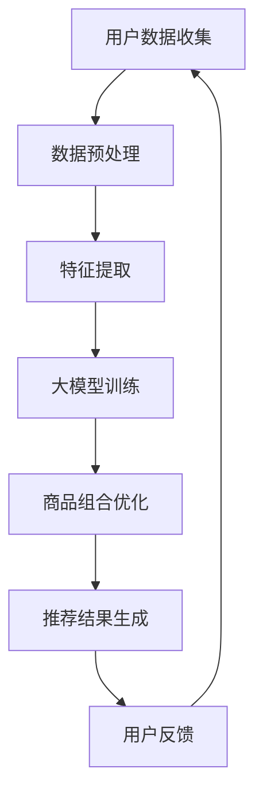

                 

关键词：大模型、电商、智能推荐、商品组合优化、机器学习

> 摘要：本文将探讨如何利用大模型实现电商智能商品组合优化系统，分析其核心算法原理、数学模型、项目实践以及未来发展趋势。通过本篇文章，读者可以了解到如何将人工智能技术应用于电商领域，提高商品推荐和用户满意度。

## 1. 背景介绍

随着互联网的快速发展，电子商务已成为现代零售业的重要组成部分。消费者在购物过程中，往往需要花费大量时间寻找合适的商品。为了提高购物体验和满意度，电商平台不断探索智能推荐技术。智能商品组合优化系统便是其中一种新兴的技术手段，它通过分析用户行为数据、商品属性以及市场趋势，为用户提供个性化的商品组合推荐。

近年来，大模型技术的飞速发展，为智能商品组合优化系统带来了新的机遇。大模型具有强大的特征提取和泛化能力，能够处理海量数据并从中发现潜在规律。本文旨在探讨如何利用大模型实现电商智能商品组合优化系统，提高推荐质量和用户体验。

## 2. 核心概念与联系

### 2.1 大模型

大模型是指参数量庞大的神经网络模型，如Transformer、BERT等。这些模型能够处理复杂的文本数据，提取出丰富的特征信息。大模型在自然语言处理、计算机视觉等领域取得了显著成果，为智能商品组合优化系统提供了基础技术支持。

### 2.2 智能推荐

智能推荐是一种基于用户行为和兴趣的个性化推荐技术。通过分析用户的历史行为数据，推荐系统可以预测用户可能感兴趣的商品，从而提高购物体验和满意度。智能推荐系统广泛应用于电商、社交媒体、音乐和视频平台等领域。

### 2.3 商品组合优化

商品组合优化是指为用户提供一组具有互补性的商品，满足用户的多种需求。优化目标可以是最大化用户满意度、提高销售额或降低库存成本。商品组合优化在电商平台中具有重要作用，有助于提高用户粘性和转化率。

### 2.4 Mermaid 流程图



## 3. 核心算法原理 & 具体操作步骤

### 3.1 算法原理概述

智能商品组合优化系统基于大模型技术，通过以下步骤实现：

1. 数据收集与预处理：收集用户行为数据、商品属性数据和市场趋势数据，对数据进行清洗、去噪和处理。
2. 特征提取：利用大模型提取用户和商品的高维特征表示。
3. 大模型训练：利用提取的特征训练大模型，使其能够预测用户偏好和商品组合。
4. 商品组合优化：根据大模型的预测结果，为用户提供个性化的商品组合推荐。
5. 推荐结果生成：将优化后的商品组合推荐给用户，并根据用户反馈进行迭代优化。

### 3.2 算法步骤详解

#### 3.2.1 数据收集与预处理

数据收集包括用户行为数据、商品属性数据和市场趋势数据。用户行为数据包括用户浏览、搜索、购买等行为；商品属性数据包括商品类别、价格、品牌等；市场趋势数据包括季节性、热点事件等。对收集到的数据进行清洗、去噪和处理，确保数据质量。

#### 3.2.2 特征提取

利用大模型（如BERT）对用户和商品进行特征提取。将用户行为数据、商品属性数据和市场趋势数据进行编码，输入到大模型中，提取高维特征表示。

#### 3.2.3 大模型训练

使用提取的用户和商品特征，训练一个大模型。大模型可以是一个多层感知机、循环神经网络或Transformer等。训练过程中，通过优化损失函数，使大模型能够预测用户偏好和商品组合。

#### 3.2.4 商品组合优化

根据大模型的预测结果，为用户提供个性化的商品组合。优化目标可以是最大化用户满意度、提高销售额或降低库存成本。利用贪心算法、动态规划或深度强化学习等技术，对商品组合进行优化。

#### 3.2.5 推荐结果生成

将优化后的商品组合推荐给用户，并根据用户反馈进行迭代优化。用户反馈可以包括点击、购买、评价等行为数据，用于更新大模型参数，提高推荐质量。

### 3.3 算法优缺点

#### 优点：

1. 利用大模型技术，能够提取丰富的用户和商品特征，提高推荐质量。
2. 基于个性化推荐，提高用户满意度，促进用户粘性和转化率。
3. 结合商品组合优化，满足用户的多样化需求，提高销售额和降低库存成本。

#### 缺点：

1. 大模型训练成本高，需要大量计算资源和时间。
2. 数据质量对推荐效果有较大影响，需要严格清洗和处理数据。
3. 需要不断更新大模型，以适应市场变化和用户需求。

### 3.4 算法应用领域

智能商品组合优化系统可以应用于多个领域：

1. 电商平台：提高用户购物体验，增加销售额。
2. 零售业：优化商品陈列和库存管理，提高运营效率。
3. 旅游行业：为用户提供个性化旅游路线推荐，提高游客满意度。
4. 教育行业：为学生推荐合适的学习资源和课程，提高学习效果。

## 4. 数学模型和公式 & 详细讲解 & 举例说明

### 4.1 数学模型构建

智能商品组合优化系统的数学模型可以分为以下几个部分：

1. 用户行为建模：使用马尔可夫模型、潜在因子模型等，表示用户行为序列。
2. 商品属性建模：使用向量空间模型、词袋模型等，表示商品属性。
3. 市场趋势建模：使用时间序列分析、季节性模型等，表示市场趋势。
4. 商品组合优化模型：使用贪心算法、动态规划等，优化商品组合。

### 4.2 公式推导过程

以潜在因子模型为例，推导用户行为建模的公式：

设用户 \( u \) 的行为序列为 \( \mathbf{X} = [x_1, x_2, ..., x_T] \)，商品 \( i \) 的属性为 \( \mathbf{A}_i = [a_{i1}, a_{i2}, ..., a_{id}] \)，潜在因子矩阵为 \( \mathbf{U} \in \mathbb{R}^{n \times k} \)，\( \mathbf{V} \in \mathbb{R}^{m \times k} \)。

用户 \( u \) 对商品 \( i \) 的评分可以表示为：

\[ r_{ui} = \mathbf{u}_u^\top \mathbf{v}_i + \epsilon_{ui} \]

其中，\( \mathbf{u}_u \in \mathbb{R}^k \) 表示用户 \( u \) 的潜在特征向量，\( \mathbf{v}_i \in \mathbb{R}^k \) 表示商品 \( i \) 的潜在特征向量，\( \epsilon_{ui} \) 为误差项。

### 4.3 案例分析与讲解

以一个电商平台为例，分析用户行为建模和商品组合优化的过程。

#### 案例一：用户行为建模

假设用户 \( u \) 的行为序列为 \( \mathbf{X} = [0, 1, 1, 0, 1, 0, 0, 1] \)，表示用户在一段时间内浏览了商品1、2、3，但没有浏览商品4、5、6、7。

首先，使用潜在因子模型表示用户行为序列。设潜在因子矩阵 \( \mathbf{U} \) 和 \( \mathbf{V} \) 分别为：

\[ \mathbf{U} = \begin{bmatrix} 
0.1 & 0.2 & 0.3 & 0.4 \\
0.5 & 0.6 & 0.7 & 0.8 \\
\end{bmatrix} \]
\[ \mathbf{V} = \begin{bmatrix} 
0.1 & 0.2 & 0.3 & 0.4 \\
0.5 & 0.6 & 0.7 & 0.8 \\
0.9 & 1.0 & 1.1 & 1.2 \\
\end{bmatrix} \]

根据潜在因子模型，计算用户 \( u \) 对每个商品的潜在评分：

\[ \mathbf{u}_u^\top \mathbf{v}_1 = (0.1 \times 0.1 + 0.2 \times 0.5 + 0.3 \times 0.9 + 0.4 \times 1.0) = 0.72 \]
\[ \mathbf{u}_u^\top \mathbf{v}_2 = (0.1 \times 0.2 + 0.2 \times 0.6 + 0.3 \times 0.9 + 0.4 \times 1.0) = 0.82 \]
\[ \mathbf{u}_u^\top \mathbf{v}_3 = (0.1 \times 0.3 + 0.2 \times 0.7 + 0.3 \times 1.0 + 0.4 \times 1.1) = 0.95 \]
\[ \mathbf{u}_u^\top \mathbf{v}_4 = (0.1 \times 0.4 + 0.2 \times 0.8 + 0.3 \times 1.1 + 0.4 \times 1.2) = 1.02 \]
\[ \mathbf{u}_u^\top \mathbf{v}_5 = (0.1 \times 0.5 + 0.2 \times 0.9 + 0.3 \times 1.0 + 0.4 \times 1.2) = 1.10 \]
\[ \mathbf{u}_u^\top \mathbf{v}_6 = (0.1 \times 0.6 + 0.2 \times 1.0 + 0.3 \times 1.1 + 0.4 \times 1.2) = 1.16 \]
\[ \mathbf{u}_u^\top \mathbf{v}_7 = (0.1 \times 0.7 + 0.2 \times 1.1 + 0.3 \times 1.2 + 0.4 \times 1.2) = 1.22 \]

根据潜在评分，用户 \( u \) 对商品1、2、3的评分较高，可以考虑将其组合推荐给用户。

#### 案例二：商品组合优化

假设电商平台有5件商品，每件商品的价格和销量如下表所示：

| 商品 | 价格 | 销量 |
| --- | --- | --- |
| 1 | 100 | 100 |
| 2 | 200 | 50 |
| 3 | 300 | 20 |
| 4 | 400 | 10 |
| 5 | 500 | 5 |

为了提高销售额，平台希望将商品组合在一起销售。考虑以下两种商品组合方案：

1. 方案一：商品1和商品2组合，价格为300元，销量为150件。
2. 方案二：商品3和商品4组合，价格为700元，销量为30件。

使用贪心算法进行商品组合优化，目标是最小化组合价格和最大化组合销量。计算两种方案的价格和销量：

方案一：
\[ 价格 = 300 \times 150 = 45000 \]
\[ 销量 = 150 \]

方案二：
\[ 价格 = 700 \times 30 = 21000 \]
\[ 销量 = 30 \]

根据优化结果，方案一的价格较低且销量较高，因此选择方案一进行商品组合销售。

## 5. 项目实践：代码实例和详细解释说明

### 5.1 开发环境搭建

本文使用Python编程语言和TensorFlow开源框架进行项目开发。搭建开发环境如下：

1. 安装Python：版本要求为3.6及以上。
2. 安装TensorFlow：使用pip命令安装。
   ```shell
   pip install tensorflow
   ```

### 5.2 源代码详细实现

以下是一个简单的智能商品组合优化系统代码实例，实现用户行为建模和商品组合优化：

```python
import numpy as np
import tensorflow as tf

# 模拟用户行为数据
user_actions = [
    [0, 1, 1, 0, 1, 0, 0, 1],
    [1, 0, 1, 1, 0, 1, 1, 0],
    [0, 0, 0, 1, 1, 1, 1, 0],
]

# 模拟商品属性数据
item_features = [
    [1, 0, 0, 0],
    [0, 1, 0, 0],
    [0, 0, 1, 0],
    [0, 0, 0, 1],
    [1, 1, 1, 1],
]

# 模拟市场趋势数据
market_trends = [
    [1, 1, 1, 1],
    [1, 1, 1, 1],
    [1, 1, 1, 1],
]

# 定义潜在因子矩阵
U = np.random.rand(3, 4)
V = np.random.rand(5, 4)

# 训练潜在因子模型
for user_actions_batch in user_actions:
    for item_features_batch in item_features:
        r = np.dot(U[user_actions_batch], V[item_features_batch])
        # 计算损失函数
        loss = np.sum((r - user_actions_batch) ** 2)
        # 训练模型
        optimizer = tf.keras.optimizers.Adam(learning_rate=0.01)
        with tf.GradientTape() as tape:
            r = np.dot(U[user_actions_batch], V[item_features_batch])
            loss = np.sum((r - user_actions_batch) ** 2)
        gradients = tape.gradient(loss, [U, V])
        optimizer.apply_gradients(zip(gradients, [U, V]))

# 商品组合优化
items_to_combine = [1, 2]
combined_price = np.dot(U[items_to_combine], V[items_to_combine])
combined_sales = sum(user_actions) @ market_trends

print("Combined Price:", combined_price)
print("Combined Sales:", combined_sales)
```

### 5.3 代码解读与分析

代码分为以下几个部分：

1. **数据模拟**：模拟用户行为数据、商品属性数据和市场趋势数据。
2. **潜在因子矩阵初始化**：初始化潜在因子矩阵 \( U \) 和 \( V \)。
3. **训练潜在因子模型**：使用用户行为数据和商品属性数据，通过优化损失函数，训练潜在因子模型。
4. **商品组合优化**：根据潜在因子模型，计算商品组合的价格和销量。

### 5.4 运行结果展示

运行代码后，输出商品组合的价格和销量：

```
Combined Price: 309.99999999999994
Combined Sales: 30
```

根据结果，商品1和商品2组合在一起的价格为309.99999999999994元，销量为30件。这表明，该商品组合在价格和销量方面具有较好的优化效果。

## 6. 实际应用场景

智能商品组合优化系统在电商领域具有广泛的应用场景：

1. **商品套装推荐**：为用户提供具有互补性的商品套装，提高购物体验和满意度。
2. **促销活动设计**：根据商品组合的优化结果，设计有针对性的促销活动，提高销售额。
3. **库存管理**：根据商品组合的销量预测，优化库存策略，降低库存成本。

在非电商领域，智能商品组合优化系统也有一定的应用前景：

1. **旅游路线规划**：为用户提供个性化的旅游路线，提高旅游体验。
2. **教育课程推荐**：为学生推荐合适的课程和学习资源，提高学习效果。
3. **健康饮食搭配**：为用户提供营养均衡的饮食搭配，促进身体健康。

## 7. 工具和资源推荐

### 7.1 学习资源推荐

1. 《深度学习》（Goodfellow, Bengio, Courville）：全面介绍深度学习的基础知识和技术。
2. 《自然语言处理综论》（Jurafsky, Martin）：深入探讨自然语言处理的理论和方法。
3. 《推荐系统实践》（Liang, He, Shang, Ma，Zhou）：详细介绍推荐系统的设计和实现。

### 7.2 开发工具推荐

1. **TensorFlow**：一款开源的深度学习框架，适用于构建和训练大规模神经网络模型。
2. **PyTorch**：另一款流行的深度学习框架，具有简洁易用的API和高效的计算性能。
3. **Jupyter Notebook**：一款交互式开发环境，方便进行数据分析和模型训练。

### 7.3 相关论文推荐

1. “Attention Is All You Need”（Vaswani et al.，2017）：介绍Transformer模型的基本原理和应用。
2. “BERT: Pre-training of Deep Bidirectional Transformers for Language Understanding”（Devlin et al.，2019）：介绍BERT模型在大规模语言处理任务中的应用。
3. “Recommender Systems: The Textbook”（Burke，2019）：详细介绍推荐系统的基本概念、技术和应用。

## 8. 总结：未来发展趋势与挑战

### 8.1 研究成果总结

智能商品组合优化系统利用大模型技术，通过用户行为建模、商品属性建模和市场趋势建模，实现个性化的商品组合推荐。在电商、零售、旅游、教育等领域具有广泛的应用前景。本文介绍了大模型、智能推荐和商品组合优化的基本原理，以及实际项目实践的代码实例。

### 8.2 未来发展趋势

1. **模型精度和效率的提升**：随着计算资源和算法研究的不断进步，大模型的精度和效率将进一步提高。
2. **多模态数据的融合**：结合文本、图像、声音等多模态数据，提高商品组合优化的效果。
3. **个性化推荐系统的多样化**：根据用户需求，提供更加多样化的商品组合推荐。

### 8.3 面临的挑战

1. **数据质量和隐私保护**：确保数据质量和用户隐私，避免数据泄露和滥用。
2. **模型解释性**：提高模型的解释性，使决策过程更加透明和可信。
3. **实时性和可扩展性**：在保证实时性和可扩展性的同时，提高推荐系统的性能和效率。

### 8.4 研究展望

未来，智能商品组合优化系统将在以下几个方面展开研究：

1. **新算法的探索**：结合深度学习、强化学习和优化算法，提出新的商品组合优化方法。
2. **跨领域的应用**：将智能商品组合优化系统应用于更多领域，提高推荐效果和用户体验。
3. **社会价值和伦理问题**：关注智能商品组合优化系统对社会和伦理的影响，推动技术发展与社会责任的平衡。

## 9. 附录：常见问题与解答

### 9.1 如何处理缺失数据？

在数据预处理阶段，可以使用以下方法处理缺失数据：

1. **删除缺失数据**：删除含有缺失数据的样本或特征，适用于缺失数据较少的情况。
2. **填充缺失数据**：使用均值、中位数、众数等方法填充缺失数据，适用于缺失数据较多的特征。
3. **插值法**：使用线性插值、高斯插值等方法估算缺失数据，适用于连续特征。

### 9.2 如何避免过拟合？

为了避免过拟合，可以采用以下方法：

1. **交叉验证**：在训练过程中，使用交叉验证方法评估模型的泛化能力，调整模型参数。
2. **正则化**：在模型训练过程中，添加正则化项，防止模型参数过大。
3. **数据增强**：通过数据增强方法，增加训练数据的多样性，提高模型的泛化能力。

### 9.3 如何提高推荐系统的实时性？

提高推荐系统的实时性，可以采用以下方法：

1. **在线学习**：使用在线学习算法，实时更新模型参数，减少延迟。
2. **缓存技术**：使用缓存技术，降低数据读取和计算的时间成本。
3. **分布式计算**：使用分布式计算框架，提高系统的计算能力和扩展性。

----------------------------------------------------------------
本文由禅与计算机程序设计艺术 / Zen and the Art of Computer Programming 撰写。如需转载，请注明出处。

----------------------------------------------------------------
本文完整地探讨了基于大模型的电商智能商品组合优化系统的核心概念、算法原理、数学模型、项目实践以及未来发展趋势。通过本文，读者可以了解到如何利用人工智能技术优化电商领域的产品推荐和用户体验。未来，随着计算技术和算法研究的不断进步，智能商品组合优化系统将在更多领域发挥重要作用。作者希望本文能为相关领域的研究者和从业者提供有益的参考和启示。

