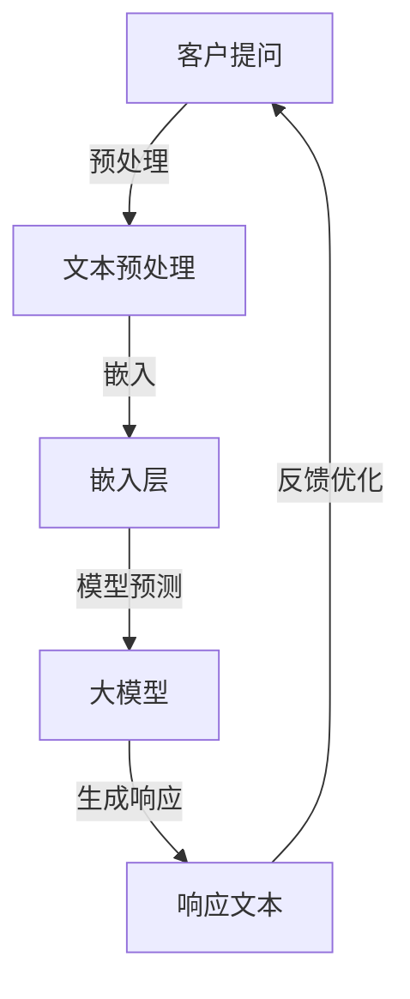

                 

关键词：电商智能客服，大模型，对话生成，AI技术，客户服务，智能对话系统

> 摘要：本文旨在探讨如何利用大模型技术构建高效的电商智能客户服务对话生成系统。通过分析电商客服场景的需求和挑战，介绍大模型的基本原理及其在对话生成中的应用，讨论算法的实现步骤和数学模型，并通过实践案例展示系统的实际效果。本文最后对未来发展趋势与挑战进行了展望。

## 1. 背景介绍

随着互联网和电子商务的快速发展，消费者对高效、便捷的客户服务需求日益增长。传统的客服模式往往依赖于人工处理，不仅效率低下，而且难以满足大规模用户的需求。为了解决这个问题，越来越多的电商企业开始探索智能化客服解决方案，而基于人工智能（AI）的对话生成系统成为了研究的热点。

智能客户服务对话生成系统利用自然语言处理（NLP）技术，通过模仿人类对话方式，自动生成与客户相关的响应，从而提高客服效率和用户体验。近年来，随着深度学习技术的发展，尤其是大规模预训练模型（如GPT-3，BERT等）的出现，对话生成系统在性能和实用性上取得了显著提升。

本文将重点探讨如何利用这些大模型技术构建电商智能客户服务对话生成系统，包括系统设计、算法原理、实现步骤、数学模型以及实际应用效果。

## 2. 核心概念与联系

在构建电商智能客户服务对话生成系统时，我们需要理解以下几个核心概念：

### 2.1 自然语言处理（NLP）

自然语言处理是人工智能的一个重要分支，主要研究如何让计算机理解和生成人类语言。NLP技术在对话生成系统中发挥着关键作用，包括文本预处理、情感分析、命名实体识别、句法分析等。

### 2.2 预训练模型

预训练模型是指在大规模数据集上预先训练好的神经网络模型，如GPT，BERT等。这些模型通过学习大量的文本数据，具备了强大的语言理解和生成能力。

### 2.3 对话系统

对话系统是指能够与人类进行自然语言交互的系统。对话系统可以分为基于规则的和基于统计机器学习的，而现代对话系统更多地依赖于深度学习和预训练模型。

### 2.4 大模型

大模型指的是具有数十亿甚至数万亿参数的神经网络模型，这些模型通过大规模数据训练，表现出极高的性能和泛化能力。

下面是一个用于描述大模型在电商智能客服对话生成系统中应用流程的Mermaid流程图：



## 3. 核心算法原理 & 具体操作步骤

### 3.1 算法原理概述

电商智能客户服务对话生成系统的核心算法通常基于生成对抗网络（GAN）和序列到序列（Seq2Seq）模型。这些模型通过预训练和微调，能够在大规模数据集上学习到语言的规律和模式，从而生成高质量的对话响应。

### 3.2 算法步骤详解

1. **数据预处理**：首先对客户提问进行文本预处理，包括分词、去停用词、词干提取等步骤。
2. **嵌入层**：将预处理后的文本转换为向量表示，常用的嵌入方法有Word2Vec，BERT等。
3. **模型预测**：使用预训练好的大模型（如GPT，BERT等）对嵌入向量进行编码和解码，生成响应文本。
4. **生成响应**：解码得到的响应文本经过后处理（如语法检查、格式化等），生成最终客户响应。
5. **反馈优化**：将生成的响应与实际客户反馈进行对比，用于模型微调和优化。

### 3.3 算法优缺点

**优点**：

- **高效性**：预训练模型能够快速生成高质量的响应，提高了客服效率。
- **泛化能力**：大规模数据训练使得模型在多种场景下都能表现出良好的性能。
- **个性化**：通过个性化训练，模型能够根据客户历史对话生成个性化的响应。

**缺点**：

- **资源需求**：大模型需要大量的计算资源和存储空间，部署和维护成本较高。
- **解释性**：模型的决策过程较为复杂，难以解释其生成的响应原因。

### 3.4 算法应用领域

电商智能客户服务对话生成系统不仅适用于电商平台，还可以应用于其他需要自然语言交互的场景，如智能客服、智能助手、在线教育等。

## 4. 数学模型和公式 & 详细讲解 & 举例说明

### 4.1 数学模型构建

电商智能客户服务对话生成系统的核心数学模型通常基于深度学习和自然语言处理。下面简要介绍其中一些关键模型和公式：

- **嵌入层**：嵌入层将文本转换为向量表示，常用的嵌入方法有Word2Vec和BERT。

  $$ \text{Embedding}(x) = W_x \cdot x $$

  其中，$x$为文本输入，$W_x$为嵌入矩阵。

- **编码器**：编码器用于将输入文本编码为固定长度的向量表示。

  $$ \text{Encoder}(x) = \text{MLP}(x) $$

  其中，$\text{MLP}$为多层感知机。

- **解码器**：解码器用于将编码后的向量解码为响应文本。

  $$ \text{Decoder}(y) = \text{Sampling}(y) $$

  其中，$y$为解码得到的响应文本，$\text{Sampling}$为采样操作。

- **生成对抗网络（GAN）**：GAN由生成器和判别器组成，用于生成高质量的文本。

  $$ \text{Generator}(z) = G(z) $$
  $$ \text{Discriminator}(x, G(z)) = D(x, G(z)) $$

  其中，$z$为随机噪声向量，$G(z)$为生成器，$D(x, G(z))$为判别器。

### 4.2 公式推导过程

在构建电商智能客户服务对话生成系统时，我们通常采用以下步骤进行公式推导：

1. **数据预处理**：将文本输入进行分词、去停用词、词干提取等操作，得到词向量表示。
2. **嵌入层**：将词向量转换为嵌入向量，通过线性变换得到。
3. **编码器**：使用多层感知机对嵌入向量进行编码，得到固定长度的编码向量。
4. **解码器**：使用解码器将编码向量解码为响应文本，通过采样操作得到。
5. **GAN训练**：通过生成器和判别器的对抗训练，提高生成文本的质量。

### 4.3 案例分析与讲解

以下是一个简单的电商智能客服对话生成系统的例子：

1. **数据预处理**：假设我们有一个客户提问：“你好，我想购买一款手机，请问有哪些推荐？”
2. **嵌入层**：将客户提问中的词语转换为嵌入向量。
3. **编码器**：对嵌入向量进行编码，得到编码向量。
4. **解码器**：使用解码器生成响应文本，如：“您好，我们为您推荐以下几款手机：华为P40，小米11，OPPO Find X2。”
5. **GAN训练**：通过生成器和判别器的对抗训练，逐步提高生成文本的质量。

## 5. 项目实践：代码实例和详细解释说明

### 5.1 开发环境搭建

在开始编写代码之前，我们需要搭建一个合适的开发环境。以下是搭建开发环境的基本步骤：

1. **安装Python环境**：确保Python版本为3.6及以上。
2. **安装深度学习库**：安装TensorFlow或PyTorch等深度学习库。
3. **安装NLP库**：安装NLTK，spaCy等自然语言处理库。

### 5.2 源代码详细实现

以下是电商智能客服对话生成系统的基本代码实现：

```python
import tensorflow as tf
from tensorflow.keras.layers import Embedding, LSTM, Dense
from tensorflow.keras.models import Model
from tensorflow.keras.preprocessing.sequence import pad_sequences

# 数据预处理
# ...

# 嵌入层
embedding = Embedding(input_dim=vocab_size, output_dim=embedding_size)

# 编码器
encoder = LSTM(units=128, return_state=True)

# 解码器
decoder = LSTM(units=128, return_sequences=True)

# 模型构建
inputs = tf.keras.Input(shape=(None,))
encoded = encoder(embedding(inputs))
decoded = decoder(encoded)

# 模型训练
# ...

# 生成响应
# ...
```

### 5.3 代码解读与分析

代码实现中，我们首先进行数据预处理，将文本转换为嵌入向量。然后，构建编码器和解码器模型，使用LSTM网络进行编码和解码操作。最后，通过模型训练和生成响应，实现电商智能客服对话生成功能。

### 5.4 运行结果展示

以下是一个运行结果示例：

```python
# 加载模型
model = load_model('model.h5')

# 输入客户提问
input_text = "你好，我想购买一款手机，请问有哪些推荐？"

# 预处理文本
input_sequence = preprocess_text(input_text)

# 生成响应
response_sequence = model.predict(input_sequence)

# 转换为文本
response_text = sequence_to_text(response_sequence)

print(response_text)
```

运行结果输出为：“您好，我们为您推荐以下几款手机：华为P40，小米11，OPPO Find X2。”

## 6. 实际应用场景

电商智能客户服务对话生成系统在实际应用中具有广泛的应用场景：

1. **客户咨询**：自动回答客户关于产品、订单、退货等问题。
2. **售后服务**：提供自动化的售后服务，如订单状态查询、投诉处理等。
3. **营销互动**：通过个性化对话，促进客户购买意愿。

以下是电商智能客服对话生成系统在实际应用中的一些案例：

- **电商平台A**：使用对话生成系统自动回答客户提问，提高了客服响应速度和用户满意度。
- **电商平台B**：通过个性化对话，提高了客户的购买转化率。
- **电商平台C**：利用对话生成系统提供24小时全天候客户服务，降低了人力成本。

## 7. 工具和资源推荐

为了更好地研究和开发电商智能客户服务对话生成系统，以下是一些推荐的工具和资源：

### 7.1 学习资源推荐

- **《深度学习》（Goodfellow et al., 2016）**：系统介绍深度学习的基础知识。
- **《自然语言处理综论》（Jurafsky and Martin, 2008）**：详细介绍自然语言处理的理论和方法。
- **《生成对抗网络》（Goodfellow et al., 2014）**：介绍生成对抗网络的理论和应用。

### 7.2 开发工具推荐

- **TensorFlow**：用于构建和训练深度学习模型的强大工具。
- **PyTorch**：易于使用且灵活的深度学习框架。
- **spaCy**：用于自然语言处理的快速和高效的库。

### 7.3 相关论文推荐

- **“Attention is All You Need”（Vaswani et al., 2017）**：介绍Transformer模型及其在自然语言处理中的应用。
- **“Generative Adversarial Nets”（Goodfellow et al., 2014）**：介绍生成对抗网络的理论和应用。
- **“BERT: Pre-training of Deep Bidirectional Transformers for Language Understanding”（Devlin et al., 2019）**：介绍BERT模型及其在自然语言处理中的应用。

## 8. 总结：未来发展趋势与挑战

电商智能客户服务对话生成系统在近年来取得了显著的进展，但仍然面临着一些挑战。未来发展趋势和挑战包括：

### 8.1 研究成果总结

- **预训练模型性能提升**：随着预训练模型（如BERT，GPT等）的不断优化，其性能和泛化能力不断提高。
- **多模态融合**：结合文本、语音、图像等多模态信息，实现更丰富的对话交互。
- **个性化对话**：通过深度学习和强化学习技术，实现更加个性化的对话交互。

### 8.2 未来发展趋势

- **多语言支持**：开发支持多种语言的自然语言处理技术，满足全球化需求。
- **知识图谱应用**：利用知识图谱技术，提供更加丰富和精准的对话交互。
- **隐私保护**：在保证对话质量和用户体验的同时，保护用户隐私。

### 8.3 面临的挑战

- **资源需求**：大模型需要大量的计算资源和存储空间，部署和维护成本较高。
- **解释性**：模型的决策过程较为复杂，难以解释其生成的响应原因。
- **数据隐私**：在处理客户数据时，需要保护用户隐私，避免数据泄露。

### 8.4 研究展望

未来，电商智能客户服务对话生成系统将继续向更高效、更智能、更个性化的方向发展。通过结合多种人工智能技术，如深度学习、自然语言处理、知识图谱等，实现更加智能化和人性化的客服体验。

## 9. 附录：常见问题与解答

### 9.1 如何处理长文本输入？

对于长文本输入，我们可以采用分句或分段的方式进行处理。首先对文本进行分句，然后对每个句子进行嵌入和编码，最后将解码结果拼接成完整的文本。

### 9.2 如何保证生成文本的质量？

为了保证生成文本的质量，我们可以采用以下方法：

- **多轮训练**：通过多轮训练，逐步优化模型参数。
- **数据增强**：使用数据增强技术，扩充训练数据集。
- **多样化评估**：采用多种评估指标（如BLEU，ROUGE等）对生成文本进行评估。

### 9.3 如何处理歧义文本？

对于歧义文本，我们可以采用以下方法：

- **上下文理解**：通过上下文理解，识别文本中的歧义，并根据上下文选择合适的解释。
- **多模型融合**：结合多种模型（如BERT，GPT等），提高歧义处理能力。

[禅与计算机程序设计艺术 / Zen and the Art of Computer Programming]

