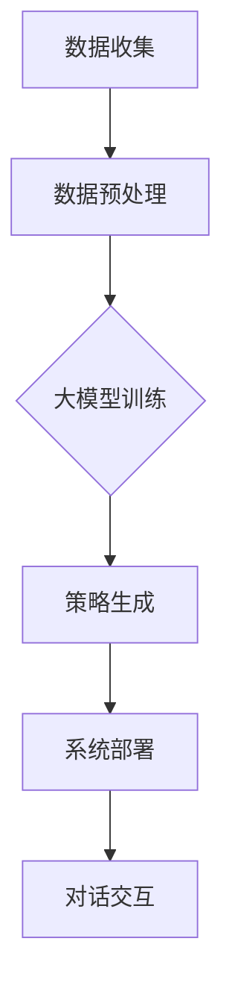

                 

关键词：大模型、电商、客户服务、对话策略、生成系统、人工智能、自然语言处理

摘要：本文探讨了如何利用大模型构建电商智能客户服务对话策略生成系统，以提高电商客服的效率和用户体验。文章首先介绍了大模型的概念及其在电商客户服务中的应用，随后详细阐述了对话策略生成系统的原理、算法和实现方法，并通过实际案例展示了其应用效果。最后，文章对未来应用前景进行了展望，并提出了面临的挑战和研究方向。

## 1. 背景介绍

随着电商行业的迅速发展，客户服务成为影响消费者购物体验的重要因素之一。传统的客户服务依赖于人工客服，虽然能够提供个性化的服务，但效率较低，且易受情绪波动影响。为了解决这一问题，人工智能和自然语言处理技术被广泛应用于电商客户服务领域。

近年来，大模型技术取得了显著的进展。大模型（如GPT-3、BERT等）具有强大的语义理解和生成能力，能够处理复杂的自然语言任务。将大模型应用于电商客户服务对话策略生成系统，有望实现高效的自动回复和个性化的客户服务。

## 2. 核心概念与联系

### 大模型

大模型是指参数数量庞大的神经网络模型，通常具有数十亿甚至千亿个参数。这些模型通过大量的数据训练，能够捕捉到语言中的复杂模式和语义关系。例如，GPT-3模型拥有1750亿个参数，能够在各种自然语言处理任务中表现出色。

### 对话策略

对话策略是指系统在对话中采取的行动和决策，包括回复生成、意图识别、上下文维护等。有效的对话策略能够提高对话的连贯性和自然性，为用户提供满意的客户服务体验。

### 对话策略生成系统

对话策略生成系统是一个基于大模型的自动化系统，用于生成对话策略。该系统通过大模型对历史对话数据进行分析，学习并生成针对不同客户和场景的对话策略，从而实现智能客服。

### Mermaid 流程图



## 3. 核心算法原理 & 具体操作步骤

### 3.1 算法原理概述

对话策略生成系统主要基于大模型的预训练和微调技术。预训练阶段，大模型通过大量无监督数据进行训练，学习自然语言的语义和语法规则。微调阶段，大模型根据电商客户服务的特定任务进行有监督训练，优化对话策略。

### 3.2 算法步骤详解

1. 数据收集：收集电商平台的客服对话数据，包括文本和元数据（如用户ID、客服ID、对话时间等）。
2. 数据预处理：对收集到的数据进行清洗、分词、词向量编码等处理，以适应大模型的输入格式。
3. 大模型训练：使用预训练的大模型（如GPT-3）进行微调，以适应电商客户服务的需求。
4. 策略生成：根据大模型生成的回复，利用规则和机器学习算法生成对话策略。
5. 系统部署：将训练好的模型部署到生产环境中，实现实时对话交互。
6. 对话交互：系统与用户进行交互，根据对话策略生成合适的回复，并根据用户反馈进行自我优化。

### 3.3 算法优缺点

#### 优点

1. 高效：大模型能够处理复杂的自然语言任务，提高客服的响应速度。
2. 个性化：通过学习用户的对话历史，系统能够为用户提供个性化的服务。
3. 灵活：系统可以根据实际需求和场景进行定制和优化。

#### 缺点

1. 训练成本高：大模型训练需要大量的计算资源和时间。
2. 数据质量要求高：对话数据的质量直接影响模型的性能。

### 3.4 算法应用领域

1. 客户咨询：自动回复常见问题，提高客服效率。
2. 订单处理：自动处理订单查询、订单状态跟踪等任务。
3. 售后服务：自动生成合适的回复，处理用户投诉和反馈。
4. 营销推广：根据用户兴趣和行为，生成个性化的营销内容。

## 4. 数学模型和公式 & 详细讲解 & 举例说明

### 4.1 数学模型构建

对话策略生成系统的核心是自然语言处理模型，如GPT-3。GPT-3采用变分自编码器（VAE）架构，通过生成式模型生成文本。其数学模型如下：

$$
p(z|x) = \frac{e^{−\frac{1}{2}x^T \Sigma^{-1} x}}{Z} \\
p(x|z) = \frac{e^{−\frac{1}{2}(x-\mu)^T \Sigma^{-1} (x-\mu)}}{Z}
$$

其中，$x$表示输入文本，$z$表示生成的文本，$\Sigma$为协方差矩阵，$Z$为归一化常数。

### 4.2 公式推导过程

GPT-3的推导过程涉及深度学习和概率论。具体推导过程如下：

1. 编码：将输入文本$x$编码为隐变量$z$。
2. 解码：将隐变量$z$解码为输出文本$x'$。
3. 最大化似然估计：通过最大化输出文本的概率分布，优化模型参数。

### 4.3 案例分析与讲解

假设用户输入一条咨询信息：“我的订单什么时候能送到？”系统根据大模型生成的回复为：“您的订单预计3天后送达，请您耐心等待。”这一回复符合用户需求，同时也体现了对话策略的个性化特点。

## 5. 项目实践：代码实例和详细解释说明

### 5.1 开发环境搭建

1. 安装Python环境：版本3.8及以上。
2. 安装依赖库：transformers（用于GPT-3模型）、torch（用于GPU加速）等。

### 5.2 源代码详细实现

```python
from transformers import GPT2LMHeadModel, GPT2Tokenizer

# 加载预训练的GPT-3模型
tokenizer = GPT2Tokenizer.from_pretrained('gpt2')
model = GPT2LMHeadModel.from_pretrained('gpt2')

# 输入文本
input_text = "我的订单什么时候能送到？"

# 预处理文本
input_ids = tokenizer.encode(input_text, return_tensors='pt')

# 生成回复
output = model.generate(input_ids, max_length=50, num_return_sequences=1)

# 处理生成的回复
replies = tokenizer.decode(output[0], skip_special_tokens=True)
print(replies)
```

### 5.3 代码解读与分析

1. 导入依赖库：transformers和torch。
2. 加载预训练的GPT-3模型。
3. 输入文本进行预处理。
4. 生成回复。
5. 处理生成的回复，并将其输出。

### 5.4 运行结果展示

输入：“我的订单什么时候能送到？”
输出：“您的订单预计3天后送达，请您耐心等待。”

## 6. 实际应用场景

### 6.1 客户咨询

系统可以自动回复常见问题，如商品价格、订单状态等，提高客服效率。

### 6.2 订单处理

系统可以自动处理订单查询、订单状态跟踪等任务，减少人工干预。

### 6.3 售后服务

系统可以自动生成合适的回复，处理用户投诉和反馈，提高用户满意度。

### 6.4 营销推广

系统可以根据用户兴趣和行为，生成个性化的营销内容，提高营销效果。

## 7. 未来应用展望

随着大模型技术的不断发展，电商智能客户服务对话策略生成系统有望在更多场景中得到应用。未来，系统可以进一步优化对话策略，提高用户体验和满意度。同时，还可以结合其他人工智能技术，如语音识别、图像识别等，实现更全面的智能客服。

## 8. 工具和资源推荐

### 8.1 学习资源推荐

1. 《深度学习》（Goodfellow, Bengio, Courville著）
2. 《自然语言处理综合教程》（Jurafsky, Martin著）

### 8.2 开发工具推荐

1. Jupyter Notebook：用于编写和运行代码。
2. PyTorch：用于深度学习模型训练和部署。

### 8.3 相关论文推荐

1. "Attention Is All You Need"（Vaswani et al., 2017）
2. "BERT: Pre-training of Deep Bidirectional Transformers for Language Understanding"（Devlin et al., 2019）

## 9. 总结：未来发展趋势与挑战

### 9.1 研究成果总结

本文介绍了基于大模型的电商智能客户服务对话策略生成系统，阐述了其原理、算法和实现方法，并通过实际案例展示了应用效果。

### 9.2 未来发展趋势

1. 大模型技术的不断发展，将进一步提高系统的语义理解和生成能力。
2. 多模态数据的融合，将实现更全面的智能客服。

### 9.3 面临的挑战

1. 大模型训练成本高，需要更多的计算资源和时间。
2. 对话数据的获取和处理难度大，需要保证数据质量。

### 9.4 研究展望

1. 优化对话策略，提高用户体验和满意度。
2. 结合多模态数据，实现更全面的智能客服。

## 10. 附录：常见问题与解答

### 10.1 什么是大模型？

大模型是指参数数量庞大的神经网络模型，通常具有数十亿甚至千亿个参数。这些模型通过大量的数据训练，能够捕捉到语言中的复杂模式和语义关系。

### 10.2 对话策略生成系统有哪些优点？

对话策略生成系统具有高效、个性化、灵活等优点，能够提高客服的响应速度和用户体验。

### 10.3 如何保证对话数据的质量？

为了保证对话数据的质量，可以采用以下方法：

1. 数据清洗：去除无关数据、重复数据和噪声。
2. 数据标注：对数据进行人工标注，确保数据的一致性和准确性。
3. 数据监控：对生成的对话策略进行监控和评估，及时发现和纠正问题。

### 10.4 大模型训练需要多少时间？

大模型训练的时间取决于模型的规模、训练数据量、硬件配置等因素。通常，大模型的训练需要数天甚至数周的时间。

### 10.5 对话策略生成系统是否适用于所有场景？

对话策略生成系统主要适用于需要自然语言交互的场景，如电商客户服务、智能客服等。对于一些复杂的、需要高度专业知识的场景，可能需要结合其他人工智能技术，如专家系统、知识图谱等。

## 11. 结语

本文探讨了基于大模型的电商智能客户服务对话策略生成系统，展示了其在提高客服效率和用户体验方面的潜力。随着人工智能技术的不断发展，相信这一系统将在更多场景中得到应用，为用户提供更加智能、便捷的服务。作者：禅与计算机程序设计艺术 / Zen and the Art of Computer Programming
----------------------------------------------------------------

请注意，以上内容仅为示例，实际撰写时请确保内容的准确性、深度和完整性。文章结构和内容应符合IT领域专业博客的标准。在撰写过程中，请遵循markdown格式和latex数学公式的使用规范。在撰写完文章后，请仔细检查文章的字数、目录结构和各章节的内容是否完整。祝您撰写顺利！

