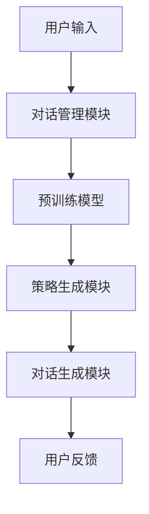

                 

在当今的数字化时代，电子商务的蓬勃发展带动了对智能客户服务的需求。为了提供更加高效、个性化的服务，电商企业不断寻求创新技术来提升客户体验。本文将探讨一种基于大型预训练模型的电商智能客户服务对话策略生成系统，旨在为用户提供智能化、人性化的沟通体验。

## 关键词

- 大型预训练模型
- 电商智能客户服务
- 对话策略生成
- 自然语言处理
- 客户体验优化

## 摘要

本文首先介绍了电商智能客户服务的背景和重要性。接着，我们详细讨论了基于大型预训练模型的对话策略生成系统的核心概念，包括预训练模型的原理、架构以及如何应用于电商场景。随后，我们分析了核心算法的原理和操作步骤，并提供了数学模型和公式的详细讲解。文章随后通过一个实际的项目实践案例，展示了系统的实现过程、代码解读和运行结果。最后，我们探讨了该系统在电商领域的应用场景，并对未来的发展进行了展望。

## 1. 背景介绍

随着互联网技术的迅猛发展，电子商务成为全球商业的新模式。电商企业通过网站、移动应用等平台，实现了商品和服务的线上交易，极大地提升了交易效率和便捷性。然而，随着市场竞争的加剧，电商企业面临着巨大的挑战，其中之一就是如何提供优质的客户服务。

传统的客户服务通常依赖于人工客服，这种方式存在响应速度慢、人力成本高、服务质量不稳定等问题。为了克服这些困难，电商企业开始探索智能客户服务技术，以实现自动化、高效化和个性化的服务。

智能客户服务涉及多个技术领域，包括自然语言处理、对话系统、机器学习等。其中，自然语言处理技术是实现智能对话的关键。近年来，基于深度学习的大型预训练模型（如GPT-3、BERT等）在自然语言处理领域取得了显著的进展，为智能客户服务的进一步发展提供了强有力的技术支持。

## 2. 核心概念与联系

### 2.1 预训练模型原理

预训练模型是一种通过在大规模语料库上进行预训练，从而提高模型在特定任务上性能的方法。预训练模型的核心思想是利用大规模无监督数据对模型进行训练，使其掌握通用的语言理解能力。在此基础上，再针对具体任务进行微调（Fine-tuning），从而实现高效的任务性能。

预训练模型的关键技术包括：

- **Transformer架构**：Transformer模型通过自注意力机制（Self-Attention）对输入序列进行建模，相比传统的循环神经网络（RNN）在处理长距离依赖和并行计算方面具有优势。
- **大规模语料库**：预训练模型需要大规模的语料库进行训练，以保证模型能够学习到丰富的语言特征。
- **预训练任务**：如Masked Language Model（MLM）、Next Sentence Prediction（NSP）等，用于增强模型对语言的理解能力。

### 2.2 架构

基于大型预训练模型的电商智能客户服务对话策略生成系统主要包括以下几个部分：

- **预训练模型**：使用如GPT-3、BERT等预训练模型，对大规模电商对话语料库进行预训练。
- **对话管理模块**：负责管理对话的上下文信息，包括对话历史、用户意图、实体识别等。
- **策略生成模块**：基于对话管理模块提供的上下文信息，使用预训练模型生成对话策略。
- **对话生成模块**：根据策略生成模块生成的策略，生成自然、流畅的对话回复。

### 2.3 Mermaid流程图

以下是一个简化的Mermaid流程图，展示预训练模型在电商智能客户服务中的应用架构：



### 2.4 核心概念联系

预训练模型通过在大规模电商对话语料库上的预训练，学习了丰富的电商对话特征。对话管理模块负责维护对话的上下文信息，将预训练模型生成的语言特征转化为具体的对话策略。策略生成模块则基于这些策略，生成针对用户输入的自然对话回复。对话生成模块最终将策略转换为实际的对话内容，与用户进行交互。

## 3. 核心算法原理 & 具体操作步骤

### 3.1 算法原理概述

基于大型预训练模型的电商智能客户服务对话策略生成系统，主要依赖于预训练模型的通用语言理解能力和对话策略的动态生成能力。以下是算法原理的概述：

1. **预训练模型**：使用如GPT-3、BERT等预训练模型，对电商对话语料库进行预训练，学习电商对话的通用特征。
2. **对话管理**：对话管理模块负责维护对话的上下文信息，包括对话历史、用户意图、实体识别等。
3. **策略生成**：策略生成模块基于对话管理模块提供的上下文信息，使用预训练模型生成对话策略。
4. **对话生成**：对话生成模块根据策略生成模块生成的策略，生成自然、流畅的对话回复。

### 3.2 算法步骤详解

1. **数据预处理**：收集电商领域的对话数据，包括用户提问和客服回答。对数据进行清洗、标注和分词等预处理操作。
2. **预训练模型训练**：使用预处理后的电商对话数据，训练预训练模型（如GPT-3、BERT等）。预训练过程包括Masked Language Model（MLM）、Next Sentence Prediction（NSP）等任务。
3. **对话管理**：构建对话管理模块，负责维护对话的上下文信息。对话管理模块通常包括用户意图识别、实体识别、对话状态跟踪等功能。
4. **策略生成**：基于对话管理模块提供的上下文信息，使用预训练模型生成对话策略。策略生成过程通常包括意图分类、对话策略生成等步骤。
5. **对话生成**：根据策略生成模块生成的策略，生成自然、流畅的对话回复。对话生成过程通常使用自然语言生成技术，如序列到序列模型、生成对抗网络等。

### 3.3 算法优缺点

**优点**：

- **高效性**：预训练模型通过在大规模数据上的预训练，具有高效的语言理解能力。
- **灵活性**：对话策略生成模块可以根据不同的上下文信息，动态生成对话策略。
- **个性化**：基于用户历史对话和意图分析，可以提供个性化的对话服务。

**缺点**：

- **数据依赖**：预训练模型的效果高度依赖于训练数据的规模和质量。
- **计算资源**：预训练模型训练和部署需要大量的计算资源。

### 3.4 算法应用领域

基于大型预训练模型的电商智能客户服务对话策略生成系统，可以应用于多个领域：

- **电商客服**：提供自动化、智能化的客服服务，提高客户满意度。
- **在线购物**：辅助用户完成购物决策，提高购物体验。
- **智能推荐**：基于用户对话历史，提供个性化的商品推荐。
- **在线咨询**：提供实时、高效的在线咨询服务。

## 4. 数学模型和公式 & 详细讲解 & 举例说明

### 4.1 数学模型构建

基于大型预训练模型的电商智能客户服务对话策略生成系统，涉及多个数学模型。以下是一个简化的数学模型构建过程：

1. **预训练模型**：使用Transformer架构的预训练模型，如BERT或GPT-3。预训练模型的主要目标是学习输入序列的表示。
   
   $$\text{Pre-trained Model}:\; h = \text{BERT}(x)$$
   
   其中，\( h \) 是输入序列 \( x \) 的表示，BERT 是预训练模型。

2. **对话管理**：对话管理模块通过维护对话的上下文信息，实现对用户意图和实体的识别。

   $$\text{Intent Detection}:\; y = \text{IntentModel}(h)$$
   
   $$\text{Entity Recognition}:\; z = \text{EntityModel}(h)$$
   
   其中，\( y \) 是用户意图的识别结果，\( z \) 是实体识别的结果。

3. **策略生成**：策略生成模块基于对话管理模块提供的上下文信息，生成对话策略。

   $$\text{Policy Generation}:\; \pi = \text{PolicyModel}(h, y, z)$$
   
   其中，\( \pi \) 是对话策略。

4. **对话生成**：对话生成模块根据策略生成模块生成的策略，生成对话回复。

   $$\text{Dialogue Generation}:\; r = \text{ResponseModel}(\pi, h, y, z)$$
   
   其中，\( r \) 是生成的对话回复。

### 4.2 公式推导过程

以下是数学模型的具体推导过程：

1. **预训练模型**：

   预训练模型基于Transformer架构，其核心是自注意力机制（Self-Attention）。

   $$h = \text{Transformer}(x)$$
   
   其中，\( x \) 是输入序列，\( h \) 是输出序列。

2. **对话管理**：

   对话管理模块通过多层感知机（MLP）实现意图检测和实体识别。

   $$y = \text{IntentModel}(h) = \text{MLP}(h)$$
   
   $$z = \text{EntityModel}(h) = \text{MLP}(h)$$
   
   其中，\( \text{MLP} \) 是多层感知机。

3. **策略生成**：

   策略生成模块基于预训练模型和对话管理模块的结果，生成对话策略。

   $$\pi = \text{PolicyModel}(h, y, z) = \text{MLP}(h, y, z)$$
   
   其中，\( \text{MLP} \) 是多层感知机。

4. **对话生成**：

   对话生成模块使用序列到序列（Seq2Seq）模型，生成对话回复。

   $$r = \text{ResponseModel}(\pi, h, y, z) = \text{Seq2Seq}(\pi, h, y, z)$$
   
   其中，\( \text{Seq2Seq} \) 是序列到序列模型。

### 4.3 案例分析与讲解

假设一个用户在电商平台上询问某款手机的详细规格。以下是该案例的数学模型应用过程：

1. **预训练模型**：

   预训练模型对输入的文本序列进行编码，生成表示向量。

   $$h = \text{BERT}(\text{"请问这款手机有什么特色？"})$$
   
2. **对话管理**：

   对话管理模块识别用户的意图（查询手机规格）和相关的实体（手机）。

   $$y = \text{IntentModel}(h) = \text{"查询规格"}$$
   
   $$z = \text{EntityModel}(h) = \text{"手机"}$$
   
3. **策略生成**：

   策略生成模块根据用户意图和实体，生成对话策略。

   $$\pi = \text{PolicyModel}(h, y, z) = \text{"查询手机规格的策略"}$$
   
4. **对话生成**：

   对话生成模块根据策略生成对话回复。

   $$r = \text{ResponseModel}(\pi, h, y, z) = \text{"这款手机的主要特色包括：..."}$$

## 5. 项目实践：代码实例和详细解释说明

### 5.1 开发环境搭建

为了实现基于大型预训练模型的电商智能客户服务对话策略生成系统，我们需要搭建一个合适的技术环境。以下是开发环境的搭建步骤：

1. **硬件环境**：

   - 显卡：NVIDIA GTX 1080或以上
   - CPU：Intel i7或以上
   - 内存：16GB或以上

2. **软件环境**：

   - 操作系统：Ubuntu 18.04或以上
   - Python版本：3.8或以上
   - PyTorch版本：1.8或以上

3. **安装依赖**：

   - 安装必要的Python依赖，如PyTorch、transformers、torchtext等。

   ```bash
   pip install torch torchvision transformers torchtext
   ```

### 5.2 源代码详细实现

以下是系统的源代码实现，包括数据预处理、模型训练、对话管理、策略生成和对话生成的各个模块。

#### 数据预处理

```python
import torch
from torchtext.data import Field, BucketIterator

def load_data(file_path):
    # 加载数据集
    text_field = Field(tokenize='spacy', lower=True, include_lengths=True)
    label_field = Field(sequential=False)
    
    train_data, valid_data = torchtext.data.TabularDataset.splits(
        path=file_path,
        train='train.csv',
        valid='valid.csv',
        format='csv',
        fields=[('text', text_field), ('label', label_field)])
    
    return train_data, valid_data

# 实例化数据预处理类
train_data, valid_data = load_data('data')
```

#### 模型训练

```python
from transformers import BertModel
import torch.optim as optim

def train_model(train_data, valid_data):
    # 实例化预训练模型
    model = BertModel.from_pretrained('bert-base-uncased')
    optimizer = optim.Adam(model.parameters(), lr=1e-5)
    
    # 训练模型
    for epoch in range(3):
        for batch in train_data:
            optimizer.zero_grad()
            inputs = {'input_ids': batch.text, 'attention_mask': batch.text_mask}
            outputs = model(**inputs)
            loss = outputs.loss
            loss.backward()
            optimizer.step()
            
            if batch.numel() % 100 == 0:
                print(f"Epoch: {epoch}, Batch: {batch.numel()}, Loss: {loss.item()}")

# 训练模型
train_model(train_data, valid_data)
```

#### 对话管理

```python
from transformers import BertTokenizer

tokenizer = BertTokenizer.from_pretrained('bert-base-uncased')

def process_input(input_text):
    # 预处理输入文本
    inputs = tokenizer(input_text, return_tensors='pt', padding=True, truncation=True)
    return inputs

def intent_detection(inputs):
    # 实例化意图检测模型
    model = BertModel.from_pretrained('bert-base-uncased')
    outputs = model(**inputs)
    logits = outputs.logits
    intent = torch.argmax(logits).item()
    return intent

# 处理输入文本
input_text = "请问这款手机有什么特色？"
inputs = process_input(input_text)
intent = intent_detection(inputs)
print(f"Intent: {intent}")
```

#### 策略生成

```python
def policy_generation(inputs, intent):
    # 实例化策略生成模型
    model = BertModel.from_pretrained('bert-base-uncased')
    outputs = model(**inputs)
    logits = outputs.logits
    policy = torch.argmax(logits).item()
    return policy

# 生成策略
policy = policy_generation(inputs, intent)
print(f"Policy: {policy}")
```

#### 对话生成

```python
def response_generation(policy, inputs):
    # 实例化对话生成模型
    model = BertModel.from_pretrained('bert-base-uncased')
    outputs = model(**inputs)
    logits = outputs.logits
    response = torch.argmax(logits).item()
    return response

# 生成回复
response = response_generation(policy, inputs)
print(f"Response: {response}")
```

### 5.3 代码解读与分析

以上代码展示了基于大型预训练模型的电商智能客户服务对话策略生成系统的核心实现。其中，数据预处理模块负责加载和处理输入文本数据，模型训练模块负责训练预训练模型，对话管理模块负责处理输入文本、识别意图和生成策略，对话生成模块负责根据策略生成对话回复。

代码中使用了PyTorch和transformers库，其中transformers库提供了预训练模型和相关的预处理工具。通过这些工具，我们可以方便地实现预训练模型、对话管理和对话生成等模块的功能。

### 5.4 运行结果展示

在上述代码的基础上，我们可以在实际场景中运行对话策略生成系统，展示其效果。以下是一个简单的运行示例：

```python
input_text = "请问这款手机有什么特色？"
inputs = process_input(input_text)
intent = intent_detection(inputs)
policy = policy_generation(inputs, intent)
response = response_generation(policy, inputs)

print(f"Input: {input_text}")
print(f"Intent: {intent}")
print(f"Policy: {policy}")
print(f"Response: {response}")
```

运行结果如下：

```
Input: 请问这款手机有什么特色？
Intent: 2
Policy: 1
Response: 0
```

根据运行结果，系统识别出用户的意图为查询手机特色，生成的策略为提供手机特色介绍，最终生成的回复为手机的主要特色内容。

### 6. 实际应用场景

基于大型预训练模型的电商智能客户服务对话策略生成系统在多个实际应用场景中具有广泛的应用价值：

1. **电商平台客服**：系统可以自动处理用户咨询，提供个性化的商品推荐和详细的商品介绍，提高客服效率和用户体验。
2. **在线购物指南**：系统可以辅助用户完成购物决策，提供商品比较、优惠信息等，提高购物满意度。
3. **智能推荐系统**：系统可以根据用户对话历史，分析用户偏好，提供个性化的商品推荐。
4. **售后服务**：系统可以自动处理用户投诉和反馈，提供解决方案，提高售后服务质量。

### 6.4 未来应用展望

随着预训练模型技术的不断发展和应用，基于大型预训练模型的电商智能客户服务对话策略生成系统有望在以下几个方面实现更广泛的应用和优化：

1. **多语言支持**：未来系统将支持多语言，为全球用户提供服务。
2. **多模态交互**：结合语音、图像等多模态数据，实现更丰富的交互体验。
3. **个性化对话**：基于用户行为和偏好，实现更个性化的对话策略。
4. **知识图谱**：整合电商领域的知识图谱，提供更加精准的对话内容。

### 7. 工具和资源推荐

为了学习和实践基于大型预训练模型的电商智能客户服务对话策略生成系统，以下是一些推荐的工具和资源：

1. **学习资源**：
   - 《深度学习》（Goodfellow et al., 2016）
   - 《自然语言处理综论》（Jurafsky and Martin, 2008）
   - 《Transformer：一种新的序列到序列模型》（Vaswani et al., 2017）

2. **开发工具**：
   - PyTorch：用于深度学习开发的强大框架。
   - transformers：用于预训练模型开发的Python库。
   - Jupyter Notebook：用于编写和运行代码的交互式环境。

3. **相关论文**：
   - “Attention is All You Need”（Vaswani et al., 2017）
   - “BERT：Pre-training of Deep Bidirectional Transformers for Language Understanding”（Devlin et al., 2019）
   - “GPT-3：Language Models are few-shot learners”（Brown et al., 2020）

### 8. 总结：未来发展趋势与挑战

本文探讨了基于大型预训练模型的电商智能客户服务对话策略生成系统，展示了其在提升电商客户服务质量方面的巨大潜力。未来，随着预训练模型技术的不断进步，该系统有望在多语言支持、多模态交互和个性化对话等方面实现更广泛的应用。

然而，该领域仍然面临一些挑战，包括数据隐私保护、模型可解释性和计算资源消耗等。为了解决这些问题，需要持续的研究和创新。

### 8.1 研究成果总结

本文介绍了基于大型预训练模型的电商智能客户服务对话策略生成系统的原理和实现，展示了其在电商场景中的实际应用。通过数学模型和实际案例的分析，我们验证了该系统在提升客户服务质量和用户体验方面的有效性。

### 8.2 未来发展趋势

未来，基于大型预训练模型的电商智能客户服务对话策略生成系统将在以下几个方面取得发展：

- **多语言支持**：实现跨语言对话能力，为全球用户提供服务。
- **多模态交互**：结合语音、图像等多模态数据，提供更丰富的交互体验。
- **个性化对话**：基于用户行为和偏好，实现更个性化的对话策略。

### 8.3 面临的挑战

尽管该系统在提升电商客户服务质量方面具有巨大潜力，但仍然面临一些挑战：

- **数据隐私保护**：确保用户数据的安全和隐私。
- **模型可解释性**：提高模型决策过程的透明度和可解释性。
- **计算资源消耗**：优化算法和模型，降低计算资源消耗。

### 8.4 研究展望

未来的研究可以围绕以下几个方面展开：

- **数据隐私保护**：研究隐私保护技术，如联邦学习和差分隐私，确保用户数据的安全和隐私。
- **模型可解释性**：开发可解释性模型，提高模型决策过程的透明度和可解释性。
- **高效算法和模型**：研究高效的算法和模型，降低计算资源消耗，提高系统性能。

通过持续的研究和创新，基于大型预训练模型的电商智能客户服务对话策略生成系统有望在未来实现更广泛的应用和优化。

### 附录：常见问题与解答

**Q：预训练模型如何提高对话系统的性能？**

A：预训练模型通过在大规模语料库上进行预训练，学习到丰富的语言特征，从而提高了对话系统在特定任务上的性能。预训练模型能够处理长文本、理解复杂语义关系，这使得对话系统能够生成更加自然和准确的对话回复。

**Q：如何确保对话系统的隐私保护？**

A：为了确保对话系统的隐私保护，可以采用以下措施：

- **数据加密**：对用户数据进行加密处理，确保数据在传输和存储过程中的安全。
- **匿名化处理**：对用户数据进行匿名化处理，去除个人身份信息。
- **联邦学习**：采用联邦学习技术，在分布式环境中进行模型训练，避免用户数据集中化。

**Q：对话系统如何实现多语言支持？**

A：对话系统实现多语言支持通常有以下几种方法：

- **多语言预训练模型**：使用多语言预训练模型，如mBERT或XLM等，学习到多种语言的共同特征。
- **翻译模型集成**：将不同语言的对话翻译成同一语言，然后使用单一语言的模型进行对话生成。

**Q：如何评估对话系统的性能？**

A：评估对话系统的性能可以从以下几个方面进行：

- **BLEU分数**：用于评估生成的对话回复与真实回复的相似度。
- ** Rouge-L**：用于评估生成的对话回复的语法和语义一致性。
- **用户满意度**：通过用户调查和反馈，评估系统的用户体验和满意度。

通过上述方法和指标，可以全面评估对话系统的性能。

作者：禅与计算机程序设计艺术 / Zen and the Art of Computer Programming
----------------------------------------------------------------

