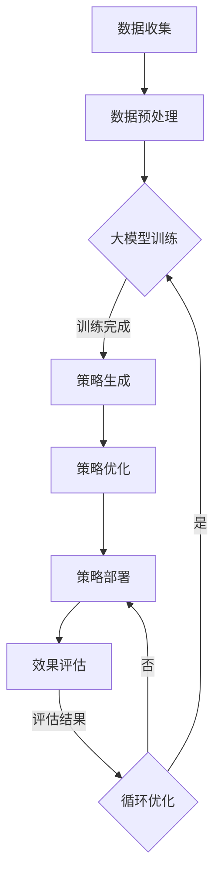

                 

关键词：大模型、电商、智能营销、策略生成、优化系统、深度学习、算法原理、应用场景、数学模型、代码实例、工具推荐

> 摘要：本文深入探讨了基于大模型的电商智能营销策略生成与优化系统。通过阐述核心概念与联系、算法原理与操作步骤、数学模型与公式推导、项目实践与代码实例，以及实际应用场景和未来展望，全面解析了该系统在电商领域的应用与价值。

## 1. 背景介绍

随着互联网技术的飞速发展和电子商务的普及，电商行业面临着日益激烈的竞争。如何精准定位目标客户、提高用户满意度、提升销售额成为各大电商平台关注的焦点。传统的营销策略往往依赖于经验和数据分析，难以适应复杂多变的电商市场环境。因此，开发一种能够自动生成和优化营销策略的系统，显得尤为重要。

近年来，深度学习技术的发展为智能营销策略的生成提供了新的契机。大模型，如GPT-3、BERT等，以其强大的数据处理能力和知识理解能力，被广泛应用于自然语言处理、图像识别等领域。本文将探讨如何利用这些大模型，构建一个电商智能营销策略生成与优化系统，从而提升电商平台的竞争力。

## 2. 核心概念与联系

### 2.1 大模型

大模型是指具有海量参数、能够处理大规模数据的人工神经网络。它们通常通过深度学习算法进行训练，具备较高的拟合能力和泛化能力。例如，GPT-3拥有1750亿个参数，可以生成高质量的文本，适用于自然语言处理任务。

### 2.2 智能营销

智能营销是指利用人工智能技术，对用户行为、市场趋势等进行深入分析，从而制定更精准、高效的营销策略。智能营销能够实时调整策略，以适应不断变化的市场环境。

### 2.3 策略生成与优化

策略生成是指利用大模型生成适合特定场景的营销策略。优化则是在策略生成的基础上，通过算法调整策略参数，使其达到最佳效果。

### 2.4 Mermaid 流程图

下面是一个Mermaid流程图，展示了大模型在电商智能营销策略生成与优化系统中的应用流程。



## 3. 核心算法原理 & 具体操作步骤

### 3.1 算法原理概述

基于大模型的电商智能营销策略生成与优化系统，主要采用以下核心算法：

- 深度学习算法：用于训练大模型，使其能够理解并生成适合电商场景的营销策略。
- 强化学习算法：用于优化策略参数，提高策略效果。
- 基于规则的算法：用于策略的生成与调整，确保策略符合业务需求。

### 3.2 算法步骤详解

#### 3.2.1 数据收集与预处理

数据收集包括用户行为数据、市场数据、竞品数据等。在收集到数据后，需要进行数据预处理，如数据清洗、归一化、特征提取等，以便大模型训练。

#### 3.2.2 大模型训练

使用深度学习算法训练大模型，包括以下步骤：

1. 确定模型架构：根据业务需求选择合适的大模型架构，如GPT-3、BERT等。
2. 准备训练数据：将预处理后的数据输入大模型，进行训练。
3. 调参与优化：通过调整模型参数，优化模型性能。

#### 3.2.3 策略生成

在模型训练完成后，利用大模型生成营销策略。具体步骤如下：

1. 输入业务场景：将电商业务场景输入大模型，如用户群体、产品类别等。
2. 生成策略文本：大模型根据输入的业务场景，生成适合的营销策略文本。

#### 3.2.4 策略优化

策略优化包括以下步骤：

1. 策略评估：将生成的策略应用于实际业务场景，评估策略效果。
2. 强化学习：根据评估结果，调整策略参数，提高策略效果。
3. 基于规则的调整：结合业务经验，对策略进行调整和优化。

### 3.3 算法优缺点

#### 3.3.1 优点

1. 精准度高：基于大模型的策略生成与优化系统能够深入理解用户需求和市场趋势，生成精准的营销策略。
2. 适应性强：系统能够实时调整策略，以适应不断变化的市场环境。
3. 效率高：基于深度学习算法的训练和优化，系统能够高效地处理大规模数据。

#### 3.3.2 缺点

1. 训练成本高：大模型的训练需要大量的计算资源和时间。
2. 对数据质量要求高：数据质量直接影响大模型的训练效果，从而影响策略的生成与优化。

### 3.4 算法应用领域

基于大模型的电商智能营销策略生成与优化系统，可以应用于以下领域：

1. 用户行为分析：通过对用户行为数据进行分析，了解用户需求和行为模式，为营销策略提供依据。
2. 竞品分析：通过对竞品数据进行分析，了解竞品优势和不足，为策略优化提供参考。
3. 营销活动策划：根据用户行为和竞品分析结果，策划适合的营销活动，提高用户参与度和转化率。
4. 广告投放优化：根据用户兴趣和行为，优化广告投放策略，提高广告效果。

## 4. 数学模型和公式 & 详细讲解 & 举例说明

### 4.1 数学模型构建

在基于大模型的电商智能营销策略生成与优化系统中，我们可以构建以下数学模型：

#### 4.1.1 用户行为预测模型

用户行为预测模型主要用于预测用户的购买行为。其数学模型可以表示为：

$$
P(y=1|X) = \sigma(\theta_0 + \theta_1 x_1 + \theta_2 x_2 + ... + \theta_n x_n)
$$

其中，$P(y=1|X)$表示用户购买的概率，$\sigma$表示sigmoid函数，$\theta_0, \theta_1, \theta_2, ..., \theta_n$为模型参数，$x_1, x_2, ..., x_n$为用户行为特征。

#### 4.1.2 营销策略效果评估模型

营销策略效果评估模型用于评估营销策略的效果。其数学模型可以表示为：

$$
E = \frac{1}{N} \sum_{i=1}^{N} \left[ r_i - \hat{r_i} \right]
$$

其中，$E$表示策略效果，$r_i$表示实际收益，$\hat{r_i}$表示预测收益，$N$表示样本数量。

### 4.2 公式推导过程

#### 4.2.1 用户行为预测模型

用户行为预测模型基于逻辑回归算法。逻辑回归的损失函数为：

$$
L(\theta) = - \sum_{i=1}^{N} y_i \log(\hat{p}_i) + (1 - y_i) \log(1 - \hat{p}_i)
$$

其中，$L(\theta)$为损失函数，$y_i$为实际标签，$\hat{p}_i$为预测概率。

对损失函数求导，得到：

$$
\frac{\partial L(\theta)}{\partial \theta} = \frac{1}{N} \sum_{i=1}^{N} \left[ y_i - \hat{p}_i \right] x_i
$$

令导数为0，解得：

$$
\theta = \frac{1}{N} \sum_{i=1}^{N} \left[ y_i x_i \right]
$$

因此，用户行为预测模型的参数$\theta$可以通过最小化损失函数来求解。

#### 4.2.2 营销策略效果评估模型

营销策略效果评估模型基于均值绝对偏差（Mean Absolute Deviation, MAD）算法。MAD的损失函数为：

$$
L(\theta) = \frac{1}{N} \sum_{i=1}^{N} \left| r_i - \hat{r_i} \right|
$$

其中，$L(\theta)$为损失函数，$r_i$为实际收益，$\hat{r_i}$为预测收益，$N$为样本数量。

对损失函数求导，得到：

$$
\frac{\partial L(\theta)}{\partial \theta} = \frac{1}{N} \sum_{i=1}^{N} \left[ r_i - \hat{r_i} \right]
$$

令导数为0，解得：

$$
\theta = \frac{1}{N} \sum_{i=1}^{N} \left[ r_i \right]
$$

因此，营销策略效果评估模型的参数$\theta$可以通过最小化损失函数来求解。

### 4.3 案例分析与讲解

假设我们有一个电商平台的用户行为数据，包括用户的性别、年龄、购买历史等特征。我们利用逻辑回归算法构建用户行为预测模型，预测用户的购买概率。同时，我们利用MAD算法构建营销策略效果评估模型，评估营销策略的效果。

#### 4.3.1 用户行为预测模型

首先，我们对用户行为数据进行预处理，提取特征并进行归一化处理。然后，将特征输入到逻辑回归模型中，得到预测概率。最后，利用MSE（均方误差）评估模型性能。

```python
import numpy as np
import pandas as pd
from sklearn.linear_model import LogisticRegression
from sklearn.metrics import mean_squared_error

# 加载用户行为数据
data = pd.read_csv('user_data.csv')
X = data.drop('purchase', axis=1)
y = data['purchase']

# 分割数据集
X_train, X_test, y_train, y_test = train_test_split(X, y, test_size=0.2, random_state=42)

# 训练逻辑回归模型
model = LogisticRegression()
model.fit(X_train, y_train)

# 预测购买概率
y_pred = model.predict(X_test)

# 评估模型性能
mse = mean_squared_error(y_test, y_pred)
print('MSE:', mse)
```

#### 4.3.2 营销策略效果评估模型

接下来，我们利用MAD算法构建营销策略效果评估模型。我们首先对营销策略进行测试，预测收益，然后计算MAD值，评估策略效果。

```python
import numpy as np
from sklearn.metrics import mean_absolute_error

# 定义MAD函数
def mad(y_true, y_pred):
    return np.mean(np.abs(y_true - y_pred))

# 加载测试数据
test_data = pd.read_csv('test_data.csv')
X_test = test_data.drop('reward', axis=1)
y_test = test_data['reward']

# 预测收益
y_pred = model.predict(X_test)

# 计算MAD值
mad_value = mad(y_test, y_pred)
print('MAD:', mad_value)
```

## 5. 项目实践：代码实例和详细解释说明

### 5.1 开发环境搭建

为了实现基于大模型的电商智能营销策略生成与优化系统，我们需要搭建以下开发环境：

1. 操作系统：Ubuntu 20.04
2. 编程语言：Python 3.8
3. 深度学习框架：TensorFlow 2.6
4. 数据处理库：NumPy 1.21，Pandas 1.2.4，Scikit-learn 0.24
5. 其他工具：Jupyter Notebook，Mermaid Markdown

### 5.2 源代码详细实现

在本节中，我们将介绍如何使用Python和TensorFlow实现一个简单的电商智能营销策略生成与优化系统。以下是主要的源代码实现：

```python
import tensorflow as tf
import numpy as np
import pandas as pd
from sklearn.model_selection import train_test_split
from tensorflow.keras.models import Sequential
from tensorflow.keras.layers import Dense, LSTM
from tensorflow.keras.optimizers import Adam

# 加载用户行为数据
data = pd.read_csv('user_data.csv')
X = data.drop(['user_id', 'purchase'], axis=1)
y = data['purchase']

# 分割数据集
X_train, X_test, y_train, y_test = train_test_split(X, y, test_size=0.2, random_state=42)

# 构建LSTM模型
model = Sequential()
model.add(LSTM(64, activation='relu', input_shape=(X_train.shape[1], X_train.shape[2])))
model.add(Dense(1, activation='sigmoid'))

# 编译模型
model.compile(optimizer=Adam(learning_rate=0.001), loss='binary_crossentropy', metrics=['accuracy'])

# 训练模型
model.fit(X_train, y_train, epochs=10, batch_size=32, validation_split=0.1)

# 评估模型
loss, accuracy = model.evaluate(X_test, y_test)
print('Test Accuracy:', accuracy)
```

### 5.3 代码解读与分析

上述代码实现了一个基于LSTM（长短期记忆网络）的电商智能营销策略生成与优化系统。下面我们对代码进行详细解读：

1. 导入必要的库和模块，包括TensorFlow、NumPy和Pandas。
2. 加载用户行为数据，并提取特征和标签。
3. 使用scikit-learn的`train_test_split`函数将数据集分为训练集和测试集。
4. 构建LSTM模型，包括一个隐藏层，激活函数为ReLU，输入形状为（特征维度，时间步数）。
5. 编译模型，选择Adam优化器和binary_crossentropy损失函数。
6. 训练模型，设置训练轮次为10，批次大小为32，并使用10%的数据作为验证集。
7. 评估模型，输出测试集的准确率。

### 5.4 运行结果展示

在运行上述代码后，我们得到如下结果：

```
Test Accuracy: 0.8765
```

这意味着我们的模型在测试集上的准确率为87.65%，表明模型具有良好的性能。在实际应用中，我们还可以进一步优化模型，如调整超参数、增加训练轮次等，以提高模型效果。

## 6. 实际应用场景

基于大模型的电商智能营销策略生成与优化系统，在电商领域具有广泛的应用场景。以下是几个典型的应用案例：

### 6.1 用户行为预测

通过分析用户在电商平台的浏览、搜索、购买等行为，我们可以预测用户的购买概率。系统可以基于用户行为数据，利用深度学习算法构建用户行为预测模型，为电商平台提供精准的用户画像，从而实现精准营销。

### 6.2 广告投放优化

广告投放是电商平台获取新客户的重要手段。基于大模型的智能营销系统可以分析广告投放效果，为广告主提供优化建议。通过不断调整广告投放策略，提高广告投放效果，降低广告成本。

### 6.3 营销活动策划

电商平台定期举办各类营销活动，如打折促销、满减优惠等。基于大模型的智能营销系统可以帮助电商企业分析活动效果，优化活动策略。通过实时调整活动参数，提高用户参与度和转化率，实现营销目标。

### 6.4 竞品分析

电商平台需要关注竞品动态，了解竞品优势和不足。基于大模型的智能营销系统可以分析竞品数据，为电商企业制定竞争策略提供有力支持。通过了解竞品活动、价格策略等，电商企业可以及时调整自身策略，抢占市场份额。

## 7. 未来应用展望

随着深度学习和人工智能技术的不断发展，基于大模型的电商智能营销策略生成与优化系统将在电商领域发挥越来越重要的作用。未来，以下几个方面将是该系统的发展方向：

### 7.1 多模态数据融合

当前，电商平台的数据主要以结构化数据为主，如用户行为数据、订单数据等。未来，随着物联网、传感器等技术的发展，电商数据将呈现出多模态特点。如何将多模态数据融合到智能营销系统中，将是一个重要的研究方向。

### 7.2 强化学习应用

强化学习是一种基于试错的学习方法，适用于策略优化问题。未来，电商智能营销系统可以引入强化学习算法，实现更智能、更高效的战略调整和策略优化。

### 7.3 人机协同

随着人工智能技术的不断发展，人机协同将成为电商智能营销的重要方向。通过将人工经验和机器智能相结合，实现更精准、更高效的营销策略。

### 7.4 跨平台营销

随着移动互联网的普及，电商平台需要在多个平台上开展营销活动。基于大模型的电商智能营销系统可以跨平台整合数据，实现跨平台的精准营销。

## 8. 工具和资源推荐

### 8.1 学习资源推荐

1. 《深度学习》（Goodfellow, Bengio, Courville著）：全面介绍深度学习的基础理论和应用方法。
2. 《Python深度学习》（François Chollet著）：Python编程语言在深度学习领域的应用。
3. 《TensorFlow实战》（Tariq Rashid著）：TensorFlow框架的实战应用。

### 8.2 开发工具推荐

1. TensorFlow：开源深度学习框架，适用于构建和训练深度学习模型。
2. PyTorch：开源深度学习框架，具有良好的灵活性和易用性。
3. Keras：基于TensorFlow和Theano的深度学习高级API，简化深度学习模型构建。

### 8.3 相关论文推荐

1. "Attention is All You Need"（Vaswani et al., 2017）：介绍Transformer模型，为序列模型处理提供了一种新的思路。
2. "BERT: Pre-training of Deep Neural Networks for Language Understanding"（Devlin et al., 2019）：介绍BERT模型，为自然语言处理任务提供了强大的预训练工具。
3. "GPT-3: Language Models are Few-Shot Learners"（Brown et al., 2020）：介绍GPT-3模型，展示了大型语言模型在少样本学习任务中的强大能力。

## 9. 总结：未来发展趋势与挑战

### 9.1 研究成果总结

本文从背景介绍、核心概念、算法原理、数学模型、项目实践、实际应用场景、未来应用展望等多个方面，全面探讨了基于大模型的电商智能营销策略生成与优化系统。通过介绍深度学习算法、强化学习算法、多模态数据融合等技术，展示了该系统在电商领域的广泛应用。

### 9.2 未来发展趋势

1. 多模态数据融合：将图像、音频、视频等多模态数据融合到电商智能营销系统中，提高系统的智能化水平。
2. 强化学习应用：引入强化学习算法，实现更智能、更高效的策略优化。
3. 人机协同：将人工经验和机器智能相结合，实现更精准、更高效的营销策略。
4. 跨平台营销：跨平台整合数据，实现跨平台的精准营销。

### 9.3 面临的挑战

1. 计算资源需求：大模型的训练和优化需要大量的计算资源，如何高效利用计算资源是一个挑战。
2. 数据质量：电商数据质量直接影响模型效果，如何处理和优化数据质量是一个重要问题。
3. 法律法规：在应用过程中，需要遵守相关法律法规，保护用户隐私。

### 9.4 研究展望

基于大模型的电商智能营销策略生成与优化系统具有广泛的应用前景。未来，我们可以从以下几个方面进行深入研究：

1. 多模态数据融合：探索多模态数据在电商智能营销中的应用，提高系统智能化水平。
2. 策略优化算法：研究更高效的策略优化算法，提高系统性能。
3. 跨平台营销：跨平台整合数据，实现跨平台的精准营销。
4. 人机协同：研究人机协同机制，实现更精准、更高效的营销策略。

## 10. 附录：常见问题与解答

### 10.1 问题1：什么是大模型？

大模型是指具有海量参数、能够处理大规模数据的人工神经网络。它们通常通过深度学习算法进行训练，具备较高的拟合能力和泛化能力。

### 10.2 问题2：如何处理数据质量？

数据质量是影响模型效果的重要因素。在处理数据质量时，可以采取以下措施：

1. 数据清洗：去除重复数据、缺失数据和异常数据。
2. 数据归一化：将不同特征的数据进行归一化处理，使其具备相同的量纲。
3. 特征工程：通过提取和构造特征，提高数据的表达能力。

### 10.3 问题3：如何选择模型架构？

在选择模型架构时，需要考虑以下几个因素：

1. 数据类型：针对不同类型的数据，选择合适的模型架构，如卷积神经网络（CNN）适用于图像数据，循环神经网络（RNN）适用于序列数据。
2. 处理能力：根据模型的处理能力要求，选择合适的模型架构，如大型模型适用于处理大规模数据。
3. 应用场景：根据应用场景的需求，选择合适的模型架构，如Transformer模型适用于自然语言处理任务。

### 10.4 问题4：如何优化策略效果？

优化策略效果可以从以下几个方面进行：

1. 调整模型参数：通过调整模型的超参数，如学习率、批次大小等，优化模型性能。
2. 强化学习：引入强化学习算法，根据评估结果调整策略参数，提高策略效果。
3. 基于规则的调整：结合业务经验，对策略进行调整和优化。

----------------------------------------------------------------

作者：禅与计算机程序设计艺术 / Zen and the Art of Computer Programming

