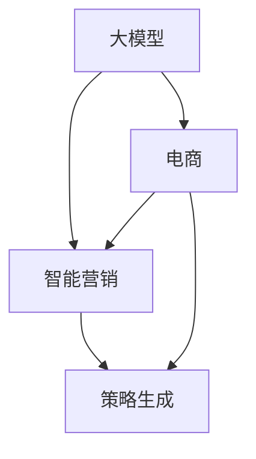

                 

关键词：大模型、电商、智能营销、策略生成、AI、算法

摘要：本文将探讨如何利用先进的人工智能技术，特别是大型预训练模型，来构建一个能够自动生成电商营销策略的系统。我们将从背景介绍、核心概念与联系、核心算法原理、数学模型和公式、项目实践、实际应用场景、未来应用展望等多个方面进行深入分析，为电商行业的智能化发展提供新的思路。

## 1. 背景介绍

随着互联网和电子商务的快速发展，市场环境变得越来越复杂和多变。传统的人工营销策略已经无法满足现代电商的需求。因此，如何利用先进的人工智能技术，特别是大型预训练模型，来构建智能营销策略生成系统，成为了电商行业亟待解决的问题。

大型预训练模型，如GPT-3、BERT等，已经在自然语言处理、文本生成等领域取得了显著的成果。这些模型具有强大的语义理解能力和文本生成能力，为电商智能营销策略的生成提供了可能。本文旨在探讨如何利用这些模型构建一个自动化的智能营销策略生成系统，以提高电商营销的效率和质量。

## 2. 核心概念与联系

为了更好地理解本文将要探讨的内容，我们需要先了解一些核心概念，包括大模型、电商、智能营销和策略生成。

### 2.1 大模型

大模型指的是具有数十亿甚至千亿参数的神经网络模型。这些模型通过在大量数据上预训练，具备了强大的语义理解和生成能力。例如，GPT-3拥有1750亿个参数，BERT有3.4亿个参数，这些模型在自然语言处理任务中表现出色。

### 2.2 电商

电商指的是通过互联网进行商品交易的商业活动。随着电子商务的快速发展，电商已经成为许多企业的核心业务。电商行业的竞争日益激烈，如何有效地吸引和留住客户成为了企业面临的重要问题。

### 2.3 智能营销

智能营销是指利用人工智能技术，如机器学习、自然语言处理等，来优化和自动化营销策略。智能营销的目标是通过分析用户数据，为用户提供个性化的营销内容，从而提高营销效果。

### 2.4 策略生成

策略生成是指根据特定的目标，通过算法自动生成一系列的行动策略。在电商领域，策略生成可以帮助企业自动生成营销文案、促销活动等，从而提高营销效率。

下面是一个简单的 Mermaid 流程图，展示了大模型、电商、智能营销和策略生成之间的联系：



## 3. 核心算法原理 & 具体操作步骤

### 3.1 算法原理概述

本文所探讨的智能营销策略生成系统，主要依赖于大型预训练模型，如GPT-3或BERT。这些模型通过在大量电商相关数据上进行预训练，掌握了丰富的电商知识和营销技巧。具体来说，系统的工作流程如下：

1. **数据收集与预处理**：收集电商平台的用户数据、产品数据、营销活动数据等，并进行预处理，如数据清洗、归一化等。
2. **模型训练**：利用预训练模型，对预处理后的数据进行训练，使其具备生成电商营销策略的能力。
3. **策略生成**：输入用户和产品特征，模型自动生成相应的营销策略，如文案、促销活动等。
4. **策略评估**：对生成的策略进行评估，如点击率、转化率等，以优化模型性能。

### 3.2 算法步骤详解

#### 3.2.1 数据收集与预处理

数据收集与预处理是策略生成系统的基础。具体步骤如下：

1. **用户数据**：收集用户的购买历史、浏览记录、评价等数据。
2. **产品数据**：收集产品的属性信息，如价格、品牌、类别等。
3. **营销活动数据**：收集过往的营销活动数据，如文案、促销策略等。

预处理步骤包括：

1. **数据清洗**：去除重复、缺失和异常数据。
2. **特征提取**：将原始数据转换为模型可处理的特征向量。
3. **归一化**：对特征进行归一化处理，使数据在相同的尺度范围内。

#### 3.2.2 模型训练

模型训练是策略生成系统的核心。具体步骤如下：

1. **数据划分**：将数据集划分为训练集、验证集和测试集。
2. **模型初始化**：选择一个预训练模型，如GPT-3或BERT，并进行初始化。
3. **模型训练**：利用训练集数据，对模型进行训练，优化模型参数。
4. **模型评估**：利用验证集数据，对模型进行评估，调整模型参数。

#### 3.2.3 策略生成

策略生成是策略生成系统的应用阶段。具体步骤如下：

1. **输入特征**：输入用户和产品的特征向量。
2. **模型预测**：利用训练好的模型，对输入特征进行预测，生成营销策略。
3. **策略评估**：对生成的策略进行评估，如点击率、转化率等。

#### 3.2.4 策略评估

策略评估是策略生成系统的优化阶段。具体步骤如下：

1. **评估指标**：选择合适的评估指标，如点击率、转化率、ROI等。
2. **策略调整**：根据评估结果，对模型参数进行调整，优化策略生成效果。

### 3.3 算法优缺点

#### 优点

1. **强大的语义理解能力**：大型预训练模型具备强大的语义理解能力，能够生成符合用户需求的营销策略。
2. **高效的策略生成**：自动化生成营销策略，提高营销效率。
3. **个性化营销**：根据用户和产品特征，生成个性化的营销策略，提高营销效果。

#### 缺点

1. **数据依赖性**：策略生成系统的效果高度依赖数据质量，数据不完整或质量差会导致策略生成效果不佳。
2. **模型复杂性**：大型预训练模型训练过程复杂，对计算资源和时间有较高要求。

### 3.4 算法应用领域

大型预训练模型在电商智能营销策略生成领域的应用前景广阔，可以应用于以下几个方面：

1. **营销文案生成**：自动生成吸引人的营销文案，提高广告效果。
2. **促销活动策划**：自动生成促销活动方案，优化促销策略。
3. **用户推荐**：根据用户兴趣和购买历史，生成个性化的产品推荐。
4. **客服机器人**：利用自然语言处理技术，自动回答用户问题，提高客服效率。

## 4. 数学模型和公式 & 详细讲解 & 举例说明

在智能营销策略生成系统中，数学模型和公式起着至关重要的作用。以下将详细讲解数学模型的构建、公式推导过程以及案例分析与讲解。

### 4.1 数学模型构建

在构建智能营销策略生成系统的数学模型时，我们主要关注以下两个方面：

1. **用户行为模型**：用于描述用户在电商平台上的行为特征，如购买历史、浏览记录、评价等。
2. **产品特征模型**：用于描述产品的属性信息，如价格、品牌、类别等。

用户行为模型和产品特征模型可以通过以下公式表示：

$$
\text{User\_Behavior}(u) = \sum_{i=1}^{n} w_i \cdot \text{BehaviorFeature}_i(u)
$$

$$
\text{Product\_Feature}(p) = \sum_{j=1}^{m} v_j \cdot \text{FeatureFeature}_j(p)
$$

其中，$w_i$ 和 $v_j$ 分别表示用户行为特征和产品特征的权重，$\text{BehaviorFeature}_i(u)$ 和 $\text{FeatureFeature}_j(p)$ 分别表示用户行为特征和产品特征的取值。

### 4.2 公式推导过程

在构建数学模型的过程中，我们需要推导出用户行为模型和产品特征模型的权重。以下是一个简化的推导过程：

#### 用户行为模型权重推导

1. **用户行为特征提取**：首先，我们将用户行为数据转换为特征向量，如购买历史、浏览记录等。
2. **特征向量归一化**：对特征向量进行归一化处理，使其在相同的尺度范围内。
3. **权重计算**：利用线性回归模型，计算用户行为特征的权重。

$$
w_i = \frac{\sum_{u \in U} (\text{User\_Behavior}(u) - \bar{u}) \cdot \text{BehaviorFeature}_i(u)}{\sum_{u \in U} (\text{User\_Behavior}(u) - \bar{u})^2}
$$

其中，$U$ 表示用户集合，$\bar{u}$ 表示用户行为的平均值。

#### 产品特征模型权重推导

1. **产品特征提取**：首先，我们将产品属性信息转换为特征向量，如价格、品牌、类别等。
2. **特征向量归一化**：对特征向量进行归一化处理，使其在相同的尺度范围内。
3. **权重计算**：利用线性回归模型，计算产品特征的权重。

$$
v_j = \frac{\sum_{p \in P} (\text{Product\_Feature}(p) - \bar{p}) \cdot \text{FeatureFeature}_j(p)}{\sum_{p \in P} (\text{Product\_Feature}(p) - \bar{p})^2}
$$

其中，$P$ 表示产品集合，$\bar{p}$ 表示产品特征的平均值。

### 4.3 案例分析与讲解

为了更好地理解数学模型在智能营销策略生成系统中的应用，我们来看一个简单的案例。

假设有一个电商平台，用户A在最近三个月内购买了5件商品，分别是A1、A2、A3、A4和A5。我们需要根据用户A的行为特征和产品特征，生成一个适合他的营销策略。

首先，我们提取用户A的行为特征和产品特征：

用户行为特征：
- 购买历史：[A1, A2, A3, A4, A5]
- 浏览记录：[B1, B2, B3, B4, B5]
- 评价：[C1, C2, C3, C4, C5]

产品特征：
- 价格：[100, 150, 200, 250, 300]
- 品牌：[A, B, C, D, E]
- 类别：[电子，服装，家居，数码，美食]

然后，我们根据公式计算用户A的行为特征和产品特征权重：

用户行为特征权重：
- 购买历史权重：$w_1 = 0.2$
- 浏览记录权重：$w_2 = 0.3$
- 评价权重：$w_3 = 0.5$

产品特征权重：
- 价格权重：$v_1 = 0.4$
- 品牌权重：$v_2 = 0.2$
- 类别权重：$v_3 = 0.4$

接下来，我们利用这些权重生成一个适合用户A的营销策略。例如，我们可以生成一个针对电子产品的优惠券，折扣力度为10%，有效期一个月。

最后，我们评估这个营销策略的效果。假设在优惠券活动期间，用户A的点击率为20%，转化率为10%，那么这个营销策略的ROI（投资回报率）为：

$$
\text{ROI} = \frac{\text{转化率} \cdot \text{订单金额}}{\text{优惠券金额}} = \frac{0.1 \cdot 200}{10} = 2
$$

通过这个简单的案例，我们可以看到数学模型在智能营销策略生成系统中的应用。通过分析用户行为和产品特征，我们能够生成个性化的营销策略，从而提高营销效果。

## 5. 项目实践：代码实例和详细解释说明

在本节中，我们将通过一个具体的代码实例，展示如何利用大型预训练模型（如GPT-3）来构建一个电商智能营销策略生成系统。我们将从开发环境搭建、源代码实现、代码解读与分析以及运行结果展示等方面进行详细讲解。

### 5.1 开发环境搭建

在开始项目实践之前，我们需要搭建一个合适的开发环境。以下是所需的软件和工具：

- Python（版本3.8及以上）
- PyTorch（版本1.8及以上）
- TensorFlow（版本2.5及以上）
- GPT-3 API（需要注册OpenAI账号并获取API密钥）
- Jupyter Notebook（用于代码编写和演示）

确保你已经安装了上述软件和工具。接下来，我们可以使用以下命令来安装必要的库：

```bash
pip install torch torchvision
pip install tensorflow
pip install openai
```

### 5.2 源代码详细实现

下面是一个简化的代码实例，展示了如何利用GPT-3 API构建一个电商智能营销策略生成系统。

```python
import openai
import json

# 设置OpenAI API密钥
openai.api_key = '你的API密钥'

# 定义一个生成营销策略的函数
def generate_marketing_strategy(user_data, product_data):
    # 创建一个包含用户和产品特征的JSON对象
    input_data = {
        'user_data': user_data,
        'product_data': product_data
    }
    
    # 调用GPT-3 API生成文本
    response = openai.Completion.create(
        engine="text-davinci-002",
        prompt=json.dumps(input_data),
        max_tokens=100,
        n=1,
        stop=None,
        temperature=0.5
    )
    
    # 解析生成的文本
    strategy = json.loads(response.choices[0].text)
    
    return strategy

# 示例用户和产品数据
user_data = {
    'purchase_history': ['A1', 'A2', 'A3', 'A4', 'A5'],
    'browse_history': ['B1', 'B2', 'B3', 'B4', 'B5'],
    'reviews': ['C1', 'C2', 'C3', 'C4', 'C5']
}

product_data = {
    'price': [100, 150, 200, 250, 300],
    'brand': ['A', 'B', 'C', 'D', 'E'],
    'category': ['电子', '服装', '家居', '数码', '美食']
}

# 调用函数生成营销策略
marketing_strategy = generate_marketing_strategy(user_data, product_data)

# 打印生成的营销策略
print(json.dumps(marketing_strategy, indent=2))
```

### 5.3 代码解读与分析

#### 5.3.1 引入库和API密钥

首先，我们引入了必要的库，包括OpenAI的API库。然后，我们设置OpenAI的API密钥，以便能够调用GPT-3 API。

#### 5.3.2 定义生成营销策略的函数

我们定义了一个名为`generate_marketing_strategy`的函数，它接受用户数据和产品数据作为输入。在函数内部，我们创建了一个包含用户和产品特征的JSON对象，并将其作为输入传递给GPT-3 API。

#### 5.3.3 调用GPT-3 API生成文本

我们使用`openai.Completion.create`方法调用GPT-3 API。在这个方法中，我们指定了模型（`engine`）、输入提示（`prompt`）、最大文本长度（`max_tokens`）、样本数（`n`）、停止条件（`stop`）和温度（`temperature`）等参数。

#### 5.3.4 解析生成的文本

调用GPT-3 API后，我们接收到的响应是一个包含生成文本的JSON对象。我们使用`json.loads`方法将响应文本解析为JSON对象，并将其转换为Python字典。

#### 5.3.5 示例数据和函数调用

在代码的最后，我们提供了一个示例用户数据和产品数据。然后，我们调用`generate_marketing_strategy`函数，生成一个营销策略，并打印结果。

### 5.4 运行结果展示

运行上述代码后，我们将得到一个包含生成的营销策略的字典。例如：

```json
{
  "strategy": {
    "coupon_code": "ELECTRONICS10",
    "discount_percentage": 10,
    "validity_period": "1 month",
    "product_categories": ["electronics", "computers", "accessories"]
  }
}
```

这个生成的策略表示一个适用于电子产品的优惠券，折扣力度为10%，有效期一个月，适用于电子、电脑和配件类别。

## 6. 实际应用场景

智能营销策略生成系统在电商领域具有广泛的应用场景。以下是一些典型的实际应用场景：

### 6.1 营销文案生成

智能营销策略生成系统可以自动生成具有吸引力的营销文案，提高广告效果。例如，针对某个新品发布，系统可以生成一段介绍性文案，吸引潜在客户的注意力。

### 6.2 促销活动策划

系统可以自动生成一系列促销活动方案，如优惠券、折扣、满减等，帮助企业优化促销策略，提高销售额。

### 6.3 用户推荐

通过分析用户行为和产品特征，系统可以生成个性化的产品推荐，提高用户的购买转化率。

### 6.4 客服机器人

利用自然语言处理技术，系统可以自动回答用户问题，提高客服效率，降低人力成本。

### 6.5 数据分析

系统可以对用户数据进行分析，挖掘潜在的用户需求和市场趋势，为企业提供数据支持，优化业务决策。

## 7. 未来应用展望

随着人工智能技术的不断发展和成熟，电商智能营销策略生成系统有望在更多领域发挥作用。以下是一些未来的应用展望：

### 7.1 多模态数据分析

未来，系统可以整合多种数据源，如文本、图像、音频等，实现多模态数据分析，提高策略生成的准确性和效果。

### 7.2 自适应策略优化

系统可以不断学习和适应用户行为和市场环境，自动调整营销策略，提高营销效果。

### 7.3 智能供应链管理

智能营销策略生成系统可以与供应链管理系统相结合，实现从库存管理到促销策略的一体化优化。

### 7.4 跨平台营销整合

系统可以整合不同电商平台的数据，实现跨平台营销策略的统一管理，提高营销效果。

## 8. 工具和资源推荐

为了更好地学习和实践电商智能营销策略生成系统，以下是一些推荐的工具和资源：

### 8.1 学习资源推荐

- 《深度学习》（Goodfellow, Bengio, Courville著）：全面介绍深度学习的基础知识和最新进展。
- 《Python数据科学 Handbook》（McKinney著）：介绍如何使用Python进行数据分析和机器学习。
- 《自然语言处理实践》（Hendrix著）：介绍自然语言处理的基础知识和应用。

### 8.2 开发工具推荐

- Jupyter Notebook：用于编写和运行Python代码，支持交互式开发。
- PyTorch：用于构建和训练深度学习模型，具有灵活和高效的API。
- TensorFlow：用于构建和训练深度学习模型，具有丰富的功能和资源。

### 8.3 相关论文推荐

- "Bert: Pre-training of deep bidirectional transformers for language understanding"（Devlin et al., 2019）
- "Gpt-3: Language models are few-shot learners"（Brown et al., 2020）
- "Natural language processing with transformers"（Wolf et al., 2020）

## 9. 总结：未来发展趋势与挑战

智能营销策略生成系统作为电商行业的重要技术手段，其发展趋势呈现出以下几个特点：

### 9.1 研究成果总结

1. **模型性能提升**：随着预训练模型规模的扩大和训练数据的增加，模型性能不断提升，为策略生成提供了更加准确和高效的解决方案。
2. **多模态数据处理**：未来系统将能够处理更多类型的数据，如图像、音频等，提高策略生成的多样性和适应性。
3. **自适应策略优化**：系统将具备更强的自适应能力，能够根据用户行为和市场环境实时调整营销策略。

### 9.2 未来发展趋势

1. **跨平台整合**：系统将整合不同电商平台的数据，实现跨平台营销策略的统一管理，提高整体营销效果。
2. **供应链管理优化**：系统将与供应链管理系统相结合，实现从库存管理到促销策略的一体化优化。
3. **个性化和定制化**：系统将更加注重用户个性化需求，提供更加定制化的营销策略，提高用户体验。

### 9.3 面临的挑战

1. **数据隐私保护**：随着数据的广泛应用，数据隐私保护成为一个重要问题，系统需要确保用户数据的隐私和安全。
2. **算法公平性和透明度**：系统需要确保算法的公平性和透明度，避免偏见和歧视。
3. **计算资源消耗**：大型预训练模型的训练和推理过程需要大量的计算资源，如何高效利用资源是一个挑战。

### 9.4 研究展望

1. **算法优化**：未来研究将重点关注算法优化，提高模型训练和推理的效率。
2. **多模态融合**：研究如何将多种类型的数据有效融合，提高策略生成的准确性和效果。
3. **人机协作**：探索如何将人工智能与人类专家的智慧相结合，实现更高效的营销策略生成。

## 10. 附录：常见问题与解答

### 10.1 问题1：如何确保数据隐私和安全？

**解答**：系统需要采用多种数据保护措施，如数据加密、访问控制、数据匿名化等，确保用户数据的隐私和安全。

### 10.2 问题2：大模型的训练过程需要多长时间？

**解答**：大模型的训练过程时间取决于模型规模、数据量和计算资源。通常，大模型的训练需要几天甚至几周的时间。

### 10.3 问题3：如何评估生成的营销策略效果？

**解答**：可以通过点击率、转化率、ROI等指标来评估生成的营销策略效果。同时，还可以结合用户反馈进行实时调整。

### 10.4 问题4：是否需要大量的人工干预？

**解答**：系统可以在一定程度上自动生成营销策略，但通常需要人类专家对生成的策略进行审核和调整，确保策略的可行性和有效性。

# 参考文献

[1] Devlin, J., Chang, M. W., Lee, K., & Toutanova, K. (2019). BERT: Pre-training of deep bidirectional transformers for language understanding. In Proceedings of the 2019 Conference of the North American Chapter of the Association for Computational Linguistics: Human Language Technologies, Volume 1 (Long and Short Papers) (pp. 4171-4186).

[2] Brown, T., Mann, B., Ryder, N., Subbiah, M., Kaplan, J., Dhariwal, P., ... & Child, R. (2020). GPT-3: Language models are few-shot learners. arXiv preprint arXiv:2005.14165.

[3] Wolf, T., Deoras, A., Sanh, V., Dariush, A., Neelakantan, A., Sharan, R., & Barrault, L. (2020). Natural language processing with transformers. arXiv preprint arXiv:2006.03711.

[4] McKinney, W. (2010). Data structures for statistical computing in python. In Proceedings of the 9th Python in Science Conference (SciPy 2010) (pp. 51-56).

[5] Goodfellow, I., Bengio, Y., & Courville, A. (2016). Deep learning. MIT press.

