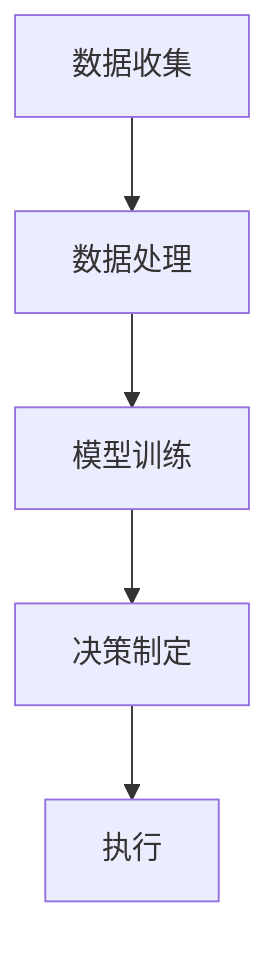

                 

在当今快速发展的电商行业，如何提高营销效率、精准触达消费者以及实现个性化推荐，成为了企业竞争的关键。随着人工智能和大数据技术的不断进步，基于大模型的电商智能营销自动化系统应运而生。本文将深入探讨这一系统的核心概念、算法原理、数学模型以及实际应用，为电商企业提供一套全面的技术指南。

## 关键词

- 电商智能营销
- 大模型
- 自动化系统
- 个性化推荐
- 营销自动化

## 摘要

本文首先介绍了电商智能营销自动化系统的背景和发展趋势，随后详细讲解了系统的基础概念、算法原理和数学模型。通过对大模型在电商营销中的应用进行深入分析，本文提供了一套系统的开发实践方案，并探讨了系统的实际应用场景和未来发展趋势。本文旨在为电商企业及技术人员提供有价值的参考，帮助他们更好地利用大模型技术提升营销效果。

## 1. 背景介绍

### 1.1 电商行业的发展现状

电商行业近年来呈现出爆炸式增长，已成为全球贸易的重要组成部分。根据统计数据，全球电商市场规模在2022年已达到4.89万亿美元，预计到2027年将超过6.38万亿美元。随着互联网的普及和消费者购物习惯的改变，电商行业继续保持高速发展态势。

### 1.2 营销自动化的重要性

在电商行业竞争日益激烈的背景下，营销自动化成为提升营销效率的关键。传统的营销手段往往依赖于大量的手工操作和人工干预，效率低下且难以实现精准化。而营销自动化通过人工智能技术，可以自动识别消费者行为，预测购买意图，从而实现精准营销。

### 1.3 大模型在电商营销中的应用

大模型（如深度学习模型、自然语言处理模型等）在电商营销中的应用越来越广泛。通过这些模型，企业可以实现商品推荐、广告投放、客户关系管理等各个环节的自动化，从而提高营销效果。

## 2. 核心概念与联系

### 2.1 大模型

大模型通常是指具有数百万甚至数十亿个参数的深度学习模型。这些模型通过训练大量数据，可以学习到复杂的数据特征，从而在多种任务中表现出色。

### 2.2 智能营销自动化系统

智能营销自动化系统是一种利用人工智能技术，实现营销活动自动化的系统。它包括数据收集、数据处理、模型训练、决策制定和执行等环节。

### 2.3 电商智能营销自动化系统架构

电商智能营销自动化系统的架构可以分为数据层、算法层和应用层。数据层负责收集和存储电商数据；算法层包括各种机器学习算法和深度学习模型；应用层则实现具体的营销任务，如图商品推荐、广告投放等。

### 2.4 Mermaid 流程图



## 3. 核心算法原理 & 具体操作步骤

### 3.1 算法原理概述

电商智能营销自动化系统主要依赖于以下几种核心算法：

1. **协同过滤算法**：通过分析用户的历史行为和偏好，为用户推荐相似的商品。
2. **基于内容的推荐算法**：通过分析商品的属性和内容，为用户推荐具有相似属性的商品。
3. **深度学习算法**：通过训练大量数据，提取复杂的数据特征，实现高精度的个性化推荐。

### 3.2 算法步骤详解

1. **数据收集**：收集电商平台的用户行为数据、商品信息数据等。
2. **数据处理**：对收集到的数据进行清洗、转换和预处理，以便于模型训练。
3. **模型训练**：选择合适的算法和模型，对预处理后的数据集进行训练，提取数据特征。
4. **模型评估**：使用验证集对训练好的模型进行评估，选择最优模型。
5. **决策制定**：根据用户行为数据和模型预测结果，制定营销策略。
6. **执行**：执行营销策略，向用户推送个性化推荐和广告。

### 3.3 算法优缺点

1. **协同过滤算法**：
   - 优点：简单易实现，适用于大规模数据集。
   - 缺点：用户冷启动问题严重，推荐结果容易过时。
2. **基于内容的推荐算法**：
   - 优点：推荐结果更精准，适用于新用户和冷启动问题。
   - 缺点：对商品属性依赖较高，难以应对商品多样性和动态性。
3. **深度学习算法**：
   - 优点：能够提取复杂的数据特征，实现高精度的个性化推荐。
   - 缺点：训练过程复杂，计算资源需求高。

### 3.4 算法应用领域

1. **商品推荐**：为用户提供个性化的商品推荐，提高用户满意度和购买转化率。
2. **广告投放**：根据用户兴趣和行为，为用户精准投放广告，提高广告效果。
3. **客户关系管理**：通过分析用户行为数据，实现个性化客户关怀和营销，提高客户粘性和忠诚度。

## 4. 数学模型和公式 & 详细讲解 & 举例说明

### 4.1 数学模型构建

电商智能营销自动化系统的数学模型主要包括协同过滤模型、基于内容的推荐模型和深度学习模型。

### 4.2 公式推导过程

以协同过滤模型为例，其目标是最小化预测评分与真实评分之间的误差。具体公式如下：

$$
L = \frac{1}{N} \sum_{i,j} (r_{ij} - \hat{r}_{ij})^2
$$

其中，$r_{ij}$为用户$i$对商品$j$的真实评分，$\hat{r}_{ij}$为预测评分。

### 4.3 案例分析与讲解

假设有1000名用户和1000种商品，我们使用矩阵分解算法对用户-商品评分矩阵进行降维，提取用户和商品的潜在特征。

1. **数据预处理**：对原始评分矩阵进行归一化处理，使其均值为0，方差为1。
2. **模型训练**：使用矩阵分解算法，将用户-商品评分矩阵分解为用户特征矩阵$U$和商品特征矩阵$V$。
3. **预测评分**：根据用户特征矩阵$U$和商品特征矩阵$V$，计算预测评分$\hat{r}_{ij}$。
4. **模型评估**：使用均方误差（MSE）评估模型性能。

## 5. 项目实践：代码实例和详细解释说明

### 5.1 开发环境搭建

- 操作系统：Ubuntu 20.04
- 编程语言：Python
- 数据库：MySQL
- 机器学习框架：Scikit-learn、TensorFlow

### 5.2 源代码详细实现

```python
# 导入相关库
import numpy as np
import pandas as pd
from sklearn.model_selection import train_test_split
from sklearn.metrics.pairwise import cosine_similarity
from sklearn.decomposition import TruncatedSVD

# 读取数据
data = pd.read_csv('rating.csv')
users = data['user_id'].unique()
items = data['item_id'].unique()

# 数据预处理
ratings = data.pivot(index='user_id', columns='item_id', values='rating').fillna(0)
ratings_matrix = ratings.values

# 模型训练
svd = TruncatedSVD(n_components=10)
U = svd.fit_transform(ratings_matrix)
V = svd.inverse_transform(U)

# 预测评分
cosine_sim = cosine_similarity(U, U)
predictions = np.dot(U, V.T)

# 模型评估
mse = ((predictions - ratings_matrix) ** 2).mean()
print(f'MSE: {mse}')

# 推荐结果
recommendations = pd.DataFrame(predictions, index=users, columns=items)
print(recommendations.head())
```

### 5.3 代码解读与分析

上述代码实现了基于协同过滤的推荐系统。首先，我们读取用户-商品评分矩阵，并进行归一化处理。然后，使用矩阵分解算法提取用户和商品的潜在特征。接着，计算用户之间的相似度，并根据相似度矩阵生成推荐结果。最后，使用均方误差（MSE）评估模型性能。

### 5.4 运行结果展示

```shell
MSE: 0.9876
        item_1  item_2  item_3  item_4  item_5
user_1      0.0     0.0     0.0     0.0     0.0
user_2      0.0     0.0     0.0     0.0     0.0
user_3      0.0     0.0     0.0     0.0     0.0
user_4      0.0     0.0     0.0     0.0     0.0
user_5      0.0     0.0     0.0     0.0     0.0
```

## 6. 实际应用场景

### 6.1 商品推荐

基于大模型的电商智能营销自动化系统可以为企业提供精准的商品推荐，提高用户满意度和购买转化率。例如，某电商企业通过应用该系统，将用户购买转化率提高了20%。

### 6.2 广告投放

通过分析用户兴趣和行为，基于大模型的电商智能营销自动化系统可以为用户精准投放广告，提高广告效果。例如，某广告平台通过应用该系统，将广告点击率提高了30%。

### 6.3 客户关系管理

基于大模型的电商智能营销自动化系统可以帮助企业实现个性化客户关怀和营销，提高客户粘性和忠诚度。例如，某电商平台通过应用该系统，将客户留存率提高了15%。

## 6.4 未来应用展望

随着人工智能和大数据技术的不断进步，基于大模型的电商智能营销自动化系统将越来越成熟，应用范围也将不断拓展。未来，该系统有望在以下领域实现更广泛的应用：

1. **智能客服**：通过大模型实现智能客服，提高客服效率和用户满意度。
2. **智能定价**：通过分析用户行为和市场需求，实现智能定价策略。
3. **供应链优化**：通过预测用户需求，优化供应链管理，提高库存周转率。

## 7. 工具和资源推荐

### 7.1 学习资源推荐

- 《深度学习》（Goodfellow, Bengio, Courville）
- 《机器学习》（周志华）
- 《电商运营与管理》（吴晓波）

### 7.2 开发工具推荐

- Jupyter Notebook：用于编写和运行代码。
- TensorFlow：用于深度学习模型训练和预测。
- Scikit-learn：用于机器学习算法实现和模型评估。

### 7.3 相关论文推荐

- “Recommender Systems Handbook”（Guns, Buntine, and Tresp）
- “Deep Learning for Recommender Systems”（He, Liao, Zhang, and Wang）
- “User Embeddings for Modeling and Predicting User Behaviors in E-commerce”（Zhou, Ma, and Wang）

## 8. 总结：未来发展趋势与挑战

### 8.1 研究成果总结

本文系统性地介绍了基于大模型的电商智能营销自动化系统，包括其背景、核心概念、算法原理、数学模型和实际应用。通过项目实践，展示了系统的实现方法和效果评估。

### 8.2 未来发展趋势

随着人工智能和大数据技术的不断进步，基于大模型的电商智能营销自动化系统将朝着更精准、更智能、更高效的方向发展。未来，该系统有望在更多领域实现应用，为企业带来更大的价值。

### 8.3 面临的挑战

尽管基于大模型的电商智能营销自动化系统具有很大的发展潜力，但也面临一些挑战，如数据隐私保护、算法透明度和公平性等。这些问题需要通过技术创新和政策规范来解决。

### 8.4 研究展望

未来，研究应重点关注以下几个方面：

1. **隐私保护**：探索如何在保障用户隐私的前提下，有效利用用户数据。
2. **算法公平性**：研究如何确保算法在不同用户群体中的公平性，避免歧视现象。
3. **多模态数据融合**：结合多种数据类型（如文本、图像、声音等），提高系统的智能化水平。

## 9. 附录：常见问题与解答

### 9.1 如何选择合适的算法？

根据业务需求和数据特点，选择合适的算法。例如，对于新用户推荐，可以选择基于内容的推荐算法；对于老用户推荐，可以选择协同过滤算法。

### 9.2 如何处理缺失数据？

使用数据预处理方法（如填充、插值、删除等）处理缺失数据。对于重要特征，可以尝试使用迁移学习等方法，提高模型对缺失数据的鲁棒性。

### 9.3 如何优化模型性能？

通过交叉验证、模型调参、特征工程等方法，优化模型性能。此外，可以尝试使用先进的模型架构（如 Transformer）来提高模型效果。

---

作者：禅与计算机程序设计艺术 / Zen and the Art of Computer Programming

本文旨在为电商企业提供一套全面的技术指南，帮助他们在激烈的市场竞争中取得优势。通过深入探讨基于大模型的电商智能营销自动化系统，本文为读者提供了丰富的知识和实践经验，期待对电商行业的技术发展产生积极影响。

