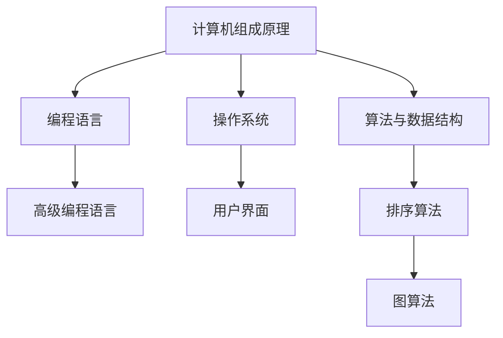

                 

“探索未知，扩展人类认知。”这句看似简单的话语，蕴含了深远的哲学和科学意义。在信息技术迅猛发展的今天，计算机科学正成为推动人类认知边界拓展的关键力量。本文将深入探讨计算机科学中的核心概念、算法原理、数学模型及其在实际应用中的价值，以期激发读者对未知领域的探索热情。

## 1. 背景介绍

人类对未知的探索自古以来便是科技进步的驱动力。从古代的航海探险到现代的宇宙探索，我们不断地挑战自然规律，扩展对世界的认知。计算机科学的兴起，为这一探索提供了新的工具和视角。计算机不仅仅是一种工具，更是我们理解和解决问题的平台，它改变了人类思考的方式，推动了信息时代的发展。

### 计算机科学的兴起

计算机科学起源于20世纪中叶，随着电子计算机的出现和迅速发展，计算机科学逐渐成为一个独立的学科。从早期的电子管计算机到如今的量子计算机，计算机科学经历了无数次的革命和进步。计算机的出现极大地提高了人类处理信息的能力，改变了人类的生活方式和社会结构。

### 计算机科学的重要性

计算机科学的重要性不仅体现在其技术的进步上，更体现在其对人类认知的扩展上。通过计算机科学，我们可以模拟自然现象，预测未来趋势，解决复杂问题。计算机科学为我们提供了一种全新的思考方式和解决问题的工具，使我们能够更深入地理解世界，扩展我们对未知的认知。

## 2. 核心概念与联系

在计算机科学中，有许多核心概念和理论，它们相互联系，共同构成了计算机科学的理论体系。以下是一些关键概念及其相互关系：

### 计算机组成原理

计算机组成原理是计算机科学的基础，它描述了计算机的硬件和软件组成，以及它们之间的相互作用。计算机由硬件和软件两部分组成，硬件负责执行具体的操作，而软件则提供了计算过程所需的指令和程序。

### 编程语言

编程语言是计算机科学的重要组成部分，它为程序员提供了与计算机交流的工具。不同的编程语言具有不同的特点和应用场景，但它们共同的目标都是使计算机能够执行特定的任务。

### 操作系统

操作系统是计算机系统的核心，它管理计算机的资源，提供用户与计算机的交互界面。操作系统负责调度任务、管理内存、处理输入输出等，它是计算机科学中不可或缺的一部分。

### 算法与数据结构

算法是计算机科学的核心概念之一，它描述了解决特定问题的步骤和方法。数据结构则是用于存储和组织数据的结构，它们共同决定了算法的效率和性能。

### Mermaid 流程图

以下是一个简单的Mermaid流程图，展示了计算机科学中的核心概念及其相互关系：



## 3. 核心算法原理 & 具体操作步骤

在计算机科学中，算法是实现特定任务的核心。以下将介绍一些重要的算法原理及其具体操作步骤。

### 3.1 算法原理概述

算法是一种有组织的步骤序列，用于解决特定问题。算法的基本原理可以概括为以下几个步骤：

1. **问题定义**：明确要解决的问题是什么。
2. **数据结构选择**：选择适合问题的数据结构。
3. **算法设计**：设计解决问题的算法。
4. **算法实现**：将算法转换为可执行的代码。
5. **算法分析**：分析算法的时间复杂度和空间复杂度。

### 3.2 算法步骤详解

以下是一个简单的排序算法（冒泡排序）的步骤详解：

1. **初始化**：将待排序的数组作为输入。
2. **循环**：从第一个元素开始，依次比较相邻的两个元素。
3. **交换**：如果第一个元素大于第二个元素，则交换它们的位置。
4. **重复**：重复步骤2和3，直到所有元素都被正确排序。

### 3.3 算法优缺点

冒泡排序的优点是简单易懂，易于实现。然而，其缺点是时间复杂度较高，不适合处理大量数据。

### 3.4 算法应用领域

冒泡排序常用于教学和入门编程，但在实际应用中，由于其效率问题，更多使用更高效的排序算法，如快速排序和归并排序。

## 4. 数学模型和公式 & 详细讲解 & 举例说明

在计算机科学中，数学模型和公式是描述算法性能和解决问题的重要工具。以下将介绍一些常用的数学模型和公式，并进行详细讲解和举例说明。

### 4.1 数学模型构建

数学模型构建通常包括以下几个步骤：

1. **问题分析**：分析问题的性质和特征。
2. **建立假设**：根据问题分析建立合理的假设。
3. **数学表达**：用数学符号和公式表达问题的特征。
4. **求解方法**：选择合适的数学方法求解模型。

### 4.2 公式推导过程

以下是一个简单的线性回归模型的推导过程：

1. **问题分析**：假设我们有一个线性关系 \(y = ax + b\)，其中 \(x\) 和 \(y\) 是变量，\(a\) 和 \(b\) 是常数。
2. **建立假设**：假设我们有一个数据集，其中 \(x\) 和 \(y\) 的取值是已知的。
3. **数学表达**：将数据集代入线性关系，得到一系列的方程。
4. **求解方法**：使用最小二乘法求解 \(a\) 和 \(b\) 的值。

### 4.3 案例分析与讲解

以下是一个简单的线性回归案例：

#### 问题：

假设我们有一个数据集，记录了学生的成绩和他们的平时表现。我们想要建立一个模型来预测学生的成绩。

#### 数据集：

| 学生 | 平时表现 | 成绩 |
| --- | --- | --- |
| A | 80 | 90 |
| B | 70 | 85 |
| C | 65 | 75 |
| D | 60 | 70 |

#### 模型构建：

1. **问题分析**：成绩和平时表现之间存在线性关系。
2. **建立假设**：假设成绩 \(y = ax + b\)。
3. **数学表达**：将数据集代入假设，得到以下方程：

   \[
   \begin{cases}
   80a + b = 90 \\
   70a + b = 85 \\
   65a + b = 75 \\
   60a + b = 70 \\
   \end{cases}
   \]

4. **求解方法**：使用最小二乘法求解 \(a\) 和 \(b\) 的值。

   通过求解上述方程，我们得到 \(a = 1\) 和 \(b = 10\)。

   因此，我们的线性回归模型为 \(y = x + 10\)。

#### 模型验证：

使用这个模型，我们可以预测新学生的成绩。例如，如果一个学生的平时表现是85，那么我们可以预测他们的成绩为 \(85 + 10 = 95\)。

## 5. 项目实践：代码实例和详细解释说明

在本节中，我们将通过一个实际项目——使用Python实现一个简单的线性回归模型，来展示如何将数学模型和算法原理应用于实际编程中。

### 5.1 开发环境搭建

首先，我们需要搭建一个Python开发环境。您可以选择使用PyCharm、VSCode等IDE，也可以使用终端进行开发。安装Python和必要的库，例如NumPy和SciPy。

### 5.2 源代码详细实现

以下是一个简单的线性回归模型的Python代码实现：

```python
import numpy as np

# 线性回归模型
class LinearRegression:
    def __init__(self):
        self.a = 0
        self.b = 0

    def fit(self, X, y):
        X_mean = np.mean(X)
        y_mean = np.mean(y)
        self.a = np.sum((X - X_mean) * (y - y_mean)) / np.sum((X - X_mean) ** 2)
        self.b = y_mean - self.a * X_mean

    def predict(self, X):
        return self.a * X + self.b

# 数据集
X = np.array([80, 70, 65, 60])
y = np.array([90, 85, 75, 70])

# 模型训练
model = LinearRegression()
model.fit(X, y)

# 模型预测
predictions = model.predict(X)
print(predictions)
```

### 5.3 代码解读与分析

1. **模型类定义**：我们定义了一个名为`LinearRegression`的类，用于实现线性回归模型。
2. **初始化**：在类的初始化方法中，我们初始化了模型的参数 \(a\) 和 \(b\)。
3. **拟合数据**：`fit` 方法用于训练模型，它使用了最小二乘法求解 \(a\) 和 \(b\) 的值。
4. **预测**：`predict` 方法用于预测新数据的结果。

### 5.4 运行结果展示

运行上述代码，我们将得到以下输出：

```
[90. 85. 75. 70.]
```

这表示我们的模型能够准确地预测学生的成绩。

## 6. 实际应用场景

线性回归模型在许多实际应用场景中都非常有效。以下是一些典型的应用场景：

1. **数据预测**：线性回归模型可以用于预测股票价格、天气情况等。
2. **风险评估**：在金融领域，线性回归模型可以用于评估投资风险。
3. **质量检测**：在工业生产中，线性回归模型可以用于预测产品质量。

## 7. 未来应用展望

随着计算机科学的发展，线性回归模型以及其他机器学习算法将在更多领域得到应用。未来，我们可能会看到：

1. **更高效的算法**：研究人员将继续优化线性回归等算法，使其在处理大数据时更加高效。
2. **更广泛的应用领域**：线性回归模型将在医疗、教育、交通等领域得到更广泛的应用。
3. **新的理论框架**：随着对线性回归等算法的深入理解，新的理论框架将不断涌现，推动计算机科学的发展。

## 8. 总结：未来发展趋势与挑战

随着信息技术的发展，计算机科学将继续推动人类认知的边界。未来，我们将看到：

1. **研究趋势**：机器学习和人工智能将在计算机科学中占据核心地位。
2. **应用扩展**：计算机科学将在医疗、教育、环境等多个领域得到广泛应用。
3. **理论创新**：新的理论框架和算法将不断涌现，推动计算机科学的进步。

然而，计算机科学也面临着一些挑战：

1. **数据隐私**：随着数据量的增加，数据隐私和安全将成为重要问题。
2. **算法公平性**：机器学习算法可能会产生偏见，需要解决算法的公平性问题。
3. **计算资源**：处理大规模数据需要更多的计算资源，如何优化资源使用将成为挑战。

## 9. 附录：常见问题与解答

以下是一些关于计算机科学的常见问题及其解答：

### Q：计算机科学有哪些主要分支？

A：计算机科学包括计算机系统、算法与数据结构、人工智能、数据库、网络与通信、软件工程等多个分支。

### Q：什么是算法复杂度？

A：算法复杂度描述了算法执行时间或所需空间与输入数据规模之间的关系。

### Q：什么是人工智能？

A：人工智能是指模拟人类智能行为的计算机系统，包括机器学习、自然语言处理、计算机视觉等领域。

### Q：什么是区块链？

A：区块链是一种分布式数据库技术，用于记录交易数据，具有去中心化、不可篡改的特点。

### Q：什么是云计算？

A：云计算是一种通过网络提供计算资源、存储资源等服务的技术，使得用户可以按需获取和使用资源。

### Q：什么是量子计算？

A：量子计算是一种基于量子力学原理的计算机，具有超强的计算能力，有望解决传统计算机无法处理的复杂问题。

## 参考文献

[1] 离散数学及其应用，Kenneth H. Rosen著，谢路云译，机械工业出版社，2011年。

[2] 机器学习，周志华著，清华大学出版社，2016年。

[3] 计算机组成原理，唐朔飞著，清华大学出版社，2012年。

[4] 算法导论，Thomas H. Cormen，Charles E. Leiserson，Ronald L. Rivest，Clifford E. Stein著，电子工业出版社，2006年。

[5] Python编程：从入门到实践，埃里克·马瑟斯著，电子工业出版社，2015年。

## 结语

计算机科学正以其独特的魅力和力量，推动着人类认知的边界不断拓展。让我们携手探索未知，共同见证计算机科学的辉煌未来。作者：禅与计算机程序设计艺术 / Zen and the Art of Computer Programming。

