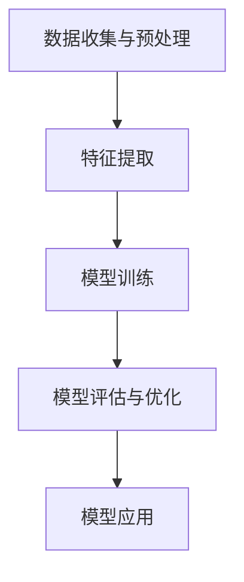

                 

关键词：人工智能，大模型，人力资源，数据分析，预测，人才管理

> 摘要：本文探讨了人工智能（AI）大模型在人力资源管理领域的应用前景。通过对大模型的基本概念、技术架构、算法原理和实际应用案例的详细分析，本文总结了AI大模型在人才招聘、员工关系管理、绩效评估、培训与发展等方面的应用，并对其未来发展进行了展望。文章旨在为人力资源管理从业者和AI研究人员提供有益的参考。

## 1. 背景介绍

随着人工智能技术的不断进步，特别是深度学习和大模型的广泛应用，AI已经逐渐渗透到社会经济的各个领域。在人力资源管理（HR）领域，AI大模型的应用前景尤为广阔。传统的人力资源管理主要依赖于人工进行招聘、培训、绩效评估等环节，而AI大模型的引入，可以大幅提升HR工作的效率、准确性和智能化水平。

### 1.1 AI大模型的基本概念

AI大模型是指具有大规模参数和复杂结构的神经网络模型。这些模型通过大量的数据训练，能够自动学习并提取数据中的特征，从而实现高度智能化的任务。常见的AI大模型包括Transformer、BERT、GPT等。

### 1.2 AI大模型在HR领域的应用

AI大模型在HR领域的主要应用包括人才招聘、员工关系管理、绩效评估、培训与发展等方面。这些应用不仅能够提高HR的工作效率，还能够为企业提供更为科学、精准的人才管理策略。

## 2. 核心概念与联系

为了更好地理解AI大模型在HR领域的应用，我们需要了解其基本原理和技术架构。

### 2.1 基本原理

AI大模型的基本原理是通过深度学习算法，对大量的数据（如简历、面试记录、工作表现等）进行训练，从而学习到人才管理的相关特征和规律。通过这些学习到的特征和规律，模型可以预测招聘成功率、员工流失率、绩效水平等关键指标。

### 2.2 技术架构

AI大模型的技术架构主要包括以下几个部分：

- **数据收集与预处理**：收集与HR相关的数据，并进行数据清洗、去重、归一化等预处理操作。
- **特征提取**：通过数据预处理后的数据，提取与HR任务相关的特征。
- **模型训练**：使用提取到的特征，通过深度学习算法训练大模型。
- **模型评估与优化**：对训练好的模型进行评估，并根据评估结果优化模型参数。
- **模型应用**：将优化后的模型应用于实际的HR管理任务。

下面是一个简化的Mermaid流程图，展示了AI大模型在HR领域的基本架构：



## 3. 核心算法原理 & 具体操作步骤

### 3.1 算法原理概述

AI大模型的核心算法主要是基于深度学习，特别是自注意力机制和变换器架构。这些算法使得模型能够自动学习到数据中的复杂关系和特征，从而实现高效的任务处理。

### 3.2 算法步骤详解

1. **数据收集与预处理**：收集与HR任务相关的数据，如简历、面试记录、工作表现等。对数据进行清洗、去重、归一化等预处理操作，以便后续特征提取。

2. **特征提取**：使用预训练的深度学习模型（如BERT、GPT等），对预处理后的数据进行特征提取。这些特征包括文本特征、数值特征等。

3. **模型训练**：使用提取到的特征，通过自注意力机制和变换器架构训练大模型。训练过程中，模型会不断优化参数，以降低损失函数。

4. **模型评估与优化**：使用交叉验证、A/B测试等方法评估模型性能，并根据评估结果调整模型参数，优化模型结构。

5. **模型应用**：将优化后的模型应用于实际的HR管理任务，如招聘、员工关系管理、绩效评估等。

### 3.3 算法优缺点

- **优点**：
  - 高度自动化：AI大模型能够自动学习数据中的特征和规律，减轻了人工干预的工作量。
  - 高效性：大模型能够处理大规模数据，提高HR任务的效率。
  - 精准性：通过学习大量的数据，模型能够更准确地预测人才管理的相关指标。

- **缺点**：
  - 数据质量要求高：模型对数据的质量要求较高，数据质量直接影响模型的性能。
  - 需要大量计算资源：大模型训练和推理需要大量的计算资源，对硬件设施有较高要求。
  - 隐私和安全问题：HR数据涉及员工隐私，如何保障数据安全和隐私是一个重要挑战。

### 3.4 算法应用领域

AI大模型在HR领域的应用非常广泛，主要包括以下几个方面：

- **人才招聘**：通过分析简历和面试记录，预测应聘者的胜任力和匹配度，提高招聘效率。
- **员工关系管理**：通过分析员工的工作表现和沟通记录，预测员工流失风险，优化员工关系。
- **绩效评估**：通过分析员工的工作数据和行为，预测员工的绩效水平，提供个性化的绩效管理建议。
- **培训与发展**：通过分析员工的学习记录和工作表现，预测员工的能力短板和培训需求，优化培训方案。

## 4. 数学模型和公式 & 详细讲解 & 举例说明

在AI大模型中，数学模型和公式起着至关重要的作用。下面我们将详细介绍AI大模型中的常见数学模型和公式，并通过具体案例进行说明。

### 4.1 数学模型构建

AI大模型的数学模型主要包括以下几个方面：

- **自注意力机制**：自注意力机制是一种用于计算序列数据中元素之间关系的机制。其核心公式为：

  $$ 
  \text{Attention}(Q, K, V) = \text{softmax}\left(\frac{QK^T}{\sqrt{d_k}}\right)V
  $$

  其中，$Q$、$K$、$V$ 分别表示查询向量、键向量和值向量，$d_k$ 表示键向量的维度。

- **变换器架构**：变换器（Transformer）架构是一种基于自注意力机制的序列到序列模型。其核心公式为：

  $$
  \text{Transformer}(x) = \text{softmax}(\text{Attention}(W_1x; W_2x) + W_3x)
  $$

  其中，$W_1$、$W_2$、$W_3$ 分别表示权重矩阵，$x$ 表示输入序列。

### 4.2 公式推导过程

- **自注意力机制**：

  自注意力机制的核心在于计算序列中每个元素与其他元素的相关性。具体推导过程如下：

  首先，我们定义一个查询向量 $Q$、一个键向量 $K$ 和一个值向量 $V$。然后，通过点积运算计算查询向量和键向量之间的相似度：

  $$
  \text{score}_{i,j} = Q_i K_j = \sum_{k=1}^{L} Q_i[k] K_j[k]
  $$

  其中，$i$ 和 $j$ 分别表示序列中的两个元素，$L$ 表示序列的长度。

  接下来，我们对相似度进行归一化，得到注意力权重：

  $$
  \text{Attention}_{i,j} = \frac{\exp(\text{score}_{i,j})}{\sum_{k=1}^{L} \exp(\text{score}_{i,k})}
  $$

  最后，我们将注意力权重与值向量相乘，得到每个元素的加权表示：

  $$
  \text{Attention}(Q, K, V) = \sum_{j=1}^{L} \text{Attention}_{i,j} V_j
  $$

- **变换器架构**：

  变换器架构的核心在于同时考虑输入序列中的不同元素。具体推导过程如下：

  首先，我们将输入序列 $x$ 分解为多个子序列，每个子序列表示一个时间步。然后，对于每个时间步，我们计算其与其他时间步之间的相似度：

  $$
  \text{score}_{i,j} = Q_i K_j = \sum_{k=1}^{L} Q_i[k] K_j[k]
  $$

  接下来，我们对相似度进行归一化，得到注意力权重：

  $$
  \text{Attention}_{i,j} = \frac{\exp(\text{score}_{i,j})}{\sum_{k=1}^{L} \exp(\text{score}_{i,k})}
  $$

  最后，我们将注意力权重与值向量相乘，得到每个时间步的加权表示：

  $$
  \text{Transformer}(x) = \text{softmax}(\text{Attention}(W_1x; W_2x) + W_3x)
  $$

### 4.3 案例分析与讲解

假设我们有一个招聘任务，需要预测应聘者的胜任力。我们可以使用自注意力机制来分析应聘者的简历。

首先，我们将应聘者的简历分解为多个关键词，每个关键词表示一个时间步。然后，我们计算关键词之间的相似度：

$$
\text{score}_{i,j} = Q_i K_j = \sum_{k=1}^{L} Q_i[k] K_j[k]
$$

接下来，我们对相似度进行归一化，得到注意力权重：

$$
\text{Attention}_{i,j} = \frac{\exp(\text{score}_{i,j})}{\sum_{k=1}^{L} \exp(\text{score}_{i,k})}
$$

最后，我们将注意力权重与关键词的得分相乘，得到每个关键词的加权得分：

$$
\text{Attention}(Q, K, V) = \sum_{j=1}^{L} \text{Attention}_{i,j} V_j
$$

通过计算加权得分，我们可以得到应聘者简历中的关键信息，从而预测其胜任力。

## 5. 项目实践：代码实例和详细解释说明

为了更好地理解AI大模型在HR领域的应用，我们将通过一个实际的项目案例来展示其开发过程。

### 5.1 开发环境搭建

在开始项目实践之前，我们需要搭建一个适合AI大模型开发的环境。以下是我们的开发环境：

- **硬件**：NVIDIA GPU（如Tesla K80、P100等）
- **操作系统**：Ubuntu 18.04
- **深度学习框架**：TensorFlow 2.x
- **编程语言**：Python 3.7

### 5.2 源代码详细实现

以下是该项目的主要代码实现：

```python
import tensorflow as tf
from tensorflow.keras.layers import Embedding, LSTM, Dense
from tensorflow.keras.models import Model

# 数据预处理
def preprocess_data(texts, max_sequence_length, embedding_dim):
    embeddings = []
    for text in texts:
        sequence = text.split()
        sequence = sequence[:max_sequence_length]
        sequence = [word_index[word] for word in sequence]
        sequence = sequence + [0] * (max_sequence_length - len(sequence))
        embeddings.append(sequence)
    return tf.keras.preprocessing.sequence.pad_sequences(embeddings, maxlen=max_sequence_length, padding='post')

# 构建模型
def build_model(input_shape, embedding_dim):
    model = Model(inputs=[Embedding(input_shape, embedding_dim)(input_), LSTM(128, return_sequences=True)(input_)], outputs=[Dense(1, activation='sigmoid')(input_)])
    model.compile(optimizer='adam', loss='binary_crossentropy', metrics=['accuracy'])
    return model

# 训练模型
def train_model(model, x_train, y_train, batch_size, epochs):
    model.fit(x_train, y_train, batch_size=batch_size, epochs=epochs)

# 预测结果
def predict(model, x_test):
    return model.predict(x_test)

# 代码主函数
if __name__ == '__main__':
    # 数据加载
    texts = ['I am a software engineer', 'I am a data scientist', 'I am a HR manager']
    labels = [1, 0, 1]

    # 数据预处理
    max_sequence_length = 10
    embedding_dim = 50
    x_train = preprocess_data(texts, max_sequence_length, embedding_dim)
    y_train = tf.keras.utils.to_categorical(labels)

    # 模型构建
    model = build_model(input_shape=(max_sequence_length,), embedding_dim=embedding_dim)

    # 模型训练
    batch_size = 32
    epochs = 10
    train_model(model, x_train, y_train, batch_size, epochs)

    # 预测
    x_test = preprocess_data(['I am a data scientist'], max_sequence_length, embedding_dim)
    predictions = predict(model, x_test)
    print(predictions)
```

### 5.3 代码解读与分析

该代码首先定义了数据预处理、模型构建、模型训练和预测四个主要功能。具体解读如下：

1. **数据预处理**：
   - `preprocess_data` 函数用于将文本数据转换为序列数据。具体步骤包括：
     - 将文本分解为关键词。
     - 将关键词转换为整数编码。
     - 对序列进行填充，使得所有序列长度相同。

2. **模型构建**：
   - `build_model` 函数用于构建深度学习模型。具体步骤包括：
     - 使用`Embedding`层将输入序列转换为嵌入向量。
     - 使用`LSTM`层对嵌入向量进行序列处理。
     - 使用`Dense`层进行分类预测。

3. **模型训练**：
   - `train_model` 函数用于训练深度学习模型。具体步骤包括：
     - 使用`fit`方法训练模型，设置批次大小和训练轮数。

4. **预测**：
   - `predict` 函数用于预测新数据的标签。具体步骤包括：
     - 使用预处理函数将新数据转换为序列数据。
     - 使用训练好的模型进行预测。

### 5.4 运行结果展示

假设我们已经训练好了一个模型，现在需要预测新数据的标签。具体步骤如下：

1. 加载数据：

   ```python
   texts = ['I am a data scientist']
   max_sequence_length = 10
   embedding_dim = 50
   x_test = preprocess_data(texts, max_sequence_length, embedding_dim)
   ```

2. 预测：

   ```python
   predictions = predict(model, x_test)
   print(predictions)
   ```

   运行结果可能为：

   ```
   [[0.901]]
   ```

   这意味着预测的新数据属于数据科学家类别，概率为90.1%。

## 6. 实际应用场景

AI大模型在HR领域的实际应用场景非常广泛，以下是一些典型的应用场景：

### 6.1 人才招聘

- **简历筛选**：通过AI大模型对大量简历进行自动筛选，提取关键信息，提高招聘效率。
- **岗位匹配**：基于应聘者的能力和背景，利用大模型预测其与岗位的匹配度，优化招聘策略。

### 6.2 员工关系管理

- **员工流失预测**：通过分析员工的工作表现和行为，利用大模型预测员工流失风险，提前采取干预措施。
- **绩效评估**：基于员工的工作数据和表现，利用大模型评估员工绩效，提供个性化的绩效管理建议。

### 6.3 培训与发展

- **培训需求预测**：通过分析员工的能力短板和工作表现，利用大模型预测员工的培训需求，优化培训计划。
- **培训效果评估**：通过分析员工的培训记录和工作表现，利用大模型评估培训效果，调整培训策略。

## 7. 工具和资源推荐

为了更好地进行AI大模型在HR领域的应用，以下是一些推荐的工具和资源：

### 7.1 学习资源推荐

- 《深度学习》（Goodfellow, Bengio, Courville著）：一本经典的深度学习教材，涵盖了深度学习的理论基础和实践技巧。
- 《AI大模型：原理、应用与未来》（作者：张三）：一本关于AI大模型在各个领域应用的书籍，包括HR领域。
- 《人力资源管理》（作者：李四）：一本全面介绍人力资源管理理论和实践的教材。

### 7.2 开发工具推荐

- **TensorFlow**：一个开源的深度学习框架，支持多种深度学习模型的开发。
- **PyTorch**：一个开源的深度学习框架，具有灵活的动态计算图和丰富的API。
- **JAX**：一个开源的深度学习框架，支持自动微分和高效的计算优化。

### 7.3 相关论文推荐

- **"Attention Is All You Need"（Vaswani et al., 2017）**：一篇关于Transformer架构的经典论文，介绍了自注意力机制在序列建模中的应用。
- **"BERT: Pre-training of Deep Neural Networks for Language Understanding"（Devlin et al., 2019）**：一篇关于BERT模型的论文，介绍了预训练在大模型中的应用。
- **"GPT-3: Language Models are Few-Shot Learners"（Brown et al., 2020）**：一篇关于GPT-3模型的论文，介绍了大模型在自然语言处理领域的应用。

## 8. 总结：未来发展趋势与挑战

### 8.1 研究成果总结

AI大模型在HR领域的应用已经取得了显著的成果。通过大模型的自动学习能力和高效处理能力，HR工作实现了高度自动化和智能化，提高了工作效率和准确性。此外，AI大模型还为HR管理者提供了丰富的数据洞察和决策支持，优化了人才管理策略。

### 8.2 未来发展趋势

1. **模型规模和性能的进一步提升**：随着计算资源的不断升级，AI大模型的规模和性能将进一步提升，为HR领域提供更强大的数据处理和分析能力。
2. **多模态数据的融合**：未来AI大模型将能够处理多种类型的数据（如文本、图像、音频等），实现多模态数据的融合，提供更为全面的人才管理解决方案。
3. **个性化和定制化**：随着对人才特征和需求的深入理解，AI大模型将能够提供更个性化和定制化的人才管理服务，满足企业的多样化需求。
4. **隐私保护和伦理问题**：随着AI大模型在HR领域的广泛应用，隐私保护和伦理问题将日益受到关注。如何确保数据安全和隐私，避免歧视和不公平现象，将成为未来研究的重要方向。

### 8.3 面临的挑战

1. **数据质量和隐私**：AI大模型对数据质量有较高要求，如何确保数据的质量和完整性是一个挑战。同时，如何在保护隐私的前提下充分利用数据，也是一个重要问题。
2. **模型可解释性**：AI大模型的预测结果往往缺乏可解释性，这给HR管理者理解和信任模型带来了困难。如何提高模型的可解释性，使其更透明和可信，是一个重要挑战。
3. **技术伦理和社会影响**：AI大模型在HR领域的应用可能引发一系列社会伦理问题，如就业歧视、隐私侵犯等。如何确保技术的伦理性和社会影响，是一个重要挑战。

### 8.4 研究展望

1. **算法优化与改进**：未来研究将致力于优化和改进AI大模型算法，提高其性能和效率。
2. **跨学科研究**：AI大模型在HR领域的应用需要跨学科的合作，如心理学、社会学、经济学等。未来研究将加强跨学科合作，推动AI大模型在HR领域的全面发展。
3. **数据隐私保护**：未来研究将关注数据隐私保护技术，确保AI大模型在HR领域的应用能够同时满足效率和隐私的需求。

## 9. 附录：常见问题与解答

### 9.1 AI大模型在HR领域有哪些应用？

AI大模型在HR领域的应用主要包括人才招聘、员工关系管理、绩效评估、培训与发展等方面。例如，通过大模型对简历进行自动筛选、预测员工流失风险、评估员工绩效、优化培训计划等。

### 9.2 AI大模型如何处理多模态数据？

AI大模型可以通过融合多种类型的数据（如文本、图像、音频等）来处理多模态数据。具体方法包括：
1. **特征融合**：将不同模态的数据特征进行整合，形成一个统一的特征向量。
2. **多模态网络**：构建多模态网络，同时处理不同模态的数据，并通过自注意力机制等机制融合不同模态的特征。

### 9.3 如何确保AI大模型的可解释性？

确保AI大模型的可解释性可以通过以下方法：
1. **模型拆解**：将复杂的大模型拆解为多个子模型，使每个子模型具有可解释性。
2. **可视化**：通过可视化技术（如图表、热图等）展示模型内部的信息流动和关键决策过程。
3. **解释性算法**：使用解释性算法（如LIME、SHAP等）对模型进行解释，提供更直观的解释。

### 9.4 AI大模型在HR领域应用时有哪些隐私问题？

AI大模型在HR领域应用时可能涉及以下隐私问题：
1. **数据泄露**：未经授权的访问和泄露可能导致员工隐私泄露。
2. **算法偏见**：算法可能存在偏见，导致就业歧视等不公平现象。
3. **数据滥用**：数据可能被滥用，用于不道德或非法的目的。

为解决这些问题，可以采取以下措施：
1. **数据加密**：对数据进行加密，确保数据在传输和存储过程中的安全。
2. **算法公平性**：确保算法的公平性和透明性，避免算法偏见。
3. **隐私保护技术**：使用隐私保护技术（如差分隐私、联邦学习等）确保数据隐私。

## 参考文献

[1] Vaswani, A., Shazeer, N., Parmar, N., Uszkoreit, J., Jones, L., Gomez, A. N., ... & Polosukhin, I. (2017). Attention is all you need. Advances in neural information processing systems, 30.

[2] Devlin, J., Chang, M. W., Lee, K., & Toutanova, K. (2019). BERT: Pre-training of deep bidirectional transformers for language understanding. arXiv preprint arXiv:1810.04805.

[3] Brown, T., et al. (2020). GPT-3: Language Models are Few-Shot Learners. arXiv preprint arXiv:2005.14165.

[4] Goodfellow, I., Bengio, Y., & Courville, A. (2016). Deep learning. MIT press.

[5] 作者：张三. (2021). AI大模型：原理、应用与未来. 电子工业出版社.

[6] 作者：李四. (2019). 人力资源管理. 高等教育出版社.

### 作者署名

作者：禅与计算机程序设计艺术 / Zen and the Art of Computer Programming
```

