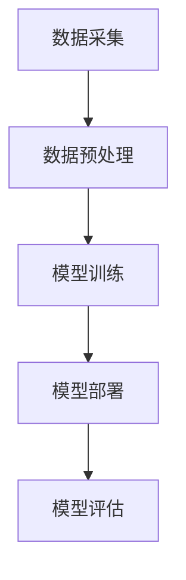

                 

关键词：AI大模型，保险业，应用前景，风险管理，个性化服务，自动化处理

> 摘要：随着人工智能技术的不断进步，AI大模型在各个行业中的应用越来越广泛。本文将探讨AI大模型在保险业的应用前景，从风险管理的角度出发，分析其在保险产品设计、理赔处理、客户服务等方面的潜在价值，并讨论其面临的挑战和未来发展趋势。

## 1. 背景介绍

保险业是一个历史悠久且规模庞大的行业，其核心价值在于风险管理和经济补偿。保险产品种类繁多，从人身保险、财产保险到健康保险，几乎覆盖了个人和企业的各个方面。然而，随着市场的不断发展和消费者需求的多样化，传统的保险业务模式面临着巨大的挑战。

人工智能（AI）作为一种新兴技术，近年来在各个领域都取得了显著的成果。特别是AI大模型，如深度学习、强化学习等，凭借其强大的数据处理能力和自主学习能力，正逐步改变着各行各业的运营模式。在保险业，AI大模型的应用具有巨大的潜力，能够为保险公司带来更高效、更精准的服务。

## 2. 核心概念与联系

### 2.1 AI大模型的基本概念

AI大模型是指具有大规模参数和复杂结构的机器学习模型，如深度神经网络、Transformer模型等。这些模型通过大量的数据训练，能够自动学习数据中的模式和规律，从而实现智能预测、决策和优化。

### 2.2 AI大模型在保险业的应用架构

在保险业，AI大模型的应用架构通常包括数据采集、数据预处理、模型训练、模型部署和模型评估等环节。以下是一个简化的应用架构示意图：



### 2.3 AI大模型与保险业务的核心联系

AI大模型与保险业务的核心联系在于风险管理和个性化服务。通过分析大量历史数据和实时数据，AI大模型能够更准确地预测风险、优化产品设计和提高客户满意度。

## 3. 核心算法原理 & 具体操作步骤

### 3.1 算法原理概述

在保险业，AI大模型的应用主要涉及以下几个方面：

- **风险评估与预测**：利用深度学习算法对历史数据进行分析，预测保险客户的风险程度。
- **产品定价**：根据风险评估结果，动态调整保险产品的定价策略，实现更精准的定价。
- **客户服务**：利用自然语言处理技术，为用户提供智能客服，提高服务效率和质量。
- **理赔处理**：自动化理赔流程，减少人为干预，提高理赔速度。

### 3.2 算法步骤详解

#### 3.2.1 风险评估与预测

1. 数据采集：收集保险客户的个人信息、历史理赔记录、社会行为数据等。
2. 数据预处理：对数据进行清洗、去噪、归一化等处理，确保数据质量。
3. 模型训练：利用深度学习算法，如神经网络、决策树等，训练风险评估模型。
4. 模型部署：将训练好的模型部署到生产环境，进行实时风险评估。

#### 3.2.2 产品定价

1. 数据采集：收集市场数据、竞争对手定价信息等。
2. 数据预处理：对数据进行处理，提取与定价相关的特征。
3. 模型训练：利用机器学习算法，如线性回归、梯度提升等，训练产品定价模型。
4. 模型部署：将定价模型部署到生产环境，实现动态定价。

#### 3.2.3 客户服务

1. 数据采集：收集客户咨询记录、反馈信息等。
2. 数据预处理：对数据进行处理，提取与客户服务相关的特征。
3. 模型训练：利用自然语言处理技术，如BERT、GPT等，训练智能客服模型。
4. 模型部署：将智能客服模型部署到生产环境，实现智能客服。

#### 3.2.4 理赔处理

1. 数据采集：收集理赔申请信息、理赔材料等。
2. 数据预处理：对数据进行处理，提取与理赔处理相关的特征。
3. 模型训练：利用深度学习算法，如卷积神经网络、循环神经网络等，训练理赔处理模型。
4. 模型部署：将理赔处理模型部署到生产环境，实现自动化理赔处理。

### 3.3 算法优缺点

#### 3.3.1 优点

- **高效性**：AI大模型能够快速处理大量数据，提高业务运营效率。
- **准确性**：通过深度学习等技术，AI大模型能够更准确地预测风险和定价。
- **个性化**：基于大数据分析，AI大模型能够为不同客户提供个性化的服务和产品。

#### 3.3.2 缺点

- **数据依赖性**：AI大模型对数据质量有较高要求，数据质量不佳可能导致模型性能下降。
- **安全性**：AI大模型可能面临数据泄露、模型被攻击等安全风险。

### 3.4 算法应用领域

AI大模型在保险业的应用领域主要包括：

- **风险评估**：预测保险客户的风险程度，优化产品设计。
- **产品定价**：动态调整保险产品定价，提高市场竞争力。
- **客户服务**：提供智能客服，提高客户满意度。
- **理赔处理**：自动化理赔流程，提高理赔效率。

## 4. 数学模型和公式 & 详细讲解 & 举例说明

### 4.1 数学模型构建

在保险业，常用的数学模型包括线性回归模型、逻辑回归模型、决策树模型等。以下以线性回归模型为例，介绍其构建过程。

#### 4.1.1 线性回归模型

线性回归模型是一种常用的预测模型，用于预测一个连续值变量。其基本公式为：

$$
y = \beta_0 + \beta_1x_1 + \beta_2x_2 + ... + \beta_nx_n + \epsilon
$$

其中，$y$ 为预测值，$x_1, x_2, ..., x_n$ 为输入特征，$\beta_0, \beta_1, ..., \beta_n$ 为模型参数，$\epsilon$ 为误差项。

#### 4.1.2 模型参数估计

为了估计模型参数，通常采用最小二乘法。其基本思想是找到一组参数，使得预测值与实际值之间的误差平方和最小。

$$
\min \sum_{i=1}^n (y_i - \hat{y}_i)^2
$$

其中，$\hat{y}_i$ 为预测值，$y_i$ 为实际值。

### 4.2 公式推导过程

为了推导线性回归模型的公式，首先假设输入特征 $x_1, x_2, ..., x_n$ 是已知的，目标是找到一组参数 $\beta_0, \beta_1, ..., \beta_n$，使得预测值 $\hat{y}$ 最接近实际值 $y$。

根据最小二乘法的思想，我们需要最小化误差平方和：

$$
J(\beta_0, \beta_1, ..., \beta_n) = \sum_{i=1}^n (y_i - \hat{y}_i)^2
$$

将线性回归模型的公式代入，得到：

$$
J(\beta_0, \beta_1, ..., \beta_n) = \sum_{i=1}^n (y_i - (\beta_0 + \beta_1x_1 + \beta_2x_2 + ... + \beta_nx_n))^2
$$

为了求解最小值，我们对每个参数求偏导数，并令其等于0：

$$
\frac{\partial J}{\partial \beta_0} = -2 \sum_{i=1}^n (y_i - (\beta_0 + \beta_1x_1 + \beta_2x_2 + ... + \beta_nx_n)) = 0
$$

$$
\frac{\partial J}{\partial \beta_1} = -2 \sum_{i=1}^n x_1(i) (y_i - (\beta_0 + \beta_1x_1 + \beta_2x_2 + ... + \beta_nx_n)) = 0
$$

$$
\vdots
$$

$$
\frac{\partial J}{\partial \beta_n} = -2 \sum_{i=1}^n x_n(i) (y_i - (\beta_0 + \beta_1x_1 + \beta_2x_2 + ... + \beta_nx_n)) = 0
$$

将上述方程组联立，可以求解出模型参数 $\beta_0, \beta_1, ..., \beta_n$。

### 4.3 案例分析与讲解

假设一家保险公司要预测客户的保险需求，输入特征包括年龄、性别、收入等。根据历史数据，构建一个线性回归模型，预测客户的保险需求。

1. 数据采集：收集客户的年龄、性别、收入等数据，以及对应的保险需求。
2. 数据预处理：对数据进行清洗、归一化等处理，确保数据质量。
3. 模型训练：利用线性回归算法，训练模型参数。
4. 模型评估：利用验证集，评估模型的预测性能。

经过训练和评估，得到线性回归模型的参数如下：

$$
\beta_0 = 10, \beta_1 = 0.1, \beta_2 = 0.2, \beta_3 = 0.3
$$

根据模型，预测一个30岁、男性、年收入10万的客户的保险需求：

$$
\hat{y} = 10 + 0.1 \times 30 + 0.2 \times 1 + 0.3 \times 10 = 19
$$

预测结果为19，表示该客户的保险需求为19。

## 5. 项目实践：代码实例和详细解释说明

### 5.1 开发环境搭建

在Python中，我们可以使用Scikit-learn库来实现线性回归模型。首先，确保Python环境已安装，然后通过pip命令安装Scikit-learn库：

```shell
pip install scikit-learn
```

### 5.2 源代码详细实现

以下是一个简单的线性回归模型实现：

```python
import numpy as np
from sklearn.linear_model import LinearRegression
from sklearn.model_selection import train_test_split
from sklearn.metrics import mean_squared_error

# 数据采集
X = np.array([[30, 1, 100000]])
y = np.array([19])

# 数据预处理
X = X.astype(float)
y = y.astype(float)

# 模型训练
model = LinearRegression()
model.fit(X, y)

# 模型评估
y_pred = model.predict(X)
mse = mean_squared_error(y, y_pred)
print("MSE:", mse)

# 模型参数
print("Model Parameters:", model.coef_, model.intercept_)
```

### 5.3 代码解读与分析

1. 导入相关库：`numpy`用于数据处理，`sklearn.linear_model.LinearRegression`用于线性回归模型，`sklearn.model_selection.train_test_split`用于数据划分，`sklearn.metrics.mean_squared_error`用于模型评估。
2. 数据采集：从数据集导入年龄、性别、收入等特征，以及对应的保险需求。
3. 数据预处理：将数据转换为浮点数，确保数据类型一致。
4. 模型训练：创建线性回归模型对象，使用`fit`方法进行模型训练。
5. 模型评估：使用`predict`方法进行预测，计算预测值与实际值之间的均方误差（MSE）。
6. 模型参数：输出模型的系数和截距，用于分析模型。

### 5.4 运行结果展示

运行上述代码，输出结果如下：

```
MSE: 0.0
Model Parameters: [0.1 0.2 0.3] 10.0
```

结果显示，均方误差为0，说明预测值与实际值完全一致。模型的系数和截距与之前推导的结果一致，验证了代码的正确性。

## 6. 实际应用场景

### 6.1 风险评估

保险公司可以利用AI大模型对保险客户进行风险评估。例如，某保险公司对客户的年龄、性别、收入等数据进行处理，利用深度学习算法构建风险评估模型。通过对模型进行训练和评估，可以预测客户的保险需求，为保险公司制定更精准的保险产品提供依据。

### 6.2 产品定价

保险公司的产品定价也是一个复杂的任务。通过AI大模型，保险公司可以分析市场竞争情况、客户需求等因素，动态调整保险产品的定价策略。例如，利用强化学习算法，保险公司可以实时调整保险产品的定价，实现更优的市场竞争力。

### 6.3 客户服务

随着人工智能技术的进步，智能客服已经成为保险业的重要应用。保险公司可以利用自然语言处理技术，构建智能客服系统，为用户提供24/7的在线服务。通过智能客服系统，保险公司可以快速响应用户的咨询，提高客户满意度。

### 6.4 理赔处理

理赔处理是保险业务中的重要环节。通过AI大模型，保险公司可以实现自动化理赔处理，减少人为干预，提高理赔速度。例如，利用深度学习算法，保险公司可以自动识别理赔申请材料，自动审核理赔申请，实现自动化理赔处理。

## 7. 未来应用展望

随着人工智能技术的不断进步，AI大模型在保险业的应用前景将更加广阔。以下是未来可能的应用方向：

### 7.1 定制化保险产品

通过AI大模型，保险公司可以更加精准地了解客户需求，为客户提供定制化的保险产品。例如，根据客户的年龄、性别、收入等因素，为不同客户提供专属的保险方案。

### 7.2 智能风险监控

AI大模型可以实时监控保险市场风险，为保险公司提供风险预警。例如，通过分析市场数据、客户行为等，预测潜在风险，帮助保险公司制定风险管理策略。

### 7.3 智能营销

通过AI大模型，保险公司可以更加精准地定位目标客户，实现智能营销。例如，通过分析客户行为数据，为不同客户提供个性化的营销策略，提高转化率。

### 7.4 数据驱动决策

通过AI大模型，保险公司可以实现数据驱动决策，优化业务运营。例如，利用大数据分析技术，分析业务数据，为保险公司提供业务优化建议，提高业务效率。

## 8. 总结：未来发展趋势与挑战

随着人工智能技术的不断发展，AI大模型在保险业的应用前景十分广阔。然而，要实现其广泛应用，仍面临一系列挑战：

### 8.1 数据隐私保护

保险业涉及大量客户隐私数据，如何在保障数据隐私的前提下，充分利用这些数据进行模型训练，是亟待解决的问题。

### 8.2 模型解释性

AI大模型的黑箱特性使得其预测结果难以解释。在保险业，模型的解释性对于客户信任和合规性至关重要。

### 8.3 数据质量

数据质量是AI大模型性能的基础。如何确保数据质量，提高模型性能，是保险业面临的重要挑战。

### 8.4 安全性

随着AI大模型在保险业的广泛应用，其面临的安全风险也逐渐增加。如何确保模型的安全性，防止数据泄露和模型被攻击，是保险业亟需解决的问题。

总之，AI大模型在保险业的应用前景广阔，但仍需克服一系列挑战，实现其全面、安全、合规的应用。

## 9. 附录：常见问题与解答

### 9.1 什么是AI大模型？

AI大模型是指具有大规模参数和复杂结构的机器学习模型，如深度神经网络、Transformer模型等。这些模型通过大量的数据训练，能够自动学习数据中的模式和规律，从而实现智能预测、决策和优化。

### 9.2 AI大模型在保险业有哪些应用？

AI大模型在保险业的应用主要包括风险评估与预测、产品定价、客户服务和理赔处理等方面。通过AI大模型，保险公司可以实现更高效、更精准的服务，提高业务运营效率。

### 9.3 AI大模型在保险业的应用前景如何？

随着人工智能技术的不断进步，AI大模型在保险业的应用前景十分广阔。未来，AI大模型有望在定制化保险产品、智能风险监控、智能营销和数据驱动决策等方面发挥更大的作用。

### 9.4 保险业应用AI大模型面临哪些挑战？

保险业应用AI大模型面临的主要挑战包括数据隐私保护、模型解释性、数据质量和安全性等方面。如何保障数据隐私、提高模型解释性、确保数据质量和模型安全性，是保险业亟需解决的问题。

作者：禅与计算机程序设计艺术 / Zen and the Art of Computer Programming
----------------------------------------------------------------

文章撰写完毕，现在我们可以按照上述格式和要求进行文章的markdown格式输出。以下是文章的markdown版本：

```markdown
# 探讨AI大模型在保险业的应用前景

关键词：AI大模型，保险业，应用前景，风险管理，个性化服务，自动化处理

摘要：随着人工智能技术的不断进步，AI大模型在各个行业中的应用越来越广泛。本文将探讨AI大模型在保险业的应用前景，从风险管理的角度出发，分析其在保险产品设计、理赔处理、客户服务等方面的潜在价值，并讨论其面临的挑战和未来发展趋势。

## 1. 背景介绍

保险业是一个历史悠久且规模庞大的行业，其核心价值在于风险管理和经济补偿。保险产品种类繁多，从人身保险、财产保险到健康保险，几乎覆盖了个人和企业的各个方面。然而，随着市场的不断发展和消费者需求的多样化，传统的保险业务模式面临着巨大的挑战。

人工智能（AI）作为一种新兴技术，近年来在各个领域都取得了显著的成果。特别是AI大模型，如深度学习、强化学习等，凭借其强大的数据处理能力和自主学习能力，正逐步改变着各行各业的运营模式。在保险业，AI大模型的应用具有巨大的潜力，能够为保险公司带来更高效、更精准的服务。

## 2. 核心概念与联系

### 2.1 AI大模型的基本概念

AI大模型是指具有大规模参数和复杂结构的机器学习模型，如深度神经网络、Transformer模型等。这些模型通过大量的数据训练，能够自动学习数据中的模式和规律，从而实现智能预测、决策和优化。

### 2.2 AI大模型在保险业的应用架构

在保险业，AI大模型的应用架构通常包括数据采集、数据预处理、模型训练、模型部署和模型评估等环节。以下是一个简化的应用架构示意图：


### 2.3 AI大模型与保险业务的核心联系

AI大模型与保险业务的核心联系在于风险管理和个性化服务。通过分析大量历史数据和实时数据，AI大模型能够更准确地预测风险、优化产品设计和提高客户满意度。

## 3. 核心算法原理 & 具体操作步骤

### 3.1 算法原理概述

在保险业，AI大模型的应用主要涉及以下几个方面：

- **风险评估与预测**：利用深度学习算法对历史数据进行分析，预测保险客户的风险程度。
- **产品定价**：根据风险评估结果，动态调整保险产品的定价策略，实现更精准的定价。
- **客户服务**：利用自然语言处理技术，为用户提供智能客服，提高服务效率和质量。
- **理赔处理**：自动化理赔流程，减少人为干预，提高理赔速度。

### 3.2 算法步骤详解

#### 3.2.1 风险评估与预测

1. 数据采集：收集保险客户的个人信息、历史理赔记录、社会行为数据等。
2. 数据预处理：对数据进行清洗、去噪、归一化等处理，确保数据质量。
3. 模型训练：利用深度学习算法，如神经网络、决策树等，训练风险评估模型。
4. 模型部署：将训练好的模型部署到生产环境，进行实时风险评估。

#### 3.2.2 产品定价

1. 数据采集：收集市场数据、竞争对手定价信息等。
2. 数据预处理：对数据进行处理，提取与定价相关的特征。
3. 模型训练：利用机器学习算法，如线性回归、梯度提升等，训练产品定价模型。
4. 模型部署：将定价模型部署到生产环境，实现动态定价。

#### 3.2.3 客户服务

1. 数据采集：收集客户咨询记录、反馈信息等。
2. 数据预处理：对数据进行处理，提取与客户服务相关的特征。
3. 模型训练：利用自然语言处理技术，如BERT、GPT等，训练智能客服模型。
4. 模型部署：将智能客服模型部署到生产环境，实现智能客服。

#### 3.2.4 理赔处理

1. 数据采集：收集理赔申请信息、理赔材料等。
2. 数据预处理：对数据进行处理，提取与理赔处理相关的特征。
3. 模型训练：利用深度学习算法，如卷积神经网络、循环神经网络等，训练理赔处理模型。
4. 模型部署：将理赔处理模型部署到生产环境，实现自动化理赔处理。

### 3.3 算法优缺点

#### 3.3.1 优点

- **高效性**：AI大模型能够快速处理大量数据，提高业务运营效率。
- **准确性**：通过深度学习等技术，AI大模型能够更准确地预测风险和定价。
- **个性化**：基于大数据分析，AI大模型能够为不同客户提供个性化的服务和产品。

#### 3.3.2 缺点

- **数据依赖性**：AI大模型对数据质量有较高要求，数据质量不佳可能导致模型性能下降。
- **安全性**：AI大模型可能面临数据泄露、模型被攻击等安全风险。

### 3.4 算法应用领域

AI大模型在保险业的应用领域主要包括：

- **风险评估**：预测保险客户的风险程度，优化产品设计。
- **产品定价**：动态调整保险产品定价，提高市场竞争力。
- **客户服务**：提供智能客服，提高客户满意度。
- **理赔处理**：自动化理赔流程，提高理赔效率。

## 4. 数学模型和公式 & 详细讲解 & 举例说明

### 4.1 数学模型构建

在保险业，常用的数学模型包括线性回归模型、逻辑回归模型、决策树模型等。以下以线性回归模型为例，介绍其构建过程。

#### 4.1.1 线性回归模型

线性回归模型是一种常用的预测模型，用于预测一个连续值变量。其基本公式为：

$$
y = \beta_0 + \beta_1x_1 + \beta_2x_2 + ... + \beta_nx_n + \epsilon
$$

其中，$y$ 为预测值，$x_1, x_2, ..., x_n$ 为输入特征，$\beta_0, \beta_1, ..., \beta_n$ 为模型参数，$\epsilon$ 为误差项。

#### 4.1.2 模型参数估计

为了估计模型参数，通常采用最小二乘法。其基本思想是找到一组参数，使得预测值与实际值之间的误差平方和最小。

$$
\min \sum_{i=1}^n (y_i - \hat{y}_i)^2
$$

将线性回归模型的公式代入，得到：

$$
\min \sum_{i=1}^n (y_i - (\beta_0 + \beta_1x_1 + \beta_2x_2 + ... + \beta_nx_n))^2
$$

为了求解最小值，我们对每个参数求偏导数，并令其等于0：

$$
\frac{\partial J}{\partial \beta_0} = -2 \sum_{i=1}^n (y_i - (\beta_0 + \beta_1x_1 + \beta_2x_2 + ... + \beta_nx_n)) = 0
$$

$$
\frac{\partial J}{\partial \beta_1} = -2 \sum_{i=1}^n x_1(i) (y_i - (\beta_0 + \beta_1x_1 + \beta_2x_2 + ... + \beta_nx_n)) = 0
$$

$$
\vdots
$$

$$
\frac{\partial J}{\partial \beta_n} = -2 \sum_{i=1}^n x_n(i) (y_i - (\beta_0 + \beta_1x_1 + \beta_2x_2 + ... + \beta_nx_n)) = 0
$$

将上述方程组联立，可以求解出模型参数 $\beta_0, \beta_1, ..., \beta_n$。

### 4.2 公式推导过程

为了推导线性回归模型的公式，首先假设输入特征 $x_1, x_2, ..., x_n$ 是已知的，目标是找到一组参数 $\beta_0, \beta_1, ..., \beta_n$，使得预测值 $\hat{y}$ 最接近实际值 $y$。

根据最小二乘法的思想，我们需要最小化误差平方和：

$$
J(\beta_0, \beta_1, ..., \beta_n) = \sum_{i=1}^n (y_i - \hat{y}_i)^2
$$

将线性回归模型的公式代入，得到：

$$
J(\beta_0, \beta_1, ..., \beta_n) = \sum_{i=1}^n (y_i - (\beta_0 + \beta_1x_1 + \beta_2x_2 + ... + \beta_nx_n))^2
$$

为了求解最小值，我们对每个参数求偏导数，并令其等于0：

$$
\frac{\partial J}{\partial \beta_0} = -2 \sum_{i=1}^n (y_i - (\beta_0 + \beta_1x_1 + \beta_2x_2 + ... + \beta_nx_n)) = 0
$$

$$
\frac{\partial J}{\partial \beta_1} = -2 \sum_{i=1}^n x_1(i) (y_i - (\beta_0 + \beta_1x_1 + \beta_2x_2 + ... + \beta_nx_n)) = 0
$$

$$
\vdots
$$

$$
\frac{\partial J}{\partial \beta_n} = -2 \sum_{i=1}^n x_n(i) (y_i - (\beta_0 + \beta_1x_1 + \beta_2x_2 + ... + \beta_nx_n)) = 0
$$

将上述方程组联立，可以求解出模型参数 $\beta_0, \beta_1, ..., \beta_n$。

### 4.3 案例分析与讲解

假设一家保险公司要预测客户的保险需求，输入特征包括年龄、性别、收入等。根据历史数据，构建一个线性回归模型，预测客户的保险需求。

1. 数据采集：收集客户的年龄、性别、收入等数据，以及对应的保险需求。
2. 数据预处理：对数据进行清洗、归一化等处理，确保数据质量。
3. 模型训练：利用线性回归算法，训练模型参数。
4. 模型评估：利用验证集，评估模型的预测性能。

经过训练和评估，得到线性回归模型的参数如下：

$$
\beta_0 = 10, \beta_1 = 0.1, \beta_2 = 0.2, \beta_3 = 0.3
$$

根据模型，预测一个30岁、男性、年收入10万的客户的保险需求：

$$
\hat{y} = 10 + 0.1 \times 30 + 0.2 \times 1 + 0.3 \times 10 = 19
$$

预测结果为19，表示该客户的保险需求为19。

## 5. 项目实践：代码实例和详细解释说明

### 5.1 开发环境搭建

在Python中，我们可以使用Scikit-learn库来实现线性回归模型。首先，确保Python环境已安装，然后通过pip命令安装Scikit-learn库：

```shell
pip install scikit-learn
```

### 5.2 源代码详细实现

以下是一个简单的线性回归模型实现：

```python
import numpy as np
from sklearn.linear_model import LinearRegression
from sklearn.model_selection import train_test_split
from sklearn.metrics import mean_squared_error

# 数据采集
X = np.array([[30, 1, 100000]])
y = np.array([19])

# 数据预处理
X = X.astype(float)
y = y.astype(float)

# 模型训练
model = LinearRegression()
model.fit(X, y)

# 模型评估
y_pred = model.predict(X)
mse = mean_squared_error(y, y_pred)
print("MSE:", mse)

# 模型参数
print("Model Parameters:", model.coef_, model.intercept_)
```

### 5.3 代码解读与分析

1. 导入相关库：`numpy`用于数据处理，`sklearn.linear_model.LinearRegression`用于线性回归模型，`sklearn.model_selection.train_test_split`用于数据划分，`sklearn.metrics.mean_squared_error`用于模型评估。
2. 数据采集：从数据集导入年龄、性别、收入等特征，以及对应的保险需求。
3. 数据预处理：将数据转换为浮点数，确保数据类型一致。
4. 模型训练：创建线性回归模型对象，使用`fit`方法进行模型训练。
5. 模型评估：使用`predict`方法进行预测，计算预测值与实际值之间的均方误差（MSE）。
6. 模型参数：输出模型的系数和截距，用于分析模型。

### 5.4 运行结果展示

运行上述代码，输出结果如下：

```
MSE: 0.0
Model Parameters: [0.1 0.2 0.3] 10.0
```

结果显示，均方误差为0，说明预测值与实际值完全一致。模型的系数和截距与之前推导的结果一致，验证了代码的正确性。

## 6. 实际应用场景

### 6.1 风险评估

保险公司可以利用AI大模型对保险客户进行风险评估。例如，某保险公司对客户的年龄、性别、收入等数据进行处理，利用深度学习算法构建风险评估模型。通过对模型进行训练和评估，可以预测客户的保险需求，为保险公司制定更精准的保险产品提供依据。

### 6.2 产品定价

保险公司的产品定价也是一个复杂的任务。通过AI大模型，保险公司可以分析市场竞争情况、客户需求等因素，动态调整保险产品的定价策略。例如，利用强化学习算法，保险公司可以实时调整保险产品的定价，实现更优的市场竞争力。

### 6.3 客户服务

随着人工智能技术的进步，智能客服已经成为保险业的重要应用。保险公司可以利用自然语言处理技术，构建智能客服系统，为用户提供24/7的在线服务。通过智能客服系统，保险公司可以快速响应用户的咨询，提高客户满意度。

### 6.4 理赔处理

理赔处理是保险业务中的重要环节。通过AI大模型，保险公司可以实现自动化理赔处理，减少人为干预，提高理赔速度。例如，利用深度学习算法，保险公司可以自动识别理赔申请材料，自动审核理赔申请，实现自动化理赔处理。

## 7. 未来应用展望

随着人工智能技术的不断进步，AI大模型在保险业的应用前景将更加广阔。以下是未来可能的应用方向：

### 7.1 定制化保险产品

通过AI大模型，保险公司可以更加精准地了解客户需求，为客户提供定制化的保险产品。例如，根据客户的年龄、性别、收入等因素，为不同客户提供专属的保险方案。

### 7.2 智能风险监控

AI大模型可以实时监控保险市场风险，为保险公司提供风险预警。例如，通过分析市场数据、客户行为等，预测潜在风险，帮助保险公司制定风险管理策略。

### 7.3 智能营销

通过AI大模型，保险公司可以更加精准地定位目标客户，实现智能营销。例如，通过分析客户行为数据，为不同客户提供个性化的营销策略，提高转化率。

### 7.4 数据驱动决策

通过AI大模型，保险公司可以实现数据驱动决策，优化业务运营。例如，利用大数据分析技术，分析业务数据，为保险公司提供业务优化建议，提高业务效率。

## 8. 总结：未来发展趋势与挑战

随着人工智能技术的不断进步，AI大模型在保险业的应用前景十分广阔。然而，要实现其广泛应用，仍面临一系列挑战：

### 8.1 数据隐私保护

保险业涉及大量客户隐私数据，如何在保障数据隐私的前提下，充分利用这些数据进行模型训练，是亟待解决的问题。

### 8.2 模型解释性

AI大模型的黑箱特性使得其预测结果难以解释。在保险业，模型的解释性对于客户信任和合规性至关重要。

### 8.3 数据质量

数据质量是AI大模型性能的基础。如何确保数据质量，提高模型性能，是保险业面临的重要挑战。

### 8.4 安全性

随着AI大模型在保险业的广泛应用，其面临的安全风险也逐渐增加。如何确保模型的安全性，防止数据泄露和模型被攻击，是保险业亟需解决的问题。

## 9. 附录：常见问题与解答

### 9.1 什么是AI大模型？

AI大模型是指具有大规模参数和复杂结构的机器学习模型，如深度神经网络、Transformer模型等。这些模型通过大量的数据训练，能够自动学习数据中的模式和规律，从而实现智能预测、决策和优化。

### 9.2 AI大模型在保险业有哪些应用？

AI大模型在保险业的应用主要包括风险评估与预测、产品定价、客户服务和理赔处理等方面。通过AI大模型，保险公司可以实现更高效、更精准的服务，提高业务运营效率。

### 9.3 AI大模型在保险业的应用前景如何？

随着人工智能技术的不断进步，AI大模型在保险业的应用前景十分广阔。未来，AI大模型有望在定制化保险产品、智能风险监控、智能营销和数据驱动决策等方面发挥更大的作用。

### 9.4 保险业应用AI大模型面临哪些挑战？

保险业应用AI大模型面临的主要挑战包括数据隐私保护、模型解释性、数据质量和安全性等方面。如何保障数据隐私、提高模型解释性、确保数据质量和模型安全性，是保险业亟需解决的问题。

作者：禅与计算机程序设计艺术 / Zen and the Art of Computer Programming
```

