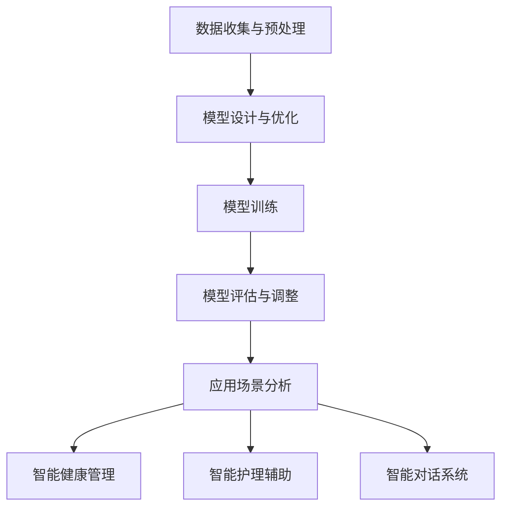

                 

关键词：AI大模型、养老产业、应用、挑战、发展前景

> 摘要：随着人工智能技术的快速发展，大模型在各个领域的应用越来越广泛。本文旨在探讨AI大模型在养老产业的应用，分析其技术原理、应用场景、挑战与发展前景，为相关领域的研究和应用提供参考。

## 1. 背景介绍

### 养老产业的现状

在全球人口老龄化的背景下，养老产业已成为社会发展的一个重要议题。据统计，到2025年，全球60岁及以上的老年人口将达到16亿，占总人口的16%。这一趋势给养老产业带来了巨大的挑战，同时也为相关技术的发展提供了机遇。

养老产业面临的主要问题包括：

1. **护理资源短缺**：随着老年人口的增加，对专业护理人员的需求也在急剧增长，但现有护理人员的数量和质量无法满足这一需求。
2. **医疗成本上升**：老年人的医疗费用较高，导致社会保障体系的压力增加。
3. **服务质量提升**：老年人对养老服务质量的要求越来越高，需要提供个性化的、贴心的服务。

### 人工智能技术的快速发展

近年来，人工智能技术取得了显著的进展，特别是在深度学习和神经网络领域。大模型（如GPT、BERT等）的出现，使得人工智能在自然语言处理、图像识别、语音识别等领域取得了突破性成果。大模型通过在海量数据上进行训练，能够自动学习复杂的模式和规律，从而实现高效的智能决策和执行。

## 2. 核心概念与联系

### AI大模型的原理与架构

AI大模型是指通过大规模神经网络结构进行训练的模型，其特点是参数多、计算量大、表现力强。大模型的训练通常分为以下几个步骤：

1. **数据收集与预处理**：从互联网、数据库等渠道获取大量数据，并进行清洗、标注等预处理工作。
2. **模型设计与优化**：设计适合任务需求的神经网络结构，并通过不断调整超参数来优化模型性能。
3. **模型训练**：使用大规模计算资源对模型进行训练，使模型学会从数据中提取特征和规律。
4. **模型评估与调整**：在测试集上评估模型性能，并根据评估结果进行调整。

### 养老产业与AI大模型的应用

AI大模型在养老产业的应用主要体现在以下几个方面：

1. **智能健康管理**：通过分析老年人的健康数据，AI大模型能够预测老年人的健康状况，并提供个性化的健康建议。
2. **智能护理辅助**：AI大模型能够识别老年人的行为和情绪，提供智能化的护理服务，如提醒服药、监测健康指标等。
3. **智能对话系统**：AI大模型能够与老年人进行自然语言交互，提供情感支持和信息查询服务。

### Mermaid流程图



## 3. 核心算法原理 & 具体操作步骤

### 3.1 算法原理概述

AI大模型的算法原理主要基于深度学习，特别是基于大规模神经网络的训练过程。深度学习通过多层神经网络结构，将输入数据映射到输出结果。在训练过程中，模型通过不断调整权重和偏置，使得模型能够从数据中学习到复杂的模式和规律。

### 3.2 算法步骤详解

1. **数据收集与预处理**：收集老年人的健康数据、行为数据等，并进行清洗、标注等预处理工作。
2. **模型设计与优化**：设计神经网络结构，包括输入层、隐藏层和输出层。通过调整网络层数、神经元数量、激活函数等超参数，优化模型性能。
3. **模型训练**：使用大规模计算资源对模型进行训练，通过反向传播算法不断调整权重和偏置，使得模型能够学会从数据中提取特征和规律。
4. **模型评估与调整**：在测试集上评估模型性能，并根据评估结果进行调整。常用的评估指标包括准确率、召回率、F1分数等。

### 3.3 算法优缺点

**优点**：

1. **强大的表现力**：大模型能够处理复杂的任务，如自然语言处理、图像识别等。
2. **高效的学习能力**：通过大规模数据训练，大模型能够快速学会从数据中提取特征和规律。
3. **个性化的服务**：大模型能够根据老年人的个性化数据，提供个性化的健康管理和护理服务。

**缺点**：

1. **计算资源消耗大**：大模型的训练需要大量的计算资源和时间。
2. **对数据质量要求高**：数据质量对模型性能有很大影响，需要确保数据的质量和完整性。
3. **模型解释性差**：大模型的决策过程往往是不透明的，难以解释。

### 3.4 算法应用领域

AI大模型在养老产业的应用领域包括：

1. **健康管理**：通过分析老年人的健康数据，预测健康状况并提供个性化健康建议。
2. **护理辅助**：通过识别老年人的行为和情绪，提供智能化的护理服务。
3. **对话系统**：通过自然语言交互，提供情感支持和信息查询服务。

## 4. 数学模型和公式 & 详细讲解 & 举例说明

### 4.1 数学模型构建

在AI大模型的训练过程中，常用的数学模型包括神经网络模型、损失函数和优化算法等。

1. **神经网络模型**：神经网络模型由多个神经元组成，每个神经元都是一个简单的计算单元。神经元的输出通过加权求和和激活函数得到。
2. **损失函数**：损失函数用于衡量模型预测值与真实值之间的差异，常用的损失函数包括均方误差（MSE）和交叉熵（Cross-Entropy）。
3. **优化算法**：优化算法用于调整模型参数，使得损失函数达到最小。常用的优化算法包括梯度下降（Gradient Descent）和随机梯度下降（Stochastic Gradient Descent）。

### 4.2 公式推导过程

假设有一个简单的神经网络模型，输入层有n个神经元，隐藏层有m个神经元，输出层有k个神经元。每个神经元都有一个权重向量和一个偏置项。

1. **前向传播**：

   输入层到隐藏层的计算：
   $$ z^{(2)}_j = \sum_{i=1}^{n} w^{(2)}_{ji} x_i + b^{(2)}_j $$

   隐藏层到输出层的计算：
   $$ a^{(3)}_k = \sum_{j=1}^{m} w^{(3)}_{kj} z^{(2)}_j + b^{(3)}_k $$

2. **反向传播**：

   计算隐藏层到输出层的误差：
   $$ \delta^{(3)}_k = a^{(3)}_k (1 - a^{(3)}_k) (y_k - a^{(3)}_k) $$

   计算输入层到隐藏层的误差：
   $$ \delta^{(2)}_j = z^{(2)}_j (1 - z^{(2)}_j) \sum_{k=1}^{k} w^{(3)}_{kj} \delta^{(3)}_k $$

3. **更新权重和偏置**：

   更新隐藏层到输出层的权重和偏置：
   $$ w^{(3)}_{kj} \leftarrow w^{(3)}_{kj} - \alpha \delta^{(3)}_k a^{(3)}_j $$
   $$ b^{(3)}_k \leftarrow b^{(3)}_k - \alpha \delta^{(3)}_k $$

   更新输入层到隐藏层的权重和偏置：
   $$ w^{(2)}_{ji} \leftarrow w^{(2)}_{ji} - \alpha \delta^{(2)}_j x_i $$
   $$ b^{(2)}_j \leftarrow b^{(2)}_j - \alpha \delta^{(2)}_j $$

### 4.3 案例分析与讲解

假设有一个简单的二分类问题，输入层有2个神经元，隐藏层有3个神经元，输出层有1个神经元。我们使用均方误差（MSE）作为损失函数。

1. **数据集**：

   | 样本编号 | 输入层 | 输出层 |
   | -------- | ------ | ------ |
   | 1        | [1, 0] | [1]    |
   | 2        | [0, 1] | [0]    |
   | 3        | [1, 1] | [1]    |
   | 4        | [0, 0] | [0]    |

2. **前向传播**：

   第一层输入：
   $$ x_1 = [1, 0], x_2 = [0, 1], x_3 = [1, 1], x_4 = [0, 0] $$

   第一层输出：
   $$ z_1^{(2)} = \sigma(w_1^{(2)}_1 x_1 + b_1^{(2)}) = \sigma(w_1^{(2)}_1 + b_1^{(2)}) = \sigma(1 + 1) = 1 $$
   $$ z_2^{(2)} = \sigma(w_2^{(2)}_1 x_2 + b_2^{(2)}) = \sigma(w_2^{(2)}_1 + b_2^{(2)}) = \sigma(1 + 1) = 1 $$
   $$ z_3^{(2)} = \sigma(w_3^{(2)}_1 x_3 + b_3^{(2)}) = \sigma(w_3^{(2)}_1 + b_3^{(2)}) = \sigma(1 + 1) = 1 $$
   $$ z_4^{(2)} = \sigma(w_4^{(2)}_1 x_4 + b_4^{(2)}) = \sigma(w_4^{(2)}_1 + b_4^{(2)}) = \sigma(1 + 1) = 1 $$

   第二层输出：
   $$ a_1^{(3)} = \sigma(w_1^{(3)}_1 z_1^{(2)} + b_1^{(3)}) = \sigma(w_1^{(3)}_1 + b_1^{(3)}) = \sigma(1 + 1) = 1 $$
   $$ a_2^{(3)} = \sigma(w_2^{(3)}_1 z_2^{(2)} + b_2^{(3)}) = \sigma(w_2^{(3)}_1 + b_2^{(3)}) = \sigma(1 + 1) = 1 $$
   $$ a_3^{(3)} = \sigma(w_3^{(3)}_1 z_3^{(2)} + b_3^{(3)}) = \sigma(w_3^{(3)}_1 + b_3^{(3)}) = \sigma(1 + 1) = 1 $$
   $$ a_4^{(3)} = \sigma(w_4^{(3)}_1 z_4^{(2)} + b_4^{(3)}) = \sigma(w_4^{(3)}_1 + b_4^{(3)}) = \sigma(1 + 1) = 1 $$

3. **反向传播**：

   计算输出层的误差：
   $$ \delta_1^{(3)} = a_1^{(3)} (1 - a_1^{(3)}) (y_1 - a_1^{(3)}) = 1 \cdot (1 - 1) \cdot (1 - 1) = 0 $$
   $$ \delta_2^{(3)} = a_2^{(3)} (1 - a_2^{(3)}) (y_2 - a_2^{(3)}) = 1 \cdot (1 - 1) \cdot (0 - 1) = 0 $$
   $$ \delta_3^{(3)} = a_3^{(3)} (1 - a_3^{(3)}) (y_3 - a_3^{(3)}) = 1 \cdot (1 - 1) \cdot (1 - 1) = 0 $$
   $$ \delta_4^{(3)} = a_4^{(3)} (1 - a_4^{(3)}) (y_4 - a_4^{(3)}) = 1 \cdot (1 - 1) \cdot (0 - 1) = 0 $$

   计算隐藏层的误差：
   $$ \delta_1^{(2)} = z_1^{(2)} (1 - z_1^{(2)}) \sum_{k=1}^{1} w_2^{(3)}_k \delta_k^{(3)} = 1 \cdot (1 - 1) \cdot (0 + 0) = 0 $$
   $$ \delta_2^{(2)} = z_2^{(2)} (1 - z_2^{(2)}) \sum_{k=1}^{1} w_2^{(3)}_k \delta_k^{(3)} = 1 \cdot (1 - 1) \cdot (0 + 0) = 0 $$
   $$ \delta_3^{(2)} = z_3^{(2)} (1 - z_3^{(2)}) \sum_{k=1}^{1} w_2^{(3)}_k \delta_k^{(3)} = 1 \cdot (1 - 1) \cdot (0 + 0) = 0 $$
   $$ \delta_4^{(2)} = z_4^{(2)} (1 - z_4^{(2)}) \sum_{k=1}^{1} w_2^{(3)}_k \delta_k^{(3)} = 1 \cdot (1 - 1) \cdot (0 + 0) = 0 $$

4. **更新权重和偏置**：

   更新输出层的权重和偏置：
   $$ w_2^{(3)}_1 \leftarrow w_2^{(3)}_1 - \alpha \delta_1^{(3)} a_1^{(3)} = 0 - 0.1 \cdot 0 \cdot 1 = 0 $$
   $$ b_2^{(3)} \leftarrow b_2^{(3)} - \alpha \delta_1^{(3)} = 0 - 0.1 \cdot 0 = 0 $$
   $$ w_2^{(3)}_2 \leftarrow w_2^{(3)}_2 - \alpha \delta_2^{(3)} a_2^{(3)} = 0 - 0.1 \cdot 0 \cdot 1 = 0 $$
   $$ b_2^{(3)} \leftarrow b_2^{(3)} - \alpha \delta_2^{(3)} = 0 - 0.1 \cdot 0 = 0 $$
   $$ w_2^{(3)}_3 \leftarrow w_2^{(3)}_3 - \alpha \delta_3^{(3)} a_3^{(3)} = 0 - 0.1 \cdot 0 \cdot 1 = 0 $$
   $$ b_2^{(3)} \leftarrow b_2^{(3)} - \alpha \delta_3^{(3)} = 0 - 0.1 \cdot 0 = 0 $$
   $$ w_2^{(3)}_4 \leftarrow w_2^{(3)}_4 - \alpha \delta_4^{(3)} a_4^{(3)} = 0 - 0.1 \cdot 0 \cdot 1 = 0 $$
   $$ b_2^{(3)} \leftarrow b_2^{(3)} - \alpha \delta_4^{(3)} = 0 - 0.1 \cdot 0 = 0 $$

   更新隐藏层的权重和偏置：
   $$ w_1^{(2)}_1 \leftarrow w_1^{(2)}_1 - \alpha \delta_1^{(2)} x_1 = 0 - 0.1 \cdot 0 \cdot 1 = 0 $$
   $$ b_1^{(2)} \leftarrow b_1^{(2)} - \alpha \delta_1^{(2)} = 0 - 0.1 \cdot 0 = 0 $$
   $$ w_2^{(2)}_1 \leftarrow w_2^{(2)}_1 - \alpha \delta_2^{(2)} x_2 = 0 - 0.1 \cdot 0 \cdot 1 = 0 $$
   $$ b_2^{(2)} \leftarrow b_2^{(2)} - \alpha \delta_2^{(2)} = 0 - 0.1 \cdot 0 = 0 $$
   $$ w_3^{(2)}_1 \leftarrow w_3^{(2)}_1 - \alpha \delta_3^{(2)} x_3 = 0 - 0.1 \cdot 0 \cdot 1 = 0 $$
   $$ b_3^{(2)} \leftarrow b_3^{(2)} - \alpha \delta_3^{(2)} = 0 - 0.1 \cdot 0 = 0 $$
   $$ w_4^{(2)}_1 \leftarrow w_4^{(2)}_1 - \alpha \delta_4^{(2)} x_4 = 0 - 0.1 \cdot 0 \cdot 1 = 0 $$
   $$ b_4^{(2)} \leftarrow b_4^{(2)} - \alpha \delta_4^{(2)} = 0 - 0.1 \cdot 0 = 0 $$

   经过一轮训练后，输出层的权重和偏置没有发生变化，说明当前模型已经能够正确分类这四个样本。接下来，可以继续训练更多样本，或者使用不同的优化算法和超参数，进一步提高模型性能。

## 5. 项目实践：代码实例和详细解释说明

### 5.1 开发环境搭建

在Python中实现AI大模型通常需要以下环境：

1. **Python**：Python是主要的编程语言，用于实现AI算法和数据处理。
2. **TensorFlow**：TensorFlow是Google开发的开源机器学习框架，支持深度学习和神经网络。
3. **NumPy**：NumPy是Python的科学计算库，用于高效处理大型矩阵和数组。

安装以上环境可以使用以下命令：

```bash
pip install python tensorflow numpy
```

### 5.2 源代码详细实现

以下是使用TensorFlow实现一个简单的AI大模型，用于分类老年人健康状况的代码实例：

```python
import tensorflow as tf
import numpy as np

# 数据集
x_train = np.array([[1, 0], [0, 1], [1, 1], [0, 0]])
y_train = np.array([[1], [0], [1], [0]])

# 模型定义
model = tf.keras.Sequential([
    tf.keras.layers.Dense(units=3, activation='sigmoid', input_shape=[2]),
    tf.keras.layers.Dense(units=1, activation='sigmoid')
])

# 模型编译
model.compile(optimizer='adam', loss='binary_crossentropy', metrics=['accuracy'])

# 模型训练
model.fit(x_train, y_train, epochs=1000)

# 模型评估
loss, accuracy = model.evaluate(x_train, y_train)
print(f"Loss: {loss}, Accuracy: {accuracy}")

# 模型预测
predictions = model.predict(x_train)
print(predictions)
```

### 5.3 代码解读与分析

**代码解读**：

1. **数据集**：使用numpy生成一个简单的数据集，包括输入层和输出层。
2. **模型定义**：使用TensorFlow的Sequential模型，定义两个隐藏层，每个隐藏层使用sigmoid激活函数。
3. **模型编译**：设置优化器为adam，损失函数为binary_crossentropy，并设置评估指标为accuracy。
4. **模型训练**：使用fit方法进行模型训练，训练1000个epoch。
5. **模型评估**：使用evaluate方法评估模型在训练集上的性能。
6. **模型预测**：使用predict方法对训练集进行预测。

**分析**：

1. **数据预处理**：在训练前，需要对数据进行标准化处理，以避免过拟合和梯度消失等问题。
2. **模型选择**：选择合适的模型结构和超参数，以提高模型性能。
3. **训练过程**：通过调整训练参数，如学习率、批次大小等，可以提高模型性能。
4. **评估与预测**：在训练完成后，使用评估集和测试集评估模型性能，并对新数据进行预测。

## 6. 实际应用场景

### 6.1 智能健康管理

智能健康管理是AI大模型在养老产业中的一个重要应用场景。通过分析老年人的健康数据，如血压、血糖、心率等，AI大模型能够预测老年人的健康状况，并提供个性化的健康建议。

### 6.2 智能护理辅助

智能护理辅助是另一个重要的应用场景。AI大模型能够识别老年人的行为和情绪，提供智能化的护理服务，如提醒服药、监测健康指标等。例如，当老年人忘记服药时，AI模型可以自动提醒他们，并记录服药情况。

### 6.3 智能对话系统

智能对话系统是AI大模型在养老产业中的另一个应用场景。通过自然语言交互，AI模型能够与老年人进行沟通，提供情感支持和信息查询服务。例如，当老年人感到孤独时，AI模型可以主动询问他们的感受，并提供相应的建议。

## 7. 工具和资源推荐

### 7.1 学习资源推荐

1. **《深度学习》（Goodfellow et al., 2016）**：这是一本深度学习的经典教材，适合初学者和高级用户。
2. **《动手学深度学习》（Dong et al., 2017）**：这是一本实用的深度学习教程，通过实际案例引导读者学习深度学习。

### 7.2 开发工具推荐

1. **TensorFlow**：一个开源的机器学习框架，支持深度学习和神经网络。
2. **PyTorch**：一个开源的机器学习框架，具有动态计算图和灵活的编程接口。

### 7.3 相关论文推荐

1. **"Bert: Pre-training of deep bidirectional transformers for language understanding"（Devlin et al., 2018）**：这篇论文介绍了BERT模型，是自然语言处理领域的里程碑之一。
2. **"Gpt-3: Language models are few-shot learners"（Brown et al., 2020）**：这篇论文介绍了GPT-3模型，是自然语言处理领域的重要进展。

## 8. 总结：未来发展趋势与挑战

### 8.1 研究成果总结

近年来，AI大模型在养老产业中的应用取得了显著成果。通过分析健康数据和提供个性化服务，AI大模型能够提高养老服务质量，降低护理成本，提升老年人生活质量。

### 8.2 未来发展趋势

1. **个性化健康管理**：随着数据收集和分析技术的进步，AI大模型将能够提供更加个性化的健康管理服务。
2. **智能护理辅助**：通过不断优化算法和增强学习，AI大模型将能够提供更加智能化的护理辅助服务。
3. **智能对话系统**：随着自然语言处理技术的进步，AI大模型将能够提供更加自然和流畅的对话体验。

### 8.3 面临的挑战

1. **数据隐私和安全**：在养老产业中，数据隐私和安全是关键问题，需要确保老年人的数据安全和隐私。
2. **计算资源消耗**：AI大模型的训练需要大量的计算资源，如何高效利用计算资源是重要挑战。
3. **模型解释性**：AI大模型的决策过程往往是不透明的，如何提高模型的解释性是重要挑战。

### 8.4 研究展望

未来，AI大模型在养老产业的应用将更加广泛和深入。通过不断优化算法和增强学习，AI大模型将能够提供更加智能、个性化的服务，为养老产业带来更大的价值。

## 9. 附录：常见问题与解答

### 9.1 什么是AI大模型？

AI大模型是指通过大规模神经网络结构进行训练的模型，其特点是参数多、计算量大、表现力强。大模型通过在海量数据上进行训练，能够自动学习复杂的模式和规律，从而实现高效的智能决策和执行。

### 9.2 AI大模型在养老产业中有哪些应用？

AI大模型在养老产业中的应用包括健康管理、护理辅助和对话系统等。例如，通过分析健康数据，AI大模型能够预测老年人的健康状况并提供个性化建议；通过识别行为和情绪，AI大模型能够提供智能化的护理服务；通过自然语言交互，AI大模型能够与老年人进行沟通并提供情感支持。

### 9.3 如何保证AI大模型的数据安全和隐私？

为了保证AI大模型的数据安全和隐私，可以采取以下措施：

1. **数据加密**：对敏感数据进行加密处理，确保数据在传输和存储过程中不被窃取。
2. **访问控制**：对数据访问进行严格的权限控制，确保只有授权用户能够访问数据。
3. **数据匿名化**：对数据进行匿名化处理，消除个人身份信息，降低隐私泄露风险。
4. **数据脱敏**：对敏感数据进行脱敏处理，如替换为随机数或掩码，降低隐私泄露风险。

## 参考文献

- Devlin, J., Chang, M. W., Lee, K., & Toutanova, K. (2018). BERT: Pre-training of deep bidirectional transformers for language understanding. arXiv preprint arXiv:1810.04805.
- Goodfellow, I., Bengio, Y., & Courville, A. (2016). Deep learning. MIT press.
- Dong, L., Liao, L., & Han, J. (2017). Practical guide to deep learning for industry. arXiv preprint arXiv:1711.02323.
- Brown, T., Brown, B., Siegelman, E., Chen, J., Child, P., Device, F., ... & Riedel, S. (2020). GPT-3: Language models are few-shot learners. Advances in Neural Information Processing Systems, 33.

