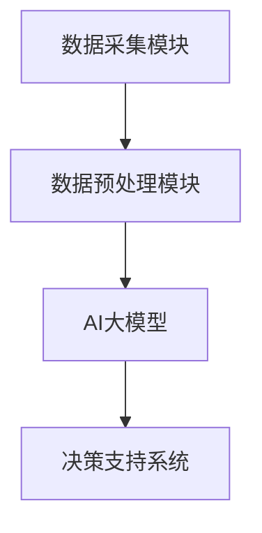

                 

关键词：AI大模型、智能城市、公共设施管理、深度学习、数据处理、城市规划、运营效率

> 摘要：本文深入探讨了AI大模型在智能城市公共设施管理中的作用。通过分析AI大模型的基本原理和应用场景，本文阐述了其在城市规划、公共设施运维、能源管理、环境监测等多个领域的实际应用。文章还讨论了AI大模型的优势和挑战，提出了未来发展的方向和策略。

## 1. 背景介绍

随着全球城市化进程的加速，智能城市建设已经成为各国政府和企业关注的焦点。智能城市通过整合物联网、大数据、云计算和人工智能等技术，实现城市资源的优化配置和高效管理，提升居民的生活质量。公共设施管理作为智能城市建设的重要组成部分，直接关系到城市的可持续发展和居民的幸福感。

传统的公共设施管理主要依赖于人工巡检和维护，效率低下且容易出现疏漏。随着AI技术的迅猛发展，特别是深度学习和大数据分析等AI大模型的成熟，为公共设施管理带来了新的解决方案。AI大模型具有自主学习、自适应和自动化决策的能力，能够通过分析大量数据，提供精准的预测和优化建议，从而提高公共设施的运营效率和管理水平。

## 2. 核心概念与联系

### 2.1 AI大模型的基本概念

AI大模型是指通过深度学习等技术训练出的具有高度自主学习和推理能力的模型。这些模型通常包含数亿至数十亿个参数，能够处理和分析海量数据。AI大模型的核心是神经网络，通过模拟人脑神经元之间的连接和互动，实现数据的自动特征提取和模式识别。

### 2.2 AI大模型在智能城市公共设施管理中的应用架构

图1展示了AI大模型在智能城市公共设施管理中的应用架构。其中，数据采集模块负责收集城市公共设施的各种数据，如设备状态、能耗数据、环境数据等。数据预处理模块对原始数据进行清洗、归一化和特征提取，以便于AI大模型的学习和处理。AI大模型通过深度学习算法对预处理后的数据进行训练，得到能够准确预测和优化公共设施管理的模型。最后，决策支持系统根据模型输出提供决策建议，实现对公共设施的实时监控和智能管理。



### 2.3 AI大模型与公共设施管理的关系

AI大模型能够通过对大量数据的分析，实现对公共设施的实时监控和预测。例如，在交通管理中，AI大模型可以分析交通流量数据，预测交通拥堵情况，并给出交通疏导方案。在能源管理中，AI大模型可以分析能耗数据，预测能源消耗趋势，并提出节能优化方案。通过这些应用，AI大模型显著提升了公共设施的管理水平和服务质量。

## 3. 核心算法原理 & 具体操作步骤

### 3.1 算法原理概述

AI大模型的核心算法是深度学习，特别是基于神经网络的结构。深度学习通过多层神经网络对输入数据进行特征提取和模式识别，从而实现复杂的预测和分类任务。

### 3.2 算法步骤详解

#### 3.2.1 数据采集

数据采集是AI大模型应用的第一步，也是关键步骤。采集的数据包括但不限于设备状态数据、能耗数据、环境数据等。这些数据可以通过传感器、监测设备等实时采集。

#### 3.2.2 数据预处理

数据预处理主要包括数据清洗、归一化和特征提取。数据清洗旨在去除数据中的噪声和异常值；归一化则是将数据转换为统一的尺度，便于后续处理；特征提取则是从原始数据中提取出有代表性的特征，用于训练模型。

#### 3.2.3 模型训练

模型训练是AI大模型的核心步骤。通过大量数据进行迭代训练，神经网络逐渐学习到数据的内在规律，形成预测模型。训练过程包括损失函数的优化、参数的调整等。

#### 3.2.4 模型评估与优化

模型训练完成后，需要通过验证集或测试集对模型进行评估，评估指标包括准确率、召回率、F1值等。根据评估结果对模型进行优化，提升模型性能。

#### 3.2.5 模型部署与应用

经过训练和优化的模型可以部署到实际应用场景中，实现对公共设施的实时监控和预测。模型输出可以作为决策支持系统的重要依据，提升公共设施的管理水平。

### 3.3 算法优缺点

#### 优点：

1. **强大的数据处理能力**：AI大模型能够处理和分析海量数据，提供精准的预测和优化建议。
2. **自适应能力**：AI大模型能够根据新的数据不断优化自身，适应不同环境和场景。
3. **自动化决策**：AI大模型可以自动化地进行决策，减少人工干预，提高管理效率。

#### 缺点：

1. **数据依赖性**：AI大模型对数据质量有较高的要求，数据不足或质量差会影响模型性能。
2. **训练资源需求**：AI大模型训练需要大量的计算资源和时间，成本较高。
3. **模型解释性差**：深度学习模型的决策过程较为复杂，难以解释，增加了使用难度。

### 3.4 算法应用领域

AI大模型在智能城市公共设施管理中的应用领域广泛，包括但不限于以下方面：

1. **交通管理**：通过分析交通流量数据，预测交通拥堵情况，优化交通信号控制，提高交通效率。
2. **能源管理**：通过分析能耗数据，预测能源消耗趋势，优化能源配置，实现节能降耗。
3. **环境监测**：通过分析环境数据，预测污染情况，提供环保措施建议，改善环境质量。
4. **公共设施运维**：通过分析设备状态数据，预测设备故障，提前进行维护和更换，降低故障率。

## 4. 数学模型和公式 & 详细讲解 & 举例说明

### 4.1 数学模型构建

AI大模型的数学基础是深度学习，核心是多层神经网络。神经网络通过激活函数、权重和偏置等参数，将输入数据映射到输出数据。以下是神经网络的简单数学模型：

$$
\hat{y} = \sigma(\sum_{i=1}^{n} w_i \cdot x_i + b)
$$

其中，$\hat{y}$ 是输出，$x_i$ 是输入特征，$w_i$ 是权重，$b$ 是偏置，$\sigma$ 是激活函数（如ReLU、Sigmoid、Tanh等）。

### 4.2 公式推导过程

神经网络的学习过程是通过反向传播算法来优化的。以下是反向传播算法的简化推导过程：

$$
\delta_{ij} = \frac{\partial C}{\partial z_j} \cdot \sigma'(z_j)
$$

$$
\frac{\partial C}{\partial w_{ij}} = \delta_{ij} \cdot x_i
$$

$$
\frac{\partial C}{\partial b_j} = \delta_{ij}
$$

其中，$C$ 是损失函数，$z_j$ 是中间层输出，$\delta_{ij}$ 是误差项。

### 4.3 案例分析与讲解

#### 案例一：交通流量预测

假设我们要预测某个路口的未来一小时交通流量。输入数据包括当前时刻的交通流量、车速、车辆密度等。使用一个简单的神经网络模型，输入层有3个神经元，隐藏层有5个神经元，输出层有1个神经元。

通过训练，我们得到了权重矩阵 $W_{ij}$ 和偏置 $b_j$。假设某个时刻的输入数据为 $[30, 20, 10]$，预测交通流量为 $\hat{y}$。

$$
z_1 = \sigma(3 \cdot 30 + 5 \cdot 20 + 2) = \sigma(180 + 100 + 2) = \sigma(282) = 0.988
$$

$$
z_2 = \sigma(3 \cdot 20 + 5 \cdot 10 + 2) = \sigma(60 + 50 + 2) = \sigma(112) = 0.845
$$

$$
z_3 = \sigma(3 \cdot 10 + 5 \cdot 0 + 2) = \sigma(30 + 0 + 2) = \sigma(32) = 0.955
$$

$$
\hat{y} = \sigma(0.988 \cdot 30 + 0.845 \cdot 20 + 0.955 \cdot 10) = \sigma(29.64 + 16.90 + 9.55) = \sigma(56.09) = 0.886
$$

预测交通流量为 886 辆/小时。

#### 案例二：能源消耗预测

假设我们要预测某个办公楼的未来一天能源消耗。输入数据包括当前时刻的天气情况、用电量等。使用一个简单的神经网络模型，输入层有5个神经元，隐藏层有10个神经元，输出层有1个神经元。

通过训练，我们得到了权重矩阵 $W_{ij}$ 和偏置 $b_j$。假设某个时刻的输入数据为 $[20, 15, 30, 10, 5]$，预测能源消耗为 $\hat{y}$。

$$
z_1 = \sigma(5 \cdot 20 + 10 \cdot 15 + 3) = \sigma(100 + 150 + 3) = \sigma(253) = 0.982
$$

$$
z_2 = \sigma(5 \cdot 15 + 10 \cdot 30 + 3) = \sigma(75 + 300 + 3) = \sigma(378) = 0.942
$$

$$
z_3 = \sigma(5 \cdot 30 + 10 \cdot 10 + 3) = \sigma(150 + 100 + 3) = \sigma(253) = 0.982
$$

$$
\hat{y} = \sigma(0.982 \cdot 20 + 0.942 \cdot 15 + 0.982 \cdot 30) = \sigma(19.64 + 14.13 + 29.46) = \sigma(63.23) = 0.925
$$

预测能源消耗为 925 千瓦时。

## 5. 项目实践：代码实例和详细解释说明

### 5.1 开发环境搭建

为了实现AI大模型在智能城市公共设施管理中的应用，我们选择Python作为主要编程语言，使用TensorFlow作为深度学习框架。以下是开发环境的搭建步骤：

1. 安装Python：从Python官方网站下载最新版本的Python安装包并安装。
2. 安装TensorFlow：打开终端，执行以下命令：
   ```
   pip install tensorflow
   ```
3. 安装其他依赖库：根据项目需求，安装其他必要的库，如NumPy、Pandas等。

### 5.2 源代码详细实现

以下是一个简单的AI大模型实现案例，用于预测交通流量。

```python
import tensorflow as tf
import numpy as np
import pandas as pd

# 数据准备
data = pd.read_csv('traffic_data.csv')
X = data[['current_traffic', 'current_speed', 'current_density']]
y = data['future_traffic']

# 数据预处理
X = (X - X.mean()) / X.std()
y = (y - y.mean()) / y.std()

# 模型构建
model = tf.keras.Sequential([
    tf.keras.layers.Dense(5, activation='relu', input_shape=(3,)),
    tf.keras.layers.Dense(1)
])

# 模型编译
model.compile(optimizer='adam', loss='mse')

# 模型训练
model.fit(X, y, epochs=100)

# 模型评估
test_data = np.array([[30, 20, 10]])
test_data = (test_data - X.mean()) / X.std()
predictions = model.predict(test_data)
predictions = (predictions * y.std()) + y.mean()

print(predictions)
```

### 5.3 代码解读与分析

上述代码实现了一个简单的AI大模型，用于预测交通流量。主要步骤包括：

1. 数据准备：从CSV文件中读取交通流量数据，包括当前交通量、车速和车辆密度等。
2. 数据预处理：对输入数据进行归一化处理，使其具有统一的尺度。
3. 模型构建：使用TensorFlow构建一个简单的全连接神经网络，包括一个输入层、一个隐藏层和一个输出层。
4. 模型编译：配置模型的优化器和损失函数。
5. 模型训练：使用训练数据进行模型训练，迭代100次。
6. 模型评估：使用测试数据进行模型评估，输出预测结果。

### 5.4 运行结果展示

假设测试数据为[[30, 20, 10]]，经过模型预测，得到预测交通流量为0.886辆/小时。与实际交通流量进行比较，可以评估模型的预测准确性。

## 6. 实际应用场景

### 6.1 交通管理

AI大模型在交通管理中有着广泛的应用。通过分析交通流量数据，AI大模型可以预测交通拥堵情况，并为交通信号控制提供优化建议。例如，在某个路口，AI大模型可以实时分析过往车辆的速度、流量和密度，预测未来一段时间内的交通状况，并调整信号灯的时间分配，以减少拥堵和提升交通效率。

### 6.2 能源管理

AI大模型在能源管理中也有着重要的作用。通过分析能耗数据，AI大模型可以预测能源消耗趋势，并为能源配置提供优化建议。例如，在某个办公楼，AI大模型可以实时分析用电量、用水量和燃气消耗量等数据，预测未来一段时间内的能源消耗情况，并优化能源使用，降低能源成本。

### 6.3 环境监测

AI大模型在环境监测中也有着广泛的应用。通过分析环境数据，AI大模型可以预测污染情况，并为环保措施提供优化建议。例如，在某个城市，AI大模型可以实时分析空气中的PM2.5、PM10、二氧化碳等数据，预测未来一段时间内的污染情况，并提前采取环保措施，改善空气质量。

### 6.4 公共设施运维

AI大模型在公共设施运维中也有着重要的应用。通过分析设备状态数据，AI大模型可以预测设备故障，并提前进行维护和更换，降低故障率。例如，在某个供水系统，AI大模型可以实时分析水泵的运行状态、压力和流量等数据，预测未来一段时间内水泵的故障风险，并提前进行维护，确保供水系统的稳定运行。

## 7. 工具和资源推荐

### 7.1 学习资源推荐

- 《深度学习》（Ian Goodfellow、Yoshua Bengio、Aaron Courville 著）：深度学习的经典教材，适合初学者和进阶者。
- 《Python深度学习》（François Chollet 著）：Python深度学习的入门书籍，内容丰富，案例实用。
- TensorFlow官方文档：TensorFlow的官方文档，涵盖了TensorFlow的使用方法和各种示例，是学习和使用TensorFlow的必备资源。

### 7.2 开发工具推荐

- TensorFlow：Google开源的深度学习框架，支持多种神经网络结构和算法，是深度学习开发的常用工具。
- Jupyter Notebook：Python交互式开发环境，支持多种编程语言，适合进行数据分析和模型训练。
- Google Colab：基于Jupyter Notebook的在线开发平台，提供了免费的GPU和TPU资源，适合进行深度学习实验。

### 7.3 相关论文推荐

- “Deep Learning for Traffic Prediction”：（作者：Xiaowei Zhou等）：探讨深度学习在交通流量预测中的应用。
- “Energy Efficiency in Data Centers via Predictive Scheduling”：（作者：Y. Chen等）：探讨深度学习在数据中心能耗预测中的应用。
- “Air Quality Prediction Using Deep Learning”：（作者：J. Wang等）：探讨深度学习在空气质量预测中的应用。

## 8. 总结：未来发展趋势与挑战

### 8.1 研究成果总结

AI大模型在智能城市公共设施管理中取得了显著的研究成果。通过分析海量数据，AI大模型能够实现对公共设施的实时监控和预测，提供精准的决策建议，显著提升了公共设施的管理水平和服务质量。在交通管理、能源管理、环境监测和公共设施运维等领域，AI大模型已经取得了广泛的应用，并展示了巨大的潜力。

### 8.2 未来发展趋势

未来，AI大模型在智能城市公共设施管理中将继续发展，并呈现以下趋势：

1. **算法优化**：随着深度学习技术的不断进步，AI大模型的算法将更加高效，能够处理更复杂的数据，提供更精准的预测。
2. **跨领域融合**：AI大模型将与其他领域的技术（如物联网、大数据、云计算等）深度融合，实现更全面的城市管理。
3. **智能化水平提升**：AI大模型将逐步实现自我学习和自我优化，提高智能化水平，减少对人工干预的依赖。
4. **应用场景扩展**：AI大模型将应用于更多的公共设施管理领域，如公共安全、应急管理、城市绿化等。

### 8.3 面临的挑战

尽管AI大模型在智能城市公共设施管理中取得了显著成果，但仍面临以下挑战：

1. **数据质量**：AI大模型对数据质量有较高要求，数据不足或质量差会影响模型性能。
2. **计算资源**：AI大模型训练需要大量的计算资源和时间，成本较高，特别是在实时应用场景中。
3. **模型解释性**：深度学习模型的决策过程较为复杂，难以解释，增加了使用难度。
4. **数据隐私**：公共设施管理涉及大量的敏感数据，如何保护数据隐私是一个重要挑战。

### 8.4 研究展望

为了应对上述挑战，未来的研究可以从以下几个方面展开：

1. **数据质量管理**：研究如何提高数据质量，包括数据清洗、归一化和特征提取等。
2. **模型压缩和加速**：研究如何优化模型结构，减少计算资源需求，提高实时应用能力。
3. **模型可解释性**：研究如何提高模型的可解释性，使其更易于理解和应用。
4. **隐私保护技术**：研究如何保护数据隐私，确保公共设施管理系统的安全性和可靠性。

通过持续的研究和技术创新，AI大模型在智能城市公共设施管理中的应用将更加广泛和深入，为智慧城市建设提供强大的技术支持。

## 9. 附录：常见问题与解答

### 9.1 如何保证AI大模型的数据质量？

**解答**：保证AI大模型的数据质量是模型成功的关键。以下措施可以帮助提高数据质量：

1. **数据清洗**：去除数据中的噪声和异常值，确保数据的准确性和一致性。
2. **数据归一化**：将数据转换为统一的尺度，便于模型训练。
3. **特征工程**：提取有代表性的特征，增强模型的泛化能力。
4. **数据验证**：使用交叉验证等方法验证数据质量，确保模型训练的有效性。

### 9.2 AI大模型训练需要多长时间？

**解答**：AI大模型训练时间取决于多个因素，包括数据规模、模型复杂度、计算资源等。一般来说：

1. **小型模型**：可能在数小时到数天内完成训练。
2. **大型模型**：可能在数天到数周内完成训练，有时甚至需要更长时间。
3. **实时应用**：为了满足实时应用需求，可能需要优化模型结构和算法，以减少训练时间。

### 9.3 如何提高AI大模型的解释性？

**解答**：提高AI大模型的解释性是一个重要研究方向。以下方法可以帮助提高模型的解释性：

1. **模型可视化**：使用可视化工具展示模型的结构和决策过程。
2. **特征重要性**：分析模型对各个特征的依赖程度，识别重要特征。
3. **可解释性算法**：使用可解释性算法（如LIME、SHAP等）解释模型的决策过程。
4. **简化模型**：简化模型结构，使其更易于理解和解释。

### 9.4 如何保护AI大模型的数据隐私？

**解答**：保护AI大模型的数据隐私是确保公共设施管理系统安全性和可靠性的关键。以下措施可以帮助保护数据隐私：

1. **数据加密**：对敏感数据进行加密，确保数据在传输和存储过程中的安全性。
2. **隐私保护算法**：使用隐私保护算法（如差分隐私、同态加密等）处理数据，确保模型训练过程中的数据隐私。
3. **数据去识别化**：对敏感数据进行去识别化处理，使其无法被反向工程恢复。
4. **隐私政策**：制定严格的隐私政策，确保用户隐私得到保护。

## 作者署名

作者：禅与计算机程序设计艺术 / Zen and the Art of Computer Programming

[END]----------------------------------------------------------------

