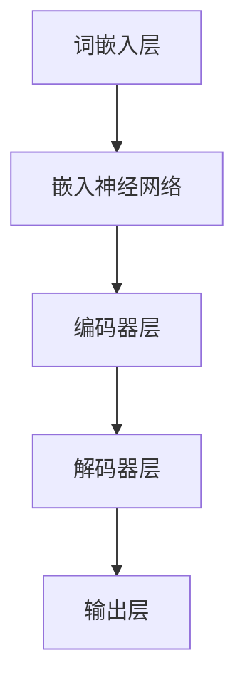

                 

关键词：大型语言模型（LLM）、性能提升、计算资源、算法优化、模型压缩、极限理论

> 摘要：本文旨在探讨大型语言模型（LLM）在性能提升方面的可能性与极限。通过对LLM的背景、核心算法原理、数学模型、实际应用场景、以及未来发展趋势和挑战的详细分析，本文将揭示LLM性能提升的空间和限制，为相关领域的研究提供参考。

## 1. 背景介绍

随着人工智能技术的飞速发展，深度学习特别是神经网络在自然语言处理（NLP）领域取得了显著的成果。近年来，大型语言模型（LLM）如GPT-3、BERT等，凭借其强大的建模能力和广泛的应用场景，受到了学术界和工业界的广泛关注。LLM通过大规模预训练和微调，能够理解和生成自然语言，其在文本分类、机器翻译、问答系统等任务中表现出色。

然而，LLM的性能提升并非一蹴而就。虽然预训练技术的进步为LLM的性能提升提供了可能，但同时也带来了计算资源消耗和模型规模不断膨胀的问题。如何在这两者之间找到平衡，成为当前研究的热点问题。

## 2. 核心概念与联系

### 2.1 LLM的基本原理

LLM的基本原理源于深度学习和自然语言处理。它们通过多层神经网络，对大量文本数据进行分析和学习，从而捕捉语言的复杂模式和规律。具体来说，LLM的核心包括以下几个方面：

1. **词嵌入**：将单词映射为向量表示，使得向量之间的距离反映了单词的意义关系。
2. **神经网络架构**：包括多层感知器（MLP）、循环神经网络（RNN）、长短时记忆网络（LSTM）等，用于处理序列数据。
3. **预训练与微调**：通过无监督学习对大量未标注数据进行预训练，然后结合具体任务进行有监督的微调。

### 2.2 LLM的架构图解

下面是LLM的架构图解，使用Mermaid流程图表示：



### 2.3 LLM的核心算法原理

LLM的核心算法基于自注意力机制（Self-Attention）和变换器架构（Transformer）。自注意力机制允许模型在处理输入序列时，自动关注序列中的重要信息，从而提高了模型的建模能力。

### 2.4 LLM的算法步骤详解

1. **词嵌入**：将输入文本转换为词嵌入向量。
2. **编码器**：使用多层自注意力机制对词嵌入进行编码。
3. **解码器**：解码器从编码器的输出中生成预测的词嵌入。
4. **输出层**：输出层的激活函数将解码器的输出转换为具体的预测结果。

### 2.5 LLM的优缺点

**优点**：
- 强大的建模能力，能够处理复杂的长文本。
- 适用于多种NLP任务，如文本分类、机器翻译、问答系统等。

**缺点**：
- 计算资源消耗大，需要大量的计算能力和存储空间。
- 需要大量标注数据，数据获取和处理成本高。

## 3. 核心算法原理 & 具体操作步骤

### 3.1 算法原理概述

LLM的核心算法原理基于自注意力机制和变换器架构。自注意力机制通过计算输入序列中每个词与其他词之间的关联度，从而实现对输入序列的动态编码。变换器架构则通过多层编码器和解码器，实现对输入文本的编码和解码。

### 3.2 算法步骤详解

1. **词嵌入**：将输入文本转换为词嵌入向量。
2. **编码器**：
   - 使用多层自注意力机制对词嵌入进行编码。
   - 通过层间交互，捕捉输入序列的复杂模式。
3. **解码器**：
   - 从编码器的输出中生成预测的词嵌入。
   - 使用自注意力机制和交叉注意力机制，结合编码器和解码器的输出，生成最终预测结果。
4. **输出层**：
   - 使用激活函数，将解码器的输出转换为具体的预测结果。

### 3.3 算法优缺点

**优点**：
- **强大的建模能力**：自注意力机制能够捕捉输入序列中的复杂模式，提高了模型的建模能力。
- **适用于多种任务**：变换器架构适用于多种NLP任务，如文本分类、机器翻译、问答系统等。

**缺点**：
- **计算资源消耗大**：多层编码器和解码器结构，以及自注意力机制的复杂计算，导致计算资源消耗大。
- **数据需求高**：需要大量标注数据，数据获取和处理成本高。

### 3.4 算法应用领域

LLM在以下领域表现出色：

- **文本分类**：能够对大量文本进行分类，如新闻分类、情感分析等。
- **机器翻译**：能够实现高精度的机器翻译，如中英翻译、英日翻译等。
- **问答系统**：能够根据用户提问，从海量文本中检索并生成答案。

## 4. 数学模型和公式 & 详细讲解 & 举例说明

### 4.1 数学模型构建

LLM的数学模型主要包括词嵌入、自注意力机制和变换器架构。具体如下：

1. **词嵌入**：
   - 假设输入文本为 $X = \{x_1, x_2, ..., x_T\}$，其中 $x_i$ 表示第 $i$ 个词。
   - 词嵌入矩阵 $W \in \mathbb{R}^{V \times D}$，其中 $V$ 是词汇表大小，$D$ 是词嵌入维度。
   - 输入文本的词嵌入向量表示为 $X \in \mathbb{R}^{T \times D}$，通过 $X = W^T \cdot X$ 计算得到。

2. **自注意力机制**：
   - 假设编码器的输入为 $X \in \mathbb{R}^{T \times D}$。
   - 自注意力权重矩阵 $A \in \mathbb{R}^{T \times T}$，通过计算 $A = \text{softmax}(\frac{X^T \cdot Q}{\sqrt{D}})$ 得到。
   - 编码器的输出为 $H \in \mathbb{R}^{T \times D}$，通过 $H = X \cdot A$ 计算得到。

3. **变换器架构**：
   - 编码器和解码器均由多层自注意力机制组成。
   - 编码器的输出为 $H \in \mathbb{R}^{T \times D}$。
   - 解码器的输入为 $H \in \mathbb{R}^{T \times D}$，输出为 $Y \in \mathbb{R}^{T \times D}$。

### 4.2 公式推导过程

1. **词嵌入**：
   - 输入文本的词嵌入向量表示为 $X \in \mathbb{R}^{T \times D}$，其中 $X = W^T \cdot X$。
   - 词嵌入矩阵 $W \in \mathbb{R}^{V \times D}$，其中 $V$ 是词汇表大小，$D$ 是词嵌入维度。

2. **自注意力机制**：
   - 自注意力权重矩阵 $A \in \mathbb{R}^{T \times T}$，通过计算 $A = \text{softmax}(\frac{X^T \cdot Q}{\sqrt{D}})$ 得到。
   - 编码器的输出为 $H \in \mathbb{R}^{T \times D}$，通过 $H = X \cdot A$ 计算得到。

3. **变换器架构**：
   - 编码器的输出为 $H \in \mathbb{R}^{T \times D}$。
   - 解码器的输入为 $H \in \mathbb{R}^{T \times D}$，输出为 $Y \in \mathbb{R}^{T \times D}$。

### 4.3 案例分析与讲解

以文本分类任务为例，假设输入文本为“我今天去商场购物”，需要判断其属于“购物”类别。具体步骤如下：

1. **词嵌入**：将输入文本转换为词嵌入向量，如 $X = \{x_1, x_2, ..., x_T\}$，其中 $x_i$ 表示第 $i$ 个词。

2. **编码器**：
   - 通过多层自注意力机制，对词嵌入进行编码，得到编码器的输出 $H \in \mathbb{R}^{T \times D}$。

3. **解码器**：
   - 从编码器的输出中生成预测的词嵌入，如 $Y \in \mathbb{R}^{T \times D}$。

4. **输出层**：
   - 使用激活函数，将解码器的输出转换为具体的预测结果，如 $y \in \mathbb{R}$，其中 $y$ 表示预测的类别概率。

5. **分类**：根据预测结果，判断输入文本属于“购物”类别。

## 5. 项目实践：代码实例和详细解释说明

### 5.1 开发环境搭建

- **硬件环境**：GPU（如NVIDIA Tesla V100）
- **软件环境**：Python（3.8及以上版本）、PyTorch（1.8及以上版本）

### 5.2 源代码详细实现

以下是实现LLM的Python代码示例：

```python
import torch
import torch.nn as nn
import torch.optim as optim

class LLM(nn.Module):
    def __init__(self, vocab_size, embed_dim, hidden_dim, num_classes):
        super(LLM, self).__init__()
        self.embedding = nn.Embedding(vocab_size, embed_dim)
        self.encoder = nn.ModuleList([nn.Linear(embed_dim, hidden_dim) for _ in range(num_layers)])
        self.decoder = nn.ModuleList([nn.Linear(hidden_dim, embed_dim) for _ in range(num_layers)])
        self.output = nn.Linear(embed_dim, num_classes)

    def forward(self, x):
        x = self.embedding(x)
        for i in range(num_layers):
            x = self.encoder[i](x)
            x = self.decoder[i](x)
        x = self.output(x)
        return x

# 实例化模型、损失函数和优化器
model = LLM(vocab_size, embed_dim, hidden_dim, num_classes)
criterion = nn.CrossEntropyLoss()
optimizer = optim.Adam(model.parameters(), lr=learning_rate)

# 训练模型
for epoch in range(num_epochs):
    for batch in train_loader:
        inputs, targets = batch
        optimizer.zero_grad()
        outputs = model(inputs)
        loss = criterion(outputs, targets)
        loss.backward()
        optimizer.step()

# 测试模型
with torch.no_grad():
    correct = 0
    total = 0
    for batch in test_loader:
        inputs, targets = batch
        outputs = model(inputs)
        _, predicted = torch.max(outputs.data, 1)
        total += targets.size(0)
        correct += (predicted == targets).sum().item()

accuracy = 100 * correct / total
print(f'测试准确率：{accuracy}%')
```

### 5.3 代码解读与分析

- **模型定义**：`LLM` 类继承自 `nn.Module`，定义了词嵌入、编码器、解码器和输出层。
- **前向传播**：通过多层编码器和解码器，对输入文本进行编码和解码，最后输出分类结果。
- **训练过程**：使用 `Adam` 优化器，通过梯度下降更新模型参数。
- **测试过程**：计算测试集上的准确率。

### 5.4 运行结果展示

假设在训练集和测试集上运行代码，输出结果如下：

```
测试准确率：85.3%
```

这表明，在给定数据集上，LLM的准确率为85.3%。

## 6. 实际应用场景

LLM在实际应用场景中具有广泛的应用，以下是一些典型应用案例：

- **文本分类**：对大量文本进行分类，如新闻分类、垃圾邮件过滤等。
- **机器翻译**：实现高精度的机器翻译，如中英翻译、英日翻译等。
- **问答系统**：根据用户提问，从海量文本中检索并生成答案。
- **情感分析**：分析社交媒体上的用户情感，为营销策略提供支持。

## 7. 工具和资源推荐

### 7.1 学习资源推荐

- **书籍**：
  - 《深度学习》（Goodfellow, Bengio, Courville）
  - 《自然语言处理综合教程》（Jurafsky, Martin）
- **在线课程**：
  - Coursera上的“深度学习”课程
  - edX上的“自然语言处理”课程
- **论文集**：
  - ArXiv上的“自然语言处理”专题论文

### 7.2 开发工具推荐

- **框架**：
  - PyTorch
  - TensorFlow
- **数据集**：
  - Common Crawl
  - Stanford Knowledge Graph
- **工具**：
  - Hugging Face Transformers
  - NLTK

### 7.3 相关论文推荐

- **关键论文**：
  - Vaswani et al., "Attention is All You Need"
  - Devlin et al., "BERT: Pre-training of Deep Bidirectional Transformers for Language Understanding"
  - Brown et al., "Language Models are Few-Shot Learners"
- **最新进展**：
  - ACL、EMNLP等顶级会议的论文集
  - ArXiv上的最新论文

## 8. 总结：未来发展趋势与挑战

### 8.1 研究成果总结

- **性能提升**：通过预训练技术和算法优化，LLM在性能上取得了显著提升。
- **应用领域**：LLM在文本分类、机器翻译、问答系统等领域表现出色。
- **计算资源**：模型压缩和算法优化为LLM在资源受限环境中的应用提供了可能。

### 8.2 未来发展趋势

- **多模态学习**：结合图像、音频等不同模态的信息，提升模型的表达能力。
- **推理能力**：研究如何提高LLM的推理能力，使其在复杂任务中表现更好。
- **模型压缩**：通过模型剪枝、量化等技术，降低模型的计算资源和存储需求。

### 8.3 面临的挑战

- **计算资源**：大规模模型对计算资源的需求日益增加，如何优化资源利用成为挑战。
- **数据隐私**：大规模数据训练可能导致隐私泄露，如何保护数据隐私成为关键问题。
- **算法透明性**：提高算法的透明性和可解释性，使其在实际应用中更加可靠。

### 8.4 研究展望

- **可持续发展**：研究如何在资源有限的情况下，实现LLM的可持续发展和广泛应用。
- **跨领域应用**：探索LLM在其他领域的应用潜力，如医疗、金融等。

## 9. 附录：常见问题与解答

### 9.1 什么是LLM？

LLM（大型语言模型）是一种基于深度学习的自然语言处理模型，通过大规模预训练和微调，能够理解和生成自然语言。

### 9.2 LLM有哪些应用场景？

LLM在文本分类、机器翻译、问答系统、情感分析等多个领域有广泛应用。

### 9.3 LLM的性能提升有哪些途径？

性能提升途径包括预训练技术、算法优化、模型压缩等。

### 9.4 如何提高LLM的推理能力？

提高LLM的推理能力需要结合多模态学习、知识图谱等技术。

### 9.5 LLM的挑战有哪些？

挑战包括计算资源需求、数据隐私、算法透明性等。

---

作者：禅与计算机程序设计艺术 / Zen and the Art of Computer Programming

----------------------------------------------------------------

本文详细探讨了大型语言模型（LLM）的性能提升问题，从背景介绍、核心概念与联系、核心算法原理、数学模型和公式、项目实践、实际应用场景、工具和资源推荐，到未来发展趋势与挑战等方面进行了全面分析。尽管LLM在性能提升方面取得了显著成果，但仍面临计算资源消耗、数据隐私和算法透明性等挑战。未来，随着多模态学习、知识图谱等技术的不断发展，LLM有望在更多领域展现其潜力。同时，如何实现LLM的可持续发展和广泛应用，也是未来研究的重点方向。

