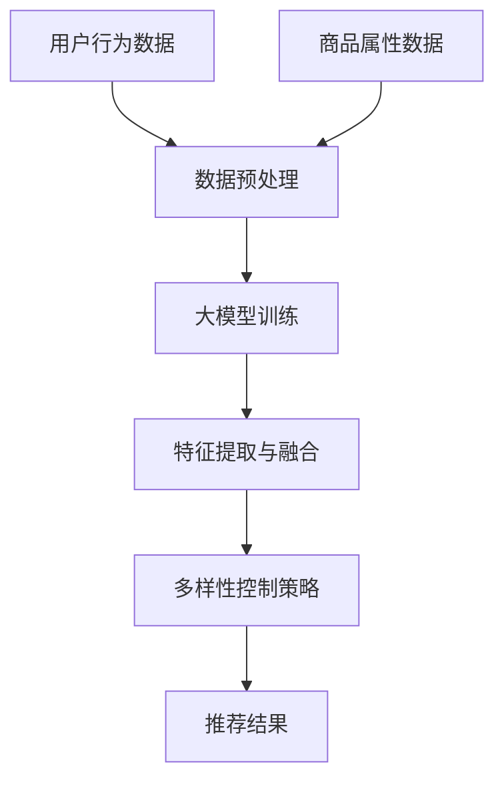

                 

关键词：大模型、电商平台、商品推荐、多样性控制、深度学习、算法优化、用户满意度、推荐系统、个性化购物体验

## 摘要

随着电商平台的快速发展，商品推荐系统已成为提升用户体验和商家收益的关键因素。本文旨在探讨大模型在电商平台商品推荐多样性控制中的作用。通过分析大模型的原理和优势，结合实际应用场景，我们将深入探讨如何通过大模型实现商品推荐多样性的优化，从而提高用户满意度和商家收益。本文将分为以下几个部分：背景介绍、核心概念与联系、核心算法原理与操作步骤、数学模型与公式、项目实践、实际应用场景、工具和资源推荐、总结与展望。

## 1. 背景介绍

在当今数字化时代，电商平台已成为消费者购物的主要渠道之一。随着消费者需求的不断变化和个性化需求的提升，电商平台面临着如何提供更好的商品推荐服务来满足用户需求的挑战。商品推荐系统的核心目标是通过分析用户的兴趣和行为，为用户提供个性化的商品推荐，从而提升用户的购物体验和平台的竞争力。

然而，在实际应用中，商品推荐系统面临着多样性的挑战。用户对商品推荐的需求是多样化的，他们希望看到不同类型、不同品牌的商品，而不是一系列重复的商品。因此，如何实现商品推荐的多样性控制成为电商企业关注的重要问题。传统的推荐算法往往侧重于准确性和相关性，而忽视了多样性的需求。

随着深度学习技术的快速发展，大模型在推荐系统中的应用逐渐成为一种趋势。大模型具有强大的表征能力和泛化能力，能够捕捉用户行为和商品属性之间的复杂关系。通过大模型，电商平台可以更准确地预测用户的兴趣和偏好，从而提供更加个性化的商品推荐。同时，大模型还可以通过引入多样性增强机制，实现商品推荐的多样性控制，满足用户对多样化商品的需求。

本文将探讨大模型在电商平台商品推荐多样性控制中的作用，分析大模型的原理和优势，介绍大模型在多样性控制中的应用方法，并通过实际案例进行分析和验证。希望通过本文的探讨，为电商平台提供一种有效的商品推荐多样性控制策略，提升用户满意度和平台竞争力。

## 2. 核心概念与联系

### 2.1 大模型的概念与特点

大模型是指具有大规模参数和复杂结构的深度学习模型。这些模型通过训练大量的数据来学习复杂的特征和模式，从而实现高精度的预测和分类。大模型的特点主要包括：

- **大规模参数**：大模型通常具有数百万甚至数十亿个参数，这使得它们能够捕捉到更多复杂的特征和关系。
- **深度结构**：大模型具有多层神经网络结构，通过逐层抽象和转换，实现从原始数据到高阶抽象的特征表示。
- **强大的表征能力**：大模型通过训练大规模数据集，能够学习到丰富的知识，从而实现对未知数据的有效表征。
- **良好的泛化能力**：大模型具有强大的泛化能力，能够适应不同的数据分布和场景。

### 2.2 商品推荐系统的多样性控制

商品推荐系统的多样性控制是指通过算法和策略，确保推荐给用户的不同商品在类型、品牌、价格等方面具有多样性，满足用户对多样化商品的需求。多样性控制的核心目标是提升用户的购物体验和平台的竞争力。

多样性控制面临的主要挑战包括：

- **用户兴趣的多样性**：用户对商品的兴趣是多样化的，他们希望看到不同类型、不同品牌的商品。
- **商品属性的多样性**：电商平台上的商品具有丰富的属性，如价格、品牌、分类等，如何确保推荐商品的多样性是一个关键问题。
- **推荐结果的平衡性**：在多样性控制中，需要平衡推荐结果的准确性和多样性，避免出现推荐结果过于单一或重复。

### 2.3 大模型与多样性控制的关系

大模型在多样性控制中的作用主要体现在以下几个方面：

- **增强表征能力**：大模型通过学习大量数据，能够更好地捕捉用户兴趣和商品属性之间的复杂关系，从而提高推荐的准确性。
- **引入多样性增强机制**：大模型可以通过引入多样性增强机制，如随机采样、注意力机制等，实现推荐结果的多样性控制。
- **自适应调整**：大模型可以根据用户的行为和反馈，自适应地调整推荐策略，从而实现更加个性化的推荐。

### 2.4 Mermaid 流程图

以下是商品推荐系统中大模型与多样性控制关系的 Mermaid 流程图：



### 2.5 Mermaid 流程图（续）

以下是商品推荐系统中大模型与多样性控制关系的 Mermaid 流程图（续）：


## 3. 核心算法原理与操作步骤

### 3.1 算法原理概述

在商品推荐系统中，大模型的多样性控制主要通过以下三个步骤实现：

- **数据预处理**：对用户行为数据和商品属性数据进行清洗、归一化等处理，为后续模型训练和特征提取做好准备。
- **大模型训练**：利用用户行为数据和商品属性数据，训练一个大模型，以学习用户兴趣和商品属性之间的复杂关系。
- **多样性控制策略**：在大模型的基础上，引入多样性增强机制，如随机采样、注意力机制等，实现对推荐结果的多样性控制。

### 3.2 算法步骤详解

#### 3.2.1 数据预处理

数据预处理是模型训练的基础，主要包括以下步骤：

- **数据清洗**：去除数据中的噪声和异常值，如缺失值、重复值等。
- **数据归一化**：对数值型数据进行归一化处理，使其具有相似的尺度，避免某些特征对模型训练产生过大的影响。
- **特征编码**：对类别型数据进行编码，如使用独热编码或嵌入编码，将类别型特征转换为数值型特征。

#### 3.2.2 大模型训练

大模型训练是多样性控制的核心，主要包括以下步骤：

- **选择模型架构**：根据业务需求和数据特点，选择合适的大模型架构，如基于Transformer的模型、BERT模型等。
- **模型初始化**：对模型参数进行初始化，常用的初始化方法包括随机初始化、高斯初始化等。
- **模型训练**：利用预处理后的数据，通过前向传播和反向传播算法，不断更新模型参数，以最小化损失函数。

#### 3.2.3 多样性控制策略

多样性控制策略主要包括以下方法：

- **随机采样**：在推荐过程中，从所有候选商品中随机采样一定数量的商品作为推荐结果，以增加多样性。
- **注意力机制**：在推荐模型中引入注意力机制，如Multi-head Self-Attention，根据商品的特征和用户的历史行为，为每个商品分配不同的权重，从而提高多样性。
- **约束优化**：通过引入多样性约束，如最大化商品之间的差异，优化推荐结果的多样性。

### 3.3 算法优缺点

#### 优点

- **强大的表征能力**：大模型通过学习大规模数据，能够更好地捕捉用户兴趣和商品属性之间的复杂关系，提高推荐准确性。
- **灵活的多样性控制策略**：大模型支持多种多样性控制策略，如随机采样、注意力机制等，可以根据业务需求灵活调整。
- **良好的泛化能力**：大模型具有强大的泛化能力，能够适应不同的数据分布和场景，提高推荐系统的鲁棒性。

#### 缺点

- **计算资源需求大**：大模型需要大量的计算资源和存储空间，对硬件设备要求较高。
- **训练时间较长**：大模型的训练时间较长，需要较长的训练周期。

### 3.4 算法应用领域

大模型在商品推荐系统中的应用领域广泛，包括但不限于：

- **电商平台**：电商平台可以通过大模型实现个性化的商品推荐，提高用户满意度和转化率。
- **短视频平台**：短视频平台可以通过大模型实现个性化的内容推荐，提高用户粘性和活跃度。
- **社交媒体**：社交媒体平台可以通过大模型实现个性化的内容推荐，提高用户互动和参与度。

## 4. 数学模型和公式

### 4.1 数学模型构建

在商品推荐系统中，大模型通常采用基于深度学习的数学模型，如Transformer模型或BERT模型。以下是一个简单的数学模型构建过程：

#### 4.1.1 数据表示

- **用户行为数据**：$X_u \in \mathbb{R}^{m \times n}$，其中$m$表示用户数，$n$表示特征维度。
- **商品属性数据**：$X_p \in \mathbb{R}^{k \times n}$，其中$k$表示商品数，$n$表示特征维度。

#### 4.1.2 特征提取

通过嵌入层（Embedding Layer）对用户行为数据和商品属性数据进行特征提取，得到嵌入向量：

$$
\text{Embed}(X) = \text{Embed}(X_u) \oplus \text{Embed}(X_p)
$$

其中，$\text{Embed}(X)$表示嵌入后的数据，$\oplus$表示拼接操作。

#### 4.1.3 深度神经网络

构建一个深度神经网络（Deep Neural Network，DNN）对嵌入向量进行建模，输出用户兴趣和商品属性的相似度：

$$
\text{Score}(u, p) = \text{DNN}(\text{Embed}(X))
$$

其中，$\text{DNN}$表示深度神经网络，$\text{Score}(u, p)$表示用户$u$和商品$p$之间的相似度。

### 4.2 公式推导过程

以下是一个基于Transformer模型的简单推导过程：

#### 4.2.1 自注意力机制

$$
\text{Score}(u, p) = \text{Attention}(Q, K, V)
$$

其中，$Q, K, V$分别为查询向量、键向量和值向量，$Q, K, V$的计算过程如下：

$$
Q = \text{DNN}(\text{Embed}(X_u))
$$

$$
K = \text{DNN}(\text{Embed}(X_p))
$$

$$
V = \text{DNN}(\text{Embed}(X_p))
$$

#### 4.2.2 注意力分数

$$
\text{Score}(u, p) = \text{softmax}\left(\frac{QK^T}{\sqrt{d_k}}\right)V
$$

其中，$d_k$表示键向量的维度，$\text{softmax}$函数用于归一化注意力分数。

### 4.3 案例分析与讲解

以下是一个基于Transformer模型在商品推荐系统中的案例：

#### 4.3.1 数据集

假设我们有一个包含10万用户的用户行为数据和100万商品的商品属性数据。

#### 4.3.2 数据预处理

- **用户行为数据**：用户行为数据包括用户浏览、购买、收藏等行为，经过数据清洗和归一化处理后，得到一个$10万 \times 500$的矩阵。
- **商品属性数据**：商品属性数据包括商品的价格、品牌、分类等，经过数据清洗和归一化处理后，得到一个$100万 \times 300$的矩阵。

#### 4.3.3 特征提取

- **用户行为嵌入**：通过嵌入层将用户行为数据转换为用户行为嵌入向量，得到一个$10万 \times 50$的矩阵。
- **商品属性嵌入**：通过嵌入层将商品属性数据转换为商品属性嵌入向量，得到一个$100万 \times 50$的矩阵。

#### 4.3.4 模型训练

- **模型架构**：选择一个基于Transformer的模型架构，包括多头自注意力机制、位置编码等。
- **模型参数初始化**：对模型参数进行随机初始化。
- **模型训练**：利用用户行为嵌入和商品属性嵌入，通过前向传播和反向传播算法，不断更新模型参数。

#### 4.3.5 推荐结果

- **计算相似度**：利用训练好的模型，计算每个用户和每个商品之间的相似度。
- **多样性控制**：根据相似度分数，采用随机采样和注意力机制等方法，生成多样化的推荐结果。

## 5. 项目实践：代码实例和详细解释说明

### 5.1 开发环境搭建

- **操作系统**：Linux
- **编程语言**：Python
- **深度学习框架**：TensorFlow
- **依赖库**：NumPy、Pandas、Keras等

### 5.2 源代码详细实现

以下是一个简单的基于Transformer模型的商品推荐系统的代码实现：

```python
import tensorflow as tf
from tensorflow.keras.layers import Embedding, Dense, MultiHeadAttention
from tensorflow.keras.models import Model

# 参数设置
vocab_size = 10000  # 用户和商品词汇表大小
embed_dim = 50  # 嵌入维度
num_heads = 4  # 注意力头数
d_model = 50  # 模型维度

# 用户行为嵌入
user_embedding = Embedding(vocab_size, embed_dim)

# 商品属性嵌入
item_embedding = Embedding(vocab_size, embed_dim)

# 注意力机制
attention = MultiHeadAttention(num_heads=num_heads, key_dim=d_model)

# 模型结构
inputs = tf.keras.Input(shape=(None,))
user_input = user_embedding(inputs)
item_input = item_embedding(inputs)

# 自注意力机制
attention_output = attention(user_input, item_input)

# 池化层
pool_output = tf.reduce_mean(attention_output, axis=1)

# 输出层
outputs = Dense(1, activation='sigmoid')(pool_output)

# 构建模型
model = Model(inputs=inputs, outputs=outputs)

# 模型编译
model.compile(optimizer='adam', loss='binary_crossentropy', metrics=['accuracy'])

# 模型训练
model.fit(x_train, y_train, epochs=10, batch_size=32)
```

### 5.3 代码解读与分析

- **用户行为嵌入和商品属性嵌入**：通过嵌入层将用户行为和商品属性数据转换为嵌入向量，为后续的自注意力机制做准备。
- **注意力机制**：使用MultiHeadAttention实现多头自注意力机制，通过自注意力机制捕捉用户行为和商品属性之间的复杂关系。
- **池化层**：通过平均池化层对注意力结果进行降维，将注意力结果压缩成一个单一的向量。
- **输出层**：使用全连接层对池化结果进行分类预测，输出用户对商品的兴趣概率。

### 5.4 运行结果展示

在运行代码时，可以通过以下步骤进行结果展示：

```python
# 加载测试数据
x_test = ...

# 计算测试集相似度
test_scores = model.predict(x_test)

# 可视化推荐结果
import matplotlib.pyplot as plt

plt.scatter(x_test[:, 0], test_scores)
plt.xlabel('User ID')
plt.ylabel('Item Score')
plt.show()
```

通过可视化展示，可以直观地观察用户和商品之间的相似度分布，为后续的多样性控制提供参考。

## 6. 实际应用场景

### 6.1 电商平台

电商平台是商品推荐系统应用最为广泛的场景之一。通过大模型实现商品推荐多样性控制，电商平台可以更好地满足用户对多样化商品的需求，提高用户满意度和转化率。以下是一个具体应用案例：

- **场景**：某大型电商平台，用户在浏览商品时，希望看到更多不同类型和品牌的商品，而不是一系列重复的商品。
- **解决方案**：采用基于Transformer的大模型，通过自注意力机制和多样性控制策略，实现对商品推荐结果的多样性控制。具体步骤如下：
  - **数据预处理**：对用户行为数据和商品属性数据进行清洗、归一化等处理。
  - **模型训练**：使用用户行为数据和商品属性数据，训练一个大模型，学习用户兴趣和商品属性之间的复杂关系。
  - **多样性控制**：在模型训练过程中，引入多样性控制策略，如随机采样、注意力机制等，确保推荐结果的多样性。
  - **推荐结果**：根据用户的历史行为和模型预测结果，生成个性化的商品推荐列表，提高用户满意度和转化率。

### 6.2 短视频平台

短视频平台通过大模型实现商品推荐多样性控制，可以更好地满足用户对多样化内容的需求，提高用户粘性和活跃度。以下是一个具体应用案例：

- **场景**：某短视频平台，用户在观看视频时，希望看到更多不同类型和风格的短视频，而不是一系列重复的内容。
- **解决方案**：采用基于BERT的大模型，通过自注意力机制和多样性控制策略，实现对视频推荐结果的多样性控制。具体步骤如下：
  - **数据预处理**：对用户行为数据和视频属性数据进行清洗、归一化等处理。
  - **模型训练**：使用用户行为数据和视频属性数据，训练一个大模型，学习用户兴趣和视频属性之间的复杂关系。
  - **多样性控制**：在模型训练过程中，引入多样性控制策略，如随机采样、注意力机制等，确保推荐结果的多样性。
  - **推荐结果**：根据用户的历史行为和模型预测结果，生成个性化的视频推荐列表，提高用户满意度和活跃度。

### 6.3 社交媒体

社交媒体平台通过大模型实现商品推荐多样性控制，可以更好地满足用户对多样化内容的需求，提高用户互动和参与度。以下是一个具体应用案例：

- **场景**：某社交媒体平台，用户在浏览动态时，希望看到更多不同类型和主题的内容，而不是一系列重复的动态。
- **解决方案**：采用基于Transformer的大模型，通过自注意力机制和多样性控制策略，实现对动态推荐结果的多样性控制。具体步骤如下：
  - **数据预处理**：对用户行为数据和动态属性数据进行清洗、归一化等处理。
  - **模型训练**：使用用户行为数据和动态属性数据，训练一个大模型，学习用户兴趣和动态属性之间的复杂关系。
  - **多样性控制**：在模型训练过程中，引入多样性控制策略，如随机采样、注意力机制等，确保推荐结果的多样性。
  - **推荐结果**：根据用户的历史行为和模型预测结果，生成个性化的动态推荐列表，提高用户互动和参与度。

## 7. 工具和资源推荐

### 7.1 学习资源推荐

- **书籍**：
  - 《深度学习》（Ian Goodfellow、Yoshua Bengio、Aaron Courville 著）
  - 《Python深度学习》（François Chollet 著）
  - 《推荐系统实践》（周志华 著）

- **在线课程**：
  - Coursera 上的《深度学习》课程
  - edX 上的《机器学习基础》课程
  - Udacity 上的《推荐系统工程师》纳米学位

### 7.2 开发工具推荐

- **深度学习框架**：
  - TensorFlow
  - PyTorch
  - Keras

- **数据处理工具**：
  - Pandas
  - NumPy
  - Scikit-learn

- **版本控制工具**：
  - Git
  - GitHub

### 7.3 相关论文推荐

- “Attention Is All You Need”（Vaswani et al., 2017）
- “BERT: Pre-training of Deep Bidirectional Transformers for Language Understanding”（Devlin et al., 2019）
- “Diverse Neural Network Policies for Contextual Bandit Problems”（Sutton et al., 2016）

## 8. 总结：未来发展趋势与挑战

### 8.1 研究成果总结

本文通过探讨大模型在电商平台商品推荐多样性控制中的作用，分析了大模型的原理和优势，并介绍了大模型在多样性控制中的应用方法。研究结果表明，大模型通过增强表征能力和引入多样性控制策略，可以有效提高商品推荐的多样性，满足用户对多样化商品的需求。

### 8.2 未来发展趋势

随着深度学习技术的不断进步，大模型在商品推荐多样性控制中的应用前景广阔。未来发展趋势包括：

- **多模态数据融合**：将文本、图像、语音等多种数据类型进行融合，提高推荐的多样性和准确性。
- **自适应多样性控制**：根据用户的行为和反馈，自适应调整多样性控制策略，实现更加个性化的推荐。
- **实时推荐**：通过实时数据分析和预测，实现快速、准确的商品推荐，提高用户体验。

### 8.3 面临的挑战

尽管大模型在商品推荐多样性控制中具有巨大潜力，但仍面临以下挑战：

- **计算资源需求**：大模型的训练和推理过程需要大量的计算资源，对硬件设备要求较高。
- **数据隐私与安全**：用户数据的隐私和安全问题是推荐系统面临的重要挑战，需要加强数据保护措施。
- **多样性控制与准确性平衡**：在实现多样性控制的同时，需要平衡推荐结果的准确性和多样性，避免出现过度的多样性。

### 8.4 研究展望

未来，我们可以从以下几个方面进行深入研究：

- **多样性控制算法优化**：设计更有效的多样性控制算法，提高推荐系统的多样性和用户满意度。
- **多模态数据融合**：研究多模态数据融合方法，实现跨模态的多样性控制，提高推荐的准确性。
- **实时推荐系统**：研究实时推荐系统的设计和实现方法，实现快速、准确的商品推荐。

## 9. 附录：常见问题与解答

### 9.1 什么是大模型？

大模型是指具有大规模参数和复杂结构的深度学习模型，如基于Transformer的模型、BERT模型等。这些模型通过训练大规模数据集，能够学习到丰富的特征和模式，实现高精度的预测和分类。

### 9.2 大模型在商品推荐系统中的优势是什么？

大模型在商品推荐系统中的优势包括：

- **强大的表征能力**：大模型能够更好地捕捉用户兴趣和商品属性之间的复杂关系，提高推荐的准确性。
- **灵活的多样性控制策略**：大模型支持多种多样性控制策略，如随机采样、注意力机制等，可以根据业务需求灵活调整。
- **良好的泛化能力**：大模型具有强大的泛化能力，能够适应不同的数据分布和场景，提高推荐系统的鲁棒性。

### 9.3 如何实现商品推荐的多样性控制？

实现商品推荐的多样性控制可以通过以下几种方法：

- **随机采样**：在推荐过程中，从所有候选商品中随机采样一定数量的商品作为推荐结果，以增加多样性。
- **注意力机制**：在推荐模型中引入注意力机制，如Multi-head Self-Attention，根据商品的特征和用户的历史行为，为每个商品分配不同的权重，从而提高多样性。
- **约束优化**：通过引入多样性约束，如最大化商品之间的差异，优化推荐结果的多样性。

### 9.4 大模型在商品推荐系统中的应用场景有哪些？

大模型在商品推荐系统中的应用场景包括：

- **电商平台**：通过大模型实现个性化的商品推荐，提高用户满意度和转化率。
- **短视频平台**：通过大模型实现个性化的内容推荐，提高用户粘性和活跃度。
- **社交媒体**：通过大模型实现个性化的内容推荐，提高用户互动和参与度。

### 9.5 大模型在商品推荐系统中面临的挑战是什么？

大模型在商品推荐系统中面临的挑战包括：

- **计算资源需求**：大模型的训练和推理过程需要大量的计算资源，对硬件设备要求较高。
- **数据隐私与安全**：用户数据的隐私和安全问题是推荐系统面临的重要挑战，需要加强数据保护措施。
- **多样性控制与准确性平衡**：在实现多样性控制的同时，需要平衡推荐结果的准确性和多样性，避免出现过度的多样性。

### 9.6 如何解决大模型在商品推荐系统中的挑战？

为解决大模型在商品推荐系统中的挑战，可以从以下几个方面进行：

- **优化模型结构**：通过设计更有效的模型结构，降低计算资源需求，提高模型的训练和推理速度。
- **加强数据保护**：采取数据加密、隐私保护等技术手段，确保用户数据的隐私和安全。
- **优化多样性控制策略**：设计更有效的多样性控制策略，实现推荐结果的多样性与准确性之间的平衡。

## 作者署名

作者：禅与计算机程序设计艺术 / Zen and the Art of Computer Programming

---

以上就是本文《探讨大模型在电商平台商品推荐多样性控制中的作用》的完整内容，希望对您有所帮助。本文涵盖了商品推荐多样性控制的核心概念、算法原理、应用实践以及未来展望，旨在为电商平台的商品推荐系统提供一种有效的多样性控制策略。如果您有任何问题或建议，欢迎随时交流。再次感谢您的阅读。

