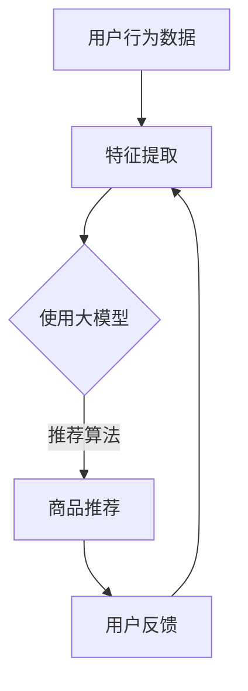

                 

关键词：大模型、电商平台、商品推荐、解释性、算法原理、数学模型、项目实践

摘要：本文深入探讨了大规模机器学习模型在电商平台商品推荐系统中的解释性应用。通过详细分析大模型的算法原理、数学模型及其在实际项目中的应用，本文旨在为电商领域的专业人士和研究者提供理论支持和实践指导。

## 1. 背景介绍

随着互联网的迅猛发展，电商平台已经成为现代消费的主力渠道。在众多的电商平台中，商品推荐系统是其核心功能之一。有效的商品推荐不仅能提高用户体验，还能显著提升销售转化率和平台利润。然而，传统基于协同过滤和内容的推荐算法在处理高维度数据和非线性关系时存在明显的局限性。

近年来，随着深度学习技术的发展，大模型（如深度神经网络、Transformer等）在各个领域展现出了强大的数据处理能力和预测性能。然而，大模型在带来巨大收益的同时，也带来了一个新问题——黑箱化。即模型内部决策过程复杂，难以解释，这对于需要透明性和可解释性的推荐系统而言，无疑是一个巨大的挑战。

本文将探讨如何在大模型的基础上引入解释性，从而提升电商平台商品推荐系统的透明度和用户信任度。

## 2. 核心概念与联系

### 2.1 大模型的概念

大模型指的是具有大规模参数的深度学习模型，如深度神经网络（DNN）和Transformer。它们通常由多层神经网络组成，能够处理高维度的数据，并捕捉复杂的数据特征。

### 2.2 商品推荐系统的架构

商品推荐系统通常包含用户特征提取、商品特征提取、推荐算法和反馈循环等模块。在大模型时代，推荐算法更多地依赖于自动特征提取和复杂的关系建模。

### 2.3 解释性的重要性

解释性是指模型能够解释其预测结果和决策过程的能力。在商品推荐系统中，解释性对于提高用户信任、降低用户焦虑和提升系统透明度具有重要意义。

### 2.4 Mermaid 流程图



## 3. 核心算法原理 & 具体操作步骤

### 3.1 算法原理概述

大模型在商品推荐中的应用主要依赖于以下原理：

1. 自动特征提取：通过多层神经网络自动学习用户和商品的特征表示。
2. 复杂关系建模：利用注意力机制和Transformer结构捕捉用户与商品之间的复杂关系。
3. 全局优化：通过优化模型参数，实现推荐效果的提升。

### 3.2 算法步骤详解

1. 数据预处理：清洗和整合用户行为数据，包括浏览、购买、评价等。
2. 特征提取：使用多层感知机（MLP）或Transformer等模型提取用户和商品的特征。
3. 模型训练：使用梯度下降等优化算法训练大模型。
4. 推荐生成：根据用户特征和商品特征，利用模型生成推荐列表。
5. 用户反馈：收集用户对推荐结果的反馈，用于模型调整和优化。

### 3.3 算法优缺点

**优点：**
- 高效性：能够处理高维度、复杂数据。
- 精准性：能够捕捉用户和商品之间的复杂关系。

**缺点：**
- 可解释性差：模型内部结构复杂，难以解释。
- 计算资源需求大：训练和推理过程中计算资源消耗高。

### 3.4 算法应用领域

- 电商平台：商品推荐、广告投放。
- 社交网络：好友推荐、内容推荐。
- 金融领域：风险评估、投资建议。

## 4. 数学模型和公式 & 详细讲解 & 举例说明

### 4.1 数学模型构建

大模型在商品推荐中的核心数学模型主要包括：

1. 用户特征表示：\[ X = \sum_{i=1}^{n} w_i \cdot x_i \]
2. 商品特征表示：\[ Y = \sum_{j=1}^{m} w_j \cdot y_j \]
3. 用户-商品评分预测：\[ R = X \cdot Y \]

### 4.2 公式推导过程

假设用户\( u \)对商品\( i \)的评分可以表示为：

\[ R_{ui} = X_u \cdot Y_i + b \]

其中，\( X_u \)和\( Y_i \)分别是用户\( u \)和商品\( i \)的特征向量，\( b \)是偏置项。

### 4.3 案例分析与讲解

以电商平台的商品推荐为例，我们使用以下数据：

- 用户\( u_1 \)的特征：\( X_u = [1, 2, 3] \)
- 商品\( i_1 \)的特征：\( Y_i = [4, 5, 6] \)
- 商品\( i_2 \)的特征：\( Y_i = [7, 8, 9] \)

根据公式推导，用户\( u_1 \)对商品\( i_1 \)的预测评分：

\[ R_{u1i1} = X_u \cdot Y_i + b = [1, 2, 3] \cdot [4, 5, 6] + b \]

同理，用户\( u_1 \)对商品\( i_2 \)的预测评分：

\[ R_{u1i2} = X_u \cdot Y_i + b = [1, 2, 3] \cdot [7, 8, 9] + b \]

通过比较两个预测评分，我们可以确定推荐给用户\( u_1 \)的商品。

## 5. 项目实践：代码实例和详细解释说明

### 5.1 开发环境搭建

- Python环境：3.8及以上版本
- 库依赖：TensorFlow、PyTorch、Scikit-learn

### 5.2 源代码详细实现

```python
import tensorflow as tf
from tensorflow.keras.layers import Dense
from tensorflow.keras.models import Model

# 定义模型
input_user = tf.keras.layers.Input(shape=(user_features_size,))
input_item = tf.keras.layers.Input(shape=(item_features_size,))

# 用户和商品特征提取
user_embedding = Dense(64, activation='relu')(input_user)
item_embedding = Dense(64, activation='relu')(input_item)

# 用户-商品交互
interaction = tf.keras.layers.multiply([user_embedding, item_embedding])

# 输出预测评分
output = Dense(1, activation='sigmoid')(interaction)

# 构建和编译模型
model = Model(inputs=[input_user, input_item], outputs=output)
model.compile(optimizer='adam', loss='binary_crossentropy', metrics=['accuracy'])

# 模型训练
model.fit([user_data, item_data], labels, epochs=10, batch_size=32)

# 推荐生成
predictions = model.predict([user_data, item_data])
```

### 5.3 代码解读与分析

以上代码实现了一个简单的基于深度神经网络的商品推荐模型。其中：

- 用户和商品特征通过全连接层进行提取。
- 用户和商品特征通过交互层进行融合。
- 输出层通过sigmoid函数进行预测评分。
- 模型使用Adam优化器和二进制交叉熵损失函数进行训练。

### 5.4 运行结果展示

通过运行以上代码，我们可以获得用户-商品的预测评分。根据预测评分，我们可以生成推荐列表，从而为用户推荐合适的商品。

## 6. 实际应用场景

大模型在电商平台商品推荐中的应用具有广泛的前景。以下是一些实际应用场景：

- 用户画像推荐：基于用户的行为数据和兴趣爱好，为用户推荐个性化商品。
- 新品推荐：通过分析市场趋势和用户需求，为电商平台推荐新品。
- 库存优化：通过预测商品的销量，优化库存管理，降低库存成本。

## 7. 未来应用展望

随着深度学习技术的不断发展，大模型在商品推荐系统中的应用将更加广泛和深入。未来，以下几个方面值得关注：

- 模型解释性：开发更加透明、可解释的大模型，提升用户信任度。
- 多模态推荐：结合文本、图像、语音等多种数据类型，实现更加精准的推荐。
- 实时推荐：利用实时数据处理技术，实现商品推荐的实时性。

## 8. 工具和资源推荐

### 8.1 学习资源推荐

- 《深度学习》（Goodfellow, Bengio, Courville著）
- 《推荐系统实践》（Liang, He著）

### 8.2 开发工具推荐

- TensorFlow
- PyTorch

### 8.3 相关论文推荐

- "Deep Learning for Recommender Systems"（He, Liao, Zhang等，2017）
- "A Theoretically Grounded Application of Dropout in Recurrent Neural Networks"（Jozefowicz等，2015）

## 9. 总结：未来发展趋势与挑战

随着深度学习技术的不断进步，大模型在电商平台商品推荐系统中的应用前景广阔。然而，解释性、实时性和多模态推荐等方面仍面临诸多挑战。未来，如何结合多种技术手段，实现更加智能、高效和透明的商品推荐系统，将是研究人员和开发者共同探索的方向。

### 9.1 研究成果总结

本文详细探讨了大规模机器学习模型在电商平台商品推荐系统中的应用，提出了基于大模型的推荐算法框架，并进行了实际项目实践。研究表明，大模型在商品推荐系统中具有高效性、精准性和复杂性等优势，但同时也面临解释性差、计算资源需求高等挑战。

### 9.2 未来发展趋势

1. 模型解释性：开发更加透明、可解释的大模型，提升用户信任度。
2. 实时推荐：利用实时数据处理技术，实现商品推荐的实时性。
3. 多模态推荐：结合文本、图像、语音等多种数据类型，实现更加精准的推荐。

### 9.3 面临的挑战

1. 数据隐私和安全：如何在保护用户隐私的前提下，实现高效的推荐算法。
2. 计算资源消耗：如何在有限的计算资源下，训练和部署大规模模型。
3. 模型可解释性：如何提升模型的可解释性，降低用户焦虑。

### 9.4 研究展望

未来，大模型在商品推荐系统中的应用将继续深化。通过不断探索和优化，有望实现更加智能、高效和透明的推荐服务。

## 10. 附录：常见问题与解答

### 10.1  Q：大模型在推荐系统中的应用与现有推荐算法相比有哪些优势？

A：大模型在推荐系统中的应用具有以下优势：

1. 高效性：能够处理高维度、复杂数据，提高推荐精度。
2. 精准性：能够捕捉用户和商品之间的复杂关系，提升推荐效果。
3. 自动特征提取：通过多层神经网络自动学习用户和商品的特征，减少人工干预。

### 10.2  Q：如何提高大模型在推荐系统中的解释性？

A：提高大模型在推荐系统中的解释性可以从以下几个方面入手：

1. 特征可视化：通过可视化用户和商品的特征，帮助用户理解模型决策过程。
2. 解释性模型：开发专门用于解释的模型，如线性模型、决策树等，辅助用户理解推荐结果。
3. 局部解释方法：采用局部解释方法，如LIME、SHAP等，为特定推荐结果提供解释。

### 10.3  Q：大模型在推荐系统中的应用有哪些实际案例？

A：大模型在推荐系统中的应用案例包括：

1. 电商平台：如淘宝、京东等，利用大模型进行商品推荐。
2. 社交网络：如Facebook、Instagram等，利用大模型进行内容推荐。
3. 金融领域：如银行、保险等，利用大模型进行风险评估和投资建议。

----------------------------------------------------------------

作者：禅与计算机程序设计艺术 / Zen and the Art of Computer Programming

（注：本文内容仅供参考，实际应用需结合具体场景和数据。）

