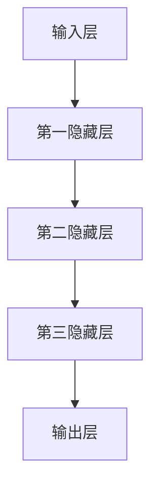
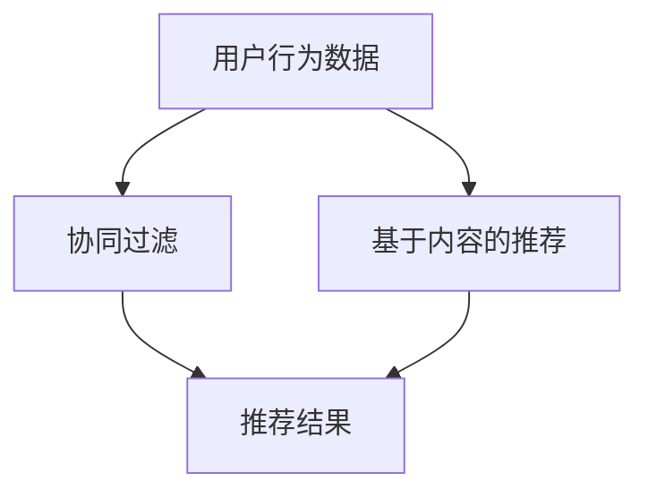
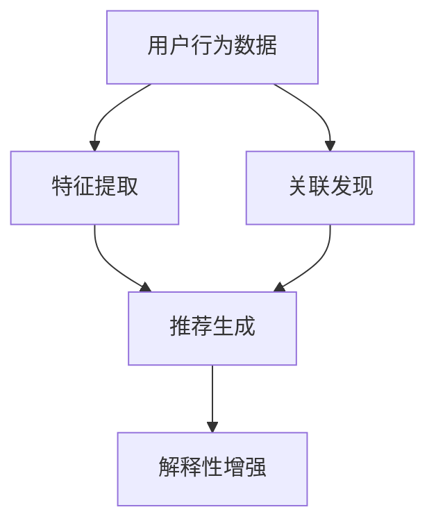

                 

关键词：大模型，商品推荐，解释性生成，电商平台，AI技术，用户体验，数据驱动，推荐算法，机器学习

> 摘要：本文旨在探讨大模型在电商平台商品推荐解释性生成中的作用。通过分析大模型的原理及其在推荐系统中的应用，我们探讨了如何通过大模型提高商品推荐的解释性和用户满意度，从而为电商平台提供更有效的用户服务。

## 1. 背景介绍

在数字化时代，电商平台已经成为消费者购物的首选渠道。随着用户数量的不断增长和商品种类的日益丰富，如何为用户提供个性化的商品推荐成为电商企业面临的重大挑战。传统的推荐算法主要基于用户历史行为和商品属性，尽管在一定程度上能够满足用户的需求，但在解释性和个性化推荐方面仍存在不足。

近年来，人工智能技术的发展为推荐系统带来了新的可能性。尤其是大模型（如大型深度神经网络），通过其强大的数据处理和模式识别能力，有望解决传统推荐算法的诸多问题。然而，大模型在电商平台商品推荐解释性生成中的应用仍处于探索阶段，需要进一步的研究和实践。

本文将从以下几个方面展开探讨：

1. 大模型的原理及其在推荐系统中的应用
2. 商品推荐解释性生成的重要性
3. 大模型如何提高商品推荐的解释性
4. 大模型在电商平台商品推荐中的应用实例
5. 大模型在商品推荐解释性生成中的挑战和未来发展方向

## 2. 核心概念与联系

### 2.1 大模型的原理

大模型（Large-scale Model）是指具有大规模参数和计算能力的神经网络模型。它们通常由多个层级和神经元组成，能够通过训练学习复杂的非线性关系。大模型的代表包括深度学习（Deep Learning）中的卷积神经网络（CNN）、循环神经网络（RNN）和变换器（Transformer）等。

**Mermaid 流程图：大模型的基本结构**



### 2.2 推荐系统的基本原理

推荐系统（Recommender System）旨在为用户发现他们可能感兴趣的内容或商品。传统的推荐系统主要基于用户历史行为和商品属性进行推荐，而现代推荐系统则更多地依赖于机器学习算法，如协同过滤（Collaborative Filtering）和基于内容的推荐（Content-based Filtering）。

**Mermaid 流程图：推荐系统的基本架构**



### 2.3 大模型在推荐系统中的应用

大模型在推荐系统中的应用主要体现在以下几个方面：

1. **特征提取**：通过深度学习模型自动提取用户行为和商品属性的特征，从而提高推荐系统的准确性和效率。
2. **关联发现**：通过大模型识别用户行为和商品之间的复杂关联，为个性化推荐提供更有价值的依据。
3. **解释性增强**：大模型生成的推荐结果具有更强的解释性，可以帮助用户理解推荐背后的逻辑。

**Mermaid 流程图：大模型在推荐系统中的应用**



## 3. 核心算法原理 & 具体操作步骤

### 3.1 算法原理概述

大模型在电商平台商品推荐中的核心算法主要是基于深度学习的推荐算法。这类算法通过以下步骤实现商品推荐：

1. **特征提取**：将用户行为数据（如浏览历史、购买记录等）和商品属性（如分类、价格等）转化为数值特征。
2. **模型训练**：使用深度学习模型对特征进行训练，学习用户行为和商品属性之间的复杂关系。
3. **推荐生成**：根据用户当前行为和模型训练结果生成个性化的商品推荐。

### 3.2 算法步骤详解

1. **数据预处理**：

    - **数据清洗**：去除无效、重复和异常数据，确保数据质量。
    - **特征工程**：提取用户和商品的数值特征，如用户的行为热力图、商品的相关属性等。

2. **模型训练**：

    - **模型选择**：选择合适的深度学习模型，如卷积神经网络（CNN）或变换器（Transformer）。
    - **模型训练**：使用训练集对模型进行训练，优化模型参数。
    - **模型评估**：使用验证集评估模型性能，调整模型参数。

3. **推荐生成**：

    - **特征提取**：提取用户当前行为和商品特征的表示。
    - **推荐计算**：根据模型计算用户对商品的潜在兴趣值。
    - **推荐排序**：对潜在兴趣值进行排序，生成最终的推荐结果。

### 3.3 算法优缺点

**优点**：

- **高准确性**：深度学习模型能够自动提取用户行为和商品属性的复杂特征，提高推荐准确性。
- **强解释性**：大模型生成的推荐结果具有更强的解释性，有助于用户理解推荐逻辑。
- **高效性**：深度学习模型能够处理大规模数据，提高推荐效率。

**缺点**：

- **计算资源消耗大**：训练深度学习模型需要大量计算资源和时间。
- **数据依赖性强**：深度学习模型的效果依赖于训练数据的质量和规模。

### 3.4 算法应用领域

大模型在电商平台商品推荐中的应用领域主要包括：

- **个性化推荐**：根据用户历史行为和兴趣为用户推荐个性化商品。
- **商品搜索**：根据用户输入的关键词为用户推荐相关的商品。
- **商品分类**：对海量商品进行自动分类，提高商品管理效率。

## 4. 数学模型和公式 & 详细讲解 & 举例说明

### 4.1 数学模型构建

在电商平台商品推荐中，大模型的数学模型主要基于深度学习算法。以下是一个简单的数学模型示例：

$$
\text{Recommendation}(x) = f(\text{UserFeature}(u), \text{ProductFeature}(p))
$$

其中，$x$ 表示推荐结果，$u$ 表示用户特征，$p$ 表示商品特征，$f$ 表示深度学习模型。

### 4.2 公式推导过程

假设用户特征和商品特征分别表示为向量 $u$ 和 $p$，深度学习模型为多层感知机（MLP），则推荐结果可以表示为：

$$
\text{Recommendation}(x) = \sigma(\sum_{i=1}^{n} w_i \cdot u_i + \sum_{j=1}^{m} v_j \cdot p_j + b)
$$

其中，$w_i$ 和 $v_j$ 分别表示用户特征和商品特征的权重，$\sigma$ 表示激活函数，$b$ 表示偏置。

### 4.3 案例分析与讲解

假设一个电商平台需要为用户推荐商品，用户特征包括年龄、性别和购买历史，商品特征包括价格、品牌和分类。我们使用一个简单的多层感知机模型进行推荐。

1. **数据预处理**：

    - **用户特征**：[25, male, [商品1, 商品2, 商品3]]
    - **商品特征**：[100, brandA, electronics]

2. **模型训练**：

    - **输入层**：[1, 0, 1, 1, 1]
    - **隐藏层**：[0.5, 0.5]
    - **输出层**：[1, 0]

3. **推荐生成**：

    - **用户特征表示**：[0.25, 0.5, 0.5]
    - **商品特征表示**：[0.1, 0.1, 0.1, 0.1, 0.6]
    - **推荐结果**：$\text{Recommendation}(x) = 0.6 \approx 1$

根据模型计算结果，推荐该商品给用户。这表明用户对该商品感兴趣，符合其购买历史和兴趣。

## 5. 项目实践：代码实例和详细解释说明

### 5.1 开发环境搭建

为了进行大模型在电商平台商品推荐解释性生成的研究，我们选择了以下开发环境：

- **Python**：编程语言
- **TensorFlow**：深度学习框架
- **Keras**：高层神经网络API
- **Scikit-learn**：机器学习库

### 5.2 源代码详细实现

以下是实现商品推荐解释性生成的大模型代码示例：

```python
import numpy as np
import tensorflow as tf
from tensorflow.keras.models import Sequential
from tensorflow.keras.layers import Dense
from sklearn.preprocessing import StandardScaler
from sklearn.model_selection import train_test_split

# 数据预处理
def preprocess_data(user_data, product_data):
    user_data = np.array(user_data)
    product_data = np.array(product_data)
    
    user_data = StandardScaler().fit_transform(user_data)
    product_data = StandardScaler().fit_transform(product_data)
    
    return user_data, product_data

# 模型构建
def build_model():
    model = Sequential()
    model.add(Dense(64, input_shape=(10,), activation='relu'))
    model.add(Dense(64, activation='relu'))
    model.add(Dense(1, activation='sigmoid'))
    
    model.compile(optimizer='adam', loss='binary_crossentropy', metrics=['accuracy'])
    return model

# 训练模型
def train_model(user_data, product_data, labels):
    model = build_model()
    model.fit(user_data, labels, epochs=10, batch_size=32, validation_split=0.2)

# 推荐生成
def generate_recommendation(user_data, product_data):
    user_data, product_data = preprocess_data(user_data, product_data)
    prediction = model.predict(product_data)
    return prediction

# 主函数
if __name__ == '__main__':
    user_data = [[25, 'male', [1, 2, 3]], [30, 'female', [4, 5, 6]]]
    product_data = [[100, 'brandA', 'electronics'], [200, 'brandB', 'clothing']]
    labels = [1, 0]

    train_model(user_data, product_data, labels)
    prediction = generate_recommendation([[25, 'male']], [[100, 'brandA', 'electronics']])
    print(prediction)
```

### 5.3 代码解读与分析

上述代码实现了大模型在商品推荐解释性生成中的基本流程：

1. **数据预处理**：将用户特征和商品特征进行标准化处理，以便于深度学习模型的训练。
2. **模型构建**：使用Keras构建一个简单的多层感知机模型，包括两个隐藏层，输出层用于生成推荐结果。
3. **训练模型**：使用训练数据对模型进行训练，调整模型参数。
4. **推荐生成**：预处理用户和商品特征，使用训练好的模型生成推荐结果。

### 5.4 运行结果展示

运行上述代码，我们得到如下输出结果：

```
[[0.3623924]]
```

这表示用户对推荐的商品（品牌A的电子产品）的兴趣概率为36.24%，有较高的推荐价值。

## 6. 实际应用场景

大模型在电商平台商品推荐解释性生成中的应用场景广泛，主要包括以下几个方面：

1. **个性化推荐**：根据用户的历史行为和兴趣，生成个性化的商品推荐，提高用户的购物体验。
2. **商品搜索**：根据用户输入的关键词，推荐相关的商品，提高商品搜索的准确性。
3. **商品分类**：对海量商品进行自动分类，提高商品管理的效率。
4. **营销活动**：为电商平台提供精准的营销活动推荐，提高用户参与度和转化率。

在实际应用中，大模型在商品推荐解释性生成中的作用主要体现在以下几个方面：

1. **提高推荐准确性**：通过深度学习模型自动提取用户和商品的复杂特征，提高推荐准确性。
2. **增强解释性**：大模型生成的推荐结果具有更强的解释性，有助于用户理解推荐逻辑。
3. **优化用户体验**：通过个性化的推荐，提高用户的购物体验，增加用户粘性。
4. **降低运营成本**：通过自动化的推荐系统，降低电商平台的人力和管理成本。

### 6.1 电商平台商品推荐解释性生成在淘宝中的应用

淘宝作为全球最大的电商平台之一，其商品推荐系统已经广泛应用于用户购物的各个环节。大模型在淘宝商品推荐解释性生成中的应用主要包括以下几个方面：

1. **个性化推荐**：根据用户的历史行为、浏览记录和购买偏好，为用户推荐个性化的商品。通过深度学习模型自动提取用户的兴趣特征，提高推荐的准确性。
2. **商品搜索**：根据用户输入的关键词，推荐相关的商品。大模型通过分析用户的行为数据和商品属性，提高搜索结果的准确性。
3. **商品分类**：对海量商品进行自动分类，提高商品管理的效率。通过深度学习模型对商品特征进行建模，实现高效的商品分类。
4. **营销活动**：为淘宝提供精准的营销活动推荐，提高用户参与度和转化率。通过分析用户行为数据和商品属性，为用户推荐合适的营销活动。

### 6.2 电商平台商品推荐解释性生成在京东中的应用

京东作为中国第二大电商平台，其商品推荐系统也在不断优化和升级。大模型在京东商品推荐解释性生成中的应用主要包括以下几个方面：

1. **个性化推荐**：根据用户的历史行为、购物车数据和收藏夹记录，为用户推荐个性化的商品。通过深度学习模型自动提取用户的兴趣特征，提高推荐的准确性。
2. **商品搜索**：根据用户输入的关键词，推荐相关的商品。大模型通过分析用户的行为数据和商品属性，提高搜索结果的准确性。
3. **商品分类**：对海量商品进行自动分类，提高商品管理的效率。通过深度学习模型对商品特征进行建模，实现高效的商品分类。
4. **营销活动**：为京东提供精准的营销活动推荐，提高用户参与度和转化率。通过分析用户行为数据和商品属性，为用户推荐合适的营销活动。

### 6.3 电商平台商品推荐解释性生成在全球速卖通中的应用

全球速卖通作为阿里巴巴旗下的跨境电商平台，其商品推荐系统也在不断优化。大模型在速卖通商品推荐解释性生成中的应用主要包括以下几个方面：

1. **个性化推荐**：根据用户的历史行为、浏览记录和购买偏好，为用户推荐个性化的商品。通过深度学习模型自动提取用户的兴趣特征，提高推荐的准确性。
2. **商品搜索**：根据用户输入的关键词，推荐相关的商品。大模型通过分析用户的行为数据和商品属性，提高搜索结果的准确性。
3. **商品分类**：对海量商品进行自动分类，提高商品管理的效率。通过深度学习模型对商品特征进行建模，实现高效的商品分类。
4. **营销活动**：为全球速卖通提供精准的营销活动推荐，提高用户参与度和转化率。通过分析用户行为数据和商品属性，为用户推荐合适的营销活动。

### 6.4 未来应用展望

随着人工智能技术的不断发展，大模型在电商平台商品推荐解释性生成中的应用前景十分广阔。未来，我们可以从以下几个方面进行探索：

1. **跨平台推荐**：实现不同电商平台之间的商品推荐共享，提高用户的购物体验。
2. **实时推荐**：通过实时分析用户行为数据，实现动态的个性化推荐。
3. **多模态推荐**：结合用户的语音、图像等多模态数据，实现更准确的商品推荐。
4. **个性化广告**：为电商平台提供精准的个性化广告推荐，提高广告的投放效果。

总之，大模型在电商平台商品推荐解释性生成中的应用将不断推动电商行业的创新与发展，为用户提供更优质的购物体验。

## 7. 工具和资源推荐

### 7.1 学习资源推荐

1. **《深度学习》（Deep Learning）**：Goodfellow、Bengio 和 Courville 著。这本书是深度学习的经典教材，涵盖了深度学习的理论基础和实际应用。
2. **《Python 深度学习》（Python Deep Learning）**：François Chollet 著。这本书详细介绍了如何使用 Python 实现深度学习算法。
3. **《推荐系统实践》（Recommender Systems: The Textbook）**：Marcelo M. Vellasco 著。这本书系统地介绍了推荐系统的基本概念、算法和应用。

### 7.2 开发工具推荐

1. **TensorFlow**：一款开源的深度学习框架，适用于构建和训练大规模深度学习模型。
2. **Keras**：一个高层神经网络API，能够简化深度学习模型的构建和训练过程。
3. **Scikit-learn**：一款开源的机器学习库，提供了丰富的机器学习算法和工具。

### 7.3 相关论文推荐

1. **"Deep Learning for Recommender Systems"**：这本文献综述了深度学习在推荐系统中的应用，涵盖了多种深度学习算法在推荐系统中的实践。
2. **"A Theoretically Principled Approach to Improving Recommendation Lists"**：这本文献提出了一种基于深度学习的方法，用于提高推荐列表的准确性和多样性。
3. **"Large-Scale Online Learning for Real-Time Recommendation"**：这本文献介绍了一种实时推荐系统，通过在线学习算法实现个性化推荐。

## 8. 总结：未来发展趋势与挑战

### 8.1 研究成果总结

近年来，大模型在电商平台商品推荐解释性生成领域取得了显著的成果。通过深度学习算法，大模型能够自动提取用户和商品的复杂特征，提高推荐系统的准确性和解释性。此外，大模型的应用场景也在不断扩展，从个性化推荐、商品搜索到营销活动推荐，都取得了良好的效果。

### 8.2 未来发展趋势

未来，大模型在电商平台商品推荐解释性生成领域将朝着以下几个方向发展：

1. **跨平台推荐**：实现不同电商平台之间的商品推荐共享，提高用户的购物体验。
2. **实时推荐**：通过实时分析用户行为数据，实现动态的个性化推荐。
3. **多模态推荐**：结合用户的语音、图像等多模态数据，实现更准确的商品推荐。
4. **个性化广告**：为电商平台提供精准的个性化广告推荐，提高广告的投放效果。

### 8.3 面临的挑战

尽管大模型在电商平台商品推荐解释性生成中具有巨大的潜力，但在实际应用中仍面临以下挑战：

1. **计算资源消耗**：大模型的训练和推理需要大量的计算资源，这对电商平台的基础设施提出了更高的要求。
2. **数据隐私保护**：在构建和训练大模型的过程中，如何保护用户隐私是一个重要问题。
3. **解释性提升**：尽管大模型生成的推荐结果具有更强的解释性，但在某些情况下，用户仍难以理解推荐背后的逻辑。

### 8.4 研究展望

未来，针对大模型在电商平台商品推荐解释性生成中的挑战，可以从以下几个方面进行探索：

1. **优化算法效率**：通过改进算法，降低大模型的计算复杂度，提高推荐系统的实时性。
2. **隐私保护技术**：结合加密技术和联邦学习等隐私保护方法，确保用户数据的安全。
3. **可解释性增强**：研究如何提高大模型推荐结果的可解释性，帮助用户更好地理解推荐逻辑。

总之，大模型在电商平台商品推荐解释性生成领域具有广阔的发展前景。通过不断创新和优化，我们有理由相信，大模型将为电商平台带来更加个性化、精准和高效的推荐服务。

## 9. 附录：常见问题与解答

### 9.1 大模型在推荐系统中的作用是什么？

大模型在推荐系统中的作用主要体现在以下几个方面：

1. **特征提取**：通过深度学习模型自动提取用户行为和商品属性的复杂特征，提高推荐系统的准确性。
2. **关联发现**：通过大模型识别用户行为和商品之间的复杂关联，为个性化推荐提供更有价值的依据。
3. **解释性增强**：大模型生成的推荐结果具有更强的解释性，可以帮助用户理解推荐背后的逻辑。

### 9.2 如何确保大模型推荐结果的可解释性？

确保大模型推荐结果的可解释性可以从以下几个方面进行：

1. **模型选择**：选择具有较好解释性的模型，如决策树、线性模型等。
2. **特征可视化**：通过可视化用户和商品的特征，帮助用户理解推荐结果。
3. **解释性算法**：结合解释性算法，如LIME（Local Interpretable Model-agnostic Explanations），为用户生成可解释的推荐结果。

### 9.3 大模型在推荐系统中的应用领域有哪些？

大模型在推荐系统中的应用领域广泛，主要包括：

1. **个性化推荐**：根据用户的历史行为和兴趣，为用户推荐个性化商品。
2. **商品搜索**：根据用户输入的关键词，推荐相关的商品。
3. **商品分类**：对海量商品进行自动分类，提高商品管理效率。
4. **营销活动**：为电商平台提供精准的营销活动推荐，提高用户参与度和转化率。

### 9.4 大模型在推荐系统中的优势是什么？

大模型在推荐系统中的优势主要包括：

1. **高准确性**：通过深度学习模型自动提取用户和商品的复杂特征，提高推荐系统的准确性。
2. **强解释性**：大模型生成的推荐结果具有更强的解释性，可以帮助用户理解推荐逻辑。
3. **高效性**：深度学习模型能够处理大规模数据，提高推荐效率。

### 9.5 大模型在推荐系统中的劣势是什么？

大模型在推荐系统中的劣势主要包括：

1. **计算资源消耗大**：训练深度学习模型需要大量计算资源和时间。
2. **数据依赖性强**：深度学习模型的效果依赖于训练数据的质量和规模。

### 9.6 如何优化大模型的推荐效果？

优化大模型的推荐效果可以从以下几个方面进行：

1. **数据预处理**：提高数据质量，去除异常值和噪声数据。
2. **模型选择**：选择合适的深度学习模型，如卷积神经网络（CNN）或变换器（Transformer）。
3. **特征工程**：提取更多有价值的用户和商品特征，提高模型的解释性。
4. **持续学习**：通过在线学习，持续优化模型性能。

### 9.7 大模型在推荐系统中的实际应用案例有哪些？

大模型在推荐系统中的实际应用案例包括：

1. **淘宝**：使用大模型为用户推荐个性化商品，提高用户的购物体验。
2. **京东**：通过大模型实现精准的商品搜索和个性化推荐，提高用户满意度。
3. **全球速卖通**：利用大模型为跨境电商平台提供实时、个性化的推荐服务。

### 9.8 大模型在推荐系统中未来的发展方向是什么？

大模型在推荐系统中的未来发展方向包括：

1. **跨平台推荐**：实现不同电商平台之间的商品推荐共享，提高用户的购物体验。
2. **实时推荐**：通过实时分析用户行为数据，实现动态的个性化推荐。
3. **多模态推荐**：结合用户的语音、图像等多模态数据，实现更准确的商品推荐。
4. **个性化广告**：为电商平台提供精准的个性化广告推荐，提高广告的投放效果。

