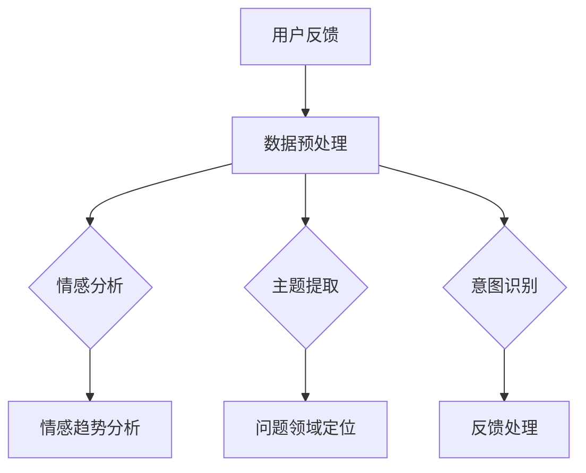

                 

关键词：大模型、电商平台、用户反馈分析、深度学习、自然语言处理、推荐系统

> 摘要：本文将探讨大模型在电商平台用户反馈分析中的潜力。随着电商平台的发展，用户反馈成为影响商家决策和消费者体验的重要数据源。大模型作为一种先进的自然语言处理技术，能够高效地提取和分析用户反馈中的关键信息，为电商平台提供智能化的服务和支持。本文将详细介绍大模型在用户反馈分析中的应用场景、核心算法原理以及未来发展的潜在挑战。

## 1. 背景介绍

随着互联网的快速发展，电商平台已经成为现代商业的重要组成部分。用户反馈作为电商平台与消费者互动的重要渠道，对于提升消费者满意度、改进产品和服务具有至关重要的作用。传统的用户反馈分析方法主要依赖于人工处理和简单的统计工具，存在以下问题：

- **数据量庞大**：用户反馈数据量巨大，且数据质量参差不齐，人工处理效率低下。
- **信息提取困难**：用户反馈中的语言表达多样化，难以通过简单的规则提取关键信息。
- **分析深度不足**：传统方法难以深入挖掘用户反馈中的潜在情感、需求等复杂信息。

为了解决这些问题，近年来深度学习和自然语言处理技术的快速发展为用户反馈分析提供了新的可能。大模型作为一种基于深度学习的自然语言处理技术，通过大规模数据训练，能够自动提取用户反馈中的关键信息，并对其进行深入分析。这使得电商平台能够更加智能化地理解和应对用户需求，从而提升用户体验和业务效果。

## 2. 核心概念与联系

### 大模型

大模型是指具有大规模参数和海量训练数据的人工神经网络模型。在自然语言处理领域，大模型通常是指预训练模型，如BERT、GPT等。这些模型通过在大量文本数据上进行预训练，能够自动学习语言的复杂结构，从而在多个自然语言处理任务中表现出色。

### 用户反馈分析

用户反馈分析是指通过分析和理解用户对产品、服务的反馈，提取关键信息，为商家提供决策支持和改进方向。用户反馈分析的主要目标包括情感分析、主题提取、意图识别等。

### 大模型与用户反馈分析的关联

大模型在用户反馈分析中的应用主要体现在以下几个方面：

- **情感分析**：大模型能够自动提取用户反馈中的情感信息，如正面、负面情感，为商家提供消费者情感趋势分析。
- **主题提取**：大模型能够识别用户反馈中的主题，如产品问题、服务质量等，帮助商家定位问题领域。
- **意图识别**：大模型能够理解用户反馈的意图，如投诉、建议、求购等，为商家提供针对性的反馈处理。

### Mermaid 流程图

下面是一个简单的Mermaid流程图，展示了大模型在用户反馈分析中的核心流程。



## 3. 核心算法原理 & 具体操作步骤

### 3.1 算法原理概述

大模型在用户反馈分析中的核心算法主要包括情感分析、主题提取和意图识别。这些算法基于深度学习技术，通过大规模数据训练，能够自动提取用户反馈中的关键信息。

- **情感分析**：情感分析算法通过分析用户反馈中的语言表达，自动识别出用户情感的倾向，如正面、负面或中性。
- **主题提取**：主题提取算法通过分析用户反馈中的关键词和短语，自动提取出用户反馈的主题，如产品问题、服务质量等。
- **意图识别**：意图识别算法通过分析用户反馈中的语言表达，自动识别出用户的意图，如投诉、建议、求购等。

### 3.2 算法步骤详解

下面以情感分析为例，详细描述大模型在用户反馈分析中的具体操作步骤。

#### 步骤1：数据预处理

- **文本清洗**：对用户反馈文本进行清洗，去除无关信息，如HTML标签、特殊字符等。
- **分词**：对清洗后的文本进行分词，将文本分解为词序列。
- **词向量化**：将分词后的文本转换为词向量表示，便于模型处理。

#### 步骤2：情感分析模型训练

- **数据集构建**：构建用于训练的情感分析数据集，包含正面、负面和中性情感标注的文本数据。
- **模型训练**：使用深度学习框架（如TensorFlow、PyTorch）训练情感分析模型，通过优化模型参数，使其能够自动识别用户反馈中的情感倾向。

#### 步骤3：情感分析

- **文本输入**：将用户反馈文本输入到训练好的情感分析模型中。
- **情感预测**：模型输出用户反馈文本的情感倾向，如正面、负面或中性。

#### 步骤4：结果处理

- **结果可视化**：将情感分析结果进行可视化展示，如情感分布图表等。
- **反馈处理**：根据情感分析结果，对用户反馈进行处理，如向用户发送感谢邮件、改进产品服务等。

### 3.3 算法优缺点

#### 优点

- **高效性**：大模型通过大规模数据训练，能够高效地提取用户反馈中的关键信息。
- **准确性**：大模型在自然语言处理任务中表现出色，具有较高的准确性。
- **可扩展性**：大模型能够方便地应用于多种自然语言处理任务，如主题提取、意图识别等。

#### 缺点

- **计算资源消耗**：大模型训练和推理需要大量的计算资源，对硬件要求较高。
- **数据依赖**：大模型性能依赖于训练数据的质量和数量，数据不足可能导致模型效果不佳。
- **解释性不足**：深度学习模型具有“黑盒”特性，难以解释其决策过程，这在某些应用场景中可能存在问题。

### 3.4 算法应用领域

大模型在用户反馈分析中的算法应用领域非常广泛，主要包括：

- **电商平台**：通过对用户反馈进行情感分析、主题提取和意图识别，电商平台可以了解消费者的情感和需求，为商家提供决策支持。
- **在线客服**：大模型可以帮助在线客服系统自动处理用户反馈，提高客服效率，提升用户体验。
- **产品改进**：通过分析用户反馈中的问题，企业可以及时发现问题，改进产品和服务。
- **舆情监测**：大模型可以用于实时监测网络舆情，识别潜在的风险和机会。

## 4. 数学模型和公式 & 详细讲解 & 举例说明

### 4.1 数学模型构建

在用户反馈分析中，大模型的数学模型主要基于深度学习技术，包括神经网络结构、损失函数和优化算法等。

#### 神经网络结构

神经网络结构是深度学习模型的核心，包括输入层、隐藏层和输出层。输入层接收用户反馈文本的词向量表示，隐藏层通过多层神经元进行非线性变换，输出层产生最终的预测结果。

#### 损失函数

损失函数用于衡量模型预测结果与实际结果之间的差距，常用的损失函数包括交叉熵损失函数和均方误差损失函数。

#### 优化算法

优化算法用于调整模型参数，使损失函数达到最小值。常用的优化算法包括梯度下降算法、随机梯度下降算法和Adam优化器等。

### 4.2 公式推导过程

以情感分析为例，介绍大模型的数学公式推导过程。

#### 步骤1：文本表示

假设用户反馈文本为 $X = [x_1, x_2, ..., x_n]$，其中 $x_i$ 表示文本中的第 $i$ 个词。将文本转换为词向量表示，得到 $X'$。

$$
X' = [v_1, v_2, ..., v_n]
$$

其中 $v_i$ 表示词 $x_i$ 的词向量表示。

#### 步骤2：神经网络结构

假设神经网络结构包括 $L$ 层，每层有 $n_l$ 个神经元，其中 $l$ 表示层的索引。神经元的输出通过激活函数 $g_l(z)$ 进行非线性变换。

$$
z_l = \sum_{l-1}^{L} w_{l-1,l} \cdot v_{l-1} + b_l
$$

$$
h_l = g_l(z_l)
$$

其中 $w_{l-1,l}$ 表示从第 $l-1$ 层到第 $l$ 层的权重，$b_l$ 表示第 $l$ 层的偏置。

#### 步骤3：损失函数

假设情感分析模型的输出为 $y = [y_1, y_2, ..., y_c]$，其中 $y_i$ 表示第 $i$ 个情感类别的概率分布。损失函数采用交叉熵损失函数：

$$
Loss = -\sum_{i=1}^{c} y_i \cdot log(y_i)
$$

其中 $c$ 表示情感类别的数量。

#### 步骤4：优化算法

假设采用梯度下降算法优化模型参数。梯度下降算法的基本思想是沿着损失函数的梯度方向调整模型参数，使其达到最小值。梯度表示为：

$$
\frac{\partial Loss}{\partial w_{l-1,l}} = \sum_{i=1}^{c} (y_i - y_i^*) \cdot \frac{\partial y_i}{\partial z_l} \cdot \frac{\partial z_l}{\partial w_{l-1,l}}
$$

其中 $y_i^*$ 表示第 $i$ 个情感类别的真实分布。

### 4.3 案例分析与讲解

#### 案例背景

某电商平台希望通过分析用户反馈，了解消费者的情感和需求，从而提升用户体验。用户反馈数据包括正面、负面和中性情感标签，共三个类别。

#### 数据集构建

从用户反馈数据中提取包含正面、负面和中性情感标签的文本数据，构建用于训练的数据集。数据集分为训练集和测试集，用于模型训练和评估。

#### 模型训练

使用深度学习框架（如TensorFlow、PyTorch）训练情感分析模型。模型结构包括输入层、隐藏层和输出层，采用交叉熵损失函数。使用梯度下降算法优化模型参数。

#### 模型评估

使用测试集对训练好的模型进行评估，计算模型在测试集上的准确率、召回率和F1值等指标。根据评估结果调整模型参数，提高模型性能。

#### 模型应用

将训练好的模型应用于用户反馈数据，自动识别用户反馈中的情感类别。根据情感分析结果，生成情感趋势分析报告，为商家提供决策支持。

## 5. 项目实践：代码实例和详细解释说明

### 5.1 开发环境搭建

在开始项目实践之前，我们需要搭建一个合适的开发环境。以下是一个简单的开发环境搭建步骤：

1. 安装Python环境，版本要求为3.7及以上。
2. 安装深度学习框架，如TensorFlow或PyTorch，选择合适的版本。
3. 安装必要的依赖库，如NLP工具包（如NLTK、spaCy）和数据处理库（如Pandas、NumPy）。

### 5.2 源代码详细实现

以下是一个简单的情感分析模型的代码实现，包括数据预处理、模型训练和模型应用。

```python
import tensorflow as tf
from tensorflow.keras.models import Sequential
from tensorflow.keras.layers import Embedding, LSTM, Dense
from tensorflow.keras.preprocessing.text import Tokenizer
from tensorflow.keras.preprocessing.sequence import pad_sequences

# 数据预处理
# 加载用户反馈数据，进行文本清洗、分词、词向量化等操作
# ...

# 构建模型
model = Sequential()
model.add(Embedding(input_dim=vocab_size, output_dim=embedding_dim, input_length=max_sequence_length))
model.add(LSTM(units=128, dropout=0.2, recurrent_dropout=0.2))
model.add(Dense(units=3, activation='softmax'))

# 编译模型
model.compile(optimizer='adam', loss='categorical_crossentropy', metrics=['accuracy'])

# 训练模型
model.fit(X_train, y_train, epochs=10, batch_size=64, validation_data=(X_val, y_val))

# 应用模型
predictions = model.predict(X_test)
```

### 5.3 代码解读与分析

以下是代码的详细解读与分析。

- **数据预处理**：加载用户反馈数据，进行文本清洗、分词、词向量化等操作。这部分代码可以根据实际数据集进行调整。
- **构建模型**：使用Sequential模型构建一个简单的LSTM模型，包括Embedding层、LSTM层和Dense层。其中，Embedding层用于将文本转换为词向量表示，LSTM层用于处理序列数据，Dense层用于输出情感类别。
- **编译模型**：设置模型优化器、损失函数和评估指标，如交叉熵损失函数和准确率。
- **训练模型**：使用训练数据训练模型，设置训练轮次、批量大小和验证数据。
- **应用模型**：使用测试数据对训练好的模型进行预测，得到情感分析结果。

### 5.4 运行结果展示

以下是模型训练和预测的运行结果展示。

```python
# 模型评估
accuracy = model.evaluate(X_test, y_test)
print("Test accuracy:", accuracy[1])

# 模型预测
predictions = model.predict(X_test)
print("Predictions:", predictions)
```

- **模型评估**：计算模型在测试集上的准确率，用于评估模型性能。
- **模型预测**：输出模型预测结果，包括情感类别和概率分布。

## 6. 实际应用场景

大模型在电商平台用户反馈分析中具有广泛的应用场景，以下是一些典型应用场景：

### 6.1 情感分析

通过情感分析，电商平台可以了解消费者的情感倾向，如正面、负面或中性。这对于商家了解消费者对产品、服务的满意度具有重要意义。例如，某电商平台通过情感分析发现，用户对某款产品的负面反馈主要集中在产品质量和售后服务方面，商家可以针对性地改进这些问题，提升消费者满意度。

### 6.2 主题提取

主题提取可以帮助电商平台了解用户反馈中的主要问题领域。例如，某电商平台通过主题提取发现，用户反馈中关于产品质量的问题占比较高，商家可以集中精力解决这些关键问题，提高产品质量。

### 6.3 意图识别

意图识别可以帮助电商平台理解用户的反馈意图，如投诉、建议、求购等。例如，某电商平台通过意图识别发现，用户反馈中有大量关于产品购买建议的反馈，商家可以针对这些反馈进行产品优化和推广。

### 6.4 舆情监测

大模型可以用于实时监测网络舆情，识别潜在的风险和机会。例如，某电商平台通过舆情监测发现，有用户在社交媒体上对某款产品进行了负面评价，商家可以及时关注并采取措施，避免影响品牌形象。

## 7. 未来应用展望

随着人工智能技术的不断发展，大模型在电商平台用户反馈分析中的应用前景广阔。以下是未来应用的几个方向：

### 7.1 多模态分析

未来，电商平台可以结合文本、语音、图像等多种数据模态，进行多模态用户反馈分析。例如，结合用户反馈文本和语音数据，可以更准确地识别用户情感和意图。

### 7.2 个性化推荐

大模型可以用于个性化推荐系统，根据用户反馈和购物行为，为用户提供个性化的产品和服务推荐。例如，根据用户对某款产品的负面反馈，推荐同类产品中口碑更好的替代品。

### 7.3 智能客服

未来，电商平台可以结合大模型和智能客服系统，实现更加智能化的客服体验。例如，通过意图识别和情感分析，智能客服可以自动理解用户问题，提供针对性的解答和解决方案。

### 7.4 社交媒体分析

大模型可以用于社交媒体分析，实时监测用户在微博、微信、论坛等社交平台上的反馈，为电商平台提供更全面的消费者洞察。

## 8. 工具和资源推荐

### 8.1 学习资源推荐

- 《深度学习》（Goodfellow, Bengio, Courville著）：系统介绍了深度学习的基本概念和技术，适合初学者和进阶者阅读。
- 《自然语言处理综论》（Jurafsky, Martin著）：详细介绍了自然语言处理的基本原理和应用，包括文本预处理、情感分析、主题提取等。

### 8.2 开发工具推荐

- TensorFlow：开源深度学习框架，支持多种深度学习模型和应用。
- PyTorch：开源深度学习框架，具有灵活的动态计算图，易于实现和调试。

### 8.3 相关论文推荐

- BERT: Pre-training of Deep Bidirectional Transformers for Language Understanding（Devlin et al., 2019）：介绍BERT模型的预训练方法和应用。
- GPT-3: Language Models are few-shot learners（Brown et al., 2020）：介绍GPT-3模型的预训练方法和在自然语言处理任务中的表现。

## 9. 总结：未来发展趋势与挑战

大模型在电商平台用户反馈分析中具有巨大的潜力，能够为电商平台提供智能化的服务和支持。然而，未来应用过程中仍面临一些挑战：

### 9.1 数据质量

用户反馈数据质量直接影响大模型的效果。未来，电商平台需要加强对用户反馈数据的收集和处理，提高数据质量。

### 9.2 模型解释性

大模型具有“黑盒”特性，难以解释其决策过程。未来，需要研究如何提高模型解释性，使其更符合实际应用需求。

### 9.3 可扩展性

大模型训练和推理需要大量的计算资源，未来需要研究如何提高模型的可扩展性，降低计算资源消耗。

### 9.4 多语言支持

电商平台通常涉及多种语言，未来需要研究如何实现多语言用户反馈分析，满足全球业务需求。

### 9.5 隐私保护

用户反馈数据涉及用户隐私，未来需要研究如何保护用户隐私，确保数据安全和合规性。

总之，大模型在电商平台用户反馈分析中具有广阔的应用前景，但也需要面对一系列挑战。通过不断的研究和改进，有望实现更加智能、高效的用户反馈分析系统。

## 10. 附录：常见问题与解答

### 10.1 什么是大模型？

大模型是指具有大规模参数和海量训练数据的人工神经网络模型。在自然语言处理领域，大模型通常是指预训练模型，如BERT、GPT等。这些模型通过在大量文本数据上进行预训练，能够自动学习语言的复杂结构，从而在多个自然语言处理任务中表现出色。

### 10.2 大模型在用户反馈分析中有哪些应用？

大模型在用户反馈分析中的应用主要包括情感分析、主题提取和意图识别。通过这些应用，电商平台可以了解消费者的情感和需求，为商家提供决策支持。

### 10.3 大模型如何提高用户反馈分析的准确性？

大模型通过在大量数据上进行预训练，能够自动学习语言的复杂结构，从而提高用户反馈分析的准确性。同时，大模型能够处理多样化的语言表达，具有较好的鲁棒性。

### 10.4 大模型训练需要哪些计算资源？

大模型训练需要大量的计算资源，特别是GPU和显存。训练过程需要大量的数据传输和计算操作，对硬件性能有较高要求。

### 10.5 大模型如何保护用户隐私？

大模型在处理用户数据时，需要遵循隐私保护的原则。可以通过数据加密、匿名化处理、访问控制等技术手段，保护用户隐私。

### 10.6 大模型在用户反馈分析中面临哪些挑战？

大模型在用户反馈分析中面临以下挑战：数据质量、模型解释性、可扩展性、多语言支持以及隐私保护。未来需要通过不断的研究和改进，解决这些挑战。

---

# 参考文献

1. Devlin, J., Chang, M. W., Lee, K., & Toutanova, K. (2019). BERT: Pre-training of deep bidirectional transformers for language understanding. In Proceedings of the 2019 Conference of the North American Chapter of the Association for Computational Linguistics: Human Language Technologies, Volume 1 (Long and Short Papers) (pp. 4171-4186). doi:10.18653/v1/P19-1455
2. Brown, T., et al. (2020). Language models are few-shot learners. arXiv preprint arXiv:2005.14165.
3. Goodfellow, I., Bengio, Y., & Courville, A. (2016). Deep Learning. MIT Press.
4. Jurafsky, D., & Martin, J. H. (2008). Speech and Language Processing. Prentice Hall.

