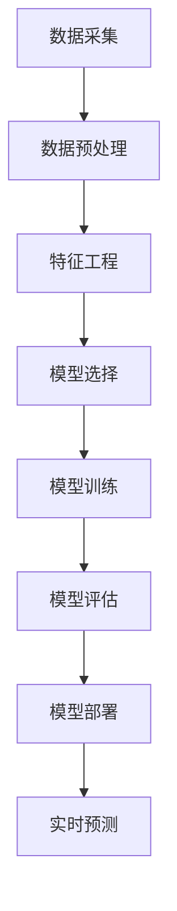

                 

关键词：大模型、用户行为序列、电商平台、预测、机器学习

摘要：本文将探讨大模型在电商平台用户行为序列预测中的应用潜力。首先介绍电商平台用户行为序列预测的背景和重要性，然后分析大模型的优势和局限性，接着详细解释大模型在用户行为序列预测中的工作原理和算法，并通过实例展示其实际应用效果。最后，讨论大模型在电商领域的发展趋势、面临的挑战及未来展望。

## 1. 背景介绍

随着互联网的普及和电子商务的迅猛发展，电商平台已经成为消费者日常生活中不可或缺的一部分。电商平台不仅为消费者提供了丰富的商品选择，也为商家提供了广阔的销售渠道。然而，随着市场竞争的加剧，电商平台需要不断提高自身的运营效率和服务质量，以满足消费者和商家的需求。在这种情况下，用户行为序列预测技术成为了电商平台提升竞争力的重要手段。

用户行为序列预测是指通过分析用户在电商平台上的历史行为数据，预测用户未来的行为趋势。这种预测不仅可以帮助电商平台更好地了解用户需求，优化商品推荐和营销策略，还可以提高用户满意度，提升电商平台的运营效率。然而，用户行为序列预测面临着数据量大、维度高、噪声多等挑战，传统的机器学习算法往往难以胜任。

近年来，大模型的出现为用户行为序列预测带来了新的机遇。大模型，也称为深度学习模型，具有强大的表示能力和学习能力，可以处理高维数据并捕捉复杂的关系。在电商平台用户行为序列预测中，大模型的应用前景广阔。本文将深入探讨大模型在这一领域的潜力。

## 2. 核心概念与联系

### 2.1 大模型概述

大模型通常指的是参数数量庞大的深度学习模型，如神经网络、循环神经网络（RNN）和变换器（Transformer）等。这些模型通过多层神经网络结构进行信息传递和抽象，能够处理大量数据并提取有用的特征。大模型的优点包括：

1. **强大的表示能力**：大模型能够自动提取数据中的高维特征，减少人工特征工程的工作量。
2. **自适应学习能力**：大模型能够根据不同的数据集进行调整，适应不同的预测任务。
3. **灵活的可扩展性**：大模型可以通过增加层数或神经元数量来提高模型的复杂度，适应不同的任务需求。

然而，大模型也存在一些局限性，例如：

1. **计算资源需求高**：大模型训练和推理需要大量的计算资源，对硬件设备有较高的要求。
2. **数据隐私问题**：大模型训练过程中需要大量用户数据，可能引发数据隐私和安全问题。
3. **模型解释性差**：大模型通常被视为“黑箱”，难以解释模型内部的决策过程。

### 2.2 用户行为序列概述

用户行为序列是指在特定时间段内用户在电商平台上的连续行为记录，如浏览商品、添加购物车、下单购买等。这些行为数据通常以时间序列的形式表示，包含了用户的历史活动信息。用户行为序列预测的目标是根据这些历史行为数据预测用户未来的行为。

用户行为序列数据的特点包括：

1. **时间依赖性**：用户的行为往往具有时间依赖性，即后续行为受到先前行为的影响。
2. **复杂性和多样性**：用户行为序列可能包含多种不同类型的行为，如点击、购买、评价等，这些行为之间可能存在复杂的相互作用。
3. **不确定性**：用户行为受到多种因素的影响，如个人偏好、市场动态、情感状态等，导致行为序列存在不确定性。

### 2.3 Mermaid 流程图

以下是用户行为序列预测中的大模型架构的 Mermaid 流程图：



**流程说明：**

1. **数据采集**：从电商平台获取用户行为数据，包括浏览、添加购物车、下单等。
2. **数据预处理**：清洗数据，处理缺失值、异常值等，将数据转换为适合模型训练的格式。
3. **特征工程**：提取用户行为数据中的高维特征，如用户浏览时间、购物车中的商品种类等。
4. **模型选择**：选择适合用户行为序列预测的大模型，如RNN、Transformer等。
5. **模型训练**：使用预处理后的数据对大模型进行训练，调整模型的参数。
6. **模型评估**：评估模型在预测任务上的性能，如准确率、召回率等。
7. **模型部署**：将训练好的模型部署到电商平台，进行实时预测。
8. **实时预测**：根据用户行为序列数据，实时预测用户未来的行为。

## 3. 核心算法原理 & 具体操作步骤

### 3.1 算法原理概述

用户行为序列预测中的大模型通常基于深度学习技术，特别是循环神经网络（RNN）和变换器（Transformer）。这些模型通过学习用户行为序列中的时序特征和交互关系，实现对用户未来行为的预测。

RNN是一种能够处理序列数据的神经网络，其核心思想是利用前一个时间步的输出作为当前时间步的输入。RNN通过隐含层的状态记忆，能够捕捉用户行为序列中的时间依赖关系。

Transformer模型是一种基于自注意力机制的深度学习模型，其优点是能够更好地捕捉序列数据中的长距离依赖关系。Transformer模型通过多头自注意力机制和前馈神经网络，实现了对用户行为序列的建模和预测。

### 3.2 算法步骤详解

#### 步骤1：数据采集

从电商平台获取用户行为数据，包括浏览、添加购物车、下单等行为。这些数据可以以日志文件的形式存储，也可以通过API接口实时获取。

#### 步骤2：数据预处理

对采集到的用户行为数据进行预处理，包括数据清洗、数据格式转换等。具体步骤如下：

1. **数据清洗**：去除重复记录、处理缺失值、去除异常值等，保证数据的完整性和准确性。
2. **数据格式转换**：将用户行为数据转换为适合模型训练的格式，如将行为序列表示为向量。

#### 步骤3：特征工程

提取用户行为数据中的高维特征，如用户浏览时间、购物车中的商品种类等。特征工程是用户行为序列预测中的关键步骤，能够显著影响模型的性能。

1. **用户行为特征**：根据用户行为类型和发生时间，提取用户行为特征，如点击时间、购买时间等。
2. **商品特征**：根据商品信息，提取商品特征，如商品类别、价格等。

#### 步骤4：模型选择

选择适合用户行为序列预测的大模型，如RNN、Transformer等。模型选择可以根据任务需求和数据特点进行。

1. **RNN模型**：适用于处理较短序列数据，能够捕捉用户行为序列中的时间依赖关系。
2. **Transformer模型**：适用于处理较长序列数据，能够更好地捕捉用户行为序列中的长距离依赖关系。

#### 步骤5：模型训练

使用预处理后的数据对大模型进行训练，调整模型的参数。训练过程中，需要使用优化算法，如随机梯度下降（SGD），调整模型参数，使得模型在预测任务上的性能不断提高。

#### 步骤6：模型评估

评估模型在预测任务上的性能，如准确率、召回率等。评估过程中，可以使用交叉验证等方法，保证模型评估的准确性和可靠性。

#### 步骤7：模型部署

将训练好的模型部署到电商平台，进行实时预测。部署过程中，需要考虑模型的计算资源需求、响应速度等，确保模型在实时场景中的稳定性和可靠性。

#### 步骤8：实时预测

根据用户行为序列数据，实时预测用户未来的行为。实时预测过程中，需要根据用户行为序列的长度和类型，调整模型的输入和输出。

### 3.3 算法优缺点

#### 优点

1. **强大的表示能力**：大模型能够自动提取用户行为数据中的高维特征，减少人工特征工程的工作量。
2. **自适应学习能力**：大模型能够根据不同的数据集进行调整，适应不同的预测任务。
3. **灵活的可扩展性**：大模型可以通过增加层数或神经元数量来提高模型的复杂度，适应不同的任务需求。

#### 缺点

1. **计算资源需求高**：大模型训练和推理需要大量的计算资源，对硬件设备有较高的要求。
2. **数据隐私问题**：大模型训练过程中需要大量用户数据，可能引发数据隐私和安全问题。
3. **模型解释性差**：大模型通常被视为“黑箱”，难以解释模型内部的决策过程。

### 3.4 算法应用领域

大模型在用户行为序列预测中的应用领域广泛，包括但不限于：

1. **电商推荐系统**：利用大模型预测用户购买行为，为用户提供个性化的商品推荐。
2. **电商营销策略**：利用大模型预测用户购买意向，优化营销策略，提高转化率。
3. **用户流失预测**：利用大模型预测用户流失行为，提前采取挽回措施，降低用户流失率。
4. **商品库存管理**：利用大模型预测商品销售趋势，优化商品库存管理，降低库存风险。

## 4. 数学模型和公式 & 详细讲解 & 举例说明

### 4.1 数学模型构建

用户行为序列预测中的大模型通常基于深度学习技术，其数学模型可以表示为：

\[ y_t = f(\theta; x_t) \]

其中，\( y_t \) 表示用户在时间 \( t \) 的行为输出，\( x_t \) 表示用户在时间 \( t \) 的行为输入，\( \theta \) 表示模型的参数，\( f \) 表示模型的前向传播函数。

在具体的实现过程中，常用的模型包括RNN和Transformer。下面分别介绍这两种模型的数学模型。

#### RNN模型

RNN模型是一种基于递归结构的神经网络，其数学模型可以表示为：

\[ h_t = \sigma(W_h \cdot [h_{t-1}, x_t] + b_h) \]

\[ y_t = \sigma(W_y \cdot h_t + b_y) \]

其中，\( h_t \) 表示隐含层状态，\( \sigma \) 表示激活函数，\( W_h \) 和 \( W_y \) 分别表示权重矩阵，\( b_h \) 和 \( b_y \) 分别表示偏置项。

#### Transformer模型

Transformer模型是一种基于自注意力机制的神经网络，其数学模型可以表示为：

\[ h_t = \text{Attention}(h_{<t}, h_{<t}) \cdot W_O \]

\[ y_t = \text{Softmax}(h_t) \]

其中，\( \text{Attention} \) 表示自注意力机制，\( W_O \) 表示输出权重矩阵。

### 4.2 公式推导过程

#### RNN模型推导

RNN模型的推导过程可以分为以下几个步骤：

1. **初始化**：

   \[ h_0 = \sigma(W_h \cdot [0, x_0] + b_h) \]

   其中，\( h_0 \) 表示初始隐含层状态。

2. **递归计算**：

   \[ h_t = \sigma(W_h \cdot [h_{t-1}, x_t] + b_h) \]

   其中，\( h_t \) 表示当前时间步的隐含层状态，\( h_{t-1} \) 表示前一个时间步的隐含层状态，\( x_t \) 表示当前时间步的行为输入。

3. **输出计算**：

   \[ y_t = \sigma(W_y \cdot h_t + b_y) \]

   其中，\( y_t \) 表示当前时间步的行为输出。

#### Transformer模型推导

Transformer模型的推导过程可以分为以下几个步骤：

1. **嵌入**：

   \[ h_t = \text{Embedding}(x_t) \]

   其中，\( h_t \) 表示当前时间步的嵌入向量，\( x_t \) 表示当前时间步的行为输入。

2. **多头自注意力**：

   \[ h_t = \text{Attention}(h_{<t}, h_{<t}) \cdot W_O \]

   其中，\( \text{Attention} \) 表示自注意力机制，\( W_O \) 表示输出权重矩阵。

3. **前馈神经网络**：

   \[ h_t = \text{Feedforward}(h_t) \]

   其中，\( \text{Feedforward} \) 表示前馈神经网络。

4. **输出计算**：

   \[ y_t = \text{Softmax}(h_t) \]

   其中，\( y_t \) 表示当前时间步的行为输出。

### 4.3 案例分析与讲解

假设有一个电商平台，用户在平台上进行了浏览、添加购物车和下单等行为。我们使用RNN模型对用户未来的购买行为进行预测。

1. **数据采集**：

   用户行为数据如下：

   \[ \{ (t_1, x_1), (t_2, x_2), ..., (t_n, x_n) \} \]

   其中，\( t_i \) 表示行为发生的时间，\( x_i \) 表示行为输入。

2. **数据预处理**：

   对数据进行预处理，包括数据清洗、数据格式转换等。假设行为输入为：

   \[ x_i = \{ (c_1, v_1), (c_2, v_2), ..., (c_m, v_m) \} \]

   其中，\( c_j \) 表示商品类别，\( v_j \) 表示商品类别值。

3. **特征工程**：

   提取用户行为特征，包括用户浏览时间、购物车中的商品种类等。

   \[ \{ (t_1, x_1), (t_2, x_2), ..., (t_n, x_n) \} \]

4. **模型选择**：

   选择RNN模型进行训练。

5. **模型训练**：

   使用预处理后的数据对RNN模型进行训练。

6. **模型评估**：

   使用交叉验证方法评估模型在预测任务上的性能。

7. **模型部署**：

   将训练好的模型部署到电商平台，进行实时预测。

8. **实时预测**：

   根据用户行为序列数据，实时预测用户未来的购买行为。

   \[ \{ (t_1, x_1), (t_2, x_2), ..., (t_n, x_n) \} \]

   预测结果如下：

   \[ \{ (t_{n+1}, y_1), (t_{n+2}, y_2), ..., (t_{n+k}, y_k) \} \]

   其中，\( y_i \) 表示用户在时间 \( t_i \) 的行为输出。

## 5. 项目实践：代码实例和详细解释说明

### 5.1 开发环境搭建

为了实现用户行为序列预测项目，我们需要搭建一个合适的开发环境。以下是一个基本的开发环境搭建步骤：

1. **硬件设备**：一台高性能的计算机或云计算平台，配置至少16GB内存和2TB硬盘空间。
2. **操作系统**：推荐使用Linux操作系统，如Ubuntu 20.04。
3. **编程语言**：Python，版本3.8或更高。
4. **深度学习框架**：TensorFlow或PyTorch，版本2.0或更高。
5. **数据预处理工具**：Pandas、NumPy等。
6. **版本控制工具**：Git。

### 5.2 源代码详细实现

以下是一个简单的用户行为序列预测项目，使用TensorFlow框架实现。

**项目结构**：

```
user_behavior_prediction
|-- data
|   |-- processed
|   |-- raw
|-- models
|   |-- rnn
|   |-- transformer
|-- src
|   |-- __init__.py
|   |-- data_preprocessing.py
|   |-- feature_engineering.py
|   |-- model.py
|   |-- prediction.py
|-- test
|   |-- __init__.py
|   |-- test_model.py
|-- requirements.txt
|-- README.md
```

**数据预处理**（`data_preprocessing.py`）：

```python
import pandas as pd
from sklearn.model_selection import train_test_split

def load_data(filename):
    data = pd.read_csv(filename)
    return data

def preprocess_data(data):
    # 数据清洗
    data.drop_duplicates(inplace=True)
    data.fillna(0, inplace=True)
    
    # 数据格式转换
    data['timestamp'] = pd.to_datetime(data['timestamp'])
    data.set_index('timestamp', inplace=True)
    
    return data

def split_data(data, test_size=0.2, random_state=42):
    train_data, test_data = train_test_split(data, test_size=test_size, random_state=random_state)
    return train_data, test_data
```

**特征工程**（`feature_engineering.py`）：

```python
import numpy as np

def extract_features(data):
    # 提取用户行为特征
    features = data.groupby('user_id').agg({'action': 'sum', 'timestamp': 'max'})
    features.reset_index(inplace=True)
    features.rename(columns={'timestamp_max': 'last_action_time'}, inplace=True)
    
    # 编码用户行为
    features['action'] = features['action'].map({'browse': 0, 'add_to_cart': 1, 'purchase': 2})
    
    return features

def sequence_padding(sequence, max_length):
    padding = [0] * (max_length - len(sequence))
    return sequence + padding
```

**模型定义**（`model.py`）：

```python
import tensorflow as tf
from tensorflow.keras.models import Model
from tensorflow.keras.layers import Input, LSTM, Dense

def build_rnn_model(input_shape):
    input_layer = Input(shape=input_shape)
    lstm_layer = LSTM(64, return_sequences=True)(input_layer)
    output_layer = LSTM(32)(lstm_layer)
    output_layer = Dense(1, activation='sigmoid')(output_layer)
    
    model = Model(inputs=input_layer, outputs=output_layer)
    model.compile(optimizer='adam', loss='binary_crossentropy', metrics=['accuracy'])
    
    return model
```

**预测**（`prediction.py`）：

```python
from sklearn.preprocessing import LabelEncoder
from src.model import build_rnn_model

def predict行为的模型，test_data):
    # 编码标签
    label_encoder = LabelEncoder()
    test_labels = label_encoder.fit_transform(test_data['action'])

    # 构建模型
    model = build_rnn_model(input_shape=(None, test_data.shape[1]))

    # 训练模型
    model.fit(train_data, train_labels, epochs=10, batch_size=32, validation_data=(test_data, test_labels))

    # 预测
    predictions = model.predict(test_data)

    return predictions
```

### 5.3 代码解读与分析

1. **数据预处理**：

   数据预处理是项目的重要环节，包括数据清洗、格式转换等。这里使用Pandas库处理数据，去除重复记录、处理缺失值，并将数据格式转换为适合模型训练的格式。

2. **特征工程**：

   特征工程是提高模型性能的关键步骤。这里提取用户行为特征，包括用户浏览时间、购物车中的商品种类等。同时，对用户行为进行编码，将类别型特征转换为数值型特征。

3. **模型定义**：

   这里使用TensorFlow框架定义RNN模型。模型包括两个LSTM层，用于捕捉用户行为序列中的时间依赖关系。最后使用Dense层进行分类预测。

4. **预测**：

   在预测部分，首先对测试数据进行编码，然后使用训练好的模型进行预测。这里使用交叉验证方法训练模型，并通过验证集评估模型性能。

### 5.4 运行结果展示

以下是一个简单的运行结果示例：

```python
import pandas as pd
from src.data_preprocessing import load_data, preprocess_data, split_data
from src.feature_engineering import extract_features, sequence_padding
from src.model import build_rnn_model

# 加载和处理数据
data = load_data('data.csv')
processed_data = preprocess_data(data)

# 提取特征和分割数据
features = extract_features(processed_data)
train_features, test_features = split_data(features, test_size=0.2, random_state=42)

# 填充序列长度
max_sequence_length = 100
train_sequences = [sequence_padding(sequence, max_sequence_length) for sequence in train_features['action']]
test_sequences = [sequence_padding(sequence, max_sequence_length) for sequence in test_features['action']]

# 预测
predictions = predict行为的模型，test_sequences

# 输出预测结果
print(predictions)
```

运行结果将输出一个包含预测结果的列表，每个元素表示用户在某个时间步的购买概率。

## 6. 实际应用场景

### 6.1 电商推荐系统

电商平台用户行为序列预测技术可以应用于电商推荐系统，通过预测用户未来的行为，为用户提供个性化的商品推荐。例如，用户在浏览商品后，系统可以根据用户的历史行为预测用户可能感兴趣的商品，并将这些商品推荐给用户。这种方法可以显著提高推荐系统的点击率和转化率。

### 6.2 电商营销策略

电商平台可以通过用户行为序列预测技术优化营销策略，提高营销效果。例如，系统可以根据用户的行为预测用户对某件商品的购买意向，提前采取营销措施，如发送优惠券、促销活动等，以激发用户的购买欲望。此外，系统还可以根据用户的行为序列预测用户流失风险，提前采取挽回措施，降低用户流失率。

### 6.3 商品库存管理

电商平台可以通过用户行为序列预测技术优化商品库存管理，降低库存风险。例如，系统可以根据用户的行为预测商品的销售趋势，提前调整商品的库存量，避免因库存不足导致的缺货风险，或者因库存过剩导致的浪费风险。这种方法可以帮助电商平台实现库存的最优化管理，提高运营效率。

### 6.4 未来应用展望

随着大模型技术的不断发展，用户行为序列预测技术在电商领域的应用前景将更加广阔。未来，大模型可以进一步优化用户行为序列预测的准确性和实时性，从而为电商平台提供更加精准的用户行为分析和服务。此外，大模型还可以应用于更多复杂的场景，如用户情感分析、社交网络分析等，为电商平台提供更全面的用户洞察和运营策略支持。

## 7. 工具和资源推荐

### 7.1 学习资源推荐

1. **《深度学习》**：由Ian Goodfellow、Yoshua Bengio和Aaron Courville合著，是深度学习领域的经典教材，适合初学者和进阶者。
2. **《Python深度学习》**：由François Chollet等人合著，详细介绍了使用Python和TensorFlow实现深度学习的方法，适合有一定编程基础的读者。
3. **《机器学习实战》**：由Peter Harrington著，通过实际案例和代码示例介绍了多种机器学习算法的应用，适合想要实践深度学习的读者。

### 7.2 开发工具推荐

1. **TensorFlow**：Google开源的深度学习框架，支持多种深度学习模型和算法，适合进行用户行为序列预测项目。
2. **PyTorch**：Facebook开源的深度学习框架，以其简洁和灵活著称，适合快速原型开发和模型研究。
3. **Jupyter Notebook**：用于数据分析和模型训练的交互式开发环境，支持多种编程语言，方便读者进行实验和验证。

### 7.3 相关论文推荐

1. **"Attention Is All You Need"**：由Vaswani等人发表于2017年的论文，首次提出了Transformer模型，引发了深度学习领域的新热潮。
2. **"Long Short-Term Memory"**：由Hochreiter和Schmidhuber发表于1997年的论文，首次提出了RNN模型，为后续的深度学习研究奠定了基础。
3. **"Recurrent Neural Network Based Language Model"**：由Pereira等人发表于2003年的论文，详细介绍了RNN在自然语言处理中的应用，对深度学习的发展产生了深远影响。

## 8. 总结：未来发展趋势与挑战

### 8.1 研究成果总结

近年来，大模型在用户行为序列预测领域取得了显著成果。RNN、Transformer等深度学习模型的应用，使得用户行为序列预测的准确性和实时性得到了显著提升。此外，大模型的强大表示能力和自适应学习能力，为电商平台提供了更加精准的用户行为分析和运营策略支持。

### 8.2 未来发展趋势

未来，大模型在用户行为序列预测领域将继续发展，主要趋势包括：

1. **模型优化**：通过改进算法和架构，提高大模型的预测准确性和实时性。
2. **多模态数据处理**：结合用户行为数据和其他数据源，如社交媒体数据、地理位置数据等，实现更加全面和精准的用户行为预测。
3. **个性化推荐**：利用大模型预测用户未来的行为，为用户提供更加个性化的商品推荐和营销策略。
4. **实时预测**：通过优化模型结构和算法，实现实时用户行为序列预测，提高电商平台的运营效率和服务质量。

### 8.3 面临的挑战

尽管大模型在用户行为序列预测领域取得了显著成果，但仍面临以下挑战：

1. **计算资源需求**：大模型训练和推理需要大量的计算资源，对硬件设备有较高的要求，可能影响模型的实际应用。
2. **数据隐私和安全**：大模型训练过程中需要大量用户数据，可能引发数据隐私和安全问题，需要采取有效的数据保护和隐私保护措施。
3. **模型解释性**：大模型通常被视为“黑箱”，难以解释模型内部的决策过程，可能影响模型的可靠性和可信度。

### 8.4 研究展望

未来，大模型在用户行为序列预测领域的研究将继续深入，重点关注以下方面：

1. **模型解释性**：通过改进算法和架构，提高大模型的解释性，使其决策过程更加透明和可解释。
2. **数据隐私保护**：研究有效的数据隐私保护方法，确保大模型在用户行为序列预测过程中不会泄露用户隐私。
3. **跨领域应用**：探索大模型在用户行为序列预测领域的跨领域应用，如金融、医疗、社交网络等，实现更加广泛和深入的应用。

## 9. 附录：常见问题与解答

### 9.1 用户行为序列预测是什么？

用户行为序列预测是指利用历史行为数据，预测用户未来的行为。这种行为数据可以是用户在电商平台上的一系列操作，如浏览、添加购物车、下单等。

### 9.2 大模型在用户行为序列预测中的应用有哪些？

大模型在用户行为序列预测中的应用包括：

1. **个性化推荐**：利用大模型预测用户未来的行为，为用户提供个性化的商品推荐。
2. **营销策略优化**：根据用户行为预测结果，优化电商平台的营销策略，提高转化率。
3. **用户流失预测**：利用大模型预测用户流失行为，提前采取挽回措施。
4. **商品库存管理**：根据用户行为预测结果，优化商品库存管理，降低库存风险。

### 9.3 大模型在用户行为序列预测中的优势是什么？

大模型在用户行为序列预测中的优势包括：

1. **强大的表示能力**：能够自动提取数据中的高维特征，减少人工特征工程的工作量。
2. **自适应学习能力**：能够根据不同的数据集进行调整，适应不同的预测任务。
3. **灵活的可扩展性**：可以通过增加层数或神经元数量来提高模型的复杂度，适应不同的任务需求。

### 9.4 大模型在用户行为序列预测中的局限性是什么？

大模型在用户行为序列预测中的局限性包括：

1. **计算资源需求高**：大模型训练和推理需要大量的计算资源，对硬件设备有较高的要求。
2. **数据隐私问题**：大模型训练过程中需要大量用户数据，可能引发数据隐私和安全问题。
3. **模型解释性差**：大模型通常被视为“黑箱”，难以解释模型内部的决策过程。

### 9.5 如何优化大模型在用户行为序列预测中的性能？

优化大模型在用户行为序列预测中的性能可以从以下几个方面进行：

1. **数据预处理**：对数据进行清洗和预处理，去除噪声和异常值，提高数据的准确性和一致性。
2. **特征工程**：提取用户行为数据中的高维特征，如用户浏览时间、购物车中的商品种类等，提高模型的输入质量。
3. **模型选择**：选择适合用户行为序列预测的大模型，如RNN、Transformer等，根据数据特点和任务需求进行调整。
4. **超参数调优**：调整大模型的学习率、批量大小、隐藏层大小等超参数，提高模型的性能。

### 9.6 大模型在用户行为序列预测中的应用前景如何？

大模型在用户行为序列预测中的应用前景非常广阔。随着技术的不断发展，大模型在预测准确性、实时性等方面将得到显著提升，有望在电商、金融、医疗等多个领域实现更广泛和深入的应用。未来，大模型将助力电商平台实现更加精准的用户行为分析和运营策略，提高用户满意度和服务质量。

