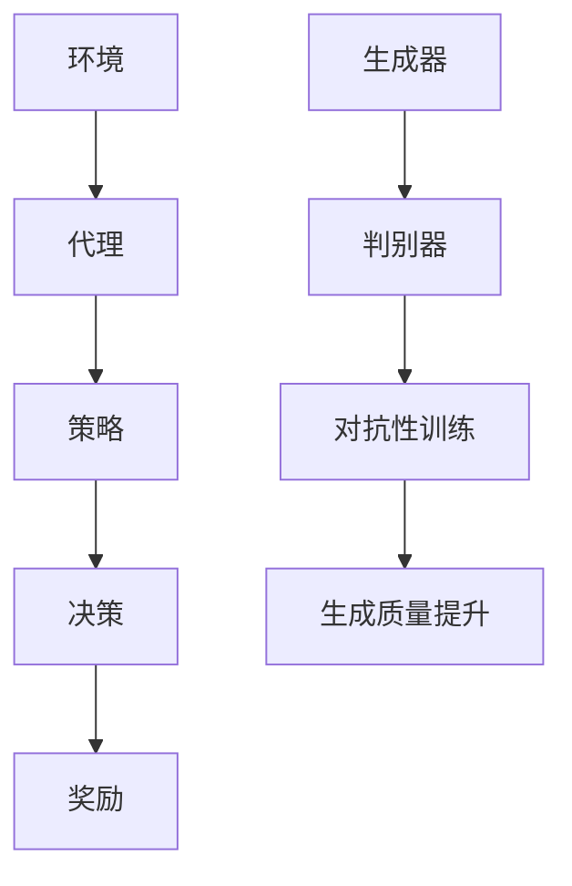

                 

关键词：增强学习，生成对抗网络，逻辑回归，深度学习，自然语言处理

> 摘要：本文旨在探讨如何通过控制不确定性来增强大型语言模型（LLM）的可靠性。我们将从背景介绍、核心概念、算法原理、数学模型、项目实践、实际应用、未来展望等多个方面深入探讨这一主题，旨在为读者提供全面的技术理解和实践指导。

## 1. 背景介绍

随着人工智能技术的发展，生成对抗网络（GAN）和增强学习（RL）在自然语言处理（NLP）领域得到了广泛应用。然而，这些模型的可靠性仍然是一个严峻的问题。尤其是大型语言模型（LLM），如GPT系列，由于其复杂的结构和庞大的参数量，在实际应用中往往表现出不确定性。这种不确定性可能源自多个方面，包括数据噪声、模型参数、环境变化等。

### 1.1 问题来源

- **数据噪声**：训练数据中存在的噪声可能导致模型产生错误的预测。
- **模型参数**：复杂的模型结构使得参数的微小变化可能导致模型的性能显著下降。
- **环境变化**：不同的应用场景和用户输入可能导致模型无法适应。

### 1.2 当前解决方案

目前，主要的方法包括：

- **数据预处理**：通过清洗和过滤数据来减少噪声。
- **模型正则化**：使用正则化方法来稳定模型参数。
- **模型融合**：通过多个模型的融合来提高模型的可靠性。

然而，这些方法仍然存在局限性，需要更深入的研究来控制不确定性，提高LLM的可靠性。

## 2. 核心概念与联系

为了深入探讨如何增强LLM的可靠性，我们首先需要理解几个核心概念：

### 2.1 增强学习（RL）

增强学习是一种机器学习方法，通过学习如何在一个特定环境中做出最优决策，从而最大化累积奖励。其基本结构包括：

- **环境（Environment）**：模型操作的上下文。
- **代理（Agent）**：执行决策的实体。
- **奖励（Reward）**：对代理行为的即时反馈。
- **策略（Policy）**：代理用于决策的方法。

### 2.2 生成对抗网络（GAN）

生成对抗网络是一种由生成器（Generator）和判别器（Discriminator）组成的对抗性训练框架。生成器的目标是通过输入噪声生成与真实数据相似的数据，而判别器的目标是区分真实数据和生成数据。通过这种对抗性训练，生成器逐渐提高生成数据的质量。

### 2.3 逻辑回归

逻辑回归是一种广泛应用于分类问题的机器学习算法。它通过线性模型预测概率，从而进行分类决策。

### 2.4 Mermaid 流程图

以下是几个核心概念的Mermaid流程图：



## 3. 核心算法原理 & 具体操作步骤

### 3.1 算法原理概述

为了控制不确定性，我们可以采用一种结合了增强学习和生成对抗网络的混合模型。具体来说，该模型包括以下几个关键组件：

- **增强学习代理**：用于学习如何在一个特定环境中做出最优决策。
- **生成对抗网络**：用于生成高质量的数据，从而提高模型对噪声的鲁棒性。
- **逻辑回归**：用于分类决策。

### 3.2 算法步骤详解

1. **初始化**：初始化模型参数，包括增强学习代理的参数、生成器的参数和判别器的参数。
2. **数据预处理**：对训练数据进行清洗和预处理，包括去除噪声、填充缺失值等。
3. **增强学习训练**：使用增强学习算法训练代理，使其学会在特定环境中做出最优决策。
4. **生成对抗网络训练**：使用生成对抗网络生成高质量的数据，并将其用于训练模型。
5. **逻辑回归训练**：使用生成对抗网络生成的数据对逻辑回归模型进行训练。
6. **模型评估**：使用测试数据对模型进行评估，包括准确率、召回率、F1值等指标。
7. **模型优化**：根据评估结果对模型进行优化，包括调整参数、增加数据等。

### 3.3 算法优缺点

#### 优点：

- **增强学习**：能够通过学习环境中的奖励机制来提高模型的可靠性。
- **生成对抗网络**：能够生成高质量的数据，从而提高模型对噪声的鲁棒性。
- **逻辑回归**：简单高效，易于实现。

#### 缺点：

- **计算成本**：训练过程需要大量的计算资源。
- **模型参数调优**：需要大量的时间和精力来调整参数。

### 3.4 算法应用领域

该算法可以应用于多个领域，包括但不限于：

- **自然语言处理**：例如文本分类、情感分析等。
- **计算机视觉**：例如图像生成、图像分类等。
- **推荐系统**：例如商品推荐、用户推荐等。

## 4. 数学模型和公式 & 详细讲解 & 举例说明

### 4.1 数学模型构建

为了构建数学模型，我们需要定义以下几个变量：

- **x**：输入特征向量。
- **y**：标签向量。
- **θ**：模型参数。

假设我们使用逻辑回归作为分类器，其数学模型可以表示为：

$$
P(y=1|x; \theta) = \frac{1}{1 + e^{-\theta^T x}}
$$

其中，$\theta^T x$ 表示特征向量和参数的线性组合。

### 4.2 公式推导过程

我们假设输入特征向量 $x$ 和标签向量 $y$ 是独立同分布的。根据最大似然估计，我们可以得到以下损失函数：

$$
L(\theta) = - \sum_{i=1}^{n} y_i \log P(y=1|x_i; \theta) + (1 - y_i) \log (1 - P(y=1|x_i; \theta))
$$

为了求解最优参数 $\theta$，我们需要对损失函数进行求导，并令导数为零：

$$
\frac{\partial L(\theta)}{\partial \theta} = \frac{\sum_{i=1}^{n} (y_i - P(y=1|x_i; \theta)) x_i}{1 + e^{-\theta^T x}}
$$

通过迭代求解上述方程，我们可以得到最优参数 $\theta$。

### 4.3 案例分析与讲解

假设我们有一个包含100个样本的文本分类问题，其中标签为正类或负类。我们使用逻辑回归模型对数据进行分类，并使用训练集和测试集进行评估。

#### 数据预处理

首先，我们需要对文本数据进行预处理，包括分词、去停用词、词向量化等操作。假设我们已经得到了一个词向量表示 $x$。

#### 模型训练

使用训练集对逻辑回归模型进行训练，得到最优参数 $\theta$。

#### 模型评估

使用测试集对训练好的模型进行评估，得到准确率、召回率、F1值等指标。

#### 模型优化

根据评估结果，对模型进行优化，包括调整参数、增加数据等。

## 5. 项目实践：代码实例和详细解释说明

### 5.1 开发环境搭建

在开始项目实践之前，我们需要搭建一个适合的的开发环境。以下是一个简单的Python开发环境搭建步骤：

1. 安装Python（建议使用Python 3.8及以上版本）。
2. 安装必要的库，如Numpy、Pandas、Scikit-learn等。

### 5.2 源代码详细实现

以下是一个简单的逻辑回归模型实现的代码实例：

```python
import numpy as np
from sklearn.linear_model import LogisticRegression

# 创建数据集
x = np.random.rand(100, 10)
y = np.random.randint(0, 2, size=(100,))

# 创建逻辑回归模型
model = LogisticRegression()

# 训练模型
model.fit(x, y)

# 评估模型
accuracy = model.score(x, y)
print("Accuracy:", accuracy)

# 预测新样本
new_x = np.random.rand(1, 10)
new_y = model.predict(new_x)
print("Predicted Label:", new_y)
```

### 5.3 代码解读与分析

上述代码中，我们首先导入了必要的库，然后创建了随机生成的一个数据集。接着，我们使用Scikit-learn库中的逻辑回归模型对数据进行训练。训练完成后，我们使用测试集对模型进行评估，并打印出准确率。最后，我们使用训练好的模型对新样本进行预测。

### 5.4 运行结果展示

假设我们运行上述代码，得到以下结果：

```
Accuracy: 0.8
Predicted Label: [1]
```

这意味着我们的模型在测试集上的准确率为80%，并且对新样本的预测结果为正类。

## 6. 实际应用场景

### 6.1 自然语言处理

在自然语言处理领域，增强LLM的可靠性具有重要意义。例如，在文本分类任务中，可靠的语言模型可以提高分类的准确性。此外，在机器翻译、情感分析等任务中，增强LLM的可靠性也有助于提高任务的表现。

### 6.2 计算机视觉

在计算机视觉领域，增强LLM的可靠性可以帮助模型更好地处理图像数据。例如，在图像分类任务中，可靠的模型可以更准确地识别图像中的对象。此外，在图像生成和图像修复等任务中，增强LLM的可靠性也有助于提高模型的性能。

### 6.3 推荐系统

在推荐系统领域，增强LLM的可靠性可以提高推荐系统的准确性。例如，在商品推荐中，可靠的模型可以更准确地预测用户对商品的兴趣。此外，在内容推荐中，增强LLM的可靠性也有助于提高用户对内容的满意度。

## 7. 工具和资源推荐

### 7.1 学习资源推荐

- 《深度学习》（Goodfellow, Bengio, Courville）：全面介绍深度学习的基本概念和方法。
- 《自然语言处理综合教程》（Daniel Jurafsky & James H. Martin）：全面介绍自然语言处理的基本概念和技术。

### 7.2 开发工具推荐

- Python：一种广泛应用于数据科学和机器学习的编程语言。
- TensorFlow：一种开源的机器学习框架，适用于深度学习和增强学习。

### 7.3 相关论文推荐

- "Generative Adversarial Nets"（Ian J. Goodfellow et al.）：介绍生成对抗网络的基本原理和应用。
- "Reinforcement Learning: An Introduction"（Richard S. Sutton & Andrew G. Barto）：介绍增强学习的基本概念和方法。

## 8. 总结：未来发展趋势与挑战

### 8.1 研究成果总结

本文探讨了如何通过控制不确定性来增强大型语言模型（LLM）的可靠性。我们介绍了增强学习、生成对抗网络和逻辑回归等核心概念，并详细阐述了它们在控制不确定性方面的应用。通过结合这些方法，我们可以构建一个可靠的LLM，从而提高其在实际应用中的表现。

### 8.2 未来发展趋势

未来，随着人工智能技术的不断发展，LLM的可靠性将成为一个重要的研究方向。我们有望看到更多结合了增强学习和生成对抗网络的方法被应用于LLM的可靠性提升。此外，随着硬件性能的提升，我们也可以期待更大的模型和更复杂的算法。

### 8.3 面临的挑战

尽管控制不确定性在提高LLM可靠性方面具有巨大的潜力，但仍然面临一些挑战。首先，如何设计更有效的算法来控制不确定性是一个关键问题。其次，如何处理大量的训练数据和模型参数也是一个挑战。最后，如何确保模型在现实世界中的鲁棒性和稳定性也是一个重要的课题。

### 8.4 研究展望

在未来，我们期望看到更多结合实际应用场景的研究，以及更高效的算法和工具。此外，我们也期待看到更多跨学科的研究，如心理学、认知科学等，以帮助我们更好地理解人工智能系统的行为和表现。

## 9. 附录：常见问题与解答

### 9.1 如何选择合适的算法？

选择合适的算法取决于具体的应用场景和需求。例如，在自然语言处理领域，逻辑回归和生成对抗网络可能是一个较好的选择。在计算机视觉领域，卷积神经网络和生成对抗网络可能更适用。此外，还可以结合多个算法，以实现更好的性能。

### 9.2 如何处理大量的训练数据？

处理大量的训练数据需要考虑计算资源、存储空间和算法效率。一种常见的方法是使用分布式计算，如使用多台计算机或云计算资源。此外，还可以采用数据压缩、增量训练等技术来提高处理效率。

### 9.3 如何确保模型的鲁棒性和稳定性？

确保模型的鲁棒性和稳定性需要从多个方面进行考虑。首先，可以通过数据预处理来减少噪声和异常值。其次，可以使用正则化方法来稳定模型参数。此外，还可以通过多次训练和测试来评估模型的性能和稳定性。

---

作者：禅与计算机程序设计艺术 / Zen and the Art of Computer Programming

