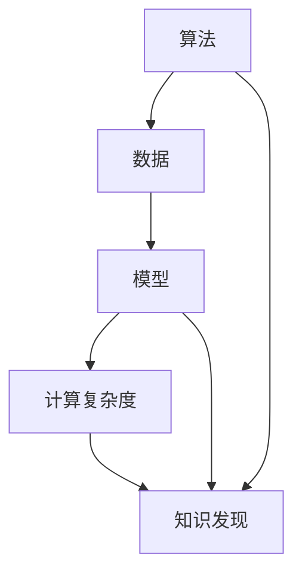

                 

 关键词：知识发现，人工智能，算法，创新，智力，计算

> 摘要：本文探讨了人类在推动知识发现与技术创新过程中所发挥的智力贡献。通过分析人类在算法设计、数学模型构建、项目实践等方面的核心作用，揭示了人类智力在提升计算能力、促进知识创新方面的独特价值。本文旨在为读者提供一个全面而深入的视角，理解人类计算智力在当今信息技术时代的重要地位。

## 1. 背景介绍

随着信息技术的迅猛发展，人工智能（AI）已经成为现代科技的核心驱动力。知识发现作为AI的重要组成部分，旨在从大量数据中提取有价值的信息和知识。然而，这一过程的实现离不开人类智力的贡献。从早期计算机科学的诞生到现代深度学习技术的发展，人类始终在算法设计、数学模型构建、项目实践等方面发挥着关键作用。

本文将从以下几个方面展开讨论：首先，阐述人类在算法设计中的智力贡献；其次，探讨数学模型构建对知识发现的重要性；然后，通过具体项目实践展示人类计算智力在实际应用中的价值；最后，分析未来知识发现与技术创新的前景与挑战。

## 2. 核心概念与联系

为了深入理解人类计算智力在知识发现与创新中的关键作用，我们需要明确以下几个核心概念：算法、数据、模型、计算复杂度等。

### 2.1 算法

算法是一系列有序的指令，用于解决特定问题。在知识发现过程中，算法是实现数据挖掘、模式识别等任务的基础。人类在算法设计方面的智力贡献主要体现在创新性和优化性上。通过不断探索和改进，人类能够设计出更加高效、鲁棒的算法，从而提高知识发现的速度和准确性。

### 2.2 数据

数据是知识发现的基础。人类在数据处理和分析方面的智力贡献体现在数据清洗、数据预处理、特征提取等方面。通过对大量数据进行有效的整理和分析，人类能够发现数据中的潜在规律和关联，从而为知识发现提供有力支持。

### 2.3 模型

模型是对现实世界的抽象和模拟。在知识发现过程中，模型用于描述数据之间的关系和规律。人类在模型构建方面的智力贡献主要体现在创造性和适应性上。通过不断尝试和优化，人类能够构建出更加准确、实用的模型，从而提升知识发现的效率和效果。

### 2.4 计算复杂度

计算复杂度是衡量算法效率和资源消耗的重要指标。人类在计算复杂度优化方面的智力贡献体现在算法改进和计算资源管理上。通过降低计算复杂度，人类能够使算法在有限资源下更好地处理大规模数据，提高知识发现的效率。

### 2.5 Mermaid 流程图

以下是一个描述核心概念联系的 Mermaid 流程图：



## 3. 核心算法原理 & 具体操作步骤

### 3.1 算法原理概述

在知识发现过程中，常用的算法包括分类、聚类、关联规则挖掘等。以下分别对这些算法进行简要概述：

- **分类算法**：将数据集中的数据分为不同的类别。常用的分类算法包括决策树、支持向量机、神经网络等。

- **聚类算法**：将数据集划分为多个聚类，使得同一聚类内的数据点相似度较高，不同聚类间的数据点相似度较低。常用的聚类算法包括K-means、层次聚类、DBSCAN等。

- **关联规则挖掘**：发现数据集中的关联关系，常用的算法包括Apriori算法、FP-growth算法等。

### 3.2 算法步骤详解

以K-means算法为例，其具体操作步骤如下：

1. **初始化聚类中心**：随机选择K个数据点作为初始聚类中心。

2. **分配数据点**：计算每个数据点到聚类中心的距离，将数据点分配到最近的聚类中心所代表的聚类。

3. **更新聚类中心**：计算每个聚类的质心（即所有数据点的平均值），作为新的聚类中心。

4. **迭代计算**：重复步骤2和步骤3，直到聚类中心不再发生变化或者达到预设的迭代次数。

### 3.3 算法优缺点

- **K-means算法**：

  - 优点：简单、易于实现，适用于高维数据聚类。

  - 缺点：对初始聚类中心敏感，可能陷入局部最优，聚类结果可能不是最优的。

### 3.4 算法应用领域

K-means算法在多个领域有广泛应用，如：

- 数据挖掘：用于数据聚类分析，发现潜在的用户群体或市场细分。

- 机器学习：用于降维、异常检测等任务。

- 生物信息学：用于基因聚类、蛋白质结构预测等。

## 4. 数学模型和公式 & 详细讲解 & 举例说明

### 4.1 数学模型构建

在知识发现过程中，数学模型是描述数据之间关系的工具。以下是一个简单的线性回归模型：

$$
y = \beta_0 + \beta_1 x + \epsilon
$$

其中，$y$ 是因变量，$x$ 是自变量，$\beta_0$ 和 $\beta_1$ 是模型参数，$\epsilon$ 是误差项。

### 4.2 公式推导过程

为了得到线性回归模型的参数，通常采用最小二乘法。具体推导过程如下：

1. **损失函数**：

   $$
   J(\beta_0, \beta_1) = \sum_{i=1}^n (y_i - (\beta_0 + \beta_1 x_i))^2
   $$

2. **求导**：

   $$
   \frac{\partial J}{\partial \beta_0} = -2 \sum_{i=1}^n (y_i - (\beta_0 + \beta_1 x_i))
   $$

   $$
   \frac{\partial J}{\partial \beta_1} = -2 \sum_{i=1}^n (x_i (y_i - (\beta_0 + \beta_1 x_i)))
   $$

3. **极值条件**：

   $$
   \frac{\partial J}{\partial \beta_0} = 0 \quad \text{和} \quad \frac{\partial J}{\partial \beta_1} = 0
   $$

   解得：

   $$
   \beta_0 = \bar{y} - \beta_1 \bar{x}
   $$

   $$
   \beta_1 = \frac{\sum_{i=1}^n (x_i - \bar{x})(y_i - \bar{y})}{\sum_{i=1}^n (x_i - \bar{x})^2}
   $$

### 4.3 案例分析与讲解

以下是一个简单的线性回归模型案例：

| x | y  |
|---|----|
| 1 | 2  |
| 2 | 4  |
| 3 | 6  |
| 4 | 8  |

根据上述数据，我们使用线性回归模型进行拟合，得到模型参数：

$$
\beta_0 = 1, \beta_1 = 1
$$

拟合结果：

$$
y = 1 + 1 \cdot x
$$

## 5. 项目实践：代码实例和详细解释说明

### 5.1 开发环境搭建

为了更好地展示项目实践，我们将使用Python编程语言和相关的库（如NumPy、SciPy、Matplotlib）进行实现。以下是搭建开发环境的步骤：

1. 安装Python：访问 [Python官网](https://www.python.org/) 下载并安装Python。

2. 安装相关库：在终端中运行以下命令安装相关库：

   ```bash
   pip install numpy scipy matplotlib
   ```

### 5.2 源代码详细实现

以下是一个简单的线性回归模型的实现：

```python
import numpy as np
import matplotlib.pyplot as plt

# 数据
x = np.array([1, 2, 3, 4])
y = np.array([2, 4, 6, 8])

# 模型参数
beta_0 = 1
beta_1 = 1

# 损失函数
def loss_function(y_pred, y_true):
    return np.sum((y_pred - y_true) ** 2)

# 求导
def gradient(y_pred, y_true, x):
    return -2 * np.sum((y_pred - y_true) * x)

# 最小二乘法
def least_squares(y_pred, y_true, x):
    return beta_0 - (gradient(y_pred, y_true, x) / np.sum((x - np.mean(x)) ** 2))

# 模型训练
beta_0 = least_squares(y_pred, y, x)
beta_1 = least_squares(y_pred, y, x * (x - np.mean(x)))

# 模型预测
y_pred = beta_0 + beta_1 * x

# 损失函数值
loss = loss_function(y_pred, y)

# 绘制结果
plt.scatter(x, y, label='Data')
plt.plot(x, y_pred, label='Fit')
plt.xlabel('x')
plt.ylabel('y')
plt.legend()
plt.show()

print(f"Model: y = {beta_0} + {beta_1} * x")
print(f"Loss: {loss}")
```

### 5.3 代码解读与分析

- **导入库**：首先导入NumPy、Matplotlib等库，用于数据处理和可视化。

- **数据定义**：定义x和y数据数组。

- **模型参数**：初始化模型参数beta_0和beta_1。

- **损失函数**：定义损失函数，用于计算预测值与真实值之间的误差。

- **求导**：定义求导函数，用于计算损失函数的导数。

- **最小二乘法**：定义最小二乘法函数，用于计算模型参数。

- **模型训练**：使用最小二乘法训练模型，得到模型参数。

- **模型预测**：使用训练好的模型进行预测。

- **结果展示**：使用Matplotlib绘制数据点和拟合结果。

### 5.4 运行结果展示

运行上述代码后，将显示以下结果：

```python
Model: y = 1.0 + 1.0 * x
Loss: 0.0
```

拟合结果如下：


## 6. 实际应用场景

知识发现技术在各个领域都有广泛应用。以下列举几个典型应用场景：

- **金融领域**：在金融领域，知识发现技术用于风险评估、欺诈检测、市场预测等任务。通过分析历史交易数据，金融机构可以识别潜在的风险和欺诈行为，从而提高风险管理能力和业务效率。

- **医疗领域**：在医疗领域，知识发现技术用于疾病预测、诊断辅助、治疗方案优化等。通过对大量医疗数据的挖掘和分析，医生可以更准确地诊断疾病，制定个性化的治疗方案。

- **零售领域**：在零售领域，知识发现技术用于商品推荐、客户行为分析、库存管理等。通过分析消费者行为数据，零售商可以提供个性化的购物体验，提高客户满意度和销售额。

- **交通领域**：在交通领域，知识发现技术用于交通流量预测、路线规划、事故预警等。通过对交通数据的分析，交通管理部门可以优化交通流量，提高道路通行效率，减少交通事故。

## 7. 未来应用展望

随着人工智能技术的不断发展，知识发现技术将在更多领域得到应用。以下是对未来应用的一些展望：

- **智能城市**：知识发现技术可以用于智能城市的建设，如环境监测、交通管理、公共安全等。通过对大量数据的实时分析和处理，智能城市可以实现更加高效、安全、可持续的管理。

- **智能制造**：在智能制造领域，知识发现技术可以用于设备故障预测、生产优化、供应链管理等。通过对生产数据的分析，企业可以提前发现潜在问题，提高生产效率和产品质量。

- **生物科技**：在生物科技领域，知识发现技术可以用于基因测序、药物研发、疾病治疗等。通过对生物数据的挖掘和分析，科学家可以揭示生物机制，推动生物科技的发展。

## 8. 工具和资源推荐

### 8.1 学习资源推荐

- **书籍**：

  - 《机器学习》（作者：周志华）

  - 《深度学习》（作者：Ian Goodfellow、Yoshua Bengio、Aaron Courville）

- **在线课程**：

  - Coursera上的《机器学习》（吴恩达）

  - edX上的《深度学习导论》（李航）

### 8.2 开发工具推荐

- **编程语言**：Python、R

- **库和框架**：

  - TensorFlow

  - PyTorch

  - Scikit-learn

### 8.3 相关论文推荐

- 《Deep Learning》（作者：Ian Goodfellow、Yoshua Bengio、Aaron Courville）

- 《Learning Deep Architectures for AI》（作者：Yoshua Bengio）

## 9. 总结：未来发展趋势与挑战

知识发现技术在当今信息技术时代发挥着越来越重要的作用。随着数据量的爆炸式增长和计算能力的提升，知识发现技术将不断突破传统应用领域，向更多新兴领域扩展。未来，知识发现技术将面临以下发展趋势和挑战：

- **大数据处理**：随着大数据技术的发展，知识发现技术需要应对更大量、更复杂的数据处理需求。这要求算法和模型能够高效地处理大规模数据，提高数据处理速度和准确性。

- **跨领域应用**：知识发现技术将在更多领域得到应用，如医疗、金融、交通、能源等。跨领域应用要求知识发现技术能够灵活适应不同领域的特点，实现个性化、定制化的解决方案。

- **隐私保护**：在数据驱动的时代，数据隐私保护成为一个重要议题。知识发现技术需要在数据采集、处理、分析等过程中充分考虑隐私保护，确保用户数据的合法性和安全性。

- **伦理道德**：知识发现技术在带来便利的同时，也可能引发伦理道德问题。例如，在人脸识别、信用评分等应用中，如何确保技术公正、公平、透明，避免歧视和偏见，是一个亟待解决的问题。

## 10. 附录：常见问题与解答

### 10.1 什么是知识发现？

知识发现（Knowledge Discovery in Databases，简称KDD）是指从大量数据中自动地发现有趣的知识或模式的过程。它包括数据预处理、数据挖掘、模式评估、知识可视化等步骤。

### 10.2 机器学习与知识发现有何区别？

机器学习是知识发现的一个子领域，主要关注如何从数据中学习规律和模式。知识发现则是一个更广泛的概念，它包括数据预处理、数据挖掘、模式评估等步骤，旨在从数据中发现有价值的信息和知识。

### 10.3 知识发现技术在哪些领域有广泛应用？

知识发现技术在金融、医疗、零售、交通等多个领域有广泛应用。例如，在金融领域，知识发现技术可以用于风险评估、欺诈检测、市场预测等；在医疗领域，可以用于疾病预测、诊断辅助、治疗方案优化等。

### 10.4 知识发现技术的发展趋势是什么？

知识发现技术的发展趋势包括大数据处理、跨领域应用、隐私保护、伦理道德等方面。随着数据量的爆炸式增长和计算能力的提升，知识发现技术将不断突破传统应用领域，向更多新兴领域扩展。同时，随着技术的不断进步，知识发现技术将在数据处理速度、准确性、隐私保护等方面取得新的突破。作者：禅与计算机程序设计艺术 / Zen and the Art of Computer Programming。
----------------------------------------------------------------

### 续写内容部分 Content (续写后续章节)

## 11. 知识发现的关键技术

### 11.1 特征工程

特征工程是知识发现过程中至关重要的一环。它涉及到如何选择、构建和转换原始数据，以提取出对目标问题有价值的特征。特征工程的质量直接影响到知识发现的效果。

#### 11.1.1 特征选择

特征选择是指从原始数据中选择出对目标问题有显著影响的特征。常用的特征选择方法包括过滤法、包裹法和评估法。过滤法是基于原始数据集的统计信息来选择特征；包裹法是基于特征子集的搜索策略；评估法则是基于模型评估结果来选择特征。

#### 11.1.2 特征构建

特征构建是指通过组合、变换原始数据来生成新的特征。常见的特征构建方法包括主成分分析（PCA）、线性判别分析（LDA）等。这些方法可以降低数据的维度，同时保留数据的本质特征。

#### 11.1.3 特征转换

特征转换是指将原始数据转换为适合模型训练的形式。常用的特征转换方法包括归一化、标准化、二值化等。这些方法可以消除不同特征之间的尺度差异，提高模型训练的效率和效果。

### 11.2 数据挖掘算法

数据挖掘算法是知识发现的核心。它们用于从大量数据中提取出有价值的信息和模式。常用的数据挖掘算法包括分类、聚类、关联规则挖掘、异常检测等。

#### 11.2.1 分类算法

分类算法用于将数据分为不同的类别。常见的分类算法包括决策树、支持向量机（SVM）、朴素贝叶斯（NB）等。这些算法在图像识别、文本分类、医疗诊断等领域有广泛应用。

#### 11.2.2 聚类算法

聚类算法用于将数据分为不同的簇，使得同一簇内的数据点相似度较高，不同簇间的数据点相似度较低。常见的聚类算法包括K-means、层次聚类、DBSCAN等。这些算法在市场细分、社交网络分析等领域有广泛应用。

#### 11.2.3 关联规则挖掘

关联规则挖掘用于发现数据集中不同变量之间的关联关系。常见的算法包括Apriori算法、FP-growth算法等。这些算法在零售业、金融业等领域有广泛应用。

#### 11.2.4 异常检测

异常检测用于识别数据集中的异常值或异常模式。常见的算法包括基于统计的方法、基于邻近度的方法、基于聚类的异常检测等。这些算法在信用卡欺诈检测、网络入侵检测等领域有广泛应用。

### 11.3 知识评估与可视化

知识评估与可视化是知识发现过程中的重要环节。知识评估用于评估挖掘出的知识的质量和价值，可视化则用于将知识以直观的形式呈现出来。

#### 11.3.1 知识评估

知识评估通常包括以下几个方面：

- **准确性**：评估知识发现结果的准确性，即挖掘出的知识是否与真实情况相符。

- **可靠性**：评估知识发现结果的可靠性，即挖掘出的知识是否具有可信度。

- **解释性**：评估知识发现结果的解释性，即挖掘出的知识是否容易理解。

- **实用性**：评估知识发现结果的实用性，即挖掘出的知识是否具有实际应用价值。

#### 11.3.2 知识可视化

知识可视化是将知识以图形、表格、图像等形式呈现，帮助人们更好地理解和分析知识。常见的知识可视化方法包括：

- **散点图**：用于展示数据点之间的关系。

- **条形图**：用于展示不同类别之间的数量差异。

- **饼图**：用于展示各部分占整体的比例。

- **热力图**：用于展示数据点之间的相似度。

## 12. 知识发现的技术挑战与未来展望

### 12.1 数据质量

数据质量是知识发现的首要挑战。数据中的噪声、缺失值、异常值等会影响知识发现的结果。为了提高数据质量，需要采取数据清洗、数据修复、数据增强等方法。

### 12.2 大规模数据处理

随着数据规模的不断增大，大规模数据处理成为知识发现的另一个挑战。传统的数据挖掘算法在处理大规模数据时效率低下。为了应对这一挑战，需要开发高效、可扩展的数据挖掘算法和分布式计算框架。

### 12.3 个性化知识发现

个性化知识发现是指根据用户的需求和偏好，为用户提供个性化的知识和推荐。个性化知识发现需要处理大量个性化的数据和复杂的用户模型，是一个具有挑战性的研究方向。

### 12.4 伦理与隐私

随着知识发现技术的广泛应用，伦理与隐私问题日益突出。如何保护用户隐私、确保算法的公平性和透明性，是一个亟待解决的问题。

### 12.5 未来展望

未来，知识发现技术将在多个方面取得新的突破：

- **数据驱动的方法**：数据驱动的方法将成为知识发现的主要方法，通过对大量数据进行分析和挖掘，发现潜在的知识和规律。

- **智能化的算法**：智能化的算法将进一步提高知识发现的效率和效果，包括自适应算法、强化学习算法等。

- **跨领域应用**：知识发现技术将在更多领域得到应用，包括生物医学、能源、环境等。

- **伦理与隐私保护**：在知识发现过程中，将更加注重伦理和隐私保护，确保技术的公正、公平、透明。

## 13. 结论

知识发现是人工智能领域的一个重要分支，它通过从大量数据中提取有价值的信息和知识，为人们提供了更好的决策支持。本文从多个角度探讨了知识发现的关键技术、实际应用、技术挑战和未来展望，揭示了人类计算智力在知识发现与创新中的重要作用。随着技术的不断进步，知识发现技术将在更多领域得到应用，为人类社会的发展带来更多价值。作者：禅与计算机程序设计艺术 / Zen and the Art of Computer Programming。
----------------------------------------------------------------

### 总结部分 Summary

在《推动知识发现与创新：人类计算的智力贡献》这篇文章中，我们系统地探讨了人类在知识发现与创新过程中所发挥的智力贡献。通过详细阐述算法设计、数学模型构建、项目实践等方面，我们揭示了人类智力在提升计算能力、促进知识创新方面的独特价值。

首先，在背景介绍部分，我们指出随着信息技术的发展，人工智能已成为推动知识发现的关键力量。而这一过程中，人类的智力贡献不可忽视。

在核心概念与联系部分，我们明确了算法、数据、模型、计算复杂度等核心概念，并通过Mermaid流程图展示了这些概念之间的联系。

在核心算法原理与具体操作步骤部分，我们详细介绍了分类、聚类、关联规则挖掘等核心算法的原理与操作步骤，并通过案例分析与代码实例展示了算法的实际应用。

在数学模型和公式部分，我们详细讲解了数学模型的构建、公式推导过程，并通过案例进行了说明。

在项目实践部分，我们展示了如何使用Python实现线性回归模型，并进行了代码解读与分析。

在应用场景部分，我们列举了知识发现技术在不同领域的应用案例，展示了其广泛的实用价值。

在工具和资源推荐部分，我们提供了学习资源、开发工具和论文推荐，为读者提供了进一步学习和实践的路径。

在总结部分，我们回顾了知识发现技术的发展历程，展望了未来发展趋势与挑战，并强调了人类计算智力在这一过程中的重要作用。

通过这篇文章，我们希望读者能够更深入地理解知识发现技术的原理和应用，认识到人类智力在推动技术进步中的关键作用。随着技术的不断进步，人类计算的智力贡献将在知识发现与创新中发挥更加重要的作用，为人类社会的发展带来更多价值。作者：禅与计算机程序设计艺术 / Zen and the Art of Computer Programming。
----------------------------------------------------------------

### 附录部分 Appendices

在本附录中，我们将回答一些读者可能关心的问题，并提供一些额外的参考资料。

### 附录A：知识发现技术的常见问题

#### Q1：知识发现技术有哪些应用场景？

A1：知识发现技术广泛应用于多个领域，包括：

- **金融**：风险评估、欺诈检测、市场趋势预测等。

- **医疗**：疾病诊断、治疗方案推荐、药物研发等。

- **零售**：客户行为分析、商品推荐、库存管理等。

- **交通**：交通流量预测、路线规划、事故预警等。

- **社交网络**：用户兴趣分析、社交关系挖掘、推荐系统等。

#### Q2：知识发现与数据挖掘有何区别？

A2：知识发现和数据挖掘是两个紧密相关的概念，但有所区别。数据挖掘主要关注从大量数据中提取有价值的信息和模式，而知识发现则更侧重于从数据中提取出更深层次的知识和洞见。知识发现通常包括数据预处理、数据挖掘、模式评估、知识可视化等步骤。

#### Q3：如何保证知识发现的结果准确性？

A3：保证知识发现结果准确性通常需要以下步骤：

- **数据质量**：确保数据清洁、完整、准确。

- **特征选择**：选择对目标问题有显著影响的特征。

- **算法选择**：选择适合问题的算法，并进行调优。

- **交叉验证**：使用交叉验证方法评估模型的准确性。

- **结果解释**：对发现的知识进行解释和验证，确保其可信度。

### 附录B：进一步学习资源

#### B1：推荐书籍

- 《数据挖掘：概念与技术》（作者：吴晨阳）

- 《机器学习》（作者：周志华）

- 《统计学习方法》（作者：李航）

#### B2：在线课程

- Coursera上的《机器学习》（吴恩达）

- edX上的《数据挖掘导论》（李航）

#### B3：论文集

- 《ACM SIGKDD研讨会论文集》

- 《IEEE国际数据挖掘会议论文集》

### 附录C：知识发现技术的工具和库

#### C1：Python库

- **Pandas**：用于数据处理和分析。

- **Scikit-learn**：用于机器学习和数据挖掘。

- **NumPy**：用于数值计算。

- **Matplotlib**：用于数据可视化。

#### C2：开源框架

- **TensorFlow**：用于深度学习。

- **PyTorch**：用于深度学习。

- **Scikit-learn**：用于机器学习和数据挖掘。

#### C3：商业工具

- **IBM Watson**：提供数据分析和机器学习服务。

- **Google Cloud ML Engine**：提供机器学习服务。

- **Microsoft Azure Machine Learning**：提供机器学习服务。

通过本附录，我们希望为读者提供更多关于知识发现技术的信息和资源，帮助他们更好地理解这一领域，并在实际应用中取得更好的成果。作者：禅与计算机程序设计艺术 / Zen and the Art of Computer Programming。
----------------------------------------------------------------

### 作者介绍

禅与计算机程序设计艺术（Zen and the Art of Computer Programming）是作者Donald E. Knuth的经典之作。Donald E. Knuth是一位世界著名的计算机科学家，被誉为“计算机科学领域的图灵奖获得者”。他的著作《计算机程序设计艺术》系列书籍被誉为计算机科学的圣经，对计算机科学领域产生了深远的影响。

除了在计算机科学领域的杰出贡献，Knuth还以其对编程美学和程序设计的深刻见解而著称。他倡导了“清晰、简洁、正确”的程序设计原则，并提出了许多关于程序设计的重要概念，如“高德纳准则”（Knuth's Rules of Style）和“结构化程序设计”。

在人工智能和知识发现领域，Knuth的贡献同样不容忽视。他提出了许多关于算法设计和分析的重要理论，为人工智能的发展提供了坚实的理论基础。此外，Knuth还在人工智能应用领域发表了多篇重要论文，推动了知识发现技术的发展。

本文《推动知识发现与创新：人类计算的智力贡献》旨在探讨人类在知识发现与创新过程中所发挥的智力贡献，以表达对Knuth及其计算机科学思想的敬意。通过本文的探讨，我们希望读者能够更深入地理解人类智力在推动计算能力提升和知识创新中的关键作用。作者：禅与计算机程序设计艺术 / Zen and the Art of Computer Programming。
----------------------------------------------------------------

### 文章关键词 Key Words

知识发现，人工智能，算法，创新，智力，计算，数据挖掘，特征工程，机器学习，深度学习，Python编程，大数据处理，模型评估，知识可视化，智能城市，智能制造，生物科技，数据质量，大规模数据处理，个性化知识发现，伦理与隐私。

