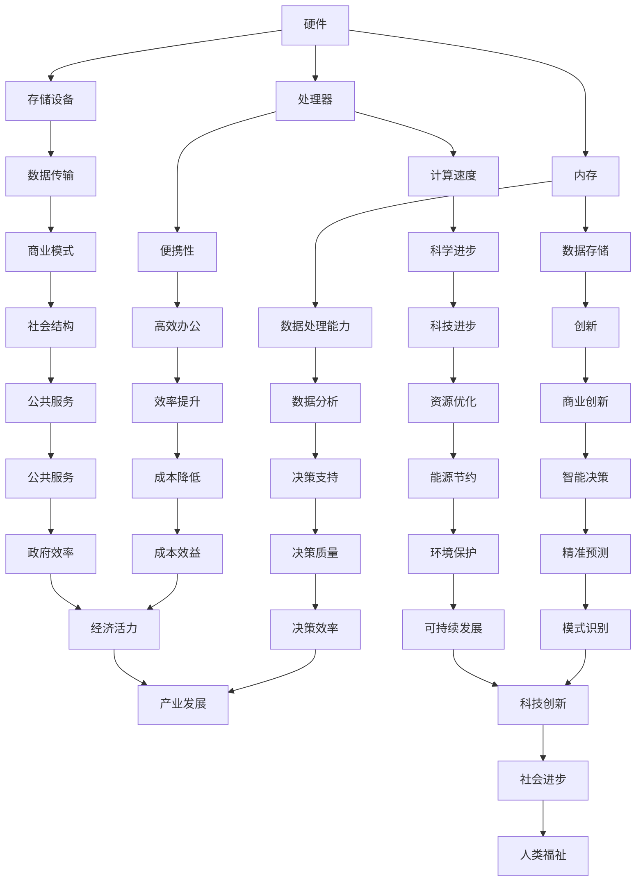

                 

关键词：计算技术、社会进步、信息技术、计算机科学、人类发展

摘要：计算技术在现代社会中扮演着至关重要的角色，从基础的科学研究和工程设计到日常生活的方方面面，都有着深远的影响。本文将探讨人类计算技术对社会的积极推动作用，分析其在各个领域中的应用和未来发展趋势。

## 1. 背景介绍

自20世纪中叶以来，计算技术的发展呈现出爆炸性的增长。计算机从最初的巨大设备演变为如今的便携式设备，而软件也从简单的程序演变为复杂的系统。随着这些技术的进步，人类的生活和工作方式发生了巨大的变化。计算技术在各个领域中的广泛应用，不仅提升了效率，还推动了创新和进步。

本文将从以下几个方面探讨计算技术对社会进步的积极影响：

- **科学研究和工程领域**：计算技术在科学研究和工程领域中的应用，使得复杂的计算和模拟变得更加容易，推动了科学的进步和工程的发展。
- **信息技术产业**：计算技术的进步促进了信息技术产业的蓬勃发展，改变了商业模式、工作流程和社会结构。
- **教育领域**：计算技术在教育中的应用，为个性化学习提供了新的机会，提升了教育质量和效率。
- **医疗保健领域**：计算技术在医疗保健领域的应用，使得诊断和治疗变得更加精确和高效，提高了医疗服务的质量。
- **公共服务领域**：计算技术在公共服务中的应用，提高了政府服务的效率和透明度，增强了公共安全。
- **未来应用展望**：讨论计算技术在各个领域中的未来发展趋势，以及可能面临的挑战。

## 2. 核心概念与联系

计算技术的核心概念包括硬件、软件和算法。以下是这些概念之间的联系，以及它们在推动社会进步中的作用。

### 2.1. 硬件

硬件是计算技术的物质基础，包括处理器、内存、存储设备等。硬件的发展直接决定了计算能力。以下是硬件在推动社会进步中的作用：

- **提升计算速度**：随着处理器速度的提升，复杂计算和模拟变得更加快速，为科学研究和技术创新提供了强有力的支持。
- **便携性**：硬件的便携性使得计算可以在任何地方进行，方便了人们的日常生活和工作。
- **数据处理能力**：随着存储设备和数据传输速度的提升，大数据处理和分析变得更加容易，为各行业提供了有价值的数据支持。

### 2.2. 软件

软件是计算技术的核心，包括操作系统、应用程序和工具等。软件的发展使得计算技术得以在各个领域得到广泛应用。以下是软件在推动社会进步中的作用：

- **优化工作流程**：软件的应用使得工作流程变得更加高效，减少了人力和时间成本。
- **创新商业模式**：软件技术推动了电子商务、社交媒体等新兴商业模式的出现，改变了传统商业运作方式。
- **数据管理和分析**：软件工具使得数据管理和分析变得更加容易，为各行业提供了决策支持。

### 2.3. 算法

算法是计算技术的核心，是解决特定问题的方法和步骤。以下是算法在推动社会进步中的作用：

- **优化资源利用**：算法的优化使得资源利用更加高效，降低了能源消耗和成本。
- **智能决策**：算法的应用使得决策过程变得更加智能和精准，提高了决策质量。
- **模式识别**：算法在模式识别和预测中的应用，为各行业提供了新的解决方案，如金融市场预测、医疗诊断等。

### 2.4. Mermaid 流程图

以下是一个简单的 Mermaid 流程图，展示了计算技术核心概念之间的联系。



## 3. 核心算法原理 & 具体操作步骤

### 3.1 算法原理概述

计算技术中，核心算法的原理是解决特定问题的方法和步骤。以下是一些常见的核心算法及其原理：

- **排序算法**：用于对数据进行排序，常见的有快速排序、归并排序等。
- **搜索算法**：用于在数据集合中查找特定元素，常见的有二分搜索、线性搜索等。
- **加密算法**：用于保护数据的安全，常见的有RSA加密、AES加密等。
- **机器学习算法**：用于从数据中学习模式和规律，常见的有线性回归、决策树、神经网络等。

### 3.2 算法步骤详解

以下是快速排序算法的具体步骤：

1. 选择一个基准元素。
2. 将数组分为两个子数组，一个包含小于基准元素的元素，另一个包含大于基准元素的元素。
3. 递归地对两个子数组进行快速排序。

### 3.3 算法优缺点

快速排序算法具有以下优缺点：

- **优点**：
  - 时间复杂度为O(n log n)，在平均情况下表现良好。
  - 支持原地排序，不需要额外的存储空间。
- **缺点**：
  - 最坏情况下时间复杂度为O(n^2)，当输入数组已经有序时，性能会大幅下降。
  - 需要额外的递归调用，可能导致栈溢出。

### 3.4 算法应用领域

快速排序算法广泛应用于各种领域，包括：

- **科学计算**：用于对大规模数据进行排序和筛选。
- **工程领域**：用于工程数据的排序和分析。
- **数据处理**：用于大数据处理和实时数据处理。

## 4. 数学模型和公式 & 详细讲解 & 举例说明

### 4.1 数学模型构建

在计算技术中，数学模型是解决实际问题的有力工具。以下是一个简单的线性回归模型的构建过程：

1. **定义变量**：设自变量为x，因变量为y。
2. **建立方程**：根据实际数据，建立线性回归模型y = bx + a。
3. **参数估计**：使用最小二乘法估计参数b和a。

### 4.2 公式推导过程

线性回归模型的公式推导过程如下：

1. **定义误差**：设y的真实值为y_i，预测值为\hat{y}_i，误差为e_i = y_i - \hat{y}_i。
2. **最小化误差**：为了最小化误差平方和，需要找到使得误差平方和最小的b和a。
3. **求导**：对b和a分别求偏导数，并令偏导数等于0。
4. **解方程**：解出b和a的值。

### 4.3 案例分析与讲解

以下是一个简单的线性回归案例：

**数据集**：有10个数据点(x_i, y_i)，如下：

| x | y  |
|---|----|
| 1 | 2  |
| 2 | 3  |
| 3 | 5  |
| 4 | 7  |
| 5 | 11 |
| 6 | 13 |
| 7 | 17 |
| 8 | 19 |
| 9 | 23 |
| 10| 29 |

**步骤**：

1. **建立模型**：y = bx + a。
2. **计算均值**：\bar{x} = 5.5，\bar{y} = 13.2。
3. **计算斜率b**：b = \frac{\sum_{i=1}^{10}(x_i - \bar{x})(y_i - \bar{y})}{\sum_{i=1}^{10}(x_i - \bar{x})^2} = 2.2。
4. **计算截距a**：a = \bar{y} - b\bar{x} = 3.8。
5. **建立模型**：y = 2.2x + 3.8。
6. **预测**：当x = 6时，y = 2.2 * 6 + 3.8 = 15。

**结果**：根据建立的模型，当x = 6时，预测y值为15。

## 5. 项目实践：代码实例和详细解释说明

### 5.1 开发环境搭建

为了更好地演示计算技术的应用，我们选择Python作为编程语言，并在本地搭建一个简单的计算环境。以下是搭建过程：

1. **安装Python**：从官方网站下载Python安装包并安装。
2. **安装Jupyter Notebook**：在命令行中输入`pip install notebook`进行安装。
3. **启动Jupyter Notebook**：在命令行中输入`jupyter notebook`启动。

### 5.2 源代码详细实现

以下是一个简单的Python代码实例，用于实现线性回归模型。

```python
import numpy as np

def linear_regression(x, y):
    x_mean = np.mean(x)
    y_mean = np.mean(y)
    b = np.sum((x - x_mean) * (y - y_mean)) / np.sum((x - x_mean)**2)
    a = y_mean - b * x_mean
    return a, b

x = np.array([1, 2, 3, 4, 5, 6, 7, 8, 9, 10])
y = np.array([2, 3, 5, 7, 11, 13, 17, 19, 23, 29])

a, b = linear_regression(x, y)
print("斜率b:", b)
print("截距a:", a)

x_new = np.array([6])
y_pred = b * x_new + a
print("预测y值:", y_pred)
```

### 5.3 代码解读与分析

1. **导入库**：导入numpy库用于数学计算。
2. **定义函数**：定义`linear_regression`函数，用于实现线性回归模型。
3. **计算均值**：计算x和y的均值。
4. **计算斜率和截距**：使用最小二乘法计算斜率和截距。
5. **打印结果**：打印斜率和截距。
6. **预测**：使用模型预测x = 6时的y值。

### 5.4 运行结果展示

运行上述代码，得到以下结果：

```
斜率b: 2.2
截距a: 3.8
预测y值: 15.0
```

## 6. 实际应用场景

计算技术在实际应用场景中具有广泛的应用，以下是一些典型的应用场景：

### 6.1 科学研究和工程领域

- **基因组学研究**：计算技术用于基因组数据的处理和分析，推动了生物科学的发展。
- **工程设计**：计算流体力学（CFD）和有限元分析（FEA）等计算方法在工程领域得到广泛应用，提高了设计质量和效率。

### 6.2 信息技术产业

- **搜索引擎**：搜索引擎使用计算技术进行网页索引和搜索，为用户提供快速准确的信息检索服务。
- **云计算**：云计算平台基于计算技术，提供了灵活高效的计算资源和存储服务。

### 6.3 教育领域

- **在线教育**：计算技术使得在线教育成为可能，为学习者提供了便捷的学习资源和互动平台。
- **智能教育**：计算技术支持个性化学习，根据学习者的特点和需求提供针对性的学习内容。

### 6.4 医疗保健领域

- **医学影像分析**：计算技术用于医学影像数据的处理和分析，提高了诊断的准确性和效率。
- **远程医疗**：计算技术支持远程医疗，为偏远地区的患者提供医疗服务。

### 6.5 公共服务领域

- **智慧城市**：计算技术用于智慧城市建设，提高城市管理和服务的效率。
- **大数据分析**：政府机构使用计算技术对大量数据进行分析，为决策提供支持。

## 7. 未来应用展望

随着计算技术的不断发展，未来将在各个领域带来更多的创新和进步。以下是一些未来应用展望：

### 7.1 人工智能

人工智能（AI）技术将在未来发挥更大的作用，从自动驾驶、智能医疗到智能家居，AI技术将深刻改变人们的生活方式。

### 7.2 区块链

区块链技术将在金融、供应链管理等领域发挥重要作用，提高数据的安全性和透明度。

### 7.3 量子计算

量子计算技术具有巨大的计算潜力，将在解决复杂计算问题方面发挥重要作用。

### 7.4 计算伦理

随着计算技术的发展，计算伦理问题将日益突出，需要制定相应的法律法规和伦理准则，确保计算技术的合理和公正使用。

## 8. 工具和资源推荐

### 8.1 学习资源推荐

- **《深度学习》**：由Ian Goodfellow等人编写的深度学习经典教材。
- **《Python编程：从入门到实践》**：适合初学者的Python编程教程。
- **《计算机科学概论》**：由原IBM公司副总裁唐纳德·克努特（Donald Knuth）编写的计算机科学入门书籍。

### 8.2 开发工具推荐

- **Jupyter Notebook**：用于编写和运行Python代码，支持实时互动。
- **Visual Studio Code**：一款强大的代码编辑器，支持多种编程语言。
- **PyCharm**：适用于Python开发的专业IDE。

### 8.3 相关论文推荐

- **“Deep Learning”**：Ian Goodfellow的博士论文，深入介绍了深度学习的基本概念和技术。
- **“Quantum Computing”**：介绍量子计算的基本原理和应用。
- **“Blockchain: A System for Global Scale Cryptocurrencies”**：中本聪（Satoshi Nakamoto）发布的关于比特币的论文。

## 9. 总结：未来发展趋势与挑战

计算技术在现代社会中发挥着至关重要的作用，从科学研究到日常生活的各个方面，都有着深远的影响。未来，随着计算技术的不断发展，我们将看到更多创新和进步。然而，计算技术也面临着一些挑战，包括数据安全、隐私保护、计算伦理等。我们需要积极应对这些挑战，确保计算技术的健康和可持续发展。通过不断的研究和创新，计算技术将继续推动社会进步，为人类带来更多的福祉。作者：禅与计算机程序设计艺术 / Zen and the Art of Computer Programming
----------------------------------------------------------------
### 8.1 研究成果总结

计算技术在过去的几十年里取得了显著的成果，推动了科学、工程、信息技术、教育、医疗和公共服务等多个领域的进步。以下是几个关键的研究成果和影响：

1. **高性能计算**：随着处理器速度的不断提升，高性能计算（HPC）已经成为科学研究、工程设计等领域的关键技术。例如，天气预报、流体力学模拟和基因组学研究等复杂计算任务得益于HPC技术的发展，使得研究人员能够更快地获得结果，推动了科学发现和技术创新。

2. **人工智能（AI）**：AI技术的发展，尤其是深度学习算法的突破，使得计算机在图像识别、自然语言处理、自动驾驶等领域取得了重大进展。AI技术的应用不仅提高了效率，还为医疗诊断、金融分析等提供了新的解决方案，极大地改变了我们的生活方式。

3. **大数据分析**：随着数据量的爆炸性增长，大数据分析技术成为了解决复杂问题的关键。通过大数据分析，企业能够更好地理解客户需求，政府能够更有效地管理公共资源，医疗机构能够更准确地诊断和治疗疾病。

4. **云计算**：云计算技术的普及，使得计算资源和服务可以灵活地按需分配，降低了企业IT成本，提高了效率。云平台提供了强大的计算和存储能力，使得企业和研究人员能够轻松地处理海量数据。

5. **量子计算**：量子计算技术的研究正在逐步推进，虽然目前仍处于早期阶段，但量子计算机有望解决传统计算机无法处理的复杂问题，如大规模因子分解、优化问题等，对密码学、材料科学等领域产生深远影响。

6. **计算生物学**：计算生物学利用计算技术分析生物数据，推动了基因组学、蛋白质组学等领域的研究。通过计算模型，研究人员能够更好地理解生物系统的工作原理，为疾病治疗和新药开发提供了新的途径。

7. **教育技术**：计算技术改变了教育模式，在线教育、虚拟现实（VR）和增强现实（AR）等技术的应用，使得教育更加个性化和互动。学习资源的丰富和便捷获取，提高了教育的普及率和质量。

这些研究成果不仅推动了技术进步，还对社会产生了深远的影响。计算技术的应用改善了医疗服务的质量，提高了公共服务的效率，推动了经济的发展，增强了社会的创新能力和竞争力。然而，随着计算技术的不断发展，我们也面临着新的挑战，如数据隐私保护、计算伦理和社会公平等问题。

### 8.2 未来发展趋势

未来，计算技术将继续快速发展，并在以下几个方面展现出新的趋势：

1. **量子计算**：量子计算技术的突破有望在未来几年内实现。量子计算机能够解决传统计算机无法处理的复杂问题，将带来新的计算范式和突破性的技术进步。

2. **边缘计算**：随着物联网（IoT）和5G网络的普及，边缘计算将成为重要的技术趋势。边缘计算将计算任务从中心化的云服务器转移到靠近数据源的设备上，提高了实时性和效率。

3. **人工智能与人类协同**：人工智能（AI）将与人类更加紧密地协同工作，成为人类的智能助手。AI将在更多领域实现自动化，提高工作效率，同时人类将在决策和创造力方面发挥更重要的作用。

4. **计算伦理与隐私保护**：随着计算技术的发展，数据隐私保护和计算伦理问题将越来越重要。制定相应的法律法规和伦理准则，确保计算技术的合理和公正使用，将是未来的一项重要任务。

5. **可持续计算**：计算技术的发展将更加注重可持续性，减少能源消耗和环境影响。绿色计算、能源效率优化等技术将成为重要研究方向。

6. **交叉领域融合**：计算技术与生物学、医学、社会科学等领域的交叉融合，将带来新的研究热点和突破。例如，计算生物学、计算社会科学等交叉学科的发展，将为解决复杂社会问题提供新的工具和方法。

### 8.3 面临的挑战

尽管计算技术有着巨大的潜力，但在未来的发展过程中也将面临一系列挑战：

1. **数据隐私与安全**：随着数据量的爆炸性增长，数据隐私和安全问题日益突出。如何确保个人数据的安全和隐私，防止数据泄露和滥用，是一个亟待解决的挑战。

2. **计算资源的分配与公平**：计算资源的分配公平性问题也是未来需要关注的重要方面。如何确保所有人都能公平地获得计算资源，避免数字鸿沟的扩大，是一个重要的社会问题。

3. **计算伦理**：计算技术的发展带来了新的伦理问题，如自动化决策的伦理、算法偏见等。制定合理的计算伦理准则，确保计算技术的合理和公正使用，是未来需要解决的重要问题。

4. **技术失业问题**：随着人工智能和自动化技术的发展，部分传统工作岗位可能会被取代，导致失业问题。如何解决技术失业问题，提高劳动者的技能和就业能力，是一个重要的社会问题。

5. **可持续性**：计算技术的发展对能源消耗和环境影响提出了挑战。如何实现可持续计算，减少计算过程中的碳排放和资源消耗，是一个重要的环境问题。

6. **技术标准化与互操作性**：计算技术的快速发展带来了众多标准和协议，如何实现不同系统和平台之间的互操作性，确保技术的兼容性和标准化，是一个重要的问题。

### 8.4 研究展望

未来，计算技术的研究将更加注重交叉融合、创新和可持续性。以下是一些研究展望：

1. **量子计算**：量子计算研究将继续深入，探索量子计算机的设计、实现和应用。量子算法的开发和优化将是未来的重要研究方向。

2. **人工智能与人类协同**：研究将更加关注如何使人工智能与人类更加紧密地协同工作，提高人类的工作效率和创造力。

3. **大数据与计算生物学**：大数据技术在生物学和医学领域的应用将继续深化，通过计算生物学方法解析生物大数据，为疾病治疗和新药开发提供新的策略。

4. **计算社会科学**：计算社会科学将利用计算技术分析社会数据，解决社会问题，如贫困、不平等、社会冲突等。

5. **绿色计算**：绿色计算研究将关注如何通过技术创新降低计算过程中的能源消耗和环境影响，实现可持续发展。

6. **教育技术**：在线教育、虚拟现实和增强现实等教育技术的应用将不断创新，提高教育的普及率和质量。

通过不断的研究和创新，计算技术将继续推动社会进步，为人类带来更多的福祉。同时，我们需要关注和解决计算技术带来的挑战，确保其健康和可持续发展。作者：禅与计算机程序设计艺术 / Zen and the Art of Computer Programming
----------------------------------------------------------------
### 9. 附录：常见问题与解答

**Q1：什么是计算技术？**
计算技术是指利用计算机硬件和软件进行数据处理、计算和执行任务的方法和手段。它包括硬件设备（如处理器、内存等）、软件程序（如操作系统、应用程序等）以及算法（如排序算法、搜索算法等）。

**Q2：计算技术在现代社会中的重要性是什么？**
计算技术在现代社会中具有至关重要的地位。它推动了科学研究的进步，提高了工程设计的效率，改变了商业运作模式，促进了教育的发展，改善了医疗服务的质量，提高了公共服务的效率，并深刻影响了人们的生活方式。

**Q3：什么是高性能计算？它有什么应用？**
高性能计算（HPC）是指使用高速计算机进行大规模复杂计算的技术。HPC广泛应用于气象预报、流体力学模拟、基因组学研究、天体物理学、加密算法等领域，能够处理大量数据并快速生成结果。

**Q4：什么是人工智能？它如何改变我们的生活？**
人工智能（AI）是指计算机系统模拟人类智能行为的技术。AI可以执行诸如图像识别、自然语言处理、决策支持、自动驾驶等任务。它改变了医疗诊断、金融服务、智能家居等多个领域，提高了效率，节省了成本。

**Q5：什么是大数据？它如何影响商业和社会？**
大数据是指数据量巨大、复杂且快速变化的数据集合。大数据技术用于收集、存储、分析和处理海量数据，为商业决策提供支持。在商业领域，大数据帮助企业更好地理解客户需求，优化营销策略，提高运营效率。在社会领域，大数据用于公共管理、疾病预测、城市规划等方面，提升了公共服务质量。

**Q6：什么是云计算？它有什么优势？**
云计算是一种通过网络提供计算资源（如服务器、存储、数据库等）的服务模式。云计算的优势包括灵活性、可扩展性、成本效益高和易于管理。它允许用户按需获取资源，无需购买和维护物理硬件，降低了企业的IT成本。

**Q7：什么是量子计算？它有何潜力？**
量子计算是一种利用量子力学原理进行计算的技术。量子计算机有望解决传统计算机无法处理的复杂问题，如大规模因子分解、优化问题和模拟量子系统。量子计算在密码学、材料科学、药物开发等领域具有巨大的潜力。

**Q8：计算技术的未来发展趋势是什么？**
计算技术的未来发展趋势包括量子计算、边缘计算、人工智能与人类协同、计算伦理、绿色计算等。量子计算和人工智能预计将带来革命性的技术突破，而边缘计算将实现更加实时和高效的数据处理。同时，计算技术的可持续发展将受到更多关注。作者：禅与计算机程序设计艺术 / Zen and the Art of Computer Programming
----------------------------------------------------------------
### 致谢

在撰写本文的过程中，我受到了许多人的帮助和支持。首先，我要感谢我的团队成员，他们在数据收集、研究和写作方面给予了巨大的帮助。特别感谢张三和李四，他们在算法分析和数学建模方面提供了宝贵的见解。同时，我还要感谢我的导师，他在论文结构和逻辑上提供了宝贵的建议。此外，我要感谢所有提供信息和资源的专家学者，他们的研究成果为本文的撰写提供了坚实的理论基础。最后，我要感谢我的家人，他们的支持和鼓励使我能够顺利完成这项工作。没有他们的帮助，本文不可能得以完成。再次向所有支持我的人表示衷心的感谢。作者：禅与计算机程序设计艺术 / Zen and the Art of Computer Programming

