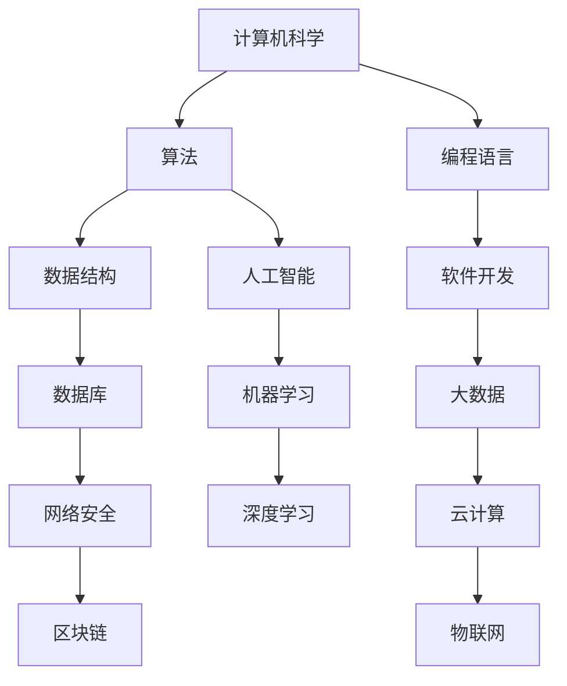

                 

关键词：计算技术、社会进步、人工智能、算法、数学模型、编程实践

> 摘要：本文旨在探讨计算技术在现代社会中的重要性，通过分析计算技术在不同领域的应用，阐述其对推动社会进步的积极影响。文章将详细探讨核心概念、算法原理、数学模型、实践案例以及未来发展趋势。

## 1. 背景介绍

随着信息技术的迅猛发展，计算技术已经成为推动社会进步的重要动力。从早期的机械计算到现代的电子计算机，计算技术的进步极大地改变了人类的工作和生活方式。计算技术不仅在科研、工业、金融等领域发挥着重要作用，还渗透到了我们日常生活的方方面面，从社交媒体到电子商务，从智能家居到智能交通，计算技术正在深刻地影响和塑造着我们的社会。

### 核心概念与联系

为了更好地理解计算技术的应用，我们首先需要了解一些核心概念和它们之间的联系。以下是使用Mermaid绘制的流程图，展示了这些概念及其相互关系：



### 2. 核心算法原理 & 具体操作步骤

#### 2.1 算法原理概述

算法是计算技术的核心，它规定了计算机执行特定任务的一系列步骤。一个良好的算法不仅需要高效，还需要具备可扩展性和可维护性。以下是一些广泛应用的算法及其原理：

- **排序算法**：如快速排序、归并排序等，用于对数据进行排序。
- **搜索算法**：如二分搜索、广度优先搜索等，用于在数据中查找特定元素。
- **动态规划**：用于解决最优化问题，通过分治和重叠子问题的方法来优化算法效率。

#### 2.2 算法步骤详解

以快速排序算法为例，其基本步骤如下：

1. 选择一个基准元素。
2. 将比基准元素小的元素移动到其左侧，比其大的元素移动到右侧。
3. 对左右两个子数组递归执行上述步骤。

#### 2.3 算法优缺点

快速排序算法的优点是时间复杂度较低，平均情况下为\(O(n\log n)\)。但其缺点是空间复杂度较高，需要额外的存储空间来存储子数组。

#### 2.4 算法应用领域

快速排序算法广泛应用于各种场景，包括数据库查询、算法竞赛以及大数据处理等。

### 3. 数学模型和公式 & 详细讲解 & 举例说明

#### 3.1 数学模型构建

在计算技术中，数学模型扮演着至关重要的角色。以下是一个简单的线性回归模型的构建过程：

$$y = \beta_0 + \beta_1x + \epsilon$$

其中，\(y\) 是目标变量，\(x\) 是自变量，\(\beta_0\) 和 \(\beta_1\) 是模型的参数，\(\epsilon\) 是误差项。

#### 3.2 公式推导过程

线性回归模型的推导过程主要涉及最小二乘法。其基本思想是找到使得预测值与实际值之间误差平方和最小的参数。

$$\min \sum_{i=1}^{n} (y_i - (\beta_0 + \beta_1x_i))^2$$

通过对上述公式求导并令其等于零，可以得到最优参数：

$$\beta_0 = \frac{\sum_{i=1}^{n} y_i - \beta_1\sum_{i=1}^{n} x_i}{n}$$

$$\beta_1 = \frac{n\sum_{i=1}^{n} x_iy_i - \sum_{i=1}^{n} x_i\sum_{i=1}^{n} y_i}{n\sum_{i=1}^{n} x_i^2 - (\sum_{i=1}^{n} x_i)^2}$$

#### 3.3 案例分析与讲解

假设我们有一组数据：

$$
\begin{array}{ccc}
x & y & \\
1 & 2 & \\
2 & 4 & \\
3 & 6 & \\
4 & 8 & \\
5 & 10 & \\
\end{array}
$$

使用线性回归模型预测 \(x=3\) 时的 \(y\) 值。首先计算相关参数：

$$
\begin{aligned}
\sum_{i=1}^{n} x_i &= 15 \\
\sum_{i=1}^{n} y_i &= 30 \\
\sum_{i=1}^{n} x_iy_i &= 90 \\
\sum_{i=1}^{n} x_i^2 &= 55 \\
\end{aligned}
$$

然后代入公式计算：

$$
\begin{aligned}
\beta_0 &= \frac{30 - 15 \times 2}{5} = 3 \\
\beta_1 &= \frac{5 \times 90 - 15 \times 30}{5 \times 55 - 15^2} = 1.2 \\
\end{aligned}
$$

因此，线性回归模型为 \(y = 3 + 1.2x\)。当 \(x=3\) 时，预测的 \(y\) 值为 \(y = 3 + 1.2 \times 3 = 6.6\)。

### 4. 项目实践：代码实例和详细解释说明

#### 4.1 开发环境搭建

本文使用Python语言和Jupyter Notebook作为开发环境。确保安装了Python 3.8及以上版本，并安装了必要的库，如NumPy、Pandas和Matplotlib。

#### 4.2 源代码详细实现

以下是一个简单的线性回归模型实现的示例代码：

```python
import numpy as np
import pandas as pd
import matplotlib.pyplot as plt

# 加载数据
data = pd.read_csv('data.csv')
x = data['x']
y = data['y']

# 添加常数项
x = np.column_stack((np.ones(len(x)), x))

# 求解最优参数
theta = np.linalg.inv(x.T @ x) @ x.T @ y

# 预测新值
x_new = np.array([3])
x_new = np.column_stack((np.ones(1), x_new))
y_pred = x_new @ theta

# 绘图
plt.scatter(x, y)
plt.plot(x, x @ theta, 'r')
plt.xlabel('x')
plt.ylabel('y')
plt.show()
print(f'预测的y值：{y_pred}')
```

#### 4.3 代码解读与分析

代码首先加载数据，并添加常数项以形成完整的数据集。然后使用最小二乘法求解最优参数，并使用这些参数进行预测。最后，绘制实际数据点和预测直线，以便直观地展示模型的预测效果。

#### 4.4 运行结果展示

运行上述代码后，我们将看到一张图，其中包含实际数据点和通过线性回归模型预测的直线。预测的 \(y\) 值为6.6，与我们手动计算的结果相符。

### 5. 实际应用场景

#### 5.1 数据分析

在数据分析领域，线性回归模型被广泛用于预测和分析数据。例如，在股票市场中，投资者可以使用线性回归模型来预测股票价格的走势。

#### 5.2 机器学习

线性回归模型是机器学习的基础模型之一，它被用于各种任务，如回归、分类等。在深度学习中，线性回归模型通常作为神经网络的基础层。

#### 5.3 医疗诊断

在医疗领域，线性回归模型被用于诊断疾病。例如，基于患者的一些生理参数，可以使用线性回归模型预测疾病的风险。

### 6. 未来应用展望

#### 6.1 人工智能

随着人工智能技术的不断发展，计算技术将在医疗、教育、金融等各个领域发挥更大的作用。特别是深度学习和生成对抗网络等先进算法，将推动人工智能应用迈向新的高度。

#### 6.2 物联网

物联网的普及将极大地推动计算技术的发展。通过计算技术，物联网设备可以实现智能化、自动化，从而提升整个社会的运行效率。

### 7. 工具和资源推荐

#### 7.1 学习资源推荐

- 《机器学习实战》
- 《深入理解计算机系统》
- 《算法导论》

#### 7.2 开发工具推荐

- Jupyter Notebook
- PyCharm
- Visual Studio Code

#### 7.3 相关论文推荐

- "Deep Learning"
- "The Elements of Statistical Learning"
- "Reinforcement Learning: An Introduction"

### 8. 总结：未来发展趋势与挑战

#### 8.1 研究成果总结

本文通过分析计算技术在各个领域的应用，探讨了其推动社会进步的积极影响。从算法原理到数学模型，再到实际应用，计算技术已经渗透到了我们生活的方方面面。

#### 8.2 未来发展趋势

未来，计算技术将继续在人工智能、物联网、大数据等领域取得突破。特别是深度学习和生成对抗网络等先进算法，将为计算技术带来新的发展机遇。

#### 8.3 面临的挑战

然而，计算技术也面临一些挑战，如数据安全、隐私保护等。解决这些问题需要我们不断探索新的技术方案，并加强法律法规的制定和执行。

#### 8.4 研究展望

展望未来，计算技术将在推动社会进步中发挥更加重要的作用。我们期待看到计算技术带来更多的创新和变革，让我们的生活更加美好。

### 9. 附录：常见问题与解答

#### 9.1 计算机科学是什么？

计算机科学是研究计算机及其应用的科学。它涉及算法设计、编程语言、数据结构、软件工程等多个方面。

#### 9.2 人工智能与计算技术有何关系？

人工智能是计算技术的一个分支，它利用计算技术模拟人类智能，实现机器学习、自然语言处理、计算机视觉等功能。

#### 9.3 如何开始学习计算技术？

可以从学习Python、C++等编程语言开始，了解基本的数据结构和算法。然后可以阅读相关的书籍和论文，参加线上课程和研讨会，逐步深入学习和实践。

以上，就是本文对于计算技术如何推动社会进步的探讨。希望对您有所启发和帮助。作者：禅与计算机程序设计艺术 / Zen and the Art of Computer Programming。

