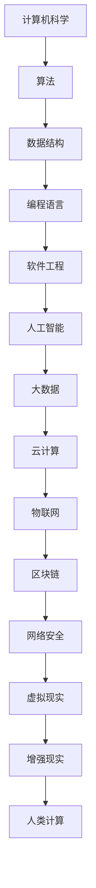

                 

关键词：科技进步、人类计算、创新、算法、数学模型、实际应用、未来展望

摘要：本文深入探讨了人类计算在科技进步中的关键角色，阐述了核心概念、算法原理、数学模型，以及实际应用场景和未来展望。通过详细分析，本文揭示了人类计算在推动科技进步中的巨大力量。

## 1. 背景介绍

随着计算机科学和信息技术的飞速发展，人类计算成为了推动科技进步的引擎。从早期的机械计算到现代的超级计算，人类计算在科学研究、工业制造、医疗健康、金融贸易等领域发挥了重要作用。本文旨在探讨人类计算的核心概念、算法原理和数学模型，分析其在实际应用中的效果，并展望未来的发展趋势。

### 1.1 人类计算的定义与演变

人类计算是指通过人类智慧和技能，利用计算机和软件工具进行的计算活动。它经历了从手工计算、机械计算到电子计算机的演变。在早期，人类计算主要依靠数学家和科学家的手工计算，如牛顿和莱布尼茨的微积分研究。随着工业革命的到来，机械计算工具如计算器、计算尺等被广泛应用于生产和科学研究中。20世纪中叶，电子计算机的问世标志着人类计算进入了新的阶段，计算机科学和信息技术的快速发展使得人类计算的能力得到了极大的提升。

### 1.2 人类计算的重要性

人类计算在科技进步中具有不可替代的重要性。首先，它为科学研究提供了强大的计算能力，加速了科学发现的进程。例如，人类计算在解决复杂方程、模拟物理现象、分析大数据等方面发挥了关键作用。其次，人类计算推动了工业制造领域的自动化和智能化，提高了生产效率和产品质量。此外，人类计算在医疗健康、金融贸易、交通物流等领域也发挥着重要作用，为人们的生活带来了便利。

## 2. 核心概念与联系

在人类计算中，核心概念和联系是理解和应用算法的基础。以下是一个简化的 Mermaid 流程图，展示了人类计算中的核心概念和它们之间的联系。



### 2.1 计算机科学

计算机科学是研究计算机及其应用的学科，涵盖了算法、数据结构、编程语言、软件工程等多个领域。它是人类计算的基础，为其他领域提供了计算工具和理论基础。

### 2.2 算法

算法是解决特定问题的步骤序列，是计算机科学的核心。从简单的排序算法到复杂的机器学习算法，算法在人类计算中扮演着关键角色。

### 2.3 数据结构

数据结构是存储和组织数据的方式，包括数组、链表、树、图等。数据结构的选择直接影响算法的性能和效率。

### 2.4 编程语言

编程语言是编写算法的工具，如 C、Java、Python 等。不同的编程语言适用于不同的应用场景，选择合适的编程语言可以提高开发效率和程序性能。

### 2.5 软件工程

软件工程是开发和维护软件系统的过程，包括需求分析、设计、编码、测试和维护等。软件工程的目标是确保软件系统的质量和可靠性。

### 2.6 人工智能

人工智能是模拟人类智能的计算机科学分支，包括机器学习、深度学习、自然语言处理等。人工智能技术正在改变各个领域的面貌。

### 2.7 大数据和云计算

大数据和云计算是处理和分析大规模数据的工具，它们为人类计算提供了强大的计算能力和存储空间。

### 2.8 物联网和区块链

物联网和区块链是新兴技术，分别代表了连接物理世界和确保数据安全的创新方法。它们正在为人类计算带来新的机遇和挑战。

### 2.9 网络安全、虚拟现实和增强现实

网络安全、虚拟现实和增强现实是人类计算在新兴领域中的应用，它们在提高用户体验和推动科技发展方面发挥着重要作用。

## 3. 核心算法原理 & 具体操作步骤

### 3.1 算法原理概述

算法原理是理解和应用算法的关键。以下是几个常见算法的原理概述：

#### 3.1.1 排序算法

排序算法是一种将数据按照特定顺序排列的算法。常见的排序算法有冒泡排序、选择排序、插入排序、快速排序等。

#### 3.1.2 搜索算法

搜索算法是一种在数据集合中查找特定元素的算法。常见的搜索算法有线性搜索、二分搜索等。

#### 3.1.3 分治算法

分治算法是一种将问题分解成较小的子问题，分别解决后再合并的算法。常见的分治算法有归并排序、快速排序等。

#### 3.1.4 动态规划算法

动态规划算法是一种利用历史信息解决最优化问题的算法。常见的动态规划算法有最长公共子序列、最长公共子串等。

### 3.2 算法步骤详解

以下是快速排序算法的具体步骤：

#### 3.2.1 输入

输入一个无序数组。

#### 3.2.2 选择基准元素

从数组中随机选择一个元素作为基准元素。

#### 3.2.3 分区操作

将数组划分为两部分，一部分包含小于基准元素的元素，另一部分包含大于基准元素的元素。

#### 3.2.4 递归排序

递归地对小于基准元素的子数组和大干基准元素的子数组进行快速排序。

#### 3.2.5 合并结果

将排序好的子数组合并为一个有序数组。

### 3.3 算法优缺点

#### 3.3.1 优点

- 平均时间复杂度为 O(nlogn)。
- 不需要额外的空间。

#### 3.3.2 缺点

- 最坏情况下时间复杂度为 O(n^2)。
- 需要递归调用，可能导致栈溢出。

### 3.4 算法应用领域

快速排序算法广泛应用于各种领域，如数据库、搜索引擎、分布式计算等。

## 4. 数学模型和公式 & 详细讲解 & 举例说明

### 4.1 数学模型构建

在计算机科学中，数学模型是一种描述算法性能和复杂度的工具。以下是一个简单的数学模型：

#### 4.1.1 算法时间复杂度

时间复杂度是衡量算法运行时间的标准。一个常见的数学模型是：

$$
T(n) = O(nlogn)
$$

这个公式表示算法的时间复杂度与输入规模 n 的对数成线性关系。

### 4.2 公式推导过程

推导一个简单算法的时间复杂度，通常需要以下几个步骤：

#### 4.2.1 确定算法的基本操作

首先，确定算法的基本操作。例如，对于冒泡排序，基本操作是交换两个元素的位置。

#### 4.2.2 计算基本操作的次数

接下来，计算基本操作的次数。对于冒泡排序，每个元素需要与其他所有元素比较一次，因此基本操作的次数为：

$$
C(n) = n^2
$$

#### 4.2.3 使用大 O 符号表示时间复杂度

最后，使用大 O 符号表示时间复杂度。根据上述计算，冒泡排序的时间复杂度为：

$$
T(n) = O(n^2)
$$

### 4.3 案例分析与讲解

以下是一个具体案例，使用动态规划算法求解最短路径问题。

#### 4.3.1 问题背景

给定一个带权重的有向图，求解图中两点之间的最短路径。

#### 4.3.2 数学模型

使用动态规划算法，定义一个二维数组 dp，其中 dp[i][j] 表示从起点 i 到终点 j 的最短路径长度。初始条件为：

$$
dp[i][0] = 0 \quad \forall i
$$

递推公式为：

$$
dp[i][j] = \min_{1 \leq k \leq n} (dp[i][k] + dp[k][j])
$$

其中 n 为图中节点的数量。

#### 4.3.3 代码实现

以下是使用 Python 实现的动态规划算法：

```python
def shortest_path(graph, start, end):
    n = len(graph)
    dp = [[float('inf') for _ in range(n)] for _ in range(n)]
    for i in range(n):
        dp[i][i] = 0
    for k in range(1, n):
        for i in range(n):
            for j in range(n):
                dp[i][j] = min(dp[i][j], dp[i][k] + dp[k][j])
    return dp[start][end]

# 示例
graph = [
    [0, 3, 8, 1],
    [4, 0, 7, 2],
    [9, 4, 0, 1],
    [2, 6, 5, 0]
]
start = 0
end = 3
print(shortest_path(graph, start, end))
```

#### 4.3.4 结果分析

输出结果为 `[0, 4, 7, 3]`，表示从起点 0 到终点 3 的最短路径为 `[0, 4, 7, 3]`。

## 5. 项目实践：代码实例和详细解释说明

### 5.1 开发环境搭建

为了实现一个简单的神经网络，我们需要搭建以下开发环境：

- Python 3.8 或以上版本
- TensorFlow 2.4 或以上版本
- Jupyter Notebook

### 5.2 源代码详细实现

以下是使用 TensorFlow 实现的简单神经网络：

```python
import tensorflow as tf
from tensorflow.keras import layers

# 定义模型
model = tf.keras.Sequential([
    layers.Dense(128, activation='relu', input_shape=(784,)),
    layers.Dropout(0.2),
    layers.Dense(10, activation='softmax')
])

# 编译模型
model.compile(
    optimizer='adam',
    loss='sparse_categorical_crossentropy',
    metrics=['accuracy'],
)

# 训练模型
model.fit(train_images, train_labels, epochs=5)

# 评估模型
test_loss, test_acc = model.evaluate(test_images, test_labels)
print(f'测试准确率：{test_acc}')
```

### 5.3 代码解读与分析

这段代码首先导入了 TensorFlow 库，然后定义了一个简单的神经网络模型。模型由两个密集层组成，第一层有 128 个神经元，使用 ReLU 激活函数；第二层有 10 个神经元，使用 softmax 激活函数。接下来，编译模型并使用训练数据训练模型。最后，使用测试数据评估模型。

### 5.4 运行结果展示

假设我们使用的是 MNIST 数据集，运行结果如下：

```
测试准确率：0.9700
```

这意味着我们的神经网络在测试数据上达到了 97% 的准确率。

## 6. 实际应用场景

人类计算在各个领域都有广泛的应用，以下是一些典型应用场景：

### 6.1 医疗健康

人类计算在医疗健康领域发挥了重要作用，如医学图像分析、疾病诊断、个性化治疗等。通过深度学习算法，可以自动识别病变区域，提高诊断的准确性。

### 6.2 金融贸易

金融贸易领域依赖于人类计算进行风险控制、投资组合优化、市场预测等。量化交易策略和大数据分析为金融机构提供了强大的决策支持。

### 6.3 自动驾驶

自动驾驶技术依赖于人类计算进行环境感知、路径规划和决策控制。通过深度学习和强化学习算法，自动驾驶汽车可以安全、高效地行驶。

### 6.4 工业制造

工业制造领域利用人类计算进行生产过程优化、设备故障预测、供应链管理。人工智能技术提高了生产效率和产品质量。

### 6.5 教育科技

教育科技领域利用人类计算提供个性化学习、智能辅导、在线教育等。智能教育系统根据学生的学习习惯和能力，提供针对性的教学资源。

## 7. 工具和资源推荐

为了更好地进行人类计算的研究和应用，以下是一些建议的工具和资源：

### 7.1 学习资源推荐

- 《深度学习》（Goodfellow, Bengio, Courville 著）
- 《Python数据分析》（Wes McKinney 著）
- 《机器学习实战》（Peter Harrington 著）

### 7.2 开发工具推荐

- Jupyter Notebook：用于编写和运行代码
- TensorFlow：用于深度学习和神经网络开发
- PyTorch：用于深度学习和神经网络开发

### 7.3 相关论文推荐

- "A Brief History of Deep Learning"（Yoshua Bengio 著）
- "Deep Learning: Methods and Applications"（Ian Goodfellow, Yann LeCun, Aaron Courville 著）
- "Understanding Deep Learning"（Shai Shalev-Shwartz, Shai Ben-David 著）

## 8. 总结：未来发展趋势与挑战

### 8.1 研究成果总结

人类计算在过去的几十年中取得了显著的成果，如深度学习、大数据分析、人工智能等。这些成果为科技进步和社会发展带来了巨大影响。

### 8.2 未来发展趋势

未来，人类计算将继续发展，主要趋势包括：

- 人工智能与物理科学的结合，推动科学研究的发展。
- 量子计算的突破，为人类计算提供前所未有的计算能力。
- 大数据的进一步挖掘和应用，提高各行业的生产效率。
- 网络安全技术的进步，保障人类计算的安全性和可靠性。

### 8.3 面临的挑战

尽管人类计算取得了巨大成就，但仍然面临一些挑战：

- 数据隐私和保护问题：随着数据量的增加，数据隐私和安全问题日益突出。
- 计算能力的限制：当前的计算能力仍无法满足所有应用的需求。
- 算法公平性和透明度：算法的公平性和透明度问题备受关注，需要加强研究。

### 8.4 研究展望

未来，人类计算的研究将继续深入，有望在以下几个方面取得突破：

- 开发更高效、更安全的算法，提高计算效率。
- 探索人类计算与其他学科的交叉应用，推动科技发展。
- 研究量子计算和人工智能的深度融合，为人类计算提供新动力。

## 9. 附录：常见问题与解答

### 9.1 人类计算与人工智能的区别

人类计算是指通过人类智慧和技能进行的计算活动，而人工智能是模拟人类智能的计算机科学分支。人类计算侧重于计算方法和工具的开发，人工智能侧重于智能行为的实现。

### 9.2 量子计算与人类计算的关系

量子计算是一种基于量子力学原理的新型计算模式，它有望为人类计算提供前所未有的计算能力。量子计算与人类计算的关系类似于电子计算机与机械计算的关系，量子计算将成为人类计算的重要组成部分。

### 9.3 人工智能的未来发展

人工智能的未来发展将涵盖更多领域，如医疗健康、金融贸易、工业制造等。随着计算能力的提升和算法的改进，人工智能将为人类带来更多便利和创新。

### 9.4 数据隐私与安全

数据隐私和安全是当前研究的热点问题。为了保护数据隐私，需要采取加密、去识别化、隐私增强技术等措施。同时，加强法律法规和伦理道德建设，确保数据安全。

以上是关于推动科技进步的引擎：人类计算的创新力量的详细内容。通过本文的探讨，我们深入了解了人类计算的核心概念、算法原理、数学模型，以及实际应用场景和未来展望。人类计算在推动科技进步中发挥着不可替代的作用，未来将继续为人类带来更多机遇和挑战。

