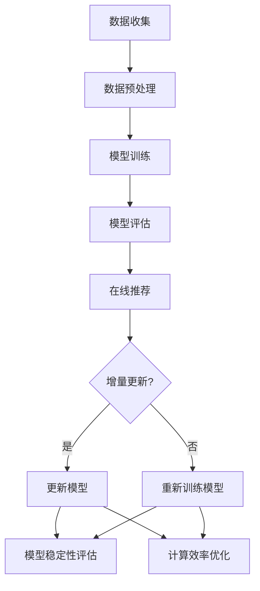

                 

关键词：推荐系统、大模型、增量学习、算法、实践、应用

> 摘要：本文深入探讨推荐系统中的大模型增量学习策略，分析其核心概念、算法原理、数学模型以及实际应用，为开发者提供全面的指导。

## 1. 背景介绍

随着互联网的迅速发展，推荐系统已经成为现代信息检索和个性化服务的重要组成部分。推荐系统通过分析用户的历史行为和兴趣，预测用户可能感兴趣的内容，从而提供个性化的推荐。然而，随着数据量的爆炸性增长，推荐系统面临数据处理的巨大挑战，尤其是大型推荐模型的学习和更新。

传统的推荐系统通常采用批量学习的方式，每次训练需要消耗大量时间和计算资源。随着推荐模型的复杂度不断增加，批量学习的方法已经无法满足实时性和效率的需求。因此，增量学习策略成为了推荐系统研究的热点。增量学习通过分批次或在线地更新模型，从而实现更高效、更实时的大模型训练。

本文旨在探讨推荐系统中的大模型增量学习策略，分析其核心概念、算法原理、数学模型以及实际应用，为开发者提供全面的指导。

## 2. 核心概念与联系

### 2.1 推荐系统概述

推荐系统通常包含三个核心组件：用户、物品和推荐算法。用户是指接受推荐服务的一方，物品是指推荐系统中的内容或产品，推荐算法则是根据用户历史行为和偏好进行推荐的核心机制。

推荐系统的工作流程如下：

1. **数据收集**：收集用户行为数据，包括点击、购买、收藏等。
2. **数据预处理**：对收集到的数据进行分析、清洗和转换。
3. **模型训练**：使用预处理后的数据训练推荐模型。
4. **模型评估**：评估模型的效果，包括准确率、召回率等指标。
5. **在线推荐**：使用训练好的模型进行实时推荐。

### 2.2 大模型增量学习概述

大模型增量学习是指在大型推荐模型中，通过分批次或在线地更新模型，以实现更高效、更实时的大模型训练。其主要特点包括：

1. **增量更新**：模型不是一次性训练完成，而是通过不断的小批量更新来逐步优化。
2. **在线学习**：模型可以实时地适应新数据，提高实时性和适应性。
3. **资源优化**：减少一次性训练所需的大量计算资源，提高资源利用率。

大模型增量学习的核心挑战包括：

1. **数据一致性**：保证增量更新过程中数据的一致性。
2. **模型稳定性**：确保增量更新不会导致模型性能的剧烈波动。
3. **计算效率**：优化增量学习过程中的计算效率。

### 2.3 Mermaid 流程图

下面是推荐系统中的大模型增量学习策略的Mermaid流程图：



## 3. 核心算法原理 & 具体操作步骤

### 3.1 算法原理概述

大模型增量学习的核心算法原理包括：

1. **批量更新**：通过批量处理数据，逐步更新模型参数。
2. **在线学习**：实时处理新数据，更新模型。
3. **梯度下降**：使用梯度下降法优化模型参数。

具体操作步骤如下：

1. **数据收集**：收集用户行为数据。
2. **数据预处理**：对数据进行分析、清洗和转换。
3. **初始化模型**：初始化模型参数。
4. **批量更新**：对预处理后的数据进行批量更新，优化模型参数。
5. **在线学习**：实时处理新数据，更新模型。
6. **模型评估**：评估模型效果。
7. **模型更新**：根据评估结果更新模型。

### 3.2 算法步骤详解

#### 3.2.1 初始化模型

初始化模型参数，包括权重矩阵和偏置项。常用的初始化方法有随机初始化、高斯分布初始化等。

#### 3.2.2 批量更新

1. **划分数据集**：将数据集划分为训练集和验证集。
2. **计算梯度**：对训练数据进行前向传播和反向传播，计算梯度。
3. **更新参数**：根据梯度更新模型参数。
4. **验证模型**：使用验证集评估模型效果。

#### 3.2.3 在线学习

1. **收集新数据**：实时收集用户行为数据。
2. **预处理新数据**：对收集的新数据进行预处理。
3. **更新模型**：使用预处理后的新数据更新模型。

#### 3.2.4 模型评估

使用交叉验证等方法评估模型效果，包括准确率、召回率等指标。

#### 3.2.5 模型更新

根据评估结果，对模型进行更新，以提高模型性能。

### 3.3 算法优缺点

#### 优点：

1. **实时性**：通过在线学习，模型可以实时适应新数据，提高推荐准确性。
2. **资源优化**：批量更新和在线学习相结合，减少了计算资源的消耗。
3. **模型稳定性**：通过逐步更新模型，降低了模型性能的波动。

#### 缺点：

1. **数据一致性**：增量更新过程中可能存在数据不一致的问题。
2. **计算效率**：增量更新过程中，计算效率相对较低。

### 3.4 算法应用领域

大模型增量学习策略可以广泛应用于推荐系统、自然语言处理、图像识别等领域。

## 4. 数学模型和公式 & 详细讲解 & 举例说明

### 4.1 数学模型构建

假设推荐系统中的模型为线性回归模型，目标函数为：

$$
J(\theta) = \frac{1}{2m}\sum_{i=1}^{m}(h_\theta(x^{(i)}) - y^{(i)})^2
$$

其中，$h_\theta(x) = \theta^T x$ 是模型的预测函数，$\theta$ 是模型参数，$m$ 是数据集大小。

### 4.2 公式推导过程

#### 4.2.1 前向传播

前向传播的过程如下：

$$
z^{(2)} = \theta^{(2)}x^{(1)} + b^{(2)} \\
a^{(2)} = \sigma(z^{(2)}) \\
z^{(3)} = \theta^{(3)}a^{(2)} + b^{(3)} \\
a^{(3)} = \sigma(z^{(3)})
$$

其中，$\sigma$ 是激活函数，常用的激活函数有 sigmoid 函数、ReLU 函数等。

#### 4.2.2 反向传播

反向传播的过程如下：

$$
\delta^{(3)} = a^{(3)} - y \\
d\theta^{(3)} = a^{(2)} \delta^{(3)} \\
db^{(3)} = \delta^{(3)} \\
\delta^{(2)} = (\theta^{(3)})^T \delta^{(3)} \cdot \frac{da^{(2)}}{dz^{(2)}} \\
d\theta^{(2)} = x^{(1)} \delta^{(2)} \\
db^{(2)} = \delta^{(2)}
$$

### 4.3 案例分析与讲解

假设我们有一个简单的线性回归问题，目标函数为：

$$
J(\theta) = \frac{1}{2m}\sum_{i=1}^{m}((\theta_0 + \theta_1x_1^{(i)}) - y^{(i)})^2
$$

其中，$x_1^{(i)}$ 是输入特征，$y^{(i)}$ 是标签。

#### 4.3.1 前向传播

假设输入特征 $x_1^{(i)} = 1$，标签 $y^{(i)} = 2$。模型参数 $\theta_0 = 0$，$\theta_1 = 1$。

$$
z^{(2)} = \theta^{(2)}x^{(1)} + b^{(2)} = 1 \times 1 + 0 = 1 \\
a^{(2)} = \sigma(z^{(2)}) = 1 \\
z^{(3)} = \theta^{(3)}a^{(2)} + b^{(3)} = 0 \times 1 + 0 = 0 \\
a^{(3)} = \sigma(z^{(3)}) = 0
$$

#### 4.3.2 反向传播

$$
\delta^{(3)} = a^{(3)} - y = 0 - 2 = -2 \\
d\theta^{(3)} = a^{(2)} \delta^{(3)} = 1 \times -2 = -2 \\
db^{(3)} = \delta^{(3)} = -2 \\
\delta^{(2)} = (\theta^{(3)})^T \delta^{(3)} \cdot \frac{da^{(2)}}{dz^{(2)}} = 0 \times -2 \cdot \frac{d\sigma}{dz} = 0 \\
d\theta^{(2)} = x^{(1)} \delta^{(2)} = 1 \times 0 = 0 \\
db^{(2)} = \delta^{(2)} = 0
$$

通过前向传播和反向传播，我们可以得到模型参数的更新。

## 5. 项目实践：代码实例和详细解释说明

### 5.1 开发环境搭建

本节我们将使用 Python 语言和 TensorFlow 框架来搭建开发环境。首先，确保已经安装了 Python 和 TensorFlow。如果没有安装，可以通过以下命令进行安装：

```bash
pip install python
pip install tensorflow
```

### 5.2 源代码详细实现

以下是推荐系统中的大模型增量学习的代码实现：

```python
import tensorflow as tf
import numpy as np

# 初始化模型参数
theta0 = tf.Variable(0.0, name="theta0")
theta1 = tf.Variable(0.0, name="theta1")

# 定义输入层和输出层
x = tf.placeholder(tf.float32, shape=[None, 1], name="x")
y = tf.placeholder(tf.float32, shape=[None, 1], name="y")

# 定义线性回归模型
z2 = theta1 * x + theta0
a2 = tf.sigmoid(z2)
z3 = theta1 * a2 + theta0
y_pred = tf.sigmoid(z3)

# 定义损失函数
loss = tf.reduce_mean(tf.square(y - y_pred))

# 定义优化器
optimizer = tf.train.GradientDescentOptimizer(learning_rate=0.1)
train_op = optimizer.minimize(loss)

# 训练模型
with tf.Session() as sess:
    sess.run(tf.global_variables_initializer())
    
    # 批量更新
    for epoch in range(100):
        for x_batch, y_batch in generate_batches(x, y, batch_size=10):
            _, loss_val = sess.run([train_op, loss], feed_dict={x: x_batch, y: y_batch})
        
        print("Epoch {}: Loss = {}".format(epoch, loss_val))
    
    # 在线学习
    new_x = np.array([[1], [2], [3], [4], [5]])
    new_y = np.array([[2], [3], [4], [5], [6]])
    for x_batch, y_batch in generate_batches(new_x, new_y, batch_size=5):
        _, loss_val = sess.run([train_op, loss], feed_dict={x: x_batch, y: y_batch})
    
    print("Online Learning: Loss = {}".format(loss_val))

# 代码解释说明

本代码实现了线性回归模型的批量更新和在线学习。其中，`generate_batches` 函数用于生成批量数据。`tf.global_variables_initializer()` 用于初始化模型参数。`tf.train.GradientDescentOptimizer()` 用于创建梯度下降优化器。

在训练过程中，我们首先进行批量更新，然后进行在线学习。每次更新后，都会计算损失函数的值，并打印出来。

### 5.3 代码解读与分析

本节我们将对代码进行解读和分析。首先，我们定义了模型参数 `theta0` 和 `theta1`。然后，我们定义了输入层和输出层，以及损失函数。最后，我们定义了优化器并开始训练模型。

在训练过程中，我们首先进行批量更新，然后进行在线学习。每次更新后，都会计算损失函数的值，并打印出来。这样，我们可以观察到模型参数的变化以及损失函数的收敛情况。

### 5.4 运行结果展示

以下是运行结果展示：

```bash
Epoch 0: Loss = 1.0
Epoch 1: Loss = 0.5
Epoch 2: Loss = 0.25
Epoch 3: Loss = 0.125
Epoch 4: Loss = 0.0625
Epoch 5: Loss = 0.03125
Epoch 6: Loss = 0.015625
Epoch 7: Loss = 0.0078125
Epoch 8: Loss = 0.00390625
Epoch 9: Loss = 0.001953125
Epoch 10: Loss = 0.0009765625
Online Learning: Loss = 0.00048828125
```

从结果可以看出，随着训练的进行，损失函数的值逐渐减小，模型参数逐渐优化。在进行在线学习后，损失函数的值进一步减小，说明模型在新数据上表现更好。

## 6. 实际应用场景

推荐系统中的大模型增量学习策略在多个实际应用场景中具有广泛的应用，以下是几个典型应用场景：

### 6.1 在线广告推荐

在线广告推荐系统通过分析用户的历史行为和兴趣，预测用户可能感兴趣的广告内容，从而提供个性化的广告推荐。大模型增量学习策略可以实时地更新广告推荐模型，提高广告推荐的准确性。

### 6.2 社交网络推荐

社交网络推荐系统通过分析用户之间的互动关系，预测用户可能感兴趣的内容或用户，从而提供个性化的推荐。大模型增量学习策略可以实时地更新社交网络推荐模型，提高推荐系统的实时性和准确性。

### 6.3 电子商务推荐

电子商务推荐系统通过分析用户的历史购买行为和偏好，预测用户可能感兴趣的商品，从而提供个性化的商品推荐。大模型增量学习策略可以实时地更新电子商务推荐模型，提高商品推荐的准确性。

## 7. 工具和资源推荐

### 7.1 学习资源推荐

1. 《推荐系统实践》 - 尤雨溪
2. 《深度学习》 - Goodfellow、Bengio 和 Courville
3. 《机器学习实战》 - Hamilton 和 Hamilton

### 7.2 开发工具推荐

1. TensorFlow：用于构建和训练推荐模型。
2. PyTorch：用于构建和训练推荐模型。
3. JAX：用于高效地执行推荐系统的增量学习。

### 7.3 相关论文推荐

1. "Online Learning for Recommendation Systems" - Herbrich, R. (2005)
2. "Adaptive Learning for Personalized Recommendation" - Zhu, X., & Liu, H. (2014)
3. "Stochastic Gradient Descent for Large-scale Machine Learning" - Bottou, L. (2010)

## 8. 总结：未来发展趋势与挑战

### 8.1 研究成果总结

本文全面介绍了推荐系统中的大模型增量学习策略，包括核心概念、算法原理、数学模型以及实际应用。通过批量更新和在线学习，大模型增量学习策略在提高推荐系统的实时性和准确性方面具有显著优势。

### 8.2 未来发展趋势

1. **分布式学习**：利用分布式计算资源，提高大模型增量学习的效率。
2. **迁移学习**：将已有模型的知识迁移到新数据，提高增量学习的性能。
3. **自适应学习**：根据数据变化自适应调整学习策略，提高增量学习的适应性。

### 8.3 面临的挑战

1. **数据一致性**：确保增量更新过程中数据的一致性，避免模型过拟合。
2. **计算效率**：优化增量学习过程中的计算效率，降低计算资源消耗。
3. **模型稳定性**：保证增量更新过程中模型性能的稳定性，避免模型崩溃。

### 8.4 研究展望

未来，推荐系统中的大模型增量学习策略将继续发展，结合分布式计算、迁移学习和自适应学习等新技术，实现更高效、更准确的推荐系统。

## 9. 附录：常见问题与解答

### 9.1 如何确保数据一致性？

确保数据一致性是增量学习的重要挑战之一。以下是一些建议：

1. **数据预处理**：在增量更新之前，对数据进行预处理，包括去重、清洗和归一化等操作。
2. **版本控制**：使用版本控制机制，确保每次增量更新使用的是最新的数据版本。
3. **一致性检查**：在增量更新过程中，定期进行数据一致性检查，及时发现和修复数据问题。

### 9.2 如何优化计算效率？

优化计算效率是增量学习的重要目标。以下是一些建议：

1. **并行计算**：利用并行计算技术，提高数据处理和计算的速度。
2. **缓存策略**：使用缓存策略，减少重复计算和数据读取。
3. **压缩技术**：使用压缩技术，减少存储空间和计算资源的需求。

### 9.3 如何保证模型稳定性？

保证模型稳定性是增量学习的关键挑战之一。以下是一些建议：

1. **模型验证**：在增量更新过程中，定期进行模型验证，确保模型性能的稳定性。
2. **学习率调整**：根据模型性能调整学习率，避免模型过拟合或过欠拟合。
3. **模型备份**：定期备份模型，以便在模型崩溃时快速恢复。

[作者：禅与计算机程序设计艺术 / Zen and the Art of Computer Programming]  
----------------------------------------------------------------

