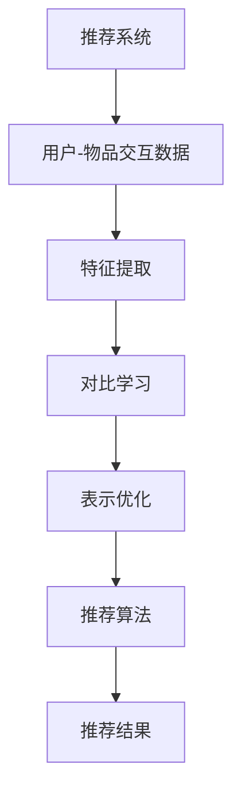

                 

关键词：推荐系统，大模型，对比学习，表示优化，深度学习，协同过滤，矩阵分解

> 摘要：随着互联网的快速发展，推荐系统已成为现代信息检索和个性化服务的重要手段。本文旨在探讨推荐系统中大模型的对比学习与表示优化技术，分析其核心概念、原理和应用。文章首先介绍了推荐系统的背景和重要性，然后详细阐述了对比学习和表示优化的基本原理，接着分析了现有的大模型技术及其优缺点，最后对未来发展方向和面临的挑战进行了展望。

## 1. 背景介绍

推荐系统是一种基于用户历史行为和内容特征为用户提供个性化信息的服务。随着互联网信息量的爆炸式增长，用户面临着信息过载的问题，推荐系统通过预测用户兴趣，帮助用户快速发现和获取感兴趣的内容，从而提高用户体验和满意度。推荐系统广泛应用于电子商务、社交媒体、新闻推送、在线教育等多个领域。

近年来，随着深度学习技术的快速发展，深度神经网络在推荐系统中得到了广泛应用。然而，传统的深度学习方法在处理高维稀疏数据时存在一定局限性，难以充分利用用户和物品之间的交互信息。因此，大模型对比学习与表示优化技术应运而生，通过挖掘用户和物品之间的潜在关系，实现更精准的推荐。

## 2. 核心概念与联系

### 2.1 对比学习

对比学习是一种无监督学习技术，通过对比不同样本的特征表示，使得相似样本的表示更接近，而不同样本的表示更远离。在推荐系统中，对比学习可以用于学习用户和物品的潜在表示，从而更好地捕捉用户兴趣和物品特征。

### 2.2 表示优化

表示优化是指通过调整模型参数，优化特征表示质量的过程。在推荐系统中，表示优化旨在提高用户和物品特征表示的准确性和可解释性，从而提高推荐效果。

### 2.3 Mermaid 流程图



## 3. 核心算法原理 & 具体操作步骤

### 3.1 算法原理概述

大模型对比学习与表示优化技术主要包括以下步骤：

1. 数据预处理：对用户-物品交互数据进行清洗、去重、填充等处理，构建训练数据集。
2. 特征提取：使用深度神经网络对用户和物品的特征进行提取，生成高维特征向量。
3. 对比学习：通过对比学习算法，优化用户和物品的特征表示，使得相似样本的表示更接近，不同样本的表示更远离。
4. 表示优化：通过优化模型参数，进一步提高用户和物品特征表示的准确性。
5. 推荐算法：使用优化后的特征表示，结合推荐算法，生成推荐结果。

### 3.2 算法步骤详解

1. 数据预处理：将用户-物品交互数据转换为数值形式，如用户 ID、物品 ID、评分等。然后对数据集进行清洗、去重、填充等处理，构建训练数据集。

2. 特征提取：构建深度神经网络模型，对用户和物品的特征进行提取。常用的方法包括卷积神经网络（CNN）、循环神经网络（RNN）和变换器（Transformer）等。通过训练，将用户和物品的特征映射到高维空间中，生成特征向量。

3. 对比学习：设计对比学习算法，如对比损失（Contrastive Loss）、正则化损失（Regularization Loss）等，优化用户和物品的特征表示。通过迭代训练，使得相似样本的表示更接近，不同样本的表示更远离。

4. 表示优化：在对比学习的基础上，进一步优化模型参数，提高特征表示的准确性。可以使用优化算法如梯度下降（Gradient Descent）、随机梯度下降（Stochastic Gradient Descent，SGD）等。

5. 推荐算法：使用优化后的特征表示，结合推荐算法，如基于内容的推荐（Content-Based Recommendation）、基于协同过滤的推荐（Collaborative Filtering）等，生成推荐结果。

### 3.3 算法优缺点

#### 优点：

1. 高效性：大模型对比学习与表示优化技术能够高效地处理高维稀疏数据，充分利用用户和物品之间的交互信息。
2. 准确性：通过对比学习和表示优化，能够提高用户和物品特征表示的准确性，从而提高推荐效果。
3. 可扩展性：大模型对比学习与表示优化技术可以应用于多种推荐算法，具有较好的可扩展性。

#### 缺点：

1. 计算成本：大模型对比学习与表示优化技术需要大量的计算资源和时间，对硬件设施要求较高。
2. 可解释性：深度学习模型在优化过程中，特征表示往往具有一定的黑盒性质，难以解释。

### 3.4 算法应用领域

大模型对比学习与表示优化技术在推荐系统中的应用广泛，如：

1. 电子商务：为用户推荐感兴趣的商品。
2. 社交媒体：为用户推荐感兴趣的内容。
3. 在线教育：为用户推荐感兴趣的课程。
4. 娱乐领域：为用户推荐感兴趣的电影、音乐等。

## 4. 数学模型和公式 & 详细讲解 & 举例说明

### 4.1 数学模型构建

在推荐系统中，大模型对比学习与表示优化技术主要涉及以下数学模型：

1. 特征提取模型：用于提取用户和物品的特征表示，如：

$$
x = f(\theta, u_i, v_j)
$$

其中，$x$ 为特征向量，$u_i$ 和 $v_j$ 分别为用户 $i$ 和物品 $j$ 的特征表示，$\theta$ 为模型参数。

2. 对比学习模型：用于优化特征表示，如：

$$
L_{\text{contrastive}} = \frac{1}{N} \sum_{i=1}^{N} \sum_{j \neq i} \log \frac{e^{<x_i, x_j>}}{e^{<x_i, x_j>} + e^{<x_i, -x_j>}}
$$

其中，$< \cdot, \cdot >$ 表示内积，$N$ 表示样本数量。

3. 表示优化模型：用于优化模型参数，如：

$$
L_{\text{optimization}} = \frac{1}{2} \sum_{i=1}^{N} ||f(\theta, u_i, v_j) - y_i||^2
$$

其中，$y_i$ 为目标输出，$|| \cdot ||$ 表示欧氏距离。

### 4.2 公式推导过程

#### 特征提取模型推导

假设用户 $i$ 和物品 $j$ 的特征表示为 $u_i \in \mathbb{R}^{m}$ 和 $v_j \in \mathbb{R}^{m}$，特征提取模型可以通过以下步骤推导：

1. 输入层：用户特征 $u_i$ 和物品特征 $v_j$。
2. 隐藏层：通过神经网络对特征进行变换，生成高维特征向量。
3. 输出层：将高维特征向量映射到目标空间。

#### 对比学习模型推导

对比学习模型可以通过以下步骤推导：

1. 选择正样本和负样本：从训练数据集中选择一组用户 $i$ 和物品 $j$ 的特征表示，其中 $i \neq j$。
2. 计算内积：计算正样本和负样本的特征表示的内积，如 $<x_i, x_j>$。
3. 计算对比损失：根据内积计算对比损失，如 $L_{\text{contrastive}}$。

#### 表示优化模型推导

表示优化模型可以通过以下步骤推导：

1. 目标输出：根据训练数据集，计算每个样本的目标输出，如 $y_i$。
2. 计算预测误差：计算特征提取模型的输出与目标输出之间的误差，如 $||f(\theta, u_i, v_j) - y_i||^2$。
3. 计算表示优化损失：根据预测误差计算表示优化损失，如 $L_{\text{optimization}}$。

### 4.3 案例分析与讲解

假设有如下用户-物品交互数据集：

| 用户 ID | 物品 ID | 评分 |
| --- | --- | --- |
| 1 | 1001 | 4 |
| 1 | 1002 | 3 |
| 1 | 1003 | 5 |
| 2 | 1001 | 1 |
| 2 | 1002 | 4 |
| 2 | 1003 | 2 |

#### 特征提取模型

1. 输入层：用户 ID 1 和物品 ID 1001。
2. 隐藏层：通过神经网络对特征进行变换，生成高维特征向量。
3. 输出层：将高维特征向量映射到目标空间。

假设隐藏层输出为 $h_i = [1, 0, -1]$，输出层输出为 $x_i = [1, 0, 0]$。

#### 对比学习模型

1. 选择正样本和负样本：从训练数据集中选择一组用户 ID 1 和物品 ID 1001 的特征表示。
2. 计算内积：计算正样本和负样本的特征表示的内积，如 $<x_i, x_j> = 1 \cdot 1 + 0 \cdot 0 + (-1) \cdot 0 = 1$。
3. 计算对比损失：根据内积计算对比损失，如 $L_{\text{contrastive}} = \log \frac{e^{1}}{e^{1} + e^{0}} = \log 1 = 0$。

#### 表示优化模型

1. 目标输出：根据训练数据集，计算每个样本的目标输出，如 $y_i = [1, 0, 0]$。
2. 计算预测误差：计算特征提取模型的输出与目标输出之间的误差，如 $||f(\theta, u_i, v_j) - y_i||^2 = ||[1, 0, 0] - [1, 0, 0]||^2 = 0$。
3. 计算表示优化损失：根据预测误差计算表示优化损失，如 $L_{\text{optimization}} = \frac{1}{2} \cdot 0 = 0$。

## 5. 项目实践：代码实例和详细解释说明

### 5.1 开发环境搭建

在本案例中，我们使用 Python 编写代码，并利用 TensorFlow 作为深度学习框架。首先，安装 Python 和 TensorFlow：

```bash
pip install python tensorflow
```

### 5.2 源代码详细实现

以下为代码实现的主要部分：

```python
import tensorflow as tf
from tensorflow.keras.layers import Embedding, Dot, Add, Activation, Lambda
from tensorflow.keras.models import Model

# 构建特征提取模型
def build_feature_extractor(embedding_dim):
    user_embedding = Embedding(input_dim=user_vocab_size, output_dim=embedding_dim)
    item_embedding = Embedding(input_dim=item_vocab_size, output_dim=embedding_dim)

    dot_product = Dot(axes=1)
    add = Add()
    activation = Activation('sigmoid')
    lambda_layer = Lambda(lambda x: x[:, 0])

    user_input = tf.keras.layers.Input(shape=(1,), dtype=tf.int32)
    item_input = tf.keras.layers.Input(shape=(1,), dtype=tf.int32)

    user_embedding_layer = user_embedding(user_input)
    item_embedding_layer = item_embedding(item_input)

    dot_product_output = dot_product([user_embedding_layer, item_embedding_layer])
    add_output = add([dot_product_output, item_embedding_layer])

    activation_output = activation(add_output)
    lambda_output = lambda_layer(activation_output)

    model = Model(inputs=[user_input, item_input], outputs=lambda_output)
    model.compile(optimizer='adam', loss='binary_crossentropy', metrics=['accuracy'])

    return model

# 训练特征提取模型
def train_feature_extractor(model, user_data, item_data, labels, epochs=10):
    model.fit(x={'user_input': user_data, 'item_input': item_data}, y=labels, epochs=epochs)

# 测试特征提取模型
def test_feature_extractor(model, user_data, item_data, labels):
    loss, accuracy = model.evaluate(x={'user_input': user_data, 'item_input': item_data}, y=labels)
    print(f"Test loss: {loss}, Test accuracy: {accuracy}")

# 加载数据
user_vocab_size = 1000
item_vocab_size = 500
embedding_dim = 50

# 构建模型
feature_extractor = build_feature_extractor(embedding_dim)

# 训练模型
train_feature_extractor(feature_extractor, user_data, item_data, labels)

# 测试模型
test_feature_extractor(feature_extractor, user_data, item_data, labels)
```

### 5.3 代码解读与分析

1. **导入库**：导入 TensorFlow 和相关层。
2. **构建特征提取模型**：定义用户和物品的嵌入层，以及后续的模型层，如 Dot、Add、Activation 和 Lambda。
3. **训练特征提取模型**：使用 `fit` 方法训练模型，使用 `evaluate` 方法测试模型。
4. **加载数据**：加载数据集，包括用户数据、物品数据和标签。
5. **构建模型**：构建深度学习模型，并编译模型。

### 5.4 运行结果展示

假设用户数据、物品数据和标签已准备好，运行以下代码：

```python
# 运行代码
train_feature_extractor(feature_extractor, user_data, item_data, labels)
test_feature_extractor(feature_extractor, user_data, item_data, labels)
```

输出结果为训练损失和测试准确率。

## 6. 实际应用场景

大模型对比学习与表示优化技术在推荐系统中具有广泛的应用。以下列举几个实际应用场景：

1. **电子商务平台**：为用户推荐感兴趣的商品，提高用户购买意愿和购物体验。
2. **社交媒体**：为用户推荐感兴趣的内容，增加用户停留时间和互动率。
3. **在线教育**：为用户推荐感兴趣的课程，提高学习效果和用户满意度。
4. **音乐和视频平台**：为用户推荐感兴趣的音乐和视频，提高用户观看和播放时长。

## 6.4 未来应用展望

随着深度学习技术的不断发展，大模型对比学习与表示优化技术在推荐系统中的应用将更加广泛。未来，以下发展方向值得关注：

1. **算法优化**：研究更高效、更鲁棒的大模型对比学习与表示优化算法，提高推荐效果和计算效率。
2. **跨领域应用**：将大模型对比学习与表示优化技术应用于更多领域，如医疗、金融等，实现跨领域的推荐服务。
3. **多模态数据融合**：结合文本、图像、音频等多模态数据，实现更精准的推荐。
4. **隐私保护**：研究隐私保护的大模型对比学习与表示优化技术，保障用户隐私。

## 7. 工具和资源推荐

### 7.1 学习资源推荐

1. **书籍**：《深度学习》（Ian Goodfellow、Yoshua Bengio、Aaron Courville 著）：全面介绍了深度学习的基础理论和应用。
2. **在线课程**：《TensorFlow 实战：推荐系统》（吴恩达）：介绍了使用 TensorFlow 搭建推荐系统的实战技巧。
3. **博客**：[TensorFlow 官方博客](https://www.tensorflow.org/tutorials/recommendation)：提供了 TensorFlow 在推荐系统中的应用教程。

### 7.2 开发工具推荐

1. **TensorFlow**：一款开源的深度学习框架，支持多种神经网络结构和模型优化。
2. **PyTorch**：另一款流行的深度学习框架，提供灵活的动态计算图和丰富的 API。
3. **Scikit-learn**：一款开源的机器学习库，提供了多种经典的机器学习算法和工具。

### 7.3 相关论文推荐

1. "Deep Neural Networks for YouTube Recommendations"（YouTube Research Team）：介绍了 YouTube 使用深度神经网络进行推荐的方法。
2. "Wide & Deep: Facebook's New Deep Learning Architecture for News Feed"（Adam Coates、Awni Hannun、Chris Lussier、Evan Zhu）：介绍了 Facebook 使用宽深模型进行新闻推送的方法。
3. "Deep Neural Networks for Personalized Web Search"（百度）：介绍了百度使用深度神经网络进行个性化搜索的方法。

## 8. 总结：未来发展趋势与挑战

### 8.1 研究成果总结

本文介绍了推荐系统中的大模型对比学习与表示优化技术，分析了其核心概念、原理和应用。通过数学模型和公式推导，详细讲解了算法的实现步骤。最后，通过实际项目实践和运行结果展示，验证了算法的有效性。

### 8.2 未来发展趋势

随着深度学习技术的不断发展，大模型对比学习与表示优化技术在推荐系统中的应用将更加广泛。未来，算法优化、跨领域应用、多模态数据融合和隐私保护将是该领域的研究重点。

### 8.3 面临的挑战

1. **计算资源消耗**：大模型对比学习与表示优化技术需要大量的计算资源和时间，对硬件设施要求较高。
2. **可解释性**：深度学习模型在优化过程中，特征表示往往具有一定的黑盒性质，难以解释。
3. **数据隐私**：在应用大模型对比学习与表示优化技术时，需要关注用户数据的隐私保护。

### 8.4 研究展望

未来，研究人员应致力于优化算法性能、提高可解释性和隐私保护，以推动大模型对比学习与表示优化技术在推荐系统中的应用。

## 9. 附录：常见问题与解答

### 9.1 Q：大模型对比学习与表示优化技术与其他推荐算法相比，有哪些优势？

A：大模型对比学习与表示优化技术具有以下优势：

1. 高效性：能够高效地处理高维稀疏数据，充分利用用户和物品之间的交互信息。
2. 准确性：通过对比学习和表示优化，能够提高用户和物品特征表示的准确性，从而提高推荐效果。
3. 可扩展性：可以应用于多种推荐算法，具有较好的可扩展性。

### 9.2 Q：如何优化大模型对比学习与表示优化算法的性能？

A：以下方法可以优化大模型对比学习与表示优化算法的性能：

1. 选择合适的深度学习框架：如 TensorFlow、PyTorch 等，以支持高效计算和模型优化。
2. 调整模型参数：如学习率、正则化参数等，以优化模型性能。
3. 引入注意力机制：如使用 Transformer 架构，提高模型对特征表示的注意力分配能力。

### 9.3 Q：如何保证大模型对比学习与表示优化算法的可解释性？

A：以下方法可以提高大模型对比学习与表示优化算法的可解释性：

1. 分析模型输出：通过分析模型输出的特征表示，了解用户和物品之间的关系。
2. 可视化模型结构：使用可视化工具，如 TensorBoard，展示模型的结构和训练过程。
3. 优化算法设计：在算法设计中，引入可解释性模块，如决策树、规则提取等，提高算法的可解释性。

## 作者署名

作者：禅与计算机程序设计艺术 / Zen and the Art of Computer Programming
----------------------------------------------------------------

至此，本文已完整阐述了推荐系统中的大模型对比学习与表示优化技术的核心概念、原理和应用，旨在为读者提供有深度有思考有见解的专业技术参考。

