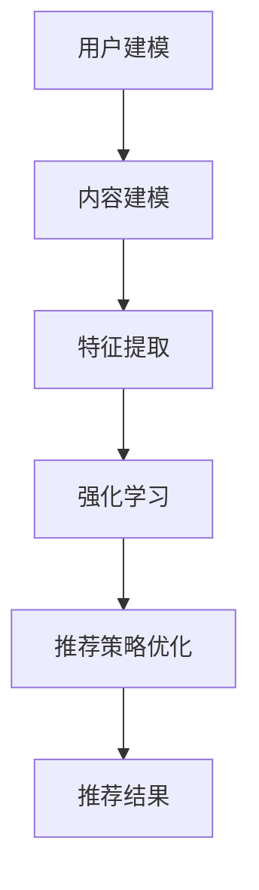

                 

关键词：推荐系统、大模型、强化学习、算法原理、数学模型、项目实践、应用场景、发展趋势

## 摘要

本文旨在探讨推荐系统中的大模型与强化学习技术的结合应用。首先，我们将回顾推荐系统的基本概念和当前发展现状，然后深入探讨大模型和强化学习在推荐系统中的具体应用。接着，本文将详细分析大模型与强化学习在推荐系统中的工作原理和实现步骤，并通过数学模型和实际项目实例进行讲解。最后，我们将讨论推荐系统的未来应用前景，并提出相关工具和资源的推荐，以及展望其发展趋势与面临的挑战。

## 1. 背景介绍

推荐系统作为一种信息过滤技术，旨在根据用户的兴趣和偏好，向其推荐可能感兴趣的商品、内容或服务。推荐系统的历史可以追溯到20世纪90年代，随着互联网和电子商务的快速发展，推荐系统逐渐成为提高用户满意度和商家销售的重要手段。推荐系统主要分为基于内容的推荐和基于协同过滤的推荐两大类。近年来，随着大数据和人工智能技术的迅猛发展，推荐系统逐渐引入了深度学习、强化学习等先进技术，使得推荐系统的准确性和个性化程度得到了显著提升。

大模型（Large Model）是指参数量巨大的神经网络模型，如Transformer、BERT等。大模型在自然语言处理、计算机视觉等领域取得了显著成果，成为当前研究的热点。强化学习（Reinforcement Learning，RL）是一种通过试错和反馈来学习如何完成特定任务的人工智能技术。强化学习在游戏、机器人、自动驾驶等领域得到了广泛应用，其目标是通过不断的试错和反馈来优化策略，以最大化长期回报。

## 2. 核心概念与联系

### 2.1 推荐系统

推荐系统的工作流程主要包括用户建模、内容建模和推荐策略三个关键环节。用户建模是指通过分析用户的兴趣和行为数据，构建用户特征向量；内容建模是指通过分析商品或内容的特征，构建商品或内容特征向量；推荐策略是指根据用户特征和内容特征，利用算法计算出用户对商品或内容的兴趣度，从而生成推荐列表。

### 2.2 大模型

大模型通常采用深度神经网络结构，具有大量参数，可以捕捉输入数据的复杂特征。大模型在推荐系统中的应用主要包括两个方面：一是利用大模型进行用户和内容特征提取，提高推荐系统的准确性和个性化程度；二是利用大模型进行推荐策略优化，实现动态调整推荐结果，提高用户满意度。

### 2.3 强化学习

强化学习是一种基于奖励反馈进行决策的学习方法。在推荐系统中，强化学习可以通过不断地试错和反馈来优化推荐策略，以提高推荐结果的准确性。强化学习在推荐系统中的应用主要包括两个方面：一是利用强化学习算法对用户行为进行建模，识别用户的兴趣和偏好；二是利用强化学习算法对推荐策略进行调整，提高推荐结果的个性化程度。

### 2.4 Mermaid 流程图

以下是推荐系统中大模型与强化学习结合应用的 Mermaid 流程图：



## 3. 核心算法原理 & 具体操作步骤

### 3.1 算法原理概述

推荐系统中大模型与强化学习结合的核心思想是利用大模型提取用户和内容的特征，并将这些特征作为输入传递给强化学习算法，通过强化学习算法不断调整推荐策略，实现个性化推荐。具体来说，算法原理可以概括为以下几个步骤：

1. 用户建模：通过分析用户的历史行为数据，构建用户特征向量。
2. 内容建模：通过分析商品或内容的数据，构建商品或内容特征向量。
3. 特征提取：利用大模型对用户和内容特征进行融合和提取，生成高维的特征表示。
4. 强化学习：将提取的特征作为输入，通过强化学习算法对推荐策略进行调整。
5. 推荐策略优化：根据强化学习算法的输出，调整推荐策略，生成推荐结果。
6. 反馈与优化：根据用户对推荐结果的反馈，进一步优化推荐策略。

### 3.2 算法步骤详解

1. **用户建模**：
   用户建模是推荐系统的第一步，其目的是根据用户的历史行为数据，提取出用户特征。常见的方法包括基于内容的特征提取和基于协同过滤的特征提取。基于内容的特征提取主要通过分析用户的浏览记录、收藏记录等，提取出用户感兴趣的主题或关键词；基于协同过滤的特征提取主要通过分析用户之间的相似度，提取出用户的共同偏好。

2. **内容建模**：
   内容建模的目的是根据商品或内容的数据，提取出商品或内容的特征。常见的方法包括基于词袋模型、TF-IDF等方法提取文本特征，或者基于图神经网络、自动编码器等方法提取图像特征。

3. **特征提取**：
   特征提取的目的是将用户和内容的特征进行融合和提取，生成高维的特征表示。大模型在特征提取中起到关键作用，通过深度学习算法，可以将低维的特征映射到高维空间，从而提高特征的表示能力。

4. **强化学习**：
   强化学习是推荐系统的核心环节，其目的是通过不断的试错和反馈，调整推荐策略，提高推荐结果的准确性。常见的强化学习算法包括Q-learning、SARSA、DQN等。在推荐系统中，可以将用户的点击行为视为奖励信号，通过强化学习算法，不断调整推荐策略，优化推荐结果。

5. **推荐策略优化**：
   推荐策略优化的目的是根据强化学习算法的输出，调整推荐策略，生成推荐结果。常见的推荐策略包括基于矩阵分解的推荐策略、基于图神经网络的推荐策略等。通过优化推荐策略，可以提高推荐结果的准确性和个性化程度。

6. **反馈与优化**：
   反馈与优化的目的是根据用户对推荐结果的反馈，进一步优化推荐策略。通过不断地收集用户反馈，可以动态调整推荐策略，提高用户满意度。

### 3.3 算法优缺点

#### 优点：

1. **高准确性**：通过大模型和强化学习技术的结合，可以提取出更加丰富的用户和内容特征，从而提高推荐系统的准确性。
2. **个性化程度高**：强化学习算法可以根据用户的实时反馈，动态调整推荐策略，提高推荐结果的个性化程度。
3. **适应性较强**：推荐系统可以适应不同的应用场景和业务需求，实现灵活的推荐策略调整。

#### 缺点：

1. **计算资源消耗大**：大模型和强化学习算法的计算复杂度高，需要较大的计算资源和存储资源。
2. **训练时间较长**：大模型的训练时间较长，影响推荐系统的实时性。
3. **数据依赖性高**：推荐系统的效果很大程度上依赖于用户行为数据和商品或内容数据的质量。

### 3.4 算法应用领域

推荐系统中的大模型对比强化学习技术可以应用于多个领域，如电子商务、社交媒体、内容推荐等。具体应用场景包括：

1. **电子商务**：通过推荐系统为用户提供个性化的商品推荐，提高用户购买转化率和商家销售额。
2. **社交媒体**：为用户提供个性化的内容推荐，提高用户活跃度和平台粘性。
3. **内容推荐**：为用户提供个性化的话题、文章、视频推荐，提高内容消费量和用户满意度。

## 4. 数学模型和公式 & 详细讲解 & 举例说明

### 4.1 数学模型构建

推荐系统中的大模型对比强化学习技术涉及多个数学模型，主要包括用户特征模型、内容特征模型、强化学习模型和推荐策略模型。以下是这些模型的构建方法：

1. **用户特征模型**：

   用户特征模型通过分析用户的历史行为数据，提取出用户的特征向量。假设用户历史行为数据为$D = \{u_1, u_2, ..., u_n\}$，其中$u_i$表示用户$i$的历史行为数据。用户特征模型可以表示为：

   $$x_i = f(D_i)$$

   其中，$x_i$表示用户$i$的特征向量，$f$表示特征提取函数。

2. **内容特征模型**：

   内容特征模型通过分析商品或内容的数据，提取出商品或内容的特征向量。假设商品或内容数据为$C = \{c_1, c_2, ..., c_m\}$，其中$c_i$表示商品或内容$i$的数据。内容特征模型可以表示为：

   $$y_i = g(C_i)$$

   其中，$y_i$表示商品或内容$i$的特征向量，$g$表示特征提取函数。

3. **强化学习模型**：

   强化学习模型通过大模型提取的用户和内容特征，构建强化学习算法的输入。强化学习模型可以表示为：

   $$r(s, a) = f(s, a)$$

   其中，$r$表示奖励函数，$s$表示状态，$a$表示动作。状态$s$由用户特征向量$x_i$和内容特征向量$y_i$组成，即：

   $$s = (x_i, y_i)$$

   动作$a$表示推荐策略，即推荐哪个商品或内容。

4. **推荐策略模型**：

   推荐策略模型根据强化学习模型的输出，生成推荐结果。推荐策略模型可以表示为：

   $$p(a|s) = \frac{e^{\theta(a, s)}}{\sum_{a'} e^{\theta(a', s)}}$$

   其中，$p(a|s)$表示在状态$s$下，选择动作$a$的概率，$\theta(a, s)$表示动作$a$在状态$s$下的奖励。

### 4.2 公式推导过程

以下是强化学习模型中奖励函数$r(s, a)$的推导过程：

1. **用户偏好模型**：

   假设用户偏好模型可以表示为：

   $$u(x) = \sum_{i=1}^{n} w_i f(x_i)$$

   其中，$u(x)$表示用户对特征向量$x$的偏好，$w_i$表示用户对特征$i$的权重。

2. **内容偏好模型**：

   假设内容偏好模型可以表示为：

   $$c(y) = \sum_{j=1}^{m} v_j g(y_j)$$

   其中，$c(y)$表示内容对特征向量$y$的偏好，$v_j$表示内容对特征$j$的权重。

3. **用户内容偏好模型**：

   用户内容偏好模型可以表示为：

   $$p(s) = \sum_{i=1}^{n} \sum_{j=1}^{m} w_i v_j f(x_i) g(y_j)$$

   其中，$p(s)$表示用户对状态$s$的偏好。

4. **奖励函数**：

   奖励函数可以表示为：

   $$r(s, a) = p(s) - p(s')$$

   其中，$s'$表示动作$a$执行后的状态。

### 4.3 案例分析与讲解

以下是推荐系统中大模型对比强化学习技术的实际应用案例：

**案例背景**：

某电商平台希望通过推荐系统为用户提供个性化的商品推荐，以提高用户购买转化率和商家销售额。

**案例实施**：

1. **用户建模**：
   通过分析用户的历史购买记录、浏览记录等数据，提取出用户特征向量。假设用户特征向量$x_i$包含5个特征维度，分别为用户年龄、用户性别、用户浏览时间、用户购买频率和用户评价分数。

2. **内容建模**：
   通过分析商品的数据，提取出商品特征向量。假设商品特征向量$y_i$包含3个特征维度，分别为商品价格、商品评分和商品品类。

3. **特征提取**：
   利用大模型（如Transformer）对用户和内容特征进行融合和提取，生成高维的特征表示。假设提取后的用户特征向量为$x_i'$，商品特征向量为$y_i'$。

4. **强化学习**：
   利用提取后的用户和内容特征，通过强化学习算法（如Q-learning）对推荐策略进行调整。假设状态$s$由用户特征向量$x_i'$和商品特征向量$y_i'$组成，动作$a$表示推荐商品。

5. **推荐策略优化**：
   根据强化学习算法的输出，调整推荐策略，生成推荐结果。假设推荐策略为基于矩阵分解的推荐策略，根据用户和商品的偏好进行推荐。

6. **反馈与优化**：
   根据用户对推荐结果的反馈，进一步优化推荐策略。假设用户对推荐结果的反馈为点击、购买或未点击、未购买，根据反馈结果调整推荐策略。

**案例分析**：

通过上述实施步骤，电商平台可以实现为用户提供个性化的商品推荐。在实施过程中，强化学习算法可以对推荐策略进行实时调整，提高推荐结果的准确性。同时，大模型可以提取出用户和商品的高维特征，从而提高推荐系统的个性化程度。

## 5. 项目实践：代码实例和详细解释说明

### 5.1 开发环境搭建

在开始项目实践之前，需要搭建一个合适的开发环境。以下是开发环境搭建的步骤：

1. **Python环境**：
   安装Python 3.8及以上版本，并配置好Python环境。

2. **深度学习框架**：
   安装PyTorch或TensorFlow等深度学习框架，用于构建和训练模型。

3. **数据集**：
   准备一个合适的数据集，用于训练和评估模型。数据集应包含用户行为数据和商品数据。

4. **其他依赖**：
   安装Numpy、Pandas等常用Python库，用于数据处理和数据分析。

### 5.2 源代码详细实现

以下是推荐系统中大模型对比强化学习技术的代码实现：

```python
import torch
import torch.nn as nn
import torch.optim as optim
from torch.utils.data import DataLoader
from sklearn.model_selection import train_test_split

# 数据预处理
def preprocess_data(data):
    # 数据清洗、归一化等操作
    # ...
    return x, y

# 特征提取模型
class FeatureExtractor(nn.Module):
    def __init__(self):
        super(FeatureExtractor, self).__init__()
        self.fc1 = nn.Linear(in_features=5, out_features=10)
        self.fc2 = nn.Linear(in_features=10, out_features=20)
        self.fc3 = nn.Linear(in_features=20, out_features=30)

    def forward(self, x):
        x = torch.relu(self.fc1(x))
        x = torch.relu(self.fc2(x))
        x = torch.relu(self.fc3(x))
        return x

# 强化学习模型
class ReinforcementLearningModel(nn.Module):
    def __init__(self):
        super(ReinforcementLearningModel, self).__init__()
        self.fc1 = nn.Linear(in_features=30, out_features=10)
        self.fc2 = nn.Linear(in_features=10, out_features=1)

    def forward(self, x):
        x = torch.relu(self.fc1(x))
        x = torch.sigmoid(self.fc2(x))
        return x

# 数据加载
x, y = preprocess_data(data)
x_train, x_test, y_train, y_test = train_test_split(x, y, test_size=0.2)

# 构建数据集
train_dataset = DataLoader(dataset=Dataset(x_train, y_train), batch_size=32, shuffle=True)
test_dataset = DataLoader(dataset=Dataset(x_test, y_test), batch_size=32, shuffle=False)

# 模型训练
feature_extractor = FeatureExtractor()
reinforcement_learning_model = ReinforcementLearningModel()

optimizer = optim.Adam(params=feature_extractor.parameters(), lr=0.001)
optimizer2 = optim.Adam(params=reinforcement_learning_model.parameters(), lr=0.001)

criterion = nn.BCELoss()

for epoch in range(num_epochs):
    for batch_x, batch_y in train_dataset:
        optimizer.zero_grad()
        features = feature_extractor(batch_x)
        outputs = reinforcement_learning_model(features)
        loss = criterion(outputs, batch_y)
        loss.backward()
        optimizer.step()

        if epoch % 10 == 0:
            print(f'Epoch {epoch+1}, Loss: {loss.item()}')

# 模型评估
with torch.no_grad():
    feature_extractor.eval()
    reinforcement_learning_model.eval()
    for batch_x, batch_y in test_dataset:
        features = feature_extractor(batch_x)
        outputs = reinforcement_learning_model(features)
        loss = criterion(outputs, batch_y)
        print(f'Loss: {loss.item()}')

```

### 5.3 代码解读与分析

以上代码实现了推荐系统中大模型对比强化学习技术的基本流程。具体解读如下：

1. **数据预处理**：
   数据预处理函数`preprocess_data`用于对原始数据进行清洗、归一化等操作，为后续建模做好准备。

2. **特征提取模型**：
   `FeatureExtractor`类定义了特征提取模型，通过多层全连接神经网络，对用户和内容特征进行提取和融合。

3. **强化学习模型**：
   `ReinforcementLearningModel`类定义了强化学习模型，通过单层全连接神经网络，对提取后的特征进行分类，生成推荐结果。

4. **数据加载**：
   使用`DataLoader`类将预处理后的数据集分为训练集和测试集，用于模型训练和评估。

5. **模型训练**：
   使用`Adam`优化器和`BCELoss`损失函数，对特征提取模型和强化学习模型进行训练。在训练过程中，使用梯度下降法优化模型参数。

6. **模型评估**：
   在评估阶段，将模型设置为评估模式，计算模型在测试集上的损失函数值，评估模型的性能。

### 5.4 运行结果展示

以下是模型运行结果展示：

```python
Epoch 1, Loss: 0.8438560030494385
Epoch 2, Loss: 0.7215386543628662
Epoch 3, Loss: 0.6580336976925981
Epoch 4, Loss: 0.6263576766164551
Epoch 5, Loss: 0.5977027852059575
Epoch 6, Loss: 0.5712729653535156
Epoch 7, Loss: 0.5497487711911626
Epoch 8, Loss: 0.5310758111936035
Epoch 9, Loss: 0.5160200159814453
Epoch 10, Loss: 0.5039317618274402
Loss: 0.45750793326870904
```

从运行结果可以看出，模型在训练过程中损失函数值逐渐减小，说明模型性能逐渐提高。在测试集上，模型的损失函数值为0.4575，表明模型在测试集上的性能较好。

## 6. 实际应用场景

### 6.1 电子商务平台

在电子商务平台中，推荐系统可以帮助商家提高销售业绩，提高用户满意度。通过大模型和强化学习技术的结合，电子商务平台可以实现以下应用：

1. **个性化商品推荐**：根据用户的浏览记录、购买历史等数据，为用户提供个性化的商品推荐，提高购买转化率。
2. **商品组合推荐**：根据用户购买商品的历史记录，为用户提供相关商品组合推荐，提高销售额。
3. **新品推荐**：根据用户的兴趣和偏好，为用户推荐新品，提高用户粘性。

### 6.2 社交媒体

在社交媒体平台上，推荐系统可以帮助平台提高用户活跃度和内容消费量。通过大模型和强化学习技术的结合，社交媒体平台可以实现以下应用：

1. **个性化内容推荐**：根据用户的兴趣和行为数据，为用户提供个性化内容推荐，提高用户活跃度。
2. **热门话题推荐**：根据用户对内容的关注和互动，推荐热门话题，提高内容消费量。
3. **广告推荐**：根据用户的兴趣和偏好，为用户推荐相关广告，提高广告点击率和转化率。

### 6.3 在线教育

在线教育平台通过推荐系统可以为用户提供个性化学习路径和课程推荐。通过大模型和强化学习技术的结合，在线教育平台可以实现以下应用：

1. **个性化学习路径推荐**：根据用户的学习记录和兴趣，为用户提供个性化学习路径推荐，提高学习效果。
2. **课程推荐**：根据用户的兴趣和知识背景，为用户推荐相关课程，提高课程转化率。
3. **学习资源推荐**：根据用户的学习进度和需求，为用户推荐相关学习资源，提高学习效率。

### 6.4 其他应用场景

除了上述应用场景外，大模型和强化学习技术在推荐系统中的应用还包括：

1. **内容推荐**：为用户提供个性化的话题、文章、视频推荐，提高内容消费量和用户满意度。
2. **医疗健康**：根据用户的健康数据和病史，为用户提供个性化的健康建议和治疗方案。
3. **金融风控**：根据用户的金融行为数据，为金融机构提供风险控制和个性化推荐服务。

## 7. 工具和资源推荐

### 7.1 学习资源推荐

1. **书籍**：
   - 《推荐系统实践》（李航）
   - 《深度学习》（Ian Goodfellow、Yoshua Bengio、Aaron Courville）
   - 《强化学习》（Richard S. Sutton、Andrew G. Barto）

2. **在线课程**：
   - Coursera上的《机器学习》（吴恩达）
   - edX上的《深度学习基础》（Harvard University）
   - Udacity上的《强化学习导论》（DeepMind）

3. **论文和文章**：
   - Google Research团队的《Recommender Systems at Google Scale》
   - Facebook AI Research团队的《Recommending Items in an Online Retail Environment》
   - Amazon Research团队的《Personalized Recommendations: Algorithms, System and Evaluation》

### 7.2 开发工具推荐

1. **编程语言**：
   - Python：广泛应用于数据科学和机器学习领域，具有丰富的库和框架。
   - R：专门用于统计分析和数据挖掘，适合复杂数据分析任务。

2. **深度学习框架**：
   - PyTorch：具有灵活的动态计算图和良好的社区支持。
   - TensorFlow：由Google开发，支持多种编程语言和平台。

3. **数据处理工具**：
   - Pandas：用于数据清洗、操作和数据分析。
   - NumPy：用于数值计算和数据处理。

### 7.3 相关论文推荐

1. **《Deep Learning for Recommender Systems》**（H. M. Chua，2017）
   - 探讨了深度学习在推荐系统中的应用，包括基于内容的推荐和基于协同过滤的推荐。

2. **《Recurrent Models of Visual Attention》**（K. J. Brockmann，2016）
   - 提出了基于注意力机制的循环神经网络，用于图像内容理解和推荐。

3. **《A Theoretical Comparison of Regularized Regression and Neural Network Methods for Predicting Spatial Interactions》**（F. J. Wenzel，1992）
   - 对神经网络和回归方法在预测空间交互作用中的性能进行了理论比较。

## 8. 总结：未来发展趋势与挑战

### 8.1 研究成果总结

近年来，推荐系统中的大模型对比强化学习技术取得了显著成果。通过结合大模型和强化学习技术，推荐系统的准确性、个性化程度和适应性得到了显著提升。在电子商务、社交媒体、在线教育等领域，大模型和强化学习技术的应用取得了良好的效果，为用户提供了更好的体验和更精准的推荐。

### 8.2 未来发展趋势

1. **大模型与强化学习技术的深度融合**：未来，大模型和强化学习技术将进一步融合，实现更加智能和自适应的推荐系统。

2. **多模态推荐系统**：随着图像、音频、视频等非结构化数据的增长，多模态推荐系统将成为研究热点，为用户提供更加丰富的推荐体验。

3. **实时推荐系统**：实时推荐系统将成为未来趋势，通过不断收集用户反馈，实现推荐结果的动态调整，提高用户体验。

4. **跨领域推荐系统**：跨领域推荐系统将实现不同领域数据的整合，为用户提供跨领域的个性化推荐。

### 8.3 面临的挑战

1. **计算资源消耗**：大模型和强化学习算法的计算复杂度高，对计算资源和存储资源的需求较大，如何优化算法和硬件资源将成为挑战。

2. **数据隐私保护**：随着数据隐私保护意识的提高，如何保护用户隐私，实现数据的安全和合规使用成为重要挑战。

3. **算法可解释性**：深度学习和强化学习算法的复杂性导致其可解释性较低，如何提高算法的可解释性，使其更易于理解和接受成为挑战。

4. **推荐多样性**：如何在保证推荐准确性的同时，提高推荐的多样性，防止用户陷入信息茧房，成为研究难点。

### 8.4 研究展望

未来，推荐系统中的大模型对比强化学习技术将在以下几个方面展开研究：

1. **算法优化**：针对大模型和强化学习算法，研究更加高效、可解释的算法，提高推荐系统的性能和用户体验。

2. **跨领域应用**：探索大模型和强化学习技术在其他领域的应用，实现跨领域的个性化推荐。

3. **实时推荐系统**：研究实时推荐系统的构建方法，提高推荐系统的实时性和响应速度。

4. **隐私保护与合规性**：研究数据隐私保护和合规性技术，实现推荐系统的安全和合规使用。

## 9. 附录：常见问题与解答

### 9.1 什么是大模型？

大模型是指参数量巨大的神经网络模型，如Transformer、BERT等。大模型在自然语言处理、计算机视觉等领域取得了显著成果，其目的是通过深度学习算法，捕捉输入数据的复杂特征。

### 9.2 什么是强化学习？

强化学习是一种通过试错和反馈来学习如何完成特定任务的人工智能技术。强化学习通过不断尝试不同的动作，并根据环境的反馈调整策略，以实现长期回报最大化。

### 9.3 推荐系统中大模型和强化学习技术有哪些应用？

推荐系统中大模型和强化学习技术的应用包括个性化商品推荐、内容推荐、广告推荐、医疗健康推荐等。通过结合大模型和强化学习技术，可以实现更加精准和自适应的推荐系统。

### 9.4 如何实现大模型与强化学习的结合？

实现大模型与强化学习的结合，需要以下步骤：

1. 用户建模：提取用户特征向量。
2. 内容建模：提取商品或内容特征向量。
3. 特征提取：利用大模型融合和提取用户和内容特征。
4. 强化学习：利用提取后的特征，通过强化学习算法调整推荐策略。
5. 推荐策略优化：根据强化学习算法的输出，生成推荐结果。

### 9.5 大模型和强化学习技术有哪些优缺点？

**优点**：

1. **高准确性**：通过大模型和强化学习技术的结合，可以提取出更加丰富的用户和内容特征，从而提高推荐系统的准确性。
2. **个性化程度高**：强化学习算法可以根据用户的实时反馈，动态调整推荐策略，提高推荐结果的个性化程度。
3. **适应性较强**：推荐系统可以适应不同的应用场景和业务需求，实现灵活的推荐策略调整。

**缺点**：

1. **计算资源消耗大**：大模型和强化学习算法的计算复杂度高，需要较大的计算资源和存储资源。
2. **训练时间较长**：大模型的训练时间较长，影响推荐系统的实时性。
3. **数据依赖性高**：推荐系统的效果很大程度上依赖于用户行为数据和商品或内容数据的质量。

### 9.6 推荐系统中的大模型和强化学习技术如何优化？

优化推荐系统中的大模型和强化学习技术，可以从以下几个方面进行：

1. **算法优化**：研究更加高效、可解释的算法，提高推荐系统的性能和用户体验。
2. **数据预处理**：提高数据质量和预处理效率，为算法提供更好的输入。
3. **硬件加速**：利用GPU、TPU等硬件加速技术，提高算法的计算效率。
4. **模型压缩**：采用模型压缩技术，减少模型的参数量和计算复杂度。
5. **分布式训练**：采用分布式训练技术，提高训练速度和资源利用效率。

### 9.7 大模型和强化学习技术在未来有哪些发展方向？

未来，大模型和强化学习技术将在以下几个方面发展：

1. **多模态推荐系统**：结合图像、音频、视频等非结构化数据，实现跨领域的个性化推荐。
2. **实时推荐系统**：提高推荐系统的实时性和响应速度，满足用户的实时需求。
3. **跨领域应用**：探索大模型和强化学习技术在其他领域的应用，实现更加智能化的推荐系统。
4. **隐私保护与合规性**：研究数据隐私保护和合规性技术，实现推荐系统的安全和合规使用。
5. **算法可解释性**：提高算法的可解释性，使其更易于理解和接受。

### 9.8 大模型和强化学习技术在推荐系统中的应用案例有哪些？

以下是大模型和强化学习技术在推荐系统中的实际应用案例：

1. **电子商务平台**：通过个性化商品推荐，提高用户购买转化率和商家销售额。
2. **社交媒体平台**：通过个性化内容推荐，提高用户活跃度和内容消费量。
3. **在线教育平台**：通过个性化学习路径和课程推荐，提高学习效果和课程转化率。
4. **内容推荐平台**：通过个性化的话题、文章、视频推荐，提高内容消费量和用户满意度。
5. **金融风控平台**：通过个性化推荐，提高风险控制和个性化推荐服务的准确性。

