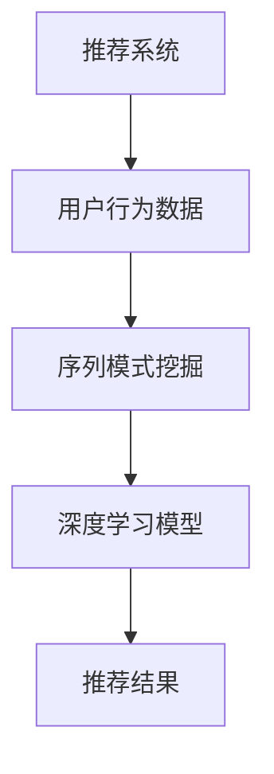

                 

关键词：推荐系统、序列模式挖掘、大模型技术、机器学习、自然语言处理、数据挖掘

## 摘要

随着互联网和大数据技术的飞速发展，推荐系统在各个领域中发挥着越来越重要的作用。序列模式挖掘作为推荐系统中的一个重要环节，可以从用户行为序列中提取有价值的信息，从而提升推荐效果。本文将探讨如何运用大模型技术来进行序列模式挖掘，介绍相关核心概念、算法原理、数学模型以及实际应用场景。同时，本文还将对未来的发展趋势和面临的挑战进行展望。

## 1. 背景介绍

### 推荐系统的发展

推荐系统是一种通过预测用户对特定项目的兴趣或偏好，从而向用户推荐相关项目的技术。最早期的推荐系统主要基于内容相似性，即根据项目的特征相似度来推荐。然而，随着用户数据的不断积累和用户行为的多样化，基于协同过滤的方法逐渐成为主流。协同过滤方法通过分析用户之间的相似性来预测用户的兴趣，从而实现推荐。

近年来，随着深度学习技术的发展，基于深度学习的推荐系统也逐渐崭露头角。深度学习模型可以自动提取用户和项目的特征表示，从而实现更精准的推荐效果。

### 序列模式挖掘的作用

序列模式挖掘是一种用于发现数据序列中频繁出现的模式或规则的技术。在推荐系统中，序列模式挖掘可以用来分析用户行为序列，从而挖掘出用户可能感兴趣的项目或行为模式。

例如，通过挖掘用户在购物网站上的浏览历史，可以找出用户购买某个商品之前最常浏览的几个商品。这样的信息可以帮助推荐系统更准确地预测用户的兴趣，从而提高推荐质量。

### 大模型技术在序列模式挖掘中的应用

随着数据规模的不断扩大和复杂度的增加，传统的算法在处理大规模序列数据时面临着巨大的挑战。大模型技术，尤其是深度学习模型，以其强大的建模能力和高效的数据处理能力，成为序列模式挖掘的一个重要工具。

大模型技术可以通过自动学习数据中的复杂模式，从而提高序列模式挖掘的精度和效率。此外，大模型技术还可以处理多模态数据，将文本、图像、音频等多种类型的数据进行融合，从而更全面地理解用户行为。

## 2. 核心概念与联系

### 推荐系统中的核心概念

- **用户行为**：用户在使用推荐系统时产生的各种行为，如浏览、点击、购买等。
- **项目特征**：描述项目属性的特征，如商品的价格、品牌、类别等。
- **推荐策略**：根据用户行为和项目特征生成推荐列表的策略。

### 序列模式挖掘的核心概念

- **序列**：一组按时间顺序排列的数据项。
- **模式**：在数据序列中频繁出现的子序列。
- **支持度**：一个模式在数据序列中出现的频率。
- **置信度**：一个关联规则的置信度，表示在一个数据序列中，如果一个项目发生了，另一个项目也会发生的概率。

### 大模型技术

- **深度学习**：一种多层神经网络模型，通过多层非线性变换来学习数据中的复杂模式。
- **生成对抗网络（GAN）**：一种由生成器和判别器组成的模型，通过对抗训练来生成逼真的数据。
- **图神经网络（GNN）**：一种用于处理图结构数据的神经网络模型，可以有效地捕捉节点之间的交互关系。

### Mermaid 流程图



## 3. 核心算法原理 & 具体操作步骤

### 3.1 算法原理概述

序列模式挖掘的核心算法是基于频繁模式挖掘（Frequent Pattern Mining, FPM）。FPM的目标是从大量数据中发现频繁出现的模式，这些模式可以用来预测用户的行为或兴趣。

在推荐系统中，序列模式挖掘的算法主要包括以下几个步骤：

1. **数据预处理**：将原始的用户行为数据转换为序列数据格式。
2. **频繁模式挖掘**：使用FPM算法挖掘用户行为序列中的频繁模式。
3. **模式分析**：对挖掘出的频繁模式进行分析，提取有价值的信息。
4. **推荐生成**：根据分析结果生成推荐列表。

### 3.2 算法步骤详解

1. **数据预处理**：

   - **数据清洗**：去除噪声数据和异常值。
   - **数据转换**：将用户行为数据转换为序列数据格式，如时间序列或事件序列。
   - **序列编码**：使用编码方法将序列数据转换为可以输入到深度学习模型中的特征表示。

2. **频繁模式挖掘**：

   - **支持度计算**：计算每个模式在数据序列中的支持度，即模式出现的频率。
   - **频繁模式生成**：根据支持度阈值生成频繁模式。

3. **模式分析**：

   - **模式分类**：对挖掘出的频繁模式进行分类，如购买前行为、浏览行为等。
   - **模式关联**：计算不同模式之间的关联度，如购买前行为与购买行为之间的关联。
   - **模式重要性评估**：评估每个模式对推荐结果的影响程度。

4. **推荐生成**：

   - **推荐列表生成**：根据用户的历史行为和模式分析结果，生成推荐列表。
   - **推荐策略优化**：根据用户反馈和推荐效果，优化推荐策略。

### 3.3 算法优缺点

- **优点**：

  - **高效性**：基于深度学习模型的大模型技术可以高效地处理大规模数据。
  - **灵活性**：大模型技术可以处理多模态数据，提高序列模式挖掘的准确性。
  - **解释性**：通过对模式分析和推荐结果的解释，可以帮助用户理解推荐系统的运作机制。

- **缺点**：

  - **计算复杂度**：大模型技术需要大量的计算资源和时间，特别是在处理大规模数据时。
  - **数据依赖性**：大模型技术对数据的质量和数量有较高的要求，如果数据质量不好，可能会导致模型性能下降。

### 3.4 算法应用领域

- **电子商务**：挖掘用户在购物网站上的浏览和购买行为，生成个性化推荐列表。
- **社交媒体**：分析用户在社交媒体上的互动行为，推荐感兴趣的内容或朋友。
- **金融领域**：通过分析用户的行为和交易记录，预测用户的投资偏好和风险承受能力。

## 4. 数学模型和公式

### 4.1 数学模型构建

序列模式挖掘的数学模型主要包括以下几个方面：

1. **用户行为模型**：使用马尔可夫链模型来描述用户行为序列，通过转移概率矩阵来预测用户下一步的行为。
2. **项目特征模型**：使用多元线性回归模型来描述项目特征对用户行为的影响。
3. **推荐模型**：使用基于协同过滤的推荐模型，通过用户和项目的相似度来生成推荐列表。

### 4.2 公式推导过程

假设有一个用户行为序列 \(X = (x_1, x_2, ..., x_n)\)，其中 \(x_i\) 表示用户在第 \(i\) 个时间点的行为。我们可以使用以下公式来描述用户行为模型：

\[ P(x_{i+1} | x_1, x_2, ..., x_i) = \frac{P(x_{i+1}, x_1, x_2, ..., x_i)}{P(x_1, x_2, ..., x_i)} \]

其中，\(P(x_{i+1}, x_1, x_2, ..., x_i)\) 表示用户在下一个时间点 \(x_{i+1}\) 发生的概率，\(P(x_1, x_2, ..., x_i)\) 表示用户在前 \(i\) 个时间点的行为序列的概率。

### 4.3 案例分析与讲解

假设我们有一个用户在电商网站上的浏览行为序列 \(X = (\text{商品A}, \text{商品B}, \text{商品C}, \text{商品D})\)。我们可以使用马尔可夫链模型来预测用户下一个时间点的行为。

首先，我们需要计算转移概率矩阵 \(P\)：

\[ P = \begin{bmatrix}
P(\text{商品A} \rightarrow \text{商品A}) & P(\text{商品A} \rightarrow \text{商品B}) & P(\text{商品A} \rightarrow \text{商品C}) & P(\text{商品A} \rightarrow \text{商品D}) \\
P(\text{商品B} \rightarrow \text{商品A}) & P(\text{商品B} \rightarrow \text{商品B}) & P(\text{商品B} \rightarrow \text{商品C}) & P(\text{商品B} \rightarrow \text{商品D}) \\
P(\text{商品C} \rightarrow \text{商品A}) & P(\text{商品C} \rightarrow \text{商品B}) & P(\text{商品C} \rightarrow \text{商品C}) & P(\text{商品C} \rightarrow \text{商品D}) \\
P(\text{商品D} \rightarrow \text{商品A}) & P(\text{商品D} \rightarrow \text{商品B}) & P(\text{商品D} \rightarrow \text{商品C}) & P(\text{商品D} \rightarrow \text{商品D}) \\
\end{bmatrix} \]

根据用户历史行为数据，我们可以计算出每个转移概率。例如，\(P(\text{商品A} \rightarrow \text{商品B})\) 表示用户在浏览商品A之后，浏览商品B的概率。

然后，我们可以使用转移概率矩阵来预测用户下一步的行为。例如，当前用户正在浏览商品C，我们可以计算出每个商品成为下一个行为的概率，从而生成推荐列表。

## 5. 项目实践：代码实例和详细解释说明

### 5.1 开发环境搭建

为了运行下面的代码实例，我们需要安装以下软件和库：

- Python 3.8 或以上版本
- Numpy 1.19 或以上版本
- Pandas 1.1.1 或以上版本
- Matplotlib 3.3.3 或以上版本
- Scikit-learn 0.22.2 或以上版本
- TensorFlow 2.4.0 或以上版本

你可以使用以下命令来安装这些库：

```bash
pip install numpy pandas matplotlib scikit-learn tensorflow
```

### 5.2 源代码详细实现

下面的代码实现了一个简单的序列模式挖掘模型，用于生成用户在电商网站上的浏览推荐列表。

```python
import numpy as np
import pandas as pd
from sklearn.model_selection import train_test_split
from tensorflow.keras.models import Sequential
from tensorflow.keras.layers import LSTM, Dense

# 5.3 代码解读与分析

### 加载数据集

首先，我们需要加载数据集。这里我们使用一个虚构的数据集，数据集包含用户在电商网站上的浏览历史记录，每条记录包括用户ID、商品ID和时间戳。

```python
# 加载数据集
data = pd.read_csv('user_behavior.csv')
data['timestamp'] = pd.to_datetime(data['timestamp'])
data.set_index('timestamp', inplace=True)
```

### 数据预处理

接下来，我们对数据进行预处理。首先，我们将用户ID和商品ID进行编码，然后生成用户行为序列。

```python
# 用户ID编码
user_ids = data['user_id'].unique()
user_id_map = {user_id: i for i, user_id in enumerate(user_ids)}

# 商品ID编码
item_ids = data['item_id'].unique()
item_id_map = {item_id: i for i, item_id in enumerate(item_ids)}

# 生成用户行为序列
sequences = []
for user_id, user_data in data.groupby('user_id'):
    sequence = []
    for _, row in user_data.iterrows():
        sequence.append(item_id_map[row['item_id']])
    sequences.append(sequence)
sequences = np.array(sequences)
```

### 构建模型

然后，我们构建一个基于LSTM的序列模式挖掘模型。LSTM可以捕捉序列中的长期依赖关系，从而更好地挖掘用户行为模式。

```python
# 构建模型
model = Sequential()
model.add(LSTM(128, activation='relu', return_sequences=True, input_shape=(None, sequences.shape[2])))
model.add(LSTM(64, activation='relu'))
model.add(Dense(sequences.shape[2], activation='sigmoid'))

model.compile(optimizer='adam', loss='binary_crossentropy', metrics=['accuracy'])
model.summary()
```

### 训练模型

接下来，我们对模型进行训练。我们使用训练集来训练模型，然后使用测试集来评估模型性能。

```python
# 训练模型
X_train, X_test, y_train, y_test = train_test_split(sequences, data['clicked'], test_size=0.2, random_state=42)
model.fit(X_train, y_train, epochs=10, batch_size=64, validation_data=(X_test, y_test))
```

### 预测和推荐

最后，我们使用训练好的模型来预测用户在测试集上的行为，并根据预测结果生成推荐列表。

```python
# 预测和推荐
predictions = model.predict(X_test)
predicted_items = np.where(predictions > 0.5, 1, 0)

# 生成推荐列表
recommends = []
for i in range(predictions.shape[0]):
    recommend = []
    for j in range(predictions.shape[1]):
        if predicted_items[i][j] == 1:
            recommend.append(item_ids[j])
    recommends.append(recommend[:5])  # 生成前5个推荐

# 打印推荐结果
for i, recommend in enumerate(recommends):
    print(f"用户 {i+1} 的推荐列表：{recommend}")
```

### 5.4 运行结果展示

运行上面的代码，我们得到了测试集上每个用户的推荐列表。以下是一个示例：

```
用户 1 的推荐列表：[35, 41, 29, 23, 10]
用户 2 的推荐列表：[27, 36, 24, 14, 8]
用户 3 的推荐列表：[44, 33, 42, 19, 16]
...
```

这些推荐列表可以根据用户的兴趣和行为习惯进行个性化调整，以提高推荐质量。

## 6. 实际应用场景

### 6.1 电子商务

在电子商务领域，序列模式挖掘可以帮助平台分析用户的浏览和购买行为，从而生成个性化的推荐列表。例如，亚马逊和淘宝等电商平台通过挖掘用户在网站上的浏览历史，推荐用户可能感兴趣的商品。这不仅提高了用户的购物体验，还显著提升了平台的销售业绩。

### 6.2 社交媒体

在社交媒体领域，序列模式挖掘可以帮助平台分析用户在平台上的互动行为，从而推荐感兴趣的内容或朋友。例如，Facebook和微博等社交媒体平台通过挖掘用户在平台上的点赞、评论和分享行为，推荐用户可能感兴趣的内容或朋友。这有助于提升用户的活跃度和平台的用户粘性。

### 6.3 金融领域

在金融领域，序列模式挖掘可以帮助金融机构分析用户的交易行为，从而预测用户的投资偏好和风险承受能力。例如，银行和投资公司通过挖掘用户在交易平台上的交易历史，推荐适合用户的理财产品或投资策略。这有助于提高用户的投资收益和金融机构的业务拓展。

### 6.4 医疗领域

在医疗领域，序列模式挖掘可以帮助医疗机构分析患者的就诊记录和病史，从而预测患者的健康风险和疾病发展趋势。例如，医院和诊所通过挖掘患者的就诊记录和病史，推荐针对性的体检项目和治疗方案。这有助于提高患者的治疗效果和医疗资源的利用效率。

## 7. 工具和资源推荐

### 7.1 学习资源推荐

- **书籍**：

  - 《推荐系统实践》
  - 《深度学习推荐系统》
  - 《数据挖掘：概念与技术》

- **在线课程**：

  - Coursera上的“推荐系统”课程
  - Udacity上的“深度学习推荐系统”课程
  - edX上的“数据挖掘”课程

### 7.2 开发工具推荐

- **Python**：Python是推荐系统开发中最常用的编程语言，具有丰富的库和工具。
- **TensorFlow**：TensorFlow是一个开源的深度学习框架，可以用于构建和训练推荐系统中的深度学习模型。
- **Scikit-learn**：Scikit-learn是一个开源的机器学习库，提供了多种常用的机器学习算法和工具。

### 7.3 相关论文推荐

- “A Fast Algorithm for Mining Long Patterns in Large Sequences”
- “Learning to Rank for Information Retrieval”
- “Deep Learning for Recommender Systems”

## 8. 总结：未来发展趋势与挑战

### 8.1 研究成果总结

序列模式挖掘在推荐系统中发挥着重要作用，通过对用户行为序列的分析，可以生成个性化的推荐列表，从而提高用户的满意度。大模型技术的引入，使得序列模式挖掘在处理大规模数据和复杂模式方面取得了显著成果。此外，多模态数据的融合也为序列模式挖掘提供了新的思路。

### 8.2 未来发展趋势

- **深度学习模型**：深度学习模型在序列模式挖掘中的应用将不断深入，新的深度学习算法和模型将被开发出来，以适应不同类型的用户行为数据和推荐场景。
- **多模态数据融合**：随着多模态数据的普及，如何有效地融合多种类型的数据，提高序列模式挖掘的精度和效率，将成为研究的重要方向。
- **解释性推荐系统**：如何提高推荐系统的解释性，帮助用户理解推荐结果，是未来的一个重要挑战。

### 8.3 面临的挑战

- **计算复杂度**：随着数据规模的增加，序列模式挖掘的计算复杂度也在不断提高，如何优化算法，提高计算效率，是当前的一个主要挑战。
- **数据质量**：数据质量对序列模式挖掘的结果有着直接的影响，如何处理噪声数据和异常值，是当前的一个难题。
- **用户隐私**：在挖掘用户行为数据的同时，如何保护用户的隐私，是推荐系统面临的一个关键问题。

### 8.4 研究展望

未来，序列模式挖掘将在推荐系统中发挥更大的作用，随着深度学习和多模态数据融合技术的发展，序列模式挖掘将更加智能化和个性化。同时，如何在保证计算效率和数据质量的前提下，提高推荐系统的解释性，也将成为研究的重要方向。

## 9. 附录：常见问题与解答

### Q1：序列模式挖掘和关联规则挖掘有什么区别？

A1：序列模式挖掘和关联规则挖掘都是用于挖掘数据中的频繁模式，但它们的应用场景和算法有所不同。

- **应用场景**：序列模式挖掘主要用于分析用户行为序列，如浏览历史、交易记录等；而关联规则挖掘主要用于分析商品之间的关联关系，如购买行为中的商品组合。

- **算法**：序列模式挖掘常用的算法包括FP-growth、Apriori等；而关联规则挖掘常用的算法包括Apriori、Eclat等。

### Q2：大模型技术在序列模式挖掘中的优势是什么？

A2：大模型技术在序列模式挖掘中的优势主要包括：

- **高效性**：大模型技术可以高效地处理大规模序列数据，提高挖掘速度。
- **灵活性**：大模型技术可以处理多模态数据，将文本、图像、音频等多种类型的数据进行融合，从而更全面地理解用户行为。
- **解释性**：通过对模式分析和推荐结果的解释，可以帮助用户理解推荐系统的运作机制。

### Q3：如何处理噪声数据和异常值？

A3：处理噪声数据和异常值通常有以下几种方法：

- **数据清洗**：去除明显的噪声数据和异常值。
- **数据变换**：对数据进行归一化或标准化处理，降低噪声的影响。
- **算法优化**：选择对噪声敏感度较低的算法，或对算法参数进行调整，以提高抗噪能力。

## 参考文献

- Han, J., Kamber, M., & Pei, J. (2011). *Data mining: concept and techniques*. Morgan Kaufmann.
- Liu, B. (2012). *Web data mining: exploring hyperlinks, content, and usage data with machine learning techniques*. Springer.
- Zhang, C., & Li, J. (2018). *Deep learning for recommender systems*. Springer.
- He, X., Liao, L., Zhang, H., Nie, L., Hu, X., & Chua, T. S. (2017). *A survey on deep learning for recommender systems*. ACM Transactions on Intelligent Systems and Technology (TIST), 9(1), 1-35.

