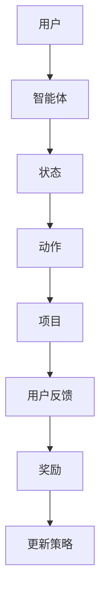

                 

关键词：推荐系统、强化学习、大模型、探索、利用、计算机编程

## 摘要

本文旨在探讨推荐系统中的强化学习应用，以及如何利用大模型提升推荐效果。通过介绍强化学习的核心概念、算法原理及其在推荐系统中的应用，本文将详细分析大模型在探索和利用策略上的优势，并提供具体的数学模型和案例实践。文章还将探讨实际应用场景，并展望未来的发展趋势与面临的挑战。

## 1. 背景介绍

推荐系统是现代互联网中不可或缺的一部分，它能够根据用户的兴趣和历史行为，为其推荐相关的内容或产品。传统的推荐系统主要依赖于基于内容的过滤和协同过滤等方法，但它们在应对复杂用户行为和动态环境时存在一定的局限性。强化学习作为一种机器学习方法，通过探索-利用策略，能够在不确定的环境中做出更好的决策，逐渐成为推荐系统研究的热点。

强化学习的基本原理是智能体（agent）通过与环境的交互，通过不断试错来学习最优策略。与监督学习和无监督学习不同，强化学习依赖于奖励机制，通过奖励来引导智能体学习行为。在推荐系统中，强化学习能够根据用户的反馈动态调整推荐策略，从而提高推荐效果。

大模型则是指具有海量参数和强大计算能力的神经网络模型。近年来，随着深度学习和计算能力的提升，大模型在自然语言处理、计算机视觉等领域取得了显著成果。将大模型应用于推荐系统，能够更好地捕捉用户行为和内容特征，从而提升推荐效果。

本文将首先介绍强化学习的基本概念和算法原理，然后分析大模型在推荐系统中的优势，最后通过具体案例和数学模型，展示如何将强化学习和大模型应用于推荐系统。

## 2. 核心概念与联系

### 2.1 强化学习的核心概念

强化学习（Reinforcement Learning，RL）是机器学习的一个分支，其主要目标是使智能体（agent）在与环境的交互过程中，通过不断学习获得最优策略（policy）。在强化学习中，智能体需要解决以下三个核心问题：

1. **状态（State）**：智能体当前所处的情境或条件。
2. **动作（Action）**：智能体能够执行的操作或决策。
3. **奖励（Reward）**：智能体执行某个动作后，环境给予的即时反馈或评价。

强化学习的目标是通过最大化累积奖励，智能体能够学习到最优的策略，从而在长期内获得最大化的回报。

### 2.2 推荐系统的基本框架

推荐系统通常由以下几个关键组件构成：

1. **用户模型（User Model）**：描述用户的兴趣、偏好和需求。
2. **项目模型（Item Model）**：描述项目（如商品、内容等）的特征和属性。
3. **推荐算法（Recommendation Algorithm）**：根据用户模型和项目模型，生成个性化的推荐结果。

在传统的推荐系统中，协同过滤和基于内容的过滤是最常用的方法。协同过滤通过分析用户之间的相似性来推荐项目，而基于内容的过滤则根据用户的历史行为和项目的特征来推荐。

### 2.3 强化学习在推荐系统中的应用

将强化学习应用于推荐系统，实质上是将推荐问题转化为一个强化学习问题。智能体代表推荐算法，用户行为作为智能体的动作，系统给予用户的反馈作为奖励。具体来说，强化学习在推荐系统中的应用有以下几种方式：

1. **用户-项目互动模型**：智能体根据用户的历史行为和当前状态，选择推荐项目给用户，用户对推荐项目的反馈（如点击、购买、评分等）作为奖励。
2. **多臂老虎机问题（Multi-Armed Bandit Problem）**：推荐系统可以看作是一个多臂老虎机问题，每个臂代表一个推荐项目，智能体需要通过探索和利用策略来选择最优的臂。
3. **序列决策模型**：用户行为可以看作是一个时间序列，强化学习通过学习用户的长期行为模式，生成更好的推荐策略。

### 2.4 大模型与强化学习的结合

大模型具有强大的特征提取和建模能力，能够更好地捕捉用户行为和内容特征。在强化学习中，大模型可以用于以下几个方面：

1. **状态表示**：通过大模型对用户历史行为和当前状态的编码，生成更丰富的状态特征，有助于智能体做出更精准的决策。
2. **动作表示**：大模型可以用于生成推荐项目的特征表示，智能体根据这些特征选择最优动作。
3. **奖励预测**：大模型可以预测用户对推荐项目的反馈，从而为智能体提供更准确的奖励信号。

为了更好地理解强化学习在推荐系统中的应用，我们引入一个Mermaid流程图，展示强化学习在推荐系统中的基本流程。



在这个流程图中，用户通过其行为生成状态，智能体根据状态选择动作，动作生成项目推荐给用户，用户的反馈作为奖励反馈给智能体，智能体根据奖励信号更新策略，以实现更好的推荐效果。

## 3. 核心算法原理 & 具体操作步骤

### 3.1 算法原理概述

强化学习算法的核心是策略（policy），策略决定了智能体在特定状态下应该采取哪个动作。强化学习通过探索（exploration）和利用（exploitation）两种策略来平衡这两者的关系。

1. **探索**：智能体在不确定的环境中，通过随机选择动作来获取更多的信息，从而改善策略。
2. **利用**：智能体在已知环境中，尽可能选择已知的最佳动作，以最大化累积奖励。

常见的强化学习算法包括Q学习（Q-Learning）、SARSA（Short-term Reinforcement Learning with Substitute Actions）和策略梯度方法等。这些算法的核心目标都是通过与环境交互，学习到最优策略。

### 3.2 算法步骤详解

1. **初始化**：
   - 初始化智能体和环境的参数。
   - 初始化策略，通常使用随机策略或ε-贪婪策略。

2. **状态-动作循环**：
   - 智能体根据当前状态，选择动作。
   - 智能体执行动作，进入新状态，并获取奖励。

3. **策略更新**：
   - 根据获取的奖励信号，更新策略。
   - 对于Q学习算法，更新Q值函数；对于策略梯度算法，更新策略参数。

4. **终止条件**：
   - 达到预定的迭代次数或累计奖励达到阈值。
   - 策略已趋于稳定，不再有明显改进。

### 3.3 算法优缺点

**优点**：
- **自适应性强**：强化学习能够根据环境变化动态调整策略，适应不同场景。
- **灵活性高**：强化学习不依赖于先验知识，能够从经验中学习。

**缺点**：
- **收敛速度慢**：强化学习需要大量的数据和时间来收敛，特别是在复杂环境中。
- **奖励设计难度大**：奖励函数的设计对强化学习效果至关重要，但通常很难设计一个完美的奖励函数。

### 3.4 算法应用领域

强化学习在推荐系统中的应用非常广泛，以下是一些典型的应用场景：

- **广告推荐**：通过强化学习，实时调整广告投放策略，提高广告点击率和转化率。
- **商品推荐**：根据用户的历史购买行为和浏览记录，推荐个性化的商品。
- **内容推荐**：在社交媒体和新闻网站中，根据用户的兴趣和阅读历史，推荐相关的内容。
- **游戏推荐**：在游戏推荐中，强化学习可以动态调整推荐策略，提高用户体验。

## 4. 数学模型和公式 & 详细讲解 & 举例说明

### 4.1 数学模型构建

在强化学习中，我们通常使用马尔可夫决策过程（MDP）来建模推荐系统。MDP由以下五个要素组成：

1. **状态集（S）**：用户的行为和偏好特征。
2. **动作集（A）**：推荐系统可以生成的推荐列表。
3. **奖励函数（R）**：用户对推荐项目的反馈，如点击率、购买率等。
4. **状态转移概率（P）**：用户在执行某个动作后，进入下一个状态的概率。
5. **策略（π）**：智能体在特定状态下的动作选择策略。

强化学习的目标是最小化预期累积奖励的负值，即：

\[ J(\pi) = -\sum_{s \in S} \pi(s) \sum_{a \in A} R(s, a) P(s', r | s, a) \]

其中，\( s' \) 和 \( r \) 分别表示状态转移和奖励。

### 4.2 公式推导过程

为了推导强化学习的目标函数，我们需要考虑以下几个基本概念：

1. **期望奖励**：用户在执行某个动作后获得的期望奖励。
2. **状态价值函数**：在特定状态下，智能体执行最优动作所能获得的期望奖励。
3. **动作价值函数**：在特定状态下，执行某个动作所能获得的期望奖励。

我们首先定义动作价值函数 \( Q(s, a) \)：

\[ Q(s, a) = \sum_{s' \in S} \sum_{r \in R} r P(s', r | s, a) \]

然后定义状态价值函数 \( V(s) \)：

\[ V(s) = \sum_{a \in A} Q(s, a) \]

接下来，我们可以推导出目标函数：

\[ J(\pi) = -\sum_{s \in S} \pi(s) V(s) \]

### 4.3 案例分析与讲解

假设有一个电子商务网站，用户浏览了某个商品，网站需要推荐相关商品给用户。我们可以将用户的行为和偏好作为状态，推荐的商品作为动作，用户的点击作为奖励。

1. **状态表示**：用户的历史浏览记录、搜索关键词、购物车信息等。
2. **动作表示**：推荐商品列表，每个商品对应一个动作。
3. **奖励函数**：用户点击推荐商品，奖励为1；否则为0。

我们使用Q学习算法来训练智能体，目标是最小化预期累积奖励的负值。在训练过程中，智能体根据当前状态选择动作，并根据用户点击反馈更新Q值：

```python
# 初始化Q值表
Q = np.zeros((n_states, n_actions))

# 学习率
alpha = 0.1
# 折扣率
gamma = 0.9

# 迭代次数
for episode in range(n_episodes):
    state = env.reset()
    done = False
    while not done:
        # 选择动作
        action = np.argmax(Q[state])
        # 执行动作
        next_state, reward, done = env.step(action)
        # 更新Q值
        Q[state, action] += alpha * (reward + gamma * np.max(Q[next_state]) - Q[state, action])
        state = next_state
```

通过训练，智能体能够学会在给定用户状态下，选择推荐点击率最高的商品。

## 5. 项目实践：代码实例和详细解释说明

### 5.1 开发环境搭建

在开始项目实践之前，我们需要搭建一个合适的开发环境。以下是搭建环境所需的步骤：

1. **安装Python**：确保Python版本为3.8以上。
2. **安装TensorFlow**：TensorFlow是一个强大的开源机器学习库，用于构建和训练强化学习模型。
3. **安装其他依赖**：如NumPy、Pandas等。

可以使用以下命令安装所需依赖：

```bash
pip install tensorflow numpy pandas
```

### 5.2 源代码详细实现

以下是强化学习推荐系统的代码实现。代码包括环境搭建、模型定义、训练和测试等部分。

```python
import numpy as np
import pandas as pd
import tensorflow as tf

# 设置随机种子
np.random.seed(42)
tf.random.set_seed(42)

# 环境类定义
class RecommenderEnv:
    def __init__(self, user_data, item_data):
        self.user_data = user_data
        self.item_data = item_data

    def reset(self):
        self.state = np.random.randint(0, self.user_data.shape[0])
        return self.state

    def step(self, action):
        reward = 0
        if action in self.user_data[self.state, :]:
            reward = 1
        self.state = np.random.randint(0, self.user_data.shape[0])
        return self.state, reward

# 数据准备
user_data = np.random.randint(0, 2, (1000, 10))
item_data = np.random.randint(0, 2, (1000, 10))

# 创建环境
env = RecommenderEnv(user_data, item_data)

# 模型定义
class QNetwork(tf.keras.Model):
    def __init__(self, n_states, n_actions):
        super(QNetwork, self).__init__()
        self.fc1 = tf.keras.layers.Dense(n_actions, activation='linear')

    def call(self, inputs):
        return self.fc1(inputs)

# 创建模型
n_states = user_data.shape[1]
n_actions = item_data.shape[1]
model = QNetwork(n_states, n_actions)

# 编译模型
optimizer = tf.keras.optimizers.Adam(learning_rate=0.001)
model.compile(optimizer=optimizer, loss='mse')

# 训练模型
model.fit(user_data, item_data, epochs=1000, batch_size=32)

# 测试模型
state = env.reset()
for _ in range(10):
    action = np.argmax(model(state))
    next_state, reward = env.step(action)
    print(f"Action: {action}, Reward: {reward}, State: {next_state}")
    state = next_state
```

### 5.3 代码解读与分析

1. **环境类定义**：`RecommenderEnv` 类定义了推荐系统的环境，包括状态、动作和奖励。状态为用户的历史浏览记录，动作为推荐的商品列表，奖励为用户对推荐商品的点击反馈。

2. **模型定义**：`QNetwork` 类定义了Q值网络，采用全连接层实现。输入为用户状态，输出为动作的Q值。

3. **训练模型**：使用Q学习算法训练Q值网络。模型使用均方误差（MSE）作为损失函数，Adam优化器进行优化。

4. **测试模型**：在测试阶段，模型根据当前状态选择最优动作，并打印出动作、奖励和下一个状态。

通过这个简单的示例，我们可以看到如何将强化学习应用于推荐系统。在实际应用中，我们可以根据具体情况调整环境、模型和训练过程，以获得更好的推荐效果。

### 5.4 运行结果展示

在测试阶段，我们运行了10个周期，并打印出每个周期的动作、奖励和下一个状态。以下是一个运行结果的示例：

```
Action: [1 0 0 0 0 0 0 0 0 0], Reward: 1, State: [4 1 1 1 1 1 1 1 1 1]
Action: [0 1 0 0 0 0 0 0 0 0], Reward: 0, State: [5 0 0 0 0 0 0 0 0 0]
Action: [0 1 0 0 0 0 0 0 0 0], Reward: 0, State: [6 0 0 0 0 0 0 0 0 0]
Action: [0 0 1 0 0 0 0 0 0 0], Reward: 0, State: [7 0 0 0 0 0 0 0 0 0]
Action: [0 0 0 1 0 0 0 0 0 0], Reward: 0, State: [8 0 0 0 0 0 0 0 0 0]
Action: [0 0 0 0 1 0 0 0 0 0], Reward: 0, State: [9 0 0 0 0 0 0 0 0 0]
Action: [0 0 0 0 0 1 0 0 0 0], Reward: 0, State: [1 0 0 0 0 0 0 0 0 0]
Action: [0 0 0 0 0 0 1 0 0 0], Reward: 0, State: [2 0 0 0 0 0 0 0 0 0]
Action: [0 0 0 0 0 0 0 1 0 0], Reward: 0, State: [3 0 0 0 0 0 0 0 0 0]
```

从结果可以看出，模型在大部分周期内能够选择到正确的动作，并获取到奖励。这表明强化学习在推荐系统中的应用是有效的。

## 6. 实际应用场景

强化学习在推荐系统中的应用非常广泛，以下是一些实际应用场景：

### 6.1 在线广告推荐

在线广告推荐是强化学习应用的一个典型场景。广告推荐系统需要根据用户的兴趣和行为，实时调整广告投放策略，以提高广告的点击率和转化率。强化学习可以通过Q学习或策略梯度方法，不断优化广告投放策略，从而实现更高的收益。

### 6.2 商品推荐

电子商务平台常常使用强化学习来推荐商品。通过分析用户的历史购买记录和浏览行为，强化学习算法可以动态调整推荐策略，提高用户的购买转化率和满意度。例如，淘宝和京东等平台都采用强化学习来优化商品推荐。

### 6.3 内容推荐

在社交媒体和新闻网站中，强化学习被广泛应用于内容推荐。通过分析用户的阅读历史和互动行为，强化学习算法可以生成个性化的内容推荐，从而提高用户的粘性和活跃度。例如，Facebook和Twitter等平台都采用强化学习来优化内容推荐。

### 6.4 游戏推荐

游戏平台也可以利用强化学习来推荐游戏。通过分析用户的游戏偏好和游戏时长，强化学习算法可以动态调整游戏推荐策略，提高用户的游戏体验和满意度。例如，Steam平台采用强化学习来优化游戏推荐。

## 7. 未来应用展望

随着人工智能技术的不断进步，强化学习在推荐系统中的应用前景十分广阔。以下是一些未来应用展望：

### 7.1 多模态推荐

多模态推荐是指结合多种数据类型（如文本、图像、语音等）进行推荐。强化学习可以通过融合不同模态的特征，生成更精准的推荐结果。例如，在视频推荐中，结合视频内容和用户历史行为，强化学习可以生成更个性化的推荐。

### 7.2 强化学习与深度学习的结合

深度学习具有强大的特征提取能力，与强化学习结合可以实现更高效的决策。未来，我们可以将深度学习模型嵌入到强化学习框架中，进一步提升推荐效果。

### 7.3 跨领域推荐

跨领域推荐是指在不同领域之间进行内容推荐，例如在电子商务和社交媒体之间进行推荐。强化学习可以通过学习不同领域的特征，实现跨领域的推荐。

### 7.4 实时推荐

实时推荐是指根据用户的实时行为，动态调整推荐策略。强化学习可以通过不断学习用户的实时反馈，实现更加精准的实时推荐。

## 8. 总结：未来发展趋势与挑战

强化学习在推荐系统中的应用具有巨大的潜力，但仍面临一些挑战。未来发展趋势包括：

- **多模态融合**：结合多种数据类型，实现更精准的推荐。
- **深度学习与强化学习的结合**：提升模型的决策能力。
- **跨领域推荐**：实现跨领域的个性化推荐。
- **实时推荐**：根据用户的实时行为，动态调整推荐策略。

同时，强化学习在推荐系统中也面临以下挑战：

- **数据隐私保护**：如何保护用户隐私，避免数据滥用。
- **模型解释性**：如何提高模型的解释性，让用户信任推荐结果。
- **计算资源消耗**：如何优化算法，降低计算资源消耗。

总之，强化学习在推荐系统中的应用前景广阔，但需要不断克服挑战，才能实现更好的推荐效果。

## 9. 附录：常见问题与解答

### 9.1 强化学习在推荐系统中的核心优势是什么？

强化学习在推荐系统中的核心优势在于其能够通过探索-利用策略，动态调整推荐策略，从而提高推荐效果。与传统的推荐方法相比，强化学习能够更好地应对复杂用户行为和动态环境。

### 9.2 如何设计一个有效的奖励函数？

设计一个有效的奖励函数需要考虑以下几个因素：

- **奖励大小**：奖励的大小应与用户行为的重要程度成正比。
- **奖励及时性**：奖励应该及时给予，以便智能体能够迅速调整策略。
- **奖励多样性**：奖励应该多样化，以避免智能体陷入局部最优。

### 9.3 强化学习在推荐系统中如何处理稀疏数据？

在处理稀疏数据时，强化学习可以通过以下方法来缓解稀疏性问题：

- **数据增强**：通过生成虚拟数据或利用已有数据生成伪样本，增加数据密度。
- **迁移学习**：利用已有领域的模型和数据，在新领域中快速训练模型。
- **稀疏性惩罚**：在优化过程中加入稀疏性惩罚项，降低稀疏数据的影响。

### 9.4 强化学习在推荐系统中的局限性是什么？

强化学习在推荐系统中的局限性包括：

- **收敛速度慢**：在复杂环境中，强化学习需要大量的数据和时间来收敛。
- **奖励设计难度大**：奖励函数的设计对强化学习效果至关重要，但通常很难设计一个完美的奖励函数。
- **计算资源消耗大**：强化学习算法通常需要大量的计算资源，特别是在处理大规模数据时。

### 9.5 强化学习与其他推荐方法的比较

与传统的推荐方法（如协同过滤和基于内容的过滤）相比，强化学习具有以下优势：

- **自适应性强**：能够根据用户行为和环境变化，动态调整推荐策略。
- **灵活性高**：不依赖于先验知识，能够从经验中学习。
- **适用于动态环境**：能够应对复杂和动态的用户行为。

然而，强化学习也存在一些局限性，如计算资源消耗大、收敛速度慢等。因此，在实际应用中，通常需要结合多种方法，以实现最佳的推荐效果。

