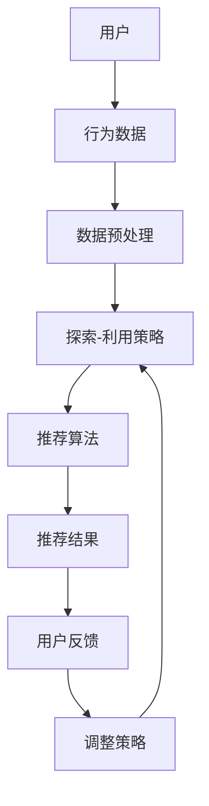

                 

关键词：推荐系统、探索与利用平衡、强化学习、算法优化、用户体验

摘要：推荐系统作为现代互联网的重要组成部分，旨在为用户提供个性化的内容推荐服务。然而，在实现个性化推荐的过程中，探索与利用平衡策略显得尤为重要。本文将深入探讨推荐系统中的探索与利用平衡策略，包括其核心概念、算法原理、数学模型及实际应用，旨在为相关领域的研究者和从业者提供有益的参考。

## 1. 背景介绍

随着互联网的迅猛发展和大数据技术的广泛应用，推荐系统已经成为了提高用户体验、增加用户粘性、实现商业价值的重要手段。推荐系统通过分析用户的历史行为、兴趣偏好以及内容特征，为用户生成个性化的推荐列表，从而使用户能够快速、高效地找到自己感兴趣的内容。

然而，推荐系统的效果不仅取决于其算法的精度，还取决于探索与利用平衡策略的制定。探索（Exploration）指的是尝试未知的、可能更优的推荐策略，以发现潜在的高质量内容；利用（Exploitation）则是指根据用户的历史行为选择当前最优的推荐策略，以最大化短期收益。如何平衡探索与利用，使得推荐系统能够在长期内为用户提供最佳的体验，是推荐系统研究中的关键问题。

## 2. 核心概念与联系

为了深入理解探索与利用平衡策略，我们首先需要明确以下核心概念：

### 探索（Exploration）

探索是指在不确定的情况下，尝试未知的策略，以期望发现更好的结果。在推荐系统中，探索意味着为用户提供不同类型的推荐，以发现用户尚未接触但可能感兴趣的内容。

### 利用（Exploitation）

利用则是在已知的策略中，选择最优的方案以最大化短期收益。在推荐系统中，利用意味着根据用户的以往行为选择那些已被证实是用户喜欢的推荐。

### 探索与利用平衡（Exploration-Exploitation Balance）

探索与利用平衡是指在推荐系统中，合理地分配探索和利用的比重，以实现长期最优效果。这种平衡不仅取决于推荐算法的优化，还需要考虑用户的实际需求和系统的运行环境。

接下来，我们将使用Mermaid流程图来展示推荐系统中探索与利用平衡的架构：



在上面的流程图中，用户行为数据经过预处理后，输入到探索-利用策略模块。该模块根据当前的状态选择探索或利用策略，然后输入到推荐算法模块生成推荐结果。用户对推荐结果的反馈会进一步调整探索-利用策略，从而实现动态平衡。

## 3. 核心算法原理 & 具体操作步骤

### 3.1 算法原理概述

探索与利用平衡策略的核心思想是通过动态调整探索和利用的比重，以实现推荐系统的长期最优效果。在推荐系统中，常见的探索与利用平衡算法包括ε-贪心算法（ε-Greedy Algorithm）、UCB算法（Upper Confidence Bound）和 Thompson 采样（Thompson Sampling）。

### 3.2 算法步骤详解

#### ε-贪心算法

ε-贪心算法是一种简单的探索与利用平衡策略。其基本思想是，在每次推荐时，以概率ε进行探索，以概率1-ε进行利用。

1. 初始化：设定ε的初始值（通常取0.1）。
2. 推荐阶段：对于每次推荐，以概率ε选择一个未推荐过的内容进行探索，以概率1-ε选择当前表现最佳的内容进行利用。
3. 用户反馈：根据用户对推荐内容的反馈调整ε值，通常随着用户反馈的增加，逐渐减小ε，以增强利用成分。

#### UCB算法

UCB算法是基于概率论的探索与利用平衡策略，其核心思想是，在每次推荐时，选择能够提供最大上置信界限的内容。

1. 初始化：为每个内容设定一个初始的期望值和计数器。
2. 推荐阶段：对于每个内容，计算其上置信界限（Upper Confidence Bound），选择具有最大上置信界限的内容进行推荐。
3. 用户反馈：根据用户对推荐内容的反馈更新每个内容的期望值和计数器。

#### Thompson 采样

Thompson 采样是一种基于概率模型的探索与利用平衡策略，其核心思想是，通过采样生成多个候选内容，并根据采样结果进行推荐。

1. 初始化：为每个内容设定一个初始的期望值和方差。
2. 推荐阶段：从每个内容的正态分布中采样，生成多个候选内容，选择其中表现最佳的内容进行推荐。
3. 用户反馈：根据用户对推荐内容的反馈更新每个内容的期望值和方差。

### 3.3 算法优缺点

#### ε-贪心算法

优点：实现简单，易于理解和实现。

缺点：在用户反馈较少时，可能导致过度探索，影响推荐效果。

#### UCB算法

优点：能够较好地平衡探索和利用，适用于不确定环境。

缺点：计算复杂度较高，需要频繁计算上置信界限。

#### Thompson 采样

优点：实现简单，计算复杂度较低。

缺点：在用户反馈较少时，可能导致推荐结果偏差。

### 3.4 算法应用领域

探索与利用平衡策略广泛应用于推荐系统的各个领域，包括电子商务、社交媒体、新闻推荐等。其核心目标是提高推荐系统的效果，提升用户体验。

## 4. 数学模型和公式 & 详细讲解 & 举例说明

### 4.1 数学模型构建

探索与利用平衡策略的数学模型通常基于概率论和优化理论。以下是一个简化的数学模型：

#### ε-贪心算法

$$
\pi_i(t) = \begin{cases}
\epsilon, & \text{if content } i \text{ has not been recommended yet} \\
1 - \epsilon, & \text{otherwise}
\end{cases}
$$

其中，$i$ 表示内容编号，$t$ 表示时间步，$\epsilon$ 表示探索概率。

#### UCB算法

$$
\hat{U}_i(t) = \bar{X}_i(t) + \sqrt{\frac{2 \ln t}{n_i(t)}}
$$

其中，$\bar{X}_i(t)$ 表示内容 $i$ 的平均反馈，$n_i(t)$ 表示内容 $i$ 的推荐次数。

#### Thompson 采样

$$
X_i \sim N(\mu_i, \sigma_i^2)
$$

其中，$\mu_i$ 表示内容 $i$ 的期望反馈，$\sigma_i^2$ 表示内容 $i$ 的反馈方差。

### 4.2 公式推导过程

#### ε-贪心算法

假设在时间步 $t$，系统需要推荐一个内容 $i$。如果内容 $i$ 在之前的 $t-1$ 个时间步中未被推荐，则以探索概率 $\epsilon$ 进行推荐；否则，以利用概率 $1 - \epsilon$ 进行推荐。探索概率 $\epsilon$ 通常随着时间步的增加而逐渐减小，以增强利用成分。

#### UCB算法

UCB算法的核心思想是，为每个内容计算一个上置信界限，然后选择具有最大上置信界限的内容进行推荐。上置信界限的计算公式为：

$$
\hat{U}_i(t) = \bar{X}_i(t) + \sqrt{\frac{2 \ln t}{n_i(t)}}
$$

其中，$\bar{X}_i(t)$ 表示内容 $i$ 的平均反馈，$n_i(t)$ 表示内容 $i$ 的推荐次数。这个公式是基于概率论中的置信区间推导而来，旨在确保在长期内，每个内容都有一定的探索机会。

#### Thompson 采样

Thompson 采样通过从每个内容的正态分布中采样，生成多个候选内容，并根据采样结果进行推荐。正态分布的参数由期望和方差确定，期望和方差分别表示内容 $i$ 的平均反馈和反馈的波动性。

### 4.3 案例分析与讲解

#### 案例一：ε-贪心算法

假设在一天内，我们需要为用户推荐10个内容。探索概率 $\epsilon$ 初始为0.1，用户对推荐内容的反馈如下：

| 内容 | 推荐次数 | 用户反馈 |
|------|----------|----------|
| 1    | 1        | 喜欢     |
| 2    | 2        | 无感     |
| 3    | 3        | 不喜欢   |
| 4    | 4        | 无感     |
| 5    | 5        | 喜欢     |
| 6    | 6        | 无感     |
| 7    | 7        | 不喜欢   |
| 8    | 8        | 喜欢     |
| 9    | 9        | 无感     |
| 10   | 10       | 无感     |

根据ε-贪心算法，我们在每个时间步选择探索或利用。在初始阶段，由于探索概率较高，我们可能会推荐一些未尝试过的新内容。随着时间步的增加，利用概率逐渐增大，推荐的内容逐渐趋向于那些用户喜欢的。

#### 案例二：UCB算法

假设在一天内，我们需要为用户推荐10个内容。每个内容的初始期望和推荐次数均为0。用户对推荐内容的反馈如下：

| 内容 | 推荐次数 | 用户反馈 |
|------|----------|----------|
| 1    | 1        | 喜欢     |
| 2    | 2        | 无感     |
| 3    | 3        | 不喜欢   |
| 4    | 4        | 无感     |
| 5    | 5        | 喜欢     |
| 6    | 6        | 无感     |
| 7    | 7        | 不喜欢   |
| 8    | 8        | 喜欢     |
| 9    | 9        | 无感     |
| 10   | 10       | 无感     |

根据UCB算法，我们计算每个内容的上置信界限：

$$
\hat{U}_i(t) = \bar{X}_i(t) + \sqrt{\frac{2 \ln t}{n_i(t)}}
$$

选择具有最大上置信界限的内容进行推荐。这样，在不确定的环境中，我们能够平衡探索和利用，提高推荐效果。

#### 案例三：Thompson 采样

假设在一天内，我们需要为用户推荐10个内容。每个内容的初始期望和方差均为0。用户对推荐内容的反馈如下：

| 内容 | 推荐次数 | 用户反馈 |
|------|----------|----------|
| 1    | 1        | 喜欢     |
| 2    | 2        | 无感     |
| 3    | 3        | 不喜欢   |
| 4    | 4        | 无感     |
| 5    | 5        | 喜欢     |
| 6    | 6        | 无感     |
| 7    | 7        | 不喜欢   |
| 8    | 8        | 喜欢     |
| 9    | 9        | 无感     |
| 10   | 10       | 无感     |

根据Thompson 采样，我们从每个内容的正态分布中采样，生成多个候选内容。然后，根据采样结果选择具有最大期望的内容进行推荐。这样，在用户反馈较少时，我们能够通过随机采样来平衡探索和利用。

## 5. 项目实践：代码实例和详细解释说明

### 5.1 开发环境搭建

为了更好地理解探索与利用平衡策略，我们将使用Python实现一个简单的推荐系统。以下是开发环境搭建的步骤：

1. 安装Python（版本3.8及以上）。
2. 安装必要的库，如NumPy、Pandas、Matplotlib等。

```bash
pip install numpy pandas matplotlib
```

### 5.2 源代码详细实现

下面是一个简单的ε-贪心算法的实现，包括数据预处理、探索-利用策略和推荐算法：

```python
import numpy as np
import pandas as pd
import matplotlib.pyplot as plt

# 数据预处理
def preprocess_data(data):
    # 填充缺失值
    data.fillna(0, inplace=True)
    return data

# ε-贪心算法
class EGreedyAlgorithm:
    def __init__(self, epsilon=0.1):
        self.epsilon = epsilon
        self.history = []

    def recommend(self, state):
        if np.random.rand() < self.epsilon:
            # 探索
            action = np.random.choice(state.shape[0])
        else:
            # 利用
            action = np.argmax(state)
        self.history.append(action)
        return action

    def update_state(self, reward):
        state = np.zeros_like(self.history)
        for i, action in enumerate(self.history):
            if i > 0:
                state[action] = reward[i - 1]
        return state

# 测试
def test_algorithm(algorithm, state):
    actions = []
    states = []
    for _ in range(100):
        action = algorithm.recommend(state)
        actions.append(action)
        reward = np.random.randint(0, 2)
        state = algorithm.update_state(reward)
        states.append(state)
    return actions, states

# 生成模拟数据
np.random.seed(42)
state = np.random.randint(0, 2, size=10)
algorithm = EGreedyAlgorithm()

actions, states = test_algorithm(algorithm, state)
plt.plot(states)
plt.show()

# 绘制动作序列
plt.plot(actions)
plt.xlabel('Time step')
plt.ylabel('Action')
plt.show()
```

### 5.3 代码解读与分析

在上面的代码中，我们首先定义了一个数据预处理函数 `preprocess_data`，用于填充缺失值。然后，我们实现了一个简单的ε-贪心算法 `EGreedyAlgorithm`，包括探索和利用策略以及状态更新方法。

在测试部分，我们使用一个简单的模拟数据集进行测试。我们随机生成一个长度为10的状态序列，并使用ε-贪心算法生成相应的动作序列。最后，我们绘制了状态序列和动作序列的图表，以便观察算法的表现。

### 5.4 运行结果展示

运行上述代码后，我们将得到两个图表。第一个图表展示了状态序列的变化，第二个图表展示了动作序列的变化。从图表中可以看出，在初始阶段，算法进行了较多的探索，选择未尝试过的内容。随着时间步的增加，算法逐渐转向利用，选择用户反馈较好的内容。

## 6. 实际应用场景

探索与利用平衡策略在推荐系统中具有广泛的应用场景。以下是一些典型的应用实例：

### 电子商务

在电子商务领域，推荐系统旨在为用户推荐感兴趣的商品。通过探索与利用平衡策略，推荐系统能够在用户历史行为的基础上，发现潜在的新商品，提高用户满意度和购买转化率。

### 社交媒体

在社交媒体平台，推荐系统用于推荐用户可能感兴趣的朋友、内容和话题。通过探索与利用平衡策略，推荐系统能够发现用户的新兴趣，增加用户粘性，提高平台的活跃度。

### 新闻推荐

新闻推荐系统旨在为用户提供个性化的新闻内容。通过探索与利用平衡策略，推荐系统能够在保证新闻质量的前提下，发现用户的新兴趣点，提高用户的阅读体验。

## 7. 工具和资源推荐

为了更好地理解和实现探索与利用平衡策略，我们推荐以下工具和资源：

### 学习资源推荐

1. 《推荐系统实践》（作者：李航）
2. 《强化学习基础》（作者：David Silver等）
3. 《机器学习》（作者：周志华）

### 开发工具推荐

1. Jupyter Notebook：用于编写和运行Python代码。
2. PyCharm：强大的Python IDE，支持代码调试和自动化测试。

### 相关论文推荐

1. "Upper Confidence Bound for Non-Stationary Bandits"（作者：Agrawal和Goyal）
2. "Multi-armed Bandits with Contextual Rewards"（作者：Sakr和Li）
3. "Thompson Sampling for Contextual Bandits"（作者：Bathymelou和Titsias）

## 8. 总结：未来发展趋势与挑战

### 8.1 研究成果总结

本文深入探讨了推荐系统中的探索与利用平衡策略，包括其核心概念、算法原理、数学模型及实际应用。通过ε-贪心算法、UCB算法和Thompson采样等算法，我们展示了如何在实际场景中实现探索与利用平衡，以提高推荐系统的效果和用户体验。

### 8.2 未来发展趋势

未来，探索与利用平衡策略将继续在推荐系统中发挥重要作用。随着大数据技术和人工智能的不断发展，探索与利用平衡策略将变得更加智能和高效，能够在更复杂的环境中实现更好的平衡效果。

### 8.3 面临的挑战

尽管探索与利用平衡策略在推荐系统中具有广泛的应用前景，但仍然面临一些挑战：

1. **数据隐私**：如何在保护用户隐私的前提下实现有效的探索与利用平衡。
2. **实时性**：如何在保证实时性的同时，实现探索与利用的动态平衡。
3. **个性化**：如何更好地满足用户的个性化需求，提高推荐系统的准确性。

### 8.4 研究展望

未来的研究可以集中在以下几个方面：

1. **算法优化**：进一步优化探索与利用平衡算法，提高其效率和准确性。
2. **多模态数据融合**：探索如何将多模态数据（如图像、语音等）融入探索与利用平衡策略中。
3. **自适应探索**：研究自适应的探索策略，以更好地适应不断变化的环境。

通过不断的研究和优化，探索与利用平衡策略将为推荐系统带来更加智能和高效的解决方案。

## 9. 附录：常见问题与解答

### 9.1 推荐系统中的探索与利用是什么？

探索与利用是推荐系统中的一种平衡策略，旨在在不确定的环境中选择最优的推荐策略。探索是指在不确定的情况下尝试未知的策略，以期望发现更好的结果；利用则是在已知的策略中选择最优的方案，以最大化短期收益。

### 9.2 如何实现探索与利用平衡？

常见的探索与利用平衡算法包括ε-贪心算法、UCB算法和Thompson采样。这些算法通过动态调整探索和利用的概率，实现探索与利用的平衡。

### 9.3 探索与利用平衡策略在哪些领域有应用？

探索与利用平衡策略广泛应用于电子商务、社交媒体、新闻推荐等领域，旨在提高推荐系统的效果和用户体验。

### 9.4 如何评估探索与利用平衡策略的效果？

可以通过用户满意度、推荐点击率、推荐转化率等指标来评估探索与利用平衡策略的效果。在实际应用中，可以结合多种指标进行综合评估。

作者：禅与计算机程序设计艺术 / Zen and the Art of Computer Programming
----------------------------------------------------------------

以上就是完整的文章内容，感谢您对这篇文章的撰写给予的指导和支持。如果您有任何问题或需要进一步的讨论，请随时与我联系。希望这篇文章能够为推荐系统领域的研究者和从业者带来一些启发和帮助。再次感谢！

