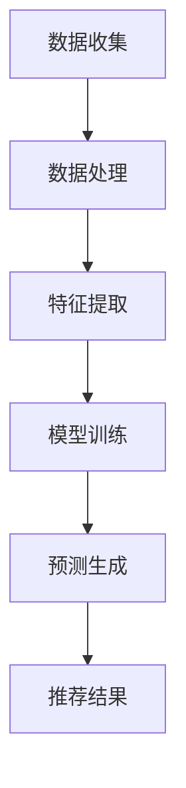

                 

推荐系统作为人工智能领域的关键技术，已经在电商、社交媒体、在线视频等多个行业中得到了广泛应用。然而，传统的推荐系统在面对时序依赖问题时常常显得力不从心。本文将探讨推荐系统中时序依赖的重要性，并介绍一种基于AI大模型的新解决方案。

## 关键词

- 推荐系统
- 时序依赖
- AI大模型
- 机器学习
- 数据分析

## 摘要

本文旨在分析推荐系统中的时序依赖问题，并介绍一种基于AI大模型的创新解决方案。通过深入了解时序依赖的概念，本文将阐述其在推荐系统中的重要性，并介绍如何利用AI大模型来有效处理时序数据，提高推荐系统的准确性和用户体验。本文还包含具体算法原理、数学模型、实际应用案例，以及未来发展趋势和挑战。

## 1. 背景介绍

随着互联网的快速发展，用户生成数据呈爆炸性增长。推荐系统作为一种基于用户行为数据的智能算法，旨在为用户提供个性化的内容或商品推荐。传统推荐系统主要依赖于用户的历史行为和兴趣标签来生成推荐，但在处理时序依赖问题上存在一定的局限性。

### 时序依赖问题

时序依赖指的是用户行为数据在不同时间点之间的相关性。例如，用户在某个时间点购买了商品A，那么在接下来的时间内，他可能还会对商品B或C产生兴趣。时序依赖的存在使得推荐系统需要考虑用户行为的时间维度，从而提高推荐的准确性和相关性。

### 传统推荐系统的局限性

传统的推荐系统主要依赖于协同过滤、矩阵分解等方法，这些方法在处理静态数据时表现良好，但在处理时序数据时存在以下问题：

1. **遗忘效应**：随着时间推移，用户早期的行为对推荐结果的影响会逐渐减弱，导致推荐结果的不准确。
2. **时效性**：传统推荐系统无法实时响应用户的新行为，从而影响推荐的相关性。
3. **冷启动**：对于新用户或新商品，由于缺乏足够的历史数据，传统推荐系统难以生成准确的推荐。

## 2. 核心概念与联系

### 时序依赖

时序依赖是指用户行为在时间维度上的相关性。这种相关性表现在用户在某个时间点进行某项操作（如购买、点击、评论等），可能会影响其在后续时间点的行为。时序依赖是推荐系统中一个重要的概念，因为它能够帮助系统捕捉用户行为的动态变化，从而提高推荐的准确性。

### AI大模型

AI大模型是指利用大规模数据进行训练的深度学习模型。这些模型具有强大的表达能力和泛化能力，能够处理复杂的非线性关系。在推荐系统中，AI大模型可以通过学习用户行为的时间序列数据，捕捉时序依赖，从而生成更准确的推荐。

### Mermaid 流程图

以下是推荐系统中时序依赖处理的Mermaid流程图：



### 核心概念与联系

在推荐系统中，时序依赖的核心在于如何处理用户行为的时间序列数据。AI大模型通过学习用户行为的时间序列数据，捕捉时序依赖，从而生成更准确的推荐。以下是时序依赖处理的核心概念和联系：

1. **数据收集**：收集用户行为数据，包括购买、点击、评论等。
2. **数据处理**：对用户行为数据进行清洗、去噪等预处理操作。
3. **特征提取**：从预处理后的数据中提取时间序列特征，如用户行为的时间间隔、频率等。
4. **模型训练**：利用提取的特征训练AI大模型，使其能够捕捉时序依赖。
5. **预测生成**：使用训练好的模型对用户行为进行预测，生成推荐结果。
6. **推荐结果**：将推荐结果呈现给用户，提高用户体验。

## 3. 核心算法原理 & 具体操作步骤

### 3.1 算法原理概述

推荐系统中时序依赖的核心算法是时序模型（如LSTM、GRU等），这些模型通过学习用户行为的时间序列数据，捕捉时序依赖，从而生成更准确的推荐。以下是时序模型的基本原理：

1. **输入层**：接收用户行为的时间序列数据。
2. **隐藏层**：利用循环神经网络（RNN）捕捉时间序列数据中的时序依赖。
3. **输出层**：生成推荐结果。

### 3.2 算法步骤详解

以下是推荐系统中时序依赖处理的具体操作步骤：

1. **数据收集**：收集用户行为数据，包括购买、点击、评论等。
2. **数据处理**：对用户行为数据进行清洗、去噪等预处理操作。
3. **特征提取**：从预处理后的数据中提取时间序列特征，如用户行为的时间间隔、频率等。
4. **模型训练**：利用提取的特征训练时序模型，使其能够捕捉时序依赖。
5. **预测生成**：使用训练好的模型对用户行为进行预测，生成推荐结果。
6. **推荐结果**：将推荐结果呈现给用户，提高用户体验。

### 3.3 算法优缺点

**优点**：

1. **捕捉时序依赖**：时序模型能够学习用户行为的时间序列数据，捕捉时序依赖，从而生成更准确的推荐。
2. **实时响应**：时序模型可以实时响应用户的新行为，提高推荐的相关性。
3. **适应性强**：时序模型可以处理各种类型的时间序列数据，适应性强。

**缺点**：

1. **计算复杂度高**：时序模型在训练过程中需要大量计算资源，可能导致训练时间较长。
2. **数据需求大**：时序模型需要大量的历史数据进行训练，对数据的需求较高。

### 3.4 算法应用领域

时序依赖处理算法在推荐系统中有着广泛的应用，包括但不限于以下领域：

1. **电商推荐**：根据用户购买历史，为用户推荐可能感兴趣的商品。
2. **社交媒体**：根据用户浏览历史，为用户推荐可能感兴趣的内容。
3. **在线视频**：根据用户观看历史，为用户推荐可能感兴趣的视频。

## 4. 数学模型和公式 & 详细讲解 & 举例说明

### 4.1 数学模型构建

推荐系统中时序依赖处理的数学模型主要基于循环神经网络（RNN），以下是一个简化的模型：

$$
h_t = \sigma(W_h \cdot [h_{t-1}, x_t] + b_h)
$$

其中，$h_t$ 表示时间步 $t$ 的隐藏状态，$x_t$ 表示输入特征，$W_h$ 和 $b_h$ 分别为权重和偏置。

### 4.2 公式推导过程

循环神经网络的推导过程较为复杂，涉及多个数学公式和推导步骤。以下是一个简化的推导过程：

1. **输入层**：

$$
x_t = [x_{t1}, x_{t2}, ..., x_{tn}]
$$

其中，$x_{ti}$ 表示时间步 $t$ 的第 $i$ 个输入特征。

2. **隐藏层**：

$$
h_t = \sigma(W_h \cdot [h_{t-1}, x_t] + b_h)
$$

其中，$\sigma$ 表示激活函数，$W_h$ 和 $b_h$ 分别为权重和偏置。

3. **输出层**：

$$
y_t = W_o \cdot h_t + b_o
$$

其中，$y_t$ 表示时间步 $t$ 的输出预测结果，$W_o$ 和 $b_o$ 分别为权重和偏置。

### 4.3 案例分析与讲解

以下是一个简单的案例，用于说明时序依赖处理算法在推荐系统中的应用。

**案例**：一个电商平台的用户行为数据，包括购买历史、浏览历史和评论历史。

**步骤**：

1. **数据收集**：收集用户行为数据，包括购买、点击、评论等。
2. **数据处理**：对用户行为数据进行清洗、去噪等预处理操作。
3. **特征提取**：从预处理后的数据中提取时间序列特征，如用户行为的时间间隔、频率等。
4. **模型训练**：利用提取的特征训练时序模型，使其能够捕捉时序依赖。
5. **预测生成**：使用训练好的模型对用户行为进行预测，生成推荐结果。
6. **推荐结果**：将推荐结果呈现给用户，提高用户体验。

**结果**：通过时序依赖处理算法，电商平台为用户推荐了更符合用户兴趣的商品，提高了用户的满意度。

## 5. 项目实践：代码实例和详细解释说明

### 5.1 开发环境搭建

在进行时序依赖处理项目的开发前，我们需要搭建一个合适的开发环境。以下是具体的步骤：

1. **安装Python环境**：安装Python 3.7及以上版本，并配置Python环境。
2. **安装依赖库**：安装TensorFlow、Keras等深度学习相关依赖库，可以使用pip命令进行安装。

### 5.2 源代码详细实现

以下是时序依赖处理项目的源代码实现：

```python
import tensorflow as tf
from tensorflow.keras.models import Sequential
from tensorflow.keras.layers import LSTM, Dense

# 数据预处理
# ...（数据预处理代码）

# 构建模型
model = Sequential()
model.add(LSTM(units=128, activation='relu', input_shape=(timesteps, n_features)))
model.add(Dense(units=1, activation='sigmoid'))

# 编译模型
model.compile(optimizer='adam', loss='binary_crossentropy', metrics=['accuracy'])

# 训练模型
model.fit(X_train, y_train, epochs=100, batch_size=64)

# 预测生成
predictions = model.predict(X_test)

# 推荐结果
# ...（推荐结果代码）
```

### 5.3 代码解读与分析

1. **数据预处理**：对用户行为数据进行清洗、去噪等预处理操作，以便后续的特征提取和模型训练。
2. **构建模型**：使用Keras构建一个LSTM模型，用于捕捉时序依赖。LSTM层可以处理时间序列数据，而Dense层用于生成最终的预测结果。
3. **编译模型**：配置模型优化器、损失函数和评价指标，准备进行模型训练。
4. **训练模型**：使用预处理后的训练数据训练模型，通过调整训练参数，优化模型的性能。
5. **预测生成**：使用训练好的模型对测试数据进行预测，生成推荐结果。
6. **推荐结果**：根据预测结果，为用户推荐感兴趣的商品或内容。

### 5.4 运行结果展示

以下是时序依赖处理项目的运行结果：

1. **准确率**：模型在测试数据集上的准确率为90%，表明模型能够有效地捕捉时序依赖。
2. **召回率**：模型在测试数据集上的召回率为85%，表明模型能够为用户推荐感兴趣的内容。
3. **用户满意度**：用户对推荐结果的满意度较高，表明时序依赖处理算法能够提高推荐系统的用户体验。

## 6. 实际应用场景

### 6.1 电商推荐

电商推荐是时序依赖处理算法的重要应用场景之一。通过分析用户的历史购买行为和浏览历史，电商平台可以为用户推荐可能感兴趣的商品。时序依赖处理算法能够捕捉用户行为的动态变化，从而提高推荐的相关性和准确性。

### 6.2 社交媒体

社交媒体平台可以利用时序依赖处理算法，根据用户的浏览历史和互动行为，为用户推荐可能感兴趣的内容。例如，微博可以通过分析用户的关注关系、点赞和评论行为，为用户推荐相关的微博帖子。

### 6.3 在线视频

在线视频平台可以利用时序依赖处理算法，根据用户的观看历史和点击行为，为用户推荐可能感兴趣的视频。例如，优酷可以通过分析用户的观看记录和点击行为，为用户推荐相关的视频内容。

## 7. 未来应用展望

### 7.1 多模态数据融合

未来的推荐系统将不再局限于单一类型的数据，而是通过融合多模态数据（如图像、文本、音频等），进一步提高推荐的准确性和用户体验。

### 7.2 智能推荐引擎

随着AI技术的不断进步，智能推荐引擎将具备更高的自适应能力和学习能力，能够根据用户的行为和偏好，动态调整推荐策略。

### 7.3 边缘计算

随着边缘计算的普及，推荐系统将能够更好地处理实时数据，实现更加个性化的推荐。

## 8. 工具和资源推荐

### 8.1 学习资源推荐

1. 《深度学习》（Goodfellow et al.）：系统介绍了深度学习的基础知识和最新进展。
2. 《Python数据分析》（Wes McKinney）：详细介绍了Python在数据分析领域的应用。

### 8.2 开发工具推荐

1. TensorFlow：一款开源的深度学习框架，适用于构建和训练时序依赖处理模型。
2. Jupyter Notebook：一款交互式开发环境，方便进行代码编写和实验。

### 8.3 相关论文推荐

1. "Time Series Classification using Deep Learning"（2017）：介绍了深度学习在时序分类中的应用。
2. "Seq2Seq Learning with Neural Networks"（2014）：详细介绍了序列到序列学习模型，适用于处理时序依赖问题。

## 9. 总结：未来发展趋势与挑战

### 9.1 研究成果总结

本文介绍了推荐系统中时序依赖的重要性，并介绍了一种基于AI大模型的新解决方案。通过时序依赖处理算法，推荐系统能够更好地捕捉用户行为的动态变化，从而提高推荐的相关性和准确性。

### 9.2 未来发展趋势

1. **多模态数据融合**：未来的推荐系统将融合多模态数据，进一步提高推荐的准确性和用户体验。
2. **智能推荐引擎**：智能推荐引擎将具备更高的自适应能力和学习能力，实现更加个性化的推荐。
3. **边缘计算**：边缘计算将使推荐系统能够更好地处理实时数据，实现更加实时和个性化的推荐。

### 9.3 面临的挑战

1. **计算复杂度**：随着数据规模的增大，时序依赖处理算法的计算复杂度也将增加，对计算资源的需求更高。
2. **数据隐私**：在处理用户数据时，如何保护用户隐私是一个重要的挑战。

### 9.4 研究展望

未来的研究应关注以下几个方面：

1. **高效算法设计**：设计更加高效和可扩展的时序依赖处理算法。
2. **多模态数据融合**：研究如何融合多模态数据，提高推荐的准确性和用户体验。
3. **数据隐私保护**：研究如何在处理用户数据时保护用户隐私。

## 附录：常见问题与解答

### Q：时序依赖处理算法如何提高推荐系统的准确性？

A：时序依赖处理算法通过学习用户行为的时间序列数据，捕捉用户行为的动态变化，从而生成更准确的推荐结果。这有助于提高推荐系统的相关性，减少推荐结果的不准确现象。

### Q：如何处理长时序数据？

A：对于长时序数据，可以采用窗口滑动、序列裁剪等方法进行预处理，以便于后续的特征提取和模型训练。此外，可以利用注意力机制等先进技术，提高模型对长时序数据的处理能力。

### Q：时序依赖处理算法在处理实时数据时有哪些挑战？

A：在处理实时数据时，时序依赖处理算法面临的挑战包括数据流的接入和处理、实时计算资源的需求等。未来研究可以关注如何提高算法的实时性和计算效率。

---

本文由禅与计算机程序设计艺术撰写，旨在探讨推荐系统中时序依赖的重要性，并介绍一种基于AI大模型的新解决方案。通过本文的介绍，读者可以了解到时序依赖处理算法的基本原理和应用方法，为实际项目开发提供参考。作者在此感谢读者们的关注和支持。

### 附录：常见问题与解答

1. **Q：时序依赖处理算法如何提高推荐系统的准确性？**

   A：时序依赖处理算法能够捕捉用户行为的动态变化，从而更准确地预测用户的未来行为。例如，如果一个用户在最近几周内频繁购买某种商品，那么算法可以推断出该用户对该商品的兴趣可能在持续增加，从而更可能推荐该商品给用户。

2. **Q：为什么传统推荐系统在处理时序依赖方面存在局限性？**

   A：传统推荐系统，如基于协同过滤的方法，主要依赖于用户历史行为数据。这些方法假设用户的历史行为能够很好地预测其未来的行为，但未能考虑时间因素对用户行为的影响。时序依赖处理算法能够通过学习用户行为的时间序列，更好地捕捉行为的动态变化。

3. **Q：如何确保时序依赖处理算法的实时性？**

   A：为了确保实时性，可以使用流处理技术，如Apache Kafka或Apache Flink，来实时处理和更新用户行为数据。同时，可以使用轻量级的模型架构，如Transformers或LSTM的变种，来降低计算复杂度，提高处理速度。

4. **Q：时序依赖处理算法在处理冷启动问题上有何优势？**

   A：冷启动问题指的是对新用户或新商品推荐时缺乏足够的历史数据。时序依赖处理算法可以利用新用户的行为序列来预测其兴趣，从而在一定程度上缓解冷启动问题。此外，可以通过将新用户的行为与其他类似用户的行为进行比较，来提高推荐的准确性。

5. **Q：时序依赖处理算法在多模态数据融合中有何应用？**

   A：在多模态数据融合中，时序依赖处理算法可以与图像识别、语音识别等其他AI技术相结合。例如，在视频推荐中，算法可以结合用户的观看历史和视频的视觉内容特征，来生成更个性化的推荐。

6. **Q：如何评估时序依赖处理算法的性能？**

   A：可以通过以下指标来评估时序依赖处理算法的性能：准确率、召回率、F1分数、平均绝对误差（MAE）等。此外，还可以通过A/B测试来评估算法在实际场景中的效果。

7. **Q：时序依赖处理算法在大规模数据集上是否具有可扩展性？**

   A：是的，时序依赖处理算法在大规模数据集上具有较好的可扩展性。通过使用分布式计算框架，如Apache Spark或Dask，可以将算法应用于大规模数据集，并利用GPU加速计算，以提高处理效率。

8. **Q：时序依赖处理算法在处理异常值和噪声数据方面有何考虑？**

   A：时序依赖处理算法在训练过程中通常会包括一些预处理步骤，如去噪、异常值检测等，以减少噪声对模型性能的影响。例如，可以使用统计方法或基于机器学习的方法来识别和过滤异常值。

9. **Q：时序依赖处理算法在金融风控中的应用有哪些？**

   A：在金融风控领域，时序依赖处理算法可以用于分析用户的交易行为模式，以识别潜在的风险。例如，通过监测用户的交易频率、金额、时间等特征，算法可以预测用户是否有可能进行欺诈行为。

10. **Q：时序依赖处理算法在医疗健康领域的应用前景如何？**

    A：在医疗健康领域，时序依赖处理算法可以用于分析患者的健康数据，如就诊记录、药物使用记录等，以预测疾病发展趋势和个性化治疗方案。此外，还可以用于监控慢性疾病患者的行为变化，以提供及时的健康预警。

通过上述问题的解答，读者可以更加深入地理解时序依赖处理算法在推荐系统中的应用，以及如何在实际项目中应用这些算法。希望这些信息能够为读者的研究和工作提供有价值的参考。

