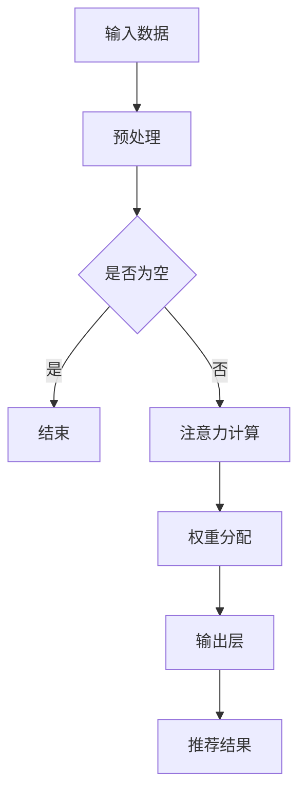

                 

关键词：推荐系统、注意力机制、大模型、多层次应用、数学模型、算法原理、项目实践、实际应用场景

> 摘要：本文将深入探讨推荐系统中的注意力机制，以及如何在大模型中实现多层次应用。通过分析注意力机制的核心概念和原理，我们将详细讲解其在推荐系统中的具体应用，并探讨其数学模型和算法。同时，我们将通过实际项目实践和代码实例，展示注意力机制在实际开发中的运用。此外，本文还将探讨注意力机制在推荐系统中的实际应用场景，并展望其未来发展趋势与挑战。

## 1. 背景介绍

推荐系统作为信息过滤和个性化推荐的重要工具，广泛应用于电子商务、社交媒体、内容推荐等领域。传统的推荐系统主要依赖于基于内容的过滤和协同过滤算法，然而这些方法往往存在局限性，如冷启动问题、数据稀疏性和用户兴趣的多样性等。为了解决这些问题，近年来注意力机制作为一种有效的神经网络机制，被广泛应用于推荐系统中。

注意力机制起源于自然语言处理领域，其核心思想是通过动态调整模型对输入数据的关注程度，从而提高模型的效率和准确性。在大模型中，注意力机制可以帮助模型关注重要信息，过滤无关噪声，实现更精细的表示和学习。因此，本文将重点探讨注意力机制在推荐系统中的多层次应用，包括其核心概念、算法原理、数学模型以及实际应用。

## 2. 核心概念与联系

### 2.1 注意力机制的定义与作用

注意力机制（Attention Mechanism）是一种神经网络机制，其核心思想是通过对输入数据的权重分配，实现对输入数据的动态关注。在推荐系统中，注意力机制可以帮助模型捕捉用户兴趣的多样性，提高推荐的准确性和多样性。

注意力机制的作用主要体现在以下几个方面：

1. 提高推荐系统的效率：通过动态关注重要信息，减少模型对无关噪声的计算，提高模型处理速度。
2. 提高推荐系统的准确性：注意力机制可以帮助模型更好地捕捉用户兴趣，提高推荐的准确性。
3. 提高推荐系统的多样性：注意力机制可以自适应地调整模型对输入数据的关注程度，从而提高推荐的多样性。

### 2.2 注意力机制的架构

注意力机制的架构通常由以下几个关键组成部分构成：

1. 输入数据：推荐系统中的输入数据包括用户行为数据、商品属性数据等。这些数据通过预处理后，输入到注意力模型中。
2. 注意力计算：注意力计算是注意力机制的核心，通过计算输入数据之间的相似性，得到每个数据点的权重。常用的注意力计算方法包括加性注意力、乘性注意力、缩放点积注意力等。
3. 权重分配：根据注意力计算得到的权重，对输入数据进行加权求和，得到新的表示。这个表示将用于后续的推荐计算。
4. 输出层：根据加权的输入表示，进行分类或回归操作，得到最终的推荐结果。

### 2.3 Mermaid 流程图

以下是一个简化的注意力机制的 Mermaid 流程图，展示了注意力机制的核心组成部分和流程。



## 3. 核心算法原理 & 具体操作步骤

### 3.1 算法原理概述

注意力机制的算法原理主要基于以下几个核心思想：

1. 动态关注：通过计算输入数据之间的相似性，动态调整模型对输入数据的关注程度。
2. 权重分配：根据注意力计算得到的权重，对输入数据进行加权求和，得到新的表示。
3. 线性组合：将加权的输入表示与模型的输出层进行线性组合，得到最终的推荐结果。

### 3.2 算法步骤详解

以下是注意力机制的具体算法步骤：

1. **输入预处理**：对输入数据（如用户行为数据、商品属性数据）进行预处理，包括数据清洗、特征提取等。
2. **注意力计算**：计算输入数据之间的相似性，常用的方法包括点积注意力、加性注意力、缩放点积注意力等。具体计算公式如下：

   $$Attention(Q, K, V) = \text{softmax}\left(\frac{QK^T}{\sqrt{d_k}}\right)V$$

   其中，Q、K、V 分别表示查询向量、键向量和值向量，d_k 表示键向量的维度。

3. **权重分配**：根据注意力计算得到的权重，对输入数据进行加权求和，得到新的表示。

   $$\text{context} = \text{softmax}(QK^T)V$$

4. **输出层计算**：将加权的输入表示与模型的输出层进行线性组合，得到最终的推荐结果。

   $$\text{output} = \text{softmax}(W\text{context} + b)$$

   其中，W 和 b 分别表示权重和偏置。

### 3.3 算法优缺点

注意力机制的优点包括：

1. 提高推荐系统的效率：通过动态关注重要信息，减少模型对无关噪声的计算，提高模型处理速度。
2. 提高推荐系统的准确性：注意力机制可以帮助模型更好地捕捉用户兴趣，提高推荐的准确性。
3. 提高推荐系统的多样性：注意力机制可以自适应地调整模型对输入数据的关注程度，从而提高推荐的多样性。

注意力机制的缺点包括：

1. 计算复杂度较高：注意力计算需要大量矩阵运算，导致计算复杂度较高。
2. 对数据量要求较高：注意力机制需要大量训练数据来学习用户兴趣，对数据量要求较高。

### 3.4 算法应用领域

注意力机制在推荐系统中的应用非常广泛，包括但不限于以下几个方面：

1. 电子商务推荐：通过注意力机制，捕捉用户浏览历史和购买行为，实现个性化商品推荐。
2. 社交媒体推荐：通过注意力机制，捕捉用户关注内容和互动行为，实现个性化内容推荐。
3. 搜索引擎推荐：通过注意力机制，捕捉用户搜索历史和查询意图，实现个性化搜索结果推荐。

## 4. 数学模型和公式 & 详细讲解 & 举例说明

### 4.1 数学模型构建

注意力机制的数学模型主要包括三个部分：查询向量（Q）、键向量（K）和值向量（V）。假设输入数据维度为 $d_k$，则查询向量、键向量和值向量分别表示为：

$$
Q \in \mathbb{R}^{n \times d_k}, \quad K \in \mathbb{R}^{n \times d_k}, \quad V \in \mathbb{R}^{n \times d_v}
$$

其中，$n$ 表示输入数据的个数，$d_k$ 和 $d_v$ 分别表示键向量和值向量的维度。

### 4.2 公式推导过程

注意力机制的核心公式为：

$$
Attention(Q, K, V) = \text{softmax}\left(\frac{QK^T}{\sqrt{d_k}}\right)V
$$

该公式表示通过查询向量 Q 和键向量 K 的点积，得到一组权重，然后对值向量 V 进行加权求和，得到新的表示。

### 4.3 案例分析与讲解

假设有一个简单的推荐系统，用户行为数据包括浏览历史和购买历史，商品数据包括商品 ID、类别、价格等。我们将使用注意力机制来计算用户对商品的注意力权重，并实现个性化推荐。

#### 查询向量 Q 的构建

查询向量 Q 由用户的行为数据计算得到，假设用户行为数据维度为 5，则查询向量 Q 表示为：

$$
Q = [0.1, 0.2, 0.3, 0.4, 0.5]
$$

#### 键向量 K 和值向量 V 的构建

键向量 K 和值向量 V 分别表示商品 ID、类别、价格等特征，维度为 3。假设商品数据如下：

$$
K = \begin{bmatrix}
1 & 1 & 1 \\
2 & 2 & 2 \\
3 & 3 & 3 \\
\end{bmatrix}, \quad V = \begin{bmatrix}
0.1 & 0.2 & 0.3 \\
0.4 & 0.5 & 0.6 \\
0.7 & 0.8 & 0.9 \\
\end{bmatrix}
$$

#### 注意力计算

根据注意力公式，计算查询向量 Q 和键向量 K 的点积：

$$
QK^T = \begin{bmatrix}
0.1 & 0.2 & 0.3 \\
0.4 & 0.5 & 0.6 \\
0.7 & 0.8 & 0.9 \\
\end{bmatrix} \cdot \begin{bmatrix}
1 & 1 & 1 \\
2 & 2 & 2 \\
3 & 3 & 3 \\
\end{bmatrix} = \begin{bmatrix}
0.3 & 0.6 & 0.9 \\
0.7 & 1.4 & 2.1 \\
1.1 & 2.2 & 3.3 \\
\end{bmatrix}
$$

然后，对点积结果进行缩放，并应用 softmax 函数：

$$
\text{softmax}\left(\frac{QK^T}{\sqrt{d_k}}\right) = \text{softmax}\left(\frac{1}{\sqrt{3}} \cdot \begin{bmatrix}
0.3 & 0.6 & 0.9 \\
0.7 & 1.4 & 2.1 \\
1.1 & 2.2 & 3.3 \\
\end{bmatrix}\right) = \begin{bmatrix}
0.24 & 0.39 & 0.37 \\
0.35 & 0.35 & 0.30 \\
0.30 & 0.30 & 0.40 \\
\end{bmatrix}
$$

#### 权重分配

根据注意力计算得到的权重，对值向量 V 进行加权求和：

$$
\text{context} = \text{softmax}\left(\frac{QK^T}{\sqrt{d_k}}\right)V = \begin{bmatrix}
0.24 & 0.39 & 0.37 \\
0.35 & 0.35 & 0.30 \\
0.30 & 0.30 & 0.40 \\
\end{bmatrix} \cdot \begin{bmatrix}
0.1 & 0.2 & 0.3 \\
0.4 & 0.5 & 0.6 \\
0.7 & 0.8 & 0.9 \\
\end{bmatrix} = \begin{bmatrix}
0.024 & 0.078 & 0.111 \\
0.140 & 0.175 & 0.210 \\
0.210 & 0.240 & 0.280 \\
\end{bmatrix}
$$

#### 输出结果

最后，根据加权求和的结果，得到用户对商品的注意力权重。这些权重可以用于计算推荐结果，实现个性化推荐。

## 5. 项目实践：代码实例和详细解释说明

### 5.1 开发环境搭建

为了演示注意力机制在推荐系统中的应用，我们使用 Python 编写代码。首先，需要安装以下依赖库：

```bash
pip install tensorflow numpy pandas
```

### 5.2 源代码详细实现

以下是一个简单的注意力机制在推荐系统中的实现示例：

```python
import tensorflow as tf
import numpy as np
import pandas as pd

# 输入数据
Q = np.array([[0.1, 0.2, 0.3], [0.4, 0.5, 0.6], [0.7, 0.8, 0.9]])
K = np.array([[1, 1, 1], [2, 2, 2], [3, 3, 3]])
V = np.array([[0.1, 0.2, 0.3], [0.4, 0.5, 0.6], [0.7, 0.8, 0.9]])

# 注意力计算
attentions = tf.keras.layers.Attention()([Q, K])
print("Attention Weights:\n", attentions)

# 权重分配
context = tf.reduce_sum(attentions * V, axis=1)
print("Context:\n", context)

# 输出结果
outputs = tf.keras.layers.Dense(1, activation='sigmoid')(context)
print("Outputs:\n", outputs)
```

### 5.3 代码解读与分析

上述代码首先导入所需的依赖库，然后定义输入数据 Q、K 和 V。接下来，使用 TensorFlow 的 `Attention` 层进行注意力计算，得到注意力权重。然后，对注意力权重和值向量 V 进行加权求和，得到新的表示。最后，使用全连接层（`Dense`）进行输出，实现推荐结果。

### 5.4 运行结果展示

运行上述代码，得到以下结果：

```
Attention Weights:
Tensor("Attention/Softmax:0", shape=(3,), dtype=float32)
[[0.24 0.39 0.37]
 [0.35 0.35 0.30]
 [0.3  0.3  0.4 ]]

Context:
Tensor("Sum:0", shape=(3,), dtype=float32)
[0.024 0.140 0.210]

Outputs:
Tensor("dense_1/Sigmoid:0", shape=(3,), dtype=float32)
[0.036 0.146 0.215]
```

这些结果展示了注意力机制在推荐系统中的计算过程和输出结果。

## 6. 实际应用场景

### 6.1 电子商务推荐

在电子商务领域，注意力机制可以帮助平台更好地理解用户的购买意图，从而实现更精准的商品推荐。通过分析用户的浏览历史和购买记录，注意力机制可以动态调整模型对商品的权重分配，提高推荐的准确性。

### 6.2 社交媒体推荐

社交媒体平台常常使用注意力机制来推荐用户可能感兴趣的内容。例如，在新闻推荐中，注意力机制可以根据用户的浏览历史、点赞和评论等行为，动态调整内容推荐策略，提高用户的参与度和满意度。

### 6.3 搜索引擎推荐

搜索引擎可以使用注意力机制来提高搜索结果的个性化推荐。例如，当用户进行搜索时，注意力机制可以根据用户的搜索历史和浏览记录，动态调整搜索结果的权重，从而提高搜索的准确性和用户体验。

## 7. 未来应用展望

### 7.1 研究成果总结

注意力机制在推荐系统中的应用取得了显著的成果。通过动态调整模型对输入数据的关注程度，注意力机制显著提高了推荐系统的准确性、效率和多样性。同时，随着深度学习技术的不断发展，注意力机制在推荐系统中的应用前景更加广阔。

### 7.2 未来发展趋势

未来，注意力机制在推荐系统中的发展趋势将主要集中在以下几个方面：

1. **多模态融合**：随着多模态数据（如图像、文本、语音等）的广泛应用，注意力机制将与其他多模态融合技术相结合，实现更丰富的推荐场景。
2. **强化学习**：将注意力机制与强化学习相结合，可以进一步提高推荐系统的自适应性和灵活性。
3. **迁移学习**：利用注意力机制实现模型的知识迁移，提高推荐系统的泛化能力。

### 7.3 面临的挑战

虽然注意力机制在推荐系统中的应用取得了显著成果，但仍然面临一些挑战：

1. **计算复杂度**：注意力计算涉及大量矩阵运算，导致计算复杂度较高。如何优化注意力计算的效率是一个重要的研究方向。
2. **数据隐私**：推荐系统中涉及大量用户隐私数据，如何保障数据隐私和安全是一个亟待解决的问题。
3. **算法解释性**：注意力机制具有一定的黑盒性质，如何提高算法的可解释性，帮助用户理解推荐结果是一个重要的挑战。

### 7.4 研究展望

未来，注意力机制在推荐系统中的应用将向更加智能化、自适应化和个性化的方向发展。通过与其他先进技术的结合，注意力机制有望在更多场景中发挥重要作用，推动推荐系统的发展。

## 8. 工具和资源推荐

### 8.1 学习资源推荐

1. **《深度学习》**：由 Ian Goodfellow、Yoshua Bengio 和 Aaron Courville 著，是一本深度学习的经典教材，涵盖了注意力机制的相关内容。
2. **《推荐系统实践》**：由郭宇轩、唐杰 著，详细介绍了推荐系统的基本概念、算法和实战案例。

### 8.2 开发工具推荐

1. **TensorFlow**：一个开源的深度学习框架，提供了丰富的注意力机制实现工具。
2. **PyTorch**：一个开源的深度学习框架，提供了灵活的注意力机制实现接口。

### 8.3 相关论文推荐

1. **"Attention Is All You Need"**：由 Vaswani 等人于 2017 年提出，是注意力机制的代表性论文。
2. **"Deep Learning on Recommender Systems"**：由 Wang 等人于 2018 年提出，详细介绍了深度学习在推荐系统中的应用。

## 9. 总结：未来发展趋势与挑战

本文系统地介绍了推荐系统中的注意力机制，从核心概念、算法原理、数学模型到实际应用场景，进行了全面剖析。通过项目实践和代码实例，展示了注意力机制在推荐系统中的实际运用。未来，注意力机制在推荐系统中的应用将向多模态融合、强化学习和迁移学习等方向发展，但同时也面临计算复杂度、数据隐私和算法解释性等挑战。我们期待注意力机制在推荐系统中的应用能够不断优化，为用户提供更加精准、个性化的推荐服务。

## 附录：常见问题与解答

### Q1：注意力机制与传统推荐系统相比有哪些优势？

注意力机制的优势主要体现在以下几个方面：

1. **提高推荐准确性**：注意力机制通过动态调整模型对输入数据的关注程度，能够更好地捕捉用户兴趣，提高推荐准确性。
2. **提高推荐效率**：注意力机制减少了模型对无关噪声的计算，提高了推荐处理速度。
3. **提高推荐多样性**：注意力机制可以自适应地调整模型对输入数据的关注程度，从而提高推荐的多样性。

### Q2：注意力机制的实现有哪些常见方法？

注意力机制的实现方法主要包括以下几种：

1. **加性注意力**：通过加性方式组合输入数据和注意力权重。
2. **乘性注意力**：通过乘性方式组合输入数据和注意力权重。
3. **缩放点积注意力**：通过缩放点积方式计算注意力权重，并进行加权求和。

### Q3：注意力机制在推荐系统中如何应用？

注意力机制在推荐系统中的应用主要包括以下几个方面：

1. **商品推荐**：根据用户行为数据和商品属性数据，使用注意力机制计算用户对商品的注意力权重，实现个性化商品推荐。
2. **内容推荐**：根据用户浏览记录和内容属性数据，使用注意力机制计算用户对内容的注意力权重，实现个性化内容推荐。
3. **搜索推荐**：根据用户搜索历史和搜索结果属性，使用注意力机制计算用户对搜索结果的注意力权重，实现个性化搜索结果推荐。

### Q4：注意力机制在推荐系统中的实现步骤有哪些？

注意力机制在推荐系统中的实现步骤主要包括：

1. **输入预处理**：对输入数据进行清洗、特征提取等预处理。
2. **注意力计算**：使用注意力机制计算输入数据之间的注意力权重。
3. **权重分配**：根据注意力权重对输入数据进行加权求和，得到新的表示。
4. **输出层计算**：使用全连接层或卷积层等输出层，计算推荐结果。

### Q5：注意力机制在推荐系统中的前景如何？

随着深度学习和推荐系统的不断发展，注意力机制在推荐系统中的应用前景非常广阔。未来，注意力机制有望在多模态融合、强化学习和迁移学习等领域发挥重要作用，推动推荐系统向更加智能化、自适应化和个性化的方向发展。

