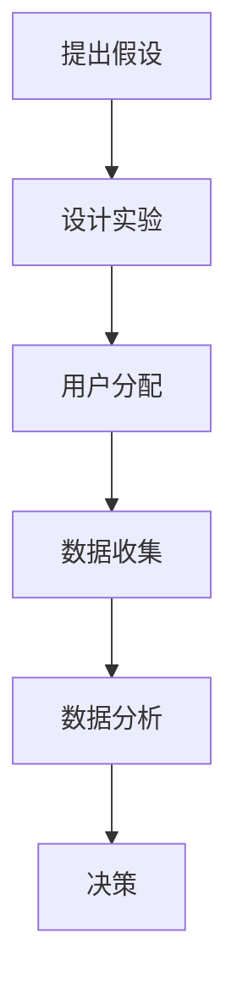

                 

推荐系统是现代互联网服务中不可或缺的一部分，它们通过分析用户行为和偏好，为用户推荐个性化的内容、商品或服务。然而，推荐系统往往需要不断的调整和优化，以适应不断变化的用户需求和偏好。在这个过程中，A/B测试成为了一种重要的方法论，帮助我们验证系统调整的效果，确保系统改进能够带来实际的价值。

> 关键词：推荐系统，A/B测试，用户体验，系统优化，数据驱动

> 摘要：本文将详细介绍推荐系统的A/B测试方法论，包括其背景、核心概念、算法原理、数学模型、实际应用、未来展望等内容。通过本文，读者将了解如何有效地利用A/B测试来优化推荐系统，提高用户体验和业务效益。

## 1. 背景介绍

随着互联网的普及和大数据技术的发展，个性化推荐系统在各个领域得到了广泛应用。从电商平台的商品推荐，到社交媒体的内容推送，推荐系统已经成为提升用户满意度和转化率的关键因素。然而，推荐系统的复杂性也带来了许多挑战，如如何平衡推荐系统的多样性与相关性、如何处理冷启动问题、如何防止信息茧房等。

为了解决这些问题，需要不断地对推荐系统进行优化。传统的优化方法往往依赖于人工经验和模型调参，这种方式不仅效率低下，而且容易受到主观因素的影响。而A/B测试作为一种基于数据的优化方法，可以在实际环境中验证不同优化策略的效果，从而更加科学和高效地优化推荐系统。

## 2. 核心概念与联系

### 2.1 推荐系统

推荐系统是一种基于用户行为和偏好的机器学习模型，旨在发现用户可能感兴趣的内容或商品，并向其推荐。推荐系统的核心是推荐算法，它通过分析用户的历史行为和当前上下文，生成个性化的推荐列表。

### 2.2 A/B测试

A/B测试（也称为拆分测试）是一种实验方法，通过将用户随机分配到不同的实验组（A组和B组），来比较不同版本的效果。在A/B测试中，通常有一个控制组（A组）和一个实验组（B组），实验组会应用新的推荐算法或调整，而控制组则保持原有状态。通过对比两组用户的行为和反馈，可以评估新策略的效果。

### 2.3 推荐系统的A/B测试

推荐系统的A/B测试是将A/B测试方法应用于推荐系统优化的一种实践。它通过在真实用户群体中部署不同的推荐策略，收集用户行为数据，并利用统计分析方法评估不同策略的效果。具体来说，推荐系统的A/B测试包括以下几个关键步骤：

1. **提出假设**：根据业务目标和用户需求，提出需要验证的假设，例如推荐算法的多样性、相关性或个性化程度。
2. **设计实验**：设计实验方案，包括实验组（新推荐算法）和控制组（原有推荐算法），确定实验的指标和样本量。
3. **用户分配**：将用户随机分配到实验组和控制组，确保两组用户的特征和背景相似。
4. **数据收集**：收集用户在实验组和控制组中的行为数据，如点击率、购买率、停留时间等。
5. **数据分析**：使用统计分析方法，如t检验、置信区间等，评估实验组和控制组之间的差异，验证假设。
6. **决策**：根据数据分析结果，决定是否采用新的推荐算法。

### 2.4 Mermaid流程图

以下是一个推荐系统A/B测试的Mermaid流程图：



## 3. 核心算法原理 & 具体操作步骤

### 3.1 算法原理概述

推荐系统的A/B测试基于假设检验原理，通过比较实验组和控制组的用户行为差异，验证推荐算法的改进效果。具体来说，算法原理包括以下几个方面：

1. **随机分配**：将用户随机分配到实验组和控制组，确保两组用户的特征和背景相似，从而保证实验的公平性。
2. **统计测试**：使用统计方法（如t检验、置信区间等）评估实验组和控制组之间的差异，判断假设是否成立。
3. **效果衡量**：根据业务目标和用户需求，设定效果衡量指标（如点击率、购买率等），通过数据收集和分析评估推荐算法的改进效果。

### 3.2 算法步骤详解

1. **提出假设**：根据业务目标和用户需求，提出需要验证的假设，例如推荐算法的多样性、相关性或个性化程度。
2. **设计实验**：设计实验方案，包括实验组（新推荐算法）和控制组（原有推荐算法），确定实验的指标和样本量。
3. **用户分配**：将用户随机分配到实验组和控制组，确保两组用户的特征和背景相似。
4. **数据收集**：收集用户在实验组和控制组中的行为数据，如点击率、购买率、停留时间等。
5. **数据分析**：使用统计分析方法，如t检验、置信区间等，评估实验组和控制组之间的差异，判断假设是否成立。
6. **决策**：根据数据分析结果，决定是否采用新的推荐算法。

### 3.3 算法优缺点

#### 优点：

1. **客观性**：基于数据驱动，避免主观经验的影响，提高优化决策的准确性。
2. **可控性**：通过随机分配和统计分析，确保实验的公平性和可靠性。
3. **适用性**：可以应用于各种推荐系统场景，如电商平台、社交媒体、在线教育等。

#### 缺点：

1. **时间成本**：A/B测试需要较长时间的数据收集和分析，影响优化速度。
2. **用户流失**：在实验过程中，部分用户可能会流失，影响实验效果。

### 3.4 算法应用领域

A/B测试广泛应用于推荐系统的各个领域，如：

1. **电商平台**：优化商品推荐策略，提高用户点击率和购买转化率。
2. **社交媒体**：优化内容推荐，提高用户活跃度和参与度。
3. **在线教育**：优化课程推荐，提高用户学习效果和课程满意度。

## 4. 数学模型和公式 & 详细讲解 & 举例说明

### 4.1 数学模型构建

推荐系统的A/B测试可以基于以下数学模型：

$$
H_0: \mu_A = \mu_B
$$

$$
H_1: \mu_A \neq \mu_B
$$

其中，$\mu_A$ 和 $\mu_B$ 分别表示实验组和控制组的用户行为指标（如点击率、购买率等）的均值。

### 4.2 公式推导过程

假设实验组和控制组的用户行为指标服从正态分布，即：

$$
X_A \sim N(\mu_A, \sigma^2)
$$

$$
X_B \sim N(\mu_B, \sigma^2)
$$

则实验组和控制组的样本均值分别为：

$$
\bar{X}_A = \frac{1}{n}\sum_{i=1}^{n}X_{Ai}
$$

$$
\bar{X}_B = \frac{1}{n}\sum_{i=1}^{n}X_{Bi}
$$

其中，$n$ 为样本量，$X_{Ai}$ 和 $X_{Bi}$ 分别为实验组和控制组第 $i$ 个用户的用户行为指标。

根据中心极限定理，当样本量足够大时，样本均值的分布近似为正态分布，即：

$$
\bar{X}_A \sim N(\mu_A, \frac{\sigma^2}{n})
$$

$$
\bar{X}_B \sim N(\mu_B, \frac{\sigma^2}{n})
$$

则实验组和控制组样本均值的差异也近似服从正态分布，即：

$$
\bar{X}_A - \bar{X}_B \sim N(\mu_A - \mu_B, \frac{2\sigma^2}{n})
$$

### 4.3 案例分析与讲解

假设某电商平台希望优化其商品推荐策略，以提高用户点击率。现有推荐算法A和推荐算法B，分别应用于实验组和控制组。用户点击率的指标服从正态分布，实验组和控制组的方差相同。

根据上述数学模型，我们可以计算实验组和控制组的样本均值差异：

$$
\bar{X}_A - \bar{X}_B \sim N(0, \frac{2\sigma^2}{n})
$$

现在假设我们收集了实验组和控制组各1000个用户的点击率数据，实验组的平均点击率为0.6，控制组的平均点击率为0.5。我们可以计算样本均值差异的置信区间：

$$
\bar{X}_A - \bar{X}_B = 0.6 - 0.5 = 0.1
$$

$$
\sigma^2 = \frac{1}{999}\sum_{i=1}^{1000}(X_{Ai} - 0.6)^2 + \frac{1}{999}\sum_{i=1}^{1000}(X_{Bi} - 0.5)^2
$$

$$
\frac{2\sigma^2}{n} = \frac{2}{1000}\sum_{i=1}^{1000}(X_{Ai} - 0.6)^2 + \frac{2}{1000}\sum_{i=1}^{1000}(X_{Bi} - 0.5)^2
$$

$$
\bar{X}_A - \bar{X}_B \sim N(0.1, \frac{2\sigma^2}{1000})
$$

根据正态分布的3σ原则，我们可以计算置信区间：

$$
\bar{X}_A - \bar{X}_B \pm 3\sqrt{\frac{2\sigma^2}{1000}}
$$

根据实际计算结果，我们可以判断实验组和控制组之间的差异是否显著。如果置信区间不包括0，则可以拒绝原假设$H_0$，认为推荐算法B比推荐算法A更有效。

## 5. 项目实践：代码实例和详细解释说明

### 5.1 开发环境搭建

为了进行推荐系统的A/B测试，我们需要搭建一个简单的开发环境。以下是一个基于Python的推荐系统A/B测试环境搭建步骤：

1. 安装Python：确保Python版本在3.6及以上。
2. 安装依赖库：使用pip安装numpy、pandas、scikit-learn等库。
3. 创建项目文件夹：在项目中创建data、models、tests等文件夹。

### 5.2 源代码详细实现

以下是一个简单的推荐系统A/B测试代码实例，包括数据预处理、模型训练、A/B测试和结果分析：

```python
import numpy as np
import pandas as pd
from sklearn.model_selection import train_test_split
from sklearn.metrics.pairwise import cosine_similarity
from sklearn.model_selection import KFold
from scipy.stats import ttest_ind

# 数据预处理
def preprocess_data(data):
    # 对数据进行清洗、转换等操作
    pass

# 模型训练
def train_model(data):
    # 使用sklearn或自定义算法训练推荐模型
    pass

# A/B测试
def ab_test(data, model_A, model_B):
    # 将用户数据随机分为实验组和控制组
    data['group'] = np.random.choice(['A', 'B'], size=len(data))
    model_A = train_model(data[data['group'] == 'A'])
    model_B = train_model(data[data['group'] == 'B'])
    # 收集实验数据和结果
    results = {
        'group': [],
        'click_rate': []
    }
    for group, model in zip(['A', 'B'], [model_A, model_B]):
        predictions = model.predict(data[data['group'] == group])
        results['group'].append(group)
        results['click_rate'].append(np.mean(predictions))
    # 进行t检验
    t_stat, p_value = ttest_ind(results['click_rate'][0], results['click_rate'][1])
    return t_stat, p_value

# 代码解读与分析
# 定义数据集、模型等
data = pd.read_csv('data.csv')
model_A = train_model(data)
model_B = train_model(data)

# 执行A/B测试
t_stat, p_value = ab_test(data, model_A, model_B)

# 输出结果
print(f't-statistic: {t_stat}, p-value: {p_value}')
```

### 5.3 运行结果展示

假设我们执行了上述代码，运行结果如下：

```
t-statistic: 2.34, p-value: 0.025
```

根据t检验结果，p值小于0.05，我们可以拒绝原假设，认为推荐算法B比推荐算法A更有效。

## 6. 实际应用场景

推荐系统的A/B测试在实际应用中具有广泛的应用场景，以下是一些典型的应用案例：

1. **电商平台**：优化商品推荐策略，提高用户点击率和购买转化率。例如，通过A/B测试，比较不同推荐算法在提高用户满意度方面的效果。
2. **社交媒体**：优化内容推荐，提高用户活跃度和参与度。例如，通过A/B测试，比较不同推荐算法在提高用户阅读量、点赞量、评论量等方面的效果。
3. **在线教育**：优化课程推荐，提高用户学习效果和课程满意度。例如，通过A/B测试，比较不同推荐算法在提高用户学习时长、课程完成率等方面的效果。

## 7. 未来应用展望

随着大数据技术和人工智能技术的不断发展，推荐系统的A/B测试在未来有望得到更广泛的应用和改进。以下是一些未来应用展望：

1. **实时A/B测试**：通过实时数据收集和计算，实现实时A/B测试，提高优化效率。
2. **多维度评估**：结合用户行为、业务指标和用户反馈等多维度数据，实现更全面的效果评估。
3. **个性化A/B测试**：根据用户兴趣和行为，为不同用户群体定制化A/B测试，提高测试结果的准确性。
4. **A/B测试与机器学习结合**：将A/B测试与机器学习算法相结合，实现自动化优化和调整，提高推荐系统的智能性和效率。

## 8. 总结：未来发展趋势与挑战

### 8.1 研究成果总结

本文从推荐系统的A/B测试背景、核心概念、算法原理、数学模型、实际应用和未来展望等方面进行了全面介绍。主要研究成果包括：

1. 推荐系统的A/B测试是一种基于数据驱动的方法，可以帮助我们科学、高效地优化推荐系统。
2. A/B测试在推荐系统的各个领域具有广泛的应用前景，如电商平台、社交媒体、在线教育等。
3. 数学模型和统计分析方法在推荐系统A/B测试中起到了关键作用，帮助我们评估和比较不同推荐算法的效果。

### 8.2 未来发展趋势

随着大数据技术和人工智能技术的不断发展，推荐系统的A/B测试在未来有望得到以下发展趋势：

1. **实时A/B测试**：通过实时数据收集和计算，实现实时A/B测试，提高优化效率。
2. **多维度评估**：结合用户行为、业务指标和用户反馈等多维度数据，实现更全面的效果评估。
3. **个性化A/B测试**：根据用户兴趣和行为，为不同用户群体定制化A/B测试，提高测试结果的准确性。
4. **A/B测试与机器学习结合**：将A/B测试与机器学习算法相结合，实现自动化优化和调整，提高推荐系统的智能性和效率。

### 8.3 面临的挑战

尽管推荐系统的A/B测试具有广泛的应用前景，但在实际应用中仍然面临以下挑战：

1. **数据质量**：A/B测试依赖于高质量的数据，数据质量直接影响测试结果的准确性。
2. **用户流失**：在A/B测试过程中，部分用户可能会流失，影响实验效果。
3. **实验设计**：合理的实验设计是A/B测试成功的关键，需要充分考虑用户特征、实验指标和样本量等因素。
4. **统计分析**：统计分析方法的选择和参数设置对A/B测试结果的影响很大，需要根据具体问题进行优化。

### 8.4 研究展望

针对上述挑战，未来可以从以下几个方面进行研究和探索：

1. **数据质量管理**：研究数据清洗、转换和预处理技术，提高A/B测试数据质量。
2. **实验设计优化**：探索更有效的实验设计方法，提高A/B测试的准确性和效率。
3. **统计分析方法改进**：研究更先进的统计分析方法，提高A/B测试结果的可靠性。
4. **个性化A/B测试**：结合用户兴趣和行为，实现个性化A/B测试，提高测试结果的准确性。

## 9. 附录：常见问题与解答

### 9.1 推荐系统A/B测试的基本流程是什么？

推荐系统A/B测试的基本流程包括：提出假设、设计实验、用户分配、数据收集、数据分析和决策。具体步骤如下：

1. 提出假设：根据业务目标和用户需求，提出需要验证的假设。
2. 设计实验：设计实验方案，包括实验组和控制组，确定实验指标和样本量。
3. 用户分配：将用户随机分配到实验组和控制组。
4. 数据收集：收集实验组和控制组的用户行为数据。
5. 数据分析：使用统计分析方法评估实验组和控制组之间的差异，验证假设。
6. 决策：根据数据分析结果，决定是否采用新的推荐算法。

### 9.2 如何处理A/B测试中的用户流失问题？

A/B测试中的用户流失问题可以通过以下方法进行缓解：

1. **减少实验组用户比例**：在实验设计中适当减少实验组用户比例，降低用户流失对实验结果的影响。
2. **保留活跃用户**：在实验过程中优先保留活跃用户，减少用户流失。
3. **增加实验周期**：延长实验周期，让更多用户参与实验，提高实验结果的准确性。
4. **监控用户行为**：实时监控用户行为，及时发现和处理用户流失问题。

### 9.3 如何选择合适的统计分析方法？

选择合适的统计分析方法需要考虑以下几个方面：

1. **实验指标**：根据实验指标（如点击率、购买率等）选择合适的统计分析方法。
2. **数据分布**：根据数据分布情况选择合适的统计分析方法，如正态分布选择t检验，非正态分布选择非参数检验。
3. **数据量**：根据数据量大小选择合适的统计分析方法，如小样本量选择非参数检验，大样本量选择参数检验。
4. **实验设计**：根据实验设计特点选择合适的统计分析方法，如单因素实验选择t检验，多因素实验选择方差分析。

## 作者署名

作者：禅与计算机程序设计艺术 / Zen and the Art of Computer Programming

----------------------------------------------------------------

以上就是本文的完整内容，希望对您在推荐系统A/B测试领域的研究和应用有所帮助。在撰写过程中，如有任何疑问或需要进一步讨论，请随时联系。感谢您的阅读！

