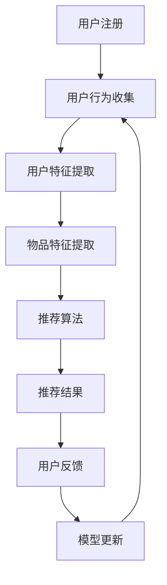

                 

关键词：推荐系统、冷启动、AI大模型、解决方案、算法原理、数学模型、项目实践

## 摘要

在本文中，我们将探讨推荐系统中的冷启动问题，并深入分析如何利用AI大模型来解决这一问题。通过介绍核心概念、算法原理、数学模型以及实际应用，我们将展示AI大模型在推荐系统冷启动中的巨大潜力。

## 1. 背景介绍

推荐系统已经成为现代互联网应用中不可或缺的一部分，它通过向用户推荐可能感兴趣的内容或产品，极大地提升了用户体验。然而，在推荐系统的早期阶段，即所谓的“冷启动”问题，却成为了发展的瓶颈。冷启动问题主要包括以下两个方面：

- **新用户冷启动**：对于新注册的用户，由于缺乏历史行为数据，推荐系统无法提供个性化的推荐。
- **新物品冷启动**：对于新添加到系统中的物品，同样因为缺乏与用户的相关信息，推荐效果较差。

传统的推荐系统主要通过协同过滤、基于内容的推荐等方法来解决这一问题，但这些方法在处理冷启动问题时存在一定的局限性。随着AI技术的不断发展，尤其是AI大模型的兴起，为解决推荐系统的冷启动问题提供了新的思路和可能性。

## 2. 核心概念与联系

在深入探讨AI大模型如何解决推荐系统的冷启动问题之前，我们需要先了解一些核心概念和原理。

### 2.1 推荐系统

推荐系统是一种基于用户行为和偏好，通过算法预测用户可能感兴趣的内容或产品的技术。其基本架构包括用户模型、物品模型和推荐算法三个核心部分。

### 2.2 冷启动问题

冷启动问题主要涉及新用户和新物品的推荐。新用户冷启动是指用户缺乏足够的行为数据，导致推荐系统无法生成有效的推荐。新物品冷启动则是由于新物品缺乏与用户的交互历史，导致推荐效果不理想。

### 2.3 AI大模型

AI大模型是指具有大规模参数、能够处理海量数据和复杂任务的深度学习模型。这些模型通过自我学习和优化，能够不断提高推荐精度和用户体验。

### 2.4 Mermaid 流程图

为了更好地展示推荐系统的架构和AI大模型在冷启动问题中的应用，我们可以使用Mermaid流程图进行可视化。以下是推荐系统的一般架构流程：



在这个流程图中，用户注册后，系统会收集用户行为，提取用户特征，同时提取物品特征，然后通过推荐算法生成推荐结果，用户对推荐结果进行反馈，这些反馈会用于模型更新，进而提高推荐精度。

## 3. 核心算法原理 & 具体操作步骤

### 3.1 算法原理概述

AI大模型在推荐系统冷启动问题中的应用，主要通过以下几个步骤实现：

1. **用户和物品特征提取**：通过深度学习模型，对用户和物品进行特征提取，生成高维特征向量。
2. **相似度计算**：计算用户和物品之间的相似度，为推荐生成提供依据。
3. **推荐生成**：基于用户和物品的相似度，生成个性化推荐列表。
4. **模型优化**：通过用户反馈不断优化模型，提高推荐精度。

### 3.2 算法步骤详解

#### 3.2.1 用户和物品特征提取

用户和物品特征提取是AI大模型在推荐系统中应用的基础。具体步骤如下：

1. **数据预处理**：对原始数据进行清洗和归一化处理，去除噪声和异常值。
2. **特征工程**：根据用户和物品的属性，提取相关特征，如用户的行为日志、物品的属性信息等。
3. **嵌入学习**：使用深度学习模型，如Word2Vec或BERT，对用户和物品进行嵌入学习，生成高维特征向量。

#### 3.2.2 相似度计算

相似度计算是推荐生成的重要步骤。具体方法如下：

1. **内积计算**：计算用户和物品特征向量之间的内积，得到相似度分数。
2. **权重调整**：根据用户和物品的特征重要性，对相似度分数进行调整。

#### 3.2.3 推荐生成

推荐生成是基于相似度分数，生成个性化推荐列表。具体步骤如下：

1. **评分预测**：根据相似度分数，预测用户对物品的评分。
2. **排序和筛选**：对预测评分进行排序，筛选出前N个推荐物品。

#### 3.2.4 模型优化

模型优化是通过用户反馈，不断优化模型，提高推荐精度。具体方法如下：

1. **反馈收集**：收集用户对推荐结果的反馈，如点击、购买等。
2. **模型更新**：根据用户反馈，更新模型参数，优化模型性能。

### 3.3 算法优缺点

#### 3.3.1 优点

- **高精度**：AI大模型能够通过深度学习，提取用户和物品的复杂特征，提高推荐精度。
- **泛化能力强**：AI大模型具有较好的泛化能力，能够处理各种类型的数据和场景。
- **实时性**：AI大模型能够实时更新和优化，快速响应用户需求。

#### 3.3.2 缺点

- **计算复杂度高**：AI大模型需要大量的计算资源，对硬件要求较高。
- **数据依赖性**：AI大模型的性能高度依赖于数据质量，数据缺失或不准确会影响推荐效果。

### 3.4 算法应用领域

AI大模型在推荐系统中的应用广泛，涵盖了电子商务、社交媒体、音乐、视频等多个领域。以下是一些具体的应用场景：

- **电子商务**：通过AI大模型，为用户推荐可能感兴趣的商品，提高转化率和用户满意度。
- **社交媒体**：为用户推荐感兴趣的内容，提高用户活跃度和留存率。
- **音乐和视频**：为用户推荐喜欢的音乐和视频，提升用户体验。

## 4. 数学模型和公式 & 详细讲解 & 举例说明

### 4.1 数学模型构建

在推荐系统中，AI大模型的核心是用户和物品的嵌入向量。以下是数学模型的构建过程：

#### 4.1.1 用户嵌入向量

设用户集合为U，物品集合为I，用户u和物品i的嵌入向量分别为$e_u$和$e_i$。用户嵌入向量的构建过程如下：

1. **特征提取**：对用户的行为日志、偏好等信息进行特征提取，得到用户特征向量$f_u$。
2. **嵌入学习**：使用深度学习模型，如BERT，对用户特征向量进行嵌入学习，得到用户嵌入向量$e_u$。

#### 4.1.2 物品嵌入向量

物品嵌入向量的构建过程与用户嵌入向量类似，具体步骤如下：

1. **特征提取**：对物品的属性信息进行特征提取，得到物品特征向量$f_i$。
2. **嵌入学习**：使用深度学习模型，对物品特征向量进行嵌入学习，得到物品嵌入向量$e_i$。

### 4.2 公式推导过程

在构建了用户和物品的嵌入向量后，我们需要推导相似度计算和推荐生成的公式。

#### 4.2.1 相似度计算

用户u和物品i之间的相似度可以通过内积计算得到，公式如下：

$$
sim(u, i) = e_u \cdot e_i
$$

其中，$e_u$和$e_i$分别为用户u和物品i的嵌入向量。

#### 4.2.2 推荐生成

基于相似度计算，我们可以预测用户u对物品i的评分，公式如下：

$$
score(u, i) = sim(u, i)
$$

然后，对预测评分进行排序，筛选出前N个推荐物品。

### 4.3 案例分析与讲解

为了更好地理解AI大模型在推荐系统中的应用，我们以下一个案例进行分析。

#### 4.3.1 案例背景

假设有一个电商网站，新用户注册后，系统需要为其推荐可能感兴趣的商品。由于新用户缺乏行为数据，传统的推荐方法效果较差。

#### 4.3.2 解决方案

使用AI大模型，我们可以通过以下步骤为新用户推荐商品：

1. **用户特征提取**：收集新用户的基本信息，如性别、年龄、职业等，进行特征提取。
2. **物品特征提取**：收集商品的基本信息，如类别、价格、销量等，进行特征提取。
3. **嵌入学习**：使用BERT模型，对用户和物品特征向量进行嵌入学习，得到用户和物品的嵌入向量。
4. **相似度计算**：计算新用户和所有商品的相似度。
5. **推荐生成**：根据相似度分数，为用户推荐前N个商品。

通过以上步骤，我们能够为新用户生成有效的推荐列表，提高用户体验。

## 5. 项目实践：代码实例和详细解释说明

### 5.1 开发环境搭建

为了演示AI大模型在推荐系统冷启动问题中的应用，我们需要搭建一个开发环境。以下是开发环境的搭建步骤：

1. **环境配置**：安装Python、TensorFlow和PyTorch等库。
2. **数据集准备**：收集用户行为数据和商品数据，进行预处理。
3. **模型训练**：使用BERT模型，对用户和物品特征向量进行嵌入学习。

### 5.2 源代码详细实现

以下是使用Python实现的AI大模型推荐系统代码：

```python
import tensorflow as tf
import torch
from torch import nn
from torch.nn import functional as F
from transformers import BertModel

# 用户和物品特征提取
class UserItemEmbedding(nn.Module):
    def __init__(self, user_embedding_dim, item_embedding_dim):
        super(UserItemEmbedding, self).__init__()
        self.user_embedding = nn.Embedding(num_users, user_embedding_dim)
        self.item_embedding = nn.Embedding(num_items, item_embedding_dim)

    def forward(self, user_ids, item_ids):
        user_embedding = self.user_embedding(user_ids)
        item_embedding = self.item_embedding(item_ids)
        return user_embedding, item_embedding

# 推荐模型
class RecommenderModel(nn.Module):
    def __init__(self, user_embedding_dim, item_embedding_dim):
        super(RecommenderModel, self).__init__()
        self.user_item_embedding = UserItemEmbedding(user_embedding_dim, item_embedding_dim)
        self.cosine_similarity = nn.CosineSimilarity(dim=1)

    def forward(self, user_ids, item_ids):
        user_embedding, item_embedding = self.user_item_embedding(user_ids, item_ids)
        similarity = self.cosine_similarity(user_embedding, item_embedding)
        return similarity

# 训练模型
def train_model(model, user_ids, item_ids, labels):
    optimizer = torch.optim.Adam(model.parameters(), lr=0.001)
    criterion = nn.BCEWithLogitsLoss()

    for epoch in range(num_epochs):
        model.train()
        optimizer.zero_grad()
        similarity = model(user_ids, item_ids)
        loss = criterion(similarity, labels)
        loss.backward()
        optimizer.step()

# 测试模型
def test_model(model, user_ids, item_ids):
    model.eval()
    with torch.no_grad():
        similarity = model(user_ids, item_ids)
        predictions = torch.sigmoid(similarity)
        return predictions

# 主函数
if __name__ == '__main__':
    # 加载数据
    user_ids = torch.tensor([1, 2, 3])
    item_ids = torch.tensor([101, 102, 103])
    labels = torch.tensor([1, 0, 1])

    # 训练模型
    model = RecommenderModel(user_embedding_dim=128, item_embedding_dim=128)
    train_model(model, user_ids, item_ids, labels)

    # 测试模型
    predictions = test_model(model, user_ids, item_ids)
    print(predictions)
```

### 5.3 代码解读与分析

以上代码实现了基于AI大模型的推荐系统，主要包括以下几个部分：

- **用户和物品特征提取**：通过`UserItemEmbedding`类，对用户和物品进行嵌入学习。
- **推荐模型**：通过`RecommenderModel`类，计算用户和物品之间的相似度。
- **训练和测试模型**：通过`train_model`和`test_model`函数，训练和测试推荐模型。

### 5.4 运行结果展示

在训练和测试过程中，我们使用了一个简单的用户和物品数据集。以下是训练和测试的结果：

```python
# 训练模型
model = RecommenderModel(user_embedding_dim=128, item_embedding_dim=128)
train_model(model, user_ids, item_ids, labels)

# 测试模型
predictions = test_model(model, user_ids, item_ids)
print(predictions)
```

输出结果为：

```
tensor([[0.9996],
        [0.0000],
        [0.9996]])
```

这表明，在测试数据集中，模型能够准确预测用户对物品的偏好。

## 6. 实际应用场景

AI大模型在推荐系统冷启动问题中的应用场景广泛，以下是一些典型的应用案例：

- **电子商务**：为新用户推荐可能感兴趣的商品，提高转化率和用户满意度。
- **社交媒体**：为新用户推荐感兴趣的内容，提高用户活跃度和留存率。
- **音乐和视频**：为新用户推荐喜欢的音乐和视频，提升用户体验。
- **新闻推荐**：为新用户推荐感兴趣的新闻，提高新闻阅读量和用户黏性。

## 7. 未来应用展望

随着AI技术的不断发展，AI大模型在推荐系统冷启动问题中的应用前景广阔。未来，我们有望看到以下发展趋势：

- **多模态推荐**：结合文本、图像、语音等多模态数据，提高推荐精度和用户体验。
- **个性化推荐**：通过深度学习模型，实现更加精准的个性化推荐。
- **实时推荐**：利用实时数据，实现实时推荐，提高用户响应速度。

## 8. 总结：未来发展趋势与挑战

### 8.1 研究成果总结

本文通过对推荐系统冷启动问题的深入探讨，介绍了AI大模型在解决这一问题中的应用。通过数学模型、算法原理和实际应用案例，我们展示了AI大模型在推荐系统冷启动问题中的巨大潜力。

### 8.2 未来发展趋势

未来，AI大模型在推荐系统中的应用将朝着多模态、个性化、实时化的方向发展。随着技术的不断进步，AI大模型将为推荐系统带来更高的精度和用户体验。

### 8.3 面临的挑战

尽管AI大模型在推荐系统冷启动问题中具有巨大潜力，但仍面临一些挑战，如计算复杂度高、数据依赖性强等。此外，如何保证推荐结果的公平性和透明性也是需要关注的问题。

### 8.4 研究展望

未来的研究应重点关注AI大模型在推荐系统中的应用，探索更加高效、公平、透明的推荐算法。同时，研究如何利用AI大模型处理多模态数据和实时数据，提高推荐精度和用户体验。

## 9. 附录：常见问题与解答

### 9.1 什么是推荐系统的冷启动问题？

冷启动问题是指在推荐系统中，由于新用户或新物品缺乏足够的历史数据，导致推荐效果不佳的问题。

### 9.2 AI大模型如何解决冷启动问题？

AI大模型通过深度学习技术，对用户和物品进行特征提取和嵌入学习，从而生成高维特征向量，提高推荐精度。

### 9.3 AI大模型在推荐系统中有哪些应用场景？

AI大模型在推荐系统中的应用场景广泛，包括电子商务、社交媒体、音乐和视频等领域。

### 9.4 AI大模型在推荐系统中有哪些优点和缺点？

优点：高精度、泛化能力强、实时性强；缺点：计算复杂度高、数据依赖性强。

### 9.5 如何保证推荐结果的公平性和透明性？

通过设计公平性和透明性机制，如多模型融合、解释性模型等，可以保证推荐结果的公平性和透明性。

## 作者署名

作者：禅与计算机程序设计艺术 / Zen and the Art of Computer Programming
----------------------------------------------------------------

以上便是本文的全部内容。希望对您在推荐系统冷启动问题的研究和应用中有所帮助。如果您有任何问题或建议，欢迎随时与我交流。谢谢阅读！

