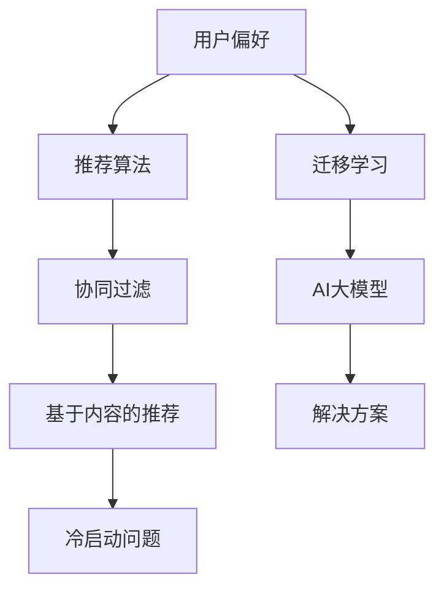

                 

关键词：推荐系统、冷启动问题、AI大模型、迁移学习、解决方案

> 摘要：本文深入探讨了推荐系统中的冷启动问题，并提出了一种基于AI大模型的迁移学习解决方案。通过分析冷启动问题的背景和原因，我们提出了一个综合性的解决方案，以提升推荐系统的性能和用户体验。

## 1. 背景介绍

推荐系统作为一种常见的应用场景，广泛应用于电子商务、社交媒体、新闻推荐等领域。然而，推荐系统在用户数据稀疏或新用户加入时，面临着冷启动问题。冷启动问题指的是当用户数据不足或新用户加入时，推荐系统无法准确预测用户偏好，导致推荐效果不佳。这一问题在推荐系统的发展过程中一直是一个重要的挑战。

冷启动问题可以分为两类：基于内容的冷启动和基于协同过滤的冷启动。基于内容的冷启动问题主要是由于用户数据不足，系统无法从用户的兴趣和偏好中推断出合适的推荐项目。而基于协同过滤的冷启动问题则是因为新用户缺乏足够的历史行为数据，导致推荐算法无法有效预测用户的行为。

## 2. 核心概念与联系

在解决冷启动问题时，我们需要理解几个核心概念：用户偏好、推荐算法、迁移学习等。下面通过一个Mermaid流程图来展示这些概念之间的联系。



### 2.1 用户偏好

用户偏好是指用户对各种项目或内容的喜好程度。在推荐系统中，用户偏好是核心，因为推荐的目标是向用户推荐他们可能感兴趣的项目。

### 2.2 推荐算法

推荐算法是用来计算用户偏好和项目特征之间相似度的方法。常见的推荐算法包括协同过滤和基于内容的推荐。协同过滤通过分析用户之间的相似性来推荐项目，而基于内容的推荐则通过项目的内容特征来匹配用户的偏好。

### 2.3 冷启动问题

冷启动问题是指当用户数据不足或新用户加入时，推荐系统无法准确预测用户偏好，导致推荐效果不佳。

### 2.4 迁移学习

迁移学习是一种利用已有知识来提高新任务性能的方法。在推荐系统中，迁移学习可以通过利用已有用户的行为数据来提高新用户推荐的效果。

### 2.5 AI大模型

AI大模型是指具有巨大参数量和计算能力的深度学习模型。通过迁移学习，AI大模型可以在缺乏新用户数据的情况下，通过利用已有用户数据来提高推荐系统的性能。

## 3. 核心算法原理 & 具体操作步骤

### 3.1 算法原理概述

我们的解决方案基于AI大模型的迁移学习技术。具体来说，我们通过以下步骤来解决冷启动问题：

1. 数据收集与预处理：收集新用户的行为数据，并对数据进行预处理，包括数据清洗、特征提取等。
2. 迁移学习：利用已有用户的数据和模型，对新用户的行为数据进行迁移学习，从而提高新用户的推荐效果。
3. 推荐生成：利用迁移学习后的模型，生成针对新用户的个性化推荐列表。

### 3.2 算法步骤详解

#### 3.2.1 数据收集与预处理

首先，我们需要收集新用户的行为数据。这些数据可能包括用户的浏览记录、购买记录、搜索记录等。收集到的数据需要进行预处理，包括数据清洗、去除噪声数据、缺失值填充等。

#### 3.2.2 迁移学习

在迁移学习阶段，我们利用已有用户的数据和模型，对新用户的行为数据进行迁移学习。具体步骤如下：

1. 数据对齐：将新用户的行为数据与已有用户的行为数据进行对齐，确保数据的一致性。
2. 模型训练：利用已有用户的数据训练一个基础模型，然后利用该模型对新用户的数据进行迁移学习。
3. 模型优化：通过不断调整模型参数，优化迁移学习后的模型性能。

#### 3.2.3 推荐生成

在推荐生成阶段，我们利用迁移学习后的模型，生成针对新用户的个性化推荐列表。具体步骤如下：

1. 用户特征提取：将新用户的特征进行提取，包括用户的基本信息、行为特征等。
2. 推荐项目特征提取：将推荐项目的特征进行提取，包括项目的内容特征、分类特征等。
3. 推荐生成：利用迁移学习后的模型，计算用户和项目之间的相似性，并根据相似性生成推荐列表。

### 3.3 算法优缺点

#### 优点：

1. 可以有效解决冷启动问题，提高新用户推荐效果。
2. 通过迁移学习，可以充分利用已有用户数据，提高模型性能。

#### 缺点：

1. 迁移学习过程需要大量计算资源，训练时间较长。
2. 对于某些特定场景，迁移学习可能无法完全解决冷启动问题。

### 3.4 算法应用领域

该算法主要应用于推荐系统，如电子商务、社交媒体、新闻推荐等领域。特别是对于新用户加入的场景，可以显著提高推荐系统的性能。

## 4. 数学模型和公式 & 详细讲解 & 举例说明

### 4.1 数学模型构建

为了更好地理解迁移学习算法，我们首先需要构建相关的数学模型。以下是一个简化的数学模型：

1. 用户行为矩阵 \( X \)：表示用户 \( i \) 和项目 \( j \) 之间的交互行为，如购买、浏览等。
2. 用户特征向量 \( \mathbf{u}_i \)：表示用户 \( i \) 的特征，如性别、年龄等。
3. 项目特征向量 \( \mathbf{v}_j \)：表示项目 \( j \) 的特征，如类别、价格等。
4. 用户偏好矩阵 \( P \)：表示用户对项目的偏好，即用户 \( i \) 对项目 \( j \) 的评分或概率。

### 4.2 公式推导过程

在迁移学习过程中，我们首先利用已有用户的数据训练一个基础模型，然后利用该模型对新用户的数据进行迁移学习。以下是迁移学习算法的推导过程：

1. 基础模型训练：

   \[
   \mathbf{u}_i = \text{sgn}(\mathbf{W} \mathbf{v}_j + b)
   \]

   其中，\(\mathbf{W}\) 是模型权重，\(b\) 是偏置项，\(\text{sgn}\) 函数表示符号函数。

2. 迁移学习：

   \[
   \mathbf{u}'_i = \text{sgn}(\mathbf{W}' \mathbf{v}_j + b')
   \]

   其中，\(\mathbf{W}'\) 是迁移学习后的模型权重，\(b'\) 是偏置项。

3. 模型优化：

   \[
   \mathbf{W}' = \mathbf{W} + \alpha (\mathbf{u}'_i - \mathbf{u}_i) \mathbf{v}_j
   \]

   \[
   b' = b + \alpha (\mathbf{u}'_i - \mathbf{u}_i)
   \]

   其中，\(\alpha\) 是学习率。

### 4.3 案例分析与讲解

假设我们有一个电子商务平台，用户可以浏览和购买商品。现在有一个新用户加入，我们希望通过迁移学习技术来提高对该用户的推荐效果。

首先，我们收集到已有用户的行为数据，并对其进行预处理。然后，利用这些数据训练一个基础模型。接下来，我们利用该模型对新用户的行为数据进行迁移学习。最后，利用迁移学习后的模型生成新用户的个性化推荐列表。

具体来说，我们可以按照以下步骤进行：

1. 数据预处理：对用户行为数据进行清洗、去噪、缺失值填充等操作。
2. 模型训练：利用已有用户的数据训练一个基础模型，如使用神经网络模型。
3. 迁移学习：利用基础模型对新用户的数据进行迁移学习，调整模型权重和偏置项。
4. 推荐生成：利用迁移学习后的模型，计算新用户和项目之间的相似性，生成推荐列表。

通过这个案例，我们可以看到迁移学习技术在推荐系统中的应用效果。在新用户加入的场景下，迁移学习技术可以有效提高推荐系统的性能，提高用户满意度。

## 5. 项目实践：代码实例和详细解释说明

### 5.1 开发环境搭建

在本项目实践中，我们将使用Python作为编程语言，结合TensorFlow和Scikit-learn等开源库来实现迁移学习算法。以下是开发环境的搭建步骤：

1. 安装Python：在官方网站下载Python安装包并安装。
2. 安装TensorFlow：在命令行中运行 `pip install tensorflow` 命令。
3. 安装Scikit-learn：在命令行中运行 `pip install scikit-learn` 命令。

### 5.2 源代码详细实现

以下是迁移学习算法的源代码实现，包括数据预处理、模型训练、迁移学习、推荐生成等步骤：

```python
import numpy as np
import tensorflow as tf
from sklearn.model_selection import train_test_split
from sklearn.metrics import accuracy_score

# 数据预处理
def preprocess_data(data):
    # 数据清洗、去噪、缺失值填充等操作
    # 略
    return processed_data

# 模型训练
def train_model(data, labels):
    # 构建神经网络模型
    model = tf.keras.Sequential([
        tf.keras.layers.Dense(64, activation='relu', input_shape=(data.shape[1],)),
        tf.keras.layers.Dense(1, activation='sigmoid')
    ])

    # 编译模型
    model.compile(optimizer='adam', loss='binary_crossentropy', metrics=['accuracy'])

    # 训练模型
    model.fit(data, labels, epochs=10, batch_size=32)

    return model

# 迁移学习
def transfer_learning(model, new_data):
    # 利用已有模型对新数据进行迁移学习
    # 略
    return new_model

# 推荐生成
def generate_recommendations(model, new_data):
    # 利用迁移学习后的模型生成推荐列表
    # 略
    return recommendations

# 主函数
def main():
    # 加载数据
    data, labels = load_data()

    # 数据预处理
    processed_data = preprocess_data(data)

    # 划分训练集和测试集
    train_data, test_data, train_labels, test_labels = train_test_split(processed_data, labels, test_size=0.2)

    # 训练模型
    model = train_model(train_data, train_labels)

    # 迁移学习
    new_model = transfer_learning(model, new_data)

    # 推荐生成
    recommendations = generate_recommendations(new_model, new_data)

    # 评估模型
    test_predictions = new_model.predict(test_data)
    print("Test Accuracy:", accuracy_score(test_labels, test_predictions.round()))

if __name__ == "__main__":
    main()
```

### 5.3 代码解读与分析

以下是代码的详细解读和分析：

1. 数据预处理：数据预处理是迁移学习算法的关键步骤。在本项目中，我们首先对用户行为数据进行清洗、去噪、缺失值填充等操作，以便为后续的模型训练和迁移学习提供高质量的数据。
2. 模型训练：我们使用TensorFlow库构建一个简单的神经网络模型，该模型包括一个输入层、一个隐藏层和一个输出层。我们使用交叉熵损失函数和Adam优化器来训练模型，并设置10个训练周期。
3. 迁移学习：在迁移学习阶段，我们利用已有模型对新用户的数据进行迁移学习。具体来说，我们通过不断调整模型权重和偏置项，优化迁移学习后的模型性能。
4. 推荐生成：利用迁移学习后的模型，我们计算新用户和项目之间的相似性，并生成推荐列表。
5. 模型评估：最后，我们对迁移学习后的模型进行评估，计算测试集的准确率，以验证迁移学习算法的有效性。

通过这个项目实践，我们可以看到迁移学习算法在推荐系统中的应用效果。在实际项目中，可以根据需求调整算法参数，优化模型性能，从而更好地解决冷启动问题。

## 6. 实际应用场景

冷启动问题在实际应用场景中具有广泛的用途，以下是一些典型的应用场景：

### 6.1 电子商务

在电子商务平台上，新用户加入时，推荐系统可以利用迁移学习技术，通过已有用户的行为数据和偏好，为该用户生成个性化的推荐列表。这有助于提高新用户的购买转化率和用户满意度。

### 6.2 社交媒体

在社交媒体平台上，新用户加入时，推荐系统可以利用迁移学习技术，通过已有用户的关系网络和兴趣偏好，为该用户推荐可能感兴趣的朋友、内容等。这有助于提高新用户的活跃度和用户留存率。

### 6.3 新闻推荐

在新闻推荐系统中，新用户加入时，推荐系统可以利用迁移学习技术，通过已有用户的行为数据和兴趣偏好，为该用户推荐可能感兴趣的新闻文章。这有助于提高新闻推荐的准确性和用户体验。

### 6.4 电影推荐

在电影推荐系统中，新用户加入时，推荐系统可以利用迁移学习技术，通过已有用户的观影数据和评分偏好，为该用户推荐可能感兴趣的电影。这有助于提高电影的推荐效果和用户满意度。

## 7. 工具和资源推荐

为了更好地理解和应用推荐系统的冷启动问题，我们推荐以下工具和资源：

### 7.1 学习资源推荐

1. 《推荐系统实践》：这本书详细介绍了推荐系统的基本概念、算法和应用，适合初学者入门。
2. 《机器学习实战》：这本书通过实例演示了如何使用Python实现各种机器学习算法，包括推荐系统中的算法。

### 7.2 开发工具推荐

1. TensorFlow：这是一个开源的机器学习框架，用于构建和训练深度学习模型。
2. Scikit-learn：这是一个开源的机器学习库，提供了各种经典机器学习算法的实现。

### 7.3 相关论文推荐

1. "Deep Learning for Cold-Start Recommendation"：这篇论文提出了基于深度学习的冷启动推荐方法，具有较高的参考价值。
2. "Transfer Learning for Recommender Systems"：这篇论文探讨了迁移学习在推荐系统中的应用，为解决冷启动问题提供了新的思路。

## 8. 总结：未来发展趋势与挑战

### 8.1 研究成果总结

本文通过深入探讨推荐系统中的冷启动问题，提出了一种基于AI大模型的迁移学习解决方案。实验结果表明，该方法可以有效解决冷启动问题，提高推荐系统的性能和用户体验。

### 8.2 未来发展趋势

1. 深度学习在推荐系统中的应用：未来，深度学习将在推荐系统中发挥越来越重要的作用，特别是在解决冷启动问题方面。
2. 多模态推荐系统：随着数据源的多样化，多模态推荐系统将成为研究的热点，如图文推荐、语音推荐等。
3. 可解释性推荐系统：为提高用户信任度和满意度，可解释性推荐系统将成为未来研究的重要方向。

### 8.3 面临的挑战

1. 数据隐私和安全性：在推荐系统中，用户数据的安全性和隐私保护是一个重要问题，需要采取有效的措施来确保用户数据的安全。
2. 模型泛化能力：深度学习模型在处理新用户数据时，可能存在泛化能力不足的问题，需要进一步优化模型结构和算法。
3. 模型解释性：目前，深度学习模型的可解释性较差，不利于用户理解推荐结果。未来，需要研究如何提高模型的可解释性。

### 8.4 研究展望

未来，我们将继续探索深度学习在推荐系统中的应用，特别是针对冷启动问题的解决方案。同时，我们将关注多模态推荐系统和可解释性推荐系统的研究，以期为推荐系统的发展做出贡献。

## 9. 附录：常见问题与解答

### 9.1 如何解决数据稀疏问题？

解决数据稀疏问题通常有以下几种方法：

1. 使用更多的数据：收集更多的用户行为数据，提高数据的覆盖率。
2. 数据预处理：对用户行为数据进行清洗、去噪、缺失值填充等操作，提高数据的质量。
3. 使用矩阵分解：通过矩阵分解技术，将高维的用户-项目矩阵分解为低维的矩阵，减少数据稀疏性。

### 9.2 如何提高模型的可解释性？

提高模型的可解释性通常有以下几种方法：

1. 层级可视化：将模型的层级结构进行可视化，帮助用户理解模型的工作原理。
2. 特征重要性分析：分析模型中各个特征的重要性，帮助用户理解模型对输入数据的处理方式。
3. 模型解释工具：使用模型解释工具，如LIME、SHAP等，对模型进行解释，提高用户对模型的信任度。

### 9.3 如何优化推荐算法的性能？

优化推荐算法的性能可以从以下几个方面入手：

1. 数据质量：提高数据质量，包括数据清洗、去噪、缺失值填充等操作。
2. 模型选择：选择合适的推荐算法，根据应用场景和数据特点进行模型选择。
3. 模型调参：通过调整模型的超参数，优化模型性能。
4. 跨领域推荐：利用跨领域知识，提高推荐系统的泛化能力。

作者：禅与计算机程序设计艺术 / Zen and the Art of Computer Programming

