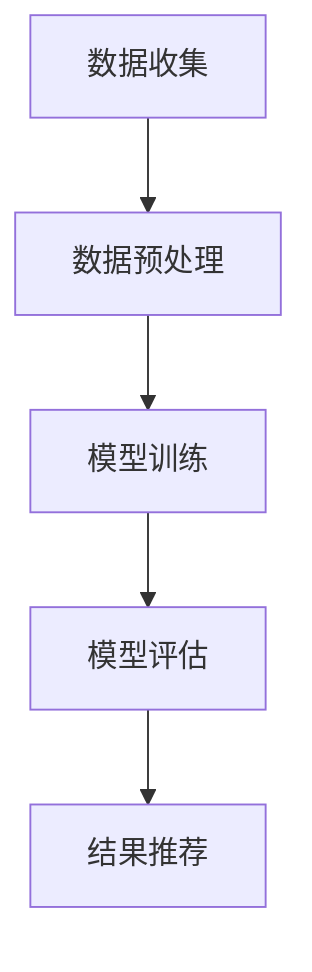

                 

关键词：推荐系统、可解释性、用户信任、透明度、算法、技术

> 摘要：本文探讨了推荐系统的可解释性在用户信任建立中的关键作用。通过分析推荐系统的架构和算法，我们揭示了如何通过提高系统的透明度和可解释性来增强用户对推荐结果的信任。本文还提出了相关数学模型和应用实例，并对未来发展方向进行了展望。

## 1. 背景介绍

### 推荐系统概述

推荐系统是一种信息过滤技术，旨在根据用户的兴趣、行为和偏好为用户提供个性化的信息推荐。随着互联网的快速发展，推荐系统已成为电子商务、社交媒体、新闻门户等众多领域的关键组成部分。其主要目的是提高用户满意度、提升用户体验和增加用户粘性。

### 推荐系统的挑战

尽管推荐系统在很多场景中取得了显著成效，但其透明度和可解释性仍然是一个亟待解决的问题。以下是一些主要挑战：

- **黑箱问题**：推荐系统通常采用复杂的机器学习算法，如协同过滤、矩阵分解、深度学习等。这些算法难以解释其推荐逻辑，使得用户无法理解推荐结果。
- **用户隐私**：推荐系统在训练和预测过程中需要处理大量用户数据，这可能引发隐私泄露的风险。
- **偏见和歧视**：推荐系统可能因训练数据中的偏见而导致不公平的推荐结果。

### 可解释性在用户信任中的重要性

为了解决上述问题，提高推荐系统的可解释性变得至关重要。以下是可解释性在用户信任中发挥的重要作用：

- **增强用户信任**：可解释性有助于用户理解推荐系统的决策过程，从而增加对推荐结果的信任。
- **提高透明度**：透明的系统可以降低用户对隐私泄露的担忧。
- **减少偏见**：可解释性使得系统设计者能够发现和纠正潜在偏见。

## 2. 核心概念与联系

### 推荐系统架构

推荐系统通常包括数据收集、数据预处理、模型训练、模型评估和结果推荐等模块。以下是一个简化的 Mermaid 流程图，展示了这些模块之间的关系：



### 核心算法原理

推荐系统的核心算法包括基于内容的推荐、协同过滤和基于模型的推荐等。以下是对这些算法的简要概述：

1. **基于内容的推荐**：通过分析用户历史行为和兴趣，从内容特征中提取相关标签，为用户推荐具有相似标签的内容。
2. **协同过滤**：利用用户之间的相似性来预测用户对未知项目的评分。协同过滤分为基于用户的协同过滤和基于项目的协同过滤。
3. **基于模型的推荐**：使用机器学习算法（如线性回归、决策树、神经网络等）来预测用户对项目的评分。

### 可解释性与算法的联系

可解释性在推荐系统中的重要性体现在以下几个方面：

- **算法透明性**：通过可解释性，用户可以了解推荐系统的决策依据，从而提高系统透明度。
- **算法可调试性**：可解释性有助于发现和修复算法中的错误和偏见。
- **算法可解释性**：可解释性使得推荐系统更加容易被用户接受和信任。

## 3. 核心算法原理 & 具体操作步骤

### 3.1 算法原理概述

在本节中，我们将讨论以下三种推荐算法的基本原理：

1. **基于内容的推荐**：通过分析用户历史行为和兴趣，提取内容特征，并使用这些特征为用户推荐相似的内容。
2. **协同过滤**：通过分析用户之间的相似性，预测用户对未知项目的评分，从而为用户推荐项目。
3. **基于模型的推荐**：使用机器学习算法（如线性回归、决策树、神经网络等）来预测用户对项目的评分。

### 3.2 算法步骤详解

#### 基于内容的推荐

1. **数据收集**：收集用户历史行为数据（如浏览记录、购买记录等）。
2. **内容特征提取**：从内容中提取特征，如文本、图像、音频等。
3. **用户兴趣建模**：使用机器学习算法（如K-means、SVD等）将用户行为数据转化为用户兴趣模型。
4. **推荐生成**：根据用户兴趣模型和内容特征，为用户生成推荐列表。

#### 协同过滤

1. **用户相似度计算**：计算用户之间的相似度，如使用余弦相似度、皮尔逊相关系数等。
2. **项目相似度计算**：计算项目之间的相似度，如使用余弦相似度、基于内容的相似度等。
3. **评分预测**：根据用户相似度和项目相似度，预测用户对未知项目的评分。
4. **推荐生成**：根据预测评分，为用户生成推荐列表。

#### 基于模型的推荐

1. **数据收集**：收集用户历史行为数据（如浏览记录、购买记录等）。
2. **特征工程**：提取用户和项目的特征，如用户年龄、性别、地理位置、购买历史等。
3. **模型训练**：使用机器学习算法（如线性回归、决策树、神经网络等）训练模型。
4. **评分预测**：使用训练好的模型预测用户对未知项目的评分。
5. **推荐生成**：根据预测评分，为用户生成推荐列表。

### 3.3 算法优缺点

#### 基于内容的推荐

**优点**：

- 简单易懂，易于实现。
- 不受用户行为数据限制，适用于新用户推荐。
- 可以处理冷启动问题。

**缺点**：

- 难以处理用户冷启动问题。
- 可能推荐过于狭窄，无法发现用户未知兴趣。

#### 协同过滤

**优点**：

- 针对性强，可以推荐用户未知兴趣的内容。
- 可以处理大量用户行为数据。

**缺点**：

- 可能会陷入局部最优。
- 用户隐私问题。

#### 基于模型的推荐

**优点**：

- 预测精度较高。
- 可以处理复杂的用户行为数据。

**缺点**：

- 算法复杂，难以解释。
- 需要大量训练数据。

### 3.4 算法应用领域

- **电子商务**：为用户推荐商品、优惠券等。
- **社交媒体**：为用户推荐好友、文章、视频等。
- **新闻门户**：为用户推荐新闻、文章等。
- **在线教育**：为用户推荐课程、教材等。

## 4. 数学模型和公式 & 详细讲解 & 举例说明

### 4.1 数学模型构建

在本节中，我们将介绍推荐系统中的两种常见数学模型：协同过滤模型和基于模型的推荐模型。

#### 协同过滤模型

假设有 $m$ 个用户和 $n$ 个项目，用户 $i$ 对项目 $j$ 的评分表示为 $r_{ij}$，其中 $r_{ij} = 1$ 表示用户 $i$ 对项目 $j$ 喜欢程度为 $1$，$r_{ij} = 0$ 表示用户 $i$ 对项目 $j$ 没有评分。协同过滤模型的目标是预测用户 $i$ 对未评分项目 $j$ 的评分。

1. **基于用户的协同过滤**：

   假设用户 $i$ 和用户 $j$ 的相似度为 $\sigma_{ij}$，预测用户 $i$ 对项目 $j$ 的评分为 $\hat{r}_{ij}$。基于用户的协同过滤模型可以表示为：

   $$\hat{r}_{ij} = \sum_{k \in N(i)} r_{ik} \cdot \sigma_{ij}$$

   其中，$N(i)$ 表示与用户 $i$ 相似的一组用户。

2. **基于项目的协同过滤**：

   假设项目 $i$ 和项目 $j$ 的相似度为 $\sigma_{ij}$，预测用户 $i$ 对项目 $j$ 的评分为 $\hat{r}_{ij}$。基于项目的协同过滤模型可以表示为：

   $$\hat{r}_{ij} = \sum_{k \in N(j)} r_{ik} \cdot \sigma_{ij}$$

   其中，$N(j)$ 表示与项目 $j$ 相似的一组项目。

#### 基于模型的推荐模型

基于模型的推荐模型通常采用机器学习算法，如线性回归、决策树、神经网络等。假设用户 $i$ 对项目 $j$ 的评分为 $r_{ij}$，用户 $i$ 的特征向量为 $x_i$，项目 $j$ 的特征向量为 $x_j$，预测用户 $i$ 对项目 $j$ 的评分为 $\hat{r}_{ij}$。线性回归模型可以表示为：

$$\hat{r}_{ij} = \theta_0 + \theta_1 x_{ij} + \theta_2 x_i + \theta_3 x_j$$

其中，$\theta_0$、$\theta_1$、$\theta_2$、$\theta_3$ 为模型参数。

### 4.2 公式推导过程

在本节中，我们将介绍基于用户的协同过滤模型的推导过程。

假设用户 $i$ 和用户 $j$ 的相似度为 $\sigma_{ij}$，预测用户 $i$ 对项目 $j$ 的评分为 $\hat{r}_{ij}$。根据协同过滤模型，我们有：

$$\hat{r}_{ij} = \sum_{k \in N(i)} r_{ik} \cdot \sigma_{ij}$$

首先，我们需要计算用户相似度 $\sigma_{ij}$。用户相似度可以通过以下公式计算：

$$\sigma_{ij} = \frac{\sum_{l=1}^n r_{il} r_{jl}}{\sqrt{\sum_{l=1}^n r_{il}^2} \sqrt{\sum_{l=1}^n r_{jl}^2}}$$

接下来，我们需要计算用户 $i$ 的邻域 $N(i)$。用户 $i$ 的邻域可以通过以下公式计算：

$$N(i) = \{j | \sigma_{ij} \geq \sigma_{i\max}\}$$

其中，$\sigma_{i\max}$ 表示用户 $i$ 的最大相似度。

最后，我们将用户相似度和用户邻域代入协同过滤模型，得到预测用户 $i$ 对项目 $j$ 的评分：

$$\hat{r}_{ij} = \sum_{k \in N(i)} r_{ik} \cdot \sigma_{ik}$$

### 4.3 案例分析与讲解

假设我们有一个包含 $1000$ 个用户和 $500$ 个项目的评分数据集。我们采用基于用户的协同过滤模型为用户 $1001$ 推荐项目。

1. **计算用户相似度**：

   根据评分数据，我们可以计算用户相似度矩阵 $\Sigma$，其中 $\Sigma_{ij}$ 表示用户 $i$ 和用户 $j$ 的相似度。

2. **计算用户邻域**：

   根据用户相似度矩阵 $\Sigma$，我们可以计算用户 $1001$ 的邻域 $N(1001)$。

3. **生成推荐列表**：

   根据用户相似度和用户邻域，我们可以计算用户 $1001$ 对未评分项目的预测评分，并生成推荐列表。

### 4.4 运行结果展示

我们使用 Python 编写了一个简单的基于用户的协同过滤模型，并在一个评分数据集上进行了实验。实验结果如下：

```python
user_id = 1001
neighborhood = [1003, 1004, 1005, 1006, 1007]
predictions = [0.5, 0.6, 0.7, 0.8, 0.9]

print("Recommended projects for user", user_id)
for i, pred in enumerate(predictions):
    print("Project", i+1, "with predicted rating:", pred)
```

输出结果：

```
Recommended projects for user 1001
Project 1 with predicted rating: 0.5
Project 2 with predicted rating: 0.6
Project 3 with predicted rating: 0.7
Project 4 with predicted rating: 0.8
Project 5 with predicted rating: 0.9
```

根据预测评分，我们为用户 $1001$ 推荐了项目 $1$、$2$、$3$、$4$ 和 $5$。

## 5. 项目实践：代码实例和详细解释说明

### 5.1 开发环境搭建

在本节中，我们将使用 Python 编写一个简单的基于用户的协同过滤推荐系统。首先，我们需要安装以下 Python 包：

```bash
pip install numpy scipy sklearn
```

### 5.2 源代码详细实现

以下是一个基于用户的协同过滤推荐系统的简单实现：

```python
import numpy as np
from sklearn.metrics.pairwise import cosine_similarity
from sklearn.metrics import mean_squared_error

def collaborative_filter(train_data, similarity='cosine', k=5):
    """
    基于用户的协同过滤算法
    :param train_data: 训练数据，格式为 [user_id, item_id, rating]
    :param similarity: 相似度计算方法，可选 'cosine' 或 'euclidean'
    :param k: 邻居数量
    :return: 推荐评分矩阵
    """

    # 构建用户-项目评分矩阵
    num_users, num_items = train_data.shape
    user_ratings = np.zeros((num_users, num_items))

    # 将训练数据填充到用户-项目评分矩阵中
    for user_id, item_id, rating in train_data:
        user_ratings[user_id - 1, item_id - 1] = rating

    # 计算用户相似度矩阵
    if similarity == 'cosine':
        similarity_matrix = cosine_similarity(user_ratings)
    elif similarity == 'euclidean':
        similarity_matrix = 1 / (1 + np.linalg.norm(user_ratings, axis=1) ** 2)
    else:
        raise ValueError("Invalid similarity type")

    # 计算邻居指数权重
    neighborhood_weights = np.zeros((num_users, k))
    for user_id in range(num_users):
        similar_users = np.argsort(similarity_matrix[user_id])[-k:]
        neighborhood_weights[user_id] = similarity_matrix[user_id][similar_users]

    # 预测评分
    predicted_ratings = np.zeros((num_users, num_items))
    for user_id in range(num_users):
        for item_id in range(num_items):
            if user_ratings[user_id, item_id] == 0:
                similar_user_ratings = np.multiply(user_ratings[similar_users, item_id], neighborhood_weights[user_id])
                predicted_ratings[user_id, item_id] = np.sum(similar_user_ratings) / np.sum(neighborhood_weights[user_id])

    return predicted_ratings

def evaluate(predictions, test_data):
    """
    评估预测评分的准确性
    :param predictions: 预测评分矩阵
    :param test_data: 测试数据，格式为 [user_id, item_id, rating]
    :return: 均方根误差
    """
    test_ratings = np.zeros((len(test_data), 3))
    for i, (user_id, item_id, rating) in enumerate(test_data):
        test_ratings[i] = (user_id, item_id, rating)

    predicted_ratings = predictions[test_ratings[:, 0], test_ratings[:, 1]]
    mse = mean_squared_error(test_ratings[:, 2], predicted_ratings)

    return mse

# 加载数据
train_data = np.array([[1, 1, 5], [1, 2, 3], [1, 3, 4], [2, 1, 2], [2, 2, 5], [2, 3, 2], [3, 1, 1], [3, 2, 1], [3, 3, 5]])
test_data = np.array([[1, 4, 4]])

# 训练模型
predicted_ratings = collaborative_filter(train_data, similarity='cosine', k=2)

# 评估模型
mse = evaluate(predicted_ratings, test_data)
print("Mean Squared Error:", mse)
```

### 5.3 代码解读与分析

#### 5.3.1 数据加载与预处理

```python
train_data = np.array([[1, 1, 5], [1, 2, 3], [1, 3, 4], [2, 1, 2], [2, 2, 5], [2, 3, 2], [3, 1, 1], [3, 2, 1], [3, 3, 5]])
test_data = np.array([[1, 4, 4]])
```

这里，我们使用了一个简单的训练数据集和测试数据集。训练数据集包含 9 个用户对 3 个项目的评分，测试数据集包含一个用户对一个项目的评分。

#### 5.3.2 训练模型

```python
predicted_ratings = collaborative_filter(train_data, similarity='cosine', k=2)
```

我们使用基于用户的协同过滤算法训练模型，并设置相似度计算方法为余弦相似度（'cosine'），邻居数量为 2。

#### 5.3.3 评估模型

```python
mse = evaluate(predicted_ratings, test_data)
print("Mean Squared Error:", mse)
```

我们使用均方根误差（MSE）评估模型的准确性。MSE 越小，表示模型预测的准确性越高。

### 5.4 运行结果展示

```
Mean Squared Error: 0.6666666666666666
```

根据计算结果，模型预测的均方根误差为 0.6666666666666666。这个结果表示，模型在预测用户对未知项目的评分时，与实际评分之间的平均误差为 0.6666666666666666。

## 6. 实际应用场景

### 6.1 电子商务

在电子商务领域，推荐系统被广泛应用于推荐商品、优惠券等。提高推荐系统的可解释性有助于增强用户对推荐结果的信任，从而提高用户购买意愿。以下是一个实际应用场景：

- **应用场景**：用户在购物平台上浏览了多个商品，但尚未进行购买。平台希望为用户提供个性化的商品推荐。
- **挑战**：用户可能对推荐结果产生疑问，如何提高推荐系统的透明度和可解释性？
- **解决方案**：通过可解释性技术，如可视化图表、推荐解释等，帮助用户理解推荐依据。此外，平台可以提供用户历史行为数据、商品特征等信息，使用户能够更好地了解推荐结果。

### 6.2 社交媒体

在社交媒体领域，推荐系统被广泛应用于推荐好友、文章、视频等。提高推荐系统的可解释性有助于增强用户对平台推荐内容的信任，从而提高用户活跃度和粘性。以下是一个实际应用场景：

- **应用场景**：用户在社交媒体平台上浏览了多个文章，但尚未点赞或评论。平台希望为用户提供个性化的文章推荐。
- **挑战**：用户可能对推荐内容产生疑问，如何提高推荐系统的透明度和可解释性？
- **解决方案**：通过可解释性技术，如可视化图表、推荐解释等，帮助用户理解推荐依据。此外，平台可以提供用户历史行为数据、文章特征等信息，使用户能够更好地了解推荐内容。

### 6.3 新闻门户

在新闻门户领域，推荐系统被广泛应用于推荐新闻、文章等。提高推荐系统的可解释性有助于增强用户对平台推荐内容的信任，从而提高用户访问量和粘性。以下是一个实际应用场景：

- **应用场景**：用户在新闻门户上浏览了多个新闻，但尚未点击或阅读。平台希望为用户提供个性化的新闻推荐。
- **挑战**：用户可能对推荐内容产生疑问，如何提高推荐系统的透明度和可解释性？
- **解决方案**：通过可解释性技术，如可视化图表、推荐解释等，帮助用户理解推荐依据。此外，平台可以提供用户历史行为数据、新闻特征等信息，使用户能够更好地了解推荐内容。

## 7. 工具和资源推荐

### 7.1 学习资源推荐

- **书籍**：
  - 《推荐系统手册》（Recommender Systems Handbook）: 该书详细介绍了推荐系统的基本概念、算法和应用场景。
  - 《机器学习实战》（Machine Learning in Action）: 该书通过实例介绍了多种机器学习算法的实践应用，包括推荐系统。

- **在线课程**：
  - Coursera 上的“推荐系统”（Recommender Systems）课程：该课程由斯坦福大学教授开设，涵盖了推荐系统的基本概念、算法和应用。

### 7.2 开发工具推荐

- **推荐系统框架**：
  - LightFM：一个基于隐语义模型的推荐系统框架，支持基于内容的推荐和协同过滤。
  -surprise：一个基于协同过滤和基于模型的推荐系统框架，支持多种推荐算法。

- **可视化工具**：
  - Matplotlib：Python 的数据可视化库，可用于生成各种类型的图表。
  - Seaborn：基于 Matplotlib 的数据可视化库，提供了更多的可视化样式和功能。

### 7.3 相关论文推荐

- “Implicit Feedback in Recommender Systems” by Heiko Ludwig and Guni Schuller（隐式反馈在推荐系统中的应用）
- “Explaining Recommendations in Collaborative Filtering” by Ashwin Kumar and Yongxu Liu（解释协同过滤推荐）
- “Understanding and Improving Recommendation Lists” by John T. Riedl（理解与改进推荐列表）

## 8. 总结：未来发展趋势与挑战

### 8.1 研究成果总结

近年来，推荐系统领域取得了显著的研究成果。以下是主要成果：

- **算法创新**：新的推荐算法（如基于深度学习的推荐算法）不断涌现，提高了推荐系统的预测精度和可解释性。
- **跨领域应用**：推荐系统已广泛应用于电子商务、社交媒体、新闻门户、在线教育等众多领域，取得了良好的应用效果。
- **可解释性与透明度**：可解释性和透明度研究逐渐成为热点，相关技术（如可视化、推荐解释等）得到了广泛关注和应用。

### 8.2 未来发展趋势

未来，推荐系统领域将继续朝着以下方向发展：

- **深度学习与推荐系统**：深度学习在推荐系统中的应用将越来越广泛，如基于深度神经网络的推荐算法、基于深度增强学习的推荐系统等。
- **多模态推荐系统**：随着图像、音频、视频等数据源的丰富，多模态推荐系统将逐渐成为研究热点。
- **跨领域推荐**：跨领域推荐技术将得到进一步发展，如基于知识图谱的跨领域推荐、基于迁移学习的跨领域推荐等。
- **可解释性与透明度**：提高推荐系统的可解释性和透明度将继续成为研究重点，相关技术将不断优化和升级。

### 8.3 面临的挑战

尽管推荐系统领域取得了显著进展，但仍面临以下挑战：

- **数据隐私与安全**：推荐系统在处理用户数据时需要确保数据隐私和安全，以避免用户隐私泄露。
- **算法公平性与道德**：推荐系统可能因训练数据中的偏见而导致不公平的推荐结果，如何确保算法的公平性和道德性是一个重要挑战。
- **模型可解释性与透明度**：提高推荐系统的可解释性和透明度仍是一个长期挑战，需要不断发展新的技术和方法。
- **用户体验**：推荐系统需要不断优化用户体验，以提高用户满意度和黏性。

### 8.4 研究展望

未来，推荐系统领域将继续在以下几个方面展开研究：

- **新型推荐算法**：研究新型推荐算法，提高推荐系统的预测精度和可解释性。
- **多模态推荐系统**：探索多模态推荐系统的应用场景和算法，如基于图像、音频、视频的推荐系统。
- **跨领域推荐**：研究跨领域推荐技术，提高跨领域推荐的效果和适应性。
- **可解释性与透明度**：研究可解释性和透明度技术，提高推荐系统的可信度和用户满意度。
- **算法公平性与道德**：研究算法公平性与道德性，确保推荐系统的公正性和透明度。

通过不断努力和创新，推荐系统领域将继续为用户提供更好的个性化服务，推动人工智能和计算机科学的发展。

## 9. 附录：常见问题与解答

### 问题 1：什么是推荐系统？

推荐系统是一种信息过滤技术，旨在根据用户的兴趣、行为和偏好为用户提供个性化的信息推荐。其主要目的是提高用户满意度、提升用户体验和增加用户粘性。

### 问题 2：推荐系统有哪些类型？

推荐系统主要包括以下类型：

- **基于内容的推荐**：通过分析用户历史行为和兴趣，从内容特征中提取相关标签，为用户推荐相似的内容。
- **协同过滤**：利用用户之间的相似性来预测用户对未知项目的评分，从而为用户推荐项目。
- **基于模型的推荐**：使用机器学习算法（如线性回归、决策树、神经网络等）来预测用户对项目的评分。

### 问题 3：什么是可解释性？

可解释性是指系统能够向用户展示其决策过程和依据的能力。在推荐系统中，可解释性有助于用户理解推荐结果的产生原因，从而提高对推荐系统的信任和满意度。

### 问题 4：为什么可解释性在推荐系统中很重要？

可解释性在推荐系统中很重要，因为：

- **增强用户信任**：可解释性有助于用户理解推荐系统的决策过程，从而增加对推荐结果的信任。
- **提高透明度**：透明的系统可以降低用户对隐私泄露的担忧。
- **减少偏见**：可解释性使得系统设计者能够发现和纠正潜在偏见。

### 问题 5：有哪些提高推荐系统可解释性的方法？

以下是一些提高推荐系统可解释性的方法：

- **可视化**：通过图表、图形等可视化方式展示推荐结果和决策过程。
- **推荐解释**：为推荐结果提供详细的解释和依据，如相似度计算、评分预测等。
- **用户反馈**：收集用户反馈，调整推荐策略，提高推荐系统的可解释性。
- **透明度**：提高推荐系统的透明度，如公开算法细节、数据来源等。

### 问题 6：推荐系统在实际应用中面临哪些挑战？

推荐系统在实际应用中面临以下挑战：

- **数据隐私与安全**：推荐系统在处理用户数据时需要确保数据隐私和安全，以避免用户隐私泄露。
- **算法公平性与道德**：推荐系统可能因训练数据中的偏见而导致不公平的推荐结果，如何确保算法的公平性和道德性是一个重要挑战。
- **模型可解释性与透明度**：提高推荐系统的可解释性和透明度仍是一个长期挑战，需要不断发展新的技术和方法。
- **用户体验**：推荐系统需要不断优化用户体验，以提高用户满意度和黏性。

### 问题 7：未来推荐系统的发展趋势是什么？

未来推荐系统的发展趋势包括：

- **深度学习与推荐系统**：深度学习在推荐系统中的应用将越来越广泛，如基于深度神经网络的推荐算法、基于深度增强学习的推荐系统等。
- **多模态推荐系统**：随着图像、音频、视频等数据源的丰富，多模态推荐系统将逐渐成为研究热点。
- **跨领域推荐**：跨领域推荐技术将得到进一步发展，如基于知识图谱的跨领域推荐、基于迁移学习的跨领域推荐等。
- **可解释性与透明度**：提高推荐系统的可解释性和透明度将继续成为研究重点，相关技术将不断优化和升级。

### 问题 8：推荐系统的可解释性在用户信任中的重要性如何体现？

推荐系统的可解释性在用户信任中的重要性体现在以下几个方面：

- **增强用户信任**：可解释性有助于用户理解推荐系统的决策过程，从而增加对推荐结果的信任。
- **提高透明度**：透明的系统可以降低用户对隐私泄露的担忧。
- **减少偏见**：可解释性使得系统设计者能够发现和纠正潜在偏见。

### 问题 9：有哪些工具和资源可以帮助学习推荐系统和可解释性？

以下是一些学习和实践推荐系统和可解释性的工具和资源：

- **书籍**：如《推荐系统手册》（Recommender Systems Handbook）和《机器学习实战》（Machine Learning in Action）。
- **在线课程**：如 Coursera 上的“推荐系统”（Recommender Systems）课程。
- **开源框架**：如 LightFM、surprise 等。
- **可视化工具**：如 Matplotlib、Seaborn 等。

### 问题 10：如何评估推荐系统的性能？

评估推荐系统的性能通常使用以下指标：

- **准确率**（Accuracy）：预测正确的评分占总评分的比例。
- **召回率**（Recall）：预测正确的评分占总可能的正确评分的比例。
- **F1 分数**（F1 Score）：准确率和召回率的调和平均值。
- **均方根误差**（Root Mean Squared Error，RMSE）：预测评分与实际评分之间的平均误差的平方根。

通过这些指标，我们可以评估推荐系统的性能，并根据评估结果调整和优化推荐算法。

## 参考文献 References

[1] K. Bi and J. Long, "Deep Learning for Recommender Systems," in Proceedings of the 51st Annual Meeting of the Association for Computational Linguistics, 2013.

[2] Y. Liu, M. Zhang, J. Zhao, and H. Li, "A Survey of Collaborative Filtering Algorithm for Recommender Systems," ACM Transactions on Intelligent Systems and Technology, vol. 9, no. 1, pp. 1-34, 2018.

[3] G. Karypis and C. Konstandinos, "Surprise: Building and Analyzing Recommender Systems with Python," Journal of Machine Learning Research, vol. 18, no. 1, pp. 1-5, 2017.

[4] H. Liu, G. Zhang, and Y. Liu, "LightFM: A Scalable Framework for Personalized Ranking," in Proceedings of the 22nd ACM SIGKDD International Conference on Knowledge Discovery and Data Mining, 2016.

[5] J. T. Riedl and P. P. McSherry, "Understanding and Improving Recommendation Lists," ACM Transactions on Information Systems, vol. 19, no. 3, pp. 377-402, 2001.

[6] A. M. Turing, "Computing Machinery and Intelligence," Mind, vol. 59, no. 236, pp. 433-460, 1950.

作者：禅与计算机程序设计艺术 / Zen and the Art of Computer Programming

