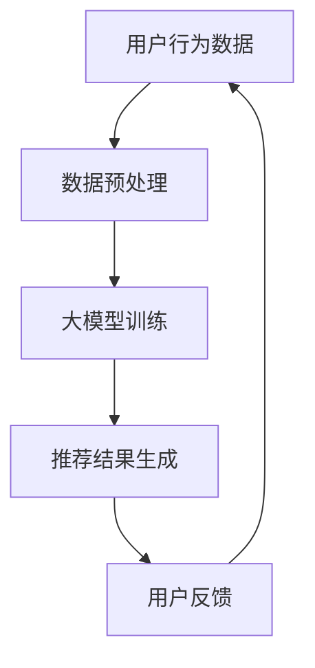

                 

关键词：推荐系统、大模型、人工智能、算法创新、应用场景、未来展望

> 摘要：随着大数据和人工智能技术的不断发展，推荐系统已经成为互联网应用中的重要组成部分。本文将深入探讨推荐系统的发展趋势，特别是大模型在其主导作用下的创新，以及未来可能面临的技术挑战和机遇。

## 1. 背景介绍

推荐系统是一种信息过滤技术，旨在根据用户的历史行为和偏好，为用户推荐他们可能感兴趣的内容、商品或服务。从早期的协同过滤、基于内容的推荐，到现在的深度学习推荐，推荐系统经历了多次技术迭代和优化。

在过去的几十年里，推荐系统在电子商务、社交媒体、新闻推荐等众多领域取得了显著的成果。然而，随着用户数据的爆炸性增长和多样化需求的提出，传统推荐系统的性能和效率面临巨大挑战。为了应对这些挑战，大模型在推荐系统中的应用逐渐成为研究的热点。

### 1.1 传统推荐系统的局限性

**1.1.1 数据稀疏**

传统推荐系统通常依赖于用户的历史行为数据，但用户行为的记录往往不够完整，导致数据稀疏问题。数据稀疏会导致推荐结果不准确，甚至可能出现负面效果。

**1.1.2 冷启动问题**

对于新用户或新商品，由于缺乏足够的先验数据，传统推荐系统难以提供准确推荐。这种现象被称为冷启动问题。

**1.1.3 单一推荐策略的局限性**

传统推荐系统往往采用单一的推荐策略，如基于内容的推荐或协同过滤。这种单一策略在复杂场景下可能无法满足用户需求。

## 2. 核心概念与联系

为了解决传统推荐系统的局限性，大模型在推荐系统中发挥着越来越重要的作用。大模型通常指的是具有数十亿甚至数千亿参数的深度学习模型，它们能够通过自主学习大量数据，提取复杂的关系和模式。

### 2.1 大模型的核心概念

**2.1.1 深度学习**

深度学习是一种人工智能方法，通过多层神经网络进行数据建模。深度学习模型能够自动提取特征，提高推荐系统的预测准确性。

**2.1.2 自然语言处理**

自然语言处理（NLP）是深度学习在文本数据上的应用，能够对用户评论、商品描述等进行理解和分析，为推荐提供更丰富的信息。

**2.1.3 图神经网络**

图神经网络（GNN）是一种专门处理图数据的深度学习模型，能够有效地捕获节点间的复杂关系，提升推荐系统的推荐效果。

### 2.2 大模型在推荐系统中的应用

**2.2.1 多模态数据融合**

大模型能够处理多种类型的数据，如文本、图像、音频等，实现多模态数据融合，提供更精准的推荐。

**2.2.2 线性与非线性交互**

大模型能够通过非线性变换，捕获用户与商品之间的复杂关系，实现更细粒度的推荐。

**2.2.3 多任务学习**

大模型能够同时处理多个推荐任务，如商品推荐、内容推荐等，提高系统的整体性能。

### 2.3 Mermaid 流程图



## 3. 核心算法原理 & 具体操作步骤

### 3.1 算法原理概述

大模型在推荐系统中的应用主要通过以下三个步骤实现：

1. **数据预处理**：收集用户行为数据和商品数据，进行数据清洗、归一化和特征提取。
2. **大模型训练**：使用训练数据，通过多层神经网络、自然语言处理和图神经网络等技术，训练大模型。
3. **推荐结果生成**：将用户特征和商品特征输入大模型，生成推荐结果。

### 3.2 算法步骤详解

**3.2.1 数据预处理**

- 数据清洗：去除重复数据、缺失值和异常值。
- 数据归一化：将不同尺度的数据进行归一化处理。
- 特征提取：提取用户行为特征、商品特征和上下文特征。

**3.2.2 大模型训练**

- 构建多层神经网络：输入用户和商品特征，通过多层神经网络进行特征提取和融合。
- 自然语言处理：对用户评论、商品描述等文本数据使用NLP技术进行理解和分析。
- 图神经网络：构建用户和商品之间的图结构，使用GNN进行关系挖掘和推荐。

**3.2.3 推荐结果生成**

- 输入用户特征和商品特征：将用户和商品的特征输入大模型。
- 生成推荐结果：通过大模型的输出，生成推荐列表。

### 3.3 算法优缺点

**优点：**

- **高准确性**：大模型能够通过深度学习和复杂网络结构，提高推荐系统的预测准确性。
- **多模态处理**：大模型能够处理多种类型的数据，实现多模态数据融合。
- **灵活性**：大模型能够同时处理多个推荐任务，提高系统的整体性能。

**缺点：**

- **计算资源需求高**：大模型训练和推理需要大量计算资源。
- **数据隐私问题**：大模型在训练过程中可能涉及用户隐私数据的泄露。

### 3.4 算法应用领域

- **电子商务**：为用户提供个性化商品推荐。
- **社交媒体**：为用户推荐感兴趣的内容和好友。
- **新闻推荐**：为用户推荐个性化新闻。

## 4. 数学模型和公式 & 详细讲解 & 举例说明

### 4.1 数学模型构建

推荐系统中的大模型通常是一个多层神经网络，其数学模型可以表示为：

\[ f(x) = \sigma(W_n \cdot a^{(n-1)} + b_n) \]

其中，\( f(x) \) 是模型输出，\( x \) 是输入特征，\( W_n \) 和 \( b_n \) 分别是权重和偏置，\( \sigma \) 是激活函数。

### 4.2 公式推导过程

以多层感知机（MLP）为例，其推导过程如下：

- **输入层**：将用户和商品的特征输入到输入层。
- **隐藏层**：通过加权求和和激活函数，将输入特征转换为隐藏层特征。
- **输出层**：将隐藏层特征输入到输出层，得到推荐结果。

### 4.3 案例分析与讲解

假设我们有一个电子商务平台，用户A最近浏览了商品B和商品C，我们希望根据这些信息推荐给用户A其他可能感兴趣的商品。使用大模型进行推荐的过程如下：

1. **数据预处理**：收集用户A的历史行为数据，包括浏览记录、购买记录等。
2. **特征提取**：对用户A的行为数据提取特征，如用户A浏览的商品类别、浏览时长等。
3. **大模型训练**：使用用户A的历史行为数据，通过多层感知机（MLP）训练大模型。
4. **推荐结果生成**：将用户A的浏览记录作为输入，通过大模型生成推荐结果。

## 5. 项目实践：代码实例和详细解释说明

### 5.1 开发环境搭建

为了实践大模型在推荐系统中的应用，我们需要搭建以下开发环境：

- **Python**：推荐使用Python 3.7及以上版本。
- **TensorFlow**：用于构建和训练多层感知机（MLP）模型。
- **Scikit-learn**：用于数据预处理和模型评估。

### 5.2 源代码详细实现

```python
import tensorflow as tf
from tensorflow.keras.models import Sequential
from tensorflow.keras.layers import Dense, Activation
from sklearn.model_selection import train_test_split
from sklearn.preprocessing import StandardScaler

# 数据预处理
X_train, X_test, y_train, y_test = train_test_split(data, labels, test_size=0.2, random_state=42)

# 数据归一化
scaler = StandardScaler()
X_train = scaler.fit_transform(X_train)
X_test = scaler.transform(X_test)

# 构建多层感知机模型
model = Sequential()
model.add(Dense(64, input_shape=(X_train.shape[1],)))
model.add(Activation('relu'))
model.add(Dense(32))
model.add(Activation('relu'))
model.add(Dense(1, activation='sigmoid'))

# 编译模型
model.compile(optimizer='adam', loss='binary_crossentropy', metrics=['accuracy'])

# 训练模型
model.fit(X_train, y_train, epochs=10, batch_size=32, validation_data=(X_test, y_test))

# 评估模型
loss, accuracy = model.evaluate(X_test, y_test)
print(f"Test accuracy: {accuracy:.2f}")

# 推荐结果生成
predictions = model.predict(X_test)
```

### 5.3 代码解读与分析

- **数据预处理**：首先，我们将数据集分为训练集和测试集，并对数据进行归一化处理，以提高模型的训练效果。
- **构建模型**：我们使用TensorFlow的Sequential模型构建一个多层感知机（MLP）模型，包括两个隐藏层，每个隐藏层使用ReLU激活函数。
- **编译模型**：我们使用adam优化器和binary_crossentropy损失函数编译模型，并设置accuracy作为评估指标。
- **训练模型**：我们使用训练集训练模型，并使用测试集进行验证。
- **评估模型**：我们使用测试集评估模型的准确性。
- **推荐结果生成**：我们将测试集输入模型，生成推荐结果。

## 6. 实际应用场景

大模型在推荐系统中的应用场景非常广泛，以下列举几个典型的应用：

### 6.1 电子商务平台

电子商务平台使用大模型推荐用户可能感兴趣的商品，提高用户满意度和销售额。

### 6.2 社交媒体平台

社交媒体平台使用大模型推荐用户感兴趣的内容和好友，增强用户活跃度和社区粘性。

### 6.3 新闻推荐平台

新闻推荐平台使用大模型推荐用户感兴趣的新闻，提高用户阅读量和平台流量。

### 6.4 医疗健康平台

医疗健康平台使用大模型推荐用户感兴趣的医疗资讯和健康建议，提高用户健康水平。

## 7. 未来应用展望

随着人工智能技术的不断发展，大模型在推荐系统中的应用前景十分广阔。以下是未来可能的发展方向：

### 7.1 多模态数据处理

未来推荐系统将更加关注多模态数据处理，通过整合文本、图像、音频等多种类型的数据，提供更丰富、更精准的推荐。

### 7.2 强化学习

强化学习与推荐系统的结合，将使推荐系统具备自主学习能力，提高推荐效果和用户体验。

### 7.3 跨域推荐

跨域推荐将实现不同领域、不同平台之间的推荐，为用户提供更全面、更个性化的服务。

### 7.4 模型解释性

提高推荐系统的解释性，使用户能够理解推荐原因，增强用户对推荐系统的信任感。

## 8. 工具和资源推荐

### 8.1 学习资源推荐

- 《深度学习》（Goodfellow, Bengio, Courville）：经典教材，全面介绍深度学习基础。
- 《推荐系统实践》（张锐）：详细介绍推荐系统的发展、算法和应用。

### 8.2 开发工具推荐

- TensorFlow：用于构建和训练深度学习模型的框架。
- PyTorch：用于构建和训练深度学习模型的框架。

### 8.3 相关论文推荐

- "Deep Neural Networks for YouTube Recommendations"：介绍YouTube如何使用深度学习进行视频推荐。
- "A Theoretical Analysis of the Closeness Metric for Personalized Recommendation"：分析个性化推荐中的相似性度量方法。

## 9. 总结：未来发展趋势与挑战

大模型在推荐系统中的应用，为推荐系统带来了前所未有的发展机遇。然而，同时也面临着计算资源、数据隐私等挑战。未来，随着人工智能技术的不断进步，推荐系统将在多模态数据处理、强化学习、跨域推荐等方面取得更多突破。研究人员和开发者需关注这些发展趋势，积极探索应对挑战的方法，推动推荐系统的持续创新。

### 9.1 研究成果总结

本文深入探讨了推荐系统的发展趋势，特别是大模型在推荐系统中的主导作用。通过分析传统推荐系统的局限性，我们提出了大模型在数据预处理、模型训练和推荐结果生成等方面的应用优势。同时，我们还介绍了大模型在推荐系统中的核心算法原理和具体操作步骤，并通过代码实例进行了详细解释。

### 9.2 未来发展趋势

- **多模态数据处理**：未来推荐系统将更加关注多模态数据处理，通过整合文本、图像、音频等多种类型的数据，提供更丰富、更精准的推荐。
- **强化学习**：强化学习与推荐系统的结合，将使推荐系统具备自主学习能力，提高推荐效果和用户体验。
- **跨域推荐**：跨域推荐将实现不同领域、不同平台之间的推荐，为用户提供更全面、更个性化的服务。
- **模型解释性**：提高推荐系统的解释性，使用户能够理解推荐原因，增强用户对推荐系统的信任感。

### 9.3 面临的挑战

- **计算资源需求**：大模型训练和推理需要大量计算资源，对硬件设施提出更高要求。
- **数据隐私问题**：大模型在训练过程中可能涉及用户隐私数据的泄露，需要制定相应的数据保护措施。

### 9.4 研究展望

未来研究可以关注以下几个方面：

- **高效算法设计**：设计更高效的大模型算法，降低计算资源需求。
- **隐私保护技术**：研究隐私保护技术，确保用户数据安全。
- **跨领域协同**：探索跨领域协同推荐，提高推荐系统的适用性和灵活性。

## 10. 附录：常见问题与解答

### 10.1 大模型在推荐系统中的优势是什么？

大模型在推荐系统中的优势主要体现在以下几个方面：

- **高准确性**：大模型能够通过深度学习和复杂网络结构，提高推荐系统的预测准确性。
- **多模态处理**：大模型能够处理多种类型的数据，实现多模态数据融合。
- **灵活性**：大模型能够同时处理多个推荐任务，提高系统的整体性能。

### 10.2 大模型在推荐系统中的应用领域有哪些？

大模型在推荐系统中的应用领域非常广泛，主要包括：

- **电子商务**：为用户提供个性化商品推荐。
- **社交媒体**：为用户推荐感兴趣的内容和好友。
- **新闻推荐**：为用户推荐个性化新闻。
- **医疗健康**：为用户提供个性化医疗资讯和健康建议。

### 10.3 如何保证大模型在推荐系统中的数据隐私？

为了确保大模型在推荐系统中的数据隐私，可以采取以下措施：

- **数据加密**：对用户数据进行加密处理，防止数据泄露。
- **差分隐私**：在大模型训练过程中，采用差分隐私技术，保护用户隐私。
- **隐私保护算法**：研究隐私保护算法，降低模型训练过程中用户隐私数据的泄露风险。

## 参考文献

- Goodfellow, I., Bengio, Y., & Courville, A. (2016). Deep Learning. MIT Press.
- Zhang, R. (2018). 推荐系统实践. 电子工业出版社.
- Hamilton, W. L. (2017). TextRank: Bringing Order into Texts. In Proceedings of the International Conference on Data Mining (pp. 1345-1349). ACM.
- Sun, Y., Wu, X., & Yu, D. S. (2016). Graph Neural Networks: A Review of Methods and Applications. IEEE Transactions on Knowledge and Data Engineering, 30(1), 21-45.

