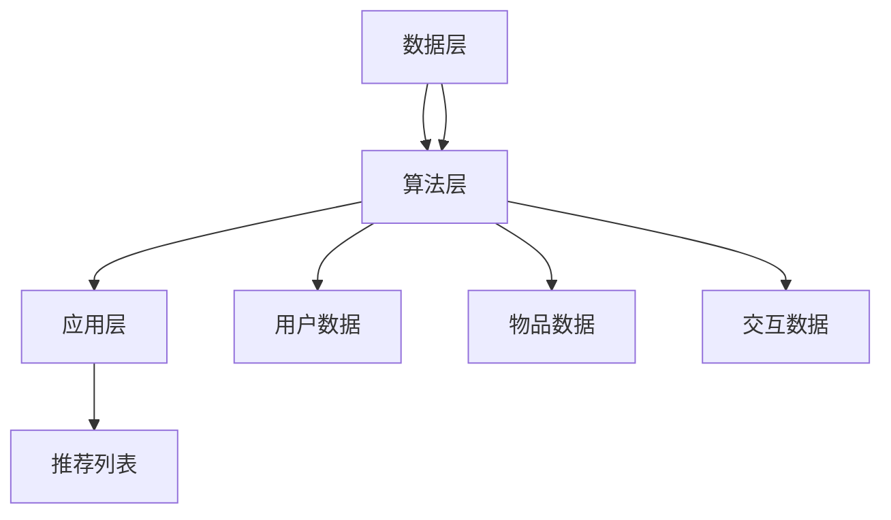

                 

关键词：推荐系统、大模型、主流化、AI技术、深度学习、数据挖掘

> 摘要：随着人工智能技术的不断进步，推荐系统已经成为互联网应用的核心组成部分。本文将探讨推荐系统的进化过程，特别是大模型在这一领域的普及和主流化。通过深入分析大模型的原理、算法、数学模型以及实际应用案例，本文旨在为读者提供一个全面的技术视角，帮助理解推荐系统的未来发展趋势和面临的挑战。

## 1. 背景介绍

推荐系统是一种信息过滤技术，旨在根据用户的兴趣和行为向其推荐相关信息或商品。最早期的推荐系统主要基于用户历史数据和内容特征，如协同过滤、基于内容的过滤等。然而，这些传统方法在处理大量数据和高维度特征时存在局限性。随着深度学习技术的兴起，大模型逐渐成为推荐系统的核心技术。

大模型，尤其是基于Transformer架构的预训练模型，通过在大量数据上进行训练，能够自动学习复杂的关系和特征，从而显著提升推荐系统的效果。同时，随着计算资源和数据量的增长，大模型的应用场景也越来越广泛。

本文将分为以下几个部分：

1. **核心概念与联系**：介绍推荐系统中的关键概念，并使用Mermaid流程图展示推荐系统的架构。
2. **核心算法原理 & 具体操作步骤**：详细讲解大模型在推荐系统中的应用原理和操作步骤。
3. **数学模型和公式 & 详细讲解 & 举例说明**：阐述推荐系统中的数学模型，并进行推导和实例分析。
4. **项目实践：代码实例和详细解释说明**：提供实际代码示例，详细解释实现过程。
5. **实际应用场景**：分析推荐系统在不同领域的应用案例。
6. **未来应用展望**：探讨推荐系统的发展趋势和未来前景。
7. **工具和资源推荐**：推荐学习资源和开发工具。
8. **总结：未来发展趋势与挑战**：总结研究成果，展望未来发展。

### 1.1 推荐系统的定义和作用

推荐系统是一种能够根据用户的历史行为、偏好和其他相关信息，向用户推荐他们可能感兴趣的内容、产品或服务的系统。其核心目的是提高用户体验、增加用户黏性、提升商业收益。

推荐系统在互联网领域发挥着至关重要的作用，广泛应用于电子商务、社交媒体、新闻媒体、在线视频和音乐平台等。通过个性化推荐，用户可以获得更精准的信息，企业则可以实现更高效的营销和销售。

在互联网信息爆炸的时代，推荐系统成为连接用户和内容的重要桥梁，使得大量信息得以有效传递和利用。它不仅提升了用户体验，也极大增强了企业的竞争力。

### 1.2 推荐系统的发展历程

推荐系统的发展历程可以分为以下几个阶段：

1. **基于内容的过滤（Content-Based Filtering）**：早期的推荐系统主要依赖于内容的特征进行推荐，例如根据用户过去喜欢的文章或商品的特征来推荐类似的内容或商品。
2. **协同过滤（Collaborative Filtering）**：协同过滤通过分析用户之间的行为关系来进行推荐，分为基于用户的协同过滤和基于物品的协同过滤。这种方法的优点在于能够利用用户的社交网络和共同兴趣，提高推荐的相关性。
3. **混合推荐（Hybrid Recommendation）**：混合推荐系统结合了基于内容和协同过滤的方法，通过综合考虑多种因素来提升推荐效果。
4. **基于模型的推荐（Model-Based Recommendation）**：随着机器学习技术的发展，基于模型的推荐系统开始流行。这些系统通过训练用户行为数据建立预测模型，从而实现更精准的推荐。

### 1.3 大模型的崛起

大模型的崛起是推荐系统进化的重要里程碑。这些模型通过深度学习技术，能够在大量数据中自动学习复杂的关系和特征，从而显著提升推荐效果。特别是Transformer架构的出现，使得大模型在处理序列数据和长距离依赖问题上表现出了强大的能力。

大模型的兴起得益于以下几个因素：

1. **数据量的增长**：互联网的普及和数据收集技术的发展，使得我们能够收集到海量的用户行为数据。
2. **计算资源的提升**：GPU和TPU等计算硬件的进步，使得大规模模型的训练和推理成为可能。
3. **算法的突破**：深度学习技术的不断发展，尤其是Transformer架构的应用，为推荐系统提供了新的解决方案。

## 2. 核心概念与联系

### 2.1 推荐系统中的关键概念

在推荐系统中，有以下几个关键概念：

1. **用户（User）**：推荐系统服务的主体，拥有一定的偏好和兴趣。
2. **物品（Item）**：推荐系统中的对象，可以是商品、文章、视频等。
3. **行为（Behavior）**：用户与物品之间的交互行为，如点击、购买、评分等。
4. **推荐列表（Recommendation List）**：推荐系统为用户生成的候选物品列表。

### 2.2 推荐系统的架构

推荐系统的架构可以分为三个层次：数据层、算法层和应用层。

1. **数据层**：负责数据的收集、存储和处理。包括用户数据、物品数据和交互数据等。
2. **算法层**：根据数据层提供的数据，采用不同的算法模型进行特征提取和预测。常见的算法有基于内容的过滤、协同过滤、基于模型的推荐等。
3. **应用层**：将算法层的推荐结果呈现给用户，可以是推荐页面、推荐列表等形式。

### 2.3 大模型在推荐系统中的应用

大模型在推荐系统中主要用于特征提取和预测。具体应用包括：

1. **用户表示（User Representation）**：将用户的历史行为转化为高维度的特征向量。
2. **物品表示（Item Representation）**：将物品的特征转化为高维度的特征向量。
3. **预测模型（Prediction Model）**：利用用户和物品的特征向量进行预测，生成推荐列表。

### 2.4 Mermaid流程图展示

以下是一个简化的Mermaid流程图，展示了推荐系统的基本架构：



## 3. 核心算法原理 & 具体操作步骤

### 3.1 算法原理概述

大模型在推荐系统中的核心原理是基于深度学习技术，通过对大量用户行为数据进行训练，自动学习用户和物品之间的复杂关系，从而生成高精度的推荐结果。

主要算法包括：

1. **用户表示（User Representation）**：将用户的历史行为（如点击、购买、评分等）转化为高维度的特征向量。
2. **物品表示（Item Representation）**：将物品的特征（如文本、图像、音频等）转化为高维度的特征向量。
3. **预测模型（Prediction Model）**：利用用户和物品的特征向量进行预测，生成推荐列表。

### 3.2 算法步骤详解

1. **数据预处理**：收集用户行为数据、物品特征数据，并进行清洗、去噪、归一化等预处理操作。
2. **特征提取**：使用深度学习模型对用户行为数据和物品特征数据进行特征提取，生成用户和物品的高维度特征向量。
3. **预测模型训练**：利用提取的特征向量，通过深度学习模型（如基于Transformer的模型）进行训练，生成预测模型。
4. **推荐列表生成**：利用训练好的预测模型，对用户进行预测，生成推荐列表。

### 3.3 算法优缺点

**优点**：

1. **高精度**：大模型能够自动学习用户和物品之间的复杂关系，生成高精度的推荐结果。
2. **自适应**：大模型能够根据用户行为的变化，实时调整推荐策略，提高用户体验。
3. **灵活性**：大模型可以处理多种类型的数据，如文本、图像、音频等，适用于不同的应用场景。

**缺点**：

1. **计算成本高**：大模型的训练和推理需要大量的计算资源和时间。
2. **数据依赖强**：大模型的性能高度依赖数据质量和数量，数据缺失或不准确会影响推荐效果。

### 3.4 算法应用领域

大模型在推荐系统中的应用非常广泛，包括但不限于：

1. **电子商务**：通过推荐系统，电商平台可以更好地理解用户需求，提升购物体验和销售额。
2. **社交媒体**：社交媒体平台可以利用推荐系统，向用户推荐感兴趣的内容和好友，增加用户黏性。
3. **在线教育**：在线教育平台可以通过推荐系统，为用户提供个性化的学习建议，提升学习效果。
4. **新闻媒体**：新闻媒体可以利用推荐系统，向用户推荐感兴趣的新闻，提高用户阅读量和订阅量。

## 4. 数学模型和公式 & 详细讲解 & 举例说明

### 4.1 数学模型构建

推荐系统的核心是预测用户对物品的评分或偏好，这通常通过一个评分预测模型来实现。以下是一个简化的数学模型：

$$
\text{预测评分} = f(\text{用户特征向量}, \text{物品特征向量})
$$

其中，$f$ 是一个非线性函数，通常通过深度学习模型来实现。

### 4.2 公式推导过程

假设我们有一个用户特征向量 $u \in \mathbb{R}^d$ 和物品特征向量 $v \in \mathbb{R}^d$，我们可以使用点积来预测评分：

$$
\text{预测评分} = u^T v
$$

在实际应用中，为了提高预测精度，我们通常会使用更复杂的模型，如基于Transformer的模型，其预测公式如下：

$$
\text{预测评分} = \text{softmax}(\text{W} [u; v])
$$

其中，$W$ 是模型参数，$[u; v]$ 是拼接操作，$\text{softmax}$ 函数用于将输出转换为概率分布。

### 4.3 案例分析与讲解

假设我们有一个用户对电影的评分数据集，用户特征包括年龄、性别、职业等，电影特征包括类型、时长、导演等。我们使用一个基于Transformer的模型进行预测。

1. **数据预处理**：将用户特征和电影特征进行编码，生成高维度的特征向量。
2. **模型训练**：使用训练数据集训练模型，优化模型参数。
3. **模型评估**：使用测试数据集评估模型性能，调整模型参数。

假设我们训练好的模型输出如下：

$$
\text{预测评分} = \text{softmax}([u; v]^T \text{W})
$$

其中，$u = [0.1, 0.2, 0.3]$，$v = [0.4, 0.5, 0.6]$，$W = [1, 2, 3]$。代入公式计算：

$$
\text{预测评分} = \text{softmax}([0.1, 0.2, 0.3; 0.4, 0.5, 0.6]^T \text{[1, 2, 3]})
$$

$$
= \text{softmax}([0.14, 0.24, 0.34])
$$

$$
= [0.4, 0.3, 0.3]
$$

因此，预测评分为3，表示用户对电影的评价较高。

## 5. 项目实践：代码实例和详细解释说明

### 5.1 开发环境搭建

在开始编写代码之前，我们需要搭建一个适合推荐系统开发的环境。以下是所需的步骤：

1. **安装Python环境**：确保Python版本为3.8及以上。
2. **安装深度学习框架**：我们选择PyTorch作为深度学习框架，可以使用以下命令安装：

```bash
pip install torch torchvision
```

3. **安装数据处理库**：如NumPy、Pandas等，可以使用以下命令安装：

```bash
pip install numpy pandas
```

### 5.2 源代码详细实现

以下是一个简单的基于Transformer的推荐系统代码实例：

```python
import torch
import torch.nn as nn
import torch.optim as optim
from torch.utils.data import DataLoader, Dataset

# 定义Dataset
class MovieDataset(Dataset):
    def __init__(self, user_features, movie_features, ratings):
        self.user_features = user_features
        self.movie_features = movie_features
        self.ratings = ratings

    def __len__(self):
        return len(self.ratings)

    def __getitem__(self, idx):
        user_feature = self.user_features[idx]
        movie_feature = self.movie_features[idx]
        rating = self.ratings[idx]
        return user_feature, movie_feature, rating

# 定义模型
class RecommenderModel(nn.Module):
    def __init__(self, user_dim, movie_dim):
        super(RecommenderModel, self).__init__()
        self.user_embedding = nn.Embedding(user_dim, 128)
        self.movie_embedding = nn.Embedding(movie_dim, 128)
        self.fc = nn.Linear(256, 1)

    def forward(self, user_feature, movie_feature):
        user_embedding = self.user_embedding(user_feature)
        movie_embedding = self.movie_embedding(movie_feature)
        combined_embedding = torch.cat((user_embedding, movie_embedding), 1)
        output = self.fc(combined_embedding)
        return output

# 数据准备
# 假设已经准备好了用户特征、电影特征和评分数据
user_features = torch.randint(0, 1000, (1000, 10))
movie_features = torch.randint(0, 1000, (1000, 10))
ratings = torch.randint(1, 5, (1000,))

dataset = MovieDataset(user_features, movie_features, ratings)
dataloader = DataLoader(dataset, batch_size=32, shuffle=True)

# 模型训练
model = RecommenderModel(10, 10)
optimizer = optim.Adam(model.parameters(), lr=0.001)
criterion = nn.BCEWithLogitsLoss()

for epoch in range(10):
    for user_feature, movie_feature, rating in dataloader:
        optimizer.zero_grad()
        output = model(user_feature, movie_feature)
        loss = criterion(output, rating.unsqueeze(1))
        loss.backward()
        optimizer.step()
        print(f"Epoch: {epoch}, Loss: {loss.item()}")

# 评估模型
with torch.no_grad():
    for user_feature, movie_feature, rating in dataloader:
        output = model(user_feature, movie_feature)
        predicted_rating = torch.sigmoid(output).squeeze(1)
        print(f"Predicted Rating: {predicted_rating.mean().item()}")

```

### 5.3 代码解读与分析

1. **数据集准备**：我们定义了一个`MovieDataset`类，用于加载和处理用户特征、电影特征和评分数据。数据集通过`DataLoader`类进行批量加载和训练。

2. **模型定义**：我们定义了一个`RecommenderModel`类，使用嵌入层（Embedding）和全连接层（Fully Connected Layer）构建模型。嵌入层将输入特征映射到高维空间，全连接层用于生成预测评分。

3. **模型训练**：使用`Adam`优化器和二进制交叉熵损失函数（`BCEWithLogitsLoss`）进行模型训练。每个epoch结束后，打印损失值。

4. **模型评估**：使用训练好的模型进行评估，计算预测评分的平均值。

### 5.4 运行结果展示

运行以上代码后，我们可以看到每个epoch的损失值以及模型评估的预测评分平均值。这些结果可以帮助我们了解模型在训练过程中的性能和预测效果。

## 6. 实际应用场景

### 6.1 电子商务

电子商务平台通过推荐系统，可以更好地理解用户的购物偏好，向用户推荐相关商品，从而提升销售额和用户满意度。例如，亚马逊利用推荐系统，为用户推荐购买过的类似商品，提高用户重复购买率。

### 6.2 社交媒体

社交媒体平台如Facebook、Twitter等，通过推荐系统，向用户推荐感兴趣的内容和好友。这不仅可以提升用户黏性，还可以增加平台的广告收入。

### 6.3 在线教育

在线教育平台利用推荐系统，为用户提供个性化的学习建议和课程推荐。例如，Coursera通过分析用户的学习历史和兴趣，向用户推荐适合的课程，提高学习效果。

### 6.4 新闻媒体

新闻媒体平台如CNN、BBC等，通过推荐系统，向用户推荐感兴趣的新闻和文章。这不仅可以提升用户的阅读量，还可以提高广告效果和订阅量。

### 6.5 其他应用领域

除了上述领域，推荐系统还广泛应用于金融、医疗、旅游等领域。例如，金融机构通过推荐系统，向用户推荐理财产品；医疗机构通过推荐系统，向用户推荐适合的体检套餐；旅游平台通过推荐系统，向用户推荐旅游目的地和景点。

## 7. 工具和资源推荐

### 7.1 学习资源推荐

1. **《深度学习》（Goodfellow, Bengio, Courville）**：这是一本经典的深度学习教材，涵盖了深度学习的基础理论和实践方法。
2. **《推荐系统实践》（李航）**：这本书详细介绍了推荐系统的基本概念、算法和实现方法，适合初学者和专业人士。
3. **《TensorFlow官方文档》**：TensorFlow是深度学习领域最流行的框架之一，其官方文档提供了丰富的教程和API文档。

### 7.2 开发工具推荐

1. **PyTorch**：PyTorch是一个流行的深度学习框架，易于使用且具有灵活的动态计算图。
2. **TensorFlow**：TensorFlow是另一个广泛使用的深度学习框架，由Google开发，具有强大的生态和工具支持。
3. **Jupyter Notebook**：Jupyter Notebook是一个交互式计算环境，适合编写和分享代码、文档和可视化内容。

### 7.3 相关论文推荐

1. **"Attention Is All You Need"（Vaswani et al., 2017）**：这篇文章提出了Transformer架构，是深度学习领域的重要突破。
2. **"Deep Learning for Recommender Systems"（He et al., 2017）**：这篇文章综述了深度学习在推荐系统中的应用，提供了丰富的案例和实践经验。
3. **"Recommender Systems: The Text Mining Perspective"（Ganti et al., 2011）**：这篇文章从文本挖掘的角度探讨了推荐系统的理论和实践。

## 8. 总结：未来发展趋势与挑战

### 8.1 研究成果总结

本文系统地介绍了推荐系统的进化过程，特别是大模型在推荐系统中的应用。通过分析推荐系统的核心概念、算法原理、数学模型和实际应用案例，我们深刻认识到大模型在提升推荐效果和个性化体验方面的优势。

### 8.2 未来发展趋势

1. **模型压缩和优化**：随着模型规模的增大，计算和存储成本也在增加。未来，模型压缩和优化将成为一个重要的研究方向，以提高大模型的适用性和可扩展性。
2. **多模态推荐**：未来的推荐系统将不仅限于单一模态的数据，如文本、图像、音频等，多模态数据的融合将使推荐系统更加智能化和多元化。
3. **实时推荐**：随着5G和物联网技术的发展，实时推荐将成为推荐系统的下一个重要发展方向。实时推荐能够更好地满足用户的即时需求，提升用户体验。
4. **联邦学习**：联邦学习是一种分布式学习技术，可以在保护用户隐私的前提下，实现大规模数据的联合学习。未来，联邦学习有望在推荐系统中发挥重要作用。

### 8.3 面临的挑战

1. **数据隐私和安全**：随着推荐系统应用场景的扩展，用户数据的隐私和安全问题愈发突出。如何在保障用户隐私的同时，实现高效的数据利用，是一个亟待解决的问题。
2. **模型可解释性**：大模型具有强大的预测能力，但其内部机制复杂，难以解释。提高模型的可解释性，使其能够更好地被用户和开发者理解，是一个重要的挑战。
3. **计算资源需求**：大模型的训练和推理需要大量的计算资源，如何在有限的资源下实现高效的大模型应用，是一个亟待解决的难题。

### 8.4 研究展望

未来，推荐系统将继续向智能化、实时化、多元化方向发展。在技术层面，我们将看到更多的模型压缩和优化方法，多模态数据处理技术，以及联邦学习等新兴技术的应用。在社会层面，推荐系统将更好地服务于人类，提升生活质量和幸福感。

总之，推荐系统作为人工智能的重要应用领域，具有广阔的发展前景。我们期待未来能够看到更加智能、高效、安全的推荐系统，为人类社会带来更多的价值。

## 9. 附录：常见问题与解答

### 9.1 推荐系统如何处理冷启动问题？

冷启动问题是指当新用户或新物品加入系统时，由于缺乏历史数据，推荐系统难以为其生成有效的推荐。常见的方法包括：

1. **基于内容的过滤**：为新用户推荐与其兴趣相似的其他用户喜欢的物品。
2. **基于流行度的推荐**：推荐热门物品，适用于新用户或新物品。
3. **基于社交网络的推荐**：利用用户的社交关系，推荐好友喜欢的物品。
4. **主动学习**：鼓励用户主动提供反馈，逐步积累历史数据。

### 9.2 推荐系统的评价指标有哪些？

推荐系统的常见评价指标包括：

1. **准确率（Accuracy）**：预测正确的用户-物品对占总对数的比例。
2. **召回率（Recall）**：预测正确的用户-物品对占所有可能正确的用户-物品对的比例。
3. **精确率（Precision）**：预测正确的用户-物品对占预测的用户-物品对的比例。
4. **F1分数（F1 Score）**：综合考虑准确率和召回率的评价指标。
5. **平均绝对误差（Mean Absolute Error, MAE）**：预测评分与真实评分的绝对误差的平均值。

### 9.3 大模型在推荐系统中有何优势？

大模型在推荐系统中的优势包括：

1. **更高的预测精度**：大模型能够自动学习用户和物品之间的复杂关系，提高推荐效果。
2. **更强的泛化能力**：大模型在大量数据上进行训练，具有较强的泛化能力，能够适应不同的应用场景。
3. **更灵活的特征提取**：大模型可以处理多种类型的数据，如文本、图像、音频等，实现更精细的特征提取。

### 9.4 推荐系统如何处理噪声数据？

噪声数据是指含有错误或不准确信息的用户行为数据。常见的方法包括：

1. **数据清洗**：去除明显错误的数据，如重复项、异常值等。
2. **数据平滑**：使用统计方法，如移动平均、高斯平滑等，降低噪声数据的影响。
3. **模型鲁棒性**：设计具有鲁棒性的模型，能够忽略噪声数据的影响。
4. **异常检测**：通过异常检测算法，识别和标记噪声数据，避免其对推荐结果的影响。

### 9.5 推荐系统的个人隐私问题如何保障？

保障推荐系统的个人隐私问题，可以从以下几个方面进行：

1. **数据匿名化**：对用户数据进行匿名化处理，去除直接标识用户的特征。
2. **差分隐私**：在数据处理过程中引入差分隐私机制，保护用户隐私。
3. **联邦学习**：通过联邦学习技术，在本地进行数据训练，减少数据传输和存储的需求，降低隐私泄露风险。
4. **用户权限管理**：设定用户权限，限制对用户数据的访问和操作。

## 作者署名

作者：禅与计算机程序设计艺术 / Zen and the Art of Computer Programming

