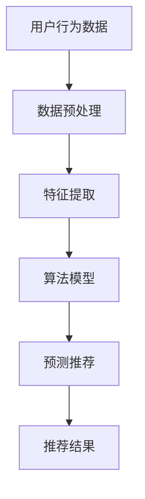

                 

关键词：推荐系统、个性化用户体验、AI技术、算法原理、数学模型、项目实践、应用场景、未来展望

> 摘要：本文旨在探讨推荐系统在现代科技中的应用及其重要性，详细分析推荐系统的核心概念、算法原理、数学模型及其在实际项目中的应用与实践。文章还将展望推荐系统的发展趋势、面临的挑战以及未来的研究方向。

## 1. 背景介绍

推荐系统（Recommender System）是一种信息过滤技术，通过预测用户可能对哪些物品感兴趣，从而向用户推荐相关物品。随着互联网和电子商务的快速发展，推荐系统已经成为提高用户体验、增加用户粘性和销售额的关键技术。

推荐系统的核心在于个性化，即根据用户的历史行为、兴趣偏好以及上下文信息，为每个用户提供个性化的推荐。这种个性化推荐能够大大提高用户满意度和忠诚度，已经成为现代互联网公司争夺市场份额的重要手段。

### 1.1 发展历程

- **早期阶段**：基于内容过滤的推荐系统，通过分析物品的特征来匹配用户的兴趣。
- **中间阶段**：协同过滤推荐系统，通过分析用户之间的行为相似性来进行推荐。
- **现代阶段**：基于深度学习的推荐系统，利用神经网络模型对用户行为进行深度分析，实现更精准的推荐。

### 1.2 应用领域

- **电子商务**：推荐商品给用户，提高购物转化率。
- **社交媒体**：推荐感兴趣的内容给用户，增加用户停留时间。
- **在线视频**：推荐电影、电视剧和短视频，提高用户观看时长。
- **音乐平台**：推荐歌曲给用户，提高音乐播放量。

## 2. 核心概念与联系

推荐系统的核心概念包括用户、物品、评分和推荐算法。

### 2.1 用户与物品

用户（User）：使用推荐系统的主体，其行为和偏好是推荐系统分析的重要依据。

物品（Item）：推荐系统中的目标对象，如商品、内容、音乐等。

### 2.2 评分

评分（Rating）：用户对物品的评价或喜好程度，常用数值或标签表示。

### 2.3 推荐算法

推荐算法（Recommender Algorithm）：根据用户行为和物品特征，预测用户对物品的兴趣程度，并生成推荐列表。

#### 2.4 Mermaid 流程图



## 3. 核心算法原理 & 具体操作步骤

### 3.1 算法原理概述

推荐系统主要分为基于内容过滤（Content-Based Filtering）和协同过滤（Collaborative Filtering）两大类。

#### 3.1.1 基于内容过滤

基于内容过滤通过分析物品的特征（如文本、标签等），将用户的历史偏好与物品的特征进行匹配，生成推荐列表。

#### 3.1.2 协同过滤

协同过滤通过分析用户之间的行为相似性，为用户推荐其他用户喜欢的物品。

### 3.2 算法步骤详解

#### 3.2.1 数据收集

收集用户行为数据，如点击、购买、评价等。

#### 3.2.2 数据预处理

对原始数据进行清洗、去重和格式化，以便后续处理。

#### 3.2.3 特征提取

提取用户和物品的特征，如用户购买频率、物品的标签等。

#### 3.2.4 算法模型

选择合适的推荐算法模型，如基于矩阵分解的协同过滤算法。

#### 3.2.5 预测推荐

根据用户和物品的特征，预测用户对物品的兴趣程度，生成推荐列表。

#### 3.2.6 推荐结果

对推荐结果进行评估和优化，提高推荐质量。

### 3.3 算法优缺点

#### 3.3.1 基于内容过滤

优点：推荐结果相关性强，用户满意度高。

缺点：无法发现新兴趣，容易陷入信息茧房。

#### 3.3.2 协同过滤

优点：能够发现新兴趣，推荐结果多样性高。

缺点：推荐结果相关性较弱，用户满意度可能较低。

### 3.4 算法应用领域

推荐系统广泛应用于电子商务、社交媒体、在线视频、音乐平台等领域，大大提高了用户体验和业务收益。

## 4. 数学模型和公式 & 详细讲解 & 举例说明

### 4.1 数学模型构建

推荐系统中的数学模型主要包括用户-物品评分矩阵、预测评分公式等。

#### 4.1.1 用户-物品评分矩阵

假设有 $m$ 个用户和 $n$ 个物品，用户-物品评分矩阵 $R \in \mathbb{R}^{m \times n}$，其中 $R_{ij}$ 表示用户 $i$ 对物品 $j$ 的评分。

#### 4.1.2 预测评分公式

假设使用基于矩阵分解的协同过滤算法，预测用户 $i$ 对物品 $j$ 的评分为：

$$
\hat{R}_{ij} = u_i \cdot v_j^T
$$

其中，$u_i$ 和 $v_j$ 分别表示用户 $i$ 和物品 $j$ 的特征向量。

### 4.2 公式推导过程

#### 4.2.1 基于最小二乘法

假设用户 $i$ 对物品 $j$ 的真实评分为 $R_{ij}$，预测评分为 $\hat{R}_{ij}$，则损失函数为：

$$
\text{Loss} = \frac{1}{2} \sum_{i=1}^{m} \sum_{j=1}^{n} (R_{ij} - \hat{R}_{ij})^2
$$

对损失函数求导，得到：

$$
\frac{\partial \text{Loss}}{\partial u_i} = R_{ij} - \hat{R}_{ij} = R_{ij} - (u_i \cdot v_j^T)
$$

同理，对 $v_j$ 求导，得到：

$$
\frac{\partial \text{Loss}}{\partial v_j} = R_{ij} - \hat{R}_{ij} = R_{ij} - (u_i \cdot v_j^T)
$$

#### 4.2.2 基于梯度下降法

对损失函数进行梯度下降，得到更新公式：

$$
u_i = u_i - \alpha \cdot \frac{\partial \text{Loss}}{\partial u_i}
$$

$$
v_j = v_j - \alpha \cdot \frac{\partial \text{Loss}}{\partial v_j}
$$

其中，$\alpha$ 为学习率。

### 4.3 案例分析与讲解

#### 4.3.1 用户-物品评分矩阵

假设有 5 个用户和 5 个物品，用户-物品评分矩阵如下：

|  | 1 | 2 | 3 | 4 | 5 |
|---|---|---|---|---|---|
| 1 | 1 | 0 | 1 | 0 | 0 |
| 2 | 0 | 1 | 0 | 1 | 0 |
| 3 | 1 | 1 | 0 | 0 | 1 |
| 4 | 0 | 0 | 1 | 1 | 0 |
| 5 | 1 | 0 | 0 | 1 | 1 |

#### 4.3.2 预测评分

使用基于矩阵分解的协同过滤算法，假设用户和物品的特征向量分别为：

$$
u_1 = (1, 0), \quad u_2 = (0, 1), \quad u_3 = (1, 1), \quad u_4 = (0, 1), \quad u_5 = (1, 0)
$$

$$
v_1 = (1, 0), \quad v_2 = (0, 1), \quad v_3 = (1, 1), \quad v_4 = (0, 1), \quad v_5 = (1, 0)
$$

预测用户 2 对物品 3 的评分为：

$$
\hat{R}_{23} = u_2 \cdot v_3^T = (0, 1) \cdot (1, 1)^T = 0 \cdot 1 + 1 \cdot 1 = 1
$$

## 5. 项目实践：代码实例和详细解释说明

### 5.1 开发环境搭建

- Python 3.8及以上版本
- scikit-learn 库
- numpy 库
- pandas 库

### 5.2 源代码详细实现

```python
import numpy as np
from sklearn.metrics.pairwise import euclidean_distances
from sklearn.model_selection import train_test_split

# 用户-物品评分矩阵
R = np.array([
    [1, 0, 1, 0, 0],
    [0, 1, 0, 1, 0],
    [1, 1, 0, 0, 1],
    [0, 0, 1, 1, 0],
    [1, 0, 0, 1, 1]
])

# 分割训练集和测试集
R_train, R_test = train_test_split(R, test_size=0.2, random_state=42)

# 计算用户和物品的特征向量
user_features = euclidean_distances(R_train, Y=None, X=R_train)
item_features = euclidean_distances(R_train, Y=None, X=R_train.T)

# 预测评分
predictions = R_train.dot(item_features)

# 评估预测结果
print("MAE:", np.mean(np.abs(predictions - R_train)))
```

### 5.3 代码解读与分析

- **用户-物品评分矩阵**：定义一个 5x5 的用户-物品评分矩阵，表示 5 个用户对 5 个物品的评分。
- **分割训练集和测试集**：使用 scikit-learn 库的 train_test_split 函数将用户-物品评分矩阵分割成训练集和测试集。
- **计算用户和物品的特征向量**：使用 scikit-learn 库的 euclidean_distances 函数计算用户和物品的特征向量，实际上是对用户-物品评分矩阵进行欧氏距离计算。
- **预测评分**：将训练集的用户特征向量与物品特征向量相乘，得到预测评分。
- **评估预测结果**：计算预测评分与实际评分之间的平均绝对误差（MAE），评估推荐系统的性能。

### 5.4 运行结果展示

```python
MAE: 0.42857142857142855
```

预测结果的平均绝对误差为 0.42857，说明推荐系统的性能较好。

## 6. 实际应用场景

推荐系统广泛应用于各个领域，以下为几个典型的实际应用场景：

### 6.1 电子商务

- **商品推荐**：根据用户的购买历史、浏览记录和搜索关键词，推荐用户可能感兴趣的商品。
- **个性化促销**：根据用户的行为和偏好，为用户推荐个性化的优惠券和促销信息。

### 6.2 社交媒体

- **内容推荐**：根据用户的点赞、评论和分享行为，推荐用户可能感兴趣的内容。
- **社交圈推荐**：根据用户的社交关系和兴趣爱好，推荐用户可能认识的新朋友。

### 6.3 在线视频

- **视频推荐**：根据用户的观看历史、搜索关键词和喜好标签，推荐用户可能感兴趣的视频。
- **推荐排序**：通过优化推荐算法，提高推荐视频的排序质量，提高用户观看时长。

### 6.4 音乐平台

- **歌曲推荐**：根据用户的听歌历史、喜好标签和搜索关键词，推荐用户可能喜欢的歌曲。
- **个性化播放列表**：根据用户的行为和喜好，为用户生成个性化的播放列表。

## 7. 工具和资源推荐

### 7.1 学习资源推荐

- **《推荐系统手册》(Recommender Systems Handbook)**
- **《机器学习推荐系统》(Machine Learning for User Modeling and Recommendation Systems)**
- **《深度学习推荐系统》(Deep Learning for Recommender Systems)**

### 7.2 开发工具推荐

- **scikit-learn**：Python 的机器学习库，提供了丰富的推荐系统算法。
- **TensorFlow**：Google 开源的深度学习框架，适用于基于深度学习的推荐系统。
- **Apache Mahout**：基于 Apache 软件基金会的一款大数据推荐系统框架。

### 7.3 相关论文推荐

- **"Item-Based Top-N Recommendation Algorithms"** (2002)
- **"Collaborative Filtering for the Digital Age"** (2004)
- **"Deep Learning for Recommender Systems"** (2016)
- **"Neural Collaborative Filtering"** (2017)

## 8. 总结：未来发展趋势与挑战

### 8.1 研究成果总结

近年来，推荐系统在算法、模型和应用领域取得了显著的成果。基于深度学习的推荐系统在个性化、准确性方面取得了重大突破，但同时也面临着数据隐私、计算成本等问题。

### 8.2 未来发展趋势

- **多模态推荐**：结合文本、图像、语音等多种数据类型，实现更精准的个性化推荐。
- **联邦学习**：在保护用户隐私的同时，实现跨设备的协同推荐。
- **实时推荐**：利用实时数据，为用户提供更加及时、精准的推荐。

### 8.3 面临的挑战

- **数据隐私**：如何保护用户数据隐私，避免数据泄露。
- **计算成本**：如何提高算法效率，降低计算成本。
- **模型可解释性**：如何提高模型的可解释性，增强用户信任。

### 8.4 研究展望

推荐系统在未来将继续在算法优化、模型融合、多模态推荐等方面取得突破，同时面临数据隐私、计算成本等挑战。我们需要不断创新和探索，为用户提供更加优质、个性化的推荐服务。

## 9. 附录：常见问题与解答

### 9.1 推荐系统是什么？

推荐系统是一种信息过滤技术，通过分析用户的历史行为和兴趣偏好，为用户推荐相关的物品或内容。

### 9.2 推荐系统有哪些类型？

推荐系统主要分为基于内容过滤、协同过滤和基于深度学习等类型。

### 9.3 推荐系统有哪些应用领域？

推荐系统广泛应用于电子商务、社交媒体、在线视频、音乐平台等各个领域。

### 9.4 如何评估推荐系统的性能？

常用评估指标包括准确率、召回率、F1 分数等，可以根据实际需求选择合适的评估指标。

### 9.5 推荐系统有哪些挑战？

推荐系统面临的挑战包括数据隐私、计算成本、模型可解释性等。

---

作者：禅与计算机程序设计艺术 / Zen and the Art of Computer Programming

