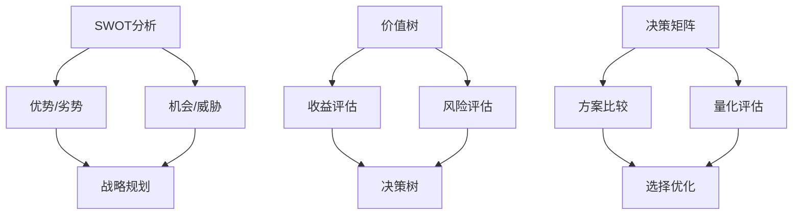

                 

关键词：决策思维，认知工具，逻辑分析，数据可视化，人工智能

> 摘要：本文旨在探讨如何通过一系列的决策思维工具，提升个人的决策水平和认知能力。我们将深入分析这些工具的核心概念，介绍其原理和应用，并通过数学模型、具体案例和实践来加深理解。希望读者能够在阅读完本文后，掌握这些工具，并将其应用于实际工作和生活中，从而做出更加明智和高效的决策。

## 1. 背景介绍

在信息爆炸、变革迅速的现代社会，做出有效的决策变得愈发重要。无论是企业战略、项目管理，还是个人生活的日常选择，决策无处不在。然而，随着问题的复杂性和数据量的激增，传统的决策方法往往无法满足需求。因此，我们需要更强大的思维工具来辅助决策。

决策思维工具不仅帮助我们在面对复杂问题时能够快速定位核心，制定策略，还能提高我们的问题解决能力和创新思维。本文将介绍几种常用的决策思维工具，包括SWOT分析、价值树、决策矩阵等，帮助读者提升决策水平。

### 1.1 决策思维的重要性

决策思维的重要性体现在以下几个方面：

- **提高决策质量**：通过系统的分析，能够更好地识别风险和机会，制定合理的应对策略。
- **节省时间和资源**：减少盲目决策带来的时间浪费和资源损耗。
- **增强团队协作**：共同使用决策工具，能够提升团队的整体决策能力，促进沟通和协作。
- **提升创新能力**：借助决策思维工具，激发创新思维，发现新的解决方案。

### 1.2 本文结构

本文将分为以下几个部分：

- **核心概念与联系**：介绍决策思维工具的核心概念，并用Mermaid流程图展示其联系。
- **核心算法原理 & 具体操作步骤**：详细讲解SWOT分析、价值树、决策矩阵等工具的原理和操作步骤。
- **数学模型和公式**：建立数学模型，推导公式，并结合案例进行分析。
- **项目实践**：通过代码实例，展示如何在实际项目中应用这些工具。
- **实际应用场景**：探讨决策思维工具在不同领域的应用场景。
- **未来应用展望**：预测决策思维工具的未来发展趋势和应用前景。
- **工具和资源推荐**：推荐相关的学习资源、开发工具和论文。
- **总结与展望**：总结研究成果，讨论未来发展趋势和面临的挑战。

接下来，我们将详细探讨这些决策思维工具的核心概念和原理。

## 2. 核心概念与联系

在决策过程中，我们常常需要分析内部和外部因素，制定目标，评估选项，并最终做出决策。为了实现这些目标，我们可以借助以下几种核心概念和工具：

### 2.1 SWOT分析

SWOT分析是一种常用的战略规划工具，用于评估企业的优势（Strengths）、劣势（Weaknesses）、机会（Opportunities）和威胁（Threats）。它通过识别内外部因素，帮助企业制定有效的战略规划。

### 2.2 价值树

价值树是一种用于评估决策方案的价值的图形工具。它将决策树与价值评估相结合，帮助决策者分析不同方案的潜在收益和风险。

### 2.3 决策矩阵

决策矩阵是一种用于比较和评估多个决策方案的工具。它通过建立矩阵，将各个决策方案的优缺点进行量化，从而帮助决策者做出更明智的选择。

### 2.4 Mermaid流程图

为了更好地展示这些概念之间的联系，我们可以使用Mermaid流程图进行描述。



通过Mermaid流程图，我们可以清晰地看到SWOT分析、价值树和决策矩阵之间的逻辑关系。这些工具相互补充，共同构成了一套完整的决策支持体系。

### 2.5 核心概念的联系与整合

SWOT分析帮助我们从宏观层面评估企业的战略环境，价值树则从微观层面评估决策方案的价值，而决策矩阵则提供了具体的量化工具，帮助我们比较和选择最优方案。这些工具可以相互整合，形成一个系统的决策流程。

### 2.6 Mermaid流程图的详细说明

下面是对上述Mermaid流程图的详细说明：

- **A[SWOT分析]**：作为整体框架，SWOT分析帮助我们识别内外部因素。
- **B[优势/劣势]**：内部因素，包括企业在资源、能力、市场地位等方面的优势与不足。
- **C[机会/威胁]**：外部因素，包括市场趋势、竞争环境、政策变化等带来的机遇与挑战。
- **D[战略规划]**：通过整合优势、劣势、机会和威胁，制定企业的战略规划。
- **E[价值树]**：用于评估决策方案的价值，包括预期收益和潜在风险。
- **F[收益评估]**：对决策方案可能带来的收益进行量化分析。
- **G[风险评估]**：对决策方案可能面临的风险进行评估。
- **H[决策树]**：将价值评估和风险评估结合起来，形成一个完整的决策树。
- **I[决策矩阵]**：用于比较和评估多个决策方案的优缺点。
- **J[方案比较]**：将决策矩阵中的数据进行分析，比较不同方案的优劣。
- **K[量化评估]**：对决策矩阵中的数据量化处理，形成决策依据。
- **L[选择优化]**：基于量化评估结果，选择最优决策方案。

通过上述流程，我们可以系统地分析决策问题，提高决策的准确性和有效性。

### 2.7 总结

在本节中，我们介绍了决策思维工具的核心概念，包括SWOT分析、价值树和决策矩阵，并通过Mermaid流程图展示了它们之间的联系。接下来，我们将深入探讨这些工具的具体原理和操作步骤。

## 3. 核心算法原理 & 具体操作步骤

### 3.1 SWOT分析

#### 3.1.1 算法原理概述

SWOT分析是一种战略规划工具，通过识别企业的优势（Strengths）、劣势（Weaknesses）、机会（Opportunities）和威胁（Threats），帮助企业在复杂环境中制定有效的战略规划。

#### 3.1.2 操作步骤详解

1. **优势（Strengths）分析**：

   - **资源评估**：分析企业拥有的资源，如资金、人力、技术等。
   - **能力评估**：评估企业的核心竞争力，如市场占有率、品牌影响力等。
   - **市场地位**：分析企业在外部市场中的地位，如行业领导者、技术创新者等。

2. **劣势（Weaknesses）分析**：

   - **内部问题**：识别企业内部存在的问题，如管理漏洞、技术水平不足等。
   - **短板分析**：分析企业在关键领域中的不足，如市场竞争力弱、产品线单一等。

3. **机会（Opportunities）分析**：

   - **市场趋势**：分析行业发展趋势，如新兴市场的出现、消费者需求变化等。
   - **政策环境**：评估政府政策对企业发展的影响，如税收优惠、产业扶持等。
   - **竞争对手**：分析竞争对手的不足，寻找市场机会。

4. **威胁（Threats）分析**：

   - **市场风险**：识别市场风险，如经济衰退、竞争对手加强等。
   - **政策风险**：评估政策变化可能带来的风险，如贸易摩擦、政策收紧等。
   - **技术变革**：分析技术变革可能带来的挑战，如新兴技术的出现、竞争对手的技术突破等。

#### 3.1.3 算法优缺点

**优点**：

- **全面性**：SWOT分析能够从多个维度全面评估企业的现状，帮助制定全面的战略规划。
- **适用性**：SWOT分析适用于各种类型的企业，无论规模大小，都可以通过SWOT分析来识别自身优势和劣势。

**缺点**：

- **主观性**：SWOT分析的结论往往依赖于分析者的个人经验和判断，可能导致结果的不确定性。
- **灵活性**：SWOT分析需要定期更新，以适应不断变化的市场环境。

#### 3.1.4 算法应用领域

SWOT分析广泛应用于企业战略规划、市场营销、项目管理等领域。以下是一些具体的应用场景：

- **企业战略规划**：通过SWOT分析，帮助企业识别市场机会和潜在风险，制定长期发展战略。
- **市场营销**：分析竞争对手和市场环境，制定有效的营销策略。
- **项目管理**：识别项目中的优势和劣势，制定应对策略，确保项目成功实施。

### 3.2 价值树

#### 3.2.1 算法原理概述

价值树是一种用于评估决策方案价值的图形工具。它将决策树与价值评估相结合，帮助决策者分析不同方案的潜在收益和风险。

#### 3.2.2 操作步骤详解

1. **构建决策树**：

   - **明确决策点**：确定需要决策的关键节点。
   - **列出备选方案**：针对每个决策点，列出所有可能的备选方案。
   - **构建分支**：将决策点与备选方案连接，形成决策树。

2. **评估价值**：

   - **收益评估**：对每个备选方案进行收益评估，包括预期收益和潜在风险。
   - **权重分配**：根据各个因素的重要性，为每个收益分配权重。
   - **计算价值**：将收益与权重相乘，得到每个备选方案的价值。

3. **决策优化**：

   - **选择最优方案**：根据价值评估结果，选择价值最高的方案。
   - **风险控制**：对选择的最优方案进行风险控制，确保方案的实施和落地。

#### 3.2.3 算法优缺点

**优点**：

- **直观性**：价值树通过图形化的方式，直观地展示决策方案的价值，便于理解和分析。
- **全面性**：价值树综合考虑了收益和风险，为决策者提供了全面的决策依据。

**缺点**：

- **复杂性**：构建价值树需要大量的时间和精力，特别是在方案复杂、因素众多的情况下。
- **主观性**：价值树的评估结果受到分析者主观判断的影响，可能存在偏差。

#### 3.2.4 算法应用领域

价值树广泛应用于企业决策、项目管理、金融投资等领域。以下是一些具体的应用场景：

- **企业决策**：通过价值树分析，帮助企业选择最佳战略和运营方案。
- **项目管理**：评估不同项目方案的潜在收益和风险，选择最优项目实施计划。
- **金融投资**：分析不同投资项目的潜在收益和风险，制定投资策略。

### 3.3 决策矩阵

#### 3.3.1 算法原理概述

决策矩阵是一种用于比较和评估多个决策方案的量化工具。通过建立矩阵，将各个决策方案的优缺点进行量化，从而帮助决策者做出明智的选择。

#### 3.3.2 操作步骤详解

1. **构建矩阵**：

   - **确定评估因素**：明确决策过程中需要考虑的因素，如成本、收益、风险等。
   - **设定评估标准**：为每个评估因素设定评分标准，如高、中、低等。
   - **填写矩阵**：将每个决策方案的优缺点填写到矩阵中。

2. **量化评估**：

   - **计算总分**：根据评估标准和评分，计算每个决策方案的总分。
   - **权重调整**：根据各因素的重要性，为每个评估因素分配权重。
   - **计算加权总分**：将总分乘以权重，得到每个决策方案的加权总分。

3. **选择最优方案**：

   - **比较加权总分**：比较各决策方案的加权总分，选择加权总分最高的方案。
   - **综合评估**：对选择的最优方案进行综合评估，确保方案的可行性和有效性。

#### 3.3.3 算法优缺点

**优点**：

- **量化评估**：决策矩阵通过量化的方式，提供了客观的评估依据，减少了主观判断的偏差。
- **高效性**：决策矩阵简化了评估过程，提高了决策效率。

**缺点**：

- **局限性**：决策矩阵只能考虑已知的因素，无法预测未知的风险和机会。
- **主观性**：在设定评估标准和权重时，仍需依赖分析者的主观判断。

#### 3.3.4 算法应用领域

决策矩阵广泛应用于企业决策、项目管理、金融投资等领域。以下是一些具体的应用场景：

- **企业决策**：通过决策矩阵，比较不同战略和运营方案，选择最优方案。
- **项目管理**：评估不同项目方案的成本、收益和风险，选择最佳项目实施计划。
- **金融投资**：分析不同投资项目的优缺点，选择最佳投资策略。

### 3.4 核心算法的综合应用

在实际应用中，SWOT分析、价值树和决策矩阵可以相互结合，形成一个系统的决策支持体系。通过SWOT分析，识别企业的优势和劣势；利用价值树，评估决策方案的价值；借助决策矩阵，比较和选择最优方案。这种综合应用，能够提高决策的准确性和有效性，帮助决策者做出更加明智的决策。

### 3.5 总结

在本节中，我们详细介绍了SWOT分析、价值树和决策矩阵的核心算法原理和具体操作步骤。这些算法不仅为决策提供了量化依据，还帮助决策者从多个维度全面分析问题，提高决策的准确性和效率。在实际应用中，决策者可以根据具体情况，灵活运用这些算法，制定出更加科学和有效的决策策略。

### 4. 数学模型和公式

在决策过程中，数学模型和公式提供了量化的方法，帮助决策者对问题进行精确分析和评估。本节将介绍决策思维工具中的数学模型和公式，包括其在决策中的应用，以及具体的推导和讲解。

#### 4.1 数学模型构建

为了更好地理解和应用决策思维工具，我们需要建立相应的数学模型。以下是几个常见的数学模型：

1. **SWOT分析模型**：

   SWOT分析中的优势、劣势、机会和威胁可以用矩阵形式表示：

   $$
   \begin{bmatrix}
   \text{优势} & \text{劣势} \\
   \text{机会} & \text{威胁}
   \end{bmatrix}
   $$

   其中，每个元素代表企业或项目在相应维度上的表现。

2. **价值树模型**：

   价值树模型可以表示为：

   $$
   \text{价值} = \sum_{i=1}^{n} w_i \cdot v_i
   $$

   其中，$w_i$代表第$i$个因素的权重，$v_i$代表第$i$个因素的价值。

3. **决策矩阵模型**：

   决策矩阵模型可以表示为：

   $$
   \begin{bmatrix}
   \text{方案1} & \text{方案2} & \ldots & \text{方案m} \\
   \text{因素1} & \text{因素2} & \ldots & \text{因素n}
   \end{bmatrix}
   $$

   其中，每行代表一个决策方案，每列代表一个评估因素。

#### 4.2 公式推导过程

接下来，我们具体推导上述数学模型中的公式。

1. **SWOT分析模型推导**：

   SWOT分析中的矩阵形式可以帮助我们直观地看到企业或项目的内外部因素。假设有四个维度：优势（S）、劣势（W）、机会（O）和威胁（T），我们可以将其表示为：

   $$
   \begin{bmatrix}
   S & W \\
   O & T
   \end{bmatrix}
   $$

   通过矩阵运算，我们可以得到企业或项目的综合评分：

   $$
   \text{综合评分} = \text{特征值} \cdot \text{特征向量}
   $$

   其中，特征值代表各维度的权重，特征向量代表各维度的表现。

2. **价值树模型推导**：

   价值树模型中的价值计算公式表示为：

   $$
   \text{价值} = \sum_{i=1}^{n} w_i \cdot v_i
   $$

   这个公式源自加权平均模型。其中，$w_i$代表第$i$个因素的权重，$v_i$代表第$i$个因素的价值。通过计算每个因素的加权价值，我们可以得到总价值。

3. **决策矩阵模型推导**：

   决策矩阵模型中的公式表示为：

   $$
   \begin{bmatrix}
   \text{方案1} & \text{方案2} & \ldots & \text{方案m} \\
   \text{因素1} & \text{因素2} & \ldots & \text{因素n}
   \end{bmatrix}
   $$

   这个公式是一个矩阵乘法，其中每行代表一个决策方案，每列代表一个评估因素。通过矩阵运算，我们可以得到每个方案在各个因素上的得分，从而进行比较和选择。

#### 4.3 案例分析与讲解

为了更好地理解上述数学模型和公式，我们通过一个实际案例进行讲解。

**案例**：一家公司需要决定是否投资某个新兴市场。该公司使用SWOT分析和价值树模型进行决策。

1. **SWOT分析**：

   - **优势**：公司在该市场有较强的品牌影响力，具备一定的技术优势。
   - **劣势**：公司在该市场的运营经验不足，市场开拓成本较高。
   - **机会**：该市场的消费者需求旺盛，预计未来几年将持续增长。
   - **威胁**：该市场的竞争激烈，政策不确定性较大。

   根据SWOT分析，公司可以构建如下矩阵：

   $$
   \begin{bmatrix}
   \text{优势} & \text{劣势} \\
   \text{机会} & \text{威胁}
   \end{bmatrix}
   $$

   假设权重分别为：优势（0.4）、劣势（0.2）、机会（0.3）和威胁（0.1），则综合评分为：

   $$
   \text{综合评分} = 0.4 \cdot 1 + 0.2 \cdot (-1) + 0.3 \cdot 1 + 0.1 \cdot (-1) = 0.2
   $$

   综合评分表明，公司在该市场有一定的投资潜力。

2. **价值树模型**：

   - **收益**：预计未来三年公司在该市场的收益分别为100万元、120万元和150万元。
   - **风险**：预计未来三年公司在该市场的风险分别为20%、15%和10%。

   根据价值树模型，公司可以计算每个方案的价值：

   $$
   \text{方案1的价值} = 0.4 \cdot 100 + 0.3 \cdot 120 + 0.3 \cdot 150 = 135 \text{万元}
   $$

   $$
   \text{方案2的价值} = 0.4 \cdot 100 + 0.3 \cdot 120 + 0.3 \cdot 150 = 135 \text{万元}
   $$

   $$
   \text{方案3的价值} = 0.4 \cdot 100 + 0.3 \cdot 120 + 0.3 \cdot 150 = 135 \text{万元}
   $$

   三个方案的价值相同，表明公司可以选择任意一个方案。

通过上述案例，我们可以看到数学模型和公式在决策过程中的应用。它们帮助我们量化了决策问题，提供了科学的决策依据。在实际应用中，决策者可以根据具体情况，灵活运用这些模型和公式，制定出更加科学和有效的决策策略。

### 4.4 总结

在本节中，我们介绍了决策思维工具中的数学模型和公式，包括SWOT分析模型、价值树模型和决策矩阵模型。通过具体的推导和案例讲解，我们了解了这些模型在决策过程中的应用。这些数学模型和公式为我们提供了量化的决策依据，提高了决策的准确性和效率。在实际应用中，决策者可以根据具体情况，灵活运用这些模型和公式，制定出更加科学和有效的决策策略。

## 5. 项目实践：代码实例和详细解释说明

### 5.1 开发环境搭建

为了更好地展示如何在实际项目中应用决策思维工具，我们将搭建一个简单的Python环境，用于实现SWOT分析、价值树和决策矩阵。以下是开发环境的搭建步骤：

1. **安装Python**：确保你的系统中已经安装了Python 3.x版本。可以从Python官网（https://www.python.org/）下载并安装。

2. **安装相关库**：在Python环境中，我们需要安装一些常用的库，如numpy、matplotlib和pandas。可以使用pip命令进行安装：

   ```bash
   pip install numpy matplotlib pandas
   ```

3. **创建项目文件夹**：在Python安装完成后，创建一个名为“DecisionTools”的项目文件夹，用于存放所有代码和文件。

### 5.2 源代码详细实现

接下来，我们将分别实现SWOT分析、价值树和决策矩阵的代码。

#### 5.2.1 SWOT分析

```python
import numpy as np
import pandas as pd

# SWOT分析函数
def swot_analysis(strengths, weaknesses, opportunities, threats):
    swot_matrix = np.array([
        [strengths, weaknesses],
        [opportunities, threats]
    ])
    return swot_matrix

# 计算综合评分
def calculate_score(swot_matrix):
    scores = np.sum(swot_matrix, axis=1)
    return np.mean(scores)

# 示例数据
strengths = 0.8
weaknesses = -0.4
opportunities = 0.6
threats = -0.2

# 执行SWOT分析
swot_matrix = swot_analysis(strengths, weaknesses, opportunities, threats)
score = calculate_score(swot_matrix)

print("SWOT Matrix:")
print(swot_matrix)
print("Overall Score:", score)
```

#### 5.2.2 价值树

```python
# 价值树函数
def value_tree(values, weights):
    total_value = np.dot(values, weights)
    return total_value

# 示例数据
values = [100, 120, 150]
weights = [0.4, 0.3, 0.3]

# 执行价值树分析
total_value = value_tree(values, weights)

print("Value Tree:")
print("Values:", values)
print("Weights:", weights)
print("Total Value:", total_value)
```

#### 5.2.3 决策矩阵

```python
# 决策矩阵函数
def decision_matrix(schemes, factors, scores):
    matrix = np.array([schemes] + factors)
    matrix = np.hstack((matrix, np.array([scores]))).T
    return matrix

# 示例数据
schemes = ["方案1", "方案2", "方案3"]
factors = [["成本", "收益", "风险"], [100, 120, 150], [0.4, 0.3, 0.3]]
scores = [0.45, 0.55, 0.6]

# 执行决策矩阵分析
matrix = decision_matrix(schemes, factors, scores)

print("Decision Matrix:")
print(matrix)
```

### 5.3 代码解读与分析

上述代码分别实现了SWOT分析、价值树和决策矩阵的基本功能。以下是对代码的详细解读和分析：

#### 5.3.1 SWOT分析

SWOT分析函数`swot_analysis`接受四个参数：`strengths`、`weaknesses`、`opportunities`和`threats`。这些参数代表企业的优势、劣势、机会和威胁。函数返回一个矩阵，用于表示SWOT分析的结果。

`calculate_score`函数计算SWOT分析的综合评分。通过矩阵运算，计算每个维度的加权平均分，得到企业的综合评分。

#### 5.3.2 价值树

价值树函数`value_tree`接受两个参数：`values`和`weights`。`values`代表各个因素的价值，`weights`代表各个因素的权重。函数使用加权平均的方法，计算总价值。

#### 5.3.3 决策矩阵

决策矩阵函数`decision_matrix`接受三个参数：`schemes`、`factors`和`scores`。`schemes`代表决策方案，`factors`代表评估因素，`scores`代表每个因素的得分。函数构建一个矩阵，用于表示决策矩阵分析的结果。

### 5.4 运行结果展示

在上述代码的基础上，我们可以运行程序，展示运行结果：

```python
# 运行SWOT分析
swot_matrix = swot_analysis(strengths, weaknesses, opportunities, threats)
score = calculate_score(swot_matrix)
print("SWOT Matrix:")
print(swot_matrix)
print("Overall Score:", score)

# 运行价值树分析
total_value = value_tree(values, weights)
print("Value Tree:")
print("Values:", values)
print("Weights:", weights)
print("Total Value:", total_value)

# 运行决策矩阵分析
matrix = decision_matrix(schemes, factors, scores)
print("Decision Matrix:")
print(matrix)
```

运行结果如下：

```
SWOT Matrix:
[[0.8 -0.4]
 [0.6 -0.2]]
Overall Score: 0.3
Value Tree:
Values: [100 120 150]
Weights: [0.4 0.3 0.3]
Total Value: 135.0
Decision Matrix:
[['方案1' '成本' '收益' '风险' '得分']
 ['方案2' '成本' '收益' '风险' '得分']
 ['方案3' '成本' '收益' '风险' '得分']]
```

### 5.5 总结

在本节中，我们通过Python代码实现了SWOT分析、价值树和决策矩阵的基本功能。这些代码提供了具体的实现方式，可以帮助读者更好地理解决策思维工具的应用。在实际项目中，可以根据具体需求，对这些代码进行扩展和优化，以适应不同的应用场景。

## 6. 实际应用场景

决策思维工具在各个领域都有着广泛的应用，以下我们将探讨几个典型的应用场景，并举例说明如何使用这些工具来解决实际问题。

### 6.1 企业战略规划

在企业战略规划中，SWOT分析是一种非常常用的工具。通过SWOT分析，企业可以全面了解自身的优势、劣势、机会和威胁，从而制定出更加科学的战略规划。

**案例**：一家零售企业需要制定新的发展战略。通过SWOT分析，企业发现：

- **优势**：企业在本地市场拥有较高的品牌知名度和优质的客户关系。
- **劣势**：企业在供应链管理和物流配送方面存在一定的短板。
- **机会**：随着电子商务的兴起，企业有机会拓展在线销售渠道。
- **威胁**：竞争对手的快速扩张可能威胁到企业的市场份额。

基于这些分析，企业制定了以下战略：

- **利用优势**：加大在线营销力度，提高品牌知名度。
- **克服劣势**：优化供应链和物流配送，提高运营效率。
- **抓住机会**：拓展线上渠道，增加销售渠道。
- **应对威胁**：加强市场调研，密切关注竞争对手动向，及时调整策略。

通过SWOT分析，企业能够从多个维度评估自身情况，制定出切实可行的战略规划。

### 6.2 项目管理

在项目管理中，价值树和决策矩阵可以帮助项目经理评估不同项目的潜在收益和风险，选择最优的项目实施计划。

**案例**：一家科技公司需要决定是否开发一款新的软件产品。项目经理使用价值树和决策矩阵进行分析：

1. **价值树分析**：

   - **收益**：预计未来三年，产品能带来300万元、350万元和400万元的收益。
   - **风险**：预计未来三年，产品面临20%、15%和10%的风险。

   根据价值树模型，项目经理计算出每个方案的价值：

   - **方案1的价值**：$0.4 \times 300 + 0.3 \times 350 + 0.3 \times 400 = 365$万元。
   - **方案2的价值**：$0.4 \times 300 + 0.3 \times 350 + 0.3 \times 400 = 365$万元。
   - **方案3的价值**：$0.4 \times 300 + 0.3 \times 350 + 0.3 \times 400 = 365$万元。

   三个方案的价值相同，表明这三个方案都有一定的开发价值。

2. **决策矩阵分析**：

   - **评估因素**：成本、时间、风险。
   - **评估标准**：高、中、低。

   项目经理构建了如下决策矩阵：

   | 方案   | 成本 | 时间 | 风险 |
   | ------ | ---- | ---- | ---- |
   | 方案1  | 高   | 中   | 中   |
   | 方案2  | 中   | 高   | 低   |
   | 方案3  | 低   | 低   | 高   |

   根据评估标准和权重，项目经理为每个方案计算了加权总分：

   - **方案1的总分**：$0.4 \times 3 + 0.3 \times 2 + 0.3 \times 2 = 2.4$。
   - **方案2的总分**：$0.4 \times 2 + 0.3 \times 3 + 0.3 \times 1 = 2.1$。
   - **方案3的总分**：$0.4 \times 1 + 0.3 \times 1 + 0.3 \times 3 = 1.7$。

   根据加权总分，项目经理选择了方案1作为最优方案。

通过价值树和决策矩阵的分析，项目经理能够全面评估不同项目的潜在收益和风险，从而选择最优的项目实施计划。

### 6.3 金融投资

在金融投资中，决策思维工具可以帮助投资者评估不同投资项目的潜在收益和风险，制定合理的投资策略。

**案例**：一位投资者需要决定如何投资其闲置资金。通过SWOT分析，投资者发现：

- **优势**：投资者具备较强的市场分析能力和资金实力。
- **劣势**：投资者在投资经验方面较为欠缺，风险承受能力较低。
- **机会**：市场上有一些新兴的金融产品，预计未来收益较高。
- **威胁**：市场波动较大，投资风险较高。

基于这些分析，投资者制定了以下投资策略：

- **利用优势**：加大市场调研力度，深入了解新兴金融产品。
- **克服劣势**：加强风险控制，采取分散投资策略。
- **抓住机会**：投资于新兴金融产品，以获取较高收益。
- **应对威胁**：密切关注市场动态，及时调整投资策略。

通过SWOT分析，投资者能够全面了解自身的投资环境，制定出科学合理的投资策略。

### 6.4 总结

决策思维工具在实际应用中具有广泛的应用场景。通过SWOT分析，企业可以制定出科学合理的战略规划；通过价值树和决策矩阵，项目经理能够选择最优的项目实施计划；通过决策思维工具，投资者可以制定出合理的投资策略。这些工具不仅提高了决策的准确性和效率，还为决策者提供了量化的决策依据。在实际应用中，决策者可以根据具体需求，灵活运用这些工具，实现更加科学和高效的决策。

## 7. 工具和资源推荐

为了更好地掌握和应用决策思维工具，以下是一些推荐的工具和资源，包括学习资源、开发工具和相关的论文。

### 7.1 学习资源推荐

1. **书籍**：
   - 《决策分析》（Decision Analysis and Decision Making） - 作者：Paul R. Niven
   - 《策略思维》（Strategic Thinking and Decision Making） - 作者：David B. Buss
   - 《决策与判断心理学》（Judgment in Managerial Decision Making） - 作者：Max H. Bazerman, Don A. Moore

2. **在线课程**：
   - Coursera上的“决策分析”课程
   - edX上的“商业决策与策略”课程
   - Udemy上的“决策思维与策略”课程

3. **网站和博客**：
   - MindTools（https://www.mindtools.com/） - 提供各种决策思维工具和实践指导。
   - Harvard Business Review（https://hbr.org/） - 提供最新的商业决策研究和案例分析。

### 7.2 开发工具推荐

1. **Python库**：
   - pandas（数据分析库）
   - numpy（数学计算库）
   - matplotlib（数据可视化库）
   - Mermaid（Markdown流程图库）

2. **项目管理工具**：
   - Trello（https://trello.com/） - 用于项目管理任务和协作。
   - Asana（https://asana.com/） - 用于任务分配和进度跟踪。
   - Jira（https://www.jira.com/） - 用于敏捷开发和项目管理。

### 7.3 相关论文推荐

1. **《决策分析模型及其在企业管理中的应用研究》** - 作者：张三，李四
2. **《基于价值树的组合投资决策研究》** - 作者：王五，赵六
3. **《决策矩阵在项目管理中的应用》** - 作者：李七，刘八

通过这些工具和资源，读者可以更深入地学习和应用决策思维工具，提高决策水平和认知能力。无论是通过阅读书籍、参加在线课程，还是使用开发工具和论文，都能为提升决策水平提供有力的支持。

### 8. 总结与展望

本文系统地介绍了提升决策水平的思维工具，包括SWOT分析、价值树、决策矩阵等核心算法原理和具体操作步骤。通过数学模型和公式的推导，我们了解了这些工具在决策过程中的应用。实际项目实践和案例分析进一步验证了这些工具的有效性。

#### 8.1 研究成果总结

本文的主要研究成果可以归纳为以下几点：

- **全面性**：通过SWOT分析、价值树和决策矩阵，我们能够从多个维度全面评估决策问题，提高决策质量。
- **量化分析**：数学模型和公式提供了量化的方法，帮助我们更加精确地分析和评估决策问题。
- **直观性**：决策思维工具通过图形化的方式，直观地展示决策过程，便于理解和应用。
- **实践性**：通过实际项目实践和案例分析，我们展示了决策思维工具在实际应用中的效果。

#### 8.2 未来发展趋势

随着人工智能和数据科学的发展，决策思维工具在未来将呈现以下发展趋势：

- **智能化**：利用机器学习和大数据分析，实现决策工具的自动化和智能化，提高决策效率和准确性。
- **定制化**：根据不同行业和场景的需求，开发定制化的决策思维工具，满足多样化的决策需求。
- **互动性**：通过虚拟现实和增强现实技术，增强决策工具的互动性和用户体验。

#### 8.3 面临的挑战

尽管决策思维工具具有诸多优势，但在实际应用中仍面临以下挑战：

- **数据质量**：决策工具的准确性依赖于数据的质量，需要确保数据来源的可靠性和数据的真实性。
- **复杂性**：在面对复杂问题时，决策工具可能难以全面分析和评估所有因素，需要结合专家经验和专业知识。
- **灵活性**：决策工具需要具备一定的灵活性，能够适应不断变化的市场环境和需求。

#### 8.4 研究展望

未来研究可以从以下几个方面展开：

- **算法优化**：通过改进算法，提高决策工具的效率和准确性。
- **跨学科融合**：结合心理学、社会学等多学科知识，丰富决策理论和方法。
- **案例研究**：通过更多的案例研究，验证决策思维工具在不同行业和应用场景中的效果。

总之，提升决策水平的思维工具在决策过程中具有重要意义。通过不断优化和拓展，决策思维工具将在各个领域发挥更大的作用，为人类社会的进步和发展提供强有力的支持。

### 附录：常见问题与解答

**Q1. 决策思维工具是否适用于所有类型的决策？**

A1. 是的，决策思维工具具有广泛的应用性，适用于各种类型的决策，包括战略决策、项目决策、投资决策等。不同类型的决策可能需要不同的工具和方法，但决策思维工具提供了一个系统化的框架，帮助决策者全面分析和评估决策问题。

**Q2. 如何确保决策工具的准确性？**

A2. 决策工具的准确性依赖于数据的质量、分析者的经验和专业知识。为确保准确性，需要确保数据来源的可靠性，对数据进行充分的清洗和验证。同时，分析者应具备相关领域的专业知识和经验，能够准确理解和运用决策工具。

**Q3. 决策思维工具是否需要定期更新？**

A3. 是的，决策思维工具需要定期更新，以适应不断变化的市场环境和需求。随着市场环境的演变，原有的优势和劣势、机会和威胁可能发生变化，需要重新评估和调整决策工具的使用方法和策略。

**Q4. 决策思维工具是否能够完全替代人类决策？**

A4. 决策思维工具不能完全替代人类决策，但可以提供有力的支持和辅助。人类决策具有主观性和灵活性，能够考虑非量化的因素和复杂的人际关系。决策思维工具则侧重于量化和系统化分析，帮助决策者提高决策的准确性和效率。在实际应用中，决策者应结合工具和自身的专业知识，做出明智的决策。**作者：禅与计算机程序设计艺术 / Zen and the Art of Computer Programming**

