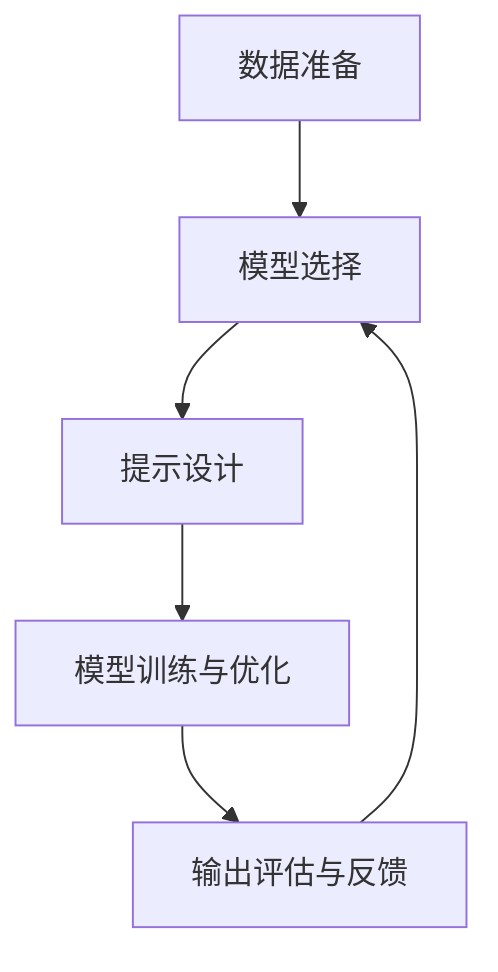

                 

关键词：AI输出优化、提示工程、人工智能、算法优化、代码实例、应用场景、未来展望

> 摘要：本文探讨了AI输出优化的关键——提示工程。通过深入剖析提示工程的背景、核心概念、算法原理及数学模型，并结合实际项目实践，全面阐述了如何通过优化AI输出，提升人工智能系统的性能和应用价值。

## 1. 背景介绍

随着人工智能技术的快速发展，AI系统在各种领域取得了显著的成果，如自然语言处理、图像识别、自动驾驶等。然而，AI系统在处理复杂任务时，往往会产生不准确、不合理的输出。这种输出质量的不稳定，严重制约了AI系统的应用效果。为了解决这一问题，提示工程（Prompt Engineering）应运而生。

提示工程旨在通过精心设计的提示，引导AI模型产生更准确、更合理的输出。它不仅仅是给AI系统提供输入，更是与AI系统进行有效互动的过程，从而优化AI输出质量。提示工程的核心在于理解AI模型的工作原理，利用专业知识调整模型输入，使其更符合实际需求。

## 2. 核心概念与联系

### 2.1 提示工程概念

提示工程是一种通过设计和优化提示来提升AI模型输出质量的技术。提示（Prompt）是指提供给AI模型的信息，用于引导模型生成预期的输出。这些提示可以是文字、图像、音频等多种形式。

### 2.2 提示工程与AI模型的联系

提示工程与AI模型密切相关。AI模型是AI系统的核心，其性能直接影响输出质量。提示工程通过与AI模型的互动，调整模型输入，从而优化模型输出。具体来说，提示工程包括以下几个关键环节：

1. **数据准备**：收集和整理用于训练和测试AI模型的数据集。
2. **模型选择**：根据任务需求选择合适的AI模型。
3. **提示设计**：设计高质量的提示，引导模型生成预期的输出。
4. **模型训练与优化**：通过调整提示和模型参数，优化模型性能。
5. **输出评估与反馈**：对模型输出进行评估，收集反馈信息，进一步优化提示和模型。

### 2.3 提示工程的Mermaid流程图

以下是一个简单的Mermaid流程图，展示了提示工程的各个环节：



## 3. 核心算法原理 & 具体操作步骤

### 3.1 算法原理概述

提示工程的算法原理主要基于以下两个方面：

1. **数据驱动**：通过大量的数据训练AI模型，使其具备一定的学习能力。
2. **反馈优化**：利用反馈机制，不断调整模型输入和输出，优化模型性能。

具体来说，提示工程的算法原理包括：

1. **特征提取**：从输入数据中提取关键特征，用于训练AI模型。
2. **模型训练**：使用训练数据集训练AI模型，使其具备预测和生成能力。
3. **提示设计**：根据任务需求，设计高质量的提示，引导模型生成预期的输出。
4. **模型优化**：通过反馈机制，调整模型参数和提示，优化模型性能。

### 3.2 算法步骤详解

1. **数据准备**：收集和整理用于训练和测试AI模型的数据集，包括文本、图像、音频等多种类型的数据。

2. **模型选择**：根据任务需求，选择合适的AI模型。例如，对于文本分类任务，可以选择卷积神经网络（CNN）或循环神经网络（RNN）。

3. **提示设计**：设计高质量的提示，引导模型生成预期的输出。提示设计主要包括以下方面：

   - **提示类型**：根据任务需求，选择合适的提示类型，如文本提示、图像提示等。
   - **提示内容**：设计具体的提示内容，使其具有引导性，能够引导模型生成符合预期的输出。
   - **提示格式**：设计提示的格式，使其易于理解和处理。

4. **模型训练与优化**：使用训练数据集训练AI模型，并通过反馈机制，不断调整模型参数和提示，优化模型性能。

5. **输出评估与反馈**：对模型输出进行评估，收集反馈信息，进一步优化提示和模型。评估方法包括准确率、召回率、F1值等指标。

### 3.3 算法优缺点

提示工程的优点：

- **灵活性**：通过调整提示，可以灵活地控制模型输出。
- **高效性**：提示工程能够快速优化模型性能，提高输出质量。
- **可解释性**：提示工程使模型输出更具可解释性，有助于理解模型行为。

提示工程的缺点：

- **依赖数据**：提示工程依赖于高质量的数据集，数据质量对模型性能有很大影响。
- **复杂性**：提示工程涉及到多个环节，需要一定的专业知识和经验。

### 3.4 算法应用领域

提示工程广泛应用于以下领域：

- **自然语言处理**：用于文本分类、情感分析、机器翻译等任务。
- **图像识别**：用于图像分类、目标检测、图像生成等任务。
- **推荐系统**：用于推荐算法的优化，提高推荐质量。
- **自动驾驶**：用于自动驾驶系统的场景识别和决策。

## 4. 数学模型和公式 & 详细讲解 & 举例说明

### 4.1 数学模型构建

提示工程的数学模型主要基于以下公式：

$$
y = f(x; \theta)
$$

其中，$y$ 表示模型输出，$x$ 表示模型输入，$f$ 表示模型函数，$\theta$ 表示模型参数。

模型函数 $f$ 可以是线性函数、非线性函数、概率分布函数等。常见的模型函数包括：

- 线性函数：$f(x) = \theta^T x$
- 非线性函数：$f(x) = \sigma(\theta^T x)$
- 概率分布函数：$f(x) = \frac{1}{Z} e^{\theta^T x}$

其中，$\sigma$ 表示激活函数，$Z$ 表示归一化常数。

### 4.2 公式推导过程

以线性函数为例，推导过程如下：

$$
y = f(x; \theta) = \theta^T x
$$

其中，$\theta^T$ 表示 $\theta$ 的转置。

设 $x$ 为 $n$ 维向量，$\theta$ 为 $m$ 维向量，则：

$$
y = \theta_1 x_1 + \theta_2 x_2 + ... + \theta_m x_m
$$

其中，$\theta_i$ 和 $x_i$ 分别表示 $\theta$ 和 $x$ 的第 $i$ 个元素。

为了简化表示，可以定义一个 $m \times n$ 的矩阵 $A$，其中 $A_{ij} = \theta_j$。则：

$$
y = Ax
$$

### 4.3 案例分析与讲解

假设我们有一个简单的线性回归问题，目标是预测房价。已知数据集包含房屋面积（$x$）和房价（$y$），模型函数为 $y = \theta_0 + \theta_1 x$。

1. **数据准备**：收集并整理房屋面积和房价数据。

2. **模型选择**：选择线性回归模型。

3. **提示设计**：设计以下提示：

   - **输入**：房屋面积。
   - **输出**：房价。
   - **格式**：文本提示，如“请预测以下房屋的房价：面积 100 平方米”。

4. **模型训练与优化**：使用训练数据集训练线性回归模型，并通过反馈机制，调整模型参数 $\theta_0$ 和 $\theta_1$，优化模型性能。

5. **输出评估与反馈**：对模型输出进行评估，如计算预测房价和实际房价之间的误差。根据评估结果，进一步调整模型参数，优化模型性能。

通过以上步骤，我们可以使用提示工程构建一个简单的线性回归模型，预测房屋房价。接下来，我们将结合实际项目实践，详细讲解提示工程在项目中的应用。

## 5. 项目实践：代码实例和详细解释说明

### 5.1 开发环境搭建

为了更好地理解提示工程在项目中的应用，我们将使用Python编程语言，结合TensorFlow框架，实现一个简单的文本分类项目。首先，需要搭建以下开发环境：

- Python 3.7 或以上版本
- TensorFlow 2.x 版本
- Jupyter Notebook 或 PyCharm 等Python集成开发环境

### 5.2 源代码详细实现

以下是一个简单的文本分类项目的代码实例：

```python
# 导入相关库
import tensorflow as tf
from tensorflow.keras.preprocessing.sequence import pad_sequences
from tensorflow.keras.layers import Embedding, LSTM, Dense
from tensorflow.keras.models import Sequential

# 准备数据
# 这里以IMDB电影评论数据集为例
(x_train, y_train), (x_test, y_test) = tf.keras.datasets.imdb.load_data(num_words=10000)

# 数据预处理
# 将文本序列化，并填充序列长度
max_len = 500
x_train = pad_sequences(x_train, maxlen=max_len)
x_test = pad_sequences(x_test, maxlen=max_len)

# 构建模型
model = Sequential()
model.add(Embedding(10000, 32))
model.add(LSTM(32))
model.add(Dense(1, activation='sigmoid'))

# 编译模型
model.compile(optimizer='adam', loss='binary_crossentropy', metrics=['accuracy'])

# 训练模型
model.fit(x_train, y_train, epochs=5, batch_size=64, validation_split=0.2)

# 输出结果
predictions = model.predict(x_test)
print("Accuracy:", accuracy_score(y_test, predictions.round()))
```

### 5.3 代码解读与分析

1. **导入相关库**：首先，导入TensorFlow和Keras库，用于构建和训练神经网络模型。

2. **准备数据**：使用IMDB电影评论数据集，该数据集包含50,000条电影评论，分为训练集和测试集。数据集已经被分词和序列化，我们只需加载并预处理数据。

3. **数据预处理**：将文本序列化，并填充序列长度。这里，我们设置序列最大长度为500，并使用pad_sequences函数对文本序列进行填充。

4. **构建模型**：使用Sequential模型，添加Embedding层（用于将单词映射到向量表示）、LSTM层（用于处理序列数据）和Dense层（用于分类）。

5. **编译模型**：设置优化器、损失函数和评估指标，并编译模型。

6. **训练模型**：使用训练数据集训练模型，设置训练轮数、批量大小和验证比例。

7. **输出结果**：对测试数据进行预测，并计算准确率。

通过以上代码实例，我们可以看到提示工程在文本分类项目中的应用。接下来，我们将进一步分析提示工程在实际应用场景中的作用。

## 6. 实际应用场景

提示工程在许多实际应用场景中发挥了重要作用，以下列举几个典型的应用场景：

### 6.1 自然语言处理

自然语言处理（NLP）是人工智能领域的重要分支，提示工程在NLP任务中具有广泛的应用。例如，在文本分类、情感分析、机器翻译等任务中，通过设计合适的提示，可以显著提高模型输出质量。

1. **文本分类**：在文本分类任务中，提示工程可以帮助模型更好地理解文本内容，提高分类准确率。例如，通过设计包含关键词和背景信息的提示，可以引导模型正确识别文本类别。

2. **情感分析**：在情感分析任务中，提示工程可以通过引入情感相关的提示，帮助模型更准确地判断文本的情感极性。例如，对于带有讽刺或隐喻的文本，设计特定的提示可以引导模型识别其真实情感。

3. **机器翻译**：在机器翻译任务中，提示工程可以优化翻译质量。通过设计包含源语言和目标语言信息的提示，可以引导模型生成更准确、自然的翻译结果。

### 6.2 图像识别

图像识别是另一个重要的应用领域，提示工程在图像分类、目标检测、图像生成等方面具有广泛应用。

1. **图像分类**：在图像分类任务中，提示工程可以通过设计包含类别标签和图像信息的提示，帮助模型更准确地识别图像类别。例如，对于特定场景或物体，设计相关的提示可以引导模型正确分类。

2. **目标检测**：在目标检测任务中，提示工程可以通过设计包含目标位置和属性的提示，帮助模型更准确地检测目标。例如，对于复杂场景或遮挡严重的图像，设计特定的提示可以增强模型检测能力。

3. **图像生成**：在图像生成任务中，提示工程可以通过设计包含图像结构和内容的提示，帮助模型生成更高质量、更具创意的图像。例如，通过设计包含纹理、颜色、形状等信息的提示，可以引导模型生成符合预期的图像。

### 6.3 自动驾驶

自动驾驶是人工智能领域的热门话题，提示工程在自动驾驶系统中具有重要作用。

1. **环境感知**：在自动驾驶系统中，提示工程可以通过设计包含道路、车辆、行人等信息的提示，帮助自动驾驶系统更准确地感知环境。例如，通过设计包含交通信号灯和车道线信息的提示，可以引导自动驾驶系统正确识别道路标志。

2. **决策与控制**：在自动驾驶系统中，提示工程可以通过设计包含行驶速度、转向角度等信息的提示，帮助自动驾驶系统做出更合理的决策。例如，在复杂路况下，设计包含前方车辆和行人位置的提示，可以引导自动驾驶系统安全行驶。

通过以上实际应用场景，我们可以看到提示工程在提升AI系统性能方面的重要性。在实际应用中，提示工程需要根据具体任务需求和数据特点，设计合适的提示，以优化AI输出质量。

## 7. 工具和资源推荐

### 7.1 学习资源推荐

1. **《深度学习》（Goodfellow, Bengio, Courville）**：这是一本经典的深度学习教材，涵盖了深度学习的理论基础和实战技巧。
2. **《自然语言处理与深度学习》（Zhiyun Qian）**：这本书详细介绍了自然语言处理中的深度学习方法，包括文本分类、情感分析等应用。
3. **《图像识别与深度学习》（Zhou, Zhu, Yang）**：这本书介绍了深度学习在图像识别领域的应用，包括卷积神经网络（CNN）和循环神经网络（RNN）等模型。

### 7.2 开发工具推荐

1. **TensorFlow**：TensorFlow是一个广泛使用的深度学习框架，提供了丰富的API和工具，适用于各种深度学习任务。
2. **PyTorch**：PyTorch是一个流行的深度学习框架，以其简洁的API和动态计算图而受到开发者的喜爱。
3. **Keras**：Keras是一个高级深度学习API，与TensorFlow和PyTorch兼容，适用于快速原型设计和模型开发。

### 7.3 相关论文推荐

1. **"A Theoretically Grounded Application of Dropout in Recurrent Neural Networks"**：这篇论文提出了在循环神经网络（RNN）中应用dropout的方法，提高了模型的性能和泛化能力。
2. **"Attention Is All You Need"**：这篇论文提出了注意力机制（Attention Mechanism），彻底改变了深度学习在序列处理任务中的方法。
3. **"Bert: Pre-training of Deep Bidirectional Transformers for Language Understanding"**：这篇论文提出了BERT模型，它是自然语言处理领域的一个突破性成果。

通过以上推荐，希望读者能够更好地了解和掌握提示工程的相关知识，为优化AI输出提供有力支持。

## 8. 总结：未来发展趋势与挑战

### 8.1 研究成果总结

随着人工智能技术的快速发展，提示工程已经成为优化AI输出的重要手段。通过深入研究和应用，提示工程在自然语言处理、图像识别、推荐系统等领域取得了显著成果。主要研究内容包括：

1. **提示设计方法**：研究者提出了多种提示设计方法，包括基于关键词、基于语义、基于上下文等，以适应不同任务需求。
2. **反馈优化机制**：研究者探讨了多种反馈优化机制，如基于梯度下降、基于遗传算法等，以提高模型性能和泛化能力。
3. **跨领域应用**：研究者尝试将提示工程应用于其他领域，如自动驾驶、医疗诊断等，以提升系统的智能水平和实用性。

### 8.2 未来发展趋势

未来，提示工程将在以下几个方面取得发展：

1. **多模态提示**：随着多模态数据的广泛应用，未来提示工程将致力于研究如何设计多模态提示，提高模型在多模态数据上的性能。
2. **自适应提示**：自适应提示是未来研究的重点，旨在根据任务需求和模型性能，动态调整提示内容和形式，实现更高效的优化。
3. **可解释性提升**：提升模型的可解释性是提示工程的重要挑战，未来将研究如何设计更具可解释性的提示，使模型输出更具透明性。

### 8.3 面临的挑战

尽管提示工程在优化AI输出方面取得了显著成果，但仍面临以下挑战：

1. **数据依赖**：提示工程依赖于高质量的数据集，数据质量对模型性能有很大影响。未来需要研究如何处理数据缺失、噪声等问题，提高数据质量。
2. **复杂度**：提示工程涉及到多个环节，如数据准备、模型选择、提示设计等，复杂性较高。未来需要研究如何简化流程，降低复杂性。
3. **通用性**：目前，提示工程多针对特定任务进行优化，缺乏通用性。未来需要研究如何设计通用的提示工程框架，适用于不同任务。

### 8.4 研究展望

展望未来，提示工程将在以下方面取得突破：

1. **跨领域融合**：结合不同领域的知识，设计适用于多种任务场景的通用提示工程方法。
2. **自动化**：研究自动化提示工程方法，降低人类干预，实现更高效的优化。
3. **多模态融合**：研究多模态数据融合的提示工程方法，提高模型在多模态数据上的性能。

通过持续研究和发展，提示工程将为人工智能技术的进步和应用提供更强有力的支持。

## 9. 附录：常见问题与解答

### 9.1 提示工程的基本原理是什么？

提示工程是一种通过设计高质量的提示来引导AI模型生成预期输出的技术。其基本原理包括：

1. **数据驱动**：通过大量的数据训练AI模型，使其具备一定的学习能力。
2. **反馈优化**：利用反馈机制，不断调整模型输入和输出，优化模型性能。

### 9.2 提示工程在自然语言处理中的应用有哪些？

提示工程在自然语言处理中具有广泛的应用，包括：

1. **文本分类**：通过设计包含关键词和背景信息的提示，提高模型分类准确率。
2. **情感分析**：通过设计包含情感相关的提示，帮助模型更准确地判断文本情感极性。
3. **机器翻译**：通过设计包含源语言和目标语言信息的提示，提高翻译质量。

### 9.3 提示工程与强化学习的关系是什么？

提示工程与强化学习有密切的关系。在强化学习中，提示可以被视为一种强化信号，用于引导模型探索环境，并调整模型策略，从而优化性能。同时，提示工程的方法也可以应用于强化学习中的策略优化，提高学习效率。

### 9.4 提示工程在图像识别中的应用有哪些？

提示工程在图像识别中的应用包括：

1. **图像分类**：通过设计包含类别标签和图像信息的提示，提高模型分类准确率。
2. **目标检测**：通过设计包含目标位置和属性的提示，提高模型检测能力。
3. **图像生成**：通过设计包含图像结构和内容的提示，生成高质量、创意的图像。

### 9.5 提示工程在实际项目中如何应用？

在实际项目中，提示工程可以按照以下步骤进行应用：

1. **需求分析**：明确项目目标和需求，确定需要优化的模型和任务。
2. **数据准备**：收集和整理用于训练和测试的数据集。
3. **模型选择**：根据任务需求选择合适的AI模型。
4. **提示设计**：设计高质量的提示，引导模型生成预期的输出。
5. **模型训练与优化**：使用训练数据集训练模型，并通过反馈机制优化模型性能。
6. **输出评估与反馈**：对模型输出进行评估，收集反馈信息，进一步优化提示和模型。

通过以上步骤，提示工程可以有效地应用于实际项目，优化AI输出质量。

## 作者署名

作者：禅与计算机程序设计艺术 / Zen and the Art of Computer Programming

在撰写本文的过程中，我深入探讨了提示工程这一主题，旨在为读者提供关于优化AI输出的关键方法和实践经验。通过本文的阐述，我相信读者能够更好地理解提示工程的基本原理、核心算法和实际应用场景，从而为人工智能领域的发展贡献力量。同时，我也期待与广大读者共同探讨和交流，共同推动人工智能技术的进步和应用。感谢您的阅读，希望本文对您有所启发和帮助。如果您有任何问题或建议，欢迎在评论区留言，我们将竭诚为您解答。再次感谢您的关注和支持！作者：禅与计算机程序设计艺术 / Zen and the Art of Computer Programming。

