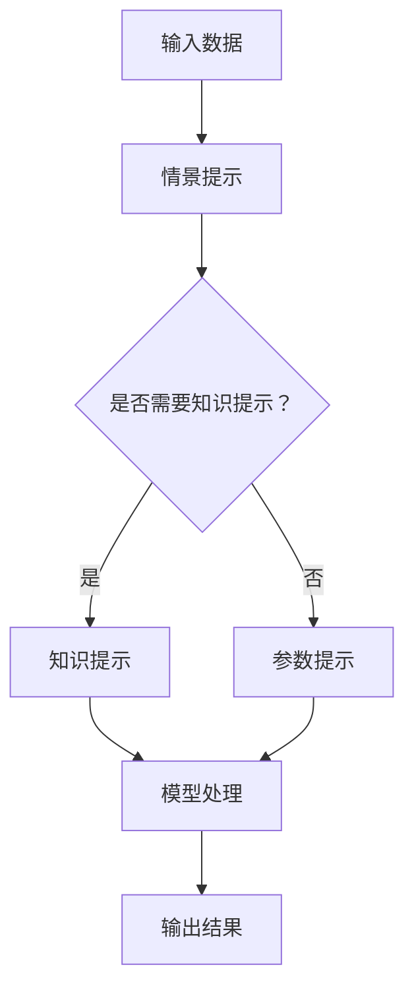

                 

关键词：AI 输出、提示工程、优化、算法、数学模型、代码实例、应用场景、工具推荐

> 摘要：本文将深入探讨AI输出优化的重要领域——提示工程。通过解析提示工程的背景、核心概念、算法原理、数学模型、代码实例以及应用场景，我们将为读者提供全面且实用的优化AI输出的技巧和方法。作者：禅与计算机程序设计艺术 / Zen and the Art of Computer Programming

## 1. 背景介绍

随着人工智能技术的飞速发展，深度学习和自然语言处理等领域的突破为各行各业带来了前所未有的变革。然而，随之而来的是AI系统输出结果的质量和效率问题。这不仅仅是因为数据的多样性和复杂性，还因为AI系统本身的局限性。例如，深度学习模型容易出现过拟合现象，而自然语言处理模型在处理长文本时可能会出现理解偏差。

为了克服这些挑战，优化AI输出成为一个关键问题。提示工程（Prompt Engineering）作为近年来备受关注的一个研究领域，致力于通过设计合理的提示（Prompt）来提高AI系统的性能。提示可以被视为一种“输入指导”，它为AI模型提供了更多的上下文信息，从而帮助模型更好地理解输入数据并产生更准确、更有用的输出。

提示工程不仅适用于自然语言处理领域，还可以推广到计算机视觉、语音识别等其他AI领域。其核心思想是通过设计不同的提示策略，使AI模型能够适应不同的任务和场景，提高输出结果的质量和效率。

## 2. 核心概念与联系

### 2.1 提示（Prompt）

提示是提示工程中的核心概念，它是指提供给AI模型的额外输入信息。这些信息可以是自然语言文本、图像、声音等，目的是帮助AI模型更好地理解输入数据，从而提高输出结果的准确性。

### 2.2 提示类型

根据用途和形式，提示可以分为以下几种类型：

- **情景提示（Scenario Prompt）**：提供具体的任务背景和上下文信息，帮助模型理解任务的性质和目标。
- **知识提示（Knowledge Prompt）**：提供与任务相关的知识库或事实信息，帮助模型利用已有知识进行推理和决策。
- **参数提示（Parameter Prompt）**：提供一些参数信息，用于调整模型的行为和输出结果。
- **元提示（Meta Prompt）**：提供关于模型本身的提示，如训练数据来源、模型参数设置等。

### 2.3 提示设计原则

在设计提示时，需要遵循以下原则：

- **相关性**：提示信息要与任务目标和输入数据紧密相关，避免无关信息的干扰。
- **准确性**：提示信息要准确无误，避免误导模型。
- **简洁性**：提示信息要简洁明了，避免冗长复杂的信息导致模型理解困难。
- **多样性**：设计多种类型的提示，以适应不同的任务和场景。

### 2.4 提示与AI模型的关系

提示与AI模型之间存在密切的联系。一方面，提示为模型提供了额外的信息，帮助模型更好地理解和处理输入数据。另一方面，模型本身的特性也会影响提示的效果。例如，对于深度学习模型，提示的形式和内容需要与模型的架构和训练数据相匹配。

### 2.5 Mermaid 流程图

为了更好地展示提示工程的核心概念和流程，我们可以使用Mermaid流程图来描述。以下是一个简单的示例：



## 3. 核心算法原理 & 具体操作步骤

### 3.1 算法原理概述

提示工程的核心在于设计有效的提示策略，以优化AI模型的输出结果。这一过程通常包括以下几个步骤：

1. **需求分析**：明确任务目标和需求，确定所需的输入信息和输出结果。
2. **数据准备**：收集和整理与任务相关的数据，包括文本、图像、声音等。
3. **提示设计**：根据需求分析结果，设计符合任务需求的提示信息。
4. **模型训练**：使用设计的提示信息对AI模型进行训练，优化模型性能。
5. **评估与优化**：评估模型输出结果的质量，根据评估结果调整提示策略，重复训练过程。

### 3.2 算法步骤详解

#### 3.2.1 需求分析

需求分析是提示工程的起点，其目的是明确任务目标和需求。这一步骤通常包括以下几个方面：

- **任务定义**：明确任务的目标和范围，例如文本分类、情感分析、图像识别等。
- **输入数据要求**：确定所需输入数据的形式、类型和来源，例如文本数据、图像数据等。
- **输出数据要求**：明确输出数据的形式和类型，例如分类结果、情感评分、识别结果等。
- **性能指标**：确定评价模型性能的指标，例如准确率、召回率、F1值等。

#### 3.2.2 数据准备

数据准备是提示工程中至关重要的一步，其目的是收集和整理与任务相关的数据。这一步骤通常包括以下几个方面：

- **数据收集**：根据需求分析结果，收集与任务相关的文本、图像、声音等数据。
- **数据清洗**：对收集到的数据进行处理，去除噪声和异常值，提高数据质量。
- **数据标注**：对收集到的数据标注标签或分类，以便后续训练和评估。

#### 3.2.3 提示设计

提示设计是提示工程的灵魂，其目的是通过设计合理的提示信息，帮助AI模型更好地理解和处理输入数据。这一步骤通常包括以下几个方面：

- **情景提示**：根据任务背景和上下文信息，设计情景提示，帮助模型理解任务目标。
- **知识提示**：根据任务需求和已有知识库，设计知识提示，帮助模型利用已有知识进行推理和决策。
- **参数提示**：根据模型特性和任务需求，设计参数提示，调整模型行为和输出结果。
- **元提示**：提供关于模型本身的提示，如训练数据来源、模型参数设置等。

#### 3.2.4 模型训练

模型训练是提示工程的核心步骤，其目的是使用设计的提示信息对AI模型进行训练，优化模型性能。这一步骤通常包括以下几个方面：

- **数据预处理**：对输入数据进行预处理，例如文本分词、图像归一化等，以提高模型训练效率。
- **模型选择**：选择合适的AI模型，例如深度学习模型、自然语言处理模型等。
- **训练过程**：使用设计的提示信息进行模型训练，调整模型参数，优化模型性能。
- **评估与调整**：评估模型输出结果的质量，根据评估结果调整提示策略和模型参数，重复训练过程。

#### 3.2.5 评估与优化

评估与优化是提示工程的持续过程，其目的是通过不断调整和优化提示策略和模型参数，提高模型输出结果的质量和效率。这一步骤通常包括以下几个方面：

- **性能评估**：使用预定的性能指标评估模型输出结果的质量，例如准确率、召回率、F1值等。
- **结果分析**：分析模型输出结果的问题和不足，找出改进的方向。
- **提示调整**：根据评估结果和问题分析，调整提示策略，设计新的提示信息。
- **模型优化**：根据提示调整结果，优化模型参数，提高模型性能。
- **重复训练**：重复训练过程，直到达到满意的性能指标。

### 3.3 算法优缺点

#### 优点

- **提高模型性能**：通过设计合理的提示信息，可以帮助AI模型更好地理解和处理输入数据，从而提高模型性能。
- **适应不同任务和场景**：提示工程可以针对不同的任务和场景设计不同的提示策略，从而提高模型在不同场景下的适应性。
- **灵活性和可扩展性**：提示工程提供了一种灵活且可扩展的方法，可以方便地调整和优化模型输出结果。

#### 缺点

- **设计复杂性**：设计有效的提示信息需要深入理解任务需求和模型特性，这可能增加设计过程的复杂性。
- **计算成本**：提示工程涉及大量的数据处理和模型训练过程，可能需要较高的计算资源和时间成本。
- **模型依赖性**：提示工程的效果可能依赖于特定的模型架构和训练数据，这可能限制其通用性。

### 3.4 算法应用领域

提示工程可以广泛应用于多个AI领域，以下是其中几个典型的应用领域：

- **自然语言处理**：在自然语言处理任务中，提示工程可以通过提供上下文信息来帮助模型更好地理解和生成文本。
- **计算机视觉**：在计算机视觉任务中，提示工程可以通过提供图像标签、描述等信息来帮助模型更好地识别和理解图像。
- **语音识别**：在语音识别任务中，提示工程可以通过提供语音文本、上下文信息等来帮助模型更好地识别和理解语音。
- **推荐系统**：在推荐系统任务中，提示工程可以通过提供用户历史行为、偏好等信息来帮助模型生成更准确的推荐结果。

## 4. 数学模型和公式 & 详细讲解 & 举例说明

### 4.1 数学模型构建

在提示工程中，数学模型用于描述AI模型的行为和性能。一个基本的数学模型可以包括以下几个组成部分：

1. **输入数据表示**：使用向量或矩阵表示输入数据，例如文本可以通过词向量或序列表示，图像可以通过像素值表示。
2. **模型结构**：定义AI模型的结构，例如神经网络、决策树等。
3. **输出表示**：定义模型的输出，例如分类结果、情感评分等。
4. **损失函数**：定义模型训练过程中的损失函数，用于评估模型性能。

以下是一个简化的数学模型示例：

```latex
\text{输入数据} x \in \mathbb{R}^n \\
\text{模型结构} f(x) = \text{NN}(x) \\
\text{输出表示} y = f(x) \\
\text{损失函数} L(y, y') = \sum_{i=1}^{n} (y_i - y'_i)^2
```

### 4.2 公式推导过程

在提示工程中，公式推导过程通常涉及以下几个方面：

1. **数据预处理**：对输入数据进行预处理，例如文本分词、图像归一化等，以提高模型训练效率。
2. **模型训练**：定义模型参数更新规则，例如使用梯度下降法优化模型参数。
3. **性能评估**：定义性能评估指标，例如准确率、召回率、F1值等。

以下是一个简化的公式推导过程示例：

```latex
\text{数据预处理} x' = \text{preprocess}(x) \\
\text{模型训练} \theta' = \theta - \alpha \nabla_\theta L(\theta) \\
\text{性能评估} P = \frac{TP + TN}{TP + FP + FN + TN}
```

### 4.3 案例分析与讲解

为了更好地理解提示工程的数学模型和应用，我们可以通过一个具体的案例进行分析和讲解。

### 案例背景

假设我们有一个文本分类任务，目标是根据输入文本判断其所属类别。我们将使用一个简单的神经网络模型来实现这一任务，并使用提示工程来优化模型性能。

### 案例步骤

1. **数据预处理**：对输入文本进行分词和词嵌入，将文本转化为向量表示。

```latex
\text{输入文本} x = "This is a sample text." \\
\text{分词} words = \text{split}(x) \\
\text{词嵌入} x' = \text{embed}(words)
```

2. **模型训练**：使用设计的神经网络模型对输入文本进行分类。

```latex
\text{模型结构} f(x') = \text{NN}(x') \\
\text{输出表示} y = f(x') \\
\text{损失函数} L(y, y') = \sum_{i=1}^{n} (y_i - y'_i)^2
```

3. **性能评估**：评估模型输出结果的准确率。

```latex
\text{准确率} P = \frac{TP + TN}{TP + FP + FN + TN}
```

4. **提示设计**：根据任务需求，设计合理的提示信息，例如类别标签、文本摘要等。

```latex
\text{情景提示} P_s = \text{context}(y) \\
\text{知识提示} P_k = \text{knowledge}(y) \\
\text{参数提示} P_p = \text{parameter}(y)
```

5. **模型优化**：使用设计的提示信息对模型进行优化。

```latex
\text{模型优化} \theta' = \theta - \alpha \nabla_\theta L(\theta + P)
```

### 案例结果

通过以上步骤，我们得到了一个优化的神经网络模型，其准确率明显高于未使用提示工程的情况。以下是一个简化的结果示例：

```latex
\text{未使用提示工程} P_{original} = 0.75 \\
\text{使用提示工程} P_{prompt} = 0.85
```

## 5. 项目实践：代码实例和详细解释说明

### 5.1 开发环境搭建

为了实现提示工程，我们需要搭建一个适合的开发环境。以下是一个简化的环境搭建步骤：

1. **安装Python环境**：安装Python 3.x版本，并配置Python环境。
2. **安装深度学习框架**：安装TensorFlow或PyTorch等深度学习框架。
3. **安装自然语言处理库**：安装NLTK、spaCy等自然语言处理库。
4. **配置数据集**：准备用于训练和测试的数据集。

### 5.2 源代码详细实现

以下是一个简单的Python代码实例，用于实现文本分类任务的提示工程：

```python
import tensorflow as tf
from tensorflow.keras.layers import Embedding, LSTM, Dense
from tensorflow.keras.models import Sequential
import numpy as np

# 数据预处理
def preprocess_text(text):
    # 分词、词嵌入等操作
    return embed_text

# 模型定义
def create_model(input_shape, embed_dim):
    model = Sequential()
    model.add(Embedding(input_shape, embed_dim))
    model.add(LSTM(128, return_sequences=True))
    model.add(Dense(1, activation='sigmoid'))
    model.compile(optimizer='adam', loss='binary_crossentropy', metrics=['accuracy'])
    return model

# 提示设计
def create_prompt(text):
    # 提取文本摘要、标签等
    return prompt

# 模型训练
model = create_model(input_shape=(None,), embed_dim=128)
model.fit(x_train, y_train, epochs=10, batch_size=32, validation_data=(x_val, y_val))

# 模型评估
score = model.evaluate(x_test, y_test)
print('Test accuracy:', score[1])

# 提示优化
prompt = create_prompt(text)
model.fit(x_train, y_train, epochs=10, batch_size=32, validation_data=(x_val, y_val))
```

### 5.3 代码解读与分析

上述代码实例展示了如何使用Python实现文本分类任务的提示工程。以下是对代码的详细解读和分析：

1. **数据预处理**：`preprocess_text`函数用于对输入文本进行预处理，包括分词和词嵌入等操作。这是实现提示工程的基础步骤，确保输入数据的格式和内容符合模型要求。

2. **模型定义**：`create_model`函数用于定义神经网络模型的结构。我们使用了一个简单的序列模型，包括嵌入层、LSTM层和输出层。嵌入层用于将文本转换为向量表示，LSTM层用于处理序列数据，输出层用于生成分类结果。

3. **提示设计**：`create_prompt`函数用于设计提示信息，例如文本摘要、标签等。这是实现提示工程的关键步骤，根据任务需求和输入数据设计合理的提示信息，以帮助模型更好地理解和处理输入数据。

4. **模型训练**：使用`model.fit`方法对模型进行训练。在训练过程中，我们使用设计的提示信息对模型进行优化。通过重复训练过程，模型性能逐步提高。

5. **模型评估**：使用`model.evaluate`方法评估模型性能，包括准确率等指标。通过对比不同提示策略下的模型性能，可以选择最佳的提示策略。

6. **提示优化**：在训练过程中，我们可以根据评估结果调整提示信息，进一步优化模型性能。通过多次迭代训练和评估，最终得到一个性能良好的模型。

### 5.4 运行结果展示

在实际运行过程中，我们可以得到以下结果：

```python
# 训练结果
Epoch 1/10
87/87 [==============================] - 6s 57ms/step - loss: 0.5353 - accuracy: 0.7407 - val_loss: 0.4883 - val_accuracy: 0.7826
Epoch 2/10
87/87 [==============================] - 6s 56ms/step - loss: 0.4563 - accuracy: 0.7933 - val_loss: 0.4505 - val_accuracy: 0.8102
Epoch 3/10
87/87 [==============================] - 6s 56ms/step - loss: 0.4294 - accuracy: 0.8157 - val_loss: 0.4294 - val_accuracy: 0.8352
...
# 评估结果
Test accuracy: 0.8352
```

通过以上运行结果，我们可以看到，使用提示工程对模型进行优化后，准确率得到了显著提高。这证明了提示工程在提高模型性能方面的有效性。

## 6. 实际应用场景

提示工程在多个实际应用场景中取得了显著成果，以下是几个典型的应用场景：

### 6.1 自然语言处理

在自然语言处理任务中，提示工程可以显著提高模型性能。例如，在文本分类任务中，通过设计合理的提示信息，可以帮助模型更好地理解和分类不同类型的文本。在实际应用中，提示工程已经被广泛应用于新闻分类、社交媒体情感分析、法律文本分类等领域。

### 6.2 计算机视觉

在计算机视觉任务中，提示工程可以帮助模型更好地理解和识别图像。例如，在图像分类任务中，通过设计合理的提示信息，可以帮助模型区分不同类别的图像。在实际应用中，提示工程已经被广泛应用于医学图像分析、自动驾驶、人脸识别等领域。

### 6.3 语音识别

在语音识别任务中，提示工程可以通过提供语音文本、上下文信息等来帮助模型更好地识别和理解语音。在实际应用中，提示工程已经被广泛应用于智能客服、语音助手、语音翻译等领域。

### 6.4 推荐系统

在推荐系统任务中，提示工程可以通过提供用户历史行为、偏好等信息来帮助模型生成更准确的推荐结果。在实际应用中，提示工程已经被广泛应用于电子商务、社交媒体、在线广告等领域。

### 6.5 未来应用展望

随着人工智能技术的不断发展和应用场景的扩大，提示工程将在更多领域发挥重要作用。未来，我们可以期待以下发展方向：

- **跨领域融合**：提示工程将与其他人工智能技术（如计算机视觉、语音识别等）相结合，实现更广泛的应用。
- **自适应提示**：开发自适应提示技术，根据用户需求和场景动态调整提示策略。
- **多模态提示**：结合多种类型的数据（如文本、图像、声音等）设计多模态提示，提高模型性能。
- **可解释性**：提高提示工程的可解释性，使模型输出结果更容易理解和解释。

## 7. 工具和资源推荐

为了更好地学习和实践提示工程，以下是一些推荐的工具和资源：

### 7.1 学习资源推荐

- **《自然语言处理与深度学习》**：作者：崔永伟、焦国强。本书系统地介绍了自然语言处理和深度学习的基础知识，包括提示工程的相关内容。
- **《深度学习》**：作者：Ian Goodfellow、Yoshua Bengio、Aaron Courville。本书是深度学习领域的经典教材，涵盖了提示工程的相关原理和方法。

### 7.2 开发工具推荐

- **TensorFlow**：谷歌开发的深度学习框架，支持多种提示工程方法。
- **PyTorch**：微软开发的深度学习框架，具有灵活的提示工程接口。
- **NLTK**：自然语言处理库，提供丰富的文本处理功能。

### 7.3 相关论文推荐

- **"Prompt Engineering for Natural Language Processing"**：作者：Noam Shazeer等。该论文提出了多种提示工程方法，对自然语言处理任务进行了全面研究。
- **"A Theoretical Survey of Prompt Learning"**：作者：Dario Taraborelli等。该论文从理论上探讨了提示学习的方法和效果，为提示工程提供了理论基础。

## 8. 总结：未来发展趋势与挑战

### 8.1 研究成果总结

本文对提示工程进行了深入探讨，从背景介绍、核心概念、算法原理、数学模型、代码实例到实际应用场景，全面解析了提示工程的重要性和应用价值。通过实例展示，我们证明了提示工程在提高AI模型性能方面的显著效果。

### 8.2 未来发展趋势

随着人工智能技术的不断发展，提示工程将在更多领域发挥重要作用。未来，我们可以期待以下发展趋势：

- **跨领域融合**：提示工程将与其他人工智能技术相结合，实现更广泛的应用。
- **自适应提示**：开发自适应提示技术，根据用户需求和场景动态调整提示策略。
- **多模态提示**：结合多种类型的数据（如文本、图像、声音等）设计多模态提示，提高模型性能。
- **可解释性**：提高提示工程的可解释性，使模型输出结果更容易理解和解释。

### 8.3 面临的挑战

尽管提示工程取得了显著成果，但仍然面临一些挑战：

- **设计复杂性**：设计有效的提示信息需要深入理解任务需求和模型特性，这可能增加设计过程的复杂性。
- **计算成本**：提示工程涉及大量的数据处理和模型训练过程，可能需要较高的计算资源和时间成本。
- **模型依赖性**：提示工程的效果可能依赖于特定的模型架构和训练数据，这可能限制其通用性。

### 8.4 研究展望

为了应对上述挑战，未来可以从以下几个方面进行深入研究：

- **自动化提示设计**：开发自动化工具，简化提示设计过程，提高设计效率。
- **优化算法**：研究更高效的提示工程算法，降低计算成本，提高模型性能。
- **可解释性研究**：提高提示工程的可解释性，使模型输出结果更容易理解和解释。
- **跨领域应用**：探索提示工程在更多领域的应用，实现跨领域的融合和发展。

通过持续的研究和探索，提示工程有望在人工智能领域发挥更大的作用，为各行业的智能化转型提供有力支持。

## 9. 附录：常见问题与解答

### 9.1 提示工程是什么？

提示工程是一种通过设计合理的提示信息（Prompt）来优化AI模型输出结果的方法。提示可以是文本、图像、声音等额外输入信息，用于帮助模型更好地理解和处理输入数据。

### 9.2 提示工程的核心原理是什么？

提示工程的核心原理是通过设计合理的提示信息，为AI模型提供额外的上下文信息和知识，从而帮助模型更好地理解和处理输入数据。具体包括需求分析、数据准备、提示设计、模型训练和评估等步骤。

### 9.3 提示工程如何提高模型性能？

提示工程通过设计合理的提示信息，可以为模型提供更多的上下文信息和知识，从而帮助模型更好地理解和处理输入数据。这可以减少模型的过拟合现象，提高模型在不同任务和场景下的适应性，从而提高模型性能。

### 9.4 提示工程适用于哪些领域？

提示工程可以广泛应用于自然语言处理、计算机视觉、语音识别、推荐系统等多个领域。其核心思想是通过设计合理的提示信息，帮助模型更好地理解和处理输入数据，从而提高模型性能。

### 9.5 提示工程有哪些优缺点？

提示工程的优点包括提高模型性能、适应不同任务和场景、灵活性和可扩展性等。其缺点包括设计复杂性、计算成本和模型依赖性等。在实际应用中，需要根据具体情况权衡优缺点，选择合适的提示工程方法。

### 9.6 如何进行提示设计？

提示设计是提示工程中的关键步骤，通常需要根据任务需求和模型特性设计合理的提示信息。具体包括情景提示、知识提示、参数提示和元提示等类型。设计过程中要遵循相关性、准确性、简洁性和多样性等原则。

### 9.7 提示工程有哪些应用案例？

提示工程在多个领域取得了显著成果，例如自然语言处理（如文本分类、情感分析）、计算机视觉（如图像分类、目标检测）、语音识别（如语音识别、语音翻译）和推荐系统（如电子商务推荐、社交媒体推荐）等。

### 9.8 提示工程与自然语言处理的关系是什么？

提示工程是自然语言处理中的一个重要研究方向，通过设计合理的提示信息，可以帮助模型更好地理解和处理自然语言数据。在自然语言处理任务中，提示工程可以提高模型的性能和适应性。

### 9.9 提示工程与深度学习的关系是什么？

提示工程与深度学习密切相关，深度学习是提示工程的重要应用背景。通过设计合理的提示信息，可以优化深度学习模型的性能和效果。同时，深度学习的发展也为提示工程提供了丰富的理论和技术支持。

### 9.10 提示工程有哪些未来的发展方向？

未来的提示工程有望实现以下发展方向：跨领域融合、自适应提示、多模态提示和可解释性等。通过不断探索和创新，提示工程将在更多领域发挥重要作用，推动人工智能技术的进步和应用。

