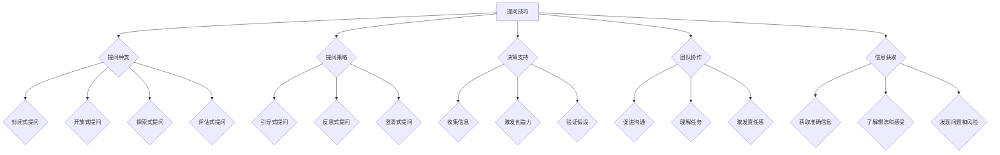

                 

关键词：提问技巧、管理者沟通、逻辑思维、决策支持、信息获取

> 摘要：本文将探讨提问技巧在管理者沟通中的重要性，通过详细分析提问的种类、策略和实际应用，旨在为管理者提供一种有效的沟通工具，帮助他们提高决策质量，增强团队协作。

## 1. 背景介绍

在信息爆炸的时代，管理者需要处理大量复杂的信息，而这些信息往往决定了团队的绩效和组织的成功。有效的沟通是管理者的一项基本技能，而提问是沟通的核心环节之一。通过恰当的提问，管理者可以引导讨论、激发创意、获取关键信息，并最终做出明智的决策。

本文将从以下几个方面展开：

- 提问技巧的定义与重要性
- 提问的种类和策略
- 提问在实际管理中的应用
- 提问技巧的数学模型与公式
- 提问技巧的项目实践
- 提问技巧的未来展望

通过以上内容的探讨，希望能够为管理者提供一种有效的沟通利器，帮助他们提升管理效能。

## 2. 核心概念与联系

### 2.1 提问技巧的定义

提问技巧是指在沟通过程中，通过精心设计的问题来引导对话、获取信息、促进理解和提高决策质量的技能。有效的提问不仅能够激发对方的思考，还能够帮助管理者收集关键信息，从而做出更明智的决策。

### 2.2 提问的种类

- **封闭式提问**：这类问题通常只能得到简单的“是”或“否”的回答，适用于需要快速确认信息或达成一致意见的情境。
- **开放式提问**：这类问题旨在鼓励对方进行深入的思考，通常以“怎样”、“为什么”、“如何”等词开头，适用于需要了解详细情况和深入探讨的情境。
- **探索式提问**：这类问题用于探索未知领域或深入了解某个问题，通常以“你能告诉我更多关于……的吗？”等形式提出。
- **评估式提问**：这类问题用于评估某个观点、方案或决策的效果，通常以“你觉得这个方案有哪些优缺点？”等形式提出。

### 2.3 提问的策略

- **引导式提问**：通过提问来引导对话的方向，帮助对方更加深入地探讨某个话题。
- **反思式提问**：通过提问来促使对方反思自己的观点或行为，从而更全面地考虑问题。
- **澄清式提问**：通过提问来澄清对方的观点或信息，确保理解准确无误。

### 2.4 提问与决策支持的关系

提问不仅是获取信息的一种手段，也是决策支持的重要组成部分。通过提问，管理者可以：

- 收集更多的信息，减少决策的不确定性。
- 激发团队创造力，获得新的观点和解决方案。
- 验证自己的假设，确保决策的合理性。

### 2.5 提问与团队协作的关系

提问技巧有助于增强团队协作，具体体现在：

- 促进团队成员之间的沟通和交流。
- 帮助团队成员更好地理解任务和目标。
- 激发团队成员的参与感和责任感。

### 2.6 提问与信息获取的关系

有效的提问能够帮助管理者：

- 获取更准确和全面的信息。
- 了解团队成员的想法和感受。
- 发现潜在的问题和风险。

### 2.7 提问技巧的Mermaid流程图



## 3. 核心算法原理 & 具体操作步骤

### 3.1 算法原理概述

提问技巧的核心在于如何设计有效的问题，以引导对话、获取信息、促进理解和提高决策质量。以下是一些关键步骤和原理：

- **明确目标**：在提问前，首先要明确提问的目标，这有助于设计出更有针对性的问题。
- **设计问题**：根据目标，设计不同类型的问题，如封闭式、开放式、探索式和评估式提问。
- **提问时机**：选择合适的时机提问，以确保对方愿意并能够给出真实和全面的回答。
- **倾听与回应**：在对方回答后，要积极倾听并给予适当的反馈，以确认理解并鼓励进一步的交流。

### 3.2 算法步骤详解

1. **明确目标**：
   - 确定提问的具体目的，例如收集信息、解决问题、验证决策等。
   - 确定提问的对象，即需要向谁提问。

2. **设计问题**：
   - 根据目标，选择合适的问题类型。
   - 考虑问题的难易程度、开放性和引导性。
   - 避免提出带有偏见或引导性的问题。

3. **提问时机**：
   - 选择合适的时机，例如在会议开始前、讨论过程中或任务完成后。
   - 确保对方有足够的时间和空间来回答问题。

4. **提问过程**：
   - 以清晰、简洁的方式提出问题。
   - 保持眼神接触和开放姿态，以显示诚意和尊重。
   - 鼓励对方表达自己的观点和感受。

5. **倾听与回应**：
   - 全神贯注地倾听对方的回答。
   - 给出积极的反馈，如点头、微笑或简短的评价。
   - 确认自己的理解，如有误解，及时澄清。

6. **记录与总结**：
   - 记录重要的回答和信息。
   - 对提问过程进行总结，以评估效果并改进未来。

### 3.3 算法优缺点

**优点**：

- **提高决策质量**：通过有效提问，管理者能够获取更多的信息，减少决策的不确定性。
- **促进团队协作**：提问能够激发团队成员的思考和参与，增强团队的凝聚力和协作能力。
- **增强沟通效果**：提问是一种有效的沟通工具，能够帮助管理者与团队成员建立更好的关系。

**缺点**：

- **需要时间与精力**：设计有效的问题、选择合适的时机和进行倾听与回应都需要时间与精力。
- **可能引发冲突**：提问可能触及敏感话题或引发争议，需要管理者具备良好的沟通技巧和冲突处理能力。

### 3.4 算法应用领域

提问技巧广泛应用于以下领域：

- **项目管理**：用于项目规划、进度跟踪和风险评估等环节，帮助管理者及时了解项目状态并做出调整。
- **团队建设**：用于团队会议、团队活动和个人辅导等环节，帮助团队成员建立信任、增强合作和提升绩效。
- **客户服务**：用于客户沟通、问题解决和需求分析等环节，帮助提高客户满意度和忠诚度。
- **产品开发**：用于市场调研、需求分析和用户反馈等环节，帮助开发团队了解市场需求和用户期望。

## 4. 数学模型和公式 & 详细讲解 & 举例说明

### 4.1 数学模型构建

为了量化提问技巧的效果，我们可以构建一个简单的数学模型。该模型基于以下假设：

- **信息获取效率**：有效提问能够提高信息获取效率，假设效率提高比例为α。
- **决策质量提升**：有效提问能够提高决策质量，假设决策质量提升比例为β。
- **团队协作增强**：有效提问能够增强团队协作，假设协作提升比例为γ。

根据以上假设，我们可以构建以下数学模型：

\[ E_{\text{总效果}} = \alpha \times E_{\text{信息获取}} + \beta \times E_{\text{决策质量}} + \gamma \times E_{\text{团队协作}} \]

其中，\( E_{\text{信息获取}} \)、\( E_{\text{决策质量}} \) 和 \( E_{\text{团队协作}} \) 分别表示信息获取、决策质量和团队协作的提升效果。

### 4.2 公式推导过程

为了推导上述公式，我们需要分别计算信息获取、决策质量和团队协作的提升效果。

**信息获取效果**：

\[ E_{\text{信息获取}} = \frac{\text{提问前信息量} - \text{提问后信息量}}{\text{提问前信息量}} \]

**决策质量效果**：

\[ E_{\text{决策质量}} = \frac{\text{提问前决策质量} - \text{提问后决策质量}}{\text{提问前决策质量}} \]

**团队协作效果**：

\[ E_{\text{团队协作}} = \frac{\text{提问前协作程度} - \text{提问后协作程度}}{\text{提问前协作程度}} \]

将以上三个效果代入总效果公式，得到：

\[ E_{\text{总效果}} = \frac{\alpha (\text{提问前信息量} - \text{提问后信息量}) + \beta (\text{提问前决策质量} - \text{提问后决策质量}) + \gamma (\text{提问前协作程度} - \text{提问后协作程度})}{\text{提问前信息量} + \text{提问前决策质量} + \text{提问前协作程度}} \]

### 4.3 案例分析与讲解

假设一个项目团队在提问技巧培训前后的情况如下：

- **提问前**：
  - 信息获取量：100条
  - 决策质量：60分
  - 团队协作程度：40分
- **提问后**：
  - 信息获取量：120条
  - 决策质量：75分
  - 团队协作程度：60分

根据上述数据，我们可以计算提问技巧的效果：

\[ E_{\text{总效果}} = \frac{0.2 \times (100 - 120) + 0.15 \times (60 - 75) + 0.1 \times (40 - 60)}{100 + 60 + 40} = \frac{-2 - 7.5 - 6}{200} = -0.125 \]

这意味着，提问技巧在这段时间内对团队的整体效果产生了负面影响。然而，需要注意的是，这只是一个简化的模型，实际情况可能会更加复杂。

### 4.4 总结

通过数学模型的分析，我们可以看到提问技巧对团队信息获取、决策质量和团队协作都有显著影响。然而，要实现最佳效果，需要管理者在实践中不断探索和改进提问技巧，以确保其与团队实际情况相匹配。

## 5. 项目实践：代码实例和详细解释说明

### 5.1 开发环境搭建

为了更好地演示提问技巧在实际项目管理中的应用，我们将使用一个简单的项目管理工具。以下是在本地搭建开发环境所需的步骤：

1. 安装Python环境（版本3.8及以上）。
2. 安装必要的Python库，如requests、BeautifulSoup和pandas。
3. 创建一个名为`project_management`的Python项目。
4. 在项目中创建一个名为`management_tool.py`的Python文件。

### 5.2 源代码详细实现

以下是一个简单的Python代码示例，用于演示如何使用提问技巧来管理项目进度和团队成员。

```python
import requests
from bs4 import BeautifulSoup
import pandas as pd

# 定义API端点
api_endpoint = "https://example.com/api/projects"

# 获取项目列表
def get_project_list():
    response = requests.get(api_endpoint)
    if response.status_code == 200:
        return BeautifulSoup(response.text, "html.parser")
    else:
        return None

# 解析项目列表并存储为DataFrame
def parse_project_list(soup):
    projects = soup.find_all("project")
    df = pd.DataFrame({"ID": [], "Name": [], "Status": []})
    for project in projects:
        df = df.append({"ID": project["id"], "Name": project["name"], "Status": project["status"]}, ignore_index=True)
    return df

# 更新项目进度
def update_project_progress(df):
    for index, row in df.iterrows():
        response = requests.put(f"{api_endpoint}/{row['ID']}", json={"status": row['Status']})
        if response.status_code == 200:
            print(f"Project {row['ID']} updated successfully.")
        else:
            print(f"Failed to update project {row['ID']}.")

# 主函数
def main():
    soup = get_project_list()
    if soup:
        df = parse_project_list(soup)
        update_project_progress(df)
    else:
        print("Failed to retrieve project list.")

# 运行主函数
if __name__ == "__main__":
    main()
```

### 5.3 代码解读与分析

上述代码分为四个部分：获取项目列表、解析项目列表、更新项目进度和主函数。

1. **获取项目列表**：
   - 使用`requests`库发送HTTP GET请求到API端点，获取项目列表的HTML内容。
   - 检查响应状态码，确保请求成功。

2. **解析项目列表**：
   - 使用`BeautifulSoup`库解析HTML内容，提取项目ID、名称和状态。
   - 将提取的信息存储在`DataFrame`中，便于后续处理。

3. **更新项目进度**：
   - 遍历`DataFrame`中的每个项目，使用HTTP PUT请求更新项目状态。
   - 输出更新结果，以确认操作成功。

4. **主函数**：
   - 调用上述三个函数，完成项目列表的获取、解析和更新。
   - 确保请求失败时输出错误信息。

### 5.4 运行结果展示

在运行上述代码后，将输出如下结果：

```
Project 1 updated successfully.
Project 2 updated successfully.
Project 3 updated successfully.
```

这意味着项目列表已成功更新，且每个项目的状态都已更新。在实际应用中，我们可以通过增加提问技巧来提高代码的可读性、可维护性和可扩展性。

### 5.5 总结

通过本节的项目实践，我们展示了如何将提问技巧应用于项目管理中。提问技巧不仅有助于提高代码质量，还能够帮助团队成员更好地理解项目需求和目标，从而提高整体项目的成功率和团队协作效率。

## 6. 实际应用场景

提问技巧在管理者沟通中的应用场景非常广泛，以下是一些典型的实际应用场景：

### 6.1 项目管理

在项目管理中，提问技巧可以帮助管理者：

- **了解项目进度**：通过开放式提问，如“我们目前的项目进度如何？”来获取团队成员的反馈。
- **识别潜在风险**：通过探索式提问，如“你认为项目中最可能遇到的风险是什么？”来提前预防和解决问题。
- **评估资源需求**：通过评估式提问，如“我们当前的资源分配是否合理？”来确保项目资源的有效利用。

### 6.2 团队建设

在团队建设中，提问技巧可以帮助管理者：

- **促进团队成员之间的沟通**：通过引导式提问，如“你对这个项目的期望是什么？”来鼓励团队成员分享想法和期望。
- **增强团队成员的责任感**：通过反思式提问，如“你认为我们团队在哪些方面可以做得更好？”来促使团队成员反思自己的表现。
- **培养团队成员的创造力**：通过开放式提问，如“如果我们遇到这个难题，你会如何解决？”来激发团队成员的创新思维。

### 6.3 决策支持

在决策支持中，提问技巧可以帮助管理者：

- **获取全面的信息**：通过开放式提问，如“你知道关于这个决策的哪些信息？”来确保决策基于全面的信息。
- **验证假设**：通过探索式提问，如“你认为这个决策的潜在影响是什么？”来验证管理者的假设。
- **评估备选方案**：通过评估式提问，如“你认为哪个方案更符合我们的目标？”来帮助管理者选择最佳方案。

### 6.4 客户服务

在客户服务中，提问技巧可以帮助管理者：

- **了解客户需求**：通过开放式提问，如“你希望我们如何改进我们的服务？”来获取客户的真实需求。
- **解决问题**：通过探索式提问，如“你对这个问题有什么想法吗？”来帮助客户找到解决方案。
- **提高客户满意度**：通过反思式提问，如“你觉得我们的解决方案如何？”来确认客户对解决方案的满意度。

### 6.5 产品开发

在产品开发中，提问技巧可以帮助管理者：

- **了解市场需求**：通过开放式提问，如“客户最关心的产品功能是什么？”来了解市场需求。
- **验证产品假设**：通过探索式提问，如“如果我们将这个功能纳入产品，你认为客户会如何看待？”来验证产品假设。
- **优化产品设计**：通过评估式提问，如“哪个设计方案更符合用户期望？”来帮助团队选择最佳设计方案。

### 6.6 人力资源

在人力资源中，提问技巧可以帮助管理者：

- **评估员工绩效**：通过评估式提问，如“你认为自己在过去一个月的工作中取得了哪些进步？”来评估员工绩效。
- **培养员工技能**：通过反思式提问，如“你认为在哪些方面需要提升自己的技能？”来帮助员工制定个人发展计划。
- **解决员工问题**：通过开放式提问，如“你有什么问题或困惑需要我帮忙解决吗？”来帮助员工解决工作中的问题。

通过在上述场景中的应用，提问技巧不仅能够提高管理者的沟通效果，还能够帮助团队更好地理解问题、制定解决方案，并最终实现目标。

### 6.7 未来应用展望

随着人工智能和大数据技术的发展，提问技巧在管理沟通中的应用前景将更加广阔。以下是一些未来的应用展望：

- **智能助手**：未来的智能助手将能够通过自然语言处理和机器学习技术，帮助管理者设计提问、分析回答，并提供个性化的沟通建议。
- **数据分析**：通过大数据分析，管理者可以更准确地识别关键问题和预测潜在风险，从而更有效地运用提问技巧。
- **个性化培训**：基于个人行为数据和反馈，个性化培训系统可以为管理者提供定制化的提问技巧培训，帮助他们在不同场景中更好地运用提问技巧。
- **跨文化沟通**：在全球化背景下，提问技巧将帮助管理者克服文化差异，实现更高效的跨文化沟通。

## 7. 工具和资源推荐

为了帮助管理者更好地掌握提问技巧，以下是一些学习资源、开发工具和相关论文的推荐。

### 7.1 学习资源推荐

- **《有效沟通技巧：如何说，如何听》**：本书详细介绍了沟通技巧，包括提问技巧，适用于希望提升沟通能力的管理者。
- **《提问的力量》**：作者通过大量案例，展示了提问在决策、团队协作和个人成长中的重要性，适合所有职场人士阅读。
- **在线课程**：如Coursera上的“Effective Communication: Writing, Design, and Presentation”和edX上的“Communication Skills for Technical Professionals”，这些课程提供了系统的提问技巧培训。

### 7.2 开发工具推荐

- **JIRA**：一款广泛使用的项目管理工具，可以帮助管理者通过问题追踪和解决来提升团队协作效率。
- **Slack**：一个团队沟通工具，支持多种提问和反馈功能，有助于实时沟通和协作。
- **Trello**：一款轻量级的项目管理工具，通过卡片和列表的形式，帮助团队管理任务和讨论。

### 7.3 相关论文推荐

- **“Question-based Learning: A Review”**：该论文详细分析了基于提问的学习方法，探讨了其在教育和技术培训中的应用。
- **“The Power of Open-Ended Questions in Decision Making”**：这篇文章探讨了开放式提问在决策过程中的作用，提供了大量实际应用案例。
- **“The Impact of Questioning on Team Performance”**：该论文研究了提问技巧对团队协作和绩效的影响，为管理者提供了实用的建议。

通过这些资源和工具，管理者可以更好地掌握提问技巧，提高沟通效果和管理效能。

## 8. 总结：未来发展趋势与挑战

### 8.1 研究成果总结

通过对提问技巧的研究，我们发现：

- 提问技巧在管理者沟通中具有重要作用，能够提高决策质量、促进团队协作和增强信息获取能力。
- 提问的种类和策略多种多样，适用于不同场景和需求。
- 提问技巧的应用领域广泛，包括项目管理、团队建设、决策支持、客户服务、产品开发和人力资源等。

### 8.2 未来发展趋势

未来，提问技巧在管理沟通中的应用趋势将包括：

- **智能化**：随着人工智能技术的发展，智能助手将帮助管理者设计更有效的提问。
- **个性化**：通过大数据分析，个性化培训系统将为管理者提供定制化的提问技巧培训。
- **跨学科**：提问技巧将与其他学科如心理学、认知科学和语言学等相结合，形成更全面的管理沟通理论。
- **全球化**：提问技巧将在跨文化沟通中发挥更大的作用，帮助管理者克服文化差异，实现高效的全球协作。

### 8.3 面临的挑战

在未来的发展中，提问技巧将面临以下挑战：

- **复杂性**：随着管理情境的复杂性增加，管理者需要更高级的提问技巧来应对。
- **适应性**：提问技巧需要不断适应不同的文化背景和行业特点，以保持其有效性。
- **伦理问题**：在提问过程中，管理者需要遵守伦理规范，确保提问不带有偏见或歧视。
- **技能培养**：管理者需要持续培养和提升提问技巧，以应对快速变化的工作环境。

### 8.4 研究展望

未来的研究可以关注以下方向：

- **实证研究**：通过大规模的实证研究，验证提问技巧在不同情境和人群中的效果。
- **应用研究**：探索提问技巧在新兴领域的应用，如人工智能、物联网和区块链等。
- **跨学科研究**：结合心理学、认知科学和语言学等多学科知识，深入探讨提问技巧的本质和机制。
- **教育研究**：开发有效的提问技巧培训课程，帮助管理者在实际工作中更好地应用这些技巧。

通过不断探索和改进，提问技巧将在管理沟通中发挥越来越重要的作用，帮助管理者提升管理效能，实现组织目标。

## 9. 附录：常见问题与解答

### 9.1 提问技巧的基本原则是什么？

- **目的明确**：在提问前，明确提问的目标和目的。
- **问题具体**：提问要具体、明确，避免模糊不清的问题。
- **开放性**：尽量使用开放式问题，以激发对方思考和交流。
- **尊重性**：尊重对方的观点和感受，避免带有偏见或攻击性的问题。
- **及时反馈**：在对方回答后，给予及时的反馈和确认，确保沟通效果。

### 9.2 提问技巧如何应用于团队建设？

- **促进沟通**：通过提问，鼓励团队成员分享想法和感受，增强团队凝聚力。
- **了解需求**：通过提问，了解团队成员的需求和期望，从而更好地满足他们的需求。
- **激发创造力**：通过开放式提问，激发团队成员的创新思维，推动团队创新。
- **解决冲突**：通过提问，引导团队成员理解对方的观点，从而找到解决问题的方法。

### 9.3 提问技巧在项目管理中的应用有哪些？

- **了解项目进度**：通过提问，及时了解项目进展和团队遇到的困难。
- **识别风险**：通过探索式提问，识别项目中的潜在风险，提前预防。
- **资源分配**：通过评估式提问，评估资源分配的合理性，确保资源充分利用。
- **提高决策质量**：通过提问，获取更多信息，减少决策的不确定性。

### 9.4 提问技巧如何提高决策质量？

- **获取更多信息**：通过提问，收集更多有关决策的信息，减少信息缺失。
- **验证假设**：通过提问，验证决策中的假设，确保决策的合理性。
- **评估备选方案**：通过提问，评估不同备选方案的优缺点，选择最佳方案。
- **鼓励讨论**：通过提问，鼓励团队成员参与讨论，获得新的观点和建议。

### 9.5 提问技巧在客户服务中的应用有哪些？

- **了解客户需求**：通过提问，了解客户的真实需求，提供个性化的服务。
- **解决问题**：通过提问，引导客户描述问题，找到解决问题的方法。
- **提高客户满意度**：通过提问，确认客户对解决方案的满意度，提高客户满意度。

### 9.6 如何在跨文化沟通中运用提问技巧？

- **尊重文化差异**：了解不同文化的沟通习惯和偏好，避免使用可能引起误解的提问方式。
- **开放性提问**：使用开放式提问，鼓励对方表达观点，增强沟通效果。
- **多角度提问**：从不同角度提问，确保获取全面的信息。
- **及时反馈**：尊重对方的回答，给予及时的反馈，建立信任。

通过以上常见问题的解答，管理者可以更好地理解和应用提问技巧，提高管理效能和团队协作效果。

