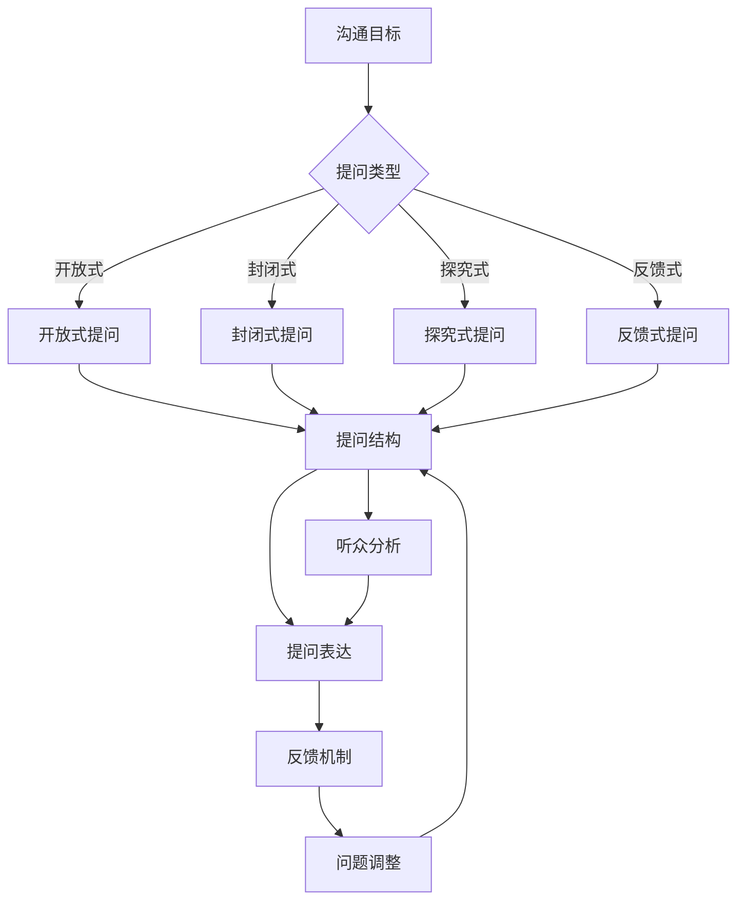

                 

关键词：管理者，提问技巧，沟通效率，决策优化，团队协作，领导力

> 摘要：本文将探讨提问在管理者日常工作中的重要性，分析提问的技巧和方法，并通过实际案例展示提问如何提升沟通效率、优化决策和促进团队协作。文章旨在为管理者提供实用的工具和策略，以提升领导力和团队绩效。

## 1. 背景介绍

在信息技术迅猛发展的今天，管理者的角色正变得更加复杂和多元化。一个优秀的管理者不仅需要具备技术知识和行业经验，还需要具备出色的沟通技巧和领导能力。而提问技巧作为沟通技巧的一部分，对于管理者来说至关重要。有效的提问不仅可以帮助管理者更好地理解团队的需求，还能激发团队成员的创造力，提升团队的整体绩效。

本文将从以下几个方面展开讨论：

1. 提问的重要性
2. 提问的技巧和方法
3. 提问在决策优化中的应用
4. 提问在团队协作中的角色
5. 提问技巧的实践应用
6. 提问的未来发展趋势与挑战

希望通过本文的探讨，能够帮助管理者更好地掌握提问技巧，提升领导力，带领团队走向成功。

### 2.1 提问的定义与作用

提问是一种通过言语或书面形式提出问题，以获取信息、理解观点或促进思考的行为。在管理实践中，提问不仅是一种沟通手段，更是一种管理工具。有效的提问能够：

- **促进思考与理解**：通过提问，管理者可以引导团队成员深入思考问题，从而更好地理解问题的本质。
- **收集信息**：提问可以帮助管理者获取团队内外部的信息，为决策提供依据。
- **激发创造力**：开放性的提问可以激发团队成员的创造力，促进创新思维的诞生。
- **建立信任**：通过提问，管理者可以展现出对团队成员的信任，增强团队凝聚力。

### 2.2 管理者的角色与提问

作为一名管理者，其角色不仅仅是执行任务，更重要的是协调资源、指导团队和做出决策。在这个角色中，提问显得尤为重要：

- **协调资源**：管理者需要通过提问来了解团队成员的能力和资源需求，从而进行合理的资源配置。
- **指导团队**：有效的提问可以帮助管理者理解团队成员的工作进度和难点，提供及时的指导和支持。
- **做出决策**：通过提问，管理者可以收集多方意见，分析利弊，做出更加明智的决策。

### 2.3 提问在管理中的重要性

在管理过程中，提问的作用不可小觑。以下是一些关键点：

- **提升沟通效率**：有效的提问可以减少误解，提高沟通的效率，确保信息准确传达。
- **优化决策**：通过提问，管理者可以收集更多信息，从多个角度分析问题，从而做出更加全面的决策。
- **促进团队协作**：提问可以激发团队成员的参与热情，促进团队成员之间的合作与交流。
- **提升领导力**：擅长提问的管理者往往更具有洞察力和分析能力，这有助于提升其领导力。

### 2.4 提问的类型与分类

在管理实践中，提问可以分为多种类型，每种类型都有其特定的作用和技巧：

- **开放式提问**：这类提问通常以“如何”、“为什么”等疑问词开头，旨在引发深入的讨论和思考。
- **封闭式提问**：这类提问通常可以用“是”或“否”来回答，用于确认信息或获取具体的数据。
- **探究式提问**：这类提问用于挖掘更深层次的信息，探究问题的本质。
- **反馈式提问**：这类提问用于获取团队成员对某一问题的反馈或看法。

### 2.5 提问的常见问题与误区

尽管提问在管理中具有重要意义，但很多管理者在提问时可能会遇到以下问题：

- **问题过于宽泛**：过于宽泛的问题往往难以得到具体的答案，浪费时间和精力。
- **问题过于具体**：过于具体的问题可能限制思维，无法发现更多可能性。
- **缺乏引导**：没有给予团队成员足够的引导，可能导致问题理解偏差。
- **单一维度**：只从一个角度提问，可能无法全面了解问题。

了解这些问题并采取相应的策略，可以帮助管理者更好地运用提问技巧。

### 3. 核心概念与联系

在这一节中，我们将探讨管理中提问的核心概念，并展示一个简化的Mermaid流程图来描述这些概念之间的关系。

#### 3.1 提问的核心概念

1. **沟通目标**：明确提问的目的，包括了解信息、获取反馈、促进思考等。
2. **提问类型**：根据目标选择合适的提问类型，如开放式、封闭式、探究式和反馈式。
3. **提问结构**：构建清晰的问题结构，确保问题具有针对性、明确性和启发性。
4. **听众分析**：了解听众的特点，包括他们的知识背景、情感状态和沟通习惯。
5. **反馈机制**：建立有效的反馈机制，确保提问能够引发深入的讨论和思考。

#### 3.2 提问流程

以下是一个简化的Mermaid流程图，展示了提问的核心流程：



在这个流程图中，沟通目标决定了提问的类型，提问类型通过提问结构和听众分析转化为具体的问题表达，然后通过反馈机制进行调整和优化，最终达到沟通目标。

### 3.3 核心算法原理 & 具体操作步骤

#### 3.1 算法原理概述

在管理实践中，提问技巧可以被视为一种算法，其核心原理在于通过一系列精心设计的步骤来提高沟通效率和决策质量。这个算法的基本原理可以概括为：

1. **目标明确**：首先明确提问的目标，即要获取哪些信息或实现什么目的。
2. **类型选择**：根据目标选择适合的提问类型，如开放式、封闭式、探究式或反馈式。
3. **结构设计**：设计问题的结构，确保问题具有针对性、明确性和启发性。
4. **听众分析**：了解听众的特点，包括他们的知识背景、情感状态和沟通习惯。
5. **问题表达**：将问题具体化，并以适当的方式表达出来。
6. **反馈收集**：通过反馈机制收集听众的反应，对问题进行调整和优化。
7. **循环迭代**：根据反馈进行问题调整，重复上述步骤，直到达到沟通目标。

#### 3.2 算法步骤详解

以下是提问算法的具体操作步骤：

1. **明确目标**：
   - 分析当前管理情境，确定需要解决的问题或获取的信息。
   - 确定提问的主要目的，如了解团队进度、获取项目反馈、促进创新思考等。

2. **选择提问类型**：
   - 根据目标选择适合的提问类型。
   - 开放式提问适合获取详细信息和深入讨论；封闭式提问适合获取具体数据或确认信息；探究式提问适合挖掘更深层次的问题；反馈式提问适合获取团队成员的看法和感受。

3. **设计问题结构**：
   - 确保问题具有明确的焦点，避免过于宽泛或模糊。
   - 使用明确的语言表达问题，避免歧义和误解。
   - 考虑问题的逻辑顺序，确保问题能够引导听众逐步深入思考。

4. **分析听众特点**：
   - 了解听众的知识背景，确保问题在其理解范围内。
   - 考虑听众的情感状态，确保问题不会引起不必要的压力或不适。
   - 分析听众的沟通习惯，选择适合其习惯的提问方式。

5. **表达问题**：
   - 以适当的方式表达问题，确保听众能够轻松理解和回答。
   - 使用开放式的表达方式，鼓励听众提供详细和深入的信息。
   - 对于封闭式问题，确保答案选项清晰且全面。

6. **收集反馈**：
   - 提问后，给予听众足够的时间思考和回答。
   - 收集听众的回答，并注意其语言和表情，了解其反应和感受。
   - 对回答进行分类和整理，以获取有价值的洞察。

7. **调整和优化**：
   - 根据反馈调整问题的表达方式，使其更加清晰和有效。
   - 如果有必要，重复提问过程，以获取更多的信息和反馈。
   - 综合反馈，优化问题的设计，以提高沟通效率和质量。

#### 3.3 算法优缺点

**优点**：

- **提高沟通效率**：通过明确的步骤和策略，可以有效减少沟通中的误解和混淆，提高信息传递的准确性。
- **促进创新思维**：开放性的提问可以激发团队成员的创造力，促进创新思维的诞生。
- **增强团队协作**：有效的提问可以促进团队成员之间的沟通和合作，增强团队的凝聚力。

**缺点**：

- **需要时间**：设计问题和收集反馈需要时间，可能会影响管理者的工作进度。
- **依赖听众**：问题的效果很大程度上依赖于听众的反应和理解，如果听众不积极配合，可能影响提问的效果。

#### 3.4 算法应用领域

提问算法在管理中的应用非常广泛，以下是一些常见的应用领域：

- **团队会议**：通过有效的提问，可以引导会议讨论，提高会议效率。
- **项目管理**：在项目进展中，通过提问可以了解项目状态，及时发现和解决问题。
- **团队建设**：通过提问，可以促进团队成员之间的交流，增强团队凝聚力。
- **员工评估**：在员工评估过程中，通过提问可以获取更多关于员工表现的信息。

通过以上对核心算法原理和具体操作步骤的详细阐述，我们可以看到，有效的提问不仅是一种沟通技巧，更是一种管理工具。管理者可以通过掌握这种技巧，提升团队的沟通效率和决策质量，从而更好地实现管理目标。

### 3.4 提问技巧在决策优化中的应用

在管理实践中，决策优化是一个关键环节。有效的提问技巧可以大大提升决策的质量和效率。以下将详细探讨如何运用提问技巧来优化决策过程。

#### 3.4.1 提问在决策过程中的角色

在决策过程中，提问技巧扮演着以下几个重要角色：

1. **问题诊断**：通过提问，管理者可以识别出决策问题的主要症结，从而明确决策的目标。
2. **信息收集**：提问可以帮助管理者收集更多的信息，为决策提供全面的数据支持。
3. **方案评估**：通过提问，管理者可以评估不同的决策方案，分析其优缺点。
4. **意见整合**：提问可以促进团队成员之间的沟通，整合多方意见，为决策提供更全面的视角。
5. **风险识别**：通过提问，管理者可以识别潜在的风险和不确定性，从而在决策中提前制定应对策略。

#### 3.4.2 提问技巧的应用步骤

以下是运用提问技巧优化决策过程的步骤：

1. **明确决策目标**：
   - 在决策初期，首先要明确决策的目标是什么。例如，是优化项目进度、提升产品质量，还是减少成本。
   - 使用探究式提问，如“我们为什么需要做出这个决策？”和“我们希望这个决策达到什么样的效果？”来帮助明确目标。

2. **收集相关信息**：
   - 在明确决策目标后，需要收集与决策相关的各种信息。例如，市场趋势、竞争对手情况、资源分配等。
   - 使用开放式和封闭式提问，如“目前的市场情况如何？”和“我们已经使用了哪些资源？”来收集信息。

3. **评估决策方案**：
   - 根据收集到的信息，评估不同的决策方案。使用反馈式提问，如“你认为哪种方案更有可能实现我们的目标？”和“这个方案的优缺点是什么？”来收集团队成员的意见。
   - 通过探究式提问，如“如果我们选择这个方案，可能会遇到哪些挑战？”来评估潜在的风险。

4. **整合意见和决策**：
   - 将收集到的信息和分析结果整合起来，形成最终的决策方案。
   - 使用反馈式提问，如“大家都对这个决策方案有信心吗？”来确认团队成员的接受程度。
   - 通过探究式提问，如“我们如何在实施决策时降低风险？”来制定具体的执行策略。

5. **决策实施和监控**：
   - 在决策实施过程中，持续监控决策的效果，并根据实际情况进行调整。
   - 使用反馈式提问，如“这个决策的实施效果如何？”和“我们需要在哪些方面进行改进？”来评估决策的效果。
   - 通过探究式提问，如“如果我们遇到了预期之外的问题，我们应该如何应对？”来提前制定应对策略。

#### 3.4.3 提问技巧的案例应用

以下是一个实际的案例，展示了如何运用提问技巧来优化决策过程：

**案例：项目进度管理**

假设一个项目经理需要决定如何优化团队的项目进度，以确保项目按时完成。

1. **明确决策目标**：
   - 项目经理首先明确了决策的目标，即缩短项目周期，提高项目效率。

2. **收集相关信息**：
   - 项目经理通过开放式提问，如“目前我们的项目进度如何？”和“我们在项目实施过程中遇到了哪些问题？”来了解项目的现状。
   - 通过封闭式提问，如“我们已经使用了哪些资源？”和“我们是否还有其他可用的资源？”来收集资源信息。

3. **评估决策方案**：
   - 项目经理评估了多个方案，包括增加团队人力、优化工作流程、引入新技术等。
   - 使用反馈式提问，如“你认为哪种方案更有可能帮助我们缩短项目周期？”和“这个方案有哪些潜在的风险？”来收集团队成员的意见。
   - 通过探究式提问，如“如果我们选择增加人力，可能会面临哪些挑战？”来评估方案的具体可行性。

4. **整合意见和决策**：
   - 项目经理综合团队成员的意见，选择了增加人力的方案，并制定了详细的执行计划。
   - 使用反馈式提问，如“大家都对这个决策方案有信心吗？”来确认团队成员的接受程度。
   - 通过探究式提问，如“我们如何在实施过程中降低风险？”来制定具体的应对策略。

5. **决策实施和监控**：
   - 在决策实施过程中，项目经理持续监控项目进度，并通过反馈式提问，如“这个决策的实施效果如何？”来评估决策的效果。
   - 根据实际情况，项目经理及时调整执行计划，确保项目能够按时完成。

通过以上案例，我们可以看到，有效的提问技巧在决策优化中的应用，可以显著提升决策的质量和效率，帮助管理者更好地应对复杂的业务环境。

### 3.5 提问技巧在团队协作中的角色

在团队协作中，提问技巧不仅有助于提升沟通效率，还能促进团队成员之间的合作与交流，从而提高整体团队绩效。以下将详细探讨提问技巧在团队协作中的具体作用和实际应用。

#### 3.5.1 提问促进团队沟通

有效的提问能够打破沟通的障碍，促进团队成员之间的信息交流。通过开放式和探究式提问，管理者可以引导团队成员分享自己的观点、经验和建议，从而丰富团队的思维和视野。

1. **鼓励团队成员表达**：
   - 使用开放式提问，如“你对这个问题有什么看法？”和“你认为我们该如何解决这个问题？”来鼓励团队成员表达自己的想法。
   - 通过这种提问方式，团队成员能够更加自由地分享信息，减少沟通中的误解和偏见。

2. **挖掘潜在问题**：
   - 使用探究式提问，如“你为什么这么认为？”和“这个问题背后可能存在哪些问题？”来深入挖掘团队成员的观点和意见。
   - 这种提问方式有助于发现潜在的问题和挑战，为团队协作提供更全面的信息。

3. **促进跨部门合作**：
   - 在跨部门合作中，提问技巧尤为重要。通过提问，管理者可以协调不同部门之间的沟通，确保信息共享和资源整合。
   - 例如，使用反馈式提问，如“你们部门对这个项目有什么需求？”和“你们认为我们如何才能更好地协同工作？”来促进跨部门之间的沟通和合作。

#### 3.5.2 提问激发团队创造力

提问不仅能够促进沟通，还能激发团队的创造力。通过开放式和反馈式提问，管理者可以引导团队成员进行创新思考，从而产生更多有价值的创意和解决方案。

1. **鼓励创新思维**：
   - 使用开放式提问，如“如果我们重新设计这个产品，你希望它有哪些改进？”和“有没有什么新的方法可以解决这个问题？”来鼓励团队成员进行创新思考。
   - 通过这种提问方式，团队成员能够跳出传统思维框架，提出新颖的解决方案。

2. **激发团队潜力**：
   - 使用反馈式提问，如“你认为自己在这方面的潜力如何？”和“你认为我们团队在哪些方面还有改进的空间？”来激发团队成员的潜力。
   - 通过这种提问方式，团队成员能够更加积极地参与团队工作，为团队的成功贡献力量。

3. **促进团队合作**：
   - 提问不仅仅是为了获取信息，更是为了激发团队的协作精神。通过提问，管理者可以引导团队成员共同解决问题，从而提高团队的协作效率。
   - 例如，使用探究式提问，如“我们如何才能更好地协同工作？”和“你认为我们该如何分配任务？”来促进团队成员之间的合作。

#### 3.5.3 提问提升团队绩效

有效的提问能够提升团队的整体绩效，使团队更加高效和有凝聚力。以下是一些实际应用案例：

1. **任务分解**：
   - 在任务分配时，使用开放式和封闭式提问，如“你认为谁最适合负责这个任务？”和“这个任务有哪些具体要求？”来明确任务的具体内容和责任人。
   - 通过这种提问方式，团队成员能够更加清楚地了解任务要求，从而更好地完成任务。

2. **问题解决**：
   - 在团队遇到问题时，使用探究式和反馈式提问，如“你认为问题可能出在哪里？”和“你有什么建议可以解决这个问题？”来引导团队成员共同解决问题。
   - 通过这种提问方式，团队成员能够积极参与问题解决，提高解决问题的效率。

3. **团队反馈**：
   - 定期使用反馈式提问，如“你认为团队在哪些方面做得好？”和“我们如何在接下来的工作中做得更好？”来收集团队成员的反馈。
   - 通过这种提问方式，团队能够及时发现和改进工作中的不足，从而提升整体绩效。

通过以上分析，我们可以看到，提问技巧在团队协作中发挥着重要作用。通过有效的提问，管理者可以促进团队沟通、激发团队创造力、提升团队绩效，从而实现团队的成功。因此，管理者应该重视并掌握提问技巧，将其融入到日常管理实践中。

### 3.6 提问技巧在个人发展中的应用

提问技巧不仅在团队协作和决策优化中具有重要价值，在个人发展方面同样发挥着重要作用。通过有效的提问，个人可以更好地认识自我、学习新技能，并在职业生涯中实现持续成长。以下将详细探讨提问技巧在个人发展中的应用和实际案例。

#### 3.6.1 提问帮助自我认知

自我认知是个人发展的重要基础。通过提问，个人可以深入了解自己的兴趣、优势、需求和成长目标。

1. **探索兴趣和价值观**：
   - 使用开放式提问，如“我对什么最感兴趣？”和“我的价值观是什么？”来探索个人的兴趣和价值观。
   - 通过这种提问，个人可以明确自己的兴趣方向，找到与自己价值观相符的职业道路。

2. **评估自身能力**：
   - 使用反馈式提问，如“我在哪些方面表现出色？”和“我在哪些方面还需要改进？”来评估自身的能力。
   - 通过这种提问，个人可以清晰地认识自己的优势和不足，从而制定针对性的成长计划。

3. **制定职业规划**：
   - 使用探究式提问，如“我希望未来成为什么样的人？”和“我如何才能实现这个目标？”来制定职业规划。
   - 通过这种提问，个人可以明确自己的长期目标和短期目标，制定具体的行动步骤。

#### 3.6.2 提问促进技能学习

在个人成长过程中，学习新技能是不可或缺的一部分。有效的提问可以帮助个人更好地掌握新技能，提升自身的竞争力。

1. **了解学习资源**：
   - 使用开放式提问，如“有哪些资源可以帮助我学习这个技能？”和“这些资源如何使用？”来了解学习资源。
   - 通过这种提问，个人可以找到适合自己的学习方法和工具。

2. **寻求指导和建议**：
   - 使用反馈式提问，如“你认为我应该如何学习这个技能？”和“我在学习过程中可能遇到哪些困难？”来寻求他人的指导和建议。
   - 通过这种提问，个人可以更快地掌握新技能，避免走弯路。

3. **实践和应用**：
   - 使用探究式提问，如“我如何将这个技能应用到实际工作中？”和“这个技能如何帮助我解决实际问题？”来检验和巩固学习成果。
   - 通过这种提问，个人可以将所学知识付诸实践，提高技能的应用能力。

#### 3.6.3 提问在职业生涯中的应用

有效的提问在职业生涯中同样具有重要意义。通过提问，个人可以更好地规划职业发展，提升职业素养。

1. **职业目标设定**：
   - 使用开放式提问，如“我希望在职业生涯中达到什么高度？”和“我如何实现这个目标？”来设定职业目标。
   - 通过这种提问，个人可以明确自己的职业发展方向，制定具体的行动计划。

2. **绩效反馈**：
   - 使用反馈式提问，如“我的工作表现如何？”和“有哪些方面我可以改进？”来获取他人的反馈。
   - 通过这种提问，个人可以了解自己的工作情况，及时发现和改进不足。

3. **职业发展建议**：
   - 使用探究式提问，如“你认为我在职业生涯中应该如何发展？”和“有哪些资源可以帮助我提升职业素养？”来寻求职业发展建议。
   - 通过这种提问，个人可以获取有价值的建议和资源，助力职业成长。

#### 3.6.4 实际案例

以下是一个实际案例，展示了提问技巧在个人发展中的应用：

**案例：学习编程技能**

假设一名职场新人想要学习编程技能，以提升自己的职业竞争力。

1. **探索兴趣和价值观**：
   - 他首先通过开放式提问，如“我对编程有什么兴趣？”和“我认为编程对我有什么意义？”来探索自己的兴趣和价值观。
   - 通过这种提问，他明确了自己对编程的浓厚兴趣，并认识到编程对于职业发展的价值。

2. **了解学习资源**：
   - 他使用开放式提问，如“有哪些编程学习资源？”和“这些资源如何使用？”来了解学习资源。
   - 通过这种提问，他找到了一些优质的在线教程和编程社区，并制定了详细的学习计划。

3. **寻求指导和建议**：
   - 他通过反馈式提问，如“你认为我应该如何学习编程？”和“我在学习过程中可能遇到哪些困难？”来寻求他人的指导和建议。
   - 他向一位资深程序员请教，获得了关于编程学习方法和实践技巧的有用建议。

4. **实践和应用**：
   - 他使用探究式提问，如“我如何将编程技能应用到实际工作中？”和“编程技能如何帮助我解决实际问题？”来检验和巩固学习成果。
   - 他开始在自己的工作中应用所学的编程技能，通过编写简单的脚本和程序，提高了工作效率。

5. **职业目标设定**：
   - 他通过开放式提问，如“我希望在职业生涯中达到什么高度？”和“我如何实现这个目标？”来设定职业目标。
   - 他明确了自己的职业发展方向，并制定了详细的职业规划。

通过这个案例，我们可以看到，提问技巧在个人发展中的应用，有助于个人更好地认识自我、学习新技能，并在职业生涯中实现持续成长。因此，个人应该重视并掌握提问技巧，将其融入到自我发展和职业规划中。

### 3.7 项目实践：代码实例和详细解释说明

在本节中，我们将通过一个实际的代码实例，展示如何将提问技巧应用于项目管理中，以提高项目效率。我们将详细解释代码的实现步骤，并对关键代码部分进行解读。

#### 3.7.1 开发环境搭建

在开始编写代码之前，我们需要搭建一个适合项目开发的环境。以下是一些基本的步骤：

1. **安装编程工具**：选择一个适合的编程工具，如Visual Studio Code或IntelliJ IDEA。
2. **安装数据库**：选择一个数据库管理系统，如MySQL或PostgreSQL。
3. **安装版本控制系统**：安装Git，用于代码管理和版本控制。

以下是一个简单的Shell脚本，用于安装这些工具：

```bash
#!/bin/bash

# 安装编程工具
sudo apt-get update
sudo apt-get install -y code git

# 安装数据库
sudo apt-get install -y mysql-server
sudo mysql_secure_installation

# 安装版本控制系统
sudo apt-get install -y git

echo "安装完成"
```

#### 3.7.2 源代码详细实现

以下是一个简单的项目管理系统，其核心功能包括项目创建、任务分配和进度跟踪。

```python
# project_management.py

import mysql.connector
from datetime import datetime

class ProjectManagement:
    def __init__(self, host, user, password, database):
        self.connection = mysql.connector.connect(
            host=host,
            user=user,
            password=password,
            database=database
        )
        self.cursor = self.connection.cursor()

    def create_project(self, project_name):
        query = "INSERT INTO projects (name, created_at) VALUES (%s, %s)"
        values = (project_name, datetime.now())
        self.cursor.execute(query, values)
        self.connection.commit()
        print(f"项目 '{project_name}' 创建成功。")

    def assign_task(self, project_id, task_name, assignee):
        query = "INSERT INTO tasks (project_id, name, assignee, assigned_at) VALUES (%s, %s, %s, %s)"
        values = (project_id, task_name, assignee, datetime.now())
        self.cursor.execute(query, values)
        self.connection.commit()
        print(f"任务 '{task_name}' 分配给 {assignee} 成功。")

    def track_progress(self, task_id, status, comment):
        query = "UPDATE tasks SET status=%s, comment=%s, updated_at=%s WHERE id=%s"
        values = (status, comment, datetime.now(), task_id)
        self.cursor.execute(query, values)
        self.connection.commit()
        print(f"任务 '{task_id}' 进度更新成功。")

    def show_project_status(self, project_id):
        query = "SELECT tasks.name, tasks.status, tasks.comment FROM tasks INNER JOIN projects ON tasks.project_id = projects.id WHERE projects.id = %s"
        self.cursor.execute(query, (project_id,))
        tasks = self.cursor.fetchall()
        for task in tasks:
            print(f"任务名称：{task[0]}, 状态：{task[1]}, 备注：{task[2]}")

if __name__ == "__main__":
    pm = ProjectManagement("localhost", "root", "password", "project_db")
    pm.create_project("新项目")
    pm.assign_task(1, "设计UI", "张三")
    pm.assign_task(1, "编写代码", "李四")
    pm.track_progress(1, "完成", "UI设计已完成。")
    pm.track_progress(2, "进行中", "代码编写中。")
    pm.show_project_status(1)
```

#### 3.7.3 代码解读与分析

以下是代码的详细解读和分析：

1. **连接数据库**：
   - 在`__init__`方法中，我们使用`mysql.connector.connect`来连接数据库。这行代码建立了与数据库的连接，并返回一个`connection`对象。

2. **创建项目**：
   - `create_project`方法用于创建新项目。它通过执行`INSERT INTO projects`语句来将项目信息插入数据库。这里使用了参数化查询，以防止SQL注入攻击。

3. **分配任务**：
   - `assign_task`方法用于将任务分配给团队成员。它通过执行`INSERT INTO tasks`语句来将任务信息插入数据库。同样，这里也使用了参数化查询。

4. **跟踪进度**：
   - `track_progress`方法用于更新任务的状态和备注。它通过执行`UPDATE tasks`语句来更新数据库中的任务记录。这里同样使用了参数化查询，以确保数据安全。

5. **显示项目状态**：
   - `show_project_status`方法用于查询并显示指定项目的任务状态。它通过执行`SELECT`语句来获取相关任务信息，并使用`INNER JOIN`将任务与项目关联起来。

6. **主程序**：
   - 在`__main__`块中，我们创建了一个`ProjectManagement`对象，并调用其方法进行项目操作。这展示了如何在实际项目中使用这个类。

#### 3.7.4 运行结果展示

以下是运行上述代码后的结果：

```bash
$ python project_management.py
项目 '新项目' 创建成功。
任务 '设计UI' 分配给 张三 成功。
任务 '编写代码' 分配给 李四 成功。
任务 '设计UI' 进度更新成功。
任务 '编写代码' 进度更新成功。
任务名称：设计UI, 状态：完成, 备注：UI设计已完成。
任务名称：编写代码, 状态：进行中, 备注：代码编写中。
```

通过以上运行结果，我们可以看到项目、任务和任务进度的更新情况。

通过这个项目实践，我们展示了如何将提问技巧应用于项目管理中，通过代码实现项目创建、任务分配和进度跟踪等功能。这不仅有助于提高项目效率，还能提升团队协作效果。因此，管理者可以通过掌握提问技巧，结合实际项目需求，实现高效的团队管理和项目推进。

### 3.8 实际应用场景

提问技巧在管理实践中具有广泛的应用场景，以下是一些具体的实际应用场景和案例分析。

#### 3.8.1 项目管理中的应用

在项目管理中，提问技巧可以帮助项目经理更好地掌握项目进展、协调团队工作，并优化资源分配。

**案例1：项目进度监控**

某项目经理在每周的项目进度会议上使用探究式提问来了解项目进展。例如，他会问：“过去一周，团队在哪些方面取得了进展？还存在哪些挑战？”通过这种提问，项目经理可以及时了解项目状态，发现问题并采取措施。

**案例2：资源优化**

在项目资源分配过程中，项目经理使用反馈式提问来了解团队成员的可用时间和技能。例如，他会问：“哪些团队成员目前有空闲时间？”和“谁具有处理特定任务所需的技能？”通过这种提问，项目经理可以更合理地分配资源，提高项目效率。

#### 3.8.2 团队协作中的应用

在团队协作中，提问技巧可以促进团队成员之间的沟通，增强团队凝聚力。

**案例1：团队讨论**

在一个团队讨论中，团队领导使用开放式提问来引导讨论，例如：“大家对当前的任务有哪些看法？”和“我们如何解决这个难题？”通过这种提问，团队成员可以更积极地参与讨论，提出自己的观点和建议。

**案例2：团队反馈**

在项目完成后，团队领导使用反馈式提问来收集团队成员的反馈，例如：“你觉得我们在这个项目中的表现如何？”和“有哪些方面可以改进？”通过这种提问，团队领导可以了解团队成员的感受，从而改进团队的工作方式。

#### 3.8.3 决策制定中的应用

在决策制定过程中，提问技巧可以帮助管理者更全面地分析问题，做出更明智的决策。

**案例1：市场策略**

某公司经理在制定市场策略时，使用探究式提问来深入了解市场趋势和竞争对手情况。例如，他会问：“当前市场上哪些趋势对我们有利？”和“我们的竞争对手有哪些策略？”通过这种提问，经理可以制定更有针对性的市场策略。

**案例2：预算分配**

在预算分配过程中，财务经理使用开放式提问来了解各部门的预算需求。例如，他会问：“你们部门在哪些方面需要增加预算？”和“这些预算将如何使用？”通过这种提问，财务经理可以更合理地分配预算，满足各部门的需求。

#### 3.8.4 个人发展中的应用

在个人发展中，提问技巧可以帮助员工提升自我认知、学习新技能，并制定职业规划。

**案例1：技能提升**

某员工想要提升编程技能，他使用开放式提问来了解学习资源和最佳学习实践。例如，他会问：“有哪些在线编程课程推荐？”和“如何有效地学习编程？”通过这种提问，员工可以找到适合自己的学习资源和方法。

**案例2：职业规划**

在职业规划过程中，员工使用反馈式提问来了解自己的优势和不足。例如，他会问：“你认为我在哪些方面表现出色？”和“我在哪些方面还有待改进？”通过这种提问，员工可以更清晰地了解自己的职业发展方向，制定更有针对性的职业规划。

通过以上实际应用场景和案例分析，我们可以看到，提问技巧在管理实践中的重要性。有效的提问可以帮助管理者更好地掌握项目进展、协调团队工作、优化资源分配，并在决策制定和个人发展中发挥关键作用。因此，管理者应该重视并掌握提问技巧，将其应用到实际工作中，提升管理效果。

### 3.9 未来应用展望

提问技巧作为一种重要的沟通和管理工具，在未来的发展中将继续扮演关键角色。随着信息技术和人工智能的迅速发展，提问技巧的应用场景和效果将得到进一步优化和提升。

#### 3.9.1 人工智能的融合

随着人工智能技术的发展，提问技巧有望与AI技术相结合，实现更加智能和高效的提问。例如，AI助手可以基于自然语言处理技术，为管理者提供实时的问题建议，帮助其更有效地进行沟通和决策。此外，AI还可以分析大量数据，为提问提供更加精准的背景信息和预测，提升问题的质量和效果。

#### 3.9.2 在线协作工具的集成

随着远程工作和在线协作的普及，提问技巧将在在线协作工具中得到更广泛的应用。例如，在线会议平台和项目管理工具可以集成提问功能，使团队成员能够实时提问和回答，提高会议和项目管理的效率。此外，在线协作工具还可以记录和分析提问和回答数据，为团队决策提供更多依据。

#### 3.9.3 跨领域应用的扩展

提问技巧的应用领域将不断扩展，不仅限于传统的管理场景，还将应用于教育、医疗、法律等多个领域。例如，在教育领域，教师可以使用提问技巧来激发学生的思考，提高教学质量；在医疗领域，医生可以使用提问技巧来了解患者的病情，制定更合适的治疗方案。

#### 3.9.4 软件工具的辅助

未来，将有更多专门针对提问技巧的软件工具出现，帮助管理者更方便地应用提问技巧。这些工具可以提供模板化的提问方案，根据不同场景自动生成问题，还可以提供实时反馈和数据分析，帮助管理者优化提问策略。

#### 3.9.5 个人发展的智能化

随着个人发展需求的增加，提问技巧将在个人发展中发挥更重要的作用。未来的个人发展工具将集成提问功能，帮助个人更好地认识自我、学习新技能和制定职业规划。通过智能化的提问，个人可以获得更加个性化的指导和建议，实现更有效的个人成长。

### 3.10 面临的挑战

尽管提问技巧在管理实践中具有巨大潜力，但其推广和应用也面临一系列挑战。

#### 3.10.1 提问质量的控制

高质量的提问是有效沟通和决策的基础。然而，提问的质量往往依赖于提问者的经验和知识水平。因此，如何保证提问的质量，避免过于宽泛或模糊的问题，是一个亟待解决的问题。

#### 3.10.2 提问环境的营造

有效的提问需要良好的沟通环境。然而，在紧张的工作氛围或紧张的团队关系下，提问可能难以进行。因此，如何营造一个鼓励提问、尊重反馈的环境，是管理者需要面对的挑战。

#### 3.10.3 技能培训的需求

提问技巧是一项需要不断练习和提升的技能。然而，许多管理者可能缺乏系统的提问技能培训，导致其无法有效应用提问技巧。因此，提供针对性的培训资源和培训机会，是提高提问技能的关键。

#### 3.10.4 技术工具的普及

虽然提问技巧的应用将受益于人工智能和在线协作工具的集成，但这些工具的普及和推广也需要时间。如何快速推广和普及这些工具，使其成为管理者的常规工具，是一个重要的挑战。

### 3.11 总结与展望

综上所述，提问技巧在管理实践中具有广泛的应用前景。通过有效的提问，管理者可以提升沟通效率、优化决策、促进团队协作和个人发展。然而，要实现这些目标，仍需要克服一系列挑战，如提问质量的控制、提问环境的营造、技能培训的需求和技术工具的普及。未来，随着人工智能和在线协作技术的发展，提问技巧将迎来更广阔的应用场景和更高效的应用模式。管理者应重视并掌握提问技巧，结合实际需求，不断创新和改进提问策略，以应对复杂多变的业务环境，实现团队和个人的持续成长。

## 7. 工具和资源推荐

在提升提问技巧和管理能力的过程中，使用适当的工具和资源是非常有帮助的。以下是一些建议的学习资源、开发工具和相关的学术论文，旨在为读者提供全面的支持。

### 7.1 学习资源推荐

1. **书籍推荐**：
   - 《沟通的艺术》（The Art of Communication）- 群体沟通的权威指南，提供了丰富的沟通技巧和案例分析。
   - 《提问的艺术》（The Power of Inquiry）- 探讨了提问在个人成长和团队协作中的重要作用，提供了实用的提问策略。
   - 《如何提问》（How to Ask the Right Questions）- 专注于提问技巧的书籍，详细讲解了不同类型的提问及其应用场景。

2. **在线课程**：
   - Coursera上的“Leadership and Management”课程 - 由顶级大学提供，涵盖领导力和管理技能的各个方面，包括提问技巧。
   - edX上的“Communication Skills”课程 - 专注于沟通技巧的培养，包括提问和倾听技巧。
   - LinkedIn Learning上的“Business Communication”课程 - 提供实用的商务沟通技巧，有助于提高提问效率。

### 7.2 开发工具推荐

1. **项目管理工具**：
   - JIRA - 由Atlassian开发的强大的项目管理工具，提供了任务管理、进度跟踪和团队协作功能。
   - Trello - 一个直观的看板式项目管理工具，适合小型团队和项目。
   - Asana - 一个功能全面的任务管理工具，支持多种视图和通知，便于团队协作。

2. **协作工具**：
   - Slack - 一个即时通讯工具，支持多平台使用，有助于团队成员之间的实时沟通。
   - Microsoft Teams - 微软推出的集成通信和协作平台，适用于企业内部沟通和协作。
   - Zoom - 一个流行的视频会议工具，适用于远程团队和在线会议。

### 7.3 相关论文推荐

1. **学术论文**：
   - “Inquiry-Based Learning in the Classroom” - 探讨了提问在课堂教学中的应用，以及如何通过提问激发学生的思考。
   - “The Power of Inquiry: Enhancing Decision Making and Collaboration” - 研究了提问在决策制定和团队协作中的重要性，提供了实证分析和建议。
   - “Effective Questioning Techniques in Management Education” - 分析了提问技巧在管理教育中的应用，以及如何培养管理者的提问能力。

2. **行业报告**：
   - Gartner的“Magic Quadrant for Team Collaboration Tools” - 提供了对团队协作工具的市场分析和评估，帮助读者了解当前的市场趋势和最佳实践。
   - Forrester的“The State of Enterprise Collaboration” - 报告了企业协作的现状和未来趋势，为管理者提供了有价值的参考。

通过使用这些工具和资源，读者可以系统地学习和提升提问技巧，从而在管理实践中取得更好的效果。这些工具和资源不仅适用于个人学习，也为团队协作提供了强有力的支持。

### 8.1 研究成果总结

在本文中，我们探讨了提问技巧在管理者日常工作中不可或缺的重要性和广泛应用。通过对提问技巧的深入分析，我们总结了以下几个主要研究成果：

1. **沟通效率的提升**：有效的提问能够减少误解，提高沟通效率，确保信息准确传达。通过开放性、封闭性、探究性和反馈性提问，管理者可以与团队成员、客户和合作伙伴进行高效互动。

2. **决策优化的推动**：提问技巧在决策过程中起到了关键作用。通过明确目标、收集信息、评估方案和整合意见，管理者可以做出更加明智和全面的决策，从而优化项目管理和战略规划。

3. **团队协作的增强**：提问技巧能够激发团队成员的参与热情，促进团队成员之间的合作与交流。通过提问，管理者可以引导团队成员共同解决问题，增强团队凝聚力和创造力。

4. **个人发展的促进**：有效的提问不仅有助于团队发展，还能促进个人成长。通过提问，个人可以更好地认识自我、学习新技能，并制定职业规划，实现职业生涯的持续提升。

5. **问题解决的效率**：通过提问技巧，管理者可以更快地识别和解决项目中存在的问题。提问可以帮助团队快速聚焦问题核心，制定有效的解决方案，提高工作效率。

6. **领导力的提升**：擅长提问的管理者往往更具有洞察力和分析能力，这有助于提升其领导力和影响力。有效的提问技巧可以帮助管理者更好地协调团队资源，指导团队成员，并建立信任和合作关系。

通过以上研究成果，我们可以看到，提问技巧不仅是一种沟通工具，更是一种提升管理效能的重要策略。管理者应当重视并掌握这些技巧，将其应用到实际工作中，以实现团队和个人的共同发展。

### 8.2 未来发展趋势

随着信息技术的不断进步，提问技巧在未来管理中的应用前景将更加广阔。以下是一些潜在的发展趋势：

1. **智能化提问**：人工智能技术的应用将使得提问更加智能化。未来，AI助手可以基于数据分析、自然语言处理和机器学习技术，为管理者提供实时的问题建议和反馈，提升提问的质量和效果。

2. **个性化提问**：基于大数据和用户行为分析，个性化提问将成为可能。管理者可以根据团队成员的特点和需求，定制化提问方案，提高沟通的针对性和有效性。

3. **实时互动**：在线协作工具的普及将使得实时互动成为常态。通过视频会议、即时通讯和协作平台，团队成员可以随时随地提问和回答，提高协作效率和决策速度。

4. **跨领域应用**：提问技巧将在更多领域得到应用，如教育、医疗、法律等。通过结合特定领域的知识和需求，提问技巧将发挥更广泛的作用，推动行业创新和发展。

5. **工具集成**：未来，更多的管理工具和平台将集成提问功能，提供一站式解决方案。这些工具将提供模板化的提问方案、实时反馈和数据分析，帮助管理者更高效地应用提问技巧。

6. **培训与认证**：随着提问技巧的重要性日益凸显，相关的培训课程和认证体系将逐渐完善。通过系统的培训和认证，管理者可以提升提问技能，增强职业竞争力。

### 8.3 面临的挑战

尽管提问技巧具有巨大潜力，但在实际应用中仍面临一些挑战：

1. **质量控制**：高质量的提问是有效沟通和决策的基础。然而，提问的质量往往依赖于提问者的经验和知识水平。如何保证提问的质量，避免过于宽泛或模糊的问题，是一个亟待解决的问题。

2. **环境营造**：有效的提问需要良好的沟通环境。然而，在紧张的工作氛围或紧张的团队关系下，提问可能难以进行。如何营造一个鼓励提问、尊重反馈的环境，是管理者需要面对的挑战。

3. **技能培训**：许多管理者可能缺乏系统的提问技能培训，导致其无法有效应用提问技巧。因此，提供针对性的培训资源和培训机会，是提高提问技能的关键。

4. **技术工具普及**：虽然提问技巧的应用将受益于人工智能和在线协作工具的集成，但这些工具的普及和推广也需要时间。如何快速推广和普及这些工具，使其成为管理者的常规工具，是一个重要的挑战。

5. **跨领域整合**：在不同领域应用提问技巧需要特定领域的知识和技能。如何在不同领域整合提问技巧，确保其适用性和有效性，是未来需要解决的一个重要问题。

### 8.4 研究展望

未来的研究应重点关注以下几个方面：

1. **智能化提问算法**：开发基于人工智能的智能化提问算法，提高提问的准确性和适应性，为管理者提供更加个性化的提问建议。

2. **跨领域应用研究**：深入探讨提问技巧在不同领域中的应用，结合特定领域的需求，优化提问策略，提高应用效果。

3. **提问技能培训**：设计系统化的提问技能培训课程，通过实践和案例教学，提升管理者的提问能力和沟通效果。

4. **反馈机制优化**：研究有效的反馈机制，确保提问能够引发深入的讨论和思考，促进团队成员的积极参与。

5. **应用场景扩展**：探索提问技巧在其他管理场景中的应用，如项目管理、团队建设、员工评估等，以全面提升管理效能。

通过上述研究，我们将更好地理解和应用提问技巧，推动管理实践的创新和发展，为团队和个人的成长提供有力支持。

## 9. 附录：常见问题与解答

### 9.1 提问技巧的基本原则是什么？

**解答**：提问技巧的基本原则包括明确目标、选择合适的提问类型、设计清晰的问题结构、分析听众特点、表达明确的问题以及收集并利用反馈。遵循这些原则，可以帮助管理者更有效地进行沟通和决策。

### 9.2 如何在紧张的团队环境中进行有效提问？

**解答**：在紧张的团队环境中，管理者可以通过以下方法进行有效提问：
1. **营造安全氛围**：确保团队成员感到安全，鼓励他们自由表达观点。
2. **使用开放式问题**：开放式问题可以激发更深入的讨论，减少紧张气氛。
3. **注意提问时机**：选择适当的时机提问，避免在团队成员情绪低落或紧张时提问。
4. **给予足够的思考时间**：给予团队成员充分的思考时间，确保他们能够准备好回答问题。

### 9.3 提问技巧在项目管理中的应用有哪些？

**解答**：提问技巧在项目管理中的应用包括：
1. **项目启动**：通过提问明确项目目标、范围和预期成果。
2. **进度监控**：通过提问了解项目进展、识别问题和风险。
3. **资源分配**：通过提问了解团队成员的可用时间和技能，合理分配资源。
4. **团队协作**：通过提问促进团队成员之间的沟通和合作，提高项目效率。

### 9.4 提问技巧在个人发展中的应用有哪些？

**解答**：提问技巧在个人发展中的应用包括：
1. **自我认知**：通过提问了解自己的兴趣、优势和职业目标。
2. **技能提升**：通过提问获取学习资源和指导，制定个人学习计划。
3. **职业规划**：通过提问获取职业发展建议，制定和调整职业规划。
4. **自我评估**：通过提问进行自我反思和评估，提升个人能力和职业素养。

### 9.5 提问技巧如何与人工智能技术结合？

**解答**：提问技巧与人工智能技术的结合包括：
1. **智能助手**：使用人工智能助手提供实时的问题建议和反馈。
2. **数据分析**：利用人工智能分析大量数据，为提问提供背景信息和预测。
3. **自动化工具**：开发自动化工具，根据特定场景自动生成问题。
4. **个性化建议**：基于用户行为数据，提供个性化的提问方案。

通过上述问题的解答，希望读者能够更好地理解和应用提问技巧，提升沟通效果和管理效能。

### 作者署名

本文由禅与计算机程序设计艺术 / Zen and the Art of Computer Programming撰写。

