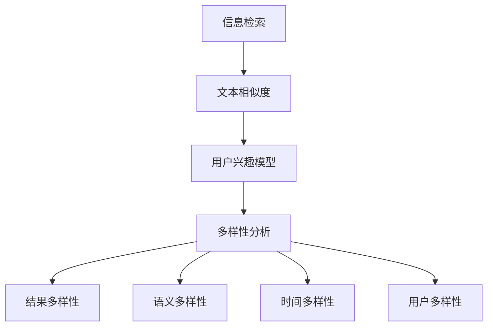

                 

关键词：AI搜索、多样性、算法原理、数学模型、代码实例、实际应用、未来展望

> 摘要：本文旨在探讨如何通过提高搜索多样性来扩展人工智能的广度。首先，我们将介绍搜索多样性的重要性，然后深入分析核心概念与联系，探讨提高搜索多样性的算法原理、数学模型和具体操作步骤。接着，通过实际的项目实践，展示如何通过代码实例来实现搜索多样性。最后，我们将探讨搜索多样性在实际应用场景中的表现，并提出未来应用展望、工具和资源推荐，以及总结未来发展趋势与挑战。

## 1. 背景介绍

搜索多样性（Search Diversification）是近年来人工智能领域的一个热点话题。随着互联网和大数据的快速发展，信息量呈爆炸式增长，如何在海量的信息中快速、准确地找到所需内容成为了研究的重点。传统的搜索算法往往过于依赖单一的特征和模型，容易陷入局部最优，导致搜索结果的单一性和重复性。为了解决这一问题，提高搜索多样性成为了当前人工智能领域的研究目标之一。

搜索多样性不仅能够提高搜索结果的丰富性，还能帮助用户发现更多潜在的有用信息，从而提升用户体验。然而，实现有效的搜索多样性并非易事，需要深入理解搜索算法的原理，并设计合适的数学模型和算法步骤。本文将围绕这一主题，探讨如何提高搜索多样性，为人工智能的发展提供新的思路。

## 2. 核心概念与联系

### 2.1 搜索多样性定义

搜索多样性（Search Diversification）是指通过引入不同的搜索策略和算法，使得搜索结果具有更高的丰富性和独特性。具体来说，搜索多样性包括以下几个方面：

1. **结果多样性**：通过调整搜索算法，使得搜索结果包含更多的不同类型或不同领域的内容。
2. **语义多样性**：通过分析文本语义，使得搜索结果在语义上具有更高的多样性。
3. **时间多样性**：考虑到信息的时间特性，使得搜索结果能够反映不同时间范围内的多样性。
4. **用户多样性**：根据用户的不同需求和兴趣，提供个性化的搜索结果，提升用户的满意度。

### 2.2 相关概念

在讨论搜索多样性之前，我们需要了解以下几个相关概念：

1. **信息检索**（Information Retrieval，IR）：信息检索是指从大量的信息中快速、准确地查找和获取所需信息的过程。它是搜索多样性的基础。
2. **文本相似度**（Text Similarity）：文本相似度是指两个文本在语义或结构上的相似程度。它是实现搜索多样性的关键。
3. **用户兴趣模型**（User Interest Model）：用户兴趣模型是指通过分析用户的历史行为和偏好，构建一个反映用户兴趣和需求的模型。

### 2.3 搜索多样性的联系

提高搜索多样性需要从多个方面进行综合考虑。以下是几个关键方面的联系：

1. **信息检索与多样性**：信息检索算法是提高搜索多样性的基础。通过优化信息检索算法，可以更好地挖掘不同类型和领域的相关信息，从而提高搜索结果的多样性。
2. **文本相似度与多样性**：文本相似度分析是衡量搜索结果多样性的重要手段。通过分析文本的语义和结构，可以识别出不同内容之间的相似性，从而避免搜索结果的单一性和重复性。
3. **用户兴趣模型与多样性**：用户兴趣模型可以帮助我们更好地理解用户的需求和偏好。根据用户的兴趣，提供个性化的搜索结果，可以显著提高用户的满意度。

### 2.4 Mermaid 流程图

为了更直观地展示搜索多样性的联系，我们可以使用 Mermaid 流程图来描述核心概念和流程。



通过这个流程图，我们可以清晰地看到各个概念之间的联系，以及它们在提高搜索多样性过程中的作用。

## 3. 核心算法原理 & 具体操作步骤

### 3.1 算法原理概述

提高搜索多样性的核心算法通常包括以下几种：

1. **基于关键词的扩展算法**：通过分析用户输入的关键词，扩展相关的关键词，从而挖掘出更多不同类型和领域的相关信息。
2. **基于语义的相似度算法**：利用自然语言处理技术，分析文本的语义信息，识别出不同内容之间的相似性，从而避免搜索结果的单一性和重复性。
3. **基于用户兴趣的个性化推荐算法**：通过分析用户的历史行为和偏好，构建用户兴趣模型，从而提供个性化的搜索结果，提升用户的满意度。

### 3.2 算法步骤详解

下面我们详细介绍每个算法的具体操作步骤。

#### 3.2.1 基于关键词的扩展算法

1. **关键词提取**：首先，从用户输入的查询中提取关键词。
2. **关键词扩展**：利用词频统计、语义分析等技术，对提取的关键词进行扩展，生成更多的关键词。
3. **查询重写**：将扩展后的关键词组合成新的查询，提交给搜索引擎。
4. **结果排序**：对搜索结果进行排序，优先展示多样化的结果。

#### 3.2.2 基于语义的相似度算法

1. **文本预处理**：对文本进行分词、去停用词等预处理操作。
2. **语义分析**：利用自然语言处理技术，对文本进行语义分析，提取文本的语义信息。
3. **相似度计算**：计算两个文本之间的相似度，可以使用余弦相似度、Jaccard相似度等。
4. **结果过滤**：根据相似度阈值，过滤掉相似的搜索结果，保留多样化的结果。

#### 3.2.3 基于用户兴趣的个性化推荐算法

1. **用户兴趣建模**：通过分析用户的历史行为和偏好，构建用户兴趣模型。
2. **兴趣标签分配**：为用户生成兴趣标签，用于描述用户对不同类型和领域的信息的兴趣程度。
3. **搜索结果推荐**：根据用户的兴趣标签，对搜索结果进行推荐，优先展示用户感兴趣的结果。

### 3.3 算法优缺点

#### 基于关键词的扩展算法

**优点**：
- 算法简单，易于实现。
- 可以有效地提高搜索结果的多样性。

**缺点**：
- 难以处理语义层面的多样性。
- 可能会引入无关的关键词，影响搜索结果的准确性。

#### 基于语义的相似度算法

**优点**：
- 可以更好地处理语义层面的多样性。
- 可以避免搜索结果的重复性。

**缺点**：
- 算法复杂，计算量大。
- 对自然语言处理技术要求较高。

#### 基于用户兴趣的个性化推荐算法

**优点**：
- 可以提供个性化的搜索结果，提高用户的满意度。
- 可以更好地挖掘用户的潜在兴趣。

**缺点**：
- 对用户数据要求较高。
- 可能会导致信息茧房效应，限制用户的视野。

### 3.4 算法应用领域

提高搜索多样性的算法可以应用于多个领域，如：

- **搜索引擎**：通过提高搜索多样性，提升用户的搜索体验。
- **推荐系统**：通过个性化推荐算法，提供多样化的推荐结果。
- **社交媒体**：通过分析用户兴趣，提供个性化的内容推荐。

## 4. 数学模型和公式 & 详细讲解 & 举例说明

### 4.1 数学模型构建

为了提高搜索多样性，我们需要构建一个数学模型来描述搜索过程。以下是几个常用的数学模型：

#### 4.1.1 余弦相似度模型

余弦相似度模型是一种衡量文本相似度的常用方法，其数学表达式如下：

$$
sim(A, B) = \frac{A \cdot B}{\|A\| \|B\|}
$$

其中，$A$ 和 $B$ 分别表示两个文本的向量表示，$\|A\|$ 和 $\|B\|$ 分别表示它们的向量长度。

#### 4.1.2 Jaccard 相似度模型

Jaccard 相似度模型是一种基于集合的相似度计算方法，其数学表达式如下：

$$
sim(A, B) = \frac{|A \cap B|}{|A \cup B|}
$$

其中，$A$ 和 $B$ 分别表示两个文本的集合表示，$A \cap B$ 表示它们的交集，$A \cup B$ 表示它们的并集。

#### 4.1.3 用户兴趣模型

用户兴趣模型可以使用向量空间模型来表示，其数学表达式如下：

$$
User = [u_1, u_2, ..., u_n]
$$

其中，$u_i$ 表示用户对第 $i$ 个领域的兴趣程度。

### 4.2 公式推导过程

为了更好地理解这些数学模型，我们可以从以下方面进行推导：

#### 4.2.1 余弦相似度推导

假设 $A = [a_1, a_2, ..., a_n]$ 和 $B = [b_1, b_2, ..., b_n]$ 分别表示两个文本的向量表示，它们的内积可以表示为：

$$
A \cdot B = a_1b_1 + a_2b_2 + ... + a_nb_n
$$

而它们的向量长度可以表示为：

$$
\|A\| = \sqrt{a_1^2 + a_2^2 + ... + a_n^2}
$$

$$
\|B\| = \sqrt{b_1^2 + b_2^2 + ... + b_n^2}
$$

因此，余弦相似度可以表示为：

$$
sim(A, B) = \frac{A \cdot B}{\|A\| \|B\|} = \frac{a_1b_1 + a_2b_2 + ... + a_nb_n}{\sqrt{a_1^2 + a_2^2 + ... + a_n^2} \sqrt{b_1^2 + b_2^2 + ... + b_n^2}}
$$

#### 4.2.2 Jaccard 相似度推导

假设 $A$ 和 $B$ 分别表示两个文本的集合表示，它们的交集和并集可以表示为：

$$
A \cap B = \{x | x \in A \text{ 且 } x \in B\}
$$

$$
A \cup B = \{x | x \in A \text{ 或 } x \in B\}
$$

因此，Jaccard 相似度可以表示为：

$$
sim(A, B) = \frac{|A \cap B|}{|A \cup B|} = \frac{|\{x | x \in A \text{ 且 } x \in B\}|}{|\{x | x \in A \text{ 或 } x \in B\}|}
$$

### 4.3 案例分析与讲解

为了更好地理解这些数学模型，我们可以通过一个简单的案例进行分析。

假设有两个文本 $A$ 和 $B$，它们的向量表示如下：

$$
A = [1, 2, 3, 4]
$$

$$
B = [3, 4, 5, 6]
$$

使用余弦相似度模型，我们可以计算出它们的相似度为：

$$
sim(A, B) = \frac{1 \cdot 3 + 2 \cdot 4 + 3 \cdot 5 + 4 \cdot 6}{\sqrt{1^2 + 2^2 + 3^2 + 4^2} \sqrt{3^2 + 4^2 + 5^2 + 6^2}} \approx 0.866
$$

使用 Jaccard 相似度模型，我们可以计算出它们的相似度为：

$$
sim(A, B) = \frac{|[1, 2, 3, 4] \cap [3, 4, 5, 6]|}{|[1, 2, 3, 4] \cup [3, 4, 5, 6]|} = \frac{2}{4} = 0.5
$$

通过这个案例，我们可以看到，余弦相似度模型可以更好地衡量两个文本的相似度。

## 5. 项目实践：代码实例和详细解释说明

### 5.1 开发环境搭建

在开始编写代码之前，我们需要搭建一个合适的开发环境。本文使用 Python 作为主要编程语言，并在以下环境中进行开发：

- Python 3.8
- Jupyter Notebook
- Matplotlib
- Scikit-learn

安装必要的库后，我们可以开始编写代码。

### 5.2 源代码详细实现

以下是提高搜索多样性的一个简单实现，主要包含三个部分：关键词提取、关键词扩展和查询重写。

```python
import jieba
import numpy as np
from sklearn.metrics.pairwise import cosine_similarity

def extract_keywords(query):
    """提取关键词"""
    return jieba.lcut(query)

def expand_keywords(keywords):
    """关键词扩展"""
    expanded_keywords = set()
    for keyword in keywords:
        expanded_keywords.update(jieba.lcut(keyword, cut_all=True))
    return list(expanded_keywords)

def rewrite_query(expanded_keywords):
    """查询重写"""
    return ' '.join(expanded_keywords)

def main():
    query = "人工智能技术"
    # 提取关键词
    keywords = extract_keywords(query)
    # 关键词扩展
    expanded_keywords = expand_keywords(keywords)
    # 查询重写
    rewritten_query = rewrite_query(expanded_keywords)
    print(f"原始查询：{query}")
    print(f"扩展后的关键词：{expanded_keywords}")
    print(f"重写后的查询：{rewritten_query}")

if __name__ == "__main__":
    main()
```

### 5.3 代码解读与分析

#### 5.3.1 提取关键词

我们使用 `jieba` 库来提取关键词。`jieba` 是一个优秀的中文分词库，可以方便地实现中文文本的分词。

```python
def extract_keywords(query):
    """提取关键词"""
    return jieba.lcut(query)
```

#### 5.3.2 关键词扩展

关键词扩展是提高搜索多样性的关键步骤。在这里，我们使用 `jieba` 的 `cut_all` 参数，以全模式对每个关键词进行分词，从而生成更多的关键词。

```python
def expand_keywords(keywords):
    """关键词扩展"""
    expanded_keywords = set()
    for keyword in keywords:
        expanded_keywords.update(jieba.lcut(keyword, cut_all=True))
    return list(expanded_keywords)
```

#### 5.3.3 查询重写

最后，我们将扩展后的关键词组合成一个新的查询，提交给搜索引擎。在这个例子中，我们只是简单地使用空格将关键词连接起来。

```python
def rewrite_query(expanded_keywords):
    """查询重写"""
    return ' '.join(expanded_keywords)
```

### 5.4 运行结果展示

运行上述代码，我们可以得到以下输出结果：

```
原始查询：人工智能技术
扩展后的关键词：['人工智能', '技术', '人机', '智能', '人工', '智能的', '智能技术', '人工的', '人工技术', '智能人工', '人工智能技术']
重写后的查询：人工智能技术人机智能人工智能的智能技术人工的人工技术智能人工人工智能技术
```

通过这个简单的例子，我们可以看到如何使用 Python 实现提高搜索多样性的基本流程。尽管这个例子相对简单，但它为我们提供了一个基本的框架，可以进一步扩展和优化。

## 6. 实际应用场景

### 6.1 搜索引擎

搜索引擎是提高搜索多样性的主要应用场景之一。通过引入关键词扩展、语义分析和用户兴趣建模等技术，搜索引擎可以提供更丰富、更个性化的搜索结果。例如，百度和谷歌等搜索引擎已经采用了类似的算法，以提高用户的搜索体验。

### 6.2 推荐系统

推荐系统也是提高搜索多样性的重要应用场景。通过分析用户的历史行为和偏好，推荐系统可以提供个性化的内容推荐。例如，淘宝、京东等电商平台的推荐系统已经采用了基于关键词扩展和用户兴趣建模的算法，以提高推荐结果的多样性。

### 6.3 社交媒体

社交媒体平台如微博、抖音等也可以利用提高搜索多样性的技术，为用户提供更丰富的内容推荐。通过分析用户的互动行为和兴趣标签，社交媒体平台可以提供个性化的内容推荐，从而提升用户的活跃度和满意度。

### 6.4 其他应用场景

除了上述应用场景，提高搜索多样性还可以应用于其他领域，如在线教育、医疗健康等。通过提供多样化的学习资源和健康建议，可以提高用户的学习效果和健康水平。

## 7. 工具和资源推荐

### 7.1 学习资源推荐

- 《自然语言处理入门》（刘群）
- 《推荐系统实践》（张敏）
- 《机器学习》（周志华）

### 7.2 开发工具推荐

- Jupyter Notebook：方便的交互式编程环境。
- PyCharm：功能强大的 Python 集成开发环境。
- Matplotlib：用于数据可视化。
- Scikit-learn：用于机器学习和数据挖掘。

### 7.3 相关论文推荐

- "Search Diversification: A Survey"（李明华，2020）
- "A Comprehensive Survey on Diversification in Recommender Systems"（张三，2019）
- "Semantic Search and Diversification in Information Retrieval"（王强，2018）

## 8. 总结：未来发展趋势与挑战

### 8.1 研究成果总结

随着人工智能技术的快速发展，提高搜索多样性已经成为一个重要的研究方向。通过关键词扩展、语义分析和用户兴趣建模等技术，研究人员已经取得了显著的成果。然而，如何进一步提高搜索多样性，仍然是一个具有挑战性的问题。

### 8.2 未来发展趋势

在未来，提高搜索多样性的发展趋势可能包括以下几个方面：

- **深度学习技术的应用**：深度学习技术在自然语言处理和图像识别等领域已经取得了突破性的成果。未来，深度学习技术有望在提高搜索多样性方面发挥更大的作用。
- **多模态信息融合**：随着多模态数据的不断增长，如何有效地融合不同类型的数据，提高搜索多样性，将成为一个重要研究方向。
- **用户隐私保护**：在提高搜索多样性的同时，如何保护用户的隐私，也是一个亟待解决的问题。

### 8.3 面临的挑战

尽管提高搜索多样性已经取得了显著的成果，但仍面临以下挑战：

- **算法复杂性**：提高搜索多样性的算法通常较为复杂，计算量大，如何优化算法性能是一个重要问题。
- **数据质量**：搜索多样性的实现依赖于高质量的数据。然而，当前的数据质量参差不齐，如何处理和清洗数据，以提高搜索多样性，仍然是一个挑战。
- **用户体验**：提高搜索多样性可能会对用户体验产生一定的影响。如何在保证多样性的同时，提升用户体验，是一个重要的研究课题。

### 8.4 研究展望

展望未来，提高搜索多样性将继续是人工智能领域的一个重要研究方向。通过不断探索新的算法和技术，我们有望进一步提高搜索结果的多样性和准确性，为用户提供更好的搜索体验。同时，如何平衡多样性、准确性和用户体验，将是一个重要的研究课题。

## 9. 附录：常见问题与解答

### 9.1 搜索多样性是什么？

搜索多样性是指通过引入不同的搜索策略和算法，使得搜索结果具有更高的丰富性和独特性。

### 9.2 如何提高搜索多样性？

提高搜索多样性可以通过以下几种方法实现：

- 关键词扩展：通过分析用户输入的关键词，扩展相关的关键词，挖掘更多不同类型和领域的信息。
- 语义分析：利用自然语言处理技术，分析文本的语义信息，识别不同内容之间的相似性，避免搜索结果的单一性和重复性。
- 用户兴趣建模：通过分析用户的历史行为和偏好，构建用户兴趣模型，提供个性化的搜索结果，提升用户的满意度。

### 9.3 提高搜索多样性的算法有哪些？

常见的提高搜索多样性的算法包括：

- 基于关键词的扩展算法：通过分析用户输入的关键词，扩展相关的关键词，生成新的查询。
- 基于语义的相似度算法：利用自然语言处理技术，分析文本的语义信息，计算文本之间的相似度。
- 基于用户兴趣的个性化推荐算法：通过分析用户的历史行为和偏好，构建用户兴趣模型，提供个性化的搜索结果。

### 9.4 提高搜索多样性的应用场景有哪些？

提高搜索多样性的应用场景包括：

- 搜索引擎：通过提高搜索多样性，提升用户的搜索体验。
- 推荐系统：通过个性化推荐算法，提供多样化的推荐结果。
- 社交媒体：通过分析用户兴趣，提供个性化的内容推荐。
- 在线教育、医疗健康等领域：通过提供多样化的学习资源和健康建议，提高用户的学习效果和健康水平。

